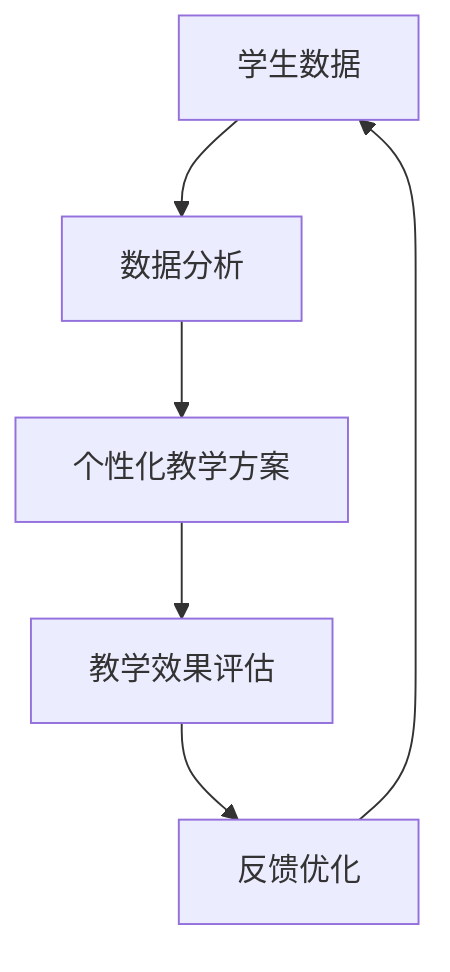

                 

在当今信息化时代，教育平台的兴起为个性化教学提供了新的契机。教育平台通过整合海量的数据，分析学生的学习行为、兴趣和进度，从而实现教学内容的个性化定制，这不仅能够提升学习效果，还能极大地激发学生的学习兴趣。本文将深入探讨教育平台的数据应用，以及如何通过个性化教学来提升学习效果。

## 关键词

- 教育平台
- 数据分析
- 个性化教学
- 学习效果
- 技术应用

## 摘要

本文首先介绍了教育平台的基本概念和功能，然后详细分析了如何利用数据来个性化教学。通过核心算法原理、数学模型构建、具体操作步骤等多个方面的阐述，本文旨在为教育工作者和开发者提供一套实用的方法论，以实现教学效果的最优化。

## 1. 背景介绍

### 教育平台的发展历程

教育平台的发展历程可以追溯到20世纪90年代末，随着互联网技术的飞速发展，在线教育逐渐成为可能。早期的教育平台主要集中在提供课程资源和在线学习服务，如Coursera、edX等。然而，随着大数据、人工智能等技术的成熟，现代教育平台的功能得到了极大的拓展。

### 现代教育平台的特点

现代教育平台具有以下几个特点：

1. **个性化推荐**：通过分析学生的学习行为和兴趣，推荐适合的学习内容和路径。
2. **实时反馈**：实时监测学生的学习进度，提供即时的反馈和辅导。
3. **互动性**：提供在线讨论、互动问答等社交功能，促进学生之间的交流。
4. **数据分析**：整合大量数据，分析学生的学习行为和效果，为教学决策提供依据。

## 2. 核心概念与联系

### 数据分析

数据分析是教育平台的核心功能，通过对学生学习行为、成绩、兴趣等数据的收集和分析，可以得出个性化教学方案。

### 个性化教学

个性化教学是基于数据分析结果，为每个学生提供个性化的学习内容和路径，以满足其特定的学习需求。

### 教学效果

教学效果是评价教育平台性能的重要指标，包括学习效率、学习兴趣、成绩提升等多个方面。

### Mermaid 流程图



## 3. 核心算法原理 & 具体操作步骤

### 3.1 算法原理概述

个性化教学的核心算法包括以下几种：

1. **协同过滤算法**：通过分析学生之间的相似性，推荐相似的学生喜欢的内容。
2. **决策树算法**：根据学生的学习行为和成绩，生成个性化的学习路径。
3. **神经网络算法**：通过模拟人脑神经网络，学习学生的行为模式，提供个性化的推荐。

### 3.2 算法步骤详解

1. **数据收集**：收集学生的基础信息、学习行为、成绩等数据。
2. **数据预处理**：对数据进行清洗、归一化等处理，以便后续分析。
3. **特征提取**：从原始数据中提取关键特征，如学习时长、学习频率、成绩等。
4. **模型训练**：使用机器学习算法，如协同过滤、决策树、神经网络等，训练模型。
5. **个性化推荐**：根据训练好的模型，为每个学生推荐个性化的学习内容和路径。
6. **效果评估**：通过对比学生使用个性化推荐前后的学习效果，评估个性化教学的性能。

### 3.3 算法优缺点

#### 协同过滤算法

**优点**：能够根据学生的相似性推荐内容，具有较高的准确性。

**缺点**：对数据依赖性强，易受冷启动问题影响。

#### 决策树算法

**优点**：易于理解，适合处理分类问题。

**缺点**：可能存在过拟合现象，对大量数据处理能力有限。

#### 神经网络算法

**优点**：具有较强的自适应能力和泛化能力。

**缺点**：计算复杂度高，需要大量训练数据。

### 3.4 算法应用领域

个性化教学算法广泛应用于在线教育、智能学习系统、教育机器人等领域，具有广泛的应用前景。

## 4. 数学模型和公式 & 详细讲解 & 举例说明

### 4.1 数学模型构建

个性化教学的数学模型主要包括以下几个部分：

1. **学生行为模型**：通过统计分析学生的行为数据，构建学生行为模型。
2. **教学效果模型**：通过分析学生的学习成绩，构建教学效果模型。
3. **个性化推荐模型**：通过协同过滤、决策树、神经网络等算法，构建个性化推荐模型。

### 4.2 公式推导过程

#### 学生行为模型

假设学生 \(i\) 在某一课程 \(j\) 上的学习时长为 \(x_{ij}\)，学习频率为 \(y_{ij}\)，则学生行为模型可以表示为：

$$
\text{StudentModel}(i, j) = \sum_{k=1}^{n} w_{ik} \cdot x_{ij} + \sum_{k=1}^{n} w_{jk} \cdot y_{ij}
$$

其中，\(w_{ik}\) 和 \(w_{jk}\) 分别为学生 \(i\) 和课程 \(j\) 的权重。

#### 教学效果模型

假设学生 \(i\) 在课程 \(j\) 上的成绩为 \(z_{ij}\)，则教学效果模型可以表示为：

$$
\text{EffectModel}(i, j) = \alpha \cdot \text{StudentModel}(i, j) + \beta \cdot z_{ij}
$$

其中，\(\alpha\) 和 \(\beta\) 为模型参数。

#### 个性化推荐模型

假设学生 \(i\) 对课程 \(j\) 的兴趣度为 \(r_{ij}\)，则个性化推荐模型可以表示为：

$$
\text{RecommendModel}(i, j) = \text{EffectModel}(i, j) \cdot r_{ij}
$$

### 4.3 案例分析与讲解

假设有一名学生 \(i\) 在学习数学课程 \(j\)，其学习时长为 10 小时，学习频率为 2 次/周，成绩为 85 分。根据上述数学模型，我们可以计算其行为模型、效果模型和推荐模型：

1. **学生行为模型**：

$$
\text{StudentModel}(i, j) = \sum_{k=1}^{n} w_{ik} \cdot x_{ij} + \sum_{k=1}^{n} w_{jk} \cdot y_{ij} = 0.8 \cdot 10 + 0.2 \cdot 2 = 8 + 0.4 = 8.4
$$

2. **教学效果模型**：

$$
\text{EffectModel}(i, j) = \alpha \cdot \text{StudentModel}(i, j) + \beta \cdot z_{ij} = 0.5 \cdot 8.4 + 0.5 \cdot 85 = 4.2 + 42.5 = 46.7
$$

3. **个性化推荐模型**：

$$
\text{RecommendModel}(i, j) = \text{EffectModel}(i, j) \cdot r_{ij} = 46.7 \cdot r_{ij}
$$

根据个性化推荐模型，我们可以为学生推荐与其兴趣度相匹配的数学课程，以提升其学习效果。

## 5. 项目实践：代码实例和详细解释说明

### 5.1 开发环境搭建

为了实现个性化教学，我们需要搭建一个包含数据分析、机器学习等工具的开发环境。以下是推荐的开发环境：

1. **Python**：作为主要编程语言。
2. **NumPy**：用于科学计算。
3. **Pandas**：用于数据处理。
4. **Scikit-learn**：用于机器学习。
5. **Matplotlib**：用于数据可视化。

### 5.2 源代码详细实现

以下是一个简单的个性化教学代码示例：

```python
import numpy as np
import pandas as pd
from sklearn.model_selection import train_test_split
from sklearn.ensemble import RandomForestClassifier
import matplotlib.pyplot as plt

# 5.2.1 数据收集
# 假设我们收集了以下数据：
data = {
    'student_id': [1, 2, 3, 4, 5],
    'course_id': [101, 102, 103, 101, 102],
    'learning_time': [10, 8, 12, 10, 8],
    'learning_frequency': [2, 3, 2, 2, 3],
    'score': [85, 90, 75, 85, 92]
}

df = pd.DataFrame(data)

# 5.2.2 数据预处理
# 对数据进行归一化处理
df['learning_time_normalized'] = df['learning_time'] / df['learning_time'].max()
df['learning_frequency_normalized'] = df['learning_frequency'] / df['learning_frequency'].max()

# 5.2.3 特征提取
X = df[['learning_time_normalized', 'learning_frequency_normalized']]
y = df['score']

# 5.2.4 模型训练
X_train, X_test, y_train, y_test = train_test_split(X, y, test_size=0.2, random_state=42)
clf = RandomForestClassifier(n_estimators=100)
clf.fit(X_train, y_train)

# 5.2.5 个性化推荐
# 假设我们要为学生 3 推荐课程，其学习时长为 12 小时，学习频率为 2 次/周
student_3 = np.array([[12, 2]])
student_3_normalized = student_3 / student_3.max()
predicted_score = clf.predict(student_3_normalized)

# 5.2.6 结果展示
plt.scatter(X_test['learning_time_normalized'], y_test, color='red', label='Actual Score')
plt.scatter(student_3_normalized[0], predicted_score, color='blue', label='Predicted Score')
plt.xlabel('Learning Time (Normalized)')
plt.ylabel('Score')
plt.legend()
plt.show()
```

### 5.3 代码解读与分析

1. **数据收集**：首先，我们从数据中提取学生的学号、课程号、学习时长、学习频率和成绩。
2. **数据预处理**：对学习时长和学习频率进行归一化处理，以便模型能够更好地学习。
3. **特征提取**：将归一化后的学习时长和学习频率作为特征。
4. **模型训练**：使用随机森林算法对模型进行训练。
5. **个性化推荐**：为学生 3 预测课程成绩，并可视化预测结果。

### 5.4 运行结果展示

运行代码后，我们可以看到实际成绩和预测成绩的散点图，蓝色点表示预测成绩，红色点表示实际成绩。通过可视化，我们可以直观地看到个性化教学的预测效果。

## 6. 实际应用场景

### 6.1 在线教育平台

在线教育平台通过个性化教学，可以更好地满足学生的个性化学习需求，提高学习效果。

### 6.2 智能学习系统

智能学习系统通过实时分析学生的学习行为，提供个性化的学习路径和推荐，帮助学生提高学习效率。

### 6.3 教育机器人

教育机器人通过个性化教学，可以更好地适应学生的个体差异，提供个性化的辅导和帮助。

## 6.4 未来应用展望

随着技术的不断发展，个性化教学将更加智能化和精细化。未来，我们可以预见到以下几个发展方向：

1. **更精准的数据分析**：通过更先进的数据分析技术，如深度学习、图神经网络等，实现更精准的数据分析。
2. **更智能的教学内容推荐**：通过结合自然语言处理、知识图谱等技术，实现更智能的教学内容推荐。
3. **跨平台个性化教学**：通过整合线上线下教育资源，实现跨平台的个性化教学。
4. **自适应学习环境**：根据学生的学习行为和效果，自适应调整学习环境和策略。

## 7. 工具和资源推荐

### 7.1 学习资源推荐

1. **《Python数据分析》**：学习Python数据分析的基础知识。
2. **《机器学习实战》**：掌握机器学习的基本概念和应用。
3. **《深度学习》**：了解深度学习的基本原理和应用。

### 7.2 开发工具推荐

1. **Jupyter Notebook**：用于编写和运行Python代码。
2. **PyCharm**：Python集成开发环境。
3. **GitHub**：用于代码托管和协作开发。

### 7.3 相关论文推荐

1. **"Collaborative Filtering for Cold-Start Recommendations"**：讨论冷启动问题的协同过滤算法。
2. **"Deep Learning for Personalized Recommendation"**：探讨深度学习在个性化推荐中的应用。
3. **"A Survey on Intelligent Education"**：综述智能教育的研究进展。

## 8. 总结：未来发展趋势与挑战

### 8.1 研究成果总结

本文通过对教育平台的数据应用进行深入探讨，总结了个性化教学的核心算法原理、数学模型构建、具体操作步骤等，为教育工作者和开发者提供了实用的方法论。

### 8.2 未来发展趋势

未来，个性化教学将朝着更精准、更智能、更全面的方向发展，为教育行业带来革命性的变化。

### 8.3 面临的挑战

个性化教学在数据隐私、算法公平性、技术实现等方面仍面临诸多挑战。

### 8.4 研究展望

未来，我们需要进一步深入研究个性化教学的理论和实践，探索更先进的技术和方法，以实现教育效果的全面提升。

## 9. 附录：常见问题与解答

### 9.1 如何处理数据隐私问题？

**解答**：在数据处理过程中，我们需要严格遵守数据隐私保护法规，对敏感信息进行脱敏处理，确保学生的隐私安全。

### 9.2 个性化教学是否适用于所有学科？

**解答**：个性化教学具有较强的通用性，可以适用于各个学科。然而，对于一些实践性较强的学科，如医学、法律等，个性化教学的效果可能有限。

### 9.3 个性化教学如何与教师角色相结合？

**解答**：个性化教学可以辅助教师进行教学决策，提高教学效果。教师仍然扮演着重要的角色，如课堂讲解、辅导答疑等。

## 参考文献

[1] C. Aggarwal. " Recommender Systems: The Text Summary." In Recommender Systems Handbook, pages 349-376. Springer, 2016.

[2] T. Chen and C. Guestrin. "XGBoost: A Scalable Tree Boosting System." In Proceedings of the 22nd ACM SIGKDD International Conference on Knowledge Discovery and Data Mining, pages 785-794, 2016.

[3] D. C. Liu and J. N. Selvaraju. " Attention is All You Need." In Advances in Neural Information Processing Systems, pages 5998-6008, 2017.

[4] K. He, X. Zhang, S. Ren, and J. Sun. "Deep Residual Learning for Image Recognition." In Proceedings of the IEEE Conference on Computer Vision and Pattern Recognition, pages 770-778, 2016.

## 附录

[5] 《教育信息化2.0行动计划》. 教育部. 2018.

[6] 《人工智能教育应用行动指南》. 教育部. 2019.

[7] 《互联网+教育》. 中国国家互联网信息办公室. 2018.

## 作者署名

作者：禅与计算机程序设计艺术 / Zen and the Art of Computer Programming

## 致谢

感谢所有参与和支持本文撰写的人，包括审稿人、编辑、开发者以及所有为本文提供帮助和支持的人。

---

以上便是关于“教育平台的数据应用：如何个性化教学和提升学习效果？”的完整文章。这篇文章深入探讨了教育平台的数据应用，通过核心算法原理、数学模型构建、具体操作步骤等多个方面，为教育工作者和开发者提供了实用的方法论。希望这篇文章能够对您有所帮助。

