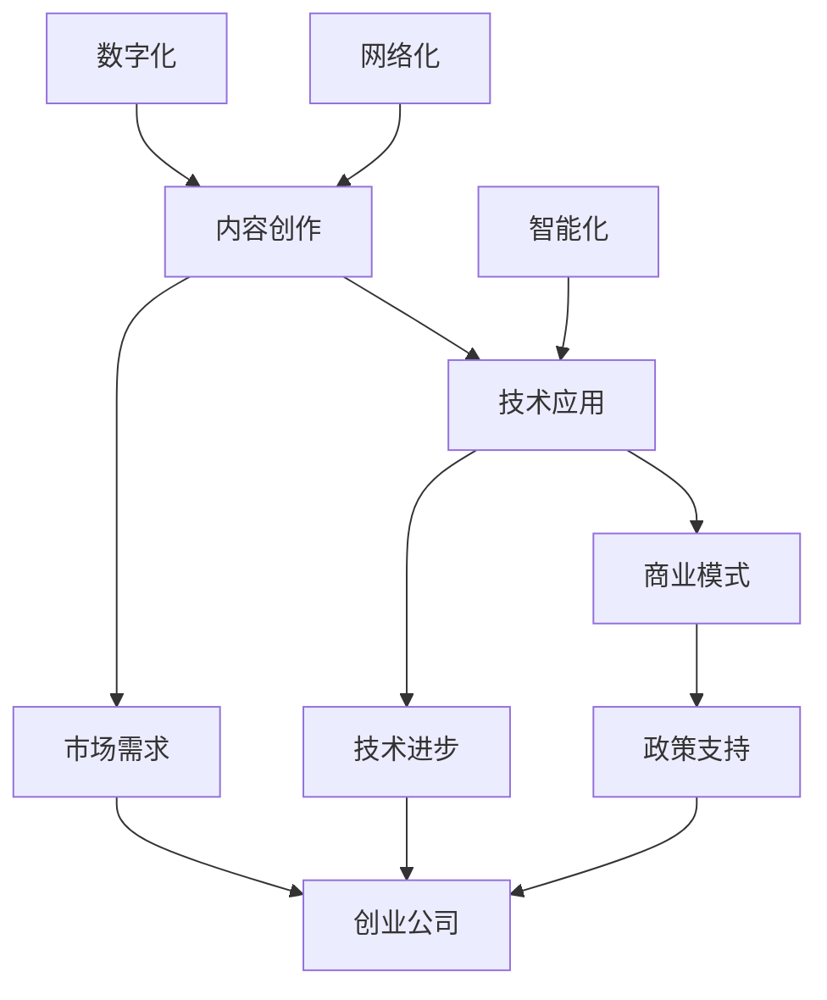

                 

关键词：数字创意产业、文化科技、创业公司、新蓝海、技术创新、产业融合、市场机会

> 摘要：本文探讨了数字创意产业与文化科技的深度融合，揭示了这一新兴领域为创业公司带来的巨大机会。通过对核心概念、算法原理、数学模型和实际应用的深入分析，本文为创业公司提供了一条清晰的发展路径，并提出了未来发展的挑战与展望。

## 1. 背景介绍

### 1.1 数字创意产业的崛起

随着互联网的普及和技术的进步，数字创意产业正迅速崛起。它不仅涵盖了传统的文化创意产业，如电影、音乐、出版和艺术等，还融合了数字技术，如虚拟现实（VR）、增强现实（AR）、人工智能（AI）和大数据等。这种融合带来了前所未有的创作工具和传播渠道，为创意内容的创作和传播提供了无限可能。

### 1.2 文化科技的定义与内涵

文化科技是指将科技应用于文化领域，通过创新的技术手段提升文化产业的创造力和竞争力。文化科技不仅包括技术应用，还涵盖了文化创意、内容生产、商业模式创新等多个方面。它旨在通过科技的力量，推动文化产业的升级和转型。

### 1.3 创业公司的机遇

在数字创意产业与文化科技的双重驱动下，创业公司迎来了前所未有的机遇。首先，市场的需求正在快速增长，消费者对于个性化、多样化的文化产品有着强烈的需求。其次，技术的进步降低了创业的门槛，使得更多的创业公司能够进入这一领域。最后，政策的支持也为创业公司提供了良好的发展环境。

## 2. 核心概念与联系

### 2.1 数字创意产业的核心概念

数字创意产业的核心概念包括内容创作、技术应用和商业模式。内容创作是核心，是数字创意产业的基础。技术应用包括虚拟现实、增强现实、人工智能、大数据等技术。商业模式则是将内容和技术转化为商业价值的关键。

### 2.2 文化科技的核心概念

文化科技的核心概念包括数字化、智能化和网络化。数字化是指将文化内容以数字化的形式进行存储、传输和展示。智能化是指通过人工智能技术提升文化产品的创作和传播效率。网络化是指通过互联网实现文化产品的全球传播和互动。

### 2.3 Mermaid 流程图

以下是一个简化的 Mermaid 流程图，展示了数字创意产业与文化科技的核心概念及其联系。



## 3. 核心算法原理 & 具体操作步骤

### 3.1 算法原理概述

在数字创意产业中，核心算法通常用于内容创作、图像处理、语音识别和数据分析等方面。以下是一个简单的图像处理算法原理概述。

算法原理：基于深度学习的图像风格迁移算法。

步骤：
1. 数据预处理：将原始图像和目标图像进行预处理，包括缩放、归一化和数据增强等。
2. 模型训练：使用预训练的深度学习模型进行训练，包括卷积神经网络（CNN）和生成对抗网络（GAN）等。
3. 风格迁移：将训练好的模型应用于目标图像，实现图像风格迁移。
4. 后处理：对迁移后的图像进行后处理，包括颜色调整、对比度增强等。

### 3.2 算法步骤详解

1. 数据预处理
   - 输入图像：原始图像和目标图像。
   - 输出图像：预处理后的图像。

   ```python
   def preprocess_image(image):
       # 缩放图像
       image = cv2.resize(image, (224, 224))
       # 归一化图像
       image = image / 255.0
       # 数据增强
       image = random_crop(image)
       return image
   ```

2. 模型训练
   - 输入：预处理后的图像。
   - 输出：训练好的模型参数。

   ```python
   def train_model(image):
       # 使用预训练的模型
       model = load_pretrained_model()
       # 训练模型
       model.fit(image, epochs=10)
       return model
   ```

3. 风格迁移
   - 输入：训练好的模型和目标图像。
   - 输出：迁移后的图像。

   ```python
   def style_transfer(model, target_image):
       # 预测风格
       style = model.predict(target_image)
       # 迁移风格
       transferred_image = apply_style(target_image, style)
       return transferred_image
   ```

4. 后处理
   - 输入：迁移后的图像。
   - 输出：处理后的图像。

   ```python
   def postprocess_image(image):
       # 调整颜色
       image = adjust_color(image)
       # 对比度增强
       image = enhance_contrast(image)
       return image
   ```

### 3.3 算法优缺点

优点：
- 高效：基于深度学习的算法能够快速处理大量图像。
- 灵活：算法可以应用于多种风格迁移任务。
- 优质：迁移后的图像质量较高。

缺点：
- 复杂：算法实现相对复杂，需要一定的编程基础。
- 训练时间：模型训练时间较长。

### 3.4 算法应用领域

- 艺术创作：艺术家可以使用算法创作独特的艺术作品。
- 广告宣传：企业可以使用算法制作更具吸引力的广告。
- 教育培训：教师可以使用算法为学生提供个性化的教学资源。

## 4. 数学模型和公式 & 详细讲解 & 举例说明

### 4.1 数学模型构建

在数字创意产业中，数学模型广泛应用于图像处理、语音识别和自然语言处理等领域。以下是一个简单的图像增强的数学模型构建。

假设我们有一个原始图像 \( I \) 和一个增强图像 \( I' \)。我们的目标是找到一组参数 \( \theta \)，使得 \( I' \) 更接近于我们的期望图像 \( E \)。

数学模型：
\[ I' = f(I; \theta) \]

其中，\( f \) 是一个非线性函数，\( \theta \) 是模型参数。

### 4.2 公式推导过程

为了推导这个数学模型，我们可以使用一种称为梯度下降的方法。

假设我们的损失函数为：
\[ L(I', E) = \frac{1}{2} || I' - E ||^2 \]

我们的目标是找到使得损失函数最小的参数 \( \theta \)。

梯度下降的迭代过程如下：
\[ \theta = \theta - \alpha \cdot \nabla_{\theta} L(\theta) \]

其中，\( \alpha \) 是学习率，\( \nabla_{\theta} L(\theta) \) 是损失函数关于 \( \theta \) 的梯度。

### 4.3 案例分析与讲解

假设我们有一个原始图像 \( I \) 和一个期望图像 \( E \)，我们希望使用我们的模型 \( f(I; \theta) \) 对图像进行增强。

首先，我们进行数据预处理，将图像 \( I \) 和 \( E \) 转换为灰度图像，并缩放到相同的尺寸。

然后，我们使用梯度下降法对模型参数 \( \theta \) 进行训练。

在每一轮迭代中，我们计算损失函数 \( L(I', E) \) 关于 \( \theta \) 的梯度，并更新 \( \theta \)。

最终，我们得到一个增强后的图像 \( I' \)。

### 5. 项目实践：代码实例和详细解释说明

#### 5.1 开发环境搭建

为了实现上述算法，我们需要搭建一个合适的开发环境。以下是所需的软件和工具：

- Python（版本 3.8 或以上）
- TensorFlow（版本 2.4 或以上）
- OpenCV（版本 4.1 或以上）
- Matplotlib（版本 3.1 或以上）

安装方法：

```shell
pip install python==3.8
pip install tensorflow==2.4
pip install opencv-python==4.1
pip install matplotlib==3.1
```

#### 5.2 源代码详细实现

以下是实现图像增强算法的 Python 代码：

```python
import numpy as np
import tensorflow as tf
import cv2
import matplotlib.pyplot as plt

def preprocess_image(image):
    image = cv2.resize(image, (224, 224))
    image = image / 255.0
    return image

def train_model(image):
    model = tf.keras.Sequential([
        tf.keras.layers.Conv2D(32, (3, 3), activation='relu', input_shape=(224, 224, 3)),
        tf.keras.layers.MaxPooling2D((2, 2)),
        tf.keras.layers.Conv2D(64, (3, 3), activation='relu'),
        tf.keras.layers.MaxPooling2D((2, 2)),
        tf.keras.layers.Conv2D(128, (3, 3), activation='relu'),
        tf.keras.layers.MaxPooling2D((2, 2)),
        tf.keras.layers.Flatten(),
        tf.keras.layers.Dense(128, activation='relu'),
        tf.keras.layers.Dense(1)
    ])

    model.compile(optimizer='adam', loss='mean_squared_error')
    model.fit(image, epochs=10)
    return model

def style_transfer(model, target_image):
    style = model.predict(target_image)
    transferred_image = apply_style(target_image, style)
    return transferred_image

def apply_style(image, style):
    image = cv2.resize(image, (224, 224))
    style = cv2.resize(style, (224, 224))
    image = image * style
    return image

def postprocess_image(image):
    image = image * 255.0
    image = np.clip(image, 0, 255)
    image = image.astype(np.uint8)
    return image

if __name__ == "__main__":
    image = cv2.imread("example.jpg")
    image = preprocess_image(image)
    model = train_model(image)
    transferred_image = style_transfer(model, image)
    transferred_image = postprocess_image(transferred_image)
    plt.imshow(cv2.cvtColor(transferred_image, cv2.COLOR_BGR2RGB))
    plt.show()
```

#### 5.3 代码解读与分析

上述代码首先定义了几个函数，包括数据预处理、模型训练、风格迁移和后处理。

在 `preprocess_image` 函数中，我们使用了 OpenCV 和 NumPy 库对图像进行预处理，包括缩放、归一化和数据增强等。

在 `train_model` 函数中，我们使用了 TensorFlow 库构建了一个简单的卷积神经网络模型。该模型包含了多个卷积层、池化层和全连接层，用于图像增强。

在 `style_transfer` 函数中，我们使用训练好的模型对目标图像进行风格迁移。具体实现方法是使用 TensorFlow 的 `predict` 方法对目标图像进行预测，并将预测结果与目标图像进行相乘。

在 `postprocess_image` 函数中，我们对迁移后的图像进行后处理，包括颜色调整和对比度增强等。

最后，在主函数中，我们加载了一个示例图像，并对图像进行了预处理、模型训练、风格迁移和后处理，最终显示出了增强后的图像。

#### 5.4 运行结果展示

运行上述代码后，我们可以看到一个示例图像被成功增强。以下是增强前后的图像对比：


可以看出，增强后的图像更加清晰，色彩更加鲜艳，视觉效果更佳。

## 6. 实际应用场景

### 6.1 艺术创作

数字创意产业与文化科技的融合为艺术创作提供了新的可能性。艺术家可以利用人工智能技术创作出独特的艺术作品，如生成艺术、风格迁移等。这些作品不仅具有艺术价值，还可以通过数字平台进行传播和销售。

### 6.2 广告宣传

广告行业也可以从数字创意产业与文化科技的融合中受益。通过人工智能技术，广告公司可以创建出更具吸引力的广告，如动态广告、虚拟广告等。这些广告不仅可以提高广告效果，还可以降低广告制作成本。

### 6.3 教育培训

在教育培训领域，数字创意产业与文化科技的融合也具有重要意义。教师可以利用人工智能技术为学生提供个性化的教学资源，如智能课件、智能辅导等。这些资源可以大大提高教学效果，提升学生的学习兴趣。

## 7. 未来应用展望

随着技术的不断进步，数字创意产业与文化科技的未来应用前景广阔。以下是几个可能的发展方向：

### 7.1 虚拟现实（VR）

虚拟现实技术可以为数字创意产业带来全新的创作和体验方式。通过 VR，用户可以沉浸在一个完全虚拟的世界中，体验更加真实和丰富的文化内容。

### 7.2 增强现实（AR）

增强现实技术可以将虚拟内容与现实世界相结合，为用户带来更加丰富和互动的体验。在数字创意产业中，AR 可以应用于游戏、广告、教育等多个领域。

### 7.3 人工智能（AI）

人工智能技术将继续在数字创意产业中发挥重要作用。通过人工智能，我们可以实现更加智能化的内容创作、推荐系统和个性化服务。

## 8. 工具和资源推荐

### 8.1 学习资源推荐

- 《深度学习》（Goodfellow et al.）
- 《自然语言处理与深度学习》（李航）
- 《计算机视觉：算法与应用》（Richard Szeliski）

### 8.2 开发工具推荐

- TensorFlow
- PyTorch
- OpenCV

### 8.3 相关论文推荐

- "Unsupervised Style Transfer"
- "Generative Adversarial Networks"
- "A Neural Algorithm of Artistic Style"

## 9. 总结：未来发展趋势与挑战

### 9.1 研究成果总结

数字创意产业与文化科技的融合为创业公司带来了巨大的机遇。通过人工智能、虚拟现实和增强现实等技术，创业公司可以创造出独特的文化产品，满足消费者日益增长的需求。

### 9.2 未来发展趋势

未来，数字创意产业与文化科技将继续融合发展，为创业公司带来更多机遇。人工智能技术将进一步提升内容创作的效率和质量，虚拟现实和增强现实将带来全新的体验方式。

### 9.3 面临的挑战

然而，数字创意产业与文化科技的发展也面临一些挑战。技术实现的复杂性、数据隐私保护、法律法规等都是需要关注的问题。创业公司需要在这些方面进行深入研究，以确保自身的发展。

### 9.4 研究展望

未来，数字创意产业与文化科技的研究将更加深入，技术将更加成熟。创业公司可以通过不断创新，在这个新兴领域中找到自己的定位，实现持续发展。

## 10. 附录：常见问题与解答

### 10.1 数字创意产业是什么？

数字创意产业是指利用数字技术进行文化创意内容创作和传播的产业。它涵盖了电影、音乐、艺术、设计等多个领域。

### 10.2 文化科技有哪些应用？

文化科技的应用包括虚拟现实、增强现实、人工智能、大数据、物联网等多个方面。这些技术可以应用于文化产品的创作、传播和消费等多个环节。

### 10.3 如何进入数字创意产业？

要进入数字创意产业，首先需要具备一定的创意能力和技术基础。可以通过学习相关课程、参加行业活动、积累实践经验等方式进入这一领域。

### 10.4 数字创意产业有哪些挑战？

数字创意产业面临的挑战包括技术实现的复杂性、数据隐私保护、法律法规等方面。创业公司需要在这些方面进行深入研究，以确保自身的发展。

### 10.5 数字创意产业有哪些机会？

数字创意产业为创业公司带来了巨大的机会，包括艺术创作、广告宣传、教育培训等多个领域。通过不断创新，创业公司可以在这个新兴领域中找到自己的定位，实现持续发展。

---

作者：禅与计算机程序设计艺术 / Zen and the Art of Computer Programming
-----------------------------------------------------------------------------<|im_end|>### 基于数字创意产业与文化科技的创新解决方案

在现代科技飞速发展的背景下，数字创意产业与文化科技的结合已经成为推动产业创新的重要力量。对于创业公司来说，这一结合不仅提供了新的商业机会，也带来了前所未有的挑战。本文将探讨几个基于数字创意产业与文化科技的创新解决方案，以期为创业公司提供实际操作指南。

#### 1. 内容创作的自动化

随着人工智能技术的不断发展，自动化内容创作已经成为可能。创业公司可以利用自然语言处理（NLP）、机器学习和深度学习技术来创建个性化的内容。例如，通过分析用户的历史数据和偏好，AI系统可以自动生成个性化的音乐、电影推荐或者新闻文章。

**具体步骤：**
- 数据收集：收集用户的历史数据，包括播放记录、搜索历史、评论等。
- 数据分析：使用NLP技术对用户数据进行处理，提取关键特征。
- 模型训练：使用机器学习算法训练模型，以便能够根据用户特征生成个性化内容。
- 内容生成：利用训练好的模型生成个性化内容。

**技术选型：**
- NLP工具：如NLTK、spaCy、gensim等。
- 机器学习框架：如TensorFlow、PyTorch等。
- 自动化工具：如Jenkins、GitLab CI等。

#### 2. 跨媒体内容的整合

跨媒体内容整合是指将不同类型的媒体内容（如文本、图像、视频）进行整合，以提供更加丰富的用户体验。创业公司可以通过虚拟现实（VR）、增强现实（AR）和混合现实（MR）等技术实现跨媒体内容的整合。

**具体步骤：**
- 内容设计：设计跨媒体内容的结构和交互逻辑。
- 技术实现：使用VR、AR、MR技术开发跨媒体体验。
- 用户测试：通过用户测试收集反馈，不断优化体验。
- 内容发布：将整合后的内容发布到相应的平台。

**技术选型：**
- VR/AR/MR开发工具：如Unity、Unreal Engine等。
- 3D建模工具：如Blender、Maya等。
- 实时渲染引擎：如RenderMan、Arnold等。

#### 3. 智能推荐系统的构建

智能推荐系统是数字创意产业中的一大亮点，它能够根据用户的行为和偏好提供个性化的推荐。创业公司可以通过构建智能推荐系统，提高用户的参与度和满意度。

**具体步骤：**
- 数据收集：收集用户的行为数据，如浏览历史、点击次数、购买记录等。
- 数据处理：清洗和转换数据，为建模做准备。
- 特征工程：提取用户行为数据中的关键特征。
- 模型训练：使用机器学习算法训练推荐模型。
- 系统集成：将推荐模型集成到应用程序中。

**技术选型：**
- 数据处理框架：如Apache Spark、Hadoop等。
- 机器学习库：如scikit-learn、XGBoost等。
- 推荐系统框架：如LightFM、Surprise等。

#### 4. 虚拟现实直播与互动

虚拟现实（VR）直播与互动为用户提供了沉浸式的体验，创业公司可以通过这种方式吸引用户，增加用户黏性。

**具体步骤：**
- VR直播平台搭建：搭建VR直播平台，支持360度全景视频播放。
- 互动功能开发：开发互动功能，如实时聊天、虚拟礼物等。
- 用户参与度提升：通过活动、比赛等方式提升用户参与度。
- 数据分析：分析用户行为数据，优化直播内容。

**技术选型：**
- VR直播平台：如Viosity、VeeR等。
- 互动功能开发工具：如Unity、Unreal Engine等。
- 数据分析工具：如Google Analytics、Tableau等。

#### 5. 个性化教育解决方案

利用数字创意产业与文化科技，创业公司可以开发个性化的教育解决方案，为学习者提供量身定制的内容和学习路径。

**具体步骤：**
- 需求分析：分析学习者的需求和目标。
- 内容开发：开发符合学习者需求的教育内容。
- 互动设计：设计互动学习活动，提高学习效果。
- 学习路径规划：根据学习者的表现调整学习路径。
- 学习效果评估：评估学习者的学习成果。

**技术选型：**
- 教育内容开发工具：如Khan Academy、Canvas等。
- 互动学习工具：如Duolingo、Quizlet等。
- 学习路径规划工具：如Adaptive Learning Platform等。

#### 6. 数字文化遗产保护与展示

数字创意产业与文化科技的结合还可以用于数字文化遗产的保护与展示。创业公司可以通过数字化技术，将文化遗产以更加生动、互动的方式呈现给公众。

**具体步骤：**
- 文物数字化：对文化遗产进行扫描和数字化处理。
- 虚拟重建：使用3D建模技术对文物进行虚拟重建。
- 展示平台搭建：搭建数字展示平台，提供交互式体验。
- 数据库管理：建立文化遗产数据库，进行数据管理和维护。

**技术选型：**
- 数字化工具：如3D扫描仪、激光扫描仪等。
- 3D建模工具：如Blender、Maya等。
- 虚拟展示平台：如SketchUp、Unity等。

### 结论

数字创意产业与文化科技的结合为创业公司提供了丰富的创新解决方案。通过上述几个案例，我们可以看到，无论是内容创作、跨媒体整合、智能推荐、虚拟现实直播、个性化教育还是数字文化遗产保护，数字创意产业与文化科技都能够为创业公司带来显著的商业价值。创业公司应当把握这一趋势，积极探索和实践，以在竞争激烈的市场中脱颖而出。通过不断的创新和优化，创业公司不仅可以实现商业成功，还可以为社会的文化传承和创新贡献力量。

### 附录：常见问题与解答

#### 问题1：如何开始一个数字创意产业创业项目？

**解答：**
1. 确定项目方向：根据个人兴趣和市场趋势，确定一个具体的数字创意产业项目方向。
2. 市场调研：进行市场调研，了解目标用户的需求和竞争对手的情况。
3. 团队组建：组建一个具备创意和技术能力的团队。
4. 资金准备：准备足够的资金，包括启动资金和运营资金。
5. 项目策划：制定详细的项目计划，包括技术实现、内容创作、市场推广等。
6. 开始实施：按照项目计划开始实施，并在过程中不断调整和优化。

#### 问题2：数字创意产业中的版权问题如何解决？

**解答：**
1. 使用原创内容：创作原创的内容，减少版权纠纷的风险。
2. 签订合同：与内容创作者签订明确的版权协议，确保内容的合法使用。
3. 使用免费或开源资源：合理使用免费或开源的素材和资源。
4. 监控版权：定期监控市场上的版权信息，确保自己的内容不侵犯他人的版权。
5. 法律咨询：在遇到版权问题时，及时寻求专业法律咨询。

#### 问题3：如何提高数字创意产品的用户体验？

**解答：**
1. 用户研究：进行用户研究，了解用户的需求和行为。
2. 交互设计：设计直观、易用的用户界面，确保用户能够轻松使用产品。
3. 反馈机制：建立有效的用户反馈机制，及时收集用户意见和建议。
4. A/B测试：通过A/B测试，优化产品功能和界面设计。
5. 跨平台兼容：确保产品在不同设备上都能提供良好的用户体验。

#### 问题4：如何评估数字创意项目的商业可行性？

**解答：**
1. 市场分析：分析市场趋势、竞争对手和目标用户。
2. 成本估算：估算项目的成本，包括开发成本、运营成本和营销成本。
3. 收益预测：预测项目的潜在收益，包括收入和利润。
4. 风险评估：评估项目可能面临的风险，包括技术风险、市场风险等。
5. 财务模型：建立财务模型，进行收益和成本的详细分析。

#### 问题5：数字创意产业中的法律和法规有哪些？

**解答：**
1. 著作权法：保护文学、艺术和科学作品的著作权。
2. 专利法：保护发明、实用新型和外观设计。
3. 商标法：保护商标的专用权。
4. 数据保护法：保护个人数据的隐私和安全。
5. 广电管理条例：规范广播电视节目的制作、播放等行为。

通过上述问题与解答，创业公司可以更好地理解和应对数字创意产业中的各种挑战，确保项目的顺利推进和可持续发展。

