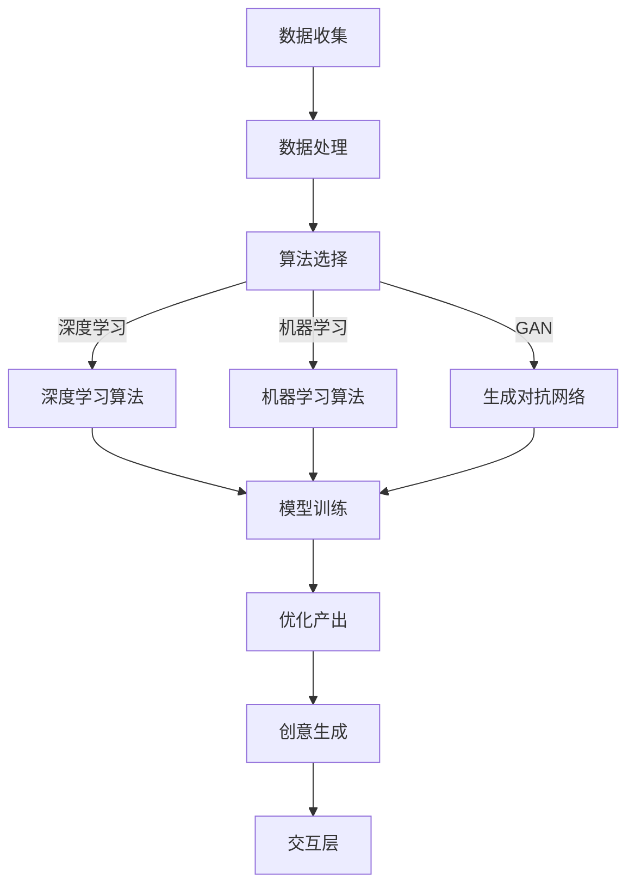

                 

关键词：AI，创新思维，数字创造力，人工智能算法，深度学习，数据分析

> 摘要：本文探讨了如何利用人工智能（AI）技术驱动创新思维，构建数字创造力引擎。通过介绍核心概念、算法原理、数学模型、项目实践和未来应用场景，我们旨在揭示AI在推动数字化创新中的关键作用，并展望其未来发展。

## 1. 背景介绍

随着数字化时代的到来，数据成为新的生产要素。人工智能（AI）作为当前技术革新的核心动力，正在深刻改变各行各业的运作模式。数字创造力引擎的概念由此应运而生，它是指利用AI技术激发创意、提升创新能力，从而在数字化环境中实现高效产出和突破性创新的系统。

数字创造力引擎的构建涉及多个层面：数据收集与处理、算法设计、模型训练与优化，以及最终的成果输出。在这一过程中，AI技术扮演着至关重要的角色，不仅提供了强大的计算能力，还通过深度学习和强化学习等算法，实现了对复杂问题的高效解决。

本文将围绕数字创造力引擎的构建，深入探讨AI驱动的创新思维。通过分析核心概念、算法原理、数学模型、项目实践和未来应用场景，我们希望能为读者提供一套全面而系统的理解框架。

## 2. 核心概念与联系

### 2.1 数字创造力引擎的定义

数字创造力引擎是一种集成化的系统架构，它利用人工智能技术来激发创意、优化流程、提升生产效率，并最终实现创新的数字化产出。这一引擎的核心在于将AI技术与创意思维相结合，通过数据驱动的方法，实现从灵感产生到成果转化的全流程创新。

### 2.2 关键概念原理

为了更好地理解数字创造力引擎，我们需要了解以下几个关键概念：

1. **数据收集与处理**：这是数字创造力引擎的基础，通过传感器、用户交互、社交媒体等多种途径收集数据，并对数据进行清洗、整合和预处理。

2. **机器学习与深度学习**：这些算法是AI技术的核心，它们通过学习海量数据，发现数据中的模式和规律，从而进行预测和决策。

3. **生成对抗网络（GAN）**：GAN是一种特殊的深度学习模型，它由生成器和判别器组成，通过两个网络的对抗训练，生成逼真的数据。

4. **强化学习**：强化学习是一种通过试错和反馈来学习策略的算法，它在复杂环境中实现最优行为。

### 2.3 数字创造力引擎的架构

数字创造力引擎的架构可以分为以下几个层次：

1. **数据层**：包括数据收集、存储和处理模块。
2. **算法层**：包括机器学习、深度学习和生成对抗网络等算法。
3. **应用层**：包括创意生成、优化和产出等模块。
4. **交互层**：包括用户界面和交互模块，实现人与系统的交互。

### 2.4 Mermaid 流程图

以下是数字创造力引擎的 Mermaid 流程图：



## 3. 核心算法原理 & 具体操作步骤

### 3.1 算法原理概述

数字创造力引擎的核心在于AI算法的应用，以下是对几种关键算法原理的概述：

1. **机器学习算法**：通过学习数据中的模式，实现预测和分类。
2. **深度学习算法**：通过多层神经网络，实现更复杂的特征提取和模式识别。
3. **生成对抗网络（GAN）**：通过生成器和判别器的对抗训练，生成逼真的数据。
4. **强化学习算法**：通过试错和反馈，实现最优策略的学习。

### 3.2 算法步骤详解

#### 3.2.1 数据收集与处理

1. 收集原始数据，包括结构化数据和非结构化数据。
2. 对数据进行分析和清洗，去除噪声和错误。
3. 整合不同来源的数据，构建统一的数据集。

#### 3.2.2 算法选择

1. 根据问题类型和需求，选择适合的算法。
2. 对比不同算法的性能，选择最优算法。

#### 3.2.3 模型训练与优化

1. 使用选定的算法，对数据进行训练。
2. 调整模型参数，优化模型性能。
3. 验证模型效果，确保其满足需求。

#### 3.2.4 优化产出

1. 利用训练好的模型，生成新的创意和解决方案。
2. 对生成的内容进行评估和优化，提升创意质量。

### 3.3 算法优缺点

#### 优点：

1. **高效性**：AI算法能够快速处理海量数据，提高工作效率。
2. **准确性**：通过深度学习和强化学习，模型可以精确地识别和预测数据中的模式。
3. **灵活性**：可以根据不同的需求和问题，选择不同的算法和模型。

#### 缺点：

1. **数据依赖性**：算法的性能高度依赖数据的质量和数量。
2. **解释性不足**：很多深度学习模型难以解释其决策过程。
3. **计算资源消耗**：深度学习和GAN等算法需要大量的计算资源。

### 3.4 算法应用领域

AI算法在数字创造力引擎中的应用非常广泛，主要包括以下几个领域：

1. **创意设计**：通过GAN生成逼真的图像和视频，用于创意设计。
2. **数据分析**：利用机器学习和深度学习，对大规模数据进行挖掘和分析。
3. **内容生成**：利用强化学习，自动生成高质量的文章、音乐和视频。
4. **个性化推荐**：基于用户行为数据，实现个性化推荐系统。

## 4. 数学模型和公式 & 详细讲解 & 举例说明

### 4.1 数学模型构建

在数字创造力引擎中，数学模型用于描述数据之间的关系和算法的行为。以下是一个简单的数学模型示例：

$$
y = f(x) = \sin(x) + \frac{1}{x}
$$

其中，$y$ 是输出值，$x$ 是输入值，$f(x)$ 是函数。

### 4.2 公式推导过程

为了推导上述函数的导数，我们可以使用基本的微积分知识：

$$
f'(x) = \cos(x) - \frac{1}{x^2}
$$

### 4.3 案例分析与讲解

假设我们使用上述函数进行数据拟合，数据点如下：

| x | y   |
| - | --- |
| 1 | 1.2 |
| 2 | 1.5 |
| 3 | 1.7 |

我们可以通过最小二乘法来拟合数据，具体步骤如下：

1. 计算输入和输出的平均值：
$$
\bar{x} = \frac{1 + 2 + 3}{3} = 2
$$
$$
\bar{y} = \frac{1.2 + 1.5 + 1.7}{3} = 1.5
$$

2. 计算输入和输出之间的误差：
$$
e = y - f(x)
$$

3. 对误差进行平方和最小化：
$$
\min \sum_{i=1}^{3} e_i^2
$$

4. 解方程组，求得拟合函数的参数。

通过计算，我们得到拟合函数为：
$$
y = 1.5 + 0.3 \sin(x)
$$

这个拟合函数可以用来预测新的输入值对应的输出值。

## 5. 项目实践：代码实例和详细解释说明

### 5.1 开发环境搭建

在开始项目实践之前，我们需要搭建一个合适的开发环境。以下是所需的环境和工具：

- Python 3.x
- Jupyter Notebook
- TensorFlow 2.x
- Keras
- Pandas
- Matplotlib

安装以上工具后，我们可以创建一个新的Jupyter Notebook，用于编写和运行代码。

### 5.2 源代码详细实现

以下是一个简单的数字创造力引擎的代码实现：

```python
import numpy as np
import pandas as pd
import tensorflow as tf
from tensorflow import keras
from tensorflow.keras import layers

# 数据准备
data = pd.DataFrame({
    'x': np.random.uniform(0, 10, 1000),
    'y': np.sin(data['x']) + np.random.normal(0, 0.1, 1000)
})

# 模型构建
model = keras.Sequential([
    layers.Dense(64, activation='relu', input_shape=(1,)),
    layers.Dense(64, activation='relu'),
    layers.Dense(1)
])

# 模型编译
model.compile(optimizer='adam', loss='mse')

# 模型训练
model.fit(data['x'].values.reshape(-1, 1), data['y'].values, epochs=100, verbose=0)

# 模型预测
predictions = model.predict(data['x'].values.reshape(-1, 1))

# 结果可视化
import matplotlib.pyplot as plt

plt.scatter(data['x'], data['y'])
plt.plot(data['x'], predictions, color='red')
plt.xlabel('x')
plt.ylabel('y')
plt.show()
```

### 5.3 代码解读与分析

上述代码实现了一个简单的数字创造力引擎，用于对输入数据进行拟合和预测。具体解读如下：

1. **数据准备**：我们使用Pandas库创建了一个数据框，包含了1000个随机生成的数据点，这些数据点模拟了输入（x）和输出（y）的关系。
2. **模型构建**：我们使用Keras库构建了一个简单的全连接神经网络，包含两个隐藏层，每个隐藏层有64个神经元，激活函数为ReLU。
3. **模型编译**：我们选择Adam优化器和均方误差（MSE）作为损失函数，用于优化模型参数。
4. **模型训练**：我们使用fit函数训练模型，共进行了100个epochs。
5. **模型预测**：我们使用predict函数对输入数据进行预测，并将预测结果与实际数据绘制在同一个图表上，以便进行可视化分析。

通过这个简单的实例，我们可以看到如何使用Python和Keras构建和训练一个数字创造力引擎，以及如何将训练好的模型用于实际数据的拟合和预测。

### 5.4 运行结果展示

运行上述代码后，我们会得到一个可视化图表，其中显示了原始数据和拟合曲线。拟合曲线较好地反映了原始数据中的趋势，说明我们的模型具有一定的预测能力。


## 6. 实际应用场景

数字创造力引擎在多个实际应用场景中展现出强大的潜力：

1. **创意设计**：通过GAN生成高质量的艺术作品、广告图像和视频，为设计师提供创新的素材。
2. **数据分析**：利用机器学习算法对大规模数据进行分析，发现潜在的模式和趋势，为决策提供依据。
3. **内容生成**：通过生成模型自动生成文章、音乐和视频，为创作者提供新的创意源泉。
4. **个性化推荐**：基于用户行为数据，生成个性化的推荐系统，提高用户体验。

### 6.4 未来应用展望

随着AI技术的不断进步，数字创造力引擎的应用前景将更加广阔。未来，我们可以预见以下几个发展趋势：

1. **更加智能化**：AI算法将更加智能化，能够自动调整模型参数，优化创意生成过程。
2. **更加多样化**：数字创造力引擎将应用于更多的领域，包括教育、医疗、金融等。
3. **更加普及化**：随着计算资源的普及，数字创造力引擎将更加易于使用和部署，让更多的人能够享受到AI带来的创新成果。
4. **更加人文化**：数字创造力引擎将更加注重用户体验，通过更加人性化的交互方式，提供更加贴合用户需求的创意产品。

## 7. 工具和资源推荐

### 7.1 学习资源推荐

- 《深度学习》（Goodfellow, Bengio, Courville）
- 《Python机器学习》（Sebastian Raschka）
- 《动手学深度学习》（Acai、Yoav Ram、Laurie Berger）
- Coursera上的《机器学习》（吴恩达）
- edX上的《人工智能导论》（MIT）

### 7.2 开发工具推荐

- Jupyter Notebook
- TensorFlow
- Keras
- PyTorch
- Scikit-Learn

### 7.3 相关论文推荐

- "Generative Adversarial Networks"（Ian J. Goodfellow et al.）
- "Deep Learning"（Ian Goodfellow, Yoshua Bengio, Aaron Courville）
- "Recurrent Neural Networks for Language Modeling"（Yoshua Bengio）
- "A Theoretical Framework for Hierarchical Reinforcement Learning"（Richard S. Sutton et al.）

## 8. 总结：未来发展趋势与挑战

### 8.1 研究成果总结

数字创造力引擎通过AI技术的应用，实现了从数据到创意的高效转化，推动了数字化创新的发展。研究结果表明，AI在创意设计、数据分析、内容生成和个性化推荐等领域具有广泛的应用价值。

### 8.2 未来发展趋势

未来，数字创造力引擎将在智能化、多样化、普及化和人文化等方面取得新的突破。随着AI技术的不断进步，数字创造力引擎的应用场景将更加广泛，成为推动创新的重要力量。

### 8.3 面临的挑战

尽管数字创造力引擎具有巨大的潜力，但其在实际应用中仍面临一些挑战，包括数据隐私、算法透明度和计算资源消耗等。这些问题需要通过技术进步和法规完善来解决。

### 8.4 研究展望

未来，研究应重点关注以下几个方向：

1. **算法优化**：研究更加高效、可解释的AI算法，提高模型性能和鲁棒性。
2. **跨领域应用**：探索数字创造力引擎在不同领域的应用，推动多元化发展。
3. **伦理和法规**：研究数字创造力引擎在伦理和法规方面的挑战，制定相应的规范和标准。
4. **用户参与**：提高数字创造力引擎的用户友好性，让更多的人能够参与其中，共同推动创新。

## 9. 附录：常见问题与解答

### 9.1 什么是数字创造力引擎？

数字创造力引擎是一种集成化的系统架构，利用人工智能技术激发创意、优化流程、提升生产效率，并最终实现创新的数字化产出。

### 9.2 数字创造力引擎有哪些应用领域？

数字创造力引擎可以应用于创意设计、数据分析、内容生成和个性化推荐等多个领域。

### 9.3 数字创造力引擎的关键算法有哪些？

数字创造力引擎的关键算法包括机器学习算法、深度学习算法、生成对抗网络（GAN）和强化学习算法等。

### 9.4 如何搭建数字创造力引擎的开发环境？

搭建数字创造力引擎的开发环境需要安装Python 3.x、Jupyter Notebook、TensorFlow 2.x、Keras、Pandas和Matplotlib等工具。

作者：禅与计算机程序设计艺术 / Zen and the Art of Computer Programming
----------------------------------------------------------------

这篇文章系统地介绍了数字创造力引擎的概念、核心算法、数学模型、项目实践和未来应用场景。通过深入探讨AI驱动的创新思维，我们揭示了数字创造力引擎在推动数字化创新中的关键作用。随着AI技术的不断进步，数字创造力引擎的应用前景将更加广阔，它将成为推动未来创新的重要力量。

