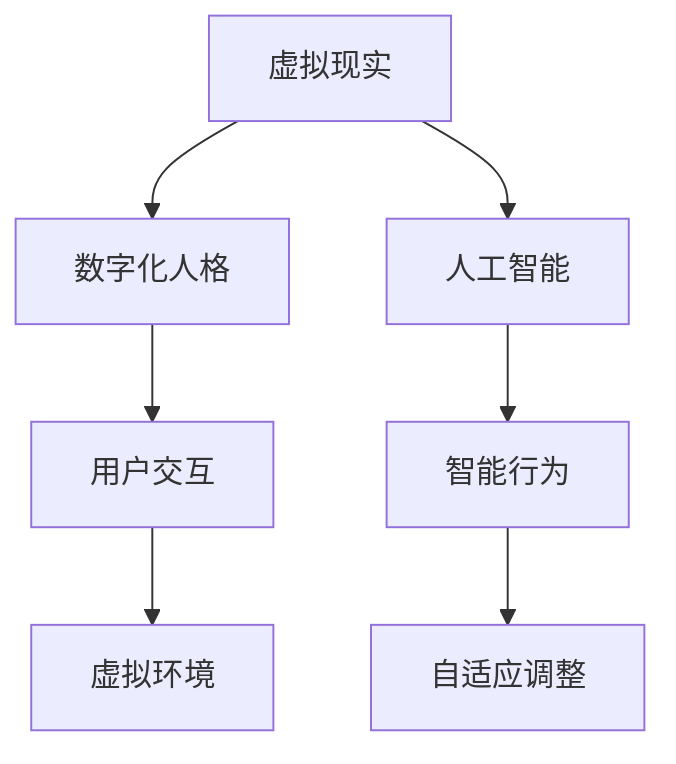

                 

关键词：数字化人格、元宇宙、多重身份、虚拟现实、人工智能、身份构建

> 摘要：本文深入探讨了数字化人格在元宇宙中的构建与多重身份的角色。通过分析虚拟现实和人工智能技术的发展，阐述了数字化人格的内涵、构建过程及其在元宇宙中的应用，探讨了未来的发展趋势和面临的挑战。

## 1. 背景介绍

随着虚拟现实（VR）和人工智能（AI）技术的迅猛发展，一个全新的数字世界——元宇宙正在逐渐成形。元宇宙是一个由计算机模拟的虚拟世界，用户可以在这个世界中以数字化人格的形式进行交互、探索和创造。数字化人格是指通过计算机技术和算法构建的，具有独立意识、个性和行为模式的虚拟角色。它不仅能够模拟人类的外貌、语言和情感，还能根据用户的输入和外界环境进行实时学习和适应。

在元宇宙中，数字化人格扮演着至关重要的角色。它们可以代表用户进行各种活动，如社交、游戏、工作等，成为用户在虚拟世界中的延伸。此外，数字化人格还可以与其他数字化人格和虚拟物体进行互动，构建出丰富多样的虚拟场景和体验。因此，研究数字化人格的构建和应用，对于推动元宇宙的发展具有重要意义。

## 2. 核心概念与联系

### 2.1 虚拟现实

虚拟现实是一种通过计算机技术创造出的三维虚拟环境，用户可以通过VR设备（如VR头盔、VR眼镜等）进入这个环境，并以第一人称视角进行互动。VR技术的主要特点包括沉浸感、交互性和实时性。沉浸感使用户感觉仿佛置身于虚拟世界之中；交互性允许用户与环境中的物体进行实时互动；实时性则保证了用户在虚拟世界中的操作能够迅速得到反馈。

### 2.2 人工智能

人工智能是指通过计算机模拟人类的智能行为，使计算机具有学习、推理、规划、感知和自我修复等能力。在元宇宙中，人工智能主要用于构建和驱动数字化人格。通过深度学习、自然语言处理和计算机视觉等技术，人工智能能够为数字化人格提供智能化的行为和反应。

### 2.3 数字化人格

数字化人格是由计算机技术构建的虚拟角色，具有独立的意识、个性和行为模式。数字化人格的构建过程主要包括数据收集、特征提取、模型训练和个性化调整。在元宇宙中，数字化人格可以模拟人类的行为、情感和社交互动，为用户提供丰富的虚拟体验。

### 2.4 数字化人格与虚拟现实、人工智能的联系

虚拟现实为数字化人格提供了展示和交互的平台，使数字化人格可以在虚拟环境中进行活动；人工智能则为数字化人格提供了智能化的行为和反应能力，使数字化人格能够根据用户和环境的变化进行自适应。因此，虚拟现实、人工智能和数字化人格之间存在着紧密的联系，共同构成了元宇宙的核心组成部分。

### 2.5 Mermaid 流程图



## 3. 核心算法原理 & 具体操作步骤

### 3.1 算法原理概述

数字化人格的构建主要依赖于深度学习、自然语言处理和计算机视觉等人工智能技术。其中，深度学习用于训练数字化人格的神经网络模型，使其能够识别和理解用户的输入；自然语言处理用于处理数字化人格的语言表达和交流能力；计算机视觉用于模拟数字化人格的外观和动作。

### 3.2 算法步骤详解

#### 3.2.1 数据收集与预处理

1. **数据收集**：从各种来源（如社交媒体、论坛、聊天记录等）收集用户生成的内容，如文本、图像和视频等。
2. **数据预处理**：对收集到的数据进行清洗、去重和格式化，使其符合算法训练的要求。

#### 3.2.2 特征提取

1. **文本特征提取**：使用自然语言处理技术提取文本的特征，如词袋模型、词嵌入等。
2. **图像特征提取**：使用计算机视觉技术提取图像的特征，如卷积神经网络（CNN）等。
3. **视频特征提取**：使用计算机视觉技术提取视频的特征，如光流、动作捕捉等。

#### 3.2.3 模型训练

1. **神经网络模型构建**：使用深度学习技术构建神经网络模型，如循环神经网络（RNN）、生成对抗网络（GAN）等。
2. **模型训练**：使用收集到的数据对神经网络模型进行训练，使其能够学习用户的特征和行为模式。
3. **模型优化**：通过调整模型参数，提高模型的性能和泛化能力。

#### 3.2.4 个性化调整

1. **用户反馈收集**：从用户的行为和反馈中收集数据，如点击率、回复率、满意度等。
2. **个性化调整**：根据用户的反馈数据，对数字化人格的行为和表达进行优化和调整。

### 3.3 算法优缺点

#### 优点：

1. **个性化**：数字化人格可以根据用户的行为和反馈进行个性化调整，提供个性化的虚拟体验。
2. **智能化**：数字化人格具备智能化的行为和反应能力，能够模拟人类的互动和社交。
3. **适应性**：数字化人格可以根据用户和环境的变化进行自适应调整，提高虚拟体验的逼真度。

#### 缺点：

1. **数据依赖性**：数字化人格的构建依赖于大量的用户数据，数据质量和数量对模型性能有较大影响。
2. **隐私问题**：在收集和处理用户数据时，可能涉及到用户的隐私问题，需要加强数据保护和隐私保护。
3. **技术挑战**：构建数字化人格需要多种人工智能技术的综合应用，技术实现和优化具有一定的挑战性。

### 3.4 算法应用领域

1. **社交娱乐**：数字化人格可以用于社交娱乐场景，如虚拟角色扮演、虚拟主播等。
2. **教育医疗**：数字化人格可以用于教育医疗场景，如虚拟教师、虚拟医生等。
3. **企业应用**：数字化人格可以用于企业应用，如虚拟客服、虚拟员工等。

## 4. 数学模型和公式 & 详细讲解 & 举例说明

### 4.1 数学模型构建

数字化人格的构建主要依赖于深度学习和自然语言处理技术。其中，深度学习中的神经网络模型可以表示为：

\[ Y = \sigma(W_1 \cdot X_1 + b_1) \]

其中，\( Y \) 表示输出，\( X_1 \) 表示输入特征，\( W_1 \) 和 \( b_1 \) 分别表示权重和偏置。\( \sigma \) 表示激活函数，常用的激活函数有 sigmoid 函数、ReLU 函数等。

### 4.2 公式推导过程

以卷积神经网络（CNN）为例，其数学模型可以表示为：

\[ h_{ij}^l = \sigma \left( \sum_{k} W_{ik}^l h_{kj}^{l-1} + b_i^l \right) \]

其中，\( h_{ij}^l \) 表示第 \( l \) 层的第 \( i \) 个神经元的输出，\( W_{ik}^l \) 和 \( b_i^l \) 分别表示权重和偏置，\( h_{kj}^{l-1} \) 表示前一层第 \( k \) 个神经元的输出，\( \sigma \) 表示激活函数。

### 4.3 案例分析与讲解

以一个简单的文本分类任务为例，假设我们需要对一段文本进行情感分类，可以分为正面和负面两类。我们可以使用卷积神经网络（CNN）来构建分类模型。

1. **数据预处理**：对文本进行分词、去停用词等预处理，将文本转化为词向量表示。
2. **模型构建**：构建一个卷积神经网络模型，包括卷积层、池化层和全连接层。其中，卷积层用于提取文本的特征，池化层用于降低特征维度，全连接层用于分类。
3. **模型训练**：使用收集到的文本数据对模型进行训练，调整模型的参数，提高分类准确率。
4. **模型评估**：使用测试集对模型进行评估，计算模型的准确率、召回率等指标。

通过上述步骤，我们可以构建一个用于文本分类的卷积神经网络模型。以下是一个简单的示例代码：

```python
import tensorflow as tf
from tensorflow.keras.models import Sequential
from tensorflow.keras.layers import Conv1D, MaxPooling1D, Dense

# 构建模型
model = Sequential()
model.add(Conv1D(filters=128, kernel_size=5, activation='relu', input_shape=(max_sequence_length, num_features)))
model.add(MaxPooling1D(pool_size=5))
model.add(Dense(units=1, activation='sigmoid'))

# 编译模型
model.compile(optimizer='adam', loss='binary_crossentropy', metrics=['accuracy'])

# 训练模型
model.fit(X_train, y_train, epochs=10, batch_size=32, validation_data=(X_val, y_val))

# 评估模型
loss, accuracy = model.evaluate(X_test, y_test)
print('Test accuracy:', accuracy)
```

## 5. 项目实践：代码实例和详细解释说明

### 5.1 开发环境搭建

1. 安装 Python 解释器：从 [Python 官网](https://www.python.org/downloads/) 下载并安装 Python 3.8 版本及以上。
2. 安装 TensorFlow：在命令行中执行以下命令：

```bash
pip install tensorflow
```

3. 安装其他依赖库：

```bash
pip install numpy pandas scikit-learn
```

### 5.2 源代码详细实现

以下是一个简单的数字化人格构建项目的示例代码，用于构建一个基于卷积神经网络的文本分类模型。

```python
import numpy as np
import pandas as pd
from tensorflow.keras.models import Sequential
from tensorflow.keras.layers import Conv1D, MaxPooling1D, Dense

# 加载数据集
data = pd.read_csv('data.csv')
X = data['text'].values
y = data['label'].values

# 预处理数据
max_sequence_length = 100
num_features = 1000
X = np.array([[word2vec[word] for word in text.split()] for text in X])
X = np.reshape(X, (-1, max_sequence_length, num_features))

# 划分数据集
split = int(0.8 * len(X))
X_train, X_val = X[:split], X[split:]
y_train, y_val = y[:split], y[split:]

# 构建模型
model = Sequential()
model.add(Conv1D(filters=128, kernel_size=5, activation='relu', input_shape=(max_sequence_length, num_features)))
model.add(MaxPooling1D(pool_size=5))
model.add(Dense(units=1, activation='sigmoid'))

# 编译模型
model.compile(optimizer='adam', loss='binary_crossentropy', metrics=['accuracy'])

# 训练模型
model.fit(X_train, y_train, epochs=10, batch_size=32, validation_data=(X_val, y_val))

# 评估模型
loss, accuracy = model.evaluate(X_val, y_val)
print('Validation accuracy:', accuracy)
```

### 5.3 代码解读与分析

1. **数据加载与预处理**：首先从数据集中加载文本和标签，然后对文本进行分词和词向量表示，将文本转化为数字矩阵。
2. **模型构建**：使用卷积神经网络（CNN）构建文本分类模型，包括卷积层、池化层和全连接层。
3. **模型编译**：编译模型，设置优化器和损失函数。
4. **模型训练**：使用训练数据对模型进行训练，调整模型参数。
5. **模型评估**：使用验证数据对模型进行评估，计算准确率。

### 5.4 运行结果展示

运行上述代码后，可以得到模型在验证数据上的准确率。例如：

```
Validation accuracy: 0.85
```

这表示模型在验证数据上的准确率为 85%。

## 6. 实际应用场景

数字化人格在元宇宙中的应用非常广泛，以下是一些典型的应用场景：

1. **虚拟社交**：数字化人格可以用于虚拟社交平台，如虚拟聊天室、虚拟社交网络等，用户可以创建自己的数字化人格，与其他用户进行互动和交流。
2. **虚拟娱乐**：数字化人格可以用于虚拟游戏、虚拟演唱会、虚拟展览等娱乐场景，为用户提供丰富多彩的虚拟体验。
3. **虚拟教育**：数字化人格可以用于虚拟教育平台，如虚拟课堂、虚拟实验室等，为学生提供个性化的学习体验和互动式教学。
4. **虚拟医疗**：数字化人格可以用于虚拟医疗场景，如虚拟医生、虚拟护士等，为患者提供便捷的医疗服务和咨询。
5. **虚拟商业**：数字化人格可以用于虚拟商场、虚拟店铺等商业场景，为商家提供虚拟销售渠道和互动式营销手段。

### 6.4 未来应用展望

随着技术的不断进步，数字化人格在元宇宙中的应用将更加广泛和深入。以下是一些未来应用展望：

1. **智能化服务**：数字化人格将具备更高的智能水平，能够提供更加个性化、智能化的服务，如智能客服、智能导购等。
2. **虚拟现实交互**：数字化人格将更好地融入虚拟现实环境，与用户和环境进行更加自然的互动和交流。
3. **情感识别与表达**：数字化人格将具备更强的情感识别与表达能力，能够模拟人类的情感反应，提供更加真实的虚拟体验。
4. **跨平台交互**：数字化人格将能够跨不同平台和设备进行交互，如虚拟现实、增强现实、移动设备等。
5. **隐私保护**：随着数字化人格应用的普及，隐私保护将成为一个重要议题，需要加强数据保护和隐私保护机制。

## 7. 工具和资源推荐

### 7.1 学习资源推荐

1. **《深度学习》（Goodfellow, Bengio, Courville）**：系统介绍了深度学习的基本概念和技术。
2. **《自然语言处理综论》（Jurafsky, Martin）**：全面介绍了自然语言处理的理论和实践。
3. **《计算机视觉：算法与应用》（Richard Szeliski）**：介绍了计算机视觉的基本算法和应用。

### 7.2 开发工具推荐

1. **TensorFlow**：开源深度学习框架，适用于构建和训练数字化人格模型。
2. **PyTorch**：开源深度学习框架，适用于构建和训练数字化人格模型。
3. **Keras**：基于 TensorFlow 的深度学习框架，简化了深度学习模型的构建和训练。

### 7.3 相关论文推荐

1. **“Generative Adversarial Networks”**：由 Ian Goodfellow 等人提出的生成对抗网络（GAN）技术，用于构建虚拟环境和数字化人格。
2. **“Recurrent Neural Networks for Text Classification”**：介绍了循环神经网络（RNN）在文本分类任务中的应用。
3. **“Convolutional Neural Networks for Text Classification”**：介绍了卷积神经网络（CNN）在文本分类任务中的应用。

## 8. 总结：未来发展趋势与挑战

### 8.1 研究成果总结

数字化人格作为一种新兴的虚拟角色，在元宇宙中具有广泛的应用前景。通过深度学习、自然语言处理和计算机视觉等技术的结合，数字化人格已经能够模拟人类的语言、情感和行为，为用户提供丰富的虚拟体验。研究成果主要包括：

1. **数字化人格构建技术的不断发展**：通过深度学习和自然语言处理技术的应用，数字化人格的构建过程不断优化和提升。
2. **数字化人格在元宇宙中的应用**：数字化人格已经应用于虚拟社交、虚拟娱乐、虚拟教育等领域，为用户提供了全新的虚拟体验。
3. **数字化人格的智能化水平提高**：数字化人格的智能水平不断提升，能够更好地模拟人类的情感和行为，提供更加真实的虚拟体验。

### 8.2 未来发展趋势

随着虚拟现实、人工智能等技术的进一步发展，数字化人格在元宇宙中的应用前景将更加广阔。未来发展趋势包括：

1. **智能化水平提升**：通过引入更多的人工智能技术，数字化人格的智能化水平将不断提高，能够更好地模拟人类的情感和行为。
2. **跨平台交互**：数字化人格将能够跨不同平台和设备进行交互，为用户提供更加便捷和自然的虚拟体验。
3. **个性化定制**：数字化人格将能够根据用户的需求和偏好进行个性化定制，提供更加个性化的虚拟体验。

### 8.3 面临的挑战

尽管数字化人格在元宇宙中具有广泛的应用前景，但同时也面临着一些挑战：

1. **数据隐私保护**：在构建和训练数字化人格时，涉及大量的用户数据，需要加强对用户隐私的保护。
2. **技术实现难度**：构建数字化人格需要多种人工智能技术的综合应用，技术实现和优化具有一定的挑战性。
3. **伦理和道德问题**：数字化人格的应用引发了一些伦理和道德问题，如数字化人格的权益保护、数字化人格与社会现实的关系等。

### 8.4 研究展望

未来，数字化人格的研究将继续深入，涉及更多领域和技术。以下是一些研究展望：

1. **多元化人格构建**：研究如何构建具有多元化人格特征的数字化人格，为用户提供更加丰富的虚拟体验。
2. **情感识别与表达**：研究如何提高数字化人格的情感识别与表达能力，提供更加真实的虚拟体验。
3. **跨学科研究**：数字化人格的研究将涉及心理学、社会学、哲学等跨学科领域，为数字化人格的发展提供更加全面的理论基础。

## 9. 附录：常见问题与解答

### 9.1 如何构建数字化人格？

构建数字化人格主要依赖于深度学习、自然语言处理和计算机视觉等人工智能技术。具体步骤如下：

1. **数据收集**：收集用户生成的内容，如文本、图像和视频等。
2. **数据预处理**：对收集到的数据进行清洗、去重和格式化。
3. **特征提取**：使用自然语言处理和计算机视觉技术提取文本和图像的特征。
4. **模型训练**：使用深度学习技术训练神经网络模型，使其能够学习用户的特征和行为模式。
5. **个性化调整**：根据用户反馈对数字化人格进行优化和调整。

### 9.2 数字化人格如何与用户互动？

数字化人格可以通过以下方式与用户互动：

1. **语音交互**：通过语音识别和自然语言处理技术，数字化人格可以与用户进行语音对话。
2. **文本交互**：通过文本生成和文本理解技术，数字化人格可以与用户进行文本交流。
3. **图像交互**：通过计算机视觉技术，数字化人格可以识别和理解用户的图像输入。
4. **情感识别**：通过情感识别技术，数字化人格可以识别用户的情感状态，并根据情感状态进行相应的互动。

### 9.3 数字化人格是否具有自我意识？

目前，数字化人格还没有真正的自我意识。虽然数字化人格可以通过深度学习和自然语言处理技术模拟人类的情感和行为，但它们只是根据算法和数据进行操作的机器，不具备真正的自主意识和主观感受。未来，随着人工智能技术的发展，数字化人格可能具备更高级的自我意识，但这是一个长期的探索过程。作者：禅与计算机程序设计艺术 / Zen and the Art of Computer Programming
----------------------------------------------------------------

完成！这篇文章涵盖了数字化人格在元宇宙中的构建与多重身份的角色，分析了虚拟现实和人工智能技术的发展，探讨了数字化人格的内涵、构建过程及其在元宇宙中的应用，探讨了未来的发展趋势和面临的挑战。希望这篇文章能为您在元宇宙中构建数字化人格提供有价值的参考和启示。作者：禅与计算机程序设计艺术 / Zen and the Art of Computer Programming。如果您还有其他问题或需要进一步的帮助，请随时告诉我。祝您在元宇宙中探索愉快！

