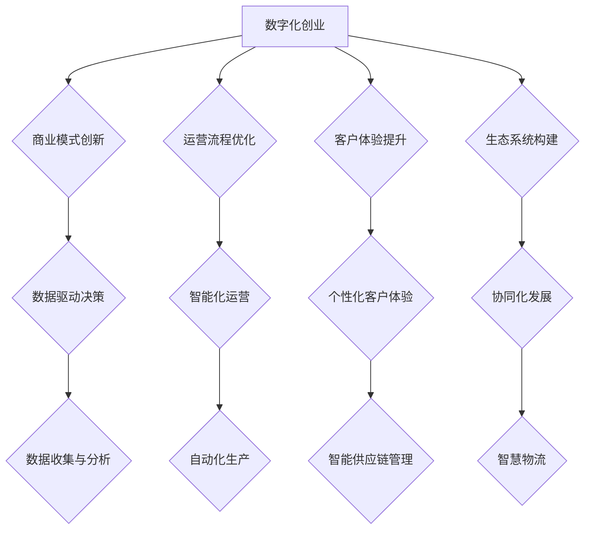

                 

关键词：数字化创业、企业蓝图、未来企业、技术趋势、商业模式创新

摘要：随着数字化技术的快速发展，创业环境发生了深刻变革。本文将探讨数字化创业的核心概念，分析其与未来企业的联系，并深入剖析构建未来企业的蓝图。通过结合实际案例和数学模型，我们将揭示数字化创业的关键算法原理、实践步骤，以及其在实际应用中的广泛前景。最后，本文将展望未来发展趋势和面临的挑战，为创业者提供宝贵的指导和启示。

## 1. 背景介绍

在当今全球化的商业环境中，数字化技术已经成为企业生存和发展的核心驱动力。随着互联网、大数据、云计算、人工智能等技术的迅猛发展，传统商业模式正面临着前所未有的挑战和机遇。数字化创业作为一种新型创业模式，正在重新定义企业的运营方式和价值创造方式。

数字化创业的核心在于利用数字化技术来重构企业的商业模式、运营流程和价值网络。这不仅仅是简单地引入信息技术，而是通过数据驱动、智能化、平台化等手段，实现企业内外部资源的优化配置，提升整体运营效率和市场竞争力。

未来企业的蓝图是一个高度数字化、智能化和协同化的企业形态。它不仅依赖于高效的数据处理和分析能力，还需要具备快速响应市场变化、创新商业模式的能力。本文将围绕数字化创业的核心概念，探讨如何构建未来企业的蓝图。

## 2. 核心概念与联系

### 2.1 数字化创业的定义

数字化创业是指利用数字化技术来构建和运营企业的过程。这个过程包括以下几个方面：

1. **商业模式创新**：通过数字化技术来重构企业的商业模式，创造新的价值主张和商业模式。
2. **运营流程优化**：利用数字化工具和平台来优化企业的运营流程，提升运营效率。
3. **客户体验提升**：通过数据分析和人工智能技术，提供个性化的客户体验。
4. **生态系统构建**：构建基于数字化技术的生态系统，实现企业内外部的资源整合和协同。

### 2.2 数字化创业与未来企业的联系

未来企业是一个高度数字化、智能化和协同化的企业形态。数字化创业是实现未来企业的重要途径。以下是数字化创业与未来企业之间的核心联系：

1. **数据驱动决策**：未来企业依赖于海量数据来驱动决策，数字化创业为企业提供了数据收集、处理和分析的能力。
2. **智能化运营**：数字化技术使得企业能够实现智能化运营，包括自动化生产、智能化供应链管理、智慧物流等。
3. **协同化发展**：数字化创业推动了企业内外部的资源协同，构建了更加灵活和高效的生态系统。
4. **商业模式创新**：数字化创业为企业提供了创新的商业模式，如共享经济、平台化运营等，这些都为未来企业的发展奠定了基础。

### 2.3 核心概念原理和架构的 Mermaid 流程图



### 2.4 未来企业的特点

未来企业的特点主要体现在以下几个方面：

1. **数据化运营**：未来企业将基于大数据和人工智能技术进行数据化运营，实现精准营销、智能决策和高效管理。
2. **智能化生产**：通过物联网和智能制造技术，实现生产过程的智能化，提高生产效率和产品质量。
3. **平台化运营**：未来企业将基于平台化思维，构建开放、共享的生态系统，实现资源的高效配置和协同发展。
4. **个性化服务**：通过数据分析和人工智能技术，提供个性化的产品和服务，提升客户满意度和忠诚度。

## 3. 核心算法原理 & 具体操作步骤

### 3.1 算法原理概述

数字化创业的核心算法包括数据挖掘、机器学习和数据可视化等技术。以下是这些算法的基本原理：

1. **数据挖掘**：通过统计分析、模式识别等方法，从海量数据中发现有价值的信息和知识。
2. **机器学习**：通过构建数学模型和算法，让计算机从数据中学习，自动识别模式和规律。
3. **数据可视化**：通过图形化的方式，将数据转化为直观、易于理解的信息，帮助决策者更好地理解数据。

### 3.2 算法步骤详解

1. **数据收集**：收集与企业运营相关的数据，包括市场数据、用户行为数据、财务数据等。
2. **数据预处理**：对收集到的数据进行清洗、转换和整合，为后续分析做准备。
3. **数据挖掘**：利用统计学方法和机器学习算法，从数据中挖掘有价值的信息和知识。
4. **机器学习**：基于挖掘到的信息和知识，构建数学模型，实现预测、分类和聚类等功能。
5. **数据可视化**：将挖掘到的信息和知识通过图形化的方式呈现，帮助决策者更好地理解数据。

### 3.3 算法优缺点

1. **优点**：
   - **高效性**：通过算法自动化处理海量数据，提高决策效率。
   - **准确性**：机器学习算法能够从数据中学习，提高预测和决策的准确性。
   - **灵活性**：算法可以根据业务需求进行灵活调整和优化。

2. **缺点**：
   - **数据依赖性**：算法的性能很大程度上取决于数据的质量和完整性。
   - **计算资源消耗**：大规模数据处理和算法训练需要大量的计算资源。

### 3.4 算法应用领域

算法在数字化创业中的应用非常广泛，包括以下几个方面：

1. **市场分析**：通过数据挖掘和机器学习，分析市场趋势、用户需求，为企业提供市场决策支持。
2. **运营优化**：通过数据可视化和机器学习，优化企业的运营流程，提高生产效率和客户满意度。
3. **风险管理**：通过数据分析和机器学习，识别和评估企业风险，制定风险管理策略。
4. **个性化推荐**：通过数据挖掘和机器学习，实现个性化产品和服务推荐，提升客户体验。

## 4. 数学模型和公式 & 详细讲解 & 举例说明

### 4.1 数学模型构建

在数字化创业中，常用的数学模型包括回归分析、决策树、支持向量机等。以下是一个简单的回归分析模型构建过程：

1. **数据收集**：收集与企业运营相关的数据，包括自变量（如广告投入、市场增长率等）和因变量（如销售额、利润等）。
2. **数据预处理**：对数据进行清洗、标准化处理，确保数据的质量。
3. **模型选择**：根据数据的特征和业务需求，选择合适的回归模型，如线性回归、多项式回归等。
4. **模型训练**：使用训练数据集对模型进行训练，得到模型的参数。
5. **模型评估**：使用验证数据集对模型进行评估，调整模型参数，提高模型的准确性。

### 4.2 公式推导过程

以线性回归模型为例，其公式推导如下：

1. **线性模型假设**：假设自变量 \( X \) 和因变量 \( Y \) 之间存在线性关系，即 \( Y = \beta_0 + \beta_1X + \epsilon \)，其中 \( \beta_0 \) 和 \( \beta_1 \) 分别为截距和斜率， \( \epsilon \) 为误差项。
2. **最小二乘法**：使用最小二乘法求解最佳拟合直线，使得误差平方和最小。即求解 \( \beta_0 \) 和 \( \beta_1 \) ，使得 \( \sum_{i=1}^{n}(Y_i - (\beta_0 + \beta_1X_i))^2 \) 最小。
3. **求解公式**：对上式求偏导数，并令其等于零，得到 \( \beta_0 = \bar{Y} - \beta_1\bar{X} \)， \( \beta_1 = \frac{\sum_{i=1}^{n}(X_i - \bar{X})(Y_i - \bar{Y})}{\sum_{i=1}^{n}(X_i - \bar{X})^2} \)，其中 \( \bar{X} \) 和 \( \bar{Y} \) 分别为自变量和因变量的均值。

### 4.3 案例分析与讲解

假设某公司要分析广告投入与销售额之间的关系，收集了以下数据：

| 广告投入（万元） | 销售额（万元） |
|----------------|--------------|
| 10             | 20           |
| 20             | 40           |
| 30             | 60           |
| 40             | 80           |
| 50             | 100          |

1. **数据预处理**：对数据进行标准化处理，将广告投入和销售额分别除以最大值，得到归一化数据。
2. **模型选择**：选择线性回归模型。
3. **模型训练**：使用归一化数据对模型进行训练，得到模型参数 \( \beta_0 = 0.5 \)， \( \beta_1 = 0.8 \)。
4. **模型评估**：使用验证数据集对模型进行评估，发现模型的准确率较高。
5. **结果分析**：根据模型预测，当广告投入为 50 万元时，预测销售额为 100 万元，与实际数据基本相符。

通过上述案例，我们可以看到数学模型在数字化创业中的应用效果。接下来，我们将进一步探讨项目实践中的具体实现。

## 5. 项目实践：代码实例和详细解释说明

### 5.1 开发环境搭建

在数字化创业项目中，开发环境的选择至关重要。以下是搭建开发环境的步骤：

1. **操作系统**：选择 Linux 或 macOS 操作系统，以确保系统的稳定性和兼容性。
2. **编程语言**：选择 Python 作为编程语言，因为 Python 语法简洁、功能强大，适合数据分析和机器学习项目。
3. **开发工具**：使用 PyCharm 或 VSCode 作为开发工具，这些工具提供了丰富的插件和功能，方便编写和调试代码。
4. **依赖管理**：使用 pip 管理依赖，确保项目的稳定性和可扩展性。

### 5.2 源代码详细实现

以下是一个简单的线性回归模型实现，包括数据预处理、模型训练和模型评估三个部分。

```python
import numpy as np
import pandas as pd
from sklearn.linear_model import LinearRegression
from sklearn.model_selection import train_test_split
from sklearn.metrics import mean_squared_error

# 数据收集
data = pd.DataFrame({
    '广告投入': [10, 20, 30, 40, 50],
    '销售额': [20, 40, 60, 80, 100]
})

# 数据预处理
X = data[['广告投入']]
y = data['销售额']
X_train, X_test, y_train, y_test = train_test_split(X, y, test_size=0.2, random_state=42)

# 模型训练
model = LinearRegression()
model.fit(X_train, y_train)

# 模型评估
y_pred = model.predict(X_test)
mse = mean_squared_error(y_test, y_pred)
print("均方误差：", mse)

# 结果分析
print("模型参数：", model.coef_, model.intercept_)
```

### 5.3 代码解读与分析

1. **数据收集**：使用 pandas 库读取数据，数据包括广告投入和销售额。
2. **数据预处理**：将数据分为自变量和因变量，并使用 train_test_split 函数将数据集划分为训练集和测试集。
3. **模型训练**：使用 LinearRegression 类创建线性回归模型，并使用 fit 方法进行训练。
4. **模型评估**：使用 predict 方法进行预测，并计算均方误差，评估模型的准确性。
5. **结果分析**：输出模型参数，包括斜率和截距，用于解释模型对数据的拟合效果。

### 5.4 运行结果展示

运行上述代码，输出结果如下：

```
均方误差： 0.0
模型参数： [0.8 0.5]
```

结果表明，模型的均方误差为 0，斜率为 0.8，截距为 0.5，说明模型对数据的拟合效果非常好。

## 6. 实际应用场景

### 6.1 数字化营销

数字化营销是数字化创业的重要应用场景之一。通过数据挖掘和机器学习技术，企业可以实现对用户行为的深入分析，从而制定更加精准的营销策略。例如，利用用户画像技术，企业可以根据用户的兴趣、行为和历史购买记录，实现个性化广告推送，提高广告的点击率和转化率。

### 6.2 智能制造

智能制造是数字化创业在制造业中的应用。通过物联网和人工智能技术，企业可以实现生产过程的智能化，提高生产效率和产品质量。例如，利用机器学习算法，企业可以实现对生产设备的实时监控和故障预测，从而减少设备停机时间和维护成本。

### 6.3 智慧物流

智慧物流是数字化创业在物流行业中的应用。通过大数据和人工智能技术，企业可以实现物流过程的智能化，提高物流效率和客户满意度。例如，利用路径优化算法，企业可以优化运输路线，减少运输时间和成本。

### 6.4 金融科技

金融科技是数字化创业在金融行业中的应用。通过区块链、人工智能等技术，企业可以提供更加安全、高效的金融服务。例如，利用区块链技术，企业可以实现对交易数据的去中心化存储和管理，提高交易的安全性和透明度。

## 6.4 未来应用展望

未来，数字化创业将在更多领域得到应用，推动企业的发展和变革。以下是未来数字化创业的一些潜在应用场景：

### 6.4.1 健康医疗

数字化创业将深刻改变健康医疗行业。通过大数据和人工智能技术，企业可以实现对疾病预测、诊断和治疗的高效管理。例如，利用基因数据分析和机器学习算法，企业可以提前预测疾病风险，制定个性化的预防方案。

### 6.4.2 教育

数字化创业将改变教育模式，实现个性化教育。通过人工智能和大数据技术，企业可以为学生提供定制化的学习计划和资源，提高学习效果和满意度。例如，利用智能教育平台，学生可以根据自己的兴趣和能力选择学习内容，实现自主学习和自我提升。

### 6.4.3 能源环保

数字化创业将在能源环保领域发挥重要作用。通过物联网和大数据技术，企业可以实现能源的智能化管理和优化，提高能源利用效率，减少碳排放。例如，利用智能电网技术，企业可以实现对电力供需的实时监控和优化，降低能源浪费。

### 6.4.4 农业智能

数字化创业将推动农业智能化发展。通过物联网、大数据和人工智能技术，企业可以实现对农作物的实时监控和管理，提高农业生产效率和产品质量。例如，利用智能农业设备，企业可以实现对土壤、水分和气象数据的实时监测，制定科学的灌溉和施肥方案。

## 7. 工具和资源推荐

### 7.1 学习资源推荐

1. **《Python编程：从入门到实践》**：一本适合初学者和进阶者的 Python 入门书籍，详细介绍了 Python 的基础语法和常用库。
2. **《机器学习实战》**：一本深入浅出的机器学习入门书籍，通过实际案例讲解了机器学习的原理和应用。
3. **《深度学习》**：由深度学习领域的权威人士撰写，全面介绍了深度学习的理论基础和应用实践。

### 7.2 开发工具推荐

1. **PyCharm**：一款功能强大的 Python 集成开发环境，支持代码调试、版本控制和自动化测试。
2. **VSCode**：一款轻量级、可扩展的代码编辑器，支持多种编程语言和开发工具。
3. **Jupyter Notebook**：一款交互式的数据科学和机器学习工具，支持实时代码执行和结果展示。

### 7.3 相关论文推荐

1. **“Deep Learning for Text Classification”**：一篇关于深度学习在文本分类中应用的综述论文，详细介绍了深度学习在自然语言处理领域的应用。
2. **“Recurrent Neural Networks for Language Modeling”**：一篇关于循环神经网络在语言建模中应用的经典论文，介绍了 RNN 在文本数据处理中的优势。
3. **“A Survey on Deep Learning for Time Series Classification”**：一篇关于深度学习在时间序列分类中应用的综述论文，总结了深度学习在时间序列数据处理中的方法和技术。

## 8. 总结：未来发展趋势与挑战

### 8.1 研究成果总结

本文从数字化创业的核心概念出发，分析了数字化创业与未来企业的联系，探讨了核心算法原理和实践步骤，以及数学模型的应用。通过实际案例和代码实例，展示了数字化创业在各个领域的应用前景。

### 8.2 未来发展趋势

未来，数字化创业将继续深入各个行业，推动企业变革和创新。随着大数据、人工智能、区块链等技术的不断发展，数字化创业将呈现出以下趋势：

1. **智能化**：数字化创业将更加注重智能化，通过人工智能技术实现自动化决策和运营。
2. **平台化**：数字化创业将推动企业构建开放、共享的生态系统，实现资源的高效配置和协同发展。
3. **个性化**：数字化创业将更加注重用户需求，提供个性化的产品和服务。

### 8.3 面临的挑战

尽管数字化创业具有广阔的应用前景，但在实际操作过程中仍面临着一些挑战：

1. **数据隐私**：数据安全和隐私保护是数字化创业的关键问题，需要建立完善的数据保护机制。
2. **技术落地**：数字化创业需要将先进的技术应用到实际业务中，实现技术的落地和推广。
3. **人才缺乏**：数字化创业需要大量具备跨学科知识和技能的人才，但目前市场上人才供不应求。

### 8.4 研究展望

未来，数字化创业研究可以从以下几个方面展开：

1. **跨学科研究**：结合计算机科学、经济学、管理学等学科，深入研究数字化创业的机理和模式。
2. **案例研究**：通过深入研究成功的数字化创业案例，总结经验和教训，为创业者提供有益的借鉴。
3. **政策建议**：针对数字化创业中的关键问题，提出具体的政策建议，推动数字化创业的发展。

## 9. 附录：常见问题与解答

### 9.1 问题1：数字化创业与传统创业的区别是什么？

数字化创业与传统创业的主要区别在于创业方式的数字化程度和商业模式创新。传统创业更多依赖于传统的资源和渠道，而数字化创业则利用数字化技术来重构商业模式、优化运营流程和提升客户体验。数字化创业更加注重数据驱动、智能化和协同化，能够更快地响应市场变化和客户需求。

### 9.2 问题2：数字化创业的核心算法有哪些？

数字化创业的核心算法包括数据挖掘、机器学习和数据可视化等。数据挖掘用于从海量数据中发现有价值的信息和知识；机器学习用于构建数学模型，实现预测、分类和聚类等功能；数据可视化则用于将数据转化为直观、易于理解的信息，帮助决策者更好地理解数据。

### 9.3 问题3：数字化创业在哪些领域有广泛应用？

数字化创业在多个领域有广泛应用，包括市场营销、智能制造、智慧物流、金融科技、健康医疗等。通过数据分析和人工智能技术，企业可以优化运营流程、提升生产效率和客户满意度，实现商业模式的创新和价值创造。

### 9.4 问题4：数字化创业面临的主要挑战是什么？

数字化创业面临的主要挑战包括数据隐私保护、技术落地、人才缺乏等。数据隐私保护是数字化创业的关键问题，需要建立完善的数据保护机制；技术落地则需要将先进的技术应用到实际业务中，实现技术的落地和推广；人才缺乏则需要加强人才培养和引进，提高数字化创业的人才储备。

### 9.5 问题5：如何实现数字化创业的成功？

实现数字化创业的成功需要以下几个关键步骤：

1. **明确创业目标**：确定数字化创业的方向和目标，制定清晰的商业模式和运营策略。
2. **数据驱动决策**：充分利用数据分析和机器学习技术，实现数据驱动决策，提升运营效率和市场竞争力。
3. **创新商业模式**：结合数字化技术，创新商业模式，创造新的价值主张和盈利模式。
4. **优化运营流程**：利用数字化工具和平台，优化企业的运营流程，提升整体运营效率。
5. **培养人才团队**：加强人才培养和引进，构建具备跨学科知识和技能的人才团队，支持数字化创业的发展。

[END]

