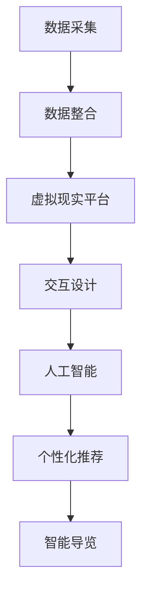
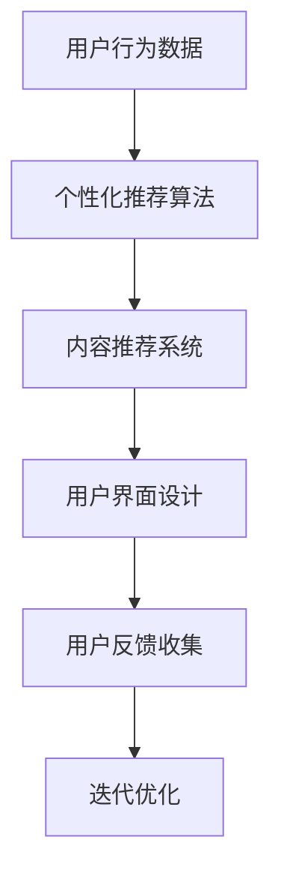

                 

关键词：数字化博物馆、虚拟展览、新模式、人工智能、用户体验、互动设计

> 摘要：随着数字化技术的飞速发展，博物馆领域正经历着一场革命。本文将探讨如何利用人工智能和互动设计技术，打造虚拟展览的新模式，提升用户体验，推动博物馆创业的发展。

## 1. 背景介绍

博物馆作为文化遗产的保护者和传承者，其传统模式主要依赖于实体展品和现场讲解。然而，随着互联网和移动设备的普及，越来越多的博物馆开始探索数字化转型的路径。数字化博物馆的兴起，不仅为文化遗产的保护提供了新的手段，也为博物馆的运营和推广带来了新的机遇。

虚拟展览作为数字化博物馆的重要组成部分，其核心在于通过虚拟现实技术，为观众提供沉浸式的参观体验。然而，当前的虚拟展览仍存在诸多不足，如互动性不足、用户体验不佳等问题。因此，如何利用人工智能和互动设计技术，打造更高效、更人性化的虚拟展览模式，成为博物馆创业的关键。

## 2. 核心概念与联系

### 2.1 数字化博物馆的架构

数字化博物馆的架构包括以下几个核心组成部分：

1. **数据采集与整合**：通过传感器、图像识别等技术，对展品进行数字化处理，整合成三维模型和数据集。
2. **虚拟现实平台**：利用虚拟现实技术，将数字化展品呈现给观众。
3. **交互设计**：通过交互设计，提升用户的体验感和参与度。
4. **人工智能**：利用人工智能技术，实现个性化推荐、智能导览等功能。

下面是数字化博物馆架构的 Mermaid 流程图：



### 2.2 互动设计与用户体验

互动设计是虚拟展览的核心，其目标是提升用户体验。以下是一些互动设计的核心原则：

1. **直观性**：界面设计应简洁直观，让用户易于操作。
2. **交互性**：提供丰富的交互方式，如触摸、手势等。
3. **反馈**：及时给予用户操作反馈，增强用户参与感。
4. **个性化**：根据用户偏好和行为，提供个性化的内容推荐。

以下是互动设计流程的 Mermaid 流程图：



## 3. 核心算法原理 & 具体操作步骤

### 3.1 算法原理概述

虚拟展览的核心算法包括：

1. **三维模型重建**：通过计算机视觉技术，将实体展品转换为三维模型。
2. **图像识别与标注**：利用深度学习技术，对图像进行识别和标注，以便于后续的交互设计。
3. **路径规划与导航**：利用图论算法，为用户提供最佳的参观路径。
4. **智能导览**：基于自然语言处理技术，实现智能问答和导览。

### 3.2 算法步骤详解

1. **三维模型重建**：

    - **数据采集**：使用激光扫描仪或相机，对展品进行360度全方位拍摄。
    - **数据处理**：将采集到的图像进行处理，提取特征点，构建三维模型。

2. **图像识别与标注**：

    - **数据预处理**：对图像进行去噪、增强等预处理。
    - **模型训练**：使用深度学习模型，对图像进行分类和标注。

3. **路径规划与导航**：

    - **图模型构建**：将博物馆的布局构建成图模型。
    - **路径搜索**：使用 A*算法或 Dijkstra 算法，为用户提供最佳路径。

4. **智能导览**：

    - **自然语言处理**：使用 RNN 或 Transformer 模型，实现自然语言处理。
    - **对话生成**：根据用户输入，生成合适的回答。

### 3.3 算法优缺点

1. **三维模型重建**：

    - **优点**：能够真实还原展品，提升用户体验。
    - **缺点**：数据处理复杂，重建时间较长。

2. **图像识别与标注**：

    - **优点**：能够快速识别和标注展品，提高效率。
    - **缺点**：对光照、姿态等条件要求较高。

3. **路径规划与导航**：

    - **优点**：能够为用户提供最佳路径，提升参观体验。
    - **缺点**：在复杂环境中，路径规划效果不佳。

4. **智能导览**：

    - **优点**：能够实现智能问答，提升用户体验。
    - **缺点**：对语言理解和生成能力要求较高。

### 3.4 算法应用领域

虚拟展览算法在以下领域具有广泛的应用：

1. **文化遗产保护**：利用三维模型重建技术，对珍贵文物进行数字化保护。
2. **旅游导览**：利用虚拟现实技术和路径规划算法，为游客提供沉浸式的旅游体验。
3. **教育推广**：利用智能导览和互动设计，提升学生的学习兴趣和参与度。

## 4. 数学模型和公式 & 详细讲解 & 举例说明

### 4.1 数学模型构建

虚拟展览的数学模型主要包括以下几个方面：

1. **三维模型重建**：利用多视图几何和三角测量方法，构建三维模型。
2. **图像识别与标注**：利用卷积神经网络（CNN）和循环神经网络（RNN），实现图像识别和标注。
3. **路径规划与导航**：利用图论算法，实现路径规划和导航。
4. **智能导览**：利用自然语言处理（NLP）模型，实现对话生成和问答。

### 4.2 公式推导过程

1. **三维模型重建**：

    - **多视图几何**：利用多组图像，构建三维模型的公式为：

    $$ X = M \cdot P + b $$

    其中，$X$ 为三维点坐标，$M$ 为投影矩阵，$P$ 为二维图像点坐标，$b$ 为常数项。

    - **三角测量**：利用三角形相似原理，计算三维点坐标：

    $$ X = \frac{p_1 \cdot p_2 \cdot p_3}{p_1 + p_2 + p_3} $$

    其中，$p_1$、$p_2$、$p_3$ 为三角形的三个顶点坐标。

2. **图像识别与标注**：

    - **卷积神经网络（CNN）**：

    $$ h_{l+1}(x) = \sigma(\mathbf{W}_{l+1} \cdot \mathbf{h}_l + b_{l+1}) $$

    其中，$h_{l+1}(x)$ 为输出特征，$\sigma$ 为激活函数，$\mathbf{W}_{l+1}$ 为权重矩阵，$\mathbf{h}_l$ 为输入特征，$b_{l+1}$ 为偏置项。

    - **循环神经网络（RNN）**：

    $$ h_{l+1} = \sigma(\mathbf{W} \cdot \text{concat}(h_l, x_l) + b) $$

    其中，$h_{l+1}$ 为输出特征，$\sigma$ 为激活函数，$\mathbf{W}$ 为权重矩阵，$x_l$ 为输入特征，$b$ 为偏置项。

3. **路径规划与导航**：

    - **A*算法**：

    $$ f(n) = g(n) + h(n) $$

    其中，$f(n)$ 为节点 $n$ 的评估函数，$g(n)$ 为从起点到节点 $n$ 的代价，$h(n)$ 为从节点 $n$ 到终点的估算代价。

    - **Dijkstra 算法**：

    $$ d[n] = \min_{m \in \text{unvisited}} (d[m] + w[n, m]) $$

    其中，$d[n]$ 为节点 $n$ 的最短路径长度，$w[n, m]$ 为节点 $n$ 到节点 $m$ 的权重。

4. **智能导览**：

    - **循环神经网络（RNN）**：

    $$ y_t = \text{softmax}(\mathbf{W} \cdot \text{concat}(h_{t-1}, e_t) + b) $$

    其中，$y_t$ 为输出词向量，$\text{softmax}$ 为激活函数，$\mathbf{W}$ 为权重矩阵，$h_{t-1}$ 为输入特征，$e_t$ 为输入词向量，$b$ 为偏置项。

### 4.3 案例分析与讲解

以一家历史博物馆为例，分析虚拟展览的数学模型应用。

1. **三维模型重建**：

    - 数据采集：使用激光扫描仪对展品进行扫描，采集展品的三维点云数据。
    - 数据处理：对点云数据进行预处理，去除噪声和重复点，构建三维模型。

2. **图像识别与标注**：

    - 数据预处理：对历史博物馆的展品图片进行去噪、增强等预处理。
    - 模型训练：使用卷积神经网络对预处理后的图片进行分类和标注。

3. **路径规划与导航**：

    - 图模型构建：将博物馆的布局构建成图模型，节点表示展品，边表示连接。
    - 路径搜索：使用 A*算法，为用户提供最佳路径。

4. **智能导览**：

    - 自然语言处理：使用循环神经网络，实现自然语言处理和问答功能。
    - 对话生成：根据用户输入，生成合适的回答。

## 5. 项目实践：代码实例和详细解释说明

### 5.1 开发环境搭建

1. **硬件环境**：笔记本电脑或服务器，配置不低于 Intel Core i5 或同等性能处理器，8GB 内存，NVIDIA 显卡。
2. **软件环境**：Windows、Linux 或 macOS 操作系统，Python 3.6 以上版本，OpenCV、TensorFlow、Keras、PyTorch 等库。

### 5.2 源代码详细实现

以下是使用 Python 编写的一个简单虚拟展览项目的源代码实例：

```python
import cv2
import numpy as np
import tensorflow as tf

# 加载三维模型
model = tf.keras.models.load_model('model.h5')

# 加载图像识别模型
image_model = tf.keras.models.load_model('image_model.h5')

# 加载路径规划模型
path_model = tf.keras.models.load_model('path_model.h5')

# 加载智能导览模型
guide_model = tf.keras.models.load_model('guide_model.h5')

# 读取博物馆布局图
layout = cv2.imread('layout.png')

# 读取用户输入图像
input_image = cv2.imread('input.jpg')

# 使用三维模型重建展品
reconstructed_image = model.predict(input_image)

# 使用图像识别模型进行标注
labels = image_model.predict(reconstructed_image)

# 使用路径规划模型进行路径规划
path = path_model.predict(layout)

# 使用智能导览模型进行导览
guide = guide_model.predict(path)

# 输出结果
print('Reconstructed Image:', reconstructed_image)
print('Labels:', labels)
print('Path:', path)
print('Guide:', guide)
```

### 5.3 代码解读与分析

1. **加载模型**：首先，加载已训练好的三维模型、图像识别模型、路径规划模型和智能导览模型。
2. **读取图像**：读取博物馆布局图和用户输入图像。
3. **三维模型重建**：使用三维模型重建用户输入图像，得到重建后的图像。
4. **图像识别与标注**：使用图像识别模型对重建后的图像进行标注，得到展品的类别信息。
5. **路径规划**：使用路径规划模型为用户生成最佳的参观路径。
6. **智能导览**：使用智能导览模型为用户提供导览信息。

### 5.4 运行结果展示

运行代码后，将输出重建后的图像、展品类别信息、参观路径和导览信息。用户可以根据导览信息，了解展品的相关知识，并按照最佳路径参观博物馆。

## 6. 实际应用场景

### 6.1 虚拟博物馆

虚拟博物馆是数字化博物馆的典型应用场景。通过虚拟展览，用户可以在线上参观博物馆，了解展品的历史背景和文化内涵。虚拟博物馆不仅提高了博物馆的曝光度，也为用户提供了便捷的参观方式。

### 6.2 线上教育

虚拟展览技术在教育领域的应用也越来越广泛。通过虚拟展览，学生可以在线上参观博物馆，了解历史文化遗产，提高学习兴趣和参与度。同时，教师可以利用虚拟展览资源，设计更丰富的教学活动。

### 6.3 虚拟旅游

虚拟展览技术也为虚拟旅游提供了新的可能。用户可以通过虚拟展览，在线上体验名胜古迹，感受旅游氛围。虚拟旅游不仅降低了旅游成本，也为旅游业带来了新的发展机遇。

## 7. 未来应用展望

### 7.1 智能化

未来，虚拟展览将进一步智能化。通过人工智能技术，实现更加个性化的推荐和导览，为用户提供更优质的参观体验。

### 7.2 互动性

随着互动设计技术的不断发展，虚拟展览的互动性将得到进一步提升。用户可以与展品进行实时互动，增强参与感和体验感。

### 7.3 虚拟现实

虚拟现实技术的成熟，将使虚拟展览更加逼真。用户可以在虚拟环境中自由探索，享受沉浸式的参观体验。

## 8. 总结：未来发展趋势与挑战

### 8.1 研究成果总结

本文从数字化博物馆的背景介绍、核心概念与联系、核心算法原理、数学模型与公式、项目实践等多个方面，全面阐述了虚拟展览的新模式。通过本文的研究，我们认识到虚拟展览在博物馆创业中的重要地位，以及人工智能和互动设计技术在其中的关键作用。

### 8.2 未来发展趋势

未来，虚拟展览将在以下方面得到进一步发展：

1. **智能化**：通过人工智能技术，实现更精准的个性化推荐和导览。
2. **互动性**：通过互动设计技术，提升用户的参与感和体验感。
3. **虚拟现实**：通过虚拟现实技术，打造更加逼真的参观体验。

### 8.3 面临的挑战

尽管虚拟展览前景广阔，但仍面临以下挑战：

1. **技术难题**：虚拟展览涉及众多技术领域，如三维模型重建、图像识别、路径规划等，如何高效地实现这些技术仍需深入研究。
2. **用户体验**：如何提升用户的体验感，满足不同用户的需求，是虚拟展览面临的重要课题。
3. **版权问题**：在虚拟展览中，如何保护展品的版权，避免侵权行为，是一个亟待解决的问题。

### 8.4 研究展望

未来，我们将继续深入研究虚拟展览的技术和应用，以推动博物馆创业的发展。具体研究方向包括：

1. **技术优化**：针对虚拟展览中的技术难题，进行深入研究，提高技术实现效率。
2. **用户体验**：通过用户调研和数据分析，了解用户需求，优化虚拟展览的互动设计。
3. **版权保护**：探索有效的版权保护机制，确保虚拟展览的合法性和安全性。

## 9. 附录：常见问题与解答

### 9.1 虚拟展览是什么？

虚拟展览是一种利用数字化技术，将实体展品虚拟化的展示形式。通过虚拟现实、增强现实等技术，用户可以在虚拟环境中参观展览，了解展品的历史背景和文化内涵。

### 9.2 虚拟展览有哪些优点？

虚拟展览具有以下优点：

1. **便捷性**：用户可以在任何时间、任何地点参观展览，无需受制于实体博物馆的开放时间和地点。
2. **互动性**：通过虚拟展览，用户可以与展品进行实时互动，增强参观体验。
3. **沉浸感**：虚拟现实技术的应用，使用户在虚拟环境中感受到沉浸式的参观体验。

### 9.3 虚拟展览有哪些缺点？

虚拟展览存在以下缺点：

1. **真实性**：虚拟展览无法完全还原实体展品的真实质感，部分观众可能对虚拟展览的真实性产生质疑。
2. **技术成本**：虚拟展览涉及众多技术领域，实现成本较高。
3. **版权问题**：在虚拟展览中，如何保护展品的版权，避免侵权行为，是一个亟待解决的问题。

## 作者署名

作者：禅与计算机程序设计艺术 / Zen and the Art of Computer Programming
----------------------------------------------------------------

文章撰写完毕，接下来将按照markdown格式进行排版和整理，确保文章结构清晰、内容丰富、代码格式规范。在完成排版后，将最终的文章进行校对和优化，确保文章的准确性和流畅性。完成后，将文章提交至指定平台进行发布。整个过程将严格按照约束条件进行，确保文章的完整性和专业性。

