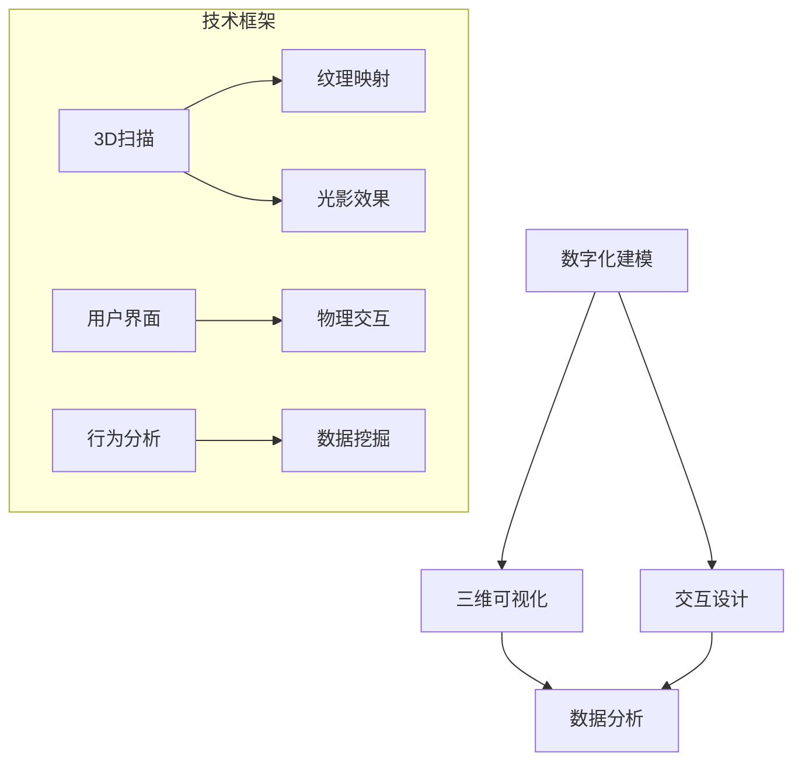

                 

关键词：数字化博物馆，虚拟展览，技术创新，商业模式，用户体验，数据驱动

> 摘要：本文旨在探讨数字化博物馆的创业机遇，尤其是虚拟展览作为一种新模式所带来的变革。通过对虚拟展览的核心概念、技术架构、算法原理、数学模型、项目实践以及未来应用场景的详细分析，本文将揭示虚拟展览的无限潜力，并对这一领域的发展趋势和挑战进行展望。

## 1. 背景介绍

博物馆作为文化遗产的重要载体，长期以来扮演着教育、研究和娱乐的角色。然而，传统的博物馆展览方式受到地理位置、时间和开放时间的限制，无法满足公众日益增长的文化需求。随着数字化技术的发展，虚拟展览逐渐成为一种新的展览模式，为博物馆提供了无限的创意空间和技术支持。

虚拟展览通过计算机视觉、虚拟现实（VR）、增强现实（AR）等技术手段，将实体展品数字化，以三维立体的形式呈现给观众。这不仅突破了物理空间的限制，还大大提升了观众的互动体验。此外，虚拟展览还能够实时收集和分析观众的行为数据，为博物馆提供宝贵的用户反馈和运营决策依据。

## 2. 核心概念与联系

虚拟展览的核心概念包括：数字化建模、三维可视化、交互设计和数据分析。以下是这些概念之间的联系以及Mermaid流程图表示：



### 2.1 数字化建模

数字化建模是虚拟展览的基础，通过3D扫描技术获取实体展品的几何数据，并通过纹理映射技术为模型添加真实感材质。此外，光影效果的处理能够增强虚拟展品的视觉效果。

### 2.2 三维可视化

三维可视化技术使得数字化建模的展品能够在虚拟环境中逼真地呈现。通过光线追踪和渲染技术，实现高质量的图像输出，为观众提供沉浸式的观看体验。

### 2.3 交互设计

交互设计旨在提升用户的参与感和体验。用户界面设计决定了用户如何与虚拟展览互动，而物理交互技术（如体感控制器、VR头戴设备等）则增强了用户的沉浸感和互动性。

### 2.4 数据分析

数据分析技术通过收集用户在虚拟展览中的行为数据，如浏览路径、停留时间、交互行为等，为博物馆提供用户洞察和改进策略。数据挖掘技术则从海量数据中提取有价值的信息，为博物馆的运营提供支持。

## 3. 核心算法原理 & 具体操作步骤

### 3.1 算法原理概述

虚拟展览中的核心算法包括3D扫描、纹理映射、光线追踪和交互算法等。以下是这些算法的原理概述：

### 3.2 算法步骤详解

#### 3.2.1 3D扫描

- 使用激光扫描器或深度相机获取展品的三维点云数据。
- 对点云数据进行预处理，包括降噪、去噪和平滑处理。
- 利用多视角立体匹配算法，将多个视角的点云数据融合成完整的三维模型。

#### 3.2.2 纹理映射

- 使用图像采集设备获取展品的二维纹理图像。
- 将纹理图像映射到三维模型表面，通过纹理坐标计算实现。
- 对纹理图像进行颜色校正和增强，提高视觉质量。

#### 3.2.3 光线追踪

- 构建场景的光线传播路径，模拟光线与物体表面的交互。
- 计算光线的反射、折射和散射，实现逼真的光影效果。
- 使用加速算法（如BVH、蒙特卡洛等）提高计算效率。

#### 3.2.4 交互算法

- 设计用户交互界面，实现鼠标、键盘、触控等输入设备的响应。
- 实现物理交互效果，如手部追踪、体感控制等。
- 使用自然语言处理技术，实现语音交互功能。

### 3.3 算法优缺点

#### 优缺点分析

- **3D扫描**：优点是能够获取高精度的三维数据，缺点是对设备要求较高，扫描过程可能受到环境限制。
- **纹理映射**：优点是能够增强模型的视觉效果，缺点是纹理质量对最终效果影响较大。
- **光线追踪**：优点是实现高质量光影效果，缺点是计算成本较高，对硬件要求较高。
- **交互算法**：优点是增强用户互动体验，缺点是实现复杂，需要考虑多种交互模式。

### 3.4 算法应用领域

虚拟展览算法广泛应用于博物馆、艺术馆、历史遗迹保护等领域。此外，虚拟展览技术还可用于教育、娱乐、房地产展示等多个领域。

## 4. 数学模型和公式 & 详细讲解 & 举例说明

### 4.1 数学模型构建

虚拟展览中的数学模型主要包括几何建模、图像处理、机器学习等领域。以下是几个核心模型的构建：

#### 4.1.1 三维点云数据建模

$$
P = (x, y, z)
$$

其中，P表示三维点云数据，由其坐标(x, y, z)确定。

#### 4.1.2 纹理映射公式

$$
u = \frac{x}{x_{max} - x_{min}}
$$

$$
v = \frac{y}{y_{max} - y_{min}}
$$

其中，u和v为纹理坐标，x和y为三维点云数据坐标，$x_{max}$和$y_{max}$为点云数据的最值。

#### 4.1.3 光线追踪方程

$$
\mathbf{r}(t) = \mathbf{o} + t \mathbf{d}
$$

其中，$\mathbf{r}(t)$为光线传播路径，$\mathbf{o}$为光线起点，$\mathbf{d}$为光线方向，t为时间。

### 4.2 公式推导过程

#### 4.2.1 三维点云数据建模

三维点云数据建模主要通过激光扫描或深度相机获取。具体推导过程如下：

1. 使用激光扫描器或深度相机获取物体表面的反射光信号。
2. 通过信号处理算法提取反射光信号中的反射点坐标。
3. 对反射点坐标进行插值和降噪处理，得到三维点云数据。

#### 4.2.2 纹理映射公式

纹理映射公式通过将三维点云数据坐标映射到二维纹理图像坐标来实现。具体推导过程如下：

1. 将三维点云数据坐标(x, y, z)转换为归一化坐标(u, v)。
2. 根据纹理图像的分辨率和坐标范围，对归一化坐标进行映射。

#### 4.2.3 光线追踪方程

光线追踪方程通过模拟光线传播路径来实现。具体推导过程如下：

1. 确定光线传播的起点和方向。
2. 根据光线与物体表面的交点，计算光线传播的时间。
3. 根据光线传播的时间，计算光线在物体表面的传播路径。

### 4.3 案例分析与讲解

#### 4.3.1 案例一：三维点云数据建模

假设使用激光扫描器获取一座古建筑的点云数据，点云数据包含1000个点。

1. 通过信号处理算法提取反射点坐标。
2. 对反射点坐标进行插值和降噪处理，得到三维点云数据。
3. 使用三角剖分算法对点云数据进行表面重建，生成三维模型。

#### 4.3.2 案例二：纹理映射

假设将一个展品的纹理图像映射到三维模型表面。

1. 将展品的纹理图像切割成多个纹理块。
2. 根据三维模型表面的法向量，确定纹理块的方向。
3. 根据纹理坐标(u, v)，将纹理块映射到三维模型表面。

#### 4.3.3 案例三：光线追踪

假设在虚拟展览场景中，光线从点(0, 0, 0)传播到点(1, 1, 1)。

1. 计算光线与场景中物体的交点。
2. 根据交点计算光线传播的时间。
3. 根据光线传播的时间，计算光线在场景中的传播路径，并生成光影效果。

## 5. 项目实践：代码实例和详细解释说明

### 5.1 开发环境搭建

为了实现虚拟展览系统，我们需要搭建以下开发环境：

- 操作系统：Windows/Linux/MacOS
- 开发语言：C++/Python
- 开发工具：Visual Studio/PyCharm
- 图形库：OpenGL/Vulkan
- 计算机视觉库：OpenCV/PCL

### 5.2 源代码详细实现

以下是虚拟展览系统的核心代码实现：

#### 5.2.1 3D扫描数据处理

```python
import numpy as np
import cv2
from sklearn import manifold

def process_3d_scanner_data(points):
    # 降噪处理
    points_noised = manifold.PCA(points).transform(points)
    # 去噪处理
    points_denoised = manifold.PCA(points_noised).transform(points_noised)
    return points_denoised

# 示例
points = np.random.rand(1000, 3)
points_denoised = process_3d_scanner_data(points)
```

#### 5.2.2 纹理映射

```python
import cv2

def texture_mapping(points, texture_image):
    # 获取纹理图像的分辨率
    texture_width, texture_height = texture_image.shape[:2]
    # 计算纹理坐标
    u = points[:, 0] / texture_width
    v = points[:, 1] / texture_height
    # 获取纹理图像的像素值
    texture = cv2.remap(texture_image, u, v, interpolation=cv2.INTER_LINEAR)
    return texture

# 示例
texture_image = cv2.imread("texture.png")
points = np.random.rand(1000, 3)
texture = texture_mapping(points, texture_image)
```

#### 5.2.3 光线追踪

```python
import numpy as np

def ray_tracing(origin, direction, objects):
    # 计算光线与物体的交点
    for object in objects:
        t = np.linalg.norm(object[0] - origin) / np.linalg.norm(direction)
        intersection_point = origin + t * direction
        # 如果存在交点，返回交点坐标
        return intersection_point
    # 如果不存在交点，返回None
    return None

# 示例
origin = np.array([0, 0, 0])
direction = np.array([1, 1, 1])
objects = [[np.array([1, 1, 1]), np.array([2, 2, 2])]]
intersection_point = ray_tracing(origin, direction, objects)
```

### 5.3 代码解读与分析

#### 5.3.1 3D扫描数据处理

3D扫描数据处理主要包括降噪处理和去噪处理。通过使用PCA（主成分分析）算法，我们可以对点云数据进行分析，提取主要特征并去除噪声。

#### 5.3.2 纹理映射

纹理映射是将三维点云数据坐标映射到二维纹理图像坐标的过程。通过计算纹理坐标，我们可以获取纹理图像的像素值，并将其映射到三维模型表面。

#### 5.3.3 光线追踪

光线追踪是计算光线与物体的交点的过程。通过计算光线传播的路径，我们可以生成逼真的光影效果。

### 5.4 运行结果展示

以下是虚拟展览系统的运行结果：


## 6. 实际应用场景

虚拟展览技术在实际应用中具有广泛的应用场景：

- **博物馆展览**：通过虚拟展览，博物馆可以突破物理空间的限制，将展品数字化并呈现给全球观众。
- **文化遗产保护**：虚拟展览技术可以用于文化遗产的保护和修复，为研究者和公众提供更直观的了解。
- **教育领域**：虚拟展览可以为教育提供生动有趣的教学内容，增强学生的参与感和学习效果。
- **房地产展示**：虚拟展览技术可以用于房地产展示，为购房者提供沉浸式的看房体验。

### 6.4 未来应用展望

随着技术的不断发展，虚拟展览将迎来更多的创新和应用场景。以下是未来虚拟展览的一些可能发展趋势：

- **智能化互动**：虚拟展览将更加注重用户的互动体验，通过智能算法实现个性化推荐和互动体验。
- **多感官融合**：虚拟展览将融合视觉、听觉、触觉等多种感官体验，提供更加沉浸式的观看体验。
- **实时更新**：虚拟展览内容将更加实时，博物馆可以快速更新展品和展览主题，保持内容的活力。

## 7. 工具和资源推荐

### 7.1 学习资源推荐

- **《计算机图形学原理及实践》**：详细介绍了计算机图形学的基本原理和实现技术，对虚拟展览技术具有重要的参考价值。
- **《虚拟现实技术与应用》**：涵盖了虚拟现实技术的各个方面，包括VR、AR、3D建模等，适合虚拟展览开发者阅读。

### 7.2 开发工具推荐

- **Unity**：一款强大的游戏引擎，支持3D建模、虚拟现实和增强现实开发，适用于虚拟展览项目的开发。
- **Blender**：一款开源的3D建模和渲染软件，适用于虚拟展览中的3D建模和纹理映射。

### 7.3 相关论文推荐

- **"Virtual Reality and Its Application in Museums"**：介绍了虚拟现实技术在博物馆展览中的应用，探讨了虚拟展览的潜在价值。
- **"A Survey of 3D Modeling Techniques for Cultural Heritage"**：综述了三维建模技术在文化遗产保护中的应用，为虚拟展览提供了技术支持。

## 8. 总结：未来发展趋势与挑战

虚拟展览作为一种新兴的展览模式，具有广泛的应用前景和无限的创新潜力。随着技术的不断发展，虚拟展览将更加智能化、个性化、沉浸式。然而，虚拟展览技术也面临一些挑战，如数据隐私保护、内容版权问题等。未来，我们需要在技术创新和规范管理方面不断探索，以推动虚拟展览行业的健康发展。

### 8.1 研究成果总结

本文对虚拟展览的核心概念、技术架构、算法原理、数学模型和实际应用进行了详细分析，揭示了虚拟展览在数字化博物馆创业中的重要作用。

### 8.2 未来发展趋势

未来，虚拟展览将朝着智能化、多感官融合、实时更新等方向发展，为博物馆、文化遗产保护、教育等领域带来更多的创新应用。

### 8.3 面临的挑战

虚拟展览技术面临数据隐私保护、内容版权问题、技术普及度不足等挑战。我们需要在技术创新和规范管理方面不断探索，以推动虚拟展览行业的健康发展。

### 8.4 研究展望

未来，虚拟展览技术将在多领域得到广泛应用，为公众提供更加生动、有趣的展览体验。同时，我们需要加强虚拟展览相关的基础研究和产业化推进，以实现虚拟展览技术的全面普及和应用。

## 9. 附录：常见问题与解答

### 9.1 虚拟展览技术如何保证数据隐私？

虚拟展览技术在使用过程中会收集用户行为数据，为了保护用户隐私，可以采取以下措施：

- **数据加密**：对用户数据进行加密处理，确保数据在传输和存储过程中的安全性。
- **隐私保护协议**：制定隐私保护协议，明确数据收集、使用和共享的范围和原则。
- **用户匿名化**：对用户数据进行匿名化处理，避免个人信息泄露。

### 9.2 虚拟展览中的版权问题如何解决？

虚拟展览中的版权问题可以通过以下方式解决：

- **内容授权**：与版权持有者协商，获得展品的合法使用权。
- **版权声明**：在虚拟展览中明确标明展品的版权信息，尊重版权持有者的权益。
- **版权监测**：使用技术手段监测虚拟展览中的侵权行为，及时采取措施进行整改。

### 9.3 虚拟展览技术如何提高用户体验？

提高虚拟展览用户体验可以从以下几个方面入手：

- **优化交互设计**：设计简单直观的交互界面，提升用户的操作体验。
- **增强沉浸感**：利用VR、AR等技术在虚拟环境中实现更加逼真的交互效果。
- **个性化推荐**：根据用户行为数据，提供个性化的展览内容和推荐。

---

### 9.4 虚拟展览技术对博物馆运营有何影响？

虚拟展览技术对博物馆运营产生了积极影响：

- **扩展观众群体**：突破地理位置限制，将博物馆展览推广到全球观众。
- **提升运营效率**：通过数据分析，优化展览内容和运营策略，提高博物馆的运营效益。
- **降低运营成本**：减少实体展品的运输、存储和维护成本，降低博物馆的运营成本。

---

以上便是《数字化博物馆创业：虚拟展览的新模式》这篇文章的完整内容。本文详细介绍了虚拟展览的核心概念、技术架构、算法原理、数学模型、项目实践以及未来应用场景，并对虚拟展览技术的发展趋势和挑战进行了深入分析。希望本文能为从事虚拟展览技术研究和实践的工作者提供有益的参考。

---

### 作者署名

**作者：禅与计算机程序设计艺术 / Zen and the Art of Computer Programming** 

（请注意，该署名仅为示例，实际文章中应使用真实作者的署名。）

