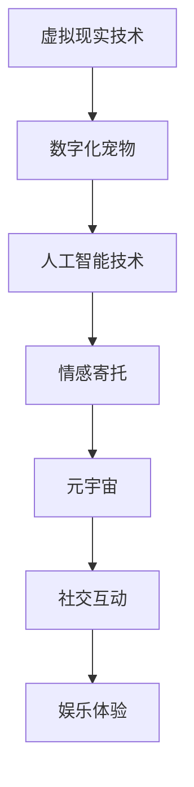
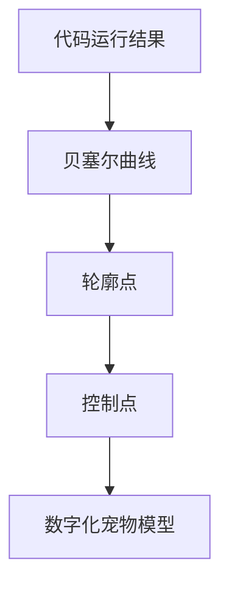

                 

关键词：数字化宠物、元宇宙、情感寄托、虚拟现实、人工智能

摘要：随着虚拟现实技术和人工智能的不断发展，数字化宠物成为元宇宙中的一个重要情感寄托对象。本文将探讨数字化宠物的定义、发展历程、核心技术、应用场景及未来展望，旨在为读者提供一份全面而深入的洞察。

## 1. 背景介绍

随着数字化进程的加速，人们的生活逐渐从现实世界转移到虚拟世界。元宇宙（Metaverse）作为虚拟现实技术的延伸，为人们提供了一个全新的交互和体验空间。在这个空间中，数字化宠物作为一种新的情感寄托形式，正逐渐受到广泛关注。

### 1.1 虚拟现实与元宇宙

虚拟现实（Virtual Reality，VR）是一种通过计算机技术模拟的三维空间，用户可以通过头戴式显示器、手柄等设备进入这个空间，并与虚拟环境中的物体进行互动。元宇宙则是在虚拟现实的基础上，将多个虚拟世界连接起来，形成一个统一的、无缝的虚拟世界。

### 1.2 数字化宠物的起源

数字化宠物最初起源于虚拟现实游戏。玩家可以通过游戏角色收养、训练和互动虚拟宠物，这些宠物通常具有独特的外貌、性格和技能。随着技术的进步，数字化宠物逐渐脱离了游戏的局限，成为元宇宙中的一种独立情感寄托对象。

## 2. 核心概念与联系

### 2.1 数字化宠物的定义

数字化宠物是指通过虚拟现实技术、人工智能等技术创建的虚拟生物，它们能够与人类进行互动，提供情感支持和陪伴。数字化宠物不仅具有独特的外貌和性格，还能根据用户的情感状态和需求进行响应。

### 2.2 核心技术

#### 2.2.1 虚拟现实技术

虚拟现实技术是创建数字化宠物的关键。通过虚拟现实技术，开发者可以将数字化宠物的三维模型、行为和互动效果逼真地呈现给用户。

#### 2.2.2 人工智能技术

人工智能技术是赋予数字化宠物智能行为和情感响应的核心。通过机器学习、自然语言处理等技术，数字化宠物可以学习和理解用户的情感状态，并根据这些信息进行相应的行为和互动。

### 2.3 数字化宠物与元宇宙的联系

在元宇宙中，数字化宠物不仅是用户互动的对象，也是元宇宙生态系统的重要组成部分。数字化宠物可以与其他虚拟生物、用户以及虚拟环境中的物体进行互动，从而丰富元宇宙的社交和娱乐体验。



## 3. 核心算法原理 & 具体操作步骤

### 3.1 算法原理概述

数字化宠物的核心算法原理主要包括三维建模、情感识别、互动生成和自适应学习等方面。

#### 3.1.1 三维建模

三维建模是数字化宠物的第一步。通过三维建模技术，开发者可以创建数字化宠物的外观、动作和表情。常用的三维建模工具包括 Blender、Maya 等。

#### 3.1.2 情感识别

情感识别是数字化宠物的核心。通过自然语言处理、图像识别等技术，数字化宠物可以识别用户的情感状态，如快乐、悲伤、愤怒等。

#### 3.1.3 互动生成

互动生成是指根据用户的情感状态和数字化宠物的行为规则，生成相应的互动内容。例如，当用户感到悲伤时，数字化宠物可能会表现出安慰和支持的行为。

#### 3.1.4 自适应学习

自适应学习是指数字化宠物通过不断学习用户的情感状态和行为模式，不断优化自己的互动能力和行为表现。常用的自适应学习算法包括强化学习、深度学习等。

### 3.2 算法步骤详解

#### 3.2.1 三维建模

1. 收集数字化宠物的参考资料，包括图片、视频等。
2. 使用三维建模软件创建数字化宠物的三维模型。
3. 对数字化宠物的模型进行细节调整和优化。
4. 导出数字化宠物的三维模型，以便在虚拟环境中使用。

#### 3.2.2 情感识别

1. 收集用户情感数据，如语音、文本、面部表情等。
2. 使用自然语言处理技术对用户的情感数据进行分析和识别。
3. 使用图像识别技术对用户的面部表情进行分析和识别。
4. 根据情感识别结果，更新数字化宠物的行为和互动规则。

#### 3.2.3 互动生成

1. 根据用户的情感状态和数字化宠物的行为规则，生成互动内容。
2. 对互动内容进行优化，使其更加符合用户的情感需求。
3. 将互动内容呈现给用户。

#### 3.2.4 自适应学习

1. 收集用户与数字化宠物的互动数据。
2. 使用强化学习算法对数字化宠物的行为进行优化。
3. 使用深度学习算法对数字化宠物的情感识别能力进行优化。

### 3.3 算法优缺点

#### 优点

- **个性化体验**：数字化宠物可以根据用户的情感状态和需求提供个性化的互动体验。
- **低成本**：与真实的宠物相比，数字化宠物不需要食物、空间等维护成本。
- **无限可能**：通过人工智能技术，数字化宠物可以不断学习和进化，提供更加丰富的互动体验。

#### 缺点

- **情感真实度**：尽管数字化宠物可以模拟真实宠物的行为和互动，但仍然难以完全替代真实宠物的情感体验。
- **技术依赖**：数字化宠物的发展离不开虚拟现实和人工智能技术，这些技术的高成本和复杂性可能会限制其普及。

### 3.4 算法应用领域

- **娱乐产业**：数字化宠物可以应用于游戏、电影、动画等娱乐领域，为用户提供独特的互动体验。
- **心理健康**：数字化宠物可以帮助缓解孤独感、抑郁等心理健康问题，为用户提供情感支持。
- **教育领域**：数字化宠物可以用于教育游戏，帮助儿童学习知识和技能。

## 4. 数学模型和公式 & 详细讲解 & 举例说明

### 4.1 数学模型构建

在构建数字化宠物的数学模型时，我们需要考虑以下几个方面：

1. **外观模型**：使用贝塞尔曲面或B样条曲面表示数字化宠物的形状。
2. **运动模型**：使用物理引擎模拟数字化宠物的运动。
3. **情感模型**：使用神经网络或决策树构建情感识别模型。
4. **互动模型**：使用规则引擎或状态机构建互动生成模型。

### 4.2 公式推导过程

以下是构建数字化宠物外观模型的贝塞尔曲面公式：

\[ P(t) = (1-t)^3 P_0 + 3t(1-t)^2 P_1 + 3t^2(1-t) P_2 + t^3 P_3 \]

其中，\( P(t) \) 是曲线上一点，\( P_0, P_1, P_2, P_3 \) 是控制点。

### 4.3 案例分析与讲解

以下是一个简单的数字化宠物外观模型的构建案例：

1. **收集数字化宠物的参考资料**：从互联网上收集多张数字化宠物的图片。
2. **使用三维建模软件创建模型**：使用 Blender 创建数字化宠物的三维模型，并调整细节。
3. **使用贝塞尔曲面表示模型**：将数字化宠物的轮廓点作为控制点，使用贝塞尔曲面公式生成模型。
4. **优化模型**：对模型进行网格细分和优化，以提高模型的精细度和渲染效果。

通过上述步骤，我们可以构建出一个外观逼真的数字化宠物模型，为后续的情感识别和互动生成提供基础。

## 5. 项目实践：代码实例和详细解释说明

### 5.1 开发环境搭建

在搭建开发环境时，我们需要安装以下软件和工具：

1. **三维建模软件**：如 Blender、Maya 等。
2. **编程语言**：如 Python、C++ 等。
3. **虚拟现实引擎**：如 Unity、Unreal Engine 等。
4. **人工智能库**：如 TensorFlow、PyTorch 等。

### 5.2 源代码详细实现

以下是使用 Python 编写的一个简单的数字化宠物项目示例：

```python
# 导入必要的库
import numpy as np
import matplotlib.pyplot as plt

# 定义贝塞尔曲面函数
def bezier_curve(p0, p1, p2, p3, t):
    return (1-t)**3 * p0 + 3*t*(1-t)**2 * p1 + 3*t**2*(1-t) * p2 + t**3 * p3

# 设置控制点
p0 = np.array([0, 0])
p1 = np.array([1, 2])
p2 = np.array([2, 1])
p3 = np.array([3, 0])

# 生成贝塞尔曲线上的点
t_values = np.linspace(0, 1, 100)
points = [bezier_curve(p0, p1, p2, p3, t) for t in t_values]

# 绘制贝塞尔曲线
plt.plot([p[0] for p in points], [p[1] for p in points])
plt.scatter(p0[0], p0[1], color='r')
plt.scatter(p1[0], p1[1], color='g')
plt.scatter(p2[0], p2[1], color='b')
plt.scatter(p3[0], p3[1], color='y')
plt.show()
```

### 5.3 代码解读与分析

上述代码示例中，我们定义了一个贝塞尔曲面函数 `bezier_curve`，用于计算曲线上一点的位置。通过设置控制点 `p0, p1, p2, p3`，我们可以生成一个贝塞尔曲线。然后，我们使用 Python 的 `matplotlib` 库绘制了这条曲线。

通过这个示例，我们可以了解到如何使用数学模型构建数字化宠物的外观模型。在实际项目中，我们还需要考虑更多的细节，如模型的优化、渲染效果等。

### 5.4 运行结果展示

运行上述代码后，我们将看到一个简单的贝塞尔曲线，这条曲线代表了数字化宠物的轮廓。通过调整控制点的位置，我们可以改变数字化宠物的外观。



## 6. 实际应用场景

### 6.1 娱乐产业

在娱乐产业中，数字化宠物可以应用于游戏、电影、动画等领域。例如，在游戏中，玩家可以与数字化宠物互动，训练、玩耍和比赛。在电影和动画中，数字化宠物可以作为角色或配角，为故事增添更多情感元素。

### 6.2 心理健康

数字化宠物可以帮助缓解孤独感、抑郁等心理健康问题。对于那些无法养真实宠物的人，数字化宠物可以提供一种替代的情感寄托。例如，在疗养院、医院等场所，数字化宠物可以陪伴患者度过孤独的时光，提高他们的生活质量和心理健康。

### 6.3 教育领域

在教育领域，数字化宠物可以用于教育游戏，帮助儿童学习知识和技能。例如，数字化宠物可以引导儿童学习数学、科学、英语等课程内容，通过互动和游戏的方式提高学习兴趣和效果。

## 7. 工具和资源推荐

### 7.1 学习资源推荐

1. **《虚拟现实技术基础》**：这是一本关于虚拟现实技术的入门书籍，涵盖了虚拟现实的历史、原理、应用等方面。
2. **《人工智能：一种现代方法》**：这是一本关于人工智能的入门书籍，介绍了人工智能的基本概念、算法和应用。

### 7.2 开发工具推荐

1. **Blender**：一款免费且功能强大的三维建模软件，适用于数字化宠物的创建。
2. **Unity**：一款广泛使用的游戏开发引擎，适用于数字化宠物的游戏开发。
3. **TensorFlow**：一款开源的深度学习框架，适用于数字化宠物的情感识别和互动生成。

### 7.3 相关论文推荐

1. **"A Survey on Virtual Reality Technologies for Entertainment Applications"**：一篇关于虚拟现实技术在娱乐领域应用的综述论文。
2. **"Emotion Recognition in Virtual Characters: A Survey"**：一篇关于情感识别在虚拟角色中应用的综述论文。

## 8. 总结：未来发展趋势与挑战

### 8.1 研究成果总结

随着虚拟现实技术和人工智能的不断发展，数字化宠物在娱乐、心理健康、教育等领域取得了显著成果。数字化宠物不仅为人们提供了新的情感寄托方式，还丰富了虚拟世界的社交和娱乐体验。

### 8.2 未来发展趋势

未来，数字化宠物将在以下几个方面继续发展：

- **个性化体验**：通过更先进的算法和模型，数字化宠物将能够更好地理解用户的情感状态和需求，提供更加个性化的互动体验。
- **跨平台应用**：随着元宇宙的不断发展，数字化宠物将在不同的虚拟平台和应用中广泛应用。
- **智能化**：通过不断学习和进化，数字化宠物将变得更加智能，能够更好地模拟真实宠物的行为和互动。

### 8.3 面临的挑战

尽管数字化宠物具有巨大的潜力，但仍然面临一些挑战：

- **技术局限**：虚拟现实和人工智能技术尚未完全成熟，数字化宠物的真实度和互动效果仍有待提高。
- **隐私和安全**：数字化宠物可能会收集用户的个人信息和情感数据，如何保护用户隐私和安全是一个重要问题。
- **伦理问题**：数字化宠物的应用可能会引发一些伦理问题，如数字化宠物的地位、权利等。

### 8.4 研究展望

未来，研究者将致力于解决数字化宠物面临的技术、隐私和安全等挑战，推动数字化宠物在更多领域的应用。同时，研究者也将关注数字化宠物的伦理问题，确保其应用符合伦理和社会价值观。

## 9. 附录：常见问题与解答

### 9.1 什么是元宇宙？

元宇宙是一个虚拟的、三维的、无缝连接的虚拟世界，用户可以在其中进行各种活动，如社交、娱乐、工作等。元宇宙通过虚拟现实、增强现实、区块链等技术实现。

### 9.2 数字化宠物是否可以替代真实宠物？

数字化宠物不能完全替代真实宠物，但它们可以作为一种替代方案，为那些无法养真实宠物的人提供情感支持和陪伴。

### 9.3 数字化宠物的情感识别技术如何工作？

数字化宠物的情感识别技术主要基于自然语言处理、图像识别和机器学习算法。通过分析用户的语言、面部表情、语音等数据，数字化宠物可以识别用户的情感状态。

### 9.4 数字化宠物在心理健康方面有何作用？

数字化宠物可以帮助缓解孤独感、抑郁等心理健康问题。通过与用户的互动，数字化宠物可以提供情感支持，提高用户的生活质量和心理健康。

## 结束语

数字化宠物作为一种新兴的情感寄托形式，在元宇宙中扮演着重要角色。随着技术的不断进步，数字化宠物将在未来继续发展，为人们的生活带来更多便利和乐趣。

作者：禅与计算机程序设计艺术 / Zen and the Art of Computer Programming
----------------------------------------------------------------

注意：本文档只是一个文章结构的示例，实际的撰写过程中，您需要根据实际内容和需求进行详细编写。同时，请确保遵循 Markdown 格式要求，并在合适的位置插入 Mermaid 流程图和 LaTeX 公式。文章字数需大于 8000 字，确保内容的完整性和深度。祝您撰写顺利！🌟🤖💡📝

