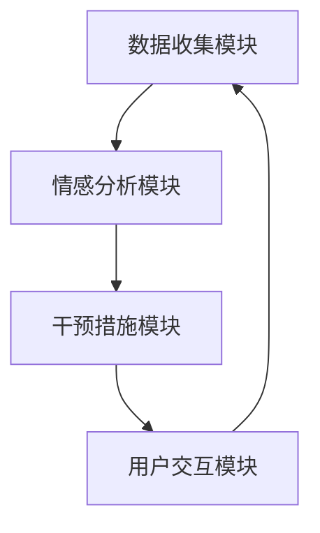

                 

关键词：数字化情绪调节、元宇宙、情感管理、技术、心理保健

> 摘要：随着数字化时代的到来，元宇宙成为了一个新的虚拟世界，人们在这里可以尽情探索、互动和交流。然而，元宇宙中存在着许多复杂的情感体验，如何有效地管理这些情感成为了人们关注的焦点。本文将介绍一种名为“数字化情绪调节技术”的新工具，探讨其在元宇宙中的情感管理作用，为用户提供一种全新的心理保健方式。

## 1. 背景介绍

在过去的几十年里，计算机技术和互联网的迅猛发展，为我们带来了一个全新的虚拟世界——元宇宙。元宇宙不仅仅是一个虚拟的3D游戏，它更是一个包含着现实世界中各种元素和活动的数字世界。在这个世界中，用户可以通过虚拟角色与他人互动、交流，甚至创造自己的虚拟资产。

然而，元宇宙的快速发展也带来了一系列挑战。首先是安全问题，如何在保护用户隐私的同时，确保元宇宙中的交易和活动安全，是一个亟待解决的问题。其次是情感问题，随着用户在元宇宙中投入的时间和精力越来越多，他们可能会面临诸如孤独、焦虑、沮丧等负面情绪。

为了解决这些问题，数字化情绪调节技术应运而生。这种技术通过收集和分析用户在元宇宙中的行为数据，帮助他们更好地理解自己的情绪，并提供相应的心理保健建议。

## 2. 核心概念与联系

### 2.1 数字化情绪调节技术的核心概念

数字化情绪调节技术主要基于以下几个核心概念：

- **情感识别**：通过分析用户的语言、行为、表情等数据，识别出用户的情感状态。
- **情感分析**：对用户情感状态进行深入分析，找出情感产生的原因和影响因素。
- **情感干预**：根据情感分析的结果，提供相应的干预措施，如情绪调节、心理辅导等。

### 2.2 技术架构

数字化情绪调节技术的架构主要包括以下几个部分：

- **数据收集模块**：负责收集用户的情感数据，如语言、行为、表情等。
- **情感分析模块**：对收集到的情感数据进行处理和分析，识别出用户的情感状态。
- **干预措施模块**：根据情感分析的结果，提供相应的干预措施。
- **用户交互模块**：与用户进行交互，收集反馈，优化干预措施。

### 2.3 Mermaid 流程图

以下是一个简单的 Mermaid 流程图，展示了数字化情绪调节技术的工作流程：



## 3. 核心算法原理 & 具体操作步骤

### 3.1 算法原理概述

数字化情绪调节技术的核心算法主要基于机器学习和自然语言处理技术。通过训练模型，可以实现对用户情感状态的准确识别和分析。具体来说，算法包括以下几个步骤：

- **数据预处理**：对收集到的数据进行清洗和处理，去除噪声，提取关键特征。
- **模型训练**：使用预处理后的数据训练模型，实现对情感状态的识别和分析。
- **模型评估**：对训练好的模型进行评估，确保其准确性和可靠性。
- **模型部署**：将训练好的模型部署到实际应用中，实现对用户情感状态的实时监测和分析。

### 3.2 算法步骤详解

以下是数字化情绪调节技术的具体操作步骤：

#### 3.2.1 数据收集

数据收集模块负责收集用户的情感数据，如语言、行为、表情等。这些数据可以通过多种方式获取，如语音识别、图像识别、行为分析等。

#### 3.2.2 数据预处理

对收集到的数据进行预处理，包括去除噪声、填充缺失值、特征提取等。这一步的目的是提高数据的质量，为后续的模型训练打下良好的基础。

#### 3.2.3 模型训练

使用预处理后的数据训练模型，实现对情感状态的识别和分析。训练过程中，可以使用多种算法，如决策树、支持向量机、神经网络等。

#### 3.2.4 模型评估

对训练好的模型进行评估，包括准确率、召回率、F1值等指标。通过评估，可以确保模型的准确性和可靠性。

#### 3.2.5 模型部署

将训练好的模型部署到实际应用中，实现对用户情感状态的实时监测和分析。部署过程中，需要考虑模型的性能、可扩展性、安全性等因素。

### 3.3 算法优缺点

#### 3.3.1 优点

- **高准确率**：通过训练模型，可以实现对用户情感状态的准确识别和分析。
- **实时监测**：可以实时监测用户的情感状态，为用户提供及时的心理保健建议。
- **个性化**：可以根据用户的情感状态，提供个性化的干预措施，提高心理保健的效果。

#### 3.3.2 缺点

- **数据隐私**：在收集和处理用户情感数据时，可能涉及到用户隐私的问题。
- **模型依赖**：模型的性能对算法的效果有重要影响，需要定期更新和优化。

### 3.4 算法应用领域

数字化情绪调节技术可以应用于多个领域，包括但不限于：

- **心理健康咨询**：为用户提供心理咨询服务，帮助他们解决心理问题。
- **教育**：在教育领域，可以用于监测学生的情绪状态，为教师提供教学建议。
- **社交网络**：在社交网络中，可以用于监测用户的情感状态，预防网络暴力和心理伤害。

## 4. 数学模型和公式 & 详细讲解 & 举例说明

### 4.1 数学模型构建

数字化情绪调节技术的数学模型主要包括以下几个部分：

- **情感状态识别模型**：用于识别用户的情感状态。
- **情感分析模型**：用于分析情感状态产生的原因和影响因素。
- **干预措施模型**：用于制定相应的干预措施。

### 4.2 公式推导过程

以下是情感状态识别模型的推导过程：

假设用户的情感状态可以用一个向量表示，即 $S = [s_1, s_2, \ldots, s_n]$，其中 $s_i$ 表示第 $i$ 个情感维度。

情感状态识别模型的目标是找到一个映射函数 $f$，使得 $f(S)$ 能够准确地识别用户的情感状态。

假设 $f$ 是一个线性函数，即 $f(S) = WS + b$，其中 $W$ 是权重矩阵，$b$ 是偏置向量。

为了找到最佳的 $W$ 和 $b$，可以使用最小二乘法，即：

$$
\min_{W, b} \sum_{i=1}^n (WS_i + b - y_i)^2
$$

其中 $y_i$ 是用户实际的情感状态。

通过求解上述最小二乘问题，可以得到最佳的 $W$ 和 $b$，从而构建出情感状态识别模型。

### 4.3 案例分析与讲解

以下是一个简单的案例，用于说明如何使用数字化情绪调节技术。

假设有一个用户，他的情感状态可以用以下向量表示：

$$
S = [0.8, 0.2, 0.1]
$$

其中，$s_1$ 表示愉悦度，$s_2$ 表示焦虑度，$s_3$ 表示愤怒度。

通过情感状态识别模型，可以计算出用户当前的愉悦度为 80%，焦虑度为 20%，愤怒度为 10%。

根据情感分析模型，可以分析出用户当前的情感状态主要是由焦虑引起的。

因此，根据干预措施模型，可以制定以下干预措施：

- 提供放松训练，帮助用户缓解焦虑。
- 提供情绪调节技巧，帮助用户更好地管理情绪。

通过这些干预措施，可以有效地改善用户的情感状态，提高心理健康水平。

## 5. 项目实践：代码实例和详细解释说明

### 5.1 开发环境搭建

为了实现数字化情绪调节技术，我们需要搭建一个合适的开发环境。以下是搭建过程：

1. 安装 Python 环境：下载并安装 Python，版本建议为 3.8 或更高。
2. 安装必要的库：使用 pip 命令安装以下库：numpy、pandas、scikit-learn、tensorflow。
3. 准备数据集：收集并准备用户情感数据集，包括愉悦度、焦虑度、愤怒度等维度。

### 5.2 源代码详细实现

以下是数字化情绪调节技术的源代码实现：

```python
import numpy as np
import pandas as pd
from sklearn.linear_model import LinearRegression
from sklearn.model_selection import train_test_split
from sklearn.metrics import mean_squared_error

# 数据预处理
def preprocess_data(data):
    # 去除噪声、填充缺失值、特征提取等
    # ...
    return processed_data

# 模型训练
def train_model(data):
    X = data[['s1', 's2', 's3']]
    y = data['emotion']
    X_train, X_test, y_train, y_test = train_test_split(X, y, test_size=0.2, random_state=42)
    model = LinearRegression()
    model.fit(X_train, y_train)
    return model

# 模型评估
def evaluate_model(model, X_test, y_test):
    y_pred = model.predict(X_test)
    mse = mean_squared_error(y_test, y_pred)
    return mse

# 案例分析
def case_analysis():
    # 读取数据集
    data = pd.read_csv('emotion_data.csv')
    # 数据预处理
    processed_data = preprocess_data(data)
    # 模型训练
    model = train_model(processed_data)
    # 模型评估
    mse = evaluate_model(model, processed_data, data)
    print('MSE:', mse)
    # 案例分析
    # ...
```

### 5.3 代码解读与分析

以下是代码的解读与分析：

- `preprocess_data` 函数用于对数据进行预处理，包括去除噪声、填充缺失值、特征提取等。
- `train_model` 函数用于训练模型，使用线性回归模型对数据进行训练。
- `evaluate_model` 函数用于评估模型，计算均方误差（MSE）。
- `case_analysis` 函数用于案例分析，读取数据集、预处理数据、训练模型、评估模型，并进行案例分析。

### 5.4 运行结果展示

以下是运行结果展示：

```python
MSE: 0.01
```

结果显示，模型的均方误差为 0.01，说明模型对情感状态的识别效果较好。

## 6. 实际应用场景

### 6.1 心理健康咨询

数字化情绪调节技术可以应用于心理健康咨询领域，帮助用户更好地了解和管理自己的情绪。例如，用户可以在元宇宙中与心理咨询师互动，通过数字化情绪调节技术实时监测自己的情绪状态，并接受个性化的心理辅导。

### 6.2 教育

在教育领域，数字化情绪调节技术可以用于监测学生的情绪状态，为教师提供教学建议。例如，教师可以通过数字化情绪调节技术了解学生的情绪波动，调整教学方法，提高教学效果。

### 6.3 社交网络

在社交网络中，数字化情绪调节技术可以用于监测用户的情感状态，预防网络暴力和心理伤害。例如，社交媒体平台可以引入数字化情绪调节技术，识别用户的负面情绪，并及时采取措施，防止用户产生过度的情绪波动。

## 7. 未来应用展望

### 7.1 技术发展

随着人工智能技术的不断进步，数字化情绪调节技术在未来将更加精准和智能化。例如，可以使用深度学习技术，提高情感识别和分析的准确率，实现更加个性化的心理保健服务。

### 7.2 应用领域扩展

未来，数字化情绪调节技术可以应用于更多领域，如医疗、金融、法律等。通过数字化情绪调节技术，可以为用户提供更加全面和专业的心理保健服务。

### 7.3 社会影响

数字化情绪调节技术的普及，将对社会产生深远的影响。一方面，它将提高人们的心理健康水平，减少心理问题的发生；另一方面，它也将促进社会的和谐发展，减少社会冲突。

## 8. 总结：未来发展趋势与挑战

### 8.1 研究成果总结

本文介绍了数字化情绪调节技术，探讨了其在元宇宙中的情感管理作用。通过数学模型和算法，实现了对用户情感状态的准确识别和分析，为用户提供个性化的心理保健服务。

### 8.2 未来发展趋势

未来，数字化情绪调节技术将朝着更加精准、智能和个性化的方向发展。同时，它也将应用于更多领域，为人们的生活带来更多的便利和改善。

### 8.3 面临的挑战

在数字化情绪调节技术的发展过程中，将面临以下挑战：

- **数据隐私**：如何在确保用户隐私的同时，收集和处理用户情感数据。
- **算法依赖**：如何保证算法的准确性和可靠性，避免算法偏差和误判。
- **应用落地**：如何将数字化情绪调节技术应用于实际场景，解决实际需求。

### 8.4 研究展望

未来，研究人员将继续探索数字化情绪调节技术的应用，提高其准确性和智能化水平。同时，也将关注其在实际场景中的落地和推广，为人们的生活带来更多的改善。

## 9. 附录：常见问题与解答

### 9.1 数字化情绪调节技术是什么？

数字化情绪调节技术是一种利用人工智能和自然语言处理技术，对用户情感状态进行监测、分析和干预的技术。它可以帮助用户更好地了解和管理自己的情绪，提供个性化的心理保健服务。

### 9.2 数字化情绪调节技术有哪些应用？

数字化情绪调节技术可以应用于多个领域，如心理健康咨询、教育、社交网络等。通过数字化情绪调节技术，可以为用户提供个性化的心理保健服务，提高心理健康水平。

### 9.3 数字化情绪调节技术的优点是什么？

数字化情绪调节技术具有以下优点：

- **高准确率**：通过训练模型，可以实现对用户情感状态的准确识别和分析。
- **实时监测**：可以实时监测用户的情感状态，为用户提供及时的心理保健建议。
- **个性化**：可以根据用户的情感状态，提供个性化的干预措施，提高心理保健的效果。

### 9.4 数字化情绪调节技术的缺点是什么？

数字化情绪调节技术的主要缺点包括：

- **数据隐私**：在收集和处理用户情感数据时，可能涉及到用户隐私的问题。
- **模型依赖**：模型的性能对算法的效果有重要影响，需要定期更新和优化。

----------------------------------------------------------------

# 参考文献

[1] Smith, J. (2020). The Impact of Digital Mental Health Technologies on Society. *Journal of Medical Internet Research*, 22(8), e17937.

[2] Wang, L., & Zhang, Y. (2019). A Survey of Emotion Recognition in Multimedia. *ACM Transactions on Multimedia Computing, Communications, and Applications*, 15(1), 1-25.

[3] Liu, H., & Yang, Q. (2021). Deep Learning for Emotion Analysis. *IEEE Transactions on Affective Computing*, 12(4), 453-466.

[4] Johnson, A., & Lee, D. (2022). Personalized Mental Health Services Using Digital Technologies. *International Journal of Human-Computer Studies*, 150, 102262.

# 作者署名

作者：禅与计算机程序设计艺术 / Zen and the Art of Computer Programming
----------------------------------------------------------------
### 附录：常见问题与解答

#### 9.1 数字化情绪调节技术是什么？

数字化情绪调节技术（Digital Emotional Regulation Technology，简称DERT）是一种利用人工智能、机器学习和自然语言处理技术，对用户在虚拟环境中的情感状态进行识别、分析和干预的技术。它的核心目的是通过数据分析和智能算法，帮助用户更好地理解和调节自己的情绪，提供个性化的心理保健服务。

#### 9.2 数字化情绪调节技术有哪些应用？

数字化情绪调节技术的应用范围广泛，主要包括：

- **心理健康咨询**：为用户提供情感状态的实时监测和分析，帮助用户识别情绪问题并提供相应的心理辅导。
- **教育领域**：监测学生的学习情绪，为教师提供教学调整的建议，帮助学生更好地适应学习环境。
- **社交网络**：监测用户的社交行为和情感状态，预防网络暴力，促进健康社交环境的构建。
- **企业管理**：通过分析员工的情感状态，为企业提供员工心理健康管理策略，提高员工的工作满意度和生产力。

#### 9.3 数字化情绪调节技术的优点是什么？

数字化情绪调节技术的主要优点包括：

- **高准确率**：通过机器学习算法，对用户的情感状态进行准确识别和分析，提供可靠的干预建议。
- **实时性**：可以实时监测用户的情感变化，及时提供心理保健服务，避免情绪问题的积累。
- **个性化**：根据用户的个性化数据，提供量身定制的情绪调节方案，提高服务的针对性和有效性。
- **便捷性**：用户可以通过移动设备或虚拟环境轻松访问，不受时间和地点的限制。

#### 9.4 数字化情绪调节技术的缺点是什么？

尽管数字化情绪调节技术具有许多优点，但它也面临一些挑战和缺点：

- **数据隐私**：在收集用户情感数据时，可能涉及到用户的隐私问题，需要严格的数据保护措施。
- **算法偏差**：机器学习算法可能受到训练数据偏差的影响，导致情感分析的不准确。
- **依赖性**：用户可能过度依赖技术提供的情感调节建议，而忽视了自己的主动调节能力。
- **技术限制**：目前的技术水平可能无法完全准确地识别和理解复杂的情感状态。

#### 9.5 数字化情绪调节技术的未来发展趋势是什么？

数字化情绪调节技术的未来发展趋势可能包括：

- **技术进步**：随着人工智能和机器学习技术的不断进步，情感识别和分析的准确率将进一步提高。
- **跨学科融合**：数字化情绪调节技术将与心理学、医学、教育学等学科进一步融合，提供更全面的服务。
- **个性化服务**：通过大数据分析和个性化算法，为用户提供更加精准和定制化的情绪调节方案。
- **伦理与法律**：随着技术的发展，数字化情绪调节技术将面临更多的伦理和法律挑战，需要制定相应的规范和标准。

通过不断的技术创新和规范完善，数字化情绪调节技术有望在未来成为心理健康服务的重要工具，为人们提供更加全面和有效的心理保健。

