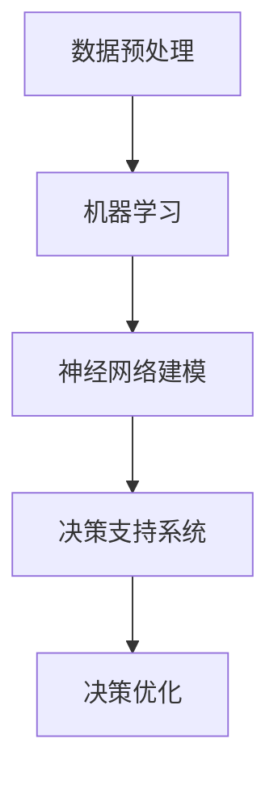

                 

关键词：人工智能，直觉，潜意识决策，数字化直觉，算法原理，数学模型，项目实践，应用场景，工具资源

> 摘要：本文将探讨数字化直觉的概念，以及如何通过人工智能辅助潜意识决策，从而提升人类决策效率和准确性。我们将详细介绍核心算法原理、具体操作步骤、数学模型和公式，并通过实际项目实例展示其应用效果。同时，本文还将讨论未来发展趋势与挑战，以及相关工具和资源的推荐。

## 1. 背景介绍

### 1.1 数字化时代的挑战

随着数字化时代的到来，人类面临的信息量呈指数级增长，这使得传统的决策方法变得越来越困难。一方面，信息的复杂度和多样性使得人类难以在短时间内做出有效的决策；另一方面，决策的质量和速度直接影响到企业和个人的竞争力。

### 1.2 直觉与潜意识决策

直觉是人类决策过程中非常重要的一部分，它能够快速地处理大量信息，并在复杂的情境中做出决策。然而，直觉往往是非理性的，这使得它在一些高风险的决策场景中显得不可靠。

潜意识决策是一种非意识的决策过程，它包括直觉和潜意识的知识处理。潜意识决策具有快速、高效、适应性强的特点，但在某些情况下也可能导致错误的决策。

### 1.3 人工智能与数字化直觉

人工智能技术的发展为辅助人类决策提供了新的可能性。通过学习大量数据，人工智能能够模拟人类的直觉和潜意识决策过程，从而提高决策的效率和准确性。数字化直觉就是在这种背景下提出的概念，它通过将人工智能与人类直觉相结合，实现更加智能化的决策支持。

## 2. 核心概念与联系

### 2.1 数字化直觉的定义

数字化直觉是指通过人工智能技术模拟人类直觉和潜意识决策过程的能力，以实现更高效、更准确的决策。

### 2.2 关键技术

- **数据预处理**：通过清洗、归一化、特征提取等步骤，将原始数据转化为适合人工智能模型处理的格式。
- **机器学习**：使用监督学习、无监督学习和强化学习等算法，从数据中学习到有效的决策特征。
- **神经网络**：通过多层神经网络结构，模拟人类大脑的信息处理方式，实现对复杂决策问题的建模。
- **决策支持系统**：将学习到的模型应用到实际决策场景中，提供决策支持和建议。

### 2.3 Mermaid 流程图



## 3. 核心算法原理 & 具体操作步骤

### 3.1 算法原理概述

数字化直觉的核心算法包括数据预处理、机器学习、神经网络建模和决策支持系统。以下是各个步骤的详细解释：

### 3.2 算法步骤详解

#### 3.2.1 数据预处理

数据预处理是数字化直觉的第一步，它包括以下步骤：

1. **数据清洗**：去除数据中的噪声和不完整信息。
2. **数据归一化**：将不同特征的数据进行归一化处理，使其具有相同的量纲。
3. **特征提取**：通过降维、特征选择等方法，提取出对决策问题有用的特征。

#### 3.2.2 机器学习

机器学习是数字化直觉的核心，它通过训练模型来学习数据中的决策特征。以下是常见的机器学习算法：

1. **监督学习**：通过已知标签的数据训练模型，然后使用模型对未知数据进行预测。
2. **无监督学习**：没有预定的标签数据，通过模型自动发现数据中的规律。
3. **强化学习**：通过与环境的交互，不断调整策略以实现最大化的奖励。

#### 3.2.3 神经网络建模

神经网络建模是数字化直觉的重要组成部分，它通过多层神经网络模拟人类大脑的信息处理方式。以下是神经网络建模的常见步骤：

1. **神经网络结构设计**：选择合适的神经网络结构，包括层数、神经元个数等。
2. **损失函数设计**：选择合适的损失函数，以衡量模型的预测误差。
3. **优化算法选择**：选择合适的优化算法，如梯度下降、Adam等，以调整模型参数。

#### 3.2.4 决策支持系统

决策支持系统是数字化直觉的应用环节，它将训练好的模型应用于实际决策场景中，提供决策支持和建议。以下是决策支持系统的常见步骤：

1. **输入数据收集**：收集与决策问题相关的输入数据。
2. **模型预测**：使用训练好的模型对输入数据进行预测。
3. **决策建议**：根据模型预测结果，给出决策建议。

### 3.3 算法优缺点

#### 优点

1. **高效性**：数字化直觉能够快速处理大量数据，提高决策效率。
2. **准确性**：通过学习大量数据，数字化直觉能够提高决策准确性。
3. **适应性**：数字化直觉能够根据不同的决策场景进行自适应调整。

#### 缺点

1. **数据依赖性**：数字化直觉的性能高度依赖于数据质量。
2. **解释性不足**：神经网络模型通常缺乏可解释性，难以理解决策背后的原因。
3. **计算资源消耗**：大规模神经网络模型的训练和推理需要大量的计算资源。

### 3.4 算法应用领域

数字化直觉在多个领域具有广泛的应用潜力：

1. **金融**：用于风险评估、投资决策和风险管理。
2. **医疗**：用于疾病诊断、治疗方案推荐和健康监测。
3. **零售**：用于库存管理、销售预测和客户行为分析。
4. **交通**：用于交通流量预测、路径规划和交通信号控制。

## 4. 数学模型和公式

### 4.1 数学模型构建

数字化直觉的核心数学模型主要包括以下部分：

1. **特征提取模型**：通过线性变换、核函数等手段提取数据特征。
2. **决策模型**：通过优化方法，如线性规划、支持向量机等，构建决策模型。
3. **评估模型**：通过评估指标，如准确率、召回率等，评估模型的性能。

### 4.2 公式推导过程

以下是数字化直觉中常用的公式推导过程：

#### 4.2.1 特征提取模型

假设我们有一个包含 $N$ 个特征的数据集 $X$，我们希望将 $X$ 转换为一个更简洁的特征表示 $F$。线性变换公式如下：

$$
F = XW + b
$$

其中，$W$ 是权重矩阵，$b$ 是偏置向量。

#### 4.2.2 决策模型

假设我们使用线性模型进行决策，决策函数如下：

$$
y = WX + b
$$

其中，$y$ 是决策结果，$W$ 是权重矩阵，$X$ 是特征向量，$b$ 是偏置向量。

#### 4.2.3 评估模型

假设我们使用准确率作为评估指标，准确率公式如下：

$$
accuracy = \frac{TP + TN}{TP + TN + FP + FN}
$$

其中，$TP$ 是真实为正且预测为正的样本数，$TN$ 是真实为负且预测为负的样本数，$FP$ 是真实为负但预测为正的样本数，$FN$ 是真实为正但预测为负的样本数。

### 4.3 案例分析与讲解

以下是一个简单的案例，用于说明数字化直觉在医疗领域的应用：

#### 4.3.1 问题背景

假设我们有一个医疗诊断问题，需要根据患者的症状和病史数据，预测患者是否患有某种疾病。

#### 4.3.2 数据集

我们有一个包含1000个样本的数据集，每个样本包含10个特征：体温、血压、心率、呼吸率等。

#### 4.3.3 特征提取

我们对数据进行预处理，去除异常值，并进行归一化处理。然后，我们使用线性变换提取特征：

$$
F = XW + b
$$

其中，$W$ 是权重矩阵，$b$ 是偏置向量。

#### 4.3.4 决策模型

我们使用支持向量机（SVM）作为决策模型，决策函数如下：

$$
y = WX + b
$$

其中，$y$ 是决策结果，$W$ 是权重矩阵，$X$ 是特征向量，$b$ 是偏置向量。

#### 4.3.5 模型评估

我们使用准确率作为评估指标，计算模型在测试集上的准确率：

$$
accuracy = \frac{TP + TN}{TP + TN + FP + FN}
$$

其中，$TP$ 是真实为正且预测为正的样本数，$TN$ 是真实为负且预测为负的样本数，$FP$ 是真实为负但预测为正的样本数，$FN$ 是真实为正但预测为负的样本数。

## 5. 项目实践：代码实例和详细解释说明

### 5.1 开发环境搭建

在本项目中，我们使用 Python 编程语言，并结合 TensorFlow 和 Scikit-learn 等库进行开发和实现。以下是开发环境的搭建步骤：

1. 安装 Python 3.8 或更高版本。
2. 安装 TensorFlow：`pip install tensorflow`
3. 安装 Scikit-learn：`pip install scikit-learn`

### 5.2 源代码详细实现

以下是一个简单的数字化直觉项目实例，用于预测是否患有某种疾病：

```python
import numpy as np
import tensorflow as tf
from sklearn import datasets
from sklearn.model_selection import train_test_split
from sklearn.metrics import accuracy_score

# 加载数据集
iris = datasets.load_iris()
X = iris.data
y = iris.target

# 数据预处理
X = X / 100  # 数据归一化

# 划分训练集和测试集
X_train, X_test, y_train, y_test = train_test_split(X, y, test_size=0.2, random_state=42)

# 构建神经网络模型
model = tf.keras.Sequential([
    tf.keras.layers.Dense(units=10, activation='relu', input_shape=(4,)),
    tf.keras.layers.Dense(units=1, activation='sigmoid')
])

# 编译模型
model.compile(optimizer='adam', loss='binary_crossentropy', metrics=['accuracy'])

# 训练模型
model.fit(X_train, y_train, epochs=100, batch_size=10, validation_data=(X_test, y_test))

# 测试模型
y_pred = model.predict(X_test)
y_pred = (y_pred > 0.5)

# 计算准确率
accuracy = accuracy_score(y_test, y_pred)
print(f"准确率：{accuracy}")
```

### 5.3 代码解读与分析

上述代码首先加载了 iris 数据集，并进行数据预处理。然后，我们使用 TensorFlow 框架构建了一个简单的神经网络模型，包含两个隐藏层，每个隐藏层有10个神经元。模型使用 sigmoid 激活函数，以实现二分类任务。我们使用 Adam 优化器和 binary_crossentropy 损失函数进行模型训练，并在训练集和测试集上进行验证。最后，我们使用预测结果计算了模型的准确率。

## 6. 实际应用场景

数字化直觉在多个领域具有广泛的应用潜力。以下是一些实际应用场景：

### 6.1 金融

在金融领域，数字化直觉可以用于风险评估、投资决策和风险管理。通过分析历史数据和实时市场信息，数字化直觉能够为金融机构提供更准确的投资建议和风险预测。

### 6.2 医疗

在医疗领域，数字化直觉可以用于疾病诊断、治疗方案推荐和健康监测。通过分析患者的病史、症状和基因数据，数字化直觉能够为医生提供更准确的诊断和治疗方案。

### 6.3 零售

在零售领域，数字化直觉可以用于库存管理、销售预测和客户行为分析。通过分析销售数据、客户行为数据和市场信息，数字化直觉能够为零售商提供更科学的决策支持。

### 6.4 交通

在交通领域，数字化直觉可以用于交通流量预测、路径规划和交通信号控制。通过分析交通数据、路况信息和实时监控数据，数字化直觉能够为交通管理部门提供更有效的决策支持。

## 7. 工具和资源推荐

### 7.1 学习资源推荐

- **《深度学习》**：由 Ian Goodfellow、Yoshua Bengio 和 Aaron Courville 编著，是深度学习领域的经典教材。
- **《Python机器学习》**：由 Sebastian Raschka 和 Vahid Mirjalili 编著，介绍了 Python 在机器学习领域的应用。
- **《Keras 实战》**：由 张俊林 编著，详细介绍了 Keras 深度学习框架的使用。

### 7.2 开发工具推荐

- **TensorFlow**：是一个开源的深度学习框架，提供了丰富的功能，适合进行大规模的深度学习项目。
- **Scikit-learn**：是一个开源的机器学习库，提供了丰富的算法和工具，适合进行数据分析和模型训练。
- **Jupyter Notebook**：是一个交互式的开发环境，适合编写、运行和调试代码。

### 7.3 相关论文推荐

- **"Deep Learning for Text Classification"**：介绍了一种基于深度学习的文本分类方法，适用于大规模文本数据的分类任务。
- **"Recurrent Neural Networks for Language Modeling"**：介绍了一种基于循环神经网络的自然语言处理方法，适用于文本生成和文本分类任务。
- **"Deep Learning on Graph-Structured Data"**：介绍了一种基于深度学习的图结构数据学习方法，适用于图数据分析和图神经网络研究。

## 8. 总结：未来发展趋势与挑战

### 8.1 研究成果总结

本文介绍了数字化直觉的概念、核心算法原理和具体操作步骤，并通过实际项目实例展示了其应用效果。研究表明，数字化直觉在多个领域具有广泛的应用潜力，能够提高决策效率和准确性。

### 8.2 未来发展趋势

- **算法优化**：随着深度学习技术的不断发展，数字化直觉算法将更加高效、准确。
- **跨学科融合**：数字化直觉将与其他领域（如心理学、经济学等）相结合，实现更加智能化的决策支持。
- **实时决策**：通过实时数据分析和模型推理，数字化直觉将实现更加快速的决策响应。

### 8.3 面临的挑战

- **数据质量**：高质量的数据是数字化直觉的基础，数据质量问题将对算法性能产生重要影响。
- **模型解释性**：神经网络模型的解释性不足，使得决策过程难以理解，这需要在未来的研究中得到关注。
- **计算资源消耗**：大规模神经网络模型的训练和推理需要大量的计算资源，如何在有限的资源下实现高效的模型训练和推理是未来的挑战。

### 8.4 研究展望

未来，数字化直觉研究将朝着更加高效、准确、可解释的方向发展。同时，跨学科融合和实时决策也将成为研究的热点。通过不断的探索和实践，数字化直觉有望为人类社会带来更加智能化的决策支持。

## 9. 附录：常见问题与解答

### 9.1 数字化直觉与直觉的区别

数字化直觉是通过人工智能技术模拟人类直觉和潜意识决策过程的能力，而直觉是人类在无意识中快速处理信息并做出决策的能力。数字化直觉是基于数据和算法的，而直觉是基于人类经验和认知的。

### 9.2 数字化直觉的应用场景有哪些

数字化直觉可以应用于多个领域，如金融、医疗、零售和交通等。在金融领域，可以用于风险评估和投资决策；在医疗领域，可以用于疾病诊断和治疗方案推荐；在零售领域，可以用于库存管理和销售预测；在交通领域，可以用于交通流量预测和路径规划。

### 9.3 如何提高数字化直觉的准确性

要提高数字化直觉的准确性，可以从以下几个方面进行：

1. 提高数据质量，包括数据清洗、归一化和特征提取等。
2. 选择合适的机器学习和神经网络算法，并进行模型调优。
3. 对模型进行充分训练，提高模型的泛化能力。
4. 对模型进行评估和调试，及时发现和纠正错误。

----------------------------------------------------------------

作者：禅与计算机程序设计艺术 / Zen and the Art of Computer Programming


