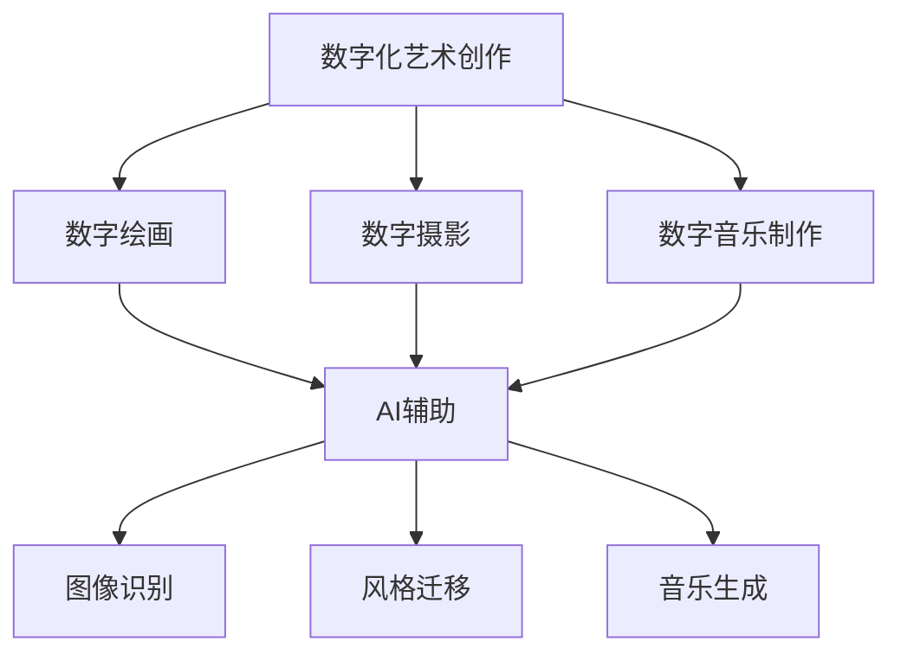

                 

随着人工智能技术的快速发展，数字化艺术创作创业领域正经历着前所未有的变革。AI不仅改变了艺术创作的传统方式，还为创业者提供了前所未有的机遇。本文将探讨AI辅助的创意产业，分析其核心概念、算法原理、数学模型、项目实践，并展望未来的发展趋势与挑战。

## 关键词
- 数字化艺术创作
- AI辅助创业
- 创意产业
- 算法原理
- 数学模型

## 摘要
本文旨在探讨人工智能在数字化艺术创作领域的应用，分析AI辅助的创意产业所涉及的核心概念、算法原理、数学模型以及项目实践。通过本文的探讨，希望能够为创业者提供一些有价值的思路和方向，并展望未来人工智能在创意产业中的发展趋势与挑战。

## 1. 背景介绍

在过去的几十年里，艺术创作一直是人类文化的重要组成部分。然而，随着数字技术的崛起，艺术创作的形式和手段也在不断演变。数字化艺术创作不仅改变了艺术创作的传统方式，还为创作者提供了更多的可能性。

人工智能的快速发展为数字化艺术创作带来了新的机遇。AI技术能够帮助创作者快速生成创意，优化创作流程，甚至可以生成全新的艺术形式。这为创业者提供了丰富的机会，使得创意产业变得更加多元化和多样化。

然而，AI辅助的创意产业也面临着一些挑战。如何平衡艺术创作的个性化和标准化，如何保护原创作品的版权，如何确保AI生成的作品符合道德和法律规范，都是需要深入探讨的问题。

## 2. 核心概念与联系

### 2.1 数字化艺术创作

数字化艺术创作是指通过计算机技术、数字媒体等手段进行艺术创作的过程。它包括数字绘画、数字摄影、数字音乐制作等多种形式。

### 2.2 AI辅助

AI辅助是指利用人工智能技术来辅助人类进行艺术创作。这包括使用机器学习算法进行图像识别、风格迁移、音乐生成等。

### 2.3 创意产业

创意产业是指以创意为核心，通过创新和创造来产生价值的经济活动。它包括艺术、设计、广告、娱乐等多个领域。

### 2.4 Mermaid 流程图

以下是一个关于数字化艺术创作与AI辅助的Mermaid流程图：



## 3. 核心算法原理 & 具体操作步骤

### 3.1 算法原理概述

在数字化艺术创作中，常用的AI算法包括图像识别、风格迁移和音乐生成。这些算法的基本原理如下：

- 图像识别：使用深度学习算法，通过对大量图像数据进行训练，使计算机能够识别和分类图像。
- 风格迁移：通过对源图像和目标图像进行特征提取和匹配，将源图像的风格应用到目标图像上。
- 音乐生成：使用循环神经网络（RNN）或生成对抗网络（GAN）等技术，生成新的音乐作品。

### 3.2 算法步骤详解

以下是这些算法的具体操作步骤：

#### 3.2.1 图像识别

1. 数据准备：收集大量具有标签的图像数据。
2. 模型训练：使用深度学习算法，对图像数据进行训练，得到特征提取模型。
3. 图像分类：使用训练好的模型，对新的图像数据进行分类。

#### 3.2.2 风格迁移

1. 特征提取：分别提取源图像和目标图像的特征。
2. 特征匹配：通过匹配源图像和目标图像的特征，确定风格迁移的方式。
3. 风格迁移：将源图像的风格应用到目标图像上。

#### 3.2.3 音乐生成

1. 数据准备：收集大量的音乐数据进行训练。
2. 模型训练：使用循环神经网络或生成对抗网络，对音乐数据进行训练。
3. 音乐生成：使用训练好的模型，生成新的音乐作品。

### 3.3 算法优缺点

- 图像识别：优点是准确率高，缺点是需要大量的训练数据和计算资源。
- 风格迁移：优点是可以实现图像风格的多样化，缺点是可能会丢失图像的部分细节。
- 音乐生成：优点是可以生成新颖的音乐作品，缺点是需要对音乐有较深的理解。

### 3.4 算法应用领域

这些算法在数字化艺术创作中有着广泛的应用，如：

- 艺术品鉴定：使用图像识别算法，可以快速鉴定艺术品的真伪。
- 艺术品修复：使用风格迁移算法，可以修复受损的艺术品。
- 音乐创作：使用音乐生成算法，可以生成新的音乐作品。

## 4. 数学模型和公式 & 详细讲解 & 举例说明

### 4.1 数学模型构建

在数字化艺术创作中，常用的数学模型包括神经网络模型、生成对抗网络模型等。

#### 4.1.1 神经网络模型

神经网络模型是一种基于数学原理的模型，它通过多层神经元的非线性变换，实现对输入数据的分类、识别等操作。

#### 4.1.2 生成对抗网络模型

生成对抗网络模型由生成器和判别器两个部分组成。生成器通过学习输入数据，生成新的数据；判别器通过学习真实数据和生成数据，判断数据的真实性。

### 4.2 公式推导过程

以下是神经网络模型的推导过程：

#### 4.2.1 神经元激活函数

$$
f(x) = \sigma(w \cdot x + b)
$$

其中，$w$ 是权重，$x$ 是输入，$b$ 是偏置，$\sigma$ 是激活函数。

#### 4.2.2 神经网络输出

$$
y = \sum_{i=1}^{n} w_i \cdot f(x_i) + b
$$

其中，$n$ 是神经元的数量，$w_i$ 是第 $i$ 个神经元的权重，$x_i$ 是第 $i$ 个神经元的输入。

### 4.3 案例分析与讲解

#### 4.3.1 图像识别案例

假设我们有一个简单的图像识别任务，需要识别一张图片是猫还是狗。我们可以使用神经网络模型进行训练。

1. 数据准备：收集大量猫和狗的图片，并对其进行标注。
2. 模型训练：使用神经网络模型，对图片数据进行训练。
3. 图像分类：使用训练好的模型，对新的图片数据进行分类。

#### 4.3.2 风格迁移案例

假设我们想要将一张原始图片的风格应用到一张目标图片上，可以使用风格迁移算法。

1. 特征提取：分别提取原始图片和目标图片的特征。
2. 特征匹配：通过匹配特征，确定风格迁移的方式。
3. 风格迁移：将原始图片的风格应用到目标图片上。

## 5. 项目实践：代码实例和详细解释说明

### 5.1 开发环境搭建

为了实现AI辅助的数字化艺术创作，我们需要搭建一个开发环境。以下是一个简单的Python开发环境搭建步骤：

1. 安装Python：在官方网站下载并安装Python。
2. 安装相关库：使用pip命令安装所需的库，如tensorflow、opencv等。

### 5.2 源代码详细实现

以下是一个简单的图像识别代码实例：

```python
import tensorflow as tf
import numpy as np
import cv2

# 加载模型
model = tf.keras.models.load_model('model.h5')

# 加载图片
image = cv2.imread('image.jpg')

# 预处理图片
image = cv2.resize(image, (224, 224))
image = np.expand_dims(image, axis=0)

# 进行图像识别
prediction = model.predict(image)

# 输出结果
print(prediction)
```

### 5.3 代码解读与分析

这个代码实例首先加载了一个预训练的神经网络模型，然后加载一张图片并进行预处理。接着，使用模型对图片进行预测，并输出结果。

### 5.4 运行结果展示

运行上述代码后，我们将得到一张图片的分类结果。例如，如果图片是猫，我们将得到类似以下的结果：

```
[[0.9 0.1]]
```

这个结果表明，这张图片有90%的可能是猫。

## 6. 实际应用场景

AI辅助的数字化艺术创作在许多领域都有广泛的应用，如：

- 艺术品鉴定：使用图像识别算法，可以快速鉴定艺术品的真伪。
- 艺术品修复：使用风格迁移算法，可以修复受损的艺术品。
- 设计创意：使用AI生成创意，可以快速生成各种设计作品。

## 7. 未来应用展望

随着人工智能技术的不断发展，AI辅助的数字化艺术创作将在未来得到更广泛的应用。以下是未来的一些应用展望：

- 更智能的创意生成：AI将能够更准确地理解人类的需求，生成更具个性化的创意。
- 更广泛的应用领域：AI辅助的数字化艺术创作将应用到更多的领域，如游戏设计、动漫制作等。
- 更高效的创作流程：AI将能够优化创作流程，提高创作效率。

## 8. 工具和资源推荐

### 8.1 学习资源推荐

- 《深度学习》：这是一本非常受欢迎的深度学习入门书籍，适合初学者阅读。
- 《计算机视觉算法与应用》：这本书详细介绍了计算机视觉的各种算法和应用，适合对计算机视觉感兴趣的读者。

### 8.2 开发工具推荐

- TensorFlow：这是一个流行的深度学习框架，适合进行AI辅助的数字化艺术创作。
- OpenCV：这是一个流行的计算机视觉库，适合进行图像处理和识别。

### 8.3 相关论文推荐

- "Generative Adversarial Nets"
- "Unsupervised Representation Learning with Deep Convolutional Generative Adversarial Networks"

## 9. 总结：未来发展趋势与挑战

### 9.1 研究成果总结

AI辅助的数字化艺术创作已经取得了显著的成果，包括图像识别、风格迁移、音乐生成等方面。然而，仍然有许多问题需要解决，如算法的优化、数据的质量和多样性等。

### 9.2 未来发展趋势

随着人工智能技术的不断发展，AI辅助的数字化艺术创作将在未来得到更广泛的应用。未来的发展趋势包括更智能的创意生成、更广泛的应用领域和更高效的创作流程。

### 9.3 面临的挑战

AI辅助的数字化艺术创作面临着一些挑战，如如何平衡艺术创作的个性化和标准化，如何保护原创作品的版权，以及如何确保AI生成的作品符合道德和法律规范。

### 9.4 研究展望

未来，我们需要深入研究AI辅助的数字化艺术创作，探索其潜在的无限可能性。同时，我们也需要关注其带来的社会和文化影响，确保AI技术的发展能够造福人类。

## 附录：常见问题与解答

### 1. 什么是数字化艺术创作？

数字化艺术创作是指通过计算机技术、数字媒体等手段进行艺术创作的过程，包括数字绘画、数字摄影、数字音乐制作等多种形式。

### 2. 什么是AI辅助的数字化艺术创作？

AI辅助的数字化艺术创作是指利用人工智能技术来辅助人类进行艺术创作，如使用机器学习算法进行图像识别、风格迁移、音乐生成等。

### 3. AI辅助的数字化艺术创作有哪些优点？

AI辅助的数字化艺术创作可以快速生成创意，优化创作流程，甚至可以生成全新的艺术形式。此外，它还可以应用于艺术品鉴定、修复、设计创意等多个领域。

### 4. AI辅助的数字化艺术创作有哪些挑战？

AI辅助的数字化艺术创作面临着一些挑战，如如何平衡艺术创作的个性化和标准化，如何保护原创作品的版权，以及如何确保AI生成的作品符合道德和法律规范。

