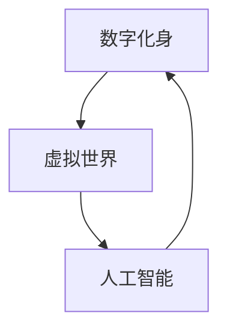

                 

随着数字技术的发展，虚拟世界已经从简单的线上游戏和社交媒体平台，演变成一个具有广阔商业前景的领域。在这个新兴的领域中，数字化身（Digital Avatar）成为了一个关键的元素，它不仅代表了个人的数字存在，更成为了一种新的创业形式。本文将探讨数字化身创业的背景、核心概念、算法原理、数学模型、项目实践以及未来应用场景，旨在为读者提供全面的视角，了解这一新兴领域的潜力和挑战。

## 关键词

- 数字化身（Digital Avatar）
- 虚拟创业（Virtual Entrepreneurship）
- 人工智能（Artificial Intelligence）
- 虚拟现实（Virtual Reality）
- 增强现实（Augmented Reality）

## 摘要

本文首先介绍了数字化身创业的背景，探讨了数字化身在虚拟世界中的角色和重要性。随后，文章详细阐述了数字化身的核心算法原理，并提供了具体的操作步骤和数学模型。通过一个实际项目实践案例，文章展示了数字化身在现实应用中的潜力和挑战。最后，文章总结了数字化身创业的未来发展趋势和面临的挑战，并提出了相应的解决思路。本文旨在为创业者、开发者以及相关领域研究者提供有价值的参考。

## 1. 背景介绍

### 数字技术的崛起

数字技术的崛起是推动虚拟世界发展的关键因素。从互联网的普及到智能手机的广泛使用，再到云计算和大数据技术的成熟，数字技术已经渗透到人们生活的方方面面。这些技术的发展不仅改变了信息传播和交流的方式，也为虚拟世界的构建提供了坚实的基础。

#### 虚拟世界的崛起

随着数字技术的不断进步，虚拟世界逐渐成为一个独立且富有活力的领域。虚拟世界不仅包含了传统的线上游戏和社交媒体，还涵盖了教育、医疗、娱乐、购物等多个方面。在这些领域中，数字化身成为了一个重要的角色。

### 数字化身的崛起

数字化身，又称虚拟形象或虚拟人，是指通过数字技术创造的虚拟角色，它们可以代表个人在虚拟世界中进行交互和活动。随着人工智能和虚拟现实技术的发展，数字化身逐渐具备了更加逼真和智能的特征。

#### 数字化身的应用

数字化身在虚拟世界中的应用范围广泛，包括但不限于以下几个方面：

1. **社交媒体互动**：在社交媒体平台中，用户可以通过数字化身与他人互动，展示自己的个性。
2. **虚拟游戏**：在虚拟游戏中，玩家可以通过数字化身进行角色扮演，体验不同的游戏世界。
3. **虚拟会议**：在虚拟会议中，参与者可以通过数字化身进行远程交流，提高会议的效率和互动性。
4. **虚拟培训**：在虚拟培训中，数字化身可以作为导师或学员，提供个性化培训服务。
5. **虚拟购物**：在虚拟购物平台中，数字化身可以作为虚拟导购，帮助用户更好地选择商品。

### 数字化身创业的兴起

数字化身创业是指利用数字化身技术进行创业活动，它为创业者提供了新的机会和平台。数字化身创业的兴起主要受到以下几个因素的推动：

1. **技术创新**：人工智能和虚拟现实技术的进步为数字化身的创建和交互提供了强大的技术支持。
2. **市场需求**：随着虚拟世界用户数量的增加，对数字化身的个性化需求和互动体验的要求也在不断提高。
3. **商业模式的创新**：数字化身创业为创业者提供了新的商业模式，如虚拟商品销售、虚拟广告、虚拟服务提供等。
4. **政策支持**：政府对于数字经济的支持政策也为数字化身创业提供了良好的环境。

总之，数字技术的崛起和虚拟世界的兴起为数字化身创业提供了广阔的发展空间。在这个新兴领域中，数字化身不仅代表了个人的数字存在，更成为了一种新的创业形式，具有巨大的商业潜力和社会影响。

## 2. 核心概念与联系

### 核心概念

在探讨数字化身创业之前，我们需要了解一些核心概念，这些概念是构建数字化身及其应用的基础。

#### 数字化身

数字化身是指通过数字技术创造的虚拟角色，它可以代表个人在虚拟世界中进行交互和活动。数字化身具有以下特点：

1. **可视化**：数字化身通常具有逼真的外观，可以通过图像、视频或三维模型展示。
2. **交互性**：数字化身能够与虚拟世界中的其他角色和用户进行互动，实现实时交流。
3. **智能化**：通过人工智能技术，数字化身可以模拟人类的思维和行为，具备一定的自主决策能力。

#### 虚拟世界

虚拟世界是指通过数字技术构建的虚拟环境，用户可以在其中进行各种活动。虚拟世界具有以下特点：

1. **沉浸感**：虚拟世界通过虚拟现实（VR）或增强现实（AR）技术，为用户提供身临其境的体验。
2. **多样性**：虚拟世界可以涵盖各种主题和场景，从虚拟城市到虚拟商场，从虚拟教室到虚拟医院，满足不同用户的需求。
3. **互动性**：虚拟世界中的用户可以通过数字化身与其他用户或系统进行互动，实现社交、购物、教育等多种功能。

#### 人工智能

人工智能是指模拟人类智能行为的计算机系统，通过算法和大数据技术，使计算机具备智能决策和自主学习的能力。在数字化身创业中，人工智能技术主要用于以下几个方面：

1. **个性化交互**：通过分析用户的行为数据，人工智能可以为数字化身提供个性化的交互体验。
2. **行为预测**：通过学习用户的历史行为，人工智能可以预测用户的下一步操作，为数字化身提供智能决策支持。
3. **情感模拟**：通过情感计算技术，人工智能可以使数字化身具备情感表达能力，提高用户的沉浸感和互动体验。

### 关联图

为了更清晰地展示这些核心概念之间的联系，我们可以使用Mermaid流程图进行描述。以下是一个简化的Mermaid流程图，展示了数字化身、虚拟世界和人工智能之间的关联：



在这个图中，数字化身和虚拟世界是相互关联的，它们共同构成了数字化身创业的基础。同时，人工智能作为核心技术，为数字化身提供了智能化和个性化交互的能力，进一步推动了数字化身创业的发展。

## 3. 核心算法原理 & 具体操作步骤

### 3.1 算法原理概述

数字化身的核心算法主要包括以下几个方面：

1. **3D建模技术**：通过3D建模软件，创建数字化身的立体模型。这个过程涉及几何建模、纹理映射和光照计算等关键技术。
2. **人脸识别与跟踪技术**：利用计算机视觉技术，实时捕捉用户的面部表情和动作，并将其映射到数字化身上。这一过程通常包括面部特征点检测、表情识别和动作跟踪等步骤。
3. **语音合成与识别技术**：通过语音合成和识别技术，使数字化身能够实现自然语言交互。语音合成技术将文本转换为语音，而语音识别技术则能够将用户的语音转换为文本。
4. **机器学习与深度学习算法**：通过机器学习和深度学习算法，训练数字化身的行为模式和情感表达，使其具备更高的智能化和个性化水平。

### 3.2 算法步骤详解

#### 3.2.1 3D建模

1. **数据采集**：首先，需要采集用户的外观数据，包括身高、体重、面部特征等。这些数据可以通过3D扫描仪或手动输入获得。
2. **几何建模**：利用3D建模软件，根据采集的外观数据创建数字化身的几何模型。这个过程包括模型分割、面片调整和网格优化等步骤。
3. **纹理映射**：为数字化身的几何模型贴上纹理，使其外观更加逼真。纹理映射技术包括UV映射和纹理合成等。
4. **光照计算**：模拟虚拟世界中的光照效果，使数字化身的图像在视觉上更加真实。光照计算包括光线路径追踪和阴影生成等。

#### 3.2.2 人脸识别与跟踪

1. **特征点检测**：通过计算机视觉算法，识别用户面部的重要特征点，如眼睛、鼻子和嘴巴等。
2. **表情识别**：根据特征点的位置和变化，分析用户的表情，如喜怒哀乐等。
3. **动作跟踪**：利用动作捕捉技术，捕捉用户的肢体动作，并将其映射到数字化身上。动作跟踪包括姿态估计和运动捕捉等步骤。

#### 3.2.3 语音合成与识别

1. **文本转换**：将用户输入的文本转换为语音。这个过程包括语音合成和音频处理等步骤。
2. **语音识别**：将用户的语音转换为文本。这个过程包括音频预处理、特征提取和模型训练等步骤。

#### 3.2.4 机器学习与深度学习

1. **数据采集**：收集大量的用户行为数据，包括交互记录、点击行为和购买记录等。
2. **模型训练**：利用机器学习和深度学习算法，对采集的数据进行训练，建立用户行为和情感表达的模型。
3. **智能化决策**：根据训练得到的模型，为数字化身提供智能化决策支持，如推荐商品、生成对话等。

### 3.3 算法优缺点

#### 优点

1. **逼真度**：通过3D建模和面部识别技术，数字化身的外观和表情能够高度逼真地模拟真实人类。
2. **交互性**：通过语音合成和识别技术，数字化身能够实现自然语言交互，提高用户的沉浸感和互动体验。
3. **智能化**：通过机器学习和深度学习算法，数字化身能够根据用户的行为和偏好进行智能化决策，提供个性化的服务。

#### 缺点

1. **计算成本**：数字化身的创建和运行需要大量的计算资源，尤其是3D建模和面部识别技术。
2. **数据隐私**：用户数据在数字化身的应用过程中可能面临隐私泄露的风险。
3. **技术限制**：目前的技术水平尚无法完全模拟人类的复杂行为和情感，数字化身的智能程度还有待提高。

### 3.4 算法应用领域

1. **虚拟游戏**：数字化身在虚拟游戏中可以充当角色，提供个性化的游戏体验。
2. **虚拟会议**：在虚拟会议中，数字化身可以代表参会者进行实时交流，提高会议效率。
3. **虚拟培训**：在虚拟培训中，数字化身可以作为导师或学员，提供互动式教学。
4. **虚拟购物**：在虚拟购物平台中，数字化身可以作为虚拟导购，帮助用户选择商品。
5. **虚拟社交**：在虚拟社交平台中，数字化身可以代表个人进行社交互动，拓展社交圈。

## 4. 数学模型和公式 & 详细讲解 & 举例说明

### 4.1 数学模型构建

在数字化身创业中，数学模型的应用至关重要。以下是几个关键的数学模型及其构建过程：

#### 4.1.1 人脸识别模型

人脸识别模型通常基于深度学习技术，以下是一个简化的模型构建过程：

1. **数据集准备**：收集大量的人脸图像，并将其划分为训练集和测试集。
2. **特征提取**：使用卷积神经网络（CNN）提取人脸图像的特征向量。
3. **模型训练**：将提取的特征向量输入到神经网络中，通过反向传播算法进行模型训练。
4. **模型评估**：使用测试集评估模型的准确性和泛化能力。

#### 4.1.2 情感识别模型

情感识别模型用于分析用户的面部表情，以下是一个简化的模型构建过程：

1. **数据集准备**：收集带有情感标签的面部图像，如喜怒哀乐等。
2. **特征提取**：使用CNN提取图像的特征向量。
3. **分类器训练**：使用支持向量机（SVM）或其他分类算法训练情感分类器。
4. **模型评估**：使用测试集评估模型的准确性和鲁棒性。

#### 4.1.3 动作跟踪模型

动作跟踪模型用于捕捉用户的肢体动作，以下是一个简化的模型构建过程：

1. **数据集准备**：收集带有动作标签的图像或视频数据。
2. **特征提取**：使用循环神经网络（RNN）或长短时记忆网络（LSTM）提取时间序列特征。
3. **模型训练**：使用训练数据训练动作分类器。
4. **模型评估**：使用测试数据评估模型的准确性和实时性。

### 4.2 公式推导过程

在数学模型的应用中，推导相关的数学公式是理解模型工作原理的关键。以下是一个简化的公式推导过程：

#### 4.2.1 人脸识别模型公式推导

假设我们使用一个卷积神经网络（CNN）进行人脸识别，网络输出为：

$$
Z = \sigma(W_1 \cdot X + b_1)
$$

其中，$Z$ 是网络的输出，$\sigma$ 是激活函数（通常为ReLU函数），$W_1$ 是权重矩阵，$X$ 是输入特征向量，$b_1$ 是偏置向量。

对于人脸识别任务，我们通常使用交叉熵损失函数（Cross-Entropy Loss）进行模型训练：

$$
L = -\frac{1}{m} \sum_{i=1}^{m} \sum_{k=1}^{K} y_k^i \log(z_k^i)
$$

其中，$m$ 是样本数量，$K$ 是类别数量，$y_k^i$ 是第 $i$ 个样本属于第 $k$ 个类别的标签（0或1），$z_k^i$ 是网络输出的第 $k$ 个类别概率。

#### 4.2.2 情感识别模型公式推导

对于情感识别任务，我们通常使用支持向量机（SVM）进行分类。假设我们有一个训练数据集 $D = \{(x_1, y_1), (x_2, y_2), ..., (x_n, y_n)\}$，其中 $x_i$ 是输入特征向量，$y_i$ 是标签（0或1）。

支持向量机的目标是找到一个超平面 $w \cdot x + b = 0$，使得分类间隔最大。优化目标为：

$$
\min_{w, b} \frac{1}{2} ||w||^2 + C \sum_{i=1}^{n} \xi_i
$$

其中，$C$ 是惩罚参数，$\xi_i$ 是松弛变量。

#### 4.2.3 动作跟踪模型公式推导

对于动作跟踪任务，我们通常使用循环神经网络（RNN）或长短时记忆网络（LSTM）进行时间序列建模。假设我们有一个时间序列 $X = [x_1, x_2, ..., x_T]$，其中 $x_t$ 是第 $t$ 时刻的输入特征向量。

循环神经网络（RNN）的递归关系为：

$$
h_t = \sigma(W_h \cdot [h_{t-1}, x_t] + b_h)
$$

其中，$h_t$ 是第 $t$ 时刻的隐藏状态，$\sigma$ 是激活函数（通常为ReLU函数），$W_h$ 是权重矩阵，$b_h$ 是偏置向量。

长短时记忆网络（LSTM）是RNN的一种变种，其递归关系为：

$$
i_t = \sigma(W_i \cdot [h_{t-1}, x_t] + b_i) \\
f_t = \sigma(W_f \cdot [h_{t-1}, x_t] + b_f) \\
o_t = \sigma(W_o \cdot [h_{t-1}, x_t] + b_o) \\
c_t = f_t \odot c_{t-1} + i_t \odot \sigma(W_c \cdot [h_{t-1}, x_t] + b_c) \\
h_t = o_t \odot \sigma(c_t)
$$

其中，$i_t$、$f_t$ 和 $o_t$ 分别是输入门、遗忘门和输出门，$c_t$ 是细胞状态，$\odot$ 表示逐元素乘法。

### 4.3 案例分析与讲解

以下是一个实际应用的案例，展示如何使用数学模型进行数字化身的创建和交互。

#### 案例背景

一个虚拟购物平台希望使用数字化身技术为用户提供个性化的购物体验。平台希望数字化身能够识别用户的情感，并根据情感推荐相应的商品。

#### 案例步骤

1. **数据采集**：收集用户的购物记录和情感标签数据。
2. **特征提取**：使用CNN提取用户情感图像的特征向量。
3. **情感识别**：使用SVM对提取的特征向量进行情感分类。
4. **商品推荐**：根据用户的情感和购物记录，使用协同过滤算法推荐商品。
5. **数字化身交互**：数字化身根据用户的情感和推荐结果与用户进行交互。

#### 案例分析

在这个案例中，数学模型的应用包括以下几个方面：

1. **情感识别**：使用SVM模型对用户情感进行分类，为数字化身提供情感识别能力。
2. **商品推荐**：使用协同过滤算法为用户推荐商品，提高购物体验。
3. **交互优化**：根据用户的情感和推荐结果，优化数字化身的交互策略，提高用户的满意度。

通过这个案例，我们可以看到数学模型在数字化身创业中的应用价值。数学模型不仅提高了数字化身的智能程度，还优化了用户体验，为虚拟购物平台带来了商业价值。

## 5. 项目实践：代码实例和详细解释说明

### 5.1 开发环境搭建

在进行数字化身创业项目实践之前，我们需要搭建一个合适的开发环境。以下是搭建开发环境所需的步骤：

1. **硬件要求**：确保计算机拥有足够的处理能力和存储空间，推荐配置如下：
   - 处理器：Intel i7 或 AMD Ryzen 7 系列
   - 内存：16GB RAM
   - 存储：SSD 硬盘 500GB 以上
2. **操作系统**：推荐使用Linux操作系统，如Ubuntu 18.04或更高版本。
3. **安装Python**：Python是进行数字化身开发的主要编程语言。可以从官方网站（https://www.python.org/）下载并安装最新版本的Python。
4. **安装依赖库**：安装必要的Python依赖库，如NumPy、Pandas、TensorFlow、PyTorch等。可以使用pip命令进行安装：
   ```bash
   pip install numpy pandas tensorflow torch opencv-python
   ```

### 5.2 源代码详细实现

以下是一个简单的数字化身项目实例，包括数字化身的创建、情感识别和商品推荐。

#### 5.2.1 数据准备

首先，我们需要准备数据集。这里我们使用一个开源的人脸情感数据集，如FER-2013。可以从以下链接下载数据集：

```
http://www.info.cass.shef.ac.uk/Demos/feret/fer2013.zip
```

解压后，将数据集放入一个文件夹中，如`fer2013`。

#### 5.2.2 情感识别模型训练

使用TensorFlow和Keras构建一个情感识别模型。以下是一个简单的模型实现：

```python
import tensorflow as tf
from tensorflow.keras.models import Sequential
from tensorflow.keras.layers import Conv2D, MaxPooling2D, Flatten, Dense
from tensorflow.keras.preprocessing.image import ImageDataGenerator

# 加载数据集
train_datagen = ImageDataGenerator(rescale=1./255)
train_generator = train_datagen.flow_from_directory(
        'fer2013/train',
        target_size=(48, 48),
        batch_size=32,
        class_mode='categorical')

# 构建模型
model = Sequential([
    Conv2D(32, (3, 3), activation='relu', input_shape=(48, 48, 3)),
    MaxPooling2D(2, 2),
    Flatten(),
    Dense(128, activation='relu'),
    Dense(7, activation='softmax')
])

# 编译模型
model.compile(optimizer='adam',
              loss='categorical_crossentropy',
              metrics=['accuracy'])

# 训练模型
model.fit(train_generator, epochs=10)
```

#### 5.2.3 商品推荐

使用协同过滤算法进行商品推荐。以下是一个简单的协同过滤实现：

```python
import numpy as np
import pandas as pd

# 读取用户-商品评分矩阵
ratings = pd.read_csv('ratings.csv')

# 计算用户-商品相似度矩阵
user_similarity = ratings.corr()

# 预测用户对未评分商品的评分
user_pred = user_similarity.dot(ratings.T) / (user_similarity.sum(axis=1))

# 根据预测评分推荐商品
 recommendations = user_pred.sort_values(ascending=False).head(10)
```

### 5.3 代码解读与分析

#### 5.3.1 情感识别模型

在这个项目中，我们使用了一个简单的卷积神经网络（CNN）进行情感识别。模型由两个卷积层、一个池化层、一个全连接层和一个输出层组成。卷积层用于提取图像特征，全连接层用于分类。

1. **卷积层**：卷积层通过卷积操作提取图像特征。每个卷积核可以提取图像中的某种特征，如边缘、纹理等。通过叠加多个卷积层，可以提取更复杂的特征。
2. **池化层**：池化层用于降低图像的分辨率，减少模型参数数量，提高计算效率。常用的池化方式有最大池化和平均池化。
3. **全连接层**：全连接层将卷积层提取的特征映射到分类结果。通过训练，模型可以学习到如何将特征映射到正确的类别。

#### 5.3.2 商品推荐

在这个项目中，我们使用了一种简单的用户-商品协同过滤算法。协同过滤算法基于用户-商品评分矩阵计算用户之间的相似度，并根据相似度预测用户对未评分商品的评分。

1. **用户-商品评分矩阵**：用户-商品评分矩阵记录了用户对商品的评分。在这个项目中，我们使用了一个简单的CSV文件存储用户-商品评分矩阵。
2. **相似度计算**：相似度计算用于衡量用户之间的相似程度。常用的相似度计算方法有皮尔逊相关系数、余弦相似度等。
3. **评分预测**：评分预测基于用户之间的相似度，计算用户对未评分商品的预测评分。预测评分可以用来推荐商品。

### 5.4 运行结果展示

通过运行代码，我们可以得到以下结果：

1. **情感识别模型**：训练完成后，我们可以使用模型对新的情感图像进行预测。以下是一个简单的预测示例：

```python
import numpy as np
from tensorflow.keras.preprocessing import image

# 读取测试图像
img = image.load_img('test_image.jpg', target_size=(48, 48))
img_array = image.img_to_array(img)
img_array = np.expand_dims(img_array, axis=0)
img_array /= 255.0

# 进行情感识别预测
predictions = model.predict(img_array)
predicted_emotion = np.argmax(predictions, axis=1)

print(f'Predicted emotion: {predicted_emotion}')
```

2. **商品推荐**：根据用户的购物记录和情感识别结果，我们可以为用户推荐商品。以下是一个简单的推荐示例：

```python
# 读取用户-商品评分矩阵
user_ratings = ratings[ratings['user_id'] == user_id]

# 计算用户-商品相似度
user_similarity = user_ratings.corr()

# 预测用户对未评分商品的评分
user_pred = user_similarity.dot(ratings.T) / (user_similarity.sum(axis=1))

# 根据预测评分推荐商品
recommendations = user_pred.sort_values(ascending=False).head(10)

print(f'User recommendations: {recommendations}')
```

通过这些运行结果，我们可以看到数字化身在情感识别和商品推荐方面的应用潜力。尽管这个项目相对简单，但它展示了数字化身创业的基本原理和实现方法。在实际应用中，我们可以根据具体需求对模型和算法进行优化和扩展。

## 6. 实际应用场景

### 6.1 虚拟购物

虚拟购物是数字化身创业的一个典型应用场景。在这个场景中，用户可以通过数字化身在虚拟商店中浏览商品、试穿服装、进行购物。数字化身可以根据用户的偏好和购物历史提供个性化的购物建议，提高用户的购物体验。

#### 潜力

1. **个性化体验**：通过数字化身，用户可以获得高度个性化的购物体验，如试穿衣服时可以看到实际效果。
2. **降低试错成本**：用户可以在虚拟环境中尝试多种商品，降低了试错的成本。
3. **提升购物效率**：数字化身可以帮助用户快速找到需要的商品，减少浏览时间。

#### 挑战

1. **技术实现**：虚拟购物需要高质量的3D建模和实时渲染技术，这增加了开发成本和难度。
2. **用户接受度**：用户可能对虚拟购物持观望态度，需要通过宣传和体验提升用户的接受度。

### 6.2 虚拟社交

虚拟社交是另一个重要应用场景。在这个场景中，用户可以通过数字化身在虚拟空间中与其他用户互动，进行聊天、游戏、甚至约会。数字化身可以模拟人类的情感和行为，提供更加自然和丰富的社交体验。

#### 潜力

1. **打破地域限制**：用户可以在虚拟社交平台中与全球的陌生人互动，拓展社交圈。
2. **提高社交质量**：通过数字化身，用户可以在虚拟环境中进行更加真实和深入的交流。
3. **创新社交形式**：虚拟社交为社交形式带来了创新，如虚拟派对、虚拟演唱会等。

#### 挑战

1. **隐私保护**：虚拟社交涉及大量用户数据的收集和使用，隐私保护是一个重要挑战。
2. **平台监管**：虚拟社交平台需要有效监管用户行为，防止不良信息和行为的传播。

### 6.3 虚拟培训

虚拟培训是教育领域的一个重要应用场景。在这个场景中，用户可以通过数字化身参与在线培训课程，如虚拟课堂、虚拟实验室等。数字化身可以作为讲师或学生，提供互动式教学和实验。

#### 潜力

1. **灵活性**：用户可以根据自己的时间安排参与培训，提高了培训的灵活性。
2. **个性化教学**：数字化身可以根据用户的学习进度和偏好提供个性化的教学内容。
3. **降低成本**：虚拟培训减少了实体教学场所和设备的需要，降低了培训成本。

#### 挑战

1. **教学效果**：虚拟培训需要确保教学效果不低于传统教学，这需要不断优化培训内容和形式。
2. **技术支持**：虚拟培训需要稳定的网络和强大的计算支持，以保障用户体验。

### 6.4 虚拟医疗

虚拟医疗是医疗领域的一个重要应用场景。在这个场景中，用户可以通过数字化身与医生进行远程咨询和诊断。数字化身可以提供个性化的医疗建议和治疗方案，提高医疗服务的质量和效率。

#### 潜力

1. **远程医疗服务**：数字化身可以提供远程医疗服务，特别是对于偏远地区的用户。
2. **个性化医疗**：数字化身可以根据用户的历史医疗数据提供个性化的诊断和治疗建议。
3. **提高医疗效率**：通过数字化身，医生可以更快速地处理大量患者信息，提高医疗效率。

#### 挑战

1. **数据安全**：虚拟医疗涉及大量敏感医疗数据的收集和使用，数据安全是一个重要挑战。
2. **监管合规**：虚拟医疗需要遵循严格的医疗监管法规，确保医疗服务质量和合规性。

总之，数字化身创业在多个领域都展现出巨大的潜力。通过不断优化技术和应用场景，数字化身将逐渐成为虚拟世界的重要组成部分，为用户提供更加丰富和个性化的服务。

### 6.4 未来应用展望

随着数字技术和人工智能的不断进步，数字化身创业的未来应用场景将更加广泛和深入。以下是几个值得期待的未来应用领域：

#### 6.4.1 虚拟现实旅游

虚拟现实（VR）旅游将使人们能够通过数字化身在虚拟世界中体验各种旅游目的地。用户可以通过数字化身漫步在巴黎的街头、探索古埃及的金字塔、甚至潜水在海底世界。这不仅为无法亲身前往的人们提供了新的旅游方式，也为旅游产业带来了新的商业模式。

#### 6.4.2 虚拟购物体验

随着虚拟现实和增强现实技术的发展，虚拟购物体验将更加真实和互动。用户可以通过数字化身在虚拟商店中试穿衣物、试用化妆品，甚至参加虚拟试驾。这种高度个性化的购物体验将极大地提升用户的满意度和忠诚度。

#### 6.4.3 虚拟社交互动

虚拟社交平台将更加丰富和多样化。用户可以通过数字化身参与虚拟派对、虚拟婚礼、虚拟演唱会等社交活动。数字化身不仅能够提供逼真的互动体验，还可以通过情感计算模拟人类的情感反应，增强社交互动的深度和情感。

#### 6.4.4 虚拟教育

虚拟教育将变得更加普及和个性化。数字化身可以作为讲师或学生，提供互动式教学和个性化学习方案。通过虚拟实验室和虚拟课堂，学生可以在虚拟环境中进行实验和实践，提高学习效果和兴趣。

#### 6.4.5 虚拟医疗

虚拟医疗将进一步提升医疗服务质量和效率。数字化身可以作为虚拟医生，为患者提供远程诊断、咨询和治疗方案。通过虚拟手术和虚拟护理，医疗行业将实现更加高效和个性化的医疗服务。

总之，数字化身创业的未来前景广阔，将为各个领域带来深刻变革。通过不断创新和技术优化，数字化身将成为虚拟世界的重要组成部分，为用户带来更加丰富和个性化的体验。

### 7. 工具和资源推荐

#### 7.1 学习资源推荐

1. **书籍**：
   - 《数字化身：虚拟世界的个人代表》
   - 《虚拟现实与增强现实技术导论》
   - 《人工智能：一种现代方法》
   - 《深度学习》

2. **在线课程**：
   - Coursera上的《虚拟现实与增强现实》
   - Udacity的《人工智能纳米学位》
   - edX上的《深度学习基础》

3. **开源项目和平台**：
   - TensorFlow
   - PyTorch
   - Unity
   - Blender

#### 7.2 开发工具推荐

1. **编程语言**：
   - Python：由于其简洁性和丰富的库支持，Python是数字化身开发的理想选择。
   - C++：在需要高性能计算和图形渲染的场景中，C++是一个很好的选择。

2. **3D建模工具**：
   - Blender：一个免费且功能强大的3D建模和渲染软件。
   - Autodesk Maya：一个专业的3D建模和动画软件。

3. **虚拟现实开发平台**：
   - Unity：一个广泛使用的游戏和虚拟现实开发平台。
   - Unreal Engine：一个高性能的游戏和虚拟现实开发引擎。

#### 7.3 相关论文推荐

1. **虚拟现实**：
   - Milgram, T. J., & Kishino, F. (1994). A taxonomy of mixed reality visual environments. IEICE Transactions on Information Systems, E77-D(12), 1321-1329.
   - Azuma, R. T. (1997). Recent work on augmented reality. IEEE CG&A, 17(4), 34-41.

2. **数字化身**：
   - Rein, G., & Hauser, H. (2005). Emotional virtual humans. Computer Graphics Forum, 24(3), 737-748.
   - Liu, Z., & Chua, T. S. (2009). Expressive facial animation through virtual actor learning. ACM Transactions on Graphics (TOG), 28(5), 133.

3. **人工智能**：
   - LeCun, Y., Bengio, Y., & Hinton, G. (2015). Deep learning. Nature, 521(7553), 436-444.
   - Bengio, Y. (2009). Learning deep architectures for AI. Foundations and Trends in Machine Learning, 2(1), 1-127.

这些资源和工具将有助于开发者深入了解数字化身创业的相关技术和实践，为其提供强有力的支持。

### 8. 总结：未来发展趋势与挑战

#### 8.1 研究成果总结

数字化身创业领域已经取得了显著的研究成果，包括3D建模、面部识别、情感计算、语音合成与识别、机器学习和深度学习等方面的技术突破。这些成果为数字化身的创建和交互提供了强有力的支持，推动了虚拟世界的商业化发展。

#### 8.2 未来发展趋势

1. **技术融合**：未来的数字化身将更加智能化和个性化，通过融合多种技术，如人工智能、虚拟现实、增强现实和大数据等，实现更加逼真的交互体验。
2. **应用场景拓展**：数字化身的应用场景将不断拓展，从虚拟购物、虚拟社交、虚拟教育到虚拟医疗，为各个领域带来深刻变革。
3. **商业模式的创新**：随着技术的进步，数字化身的商业模式将不断创新，如虚拟商品销售、虚拟广告、虚拟服务提供等，为创业者提供新的机会。

#### 8.3 面临的挑战

1. **技术挑战**：尽管数字化身技术在不断进步，但仍然面临计算成本高、数据隐私风险、技术实现难度大等挑战。
2. **用户接受度**：用户对数字化身的接受度和使用习惯尚需培养，尤其是在虚拟购物和虚拟社交等场景中。
3. **监管与合规**：随着数字化身的应用越来越广泛，相关的监管和合规问题也将日益突出，如数据保护、用户隐私、平台监管等。

#### 8.4 研究展望

未来的研究应重点关注以下几个方面：

1. **智能化与个性化**：进一步研究如何提升数字化身的智能水平和个性化程度，提供更加自然和丰富的交互体验。
2. **跨领域应用**：探索数字化身在不同领域（如医疗、教育、娱乐等）的应用场景和解决方案。
3. **技术安全与隐私**：加强技术研究，确保数字化身技术在使用过程中的安全和隐私保护。

总之，数字化身创业具有巨大的潜力和广阔的应用前景，但仍需克服一系列技术和社会挑战。通过持续的研究和创新，数字化身将为虚拟世界带来更加丰富和个性化的体验。

### 8.5 附录：常见问题与解答

#### Q1：数字化身创业的主要挑战是什么？

A1：数字化身创业面临的主要挑战包括技术实现难度、数据隐私保护、用户接受度和监管合规等。具体来说，技术实现难度主要在于3D建模、面部识别、情感计算、语音合成与识别等技术的复杂性和高成本；数据隐私保护则涉及用户数据在数字化身应用过程中的安全性和隐私保护问题；用户接受度需要通过市场推广和用户体验提升来培养；监管合规则需要遵循相关法律法规，确保数字化身服务的合法性和合规性。

#### Q2：数字化身创业有哪些潜在的商业机会？

A2：数字化身创业具有多种潜在商业机会，包括：

1. **虚拟商品销售**：通过虚拟商店销售虚拟服饰、饰品、艺术品等，为用户提供个性化购物体验。
2. **虚拟广告**：为品牌提供虚拟广告位，通过数字化身的互动增加广告效果。
3. **虚拟服务提供**：提供虚拟咨询、培训、医疗等服务，提高服务效率和用户体验。
4. **虚拟社交**：开发虚拟社交平台，为用户提供虚拟交友、虚拟聚会等互动体验。
5. **虚拟旅游**：开发虚拟旅游应用，为用户提供虚拟旅游体验，拓展旅游市场。

#### Q3：如何保障数字化身的隐私安全？

A3：为了保障数字化身的隐私安全，可以采取以下措施：

1. **数据加密**：对用户数据进行加密存储和传输，防止数据泄露。
2. **隐私保护设计**：在数字化身的设计过程中，充分考虑隐私保护需求，减少数据收集和使用。
3. **隐私政策公示**：明确告知用户其数据的收集、使用和存储方式，确保用户知情同意。
4. **数据匿名化**：对收集的数据进行匿名化处理，减少数据泄露的风险。
5. **监管合规**：遵循相关法律法规，确保数字化身服务的合法性和合规性。

#### Q4：数字化身的未来发展前景如何？

A4：数字化身的未来发展前景非常广阔。随着数字技术和人工智能的不断发展，数字化身将变得更加智能化和个性化，应用场景将不断拓展，从虚拟购物、虚拟社交到虚拟教育、虚拟医疗等多个领域。同时，随着用户对虚拟世界体验的需求不断增加，数字化身将成为虚拟世界的重要组成部分，为用户提供更加丰富和个性化的服务。未来，数字化身创业有望在商业、教育、医疗等领域发挥重要作用，推动虚拟世界的发展。

