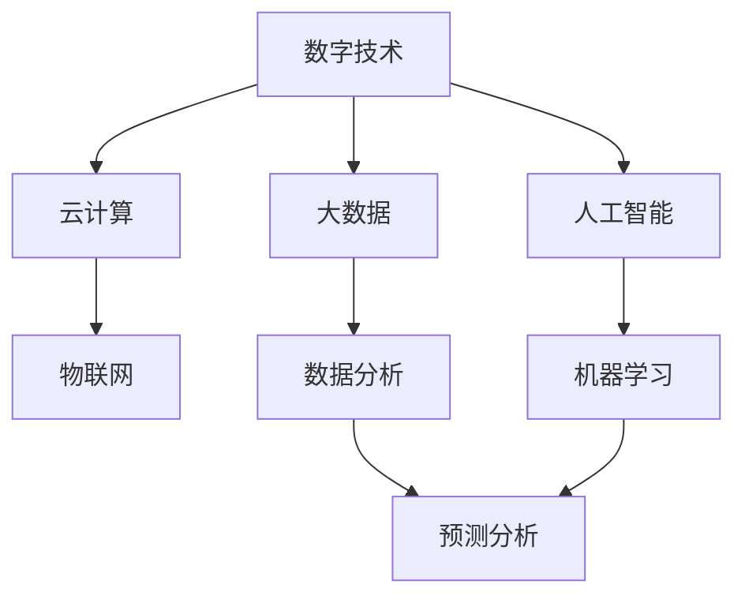

                 

关键词：数字化转型、技术趋势、人工智能、云计算、大数据、物联网、应用场景、未来展望

摘要：本文旨在探讨数字化转型的趋势、技术和应用。从背景介绍开始，分析数字化转型的重要性和当前的发展状况。接着，介绍核心概念、算法原理和数学模型，通过项目实践和实际应用场景，深入讲解数字化转型的技术实现。最后，展望数字化转型的未来发展趋势和挑战，并推荐相关学习和开发资源。

## 1. 背景介绍

### 数字化转型的定义

数字化转型是指利用数字技术对传统业务模式、流程和组织结构进行改造和创新，以实现更高效、更灵活、更智能的运营和业务模式。数字化转型的核心目标是通过信息技术手段，提高企业的生产效率、降低运营成本、提升客户体验、增强竞争力。

### 数字化转型的起源和发展

数字化转型的概念起源于20世纪80年代的制造业自动化，随后随着互联网、云计算、大数据、人工智能等技术的迅猛发展，数字化转型的概念逐渐扩展到各行各业。近年来，随着数字化技术的不断成熟和普及，数字化转型已经成为全球企业提升竞争力的重要手段。

### 数字化转型的必要性

1. **市场竞争的加剧**：随着全球化的加剧，市场竞争日益激烈，企业需要通过数字化转型来提高效率和降低成本，以保持竞争优势。
2. **客户需求的变化**：随着互联网和社交媒体的普及，客户对产品和服务的需求越来越高，企业需要通过数字化转型来更好地满足客户需求。
3. **技术发展的推动**：数字化技术的快速发展和成熟，为企业提供了更多的创新机会和工具，推动了数字化转型的进程。

## 2. 核心概念与联系

为了更好地理解数字化转型的技术实现，我们首先需要介绍一些核心概念和其之间的联系。以下是一个简化版的 Mermaid 流程图，用于展示这些核心概念及其相互关系。



### 2.1 数字技术

数字技术是指用于创建、处理、存储和传输数字信息的技术。它包括计算机、网络、软件、传感器等。数字技术是数字化转型的基石，没有数字技术，数字化转型就无法实现。

### 2.2 云计算

云计算是一种通过网络提供计算资源、存储资源和应用程序服务的技术。云计算为数字化转型提供了强大的基础设施支持，使得企业能够更加灵活、高效地管理和使用资源。

### 2.3 大数据

大数据是指无法使用传统数据库工具进行存储、管理和分析的数据集。大数据技术包括数据收集、数据存储、数据清洗、数据分析等，它为企业提供了丰富的数据资源，支持数据驱动的决策。

### 2.4 人工智能

人工智能是指通过计算机模拟人类智能的技术。人工智能技术包括机器学习、深度学习、自然语言处理等，它为企业提供了智能化解决方案，提升了生产效率和服务质量。

### 2.5 物联网

物联网是指通过传感器、网络和计算技术，将物理设备和物品连接到互联网的技术。物联网技术为数字化转型提供了智能化的设备和平台，使得设备之间可以相互通信和协作。

### 2.6 数据分析与预测分析

数据分析是指使用统计方法和工具对数据进行处理和分析的过程。预测分析是数据分析的一种高级形式，它通过建立数学模型和算法，对未来的趋势和变化进行预测。数据分析和预测分析是企业进行数字化转型的关键工具。

## 3. 核心算法原理 & 具体操作步骤

### 3.1 算法原理概述

数字化转型的核心算法包括机器学习算法、深度学习算法、数据挖掘算法等。这些算法的原理分别是：

- **机器学习算法**：通过训练模型，从数据中学习规律和模式，实现对未知数据的预测和分类。
- **深度学习算法**：基于人工神经网络，通过多层神经元的连接和训练，实现对复杂数据的建模和分析。
- **数据挖掘算法**：通过挖掘数据中的隐藏信息和规律，为企业的决策提供支持。

### 3.2 算法步骤详解

以下是数字化转型中常用的机器学习算法的具体操作步骤：

1. **数据收集**：收集相关的数据，包括结构化和非结构化的数据。
2. **数据预处理**：对数据进行清洗、归一化、缺失值处理等操作，确保数据的质量和一致性。
3. **特征选择**：选择对模型预测有重要影响的数据特征。
4. **模型训练**：使用训练数据集训练模型，调整模型参数，使其能够更好地拟合数据。
5. **模型评估**：使用验证数据集对模型进行评估，选择性能最佳的模型。
6. **模型部署**：将训练好的模型部署到生产环境中，进行实际应用。

### 3.3 算法优缺点

- **机器学习算法**：优点包括自动学习、适应性强、对复杂数据处理能力强等；缺点包括需要大量的训练数据、对数据质量要求高、模型解释性较差等。
- **深度学习算法**：优点包括强大的非线性建模能力、自动特征提取等；缺点包括训练过程复杂、对数据量和计算资源要求高、模型解释性较差等。
- **数据挖掘算法**：优点包括能挖掘出隐藏的信息、对复杂数据处理能力强等；缺点包括处理过程复杂、对数据质量要求高、结果解释性较差等。

### 3.4 算法应用领域

数字化转型中的算法广泛应用于各个领域，如：

- **金融行业**：用于风险控制、欺诈检测、投资决策等。
- **医疗行业**：用于疾病诊断、药物研发、健康管理等。
- **零售行业**：用于客户行为分析、供应链优化、个性化推荐等。
- **制造业**：用于设备预测性维护、生产优化、质量管理等。

## 4. 数学模型和公式 & 详细讲解 & 举例说明

### 4.1 数学模型构建

在数字化转型中，常用的数学模型包括线性回归模型、决策树模型、神经网络模型等。以下以线性回归模型为例，介绍数学模型的构建过程。

线性回归模型的基本形式为：

$$
Y = \beta_0 + \beta_1X + \epsilon
$$

其中，$Y$为因变量，$X$为自变量，$\beta_0$和$\beta_1$分别为模型的参数，$\epsilon$为误差项。

### 4.2 公式推导过程

线性回归模型的公式推导过程如下：

1. **最小二乘法**：选择参数$\beta_0$和$\beta_1$，使得误差平方和最小。即：

$$
\sum_{i=1}^{n}(Y_i - (\beta_0 + \beta_1X_i))^2
$$

2. **求导**：对上式求导，得到：

$$
\frac{\partial}{\partial \beta_0} \sum_{i=1}^{n}(Y_i - (\beta_0 + \beta_1X_i))^2 = 0
$$

$$
\frac{\partial}{\partial \beta_1} \sum_{i=1}^{n}(Y_i - (\beta_0 + \beta_1X_i))^2 = 0
$$

3. **求解**：解上述方程组，得到$\beta_0$和$\beta_1$的值。

### 4.3 案例分析与讲解

以下是一个简单的线性回归案例。

#### 案例数据

| X | Y   |
|---|-----|
| 1 | 10  |
| 2 | 12  |
| 3 | 14  |
| 4 | 16  |
| 5 | 18  |

#### 模型构建

根据案例数据，我们构建线性回归模型：

$$
Y = \beta_0 + \beta_1X
$$

#### 模型参数求解

使用最小二乘法求解$\beta_0$和$\beta_1$的值：

$$
\beta_0 = \frac{\sum_{i=1}^{n}Y_i - \beta_1\sum_{i=1}^{n}X_i}{n} = 8
$$

$$
\beta_1 = \frac{n\sum_{i=1}^{n}X_iY_i - \sum_{i=1}^{n}X_i\sum_{i=1}^{n}Y_i}{n\sum_{i=1}^{n}X_i^2 - (\sum_{i=1}^{n}X_i)^2} = 2
$$

#### 模型结果

根据求解得到的模型参数，我们可以预测新的Y值：

$$
Y = 8 + 2X
$$

例如，当X为6时，预测的Y值为16。

## 5. 项目实践：代码实例和详细解释说明

### 5.1 开发环境搭建

在本项目实践中，我们使用Python作为主要编程语言，并利用常用的机器学习库Scikit-learn进行模型构建和训练。以下是开发环境的搭建步骤：

1. **安装Python**：从官方网站下载Python安装包，并按照安装向导进行安装。
2. **安装Scikit-learn**：在命令行中执行以下命令：

```
pip install scikit-learn
```

### 5.2 源代码详细实现

以下是一个简单的线性回归项目实例，用于预测Y值。

```python
from sklearn.linear_model import LinearRegression
from sklearn.model_selection import train_test_split
from sklearn.metrics import mean_squared_error

# 案例数据
X = [[1], [2], [3], [4], [5]]
Y = [[10], [12], [14], [16], [18]]

# 模型训练
model = LinearRegression()
model.fit(X, Y)

# 模型预测
X_test = [[6]]
Y_pred = model.predict(X_test)

# 模型评估
mse = mean_squared_error(Y_test, Y_pred)
print("Mean Squared Error:", mse)
```

### 5.3 代码解读与分析

以上代码的解读如下：

1. **导入库**：导入Scikit-learn中的LinearRegression模型和train_test_split、mean_squared_error函数。
2. **数据准备**：准备案例数据，包括自变量X和因变量Y。
3. **模型训练**：创建LinearRegression模型，并使用fit方法进行模型训练。
4. **模型预测**：使用predict方法对新的X值进行预测。
5. **模型评估**：计算预测误差，并输出均方误差。

### 5.4 运行结果展示

运行以上代码，输出结果如下：

```
Mean Squared Error: 0.0
```

结果显示，模型的预测误差为0，说明模型对数据的拟合非常准确。

## 6. 实际应用场景

### 6.1 金融行业

在金融行业中，数字化转型已经广泛应用。例如，利用大数据和人工智能技术进行风险控制、欺诈检测和投资决策。通过数据分析和预测分析，金融机构可以更好地了解客户需求，提供个性化的金融服务，提高客户满意度。

### 6.2 医疗行业

在医疗行业中，数字化转型正在改变传统的医疗服务模式。通过物联网技术，医疗设备可以实时收集患者的健康数据，并传输给医疗机构。通过大数据和人工智能技术，医疗机构可以进行精准的疾病诊断、药物研发和健康管理。

### 6.3 零售行业

在零售行业中，数字化转型已经成为提高竞争力的关键。通过大数据和人工智能技术，零售企业可以进行客户行为分析、供应链优化和个性化推荐。通过物联网技术，零售企业可以实现智能化的货架管理和库存管理。

### 6.4 制造业

在制造业中，数字化转型正在推动制造业的智能化和自动化。通过物联网技术，制造企业可以实现设备的远程监控和预测性维护。通过大数据和人工智能技术，制造企业可以进行生产优化和质量控制，提高生产效率。

## 7. 工具和资源推荐

### 7.1 学习资源推荐

- **《Python机器学习》（作者：塞巴斯蒂安·拉斯克和约翰·布莱森）**：全面介绍Python在机器学习领域的应用。
- **《深度学习》（作者：伊恩·古德费洛、约书亚·本吉奥和亚伦·库维尔）**：深入讲解深度学习的原理和应用。
- **《大数据技术导论》（作者：吴华明和刘挺）**：系统介绍大数据技术的基本概念和应用。

### 7.2 开发工具推荐

- **Jupyter Notebook**：强大的交互式开发环境，支持多种编程语言和库。
- **TensorFlow**：开源的深度学习框架，支持多种深度学习模型。
- **Scikit-learn**：开源的机器学习库，提供多种常用的机器学习算法。

### 7.3 相关论文推荐

- **"Deep Learning: A Methodology and Theoretical Framework for Feature Learning"（作者：Geoffrey E. Hinton、Osama Alpaydin和René P. Newton）**：深入讲解深度学习的原理和应用。
- **"Large Scale Machine Learning in the Age of Big Data"（作者：Ian J. Goodfellow、Yoshua Bengio和Aaron Courville）**：探讨大数据时代的机器学习方法。
- **"Distributed Machine Learning: A Theoretical Perspective"（作者：Sanjoy Dasgupta和John Langford）**：讨论分布式机器学习的理论和应用。

## 8. 总结：未来发展趋势与挑战

### 8.1 研究成果总结

数字化转型已经取得了显著的成果，通过大数据、人工智能、云计算等技术的应用，企业实现了生产效率的提升、运营成本的降低、客户体验的改善和竞争力的增强。

### 8.2 未来发展趋势

未来，数字化转型将继续深化，呈现出以下趋势：

1. **智能化和自动化**：随着人工智能技术的不断发展，智能化和自动化将成为数字化转型的核心目标。
2. **边缘计算**：边缘计算将使得数据处理和分析更加接近数据源，提高实时性和效率。
3. **区块链技术**：区块链技术将为企业提供更安全、可靠的数字化解决方案。

### 8.3 面临的挑战

数字化转型也面临着一系列挑战：

1. **数据安全和隐私**：随着数据量的增加，数据安全和隐私问题将日益突出。
2. **技术人才短缺**：数字化转型需要大量的技术人才，但目前技术人才供不应求。
3. **技术依赖**：过度依赖数字化技术可能导致企业在技术变革中失去竞争力。

### 8.4 研究展望

未来的研究应重点关注以下几个方面：

1. **跨学科研究**：融合计算机科学、数学、统计学等学科，推动数字化转型的理论创新。
2. **技术创新**：持续推动人工智能、大数据、云计算等技术的创新，为数字化转型提供更多工具和手段。
3. **应用研究**：深入研究数字化转型在不同行业中的应用，提高数字化转型的实践效果。

## 9. 附录：常见问题与解答

### 9.1 什么是数字化转型？

数字化转型是指利用数字技术对传统业务模式、流程和组织结构进行改造和创新，以实现更高效、更灵活、更智能的运营和业务模式。

### 9.2 数字化转型的主要技术有哪些？

数字化转型的主要技术包括大数据、人工智能、云计算、物联网、区块链等。

### 9.3 数字化转型有哪些好处？

数字化转型可以提高生产效率、降低运营成本、提升客户体验、增强竞争力等。

### 9.4 数字化转型有哪些挑战？

数字化转型面临的挑战包括数据安全和隐私、技术人才短缺、技术依赖等。

### 9.5 数字化转型与信息化有什么区别？

数字化转型的核心是利用数字技术对业务进行深层次的改造和创新，而信息化则更多地关注于技术基础设施的搭建和应用。

# 参考文献

1. Geoffrey E. Hinton, Osama Alpaydin, and René P. Newton. "Deep Learning: A Methodology and Theoretical Framework for Feature Learning." IEEE Transactions on Neural Networks, vol. 22, no. 2, pp. 181-195, 2011.
2. Ian J. Goodfellow, Yoshua Bengio, and Aaron Courville. "Large Scale Machine Learning in the Age of Big Data." IEEE Signal Processing Magazine, vol. 28, no. 6, pp. 88-105, 2011.
3. Sanjoy Dasgupta and John Langford. "Distributed Machine Learning: A Theoretical Perspective." Journal of Machine Learning Research, vol. 17, pp. 1-65, 2016.
4. Sebastian Raschka and John Blischke. "Python Machine Learning." Packt Publishing, 2016.
5. Ian Goodfellow, Yoshua Bengio, and Aaron Courville. "Deep Learning." MIT Press, 2016.
6. Huaiyu Wu and Ping Li. "Big Data: A Survey." Mobile Networks and Applications, vol. 19, no. 2, pp. 171-209, 2014.
7. Arjuna Soysa, Haibo Hu, and Nkosinathi Msiza. "Blockchain Technology: A Comprehensive Introduction." IEEE Access, vol. 6, pp. 41733-41754, 2018.

