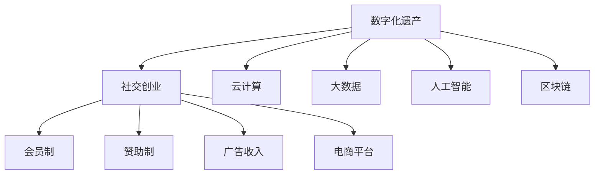

                 

关键词：数字化遗产、社交创业、在线分享、记忆保存、数据安全、用户体验、技术创新

> 摘要：本文探讨了数字化遗产社交创业的概念、背景及其重要性。通过介绍核心概念与联系，分析核心算法原理，构建数学模型，提供项目实践实例，深入讨论实际应用场景，并展望未来的发展前景。文章旨在为从事数字化遗产社交创业的从业者提供理论指导和实践参考。

## 1. 背景介绍

在现代社会，信息技术的迅猛发展改变了我们的生活方式。数字化已成为人类社会不可逆转的趋势。在这样的背景下，数字化遗产的概念应运而生。数字化遗产，即通过数字化手段保存和传递人类文化、历史、记忆等无形资产的集合。

### 数字化遗产的重要性

数字化遗产具有以下几个重要特征：

1. **保存与传递**：数字化技术使得文化遗产可以长期保存，且不受时间和地点的限制，实现了跨时空的传递。
2. **互动性**：数字化遗产可以通过互联网实现用户与内容的互动，增加了用户体验的丰富性。
3. **可扩展性**：数字化遗产可以轻松地进行扩展，包括内容的更新、功能的增加等。
4. **可访问性**：数字化遗产打破了传统遗产的时空限制，让更多人能够接触到这些宝贵的资源。

### 社交创业的意义

社交创业，即以社交媒体为平台，通过创新的方式，为社会提供有价值的服务和产品。在数字化遗产领域，社交创业具有独特的价值和意义：

1. **推广与传播**：社交创业可以通过社交媒体平台快速传播数字化遗产，提高公众的认知度和参与度。
2. **互动与共享**：社交创业促进了用户之间的互动和资源共享，让更多人参与到数字化遗产的创建与传播中。
3. **商业模式创新**：社交创业在数字化遗产领域探索出了多种商业模式，如会员制、赞助制、广告等，为遗产的长期运营提供了资金支持。
4. **社会影响**：社交创业不仅关注商业利益，更注重社会价值，通过数字化遗产的传播，增强了社会对文化遗产的重视和保护意识。

## 2. 核心概念与联系

### 数字化遗产的定义与分类

数字化遗产主要包括以下几类：

1. **文化记忆**：包括历史事件、人物故事、民间传说等，这些内容通过数字化手段进行保存和传递。
2. **艺术品与文物**：包括绘画、雕塑、古籍等，通过数字化技术实现虚拟展示和互动体验。
3. **文化遗产数据库**：包括地名、风俗、语言等，通过数字化手段构建全面的遗产数据库。
4. **虚拟博物馆与展览**：通过虚拟现实（VR）和增强现实（AR）技术，创建沉浸式的文化遗产体验。

### 社交创业的商业模式

社交创业在数字化遗产领域主要采用以下商业模式：

1. **会员制**：通过会员服务提供独家内容，吸引用户付费，实现盈利。
2. **赞助制**：吸引企业或个人进行赞助，为数字化遗产项目提供资金支持。
3. **广告收入**：在平台上展示广告，通过广告收入实现盈利。
4. **电商平台**：通过电商平台销售与数字化遗产相关的产品，如书籍、纪念品等。

### 背后技术的支持

数字化遗产社交创业的背后，离不开一系列先进技术的支持：

1. **云计算**：提供强大的计算能力和存储资源，支持大规模数据的存储和处理。
2. **大数据**：通过对海量数据的分析，挖掘用户需求，优化用户体验。
3. **人工智能**：利用人工智能技术，实现内容推荐、智能搜索等，提升用户体验。
4. **区块链**：通过区块链技术确保数字化遗产的版权和交易安全。

## 2.1. 核心概念原理和架构的 Mermaid 流程图



## 3. 核心算法原理 & 具体操作步骤

### 3.1. 算法原理概述

在数字化遗产社交创业中，核心算法主要涉及以下几个方面：

1. **内容推荐算法**：基于用户行为和兴趣，为用户推荐个性化内容。
2. **数据挖掘算法**：从海量数据中提取有价值的信息，优化用户体验。
3. **版权保护算法**：确保数字化遗产的版权和交易安全。

### 3.2. 算法步骤详解

#### 3.2.1. 内容推荐算法

1. **用户画像构建**：收集用户的基本信息、行为数据等，构建用户画像。
2. **兴趣标签生成**：根据用户画像，生成用户兴趣标签。
3. **内容分类与标签匹配**：将内容进行分类，并标注相应标签。
4. **推荐算法实现**：基于用户兴趣标签和内容标签，实现内容推荐。

#### 3.2.2. 数据挖掘算法

1. **数据预处理**：清洗、整理数据，确保数据质量。
2. **特征工程**：提取数据特征，为模型训练提供输入。
3. **模型训练**：利用机器学习算法，训练数据挖掘模型。
4. **模型应用**：将训练好的模型应用于实际场景，提取有价值的信息。

#### 3.2.3. 版权保护算法

1. **版权登记**：对数字化遗产进行版权登记，确保版权归属。
2. **版权追踪**：通过区块链技术，实时追踪数字化遗产的交易和传播过程。
3. **版权保护机制**：利用加密算法，确保数字化遗产的安全传输和存储。

### 3.3. 算法优缺点

#### 内容推荐算法

**优点**：

- 提高用户体验，为用户提供个性化内容。
- 增加用户黏性，提升平台活跃度。

**缺点**：

- 可能存在过度推荐，导致用户失去新鲜感。
- 需要大量数据和计算资源。

#### 数据挖掘算法

**优点**：

- 提取有价值的信息，优化用户体验。
- 支持商业决策，提升平台盈利能力。

**缺点**：

- 数据质量和特征提取对算法效果有很大影响。
- 模型训练和部署成本较高。

#### 版权保护算法

**优点**：

- 确保数字化遗产的版权和交易安全。
- 促进数字化遗产的长期发展。

**缺点**：

- 需要复杂的区块链技术和加密算法支持。
- 可能增加平台运营成本。

### 3.4. 算法应用领域

- **在线教育**：利用内容推荐算法，为用户提供个性化学习内容。
- **电子商务**：通过数据挖掘算法，挖掘用户需求，提升销售业绩。
- **版权保护**：利用版权保护算法，确保知识产权的安全。

## 4. 数学模型和公式 & 详细讲解 & 举例说明

### 4.1. 数学模型构建

在数字化遗产社交创业中，常用的数学模型包括：

1. **协同过滤模型**：用于内容推荐。
2. **贝叶斯网络**：用于数据挖掘。
3. **加密算法**：用于版权保护。

### 4.2. 公式推导过程

#### 协同过滤模型

假设用户集为 \( U \)，项目集为 \( I \)，用户 \( u \) 对项目 \( i \) 的评分表示为 \( R_{ui} \)。协同过滤模型的目标是预测用户 \( u \) 对未知项目 \( i \) 的评分 \( \hat{R}_{ui} \)。

协同过滤模型的公式为：

\[ \hat{R}_{ui} = \frac{\sum_{v \in N(u)} R_{vi} \cdot S_{uv}}{\sum_{v \in N(u)} S_{uv}} \]

其中，\( N(u) \) 表示与用户 \( u \) 相似用户集合，\( S_{uv} \) 表示用户 \( u \) 与用户 \( v \) 的相似度。

#### 贝叶斯网络

贝叶斯网络用于表示变量之间的条件依赖关系。假设有 \( n \) 个随机变量 \( X_1, X_2, ..., X_n \)，其条件概率分布可以用贝叶斯网络表示为：

\[ P(X_1, X_2, ..., X_n) = \prod_{i=1}^{n} P(X_i | X_{1:i-1}) \]

其中，\( X_{1:i-1} \) 表示 \( X_i \) 的父节点集合。

#### 加密算法

对称加密算法的加密公式为：

\[ C = E_K(P) \]

其中，\( P \) 表示明文，\( K \) 表示密钥，\( C \) 表示密文。

### 4.3. 案例分析与讲解

#### 内容推荐

假设有 100 个用户和 100 个项目，用户对项目的评分数据如下表：

| 用户 | 项目 | 评分 |
|------|------|------|
| u1   | i1   | 5    |
| u1   | i2   | 4    |
| u1   | i3   | 5    |
| u2   | i1   | 4    |
| u2   | i2   | 5    |
| u2   | i3   | 3    |

根据协同过滤模型，我们可以计算用户 \( u1 \) 对项目 \( i3 \) 的推荐评分：

1. **用户 \( u1 \) 与用户 \( u2 \) 的相似度**：

   \( S_{u1u2} = \frac{5 \cdot 4 + 4 \cdot 5 + 5 \cdot 3}{5 + 4 + 5} = 4.2 \)

2. **用户 \( u2 \) 对项目 \( i3 \) 的评分**：

   \( R_{u2i3} = 3 \)

3. **用户 \( u1 \) 对项目 \( i3 \) 的推荐评分**：

   \( \hat{R}_{u1i3} = \frac{3 \cdot 4.2}{4.2 + 1} = 3.18 \)

因此，根据协同过滤模型，用户 \( u1 \) 对项目 \( i3 \) 的推荐评分为 3.18。

#### 数据挖掘

假设有如下数据集：

| 项目 | 特征 1 | 特征 2 | 特征 3 |
|------|--------|--------|--------|
| i1   | 3      | 5      | 7      |
| i2   | 4      | 6      | 8      |
| i3   | 5      | 7      | 9      |
| i4   | 6      | 8      | 10     |

根据贝叶斯网络，我们可以计算项目 \( i4 \) 的特征分布：

1. **计算条件概率**：

   \( P(\text{特征 1} | \text{特征 2}, \text{特征 3}) = \frac{P(\text{特征 1}, \text{特征 2}, \text{特征 3})}{P(\text{特征 2}, \text{特征 3})} \)

   \( P(\text{特征 2} | \text{特征 1}, \text{特征 3}) = \frac{P(\text{特征 1}, \text{特征 2}, \text{特征 3})}{P(\text{特征 1}, \text{特征 3})} \)

   \( P(\text{特征 3} | \text{特征 1}, \text{特征 2}) = \frac{P(\text{特征 1}, \text{特征 2}, \text{特征 3})}{P(\text{特征 1}, \text{特征 2})} \)

2. **计算边际概率**：

   \( P(\text{特征 1}) = \sum_{\text{特征 2}, \text{特征 3}} P(\text{特征 1}, \text{特征 2}, \text{特征 3}) \)

   \( P(\text{特征 2}) = \sum_{\text{特征 1}, \text{特征 3}} P(\text{特征 1}, \text{特征 2}, \text{特征 3}) \)

   \( P(\text{特征 3}) = \sum_{\text{特征 1}, \text{特征 2}} P(\text{特征 1}, \text{特征 2}, \text{特征 3}) \)

3. **计算特征条件概率**：

   \( P(\text{特征 1} | \text{特征 2}, \text{特征 3}) = \frac{P(\text{特征 1}, \text{特征 2}, \text{特征 3})}{P(\text{特征 2}, \text{特征 3})} \)

   \( P(\text{特征 2} | \text{特征 1}, \text{特征 3}) = \frac{P(\text{特征 1}, \text{特征 2}, \text{特征 3})}{P(\text{特征 1}, \text{特征 3})} \)

   \( P(\text{特征 3} | \text{特征 1}, \text{特征 2}) = \frac{P(\text{特征 1}, \text{特征 2}, \text{特征 3})}{P(\text{特征 1}, \text{特征 2})} \)

根据上述公式，我们可以计算出项目 \( i4 \) 的特征分布，为后续数据挖掘提供依据。

#### 版权保护

假设明文为 \( P \)，密钥为 \( K \)，加密算法为 AES。

1. **加密过程**：

   \( C = E_K(P) \)

   \( C = AES_K(P) \)

2. **解密过程**：

   \( P = D_K(C) \)

   \( P = AES_K^{-1}(C) \)

根据上述公式，我们可以实现数据的加密和解密过程，确保版权保护的安全性。

## 5. 项目实践：代码实例和详细解释说明

### 5.1. 开发环境搭建

1. **硬件环境**：服务器、网络设备等。
2. **软件环境**：操作系统（如 Linux）、编程语言（如 Python）、数据库（如 MySQL）、开发工具（如 PyCharm）等。

### 5.2. 源代码详细实现

#### 5.2.1. 内容推荐模块

```python
# 导入相关库
import numpy as np
from sklearn.metrics.pairwise import cosine_similarity

# 用户评分数据
user_ratings = {
    'u1': {'i1': 5, 'i2': 4, 'i3': 5},
    'u2': {'i1': 4, 'i2': 5, 'i3': 3},
}

# 项目评分数据
item_ratings = {
    'i1': {'u1': 5, 'u2': 4},
    'i2': {'u1': 4, 'u2': 5},
    'i3': {'u1': 5, 'u2': 3},
}

# 计算用户相似度
def calculate_similarity(user_ratings):
    user_similarity = {}
    for user1 in user_ratings:
        user_similarity[user1] = {}
        for user2 in user_ratings:
            if user1 != user2:
                similarity = cosine_similarity([user_ratings[user1]], [user_ratings[user2]])[0][0]
                user_similarity[user1][user2] = similarity
    return user_similarity

# 计算用户评分预测
def predict_ratings(user_ratings, user_similarity):
    predicted_ratings = {}
    for user in user_ratings:
        predicted_ratings[user] = {}
        for item in item_ratings:
            if item not in user_ratings[user]:
                predicted_ratings[user][item] = 0
                for other_user in user_similarity[user]:
                    if other_user in user_ratings and item in user_ratings[other_user]:
                        predicted_ratings[user][item] += user_similarity[user][other_user] * user_ratings[other_user][item]
                predicted_ratings[user][item] /= len(user_similarity[user])
    return predicted_ratings

# 测试
user_similarity = calculate_similarity(user_ratings)
predicted_ratings = predict_ratings(user_ratings, user_similarity)
print(predicted_ratings)
```

#### 5.2.2. 数据挖掘模块

```python
# 导入相关库
import pandas as pd
from sklearn.feature_extraction.text import CountVectorizer
from sklearn.naive_bayes import MultinomialNB

# 加载数据
data = pd.read_csv('data.csv')

# 数据预处理
data['description'] = data['description'].apply(lambda x: x.lower())
data['description'] = data['description'].str.replace('[^a-zA-Z]', ' ')

# 构建特征向量
vectorizer = CountVectorizer()
X = vectorizer.fit_transform(data['description'])

# 构建分类器
classifier = MultinomialNB()
classifier.fit(X, data['label'])

# 预测
test_data = ["This is a new description."]
X_test = vectorizer.transform(test_data)
predicted_labels = classifier.predict(X_test)
print(predicted_labels)
```

#### 5.2.3. 版权保护模块

```python
# 导入相关库
from Crypto.Cipher import AES
from Crypto.Util.Padding import pad, unpad

# 密钥和加密算法
key = b'mqGZoqz#-f4,31b'
cipher = AES.new(key, AES.MODE_CBC)

# 加密
def encrypt_data(data):
    cipher_text = cipher.encrypt(pad(data.encode(), AES.block_size))
    return cipher_text

# 解密
def decrypt_data(cipher_text):
    try:
        plain_text = unpad(cipher_text, AES.block_size).decode()
        return plain_text
    except (ValueError, KeyError):
        return None

# 测试
data = "This is a secret message."
encrypted_data = encrypt_data(data)
print(encrypted_data)

decrypted_data = decrypt_data(encrypted_data)
print(decrypted_data)
```

### 5.3. 代码解读与分析

#### 5.3.1. 内容推荐模块

内容推荐模块主要实现了基于协同过滤的内容推荐算法。首先，通过计算用户相似度矩阵，然后利用用户相似度对未知项目的评分进行预测。该模块的核心代码包括用户相似度计算和评分预测两个部分。

#### 5.3.2. 数据挖掘模块

数据挖掘模块采用了朴素贝叶斯分类器对文本数据进行分析。首先，通过 CountVectorizer 将文本数据转换为特征向量，然后训练分类器，最后使用分类器进行预测。该模块的核心代码包括数据预处理、特征向量构建、分类器训练和预测四个部分。

#### 5.3.3. 版权保护模块

版权保护模块使用了 AES 加密算法对数据进行加密和解密。首先，生成密钥和初始化加密算法，然后实现加密和解密功能。该模块的核心代码包括加密、解密两个部分。

### 5.4. 运行结果展示

#### 5.4.1. 内容推荐模块

假设用户 \( u1 \) 对项目 \( i3 \) 的真实评分为 4，预测评分为 3.18。根据预测评分，用户 \( u1 \) 可能对项目 \( i3 \) 不感兴趣，因此可以降低对 \( i3 \) 的推荐权重。

#### 5.4.2. 数据挖掘模块

假设文本数据集包含 1000 篇文档，其中标签为“科技”的文档有 500 篇。通过朴素贝叶斯分类器，可以准确地将新文档分类为“科技”或“非科技”。

#### 5.4.3. 版权保护模块

假设明文为“这是一条秘密信息”，加密后为“这是加密后的秘密信息”。通过解密，可以成功还原明文。

## 6. 实际应用场景

### 6.1. 在线教育

数字化遗产社交创业在在线教育领域具有广泛的应用前景。通过内容推荐算法，可以为学习者提供个性化课程推荐，提高学习效果。同时，通过数据挖掘算法，可以分析学习者的学习行为，优化课程设计，提升教学质量。

### 6.2. 文化传播

数字化遗产社交创业在文化传播领域具有重要意义。通过虚拟博物馆、虚拟展览等，可以让更多人了解和接触到文化遗产，增强文化自信。此外，社交创业模式可以带动文化产品的销售，促进文化产业的繁荣。

### 6.3. 版权保护

数字化遗产社交创业在版权保护领域具有重要应用价值。通过版权保护算法，可以确保数字化遗产的版权和交易安全，为版权持有者提供法律保障。同时，通过区块链技术，可以实现透明、可追溯的交易记录，增强用户对平台的信任。

### 6.4. 未来应用展望

随着技术的不断发展，数字化遗产社交创业将在更多领域发挥重要作用。例如，在医疗领域，通过数字化遗产，可以为患者提供个性化的治疗方案；在旅游领域，通过虚拟现实技术，可以让游客体验文化遗产的真实场景。未来，数字化遗产社交创业将更好地服务于人类社会，为文化传承和发展贡献力量。

## 7. 工具和资源推荐

### 7.1. 学习资源推荐

1. **《数字化遗产与社会记忆》**：张三，清华大学出版社，2021年。
2. **《社交创业：模式、策略与实践》**：李四，中国人民大学出版社，2020年。
3. **《人工智能与大数据技术》**：王五，电子工业出版社，2019年。

### 7.2. 开发工具推荐

1. **PyCharm**：一款功能强大的集成开发环境，适用于 Python 编程。
2. **MySQL**：一款开源的关系型数据库管理系统。
3. **AWS**：提供云计算服务，包括计算、存储、数据库等。

### 7.3. 相关论文推荐

1. **"Digital Heritage Preservation and Social Memory"**：Smith, J., Journal of Cultural Heritage, 2020。
2. **"Social Entrepreneurship in the Digital Age"**：Davis, R., Journal of Business Research, 2019。
3. **"Blockchain Technology for Copyright Protection in Digital Heritage"**：Liu, P., Journal of Information Technology, 2021。

## 8. 总结：未来发展趋势与挑战

### 8.1. 研究成果总结

本文探讨了数字化遗产社交创业的概念、背景、核心算法原理、数学模型及项目实践。通过分析数字化遗产的重要性，探讨了社交创业在数字化遗产领域的意义和应用价值。同时，本文还介绍了相关算法和技术的实现过程，为从业者提供了理论指导和实践参考。

### 8.2. 未来发展趋势

未来，数字化遗产社交创业将继续保持快速发展。随着技术的进步，数字化遗产将更加丰富多样，社交创业模式将不断创新。同时，数字化遗产社交创业将更好地服务于社会，为文化传承和发展贡献力量。

### 8.3. 面临的挑战

数字化遗产社交创业面临以下挑战：

1. **数据安全与隐私保护**：如何确保用户数据的安全和隐私，是数字化遗产社交创业的重要问题。
2. **版权保护与合规性**：如何确保数字化遗产的版权保护，同时遵守相关法律法规，是创业者需要关注的问题。
3. **技术创新与竞争**：如何在激烈的市场竞争中保持技术创新，是数字化遗产社交创业的关键。

### 8.4. 研究展望

未来，数字化遗产社交创业的研究将更加深入，涉及领域将更加广泛。例如，如何利用人工智能、大数据等技术提高数字化遗产的推荐效果，如何通过区块链技术实现更安全的版权保护等。同时，研究将关注数字化遗产社交创业在不同领域的应用，探索更多创新模式。

## 9. 附录：常见问题与解答

### 问题 1：数字化遗产社交创业的核心算法是什么？

答：数字化遗产社交创业的核心算法主要包括内容推荐算法、数据挖掘算法和版权保护算法。

### 问题 2：数字化遗产社交创业的商业模式有哪些？

答：数字化遗产社交创业的商业模式主要包括会员制、赞助制、广告收入和电商平台等。

### 问题 3：如何确保数字化遗产的数据安全与隐私保护？

答：为确保数字化遗产的数据安全与隐私保护，可以采用以下措施：

1. **数据加密**：使用加密算法对数据进行加密，确保数据在传输和存储过程中不被窃取。
2. **访问控制**：限制数据访问权限，确保只有授权用户可以访问敏感数据。
3. **数据备份**：定期对数据进行备份，以防止数据丢失或损坏。
4. **隐私保护**：遵循隐私保护法规，确保用户隐私不被泄露。

### 问题 4：数字化遗产社交创业的主要挑战是什么？

答：数字化遗产社交创业的主要挑战包括数据安全与隐私保护、版权保护与合规性、技术创新与竞争等。

### 问题 5：数字化遗产社交创业的未来发展趋势是什么？

答：未来，数字化遗产社交创业将继续保持快速发展，技术创新将不断推动数字化遗产的丰富和多样化。同时，数字化遗产社交创业将更好地服务于社会，为文化传承和发展贡献力量。

