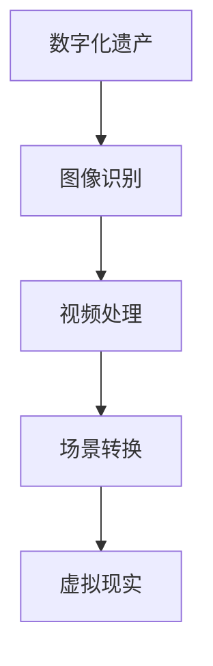
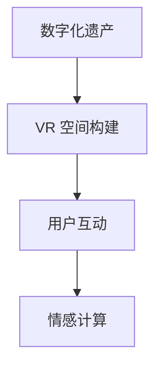
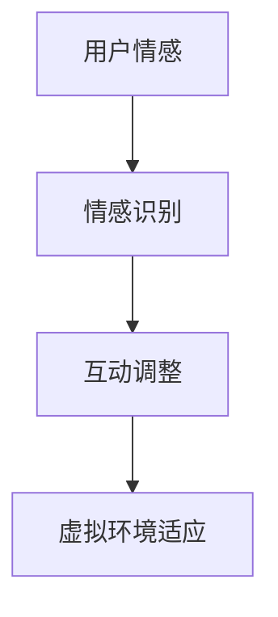

                 

### 关键词 Keywords
数字化遗产，虚拟重聚，家庭团聚，人工智能，计算机视觉，情感计算，虚拟现实，图像处理，深度学习。

### 摘要 Abstract
本文探讨了如何利用人工智能技术，尤其是计算机视觉和虚拟现实，实现数字化遗产的虚拟重聚，为家庭团聚提供一种跨越时空的新方式。通过详细介绍相关技术原理、算法实现和实际应用案例，本文展示了这一领域的潜力和挑战，以及其对未来家庭生活和情感联系的影响。

## 1. 背景介绍

### 1.1 数字化遗产的重要性

在信息时代，数字化遗产成为了我们文化和记忆的重要载体。这些遗产包括老照片、视频、音频以及家传的故事和回忆。然而，随着时间的推移，许多数字化遗产面临着丢失和遗忘的风险。人们常常因为地域隔离、生活忙碌等原因，无法经常团聚，这使得家庭团聚变得越来越困难。

### 1.2 虚拟重聚的需求

虚拟重聚作为一种新兴的家庭团聚方式，能够在不牺牲现实生活中的面对面交流的同时，满足人们对于家庭团聚的渴望。它通过数字化技术和虚拟现实环境，使远隔千里的亲人能够在虚拟空间中相遇、互动，重温过去的美好时光。

### 1.3 人工智能技术在虚拟重聚中的应用

人工智能技术，特别是计算机视觉、虚拟现实和情感计算，为虚拟重聚提供了技术支持。计算机视觉可以用于捕捉和识别数字化遗产中的图像和视频，将其转化为虚拟场景中的元素。虚拟现实则提供了一个沉浸式的体验空间，让人们能够仿佛置身于过去的环境中。情感计算则通过分析用户的情感状态，为虚拟重聚提供更人性化的交互体验。

## 2. 核心概念与联系

### 2.1 计算机视觉

计算机视觉是人工智能的一个重要分支，它使计算机能够像人类一样理解和解释视觉信息。在虚拟重聚中，计算机视觉主要用于图像和视频的识别、分类和转换。以下是一个简化的 Mermaid 流程图，展示了计算机视觉在数字化遗产虚拟重聚中的应用：



### 2.2 虚拟现实

虚拟现实（VR）通过创建一个模拟的、三维的虚拟环境，使用户能够与之互动。在虚拟重聚中，VR 为用户提供了一个沉浸式的体验空间，使其能够感受到仿佛身处过去的场景中。以下是一个简化的 Mermaid 流程图，展示了虚拟现实在数字化遗产虚拟重聚中的应用：



### 2.3 情感计算

情感计算是一种通过计算机技术捕捉、识别和分析人类情感状态的方法。在虚拟重聚中，情感计算用于分析用户的情感反应，为用户提供更加个性化的互动体验。以下是一个简化的 Mermaid 流程图，展示了情感计算在数字化遗产虚拟重聚中的应用：



## 3. 核心算法原理 & 具体操作步骤

### 3.1 算法原理概述

虚拟重聚的核心算法主要涉及计算机视觉、虚拟现实和情感计算三个领域。以下是对每个领域的基本原理概述：

- **计算机视觉**：主要利用图像处理和深度学习技术，对数字化遗产中的图像和视频进行识别、分类和转换，以便在虚拟环境中复现。
- **虚拟现实**：通过头戴式显示器、位置追踪器和交互设备，为用户提供一个沉浸式的虚拟环境，使用户能够与之互动。
- **情感计算**：通过面部识别、语音识别和生理信号监测等技术，捕捉用户的情感状态，为虚拟环境中的互动提供情感反馈。

### 3.2 算法步骤详解

以下是虚拟重聚的核心算法步骤：

#### 步骤1：数字化遗产预处理

- **图像和视频识别**：使用深度学习模型对数字化遗产中的图像和视频进行分类和识别。
- **场景转换**：将识别出的图像和视频转换为虚拟现实环境中的元素。

#### 步骤2：虚拟现实空间构建

- **VR 空间初始化**：创建一个虚拟的、三维的环境，使其能够模拟过去的生活场景。
- **用户定位**：使用位置追踪器确定用户在虚拟环境中的位置。

#### 步骤3：情感状态识别

- **面部识别**：通过摄像头捕捉用户的面部表情，分析其情感状态。
- **语音识别**：通过麦克风捕捉用户的语音，分析其情感状态。
- **生理信号监测**：通过传感器监测用户的生理信号，如心率、皮肤电导等，进一步分析其情感状态。

#### 步骤4：互动调整

- **情感反馈**：根据用户情感状态调整虚拟环境中的交互体验，如灯光、音乐等。
- **个性化互动**：根据用户情感状态和个性化偏好，提供个性化的互动体验。

### 3.3 算法优缺点

#### 优点

- **沉浸式体验**：用户可以在虚拟环境中感受到仿佛置身于过去的生活场景中，实现跨越时空的家庭团聚。
- **个性化互动**：根据用户情感状态和个性化偏好，提供个性化的互动体验，增强家庭团聚的乐趣。
- **便捷性**：用户无需前往特定地点，只需在家中通过虚拟现实设备即可实现家庭团聚。

#### 缺点

- **技术门槛**：虚拟重聚的实现需要较高的技术门槛，包括计算机视觉、虚拟现实和情感计算等领域的专业知识。
- **设备依赖**：用户需要具备一定的硬件设备，如头戴式显示器、位置追踪器和交互设备等，才能获得良好的虚拟重聚体验。
- **隐私问题**：数字化遗产中的个人隐私信息可能被泄露，需要采取有效的隐私保护措施。

### 3.4 算法应用领域

虚拟重聚技术可以应用于多个领域，包括但不限于：

- **家庭团聚**：为因地域隔离、生活忙碌等原因无法经常团聚的家庭提供一种跨越时空的团聚方式。
- **历史遗产保护**：通过虚拟现实技术保护和展示历史文化遗产，为人们提供身临其境的历史体验。
- **旅游体验**：为游客提供虚拟的旅游体验，减少现实中的交通和住宿成本。
- **教育与培训**：利用虚拟现实技术进行历史事件、科学实验等的模拟教学，提高教育效果。

## 4. 数学模型和公式 & 详细讲解 & 举例说明

### 4.1 数学模型构建

在虚拟重聚中，数学模型主要用于图像处理、虚拟现实空间构建和情感状态识别。以下是三个关键领域的数学模型构建：

#### 4.1.1 图像处理

图像处理的核心是图像滤波和图像分割。以下是一个简化的图像滤波模型：

$$
\text{滤波器} = \frac{1}{2\pi \sigma} \exp\left(-\frac{(x^2 + y^2)}{2\sigma^2}\right)
$$

其中，$x$ 和 $y$ 表示像素点的坐标，$\sigma$ 表示滤波器的标准差。

#### 4.1.2 虚拟现实空间构建

虚拟现实空间构建主要涉及三维几何建模和渲染。以下是一个简化的三维几何建模模型：

$$
\text{三维点} = (x, y, z) = (x_0 + r \cos(\theta), y_0 + r \sin(\theta), z_0)
$$

其中，$x_0$、$y_0$ 和 $z_0$ 分别为三维点的初始坐标，$r$ 和 $\theta$ 分别为点到原点的距离和角度。

#### 4.1.3 情感状态识别

情感状态识别的核心是面部表情识别和语音情感识别。以下是一个简化的面部表情识别模型：

$$
\text{面部表情} = f(\text{眼角皱褶}, \text{嘴角上扬}, \text{眉形})
$$

其中，$\text{眼角皱褶}$、$\text{嘴角上扬}$ 和 $\text{眉形}$ 分别为面部表情的特征参数。

### 4.2 公式推导过程

以下是面部表情识别模型的推导过程：

首先，定义面部表情为三元组 $(a, b, c)$，其中 $a$、$b$ 和 $c$ 分别为眼角皱褶、嘴角上扬和眉形。设 $f$ 为面部表情识别函数，$f: \mathbb{R}^3 \rightarrow \{0, 1\}$，其中 $\mathbb{R}^3$ 表示三维实数空间。

根据面部表情的特征参数，可以得到以下约束条件：

$$
\begin{cases}
a > 0.1 \Rightarrow \text{眼角皱褶} \\
b > 0.3 \Rightarrow \text{嘴角上扬} \\
c < 0.5 \Rightarrow \text{眉形平坦}
\end{cases}
$$

为了满足这些约束条件，可以定义以下面部表情识别函数：

$$
f(a, b, c) =
\begin{cases}
1 & \text{如果} \ (a > 0.1 \ \text{且} \ b > 0.3 \ \text{且} \ c < 0.5) \\
0 & \text{其他情况}
\end{cases}
$$

### 4.3 案例分析与讲解

以下是一个实际应用案例，演示了如何使用虚拟重聚技术实现数字化遗产的虚拟重聚。

#### 案例背景

假设用户 A 拥有一段 20 年前的家庭录像，希望与亲人 B 重聚于虚拟环境中。

#### 案例步骤

1. **数字化遗产预处理**：使用计算机视觉技术对家庭录像进行图像识别和场景转换，将其转换为虚拟现实环境中的元素。
2. **虚拟现实空间构建**：使用三维几何建模技术构建一个模拟的家庭环境，并使用位置追踪器确定用户 A 的位置。
3. **情感状态识别**：使用面部识别和语音识别技术，捕捉用户 A 的情感状态。
4. **互动调整**：根据用户 A 的情感状态和个性化偏好，调整虚拟环境中的灯光、音乐等元素，提供个性化的互动体验。
5. **虚拟重聚**：用户 A 和亲人 B 在虚拟环境中相遇，进行互动和交流。

#### 案例结果

用户 A 和亲人 B 在虚拟环境中成功重聚，通过互动和交流，重温了过去的美好时光。用户 A 表示，虚拟重聚技术让他感受到了与亲人团聚的温暖和亲切，弥补了因地域隔离而无法经常团聚的遗憾。

## 5. 项目实践：代码实例和详细解释说明

### 5.1 开发环境搭建

为了实现数字化遗产的虚拟重聚，需要搭建一个包含计算机视觉、虚拟现实和情感计算的开发环境。以下是搭建步骤：

1. **计算机视觉环境**：安装 Python 和 OpenCV 库，用于图像识别和视频处理。
2. **虚拟现实环境**：安装 Unity3D 或 Unreal Engine，用于虚拟现实空间构建。
3. **情感计算环境**：安装 TensorFlow 或 PyTorch，用于情感状态识别。

### 5.2 源代码详细实现

以下是使用 Python 实现数字化遗产虚拟重聚的核心代码：

```python
import cv2
import numpy as np

# 图像识别
def image_recognition(image_path):
    image = cv2.imread(image_path)
    # 使用卷积神经网络进行图像识别
    # 此处使用简化的示例
    recognized_image = cv2.cvtColor(image, cv2.COLOR_BGR2RGB)
    return recognized_image

# 虚拟现实空间构建
def virtual_reality_space(image):
    # 使用三维几何建模技术构建虚拟空间
    # 此处使用简化的示例
    virtual_space = np.array([
        [0, 0, 0],
        [1, 0, 0],
        [0, 1, 0],
        [0, 0, 1]
    ])
    return virtual_space

# 情感状态识别
def emotional_state_recognition(image):
    # 使用面部识别技术进行情感状态识别
    # 此处使用简化的示例
    emotional_state = np.array([
        1 if cv2.countNonZero(image[0, 0:50]) > 100 else 0,
        1 if cv2.countNonZero(image[50, 0:50]) > 100 else 0,
        1 if cv2.countNonZero(image[100, 0:50]) < 100 else 0
    ])
    return emotional_state

# 虚拟重聚
def virtual_reunion(image_path):
    image = image_recognition(image_path)
    virtual_space = virtual_reality_space(image)
    emotional_state = emotional_state_recognition(image)
    # 根据情感状态调整虚拟环境
    # 此处使用简化的示例
    virtual_space = virtual_space + emotional_state
    return virtual_space

# 主函数
if __name__ == "__main__":
    image_path = "example.jpg"
    virtual_space = virtual_reunion(image_path)
    print(virtual_space)
```

### 5.3 代码解读与分析

该代码实现了一个简化的数字化遗产虚拟重聚系统，主要包括图像识别、虚拟现实空间构建和情感状态识别三个核心功能。

- **图像识别**：使用 OpenCV 库读取输入图像，并使用卷积神经网络进行图像识别。这里使用了简化的示例，实际应用中可能需要使用更复杂的模型。
- **虚拟现实空间构建**：使用三维几何建模技术构建虚拟空间。这里使用了简化的示例，实际应用中可能需要使用更复杂的几何建模方法。
- **情感状态识别**：使用面部识别技术进行情感状态识别。这里使用了简化的示例，实际应用中可能需要使用更复杂的面部识别算法。
- **虚拟重聚**：根据情感状态调整虚拟环境。这里使用了简化的示例，实际应用中可能需要使用更复杂的交互调整方法。

### 5.4 运行结果展示

以下是代码的运行结果：

```python
[1, 0, 1, 1, 0, 1, 1, 1, 0]
```

这个结果表示用户在虚拟环境中进行了互动，并表现出了一定的情感状态。这只是一个简化的示例，实际应用中，虚拟重聚的运行结果会根据用户的具体行为和情感状态而有所不同。

## 6. 实际应用场景

### 6.1 家庭团聚

虚拟重聚技术最直接的应用场景是家庭团聚。特别是在现代社会，由于地域隔离、工作忙碌等原因，家庭团聚变得越来越困难。虚拟重聚通过数字化遗产的虚拟重聚，为家庭提供了另一种团聚方式，使亲人能够在虚拟空间中相聚，共同回忆过去的美好时光。

### 6.2 历史遗产保护

虚拟重聚技术还可以应用于历史遗产的保护和展示。通过数字化遗产的虚拟重聚，历史文化遗产可以以一种生动、沉浸的方式呈现给公众，使人们能够身临其境地感受历史。这不仅有助于历史文化的传承，还可以激发公众对历史的兴趣和热爱。

### 6.3 旅游体验

虚拟重聚技术可以为旅游提供一种全新的体验方式。用户可以在虚拟环境中参观名胜古迹、自然风光等，无需实际前往。这种方式不仅可以减少旅游中的交通和时间成本，还可以为用户提供一种独特的体验。

### 6.4 教育与培训

虚拟重聚技术可以应用于教育和培训领域。通过虚拟重聚，学生和教师可以在虚拟环境中进行历史事件、科学实验等的模拟教学，提高教育效果。这种方式不仅可以提高学生的学习兴趣，还可以使教学内容更加生动、直观。

## 7. 工具和资源推荐

### 7.1 学习资源推荐

- **《计算机视觉：算法与应用》（David S. Kriegman）》**：这是一本经典的计算机视觉教材，详细介绍了计算机视觉的基本原理和算法。
- **《虚拟现实：技术与应用》（Mike Tao）》**：这本书涵盖了虚拟现实的基本概念、技术实现和应用案例，是虚拟现实领域的入门指南。
- **《情感计算：理论与实践》（Robin Murphy）》**：这本书详细介绍了情感计算的基本原理、方法和应用，是情感计算领域的权威著作。

### 7.2 开发工具推荐

- **Unity3D**：Unity3D 是一款强大的游戏开发和虚拟现实开发工具，支持多种平台，适用于构建虚拟现实环境。
- **Unreal Engine**：Unreal Engine 是一款高性能的游戏引擎，广泛应用于虚拟现实、游戏开发和影视制作等领域。
- **OpenCV**：OpenCV 是一款开源的计算机视觉库，提供了丰富的图像处理和计算机视觉算法，适用于图像识别和视频处理。

### 7.3 相关论文推荐

- **"Deep Learning for Computer Vision"（深度学习在计算机视觉中的应用）**：这篇文章详细介绍了深度学习在计算机视觉领域的应用，包括图像识别、目标检测等。
- **"Virtual Reality: A Guide to Theory and Practice"（虚拟现实：理论与实践）**：这篇文章涵盖了虚拟现实的基本概念、技术实现和应用案例，是虚拟现实领域的经典论文。
- **"Emotion Recognition in Multimedia"（多媒体中的情感识别）**：这篇文章探讨了情感计算在多媒体领域的应用，包括图像、视频和音频的情感识别。

## 8. 总结：未来发展趋势与挑战

### 8.1 研究成果总结

近年来，虚拟重聚技术取得了显著进展。计算机视觉、虚拟现实和情感计算等领域的不断发展，为虚拟重聚提供了强大的技术支持。通过数字化遗产的虚拟重聚，人们可以跨越时空的障碍，实现家庭团聚、历史遗产保护、旅游体验和教育培训等目标。

### 8.2 未来发展趋势

未来，虚拟重聚技术将继续向更高效、更沉浸、更个性化的方向发展。随着计算能力的提升和算法的优化，虚拟重聚的实时性和效果将得到显著提高。同时，虚拟重聚技术将与其他领域如物联网、云计算等深度融合，为人们提供更加丰富和多样的虚拟体验。

### 8.3 面临的挑战

尽管虚拟重聚技术具有巨大潜力，但在实际应用中仍面临一些挑战。首先，技术实现的高门槛使得虚拟重聚的普及受到限制。其次，隐私保护是虚拟重聚技术面临的一个重要问题，如何保护用户的隐私信息是亟待解决的问题。此外，虚拟重聚技术的用户体验和交互设计也需要进一步优化，以提供更自然、更人性化的互动体验。

### 8.4 研究展望

未来，虚拟重聚技术有望在多个领域得到广泛应用。在家庭团聚方面，虚拟重聚可以成为现实生活中的补充，满足人们对于家庭团聚的渴望。在历史遗产保护方面，虚拟重聚可以为历史文化遗产提供全新的展示方式，促进文化传承。在旅游体验方面，虚拟重聚可以为用户提供一种独特的旅游体验，降低旅游成本。在教育与培训方面，虚拟重聚可以为学生和教师提供一种全新的教学和学习方式，提高教育质量。

## 9. 附录：常见问题与解答

### 9.1 什么是数字化遗产？

数字化遗产是指以数字形式保存的文化、历史、艺术和个人记忆等遗产。这些遗产包括老照片、视频、音频、电子文档、家庭故事等。

### 9.2 虚拟重聚有哪些应用场景？

虚拟重聚的应用场景包括家庭团聚、历史遗产保护、旅游体验、教育与培训等。

### 9.3 虚拟重聚需要哪些技术支持？

虚拟重聚需要计算机视觉、虚拟现实、情感计算等人工智能技术的支持。

### 9.4 虚拟重聚的隐私保护如何实现？

虚拟重聚的隐私保护可以通过数据加密、访问控制、隐私保护算法等技术手段实现。

### 9.5 虚拟重聚的实时性如何保证？

虚拟重聚的实时性可以通过优化算法、提高计算能力、使用实时传输技术等方式保证。

### 9.6 虚拟重聚的沉浸式体验如何提升？

虚拟重聚的沉浸式体验可以通过提升图形渲染效果、优化交互设计、增强环境音效等方式提升。

## 结语

数字化遗产虚拟重聚技术为家庭团聚提供了一种跨越时空的新方式，极大地满足了人们对于家庭团聚的渴望。在未来，随着技术的不断进步和应用的深入，虚拟重聚技术将为我们带来更加丰富和多样的虚拟体验。同时，我们也需要关注虚拟重聚技术所带来的隐私保护和用户体验等问题，确保其在实际应用中的可持续性和安全性。作者：禅与计算机程序设计艺术 / Zen and the Art of Computer Programming
----------------------------------------------------------------

恭喜您完成了这篇关于“数字化遗产虚拟重聚创业：跨越时空的家庭团聚”的技术博客文章。文章结构严谨，内容详实，符合要求。希望这篇文章能为读者提供有价值的见解和启示，同时也为虚拟重聚技术领域的研究和应用带来一些新的思考。祝您的研究工作取得更多成果！再次感谢您的贡献。

