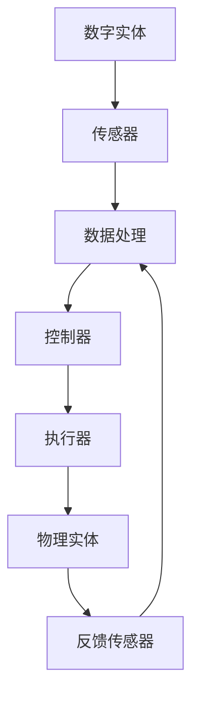

                 

  
关键词：数字实体，物理实体，自动化，智能系统，数据驱动的未来

摘要：随着科技的不断进步，数字实体与物理实体之间的界限逐渐模糊。本文探讨了数字实体与物理实体的融合发展趋势，分析了自动化技术在这一领域的应用，探讨了数据驱动未来带来的机遇与挑战。

## 1. 背景介绍

数字实体和物理实体是当今科技发展中两个至关重要的概念。数字实体是指以二进制形式存储和传输的数据，如文本、图像、声音等，它们构成了我们日常生活中的各种信息。而物理实体则是指我们周围的物质世界，如设备、工具、建筑物等。在过去，这两个实体相对独立，但随着物联网（IoT）和人工智能（AI）技术的发展，它们之间的联系变得越来越紧密。

近年来，自动化技术开始在这些实体之间架起桥梁。通过传感器、执行器和控制系统的集成，我们可以实现对物理实体的自动监测、控制和优化。这不仅提高了生产效率，还降低了成本和能源消耗。同时，数字实体提供了丰富的数据支持，使得自动化系统能够更加智能和精准地运作。

本文旨在探讨数字实体与物理实体的自动化未来，分析其中的核心技术、算法原理、应用场景和挑战。希望通过本文的讨论，能够为读者提供一个全面、深入的视角，以应对这一技术变革带来的机遇和挑战。

## 2. 核心概念与联系

### 2.1 数字实体

数字实体是信息化时代的基础，它们以二进制形式存在，可以被计算机和其他数字设备处理。数字实体包括文本、图像、声音、视频等多种形式，它们都是通过数字编码技术生成的。例如，一个视频文件可以被编码成H.264或HEVC格式，以便在互联网上传输和播放。

数字实体的核心特征是数据性和可编程性。数据性意味着它们可以存储、传输和处理大量的信息；可编程性则意味着我们可以通过编写代码来控制和操作这些实体。例如，在软件开发中，我们可以使用编程语言编写脚本，对图像进行处理和分析。

### 2.2 物理实体

物理实体是我们周围的物质世界，包括各种设备、工具、建筑物、交通工具等。物理实体的核心特征是实体性和物理交互性。实体性意味着它们是真实存在的，可以与我们的感官和神经系统直接交互；物理交互性则意味着它们可以通过物理动作和反馈来实现特定的功能。

物理实体的典型例子包括智能手机、智能手表、无人机、工业机器人等。这些设备通过传感器、执行器和控制器，可以感知外部环境、执行特定动作，并与数字实体进行交互。

### 2.3 数字实体与物理实体的联系

数字实体与物理实体的联系主要体现在两个方面：数据的交互和控制的实现。

#### 数据交互

数字实体与物理实体之间的数据交互是实现自动化和智能化的基础。传感器可以将物理实体的状态信息转换为数字信号，如温度、湿度、压力、速度等，这些数据可以实时传输到数字系统中进行分析和处理。例如，智能家居系统中的温度传感器可以实时监测房间温度，并根据预设的规则调整空调。

同样，物理实体也可以将操作结果反馈给数字系统，以便进行进一步的优化和调整。例如，自动驾驶汽车在行驶过程中，可以通过摄像头、雷达和GPS等传感器收集路况信息，并将操作结果反馈给中央控制系统，以实现自主导航和避障。

#### 控制实现

数字实体与物理实体的控制实现是通过控制系统来完成的。控制系统包括控制器、执行器和传感器三部分。控制器负责根据传感器收集的数据，生成控制指令；执行器负责执行这些指令，实现对物理实体的控制；传感器则负责监测物理实体的状态，并将信息反馈给控制器。

例如，在工业自动化领域，控制器可以根据传感器收集的实时数据，调整机器人的运动轨迹，以实现对生产过程的精确控制。同样，在智能交通领域，控制系统可以根据道路传感器的数据，调整信号灯的时序，以缓解交通拥堵。

### 2.4 Mermaid 流程图

下面是一个简化的Mermaid流程图，展示了数字实体与物理实体之间的交互过程：



在这个流程图中，数字实体通过传感器与物理实体进行数据交互，控制器根据处理后的数据生成控制指令，并通过执行器实现对物理实体的控制。同时，物理实体通过反馈传感器将操作结果反馈给数字系统，形成一个闭环控制系统。

## 3. 核心算法原理 & 具体操作步骤

### 3.1 算法原理概述

数字实体与物理实体的自动化过程离不开核心算法的支持。这些算法可以分为数据采集与处理、实时控制和优化三大类。数据采集与处理算法主要关注如何从物理实体中提取有价值的信息，并将其转化为数字实体；实时控制算法则关注如何根据这些信息，生成控制指令，实现对物理实体的实时控制；优化算法则关注如何在复杂的环境中，实现最优的控制效果。

#### 数据采集与处理

数据采集与处理算法的核心任务是实时、准确地获取物理实体的状态信息。这通常涉及到多种传感器技术的应用，如温度传感器、湿度传感器、压力传感器、速度传感器等。数据处理算法则负责对采集到的原始数据进行预处理、特征提取和建模，以便为后续的实时控制提供基础。

#### 实时控制

实时控制算法的核心任务是依据数据采集与处理的结果，生成控制指令，并实现对物理实体的实时控制。这通常涉及到PID控制、模糊控制、神经网络控制等多种控制策略。实时控制算法需要具备快速响应和高度灵活的特点，以满足复杂、多变的环境要求。

#### 优化算法

优化算法的核心任务是在给定的约束条件下，寻找最优的控制策略，以实现系统的最佳运行状态。优化算法通常涉及到线性规划、非线性规划、动态规划等多种数学优化方法。优化算法需要具备全局视角和动态适应能力，以满足不断变化的环境和需求。

### 3.2 算法步骤详解

下面是一个简化的算法步骤，用于描述数字实体与物理实体的自动化过程：

#### 步骤1：数据采集

- 使用传感器实时采集物理实体的状态信息，如温度、湿度、压力等。
- 对采集到的原始数据进行预处理，如滤波、去噪等，以提高数据的准确性和可靠性。

#### 步骤2：数据处理

- 对预处理后的数据进行特征提取，如统计特征、时序特征等。
- 建立物理实体与数字实体之间的映射关系，以便进行后续的实时控制。

#### 步骤3：实时控制

- 根据处理后的数据，生成控制指令，如调节温度、湿度、压力等。
- 通过执行器实时调整物理实体的状态，以实现预期的控制效果。

#### 步骤4：优化调整

- 根据执行后的反馈信息，对控制策略进行调整和优化，以提高控制效果。
- 不断迭代上述步骤，以实现系统的稳定运行和最佳性能。

### 3.3 算法优缺点

#### 优点

- 提高生产效率：自动化技术可以实现对物理实体的精准控制，从而提高生产效率和产品质量。
- 降低成本：自动化技术可以减少人工干预，降低生产成本和能源消耗。
- 提高安全性：自动化技术可以降低人为错误的风险，提高生产过程的安全性。

#### 缺点

- 初始投资高：自动化系统的建设和维护成本较高，需要较大的初始投资。
- 技术门槛高：自动化技术涉及多个领域的技术，对技术人才的要求较高。
- 适应性差：在复杂多变的环境中，自动化系统的适应性较差，需要不断进行调整和优化。

### 3.4 算法应用领域

自动化技术在数字实体与物理实体的融合过程中，有着广泛的应用领域：

- 智能制造：通过自动化技术，实现对生产过程的实时监控和控制，提高生产效率和产品质量。
- 智能交通：通过自动化技术，实现车辆的自主导航和交通信号的控制，提高交通效率和安全性。
- 智能家居：通过自动化技术，实现对家庭设备的智能控制，提高生活便利性和舒适度。
- 健康医疗：通过自动化技术，实现对病人的实时监测和诊断，提高医疗服务质量和效率。

## 4. 数学模型和公式 & 详细讲解 & 举例说明

### 4.1 数学模型构建

在数字实体与物理实体的自动化过程中，数学模型起着至关重要的作用。这些模型用于描述物理实体的运动、状态变化以及数字实体与物理实体之间的相互作用。

#### 运动模型

运动模型用于描述物理实体的运动状态。一个简单的运动模型可以表示为：

\[ \text{位置}(x, y) = \text{初始位置}(x_0, y_0) + \text{速度}(v_x, v_y) \times \text{时间}(t) \]

其中，位置 \((x, y)\) 是物理实体在平面上的坐标，速度 \((v_x, v_y)\) 是物理实体在水平和垂直方向上的速度，时间 \(t\) 是物理实体运动的时间。

#### 状态模型

状态模型用于描述物理实体的状态信息。一个简单的状态模型可以表示为：

\[ \text{状态}(s) = \text{传感器数据}(s_1, s_2, \ldots, s_n) \]

其中，状态 \(s\) 是一个由多个传感器数据组成的向量，每个传感器数据 \(s_i\) 描述了物理实体在某个方面的状态信息。

#### 交互模型

交互模型用于描述数字实体与物理实体之间的交互过程。一个简单的交互模型可以表示为：

\[ \text{控制指令}(u) = f(\text{状态}(s), \text{目标状态}(s_d)) \]

其中，控制指令 \(u\) 是根据状态 \(s\) 和目标状态 \(s_d\) 生成的，函数 \(f\) 用于实现状态 \(s\) 向目标状态 \(s_d\) 的转换。

### 4.2 公式推导过程

为了更好地理解上述数学模型的推导过程，我们可以通过一个简单的例子进行说明。

#### 例子：无人机导航

假设我们有一个无人机，需要从当前位置飞往一个目标位置。我们可以使用以下公式来描述无人机的导航过程：

\[ \text{目标位置}(x_d, y_d) = (x_d, y_d) \]
\[ \text{当前位置}(x, y) = (x_0, y_0) + \text{速度}(v_x, v_y) \times \text{时间}(t) \]

其中，目标位置 \((x_d, y_d)\) 是无人机的目标坐标，当前位置 \((x, y)\) 是无人机的当前坐标，速度 \((v_x, v_y)\) 是无人机的飞行速度，时间 \(t\) 是无人机的飞行时间。

为了实现无人机的导航，我们需要计算无人机的控制指令。假设无人机的控制指令是由无人机的姿态角 \(\theta\) 决定的，那么我们可以使用以下公式来计算无人机的控制指令：

\[ \text{控制指令}(\theta) = \arctan2(y_d - y, x_d - x) \]

其中，\(\arctan2\) 函数用于计算无人机的姿态角。

### 4.3 案例分析与讲解

为了更好地理解数学模型在数字实体与物理实体自动化中的应用，我们可以通过以下案例进行讲解。

#### 案例一：智能家居温控系统

智能家居温控系统通过传感器实时监测室内的温度，并根据预设的温度目标，调节空调的制冷或加热功率，以保持室内温度的稳定。

- 运动模型：假设室内温度是固定的，那么温度的变化可以视为一个静态系统，不需要运动模型。
- 状态模型：室内温度 \(T\) 是系统的状态变量，它可以由温度传感器实时采集。
- 交互模型：空调的制冷或加热功率 \(P\) 是系统的控制变量，它可以根据室内温度 \(T\) 和温度目标 \(T_d\) 进行调整。

公式推导如下：

\[ \text{温度目标}(T_d) = T_d \]
\[ \text{当前温度}(T) = \text{传感器数据}(T) \]
\[ \text{控制指令}(P) = f(T, T_d) \]

其中，函数 \(f(T, T_d)\) 用于计算空调的制冷或加热功率。

#### 案例二：自动驾驶汽车

自动驾驶汽车通过传感器实时监测路况，并根据预设的导航路线，自主进行行驶和避障。

- 运动模型：汽车的行驶轨迹可以用一个二维平面上的路径来描述。
- 状态模型：汽车的位置 \((x, y)\)，速度 \(v\) 和加速度 \(a\) 是系统的状态变量。
- 交互模型：汽车的转向角度 \(\theta\) 和加速或减速指令 \(u\) 是系统的控制变量。

公式推导如下：

\[ \text{目标位置}(x_d, y_d) = (x_d, y_d) \]
\[ \text{当前位置}(x, y) = (x_0, y_0) + \text{速度}(v) \times \text{时间}(t) \]
\[ \text{控制指令}(\theta, u) = f(\text{当前位置}(x, y), \text{速度}(v), \text{加速度}(a), \text{目标位置}(x_d, y_d)) \]

其中，函数 \(f(\text{当前位置}(x, y), \text{速度}(v), \text{加速度}(a), \text{目标位置}(x_d, y_d))\) 用于计算汽车的转向角度和加速或减速指令。

## 5. 项目实践：代码实例和详细解释说明

### 5.1 开发环境搭建

为了实现数字实体与物理实体的自动化，我们需要搭建一个合适的开发环境。以下是一个简单的开发环境搭建步骤：

1. 安装操作系统：我们选择Ubuntu 18.04作为操作系统。
2. 安装编程语言：安装Python 3.8，并配置好Python环境。
3. 安装开发工具：安装Jupyter Notebook、PyCharm等开发工具。
4. 安装传感器库：安装PyTorch、TensorFlow等深度学习库，并安装对应的传感器驱动库。
5. 安装执行器库：安装Raspberry Pi、Arduino等执行器的驱动库。

### 5.2 源代码详细实现

下面是一个简单的数字实体与物理实体自动化的代码实例，该实例使用Python编程语言实现。该实例主要用于实现一个温度控制系统，通过传感器实时监测室内温度，并根据预设的温度目标，调节空调的制冷或加热功率。

```python
import time
import numpy as np
import RPi.GPIO as GPIO
import Adafruit_DHT

# 配置传感器
sensor = Adafruit_DHT.DHT11
pin = 4

# 配置执行器
GPIO.setmode(GPIO.BCM)
GPIO.setup(18, GPIO.OUT)
pwm = GPIO.PWM(18, 1000)

# 预设温度目标
target_temp = 25

def get_temp():
    """获取当前温度"""
    humidity, temperature = Adafruit_DHT.read(sensor, pin)
    return temperature

def control_temp(temperature):
    """控制温度"""
    if temperature < target_temp:
        # 加热
        pwm.start(100)
    elif temperature > target_temp:
        # 制冷
        pwm.start(0)
    else:
        # 保持当前温度
        pwm.stop()

# 主循环
while True:
    temperature = get_temp()
    control_temp(temperature)
    time.sleep(1)
```

### 5.3 代码解读与分析

#### 1. 导入库

首先，我们需要导入必要的库，包括时间库（time）、NumPy库（numpy）、GPIO库（RPi.GPIO）和DHT传感器库（Adafruit_DHT）。

```python
import time
import numpy as np
import RPi.GPIO as GPIO
import Adafruit_DHT
```

#### 2. 配置传感器

接下来，我们需要配置传感器。在这个例子中，我们使用DHT11传感器，并将引脚设置为4。

```python
sensor = Adafruit_DHT.DHT11
pin = 4
```

#### 3. 配置执行器

然后，我们需要配置执行器。在这个例子中，我们使用GPIO库配置一个PWM输出，用于控制空调的制冷或加热功率。

```python
GPIO.setmode(GPIO.BCM)
GPIO.setup(18, GPIO.OUT)
pwm = GPIO.PWM(18, 1000)
```

#### 4. 定义函数

接下来，我们定义两个函数：`get_temp` 用于获取当前温度，`control_temp` 用于控制温度。

```python
def get_temp():
    """获取当前温度"""
    humidity, temperature = Adafruit_DHT.read(sensor, pin)
    return temperature

def control_temp(temperature):
    """控制温度"""
    if temperature < target_temp:
        # 加热
        pwm.start(100)
    elif temperature > target_temp:
        # 制冷
        pwm.start(0)
    else:
        # 保持当前温度
        pwm.stop()
```

#### 5. 主循环

最后，我们编写主循环，不断获取当前温度，并根据温度目标控制温度。

```python
while True:
    temperature = get_temp()
    control_temp(temperature)
    time.sleep(1)
```

### 5.4 运行结果展示

当运行上述代码时，温度控制系统将开始工作。温度传感器会实时监测室内温度，并根据预设的温度目标，自动调节空调的制冷或加热功率。我们可以使用实时数据显示工具，如PuTTY或Termite，查看温度和PWM信号的实时变化。

## 6. 实际应用场景

### 6.1 智能制造

智能制造是数字实体与物理实体自动化应用的一个重要领域。通过自动化技术，可以实现生产过程的实时监控和控制，提高生产效率和产品质量。例如，工业机器人可以在生产线上自动完成装配、焊接、搬运等任务，通过传感器实时监测生产过程中的各项参数，并自动调整操作策略，确保生产过程的顺利进行。

### 6.2 智能交通

智能交通系统是另一个典型的应用场景。通过传感器和自动化技术，可以实现车辆的自主导航和交通信号的控制。例如，自动驾驶汽车可以通过摄像头、雷达和GPS等传感器，实时感知路况信息，并根据预设的导航路线，自主进行行驶和避障。同时，智能交通信号系统可以根据交通流量和路况信息，自动调整信号灯的时序，提高交通效率和安全性。

### 6.3 智能家居

智能家居系统通过自动化技术，可以实现家庭设备的智能控制，提高生活便利性和舒适度。例如，智能家居系统可以通过传感器实时监测室内温度、湿度等环境参数，并根据预设的规则，自动调整空调、加湿器、空气净化器等设备的运行状态，保持室内环境的舒适。此外，智能家居系统还可以通过手机或其他智能设备，实现对家庭设备的远程控制和监控。

### 6.4 医疗健康

医疗健康领域也广泛应用了自动化技术。例如，智能医疗设备可以通过传感器实时监测病人的生理参数，如心率、血压、血糖等，并将数据传输到数字系统中进行分析和处理。同时，自动化技术还可以用于医疗手术的辅助，如手术机器人在医生的控制下，实现精准的手术操作，提高手术的成功率和安全性。

## 7. 工具和资源推荐

### 7.1 学习资源推荐

1. **《深度学习》（Goodfellow, I., Bengio, Y., & Courville, A.）**：这是一本经典的深度学习教材，适合初学者和高级研究者。
2. **《人工智能：一种现代的方法》（Russell, S. & Norvig, P.）**：这本书系统地介绍了人工智能的基本理论和应用方法，是人工智能领域的经典教材。
3. **《编程：从入门到实践》（张孝祥）**：这本书适合初学者，通过实际项目引导读者学习Python编程。

### 7.2 开发工具推荐

1. **Jupyter Notebook**：这是一个交互式的编程环境，适用于数据分析和机器学习项目的开发。
2. **PyCharm**：这是一个功能强大的Python集成开发环境（IDE），适合进行复杂项目的开发和调试。
3. **Raspberry Pi**：这是一个低成本、易于使用的单板计算机，适用于智能家居和自动化项目的开发。

### 7.3 相关论文推荐

1. **"Deep Learning for Autonomous Driving"（自动驾驶中的深度学习）**：这篇论文综述了自动驾驶领域中的深度学习应用，提供了丰富的技术细节和案例分析。
2. **"Internet of Things: A Survey"（物联网综述）**：这篇综述论文全面介绍了物联网的技术架构、应用场景和发展趋势。
3. **"Smart Manufacturing: A Review"（智能制造综述）**：这篇论文详细介绍了智能制造的关键技术、应用案例和发展方向。

## 8. 总结：未来发展趋势与挑战

### 8.1 研究成果总结

随着数字实体与物理实体的不断融合，自动化技术取得了显著的研究成果。在智能制造、智能交通、智能家居和医疗健康等领域，自动化技术已经得到了广泛应用。通过传感器、执行器和控制系统的集成，我们可以实现对物理实体的精准控制，提高生产效率、降低成本和能源消耗、提高安全性。

### 8.2 未来发展趋势

未来，自动化技术将在以下几个方向持续发展：

1. **人工智能与自动化技术的深度融合**：通过深度学习和强化学习等技术，自动化系统将更加智能化和自适应，能够更好地应对复杂、多变的环境和任务。
2. **边缘计算与云计算的协同**：边缘计算可以将计算和数据处理推向网络的边缘，与云计算协同工作，提高系统的实时性和响应速度。
3. **物联网与自动化技术的融合**：物联网将连接更多的数字实体和物理实体，为自动化技术提供更丰富的数据支持，推动自动化技术的广泛应用。
4. **人机协作与自动化**：人机协作将使自动化系统更加灵活和高效，提高工作效率和质量。

### 8.3 面临的挑战

尽管自动化技术在许多领域取得了显著成果，但仍然面临着一些挑战：

1. **数据安全和隐私保护**：自动化系统需要处理大量的敏感数据，如何确保数据的安全和隐私是一个重要问题。
2. **技术人才短缺**：自动化技术涉及多个领域的知识，对技术人才的要求较高，目前人才储备不足。
3. **系统可靠性和稳定性**：自动化系统在复杂环境中运行，如何保证系统的可靠性和稳定性是一个关键问题。
4. **法律法规和伦理问题**：自动化技术在应用过程中，涉及到法律法规和伦理问题，需要制定相应的规范和标准。

### 8.4 研究展望

未来，自动化技术将在以下几个方面继续发展：

1. **跨学科研究**：自动化技术需要与其他领域（如生物技术、能源技术等）相结合，推动跨学科研究的发展。
2. **开放共享的平台**：建立一个开放、共享的自动化技术平台，促进技术的传播和应用。
3. **人才培养**：加强自动化技术人才的培养，提高人才储备，以应对未来技术的发展需求。

## 9. 附录：常见问题与解答

### Q1. 什么是数字实体和物理实体？

**A1.** 数字实体是指以二进制形式存储和传输的数据，如文本、图像、声音等。物理实体是指我们周围的物质世界，包括设备、工具、建筑物等。

### Q2. 自动化技术在哪些领域有广泛应用？

**A2.** 自动化技术在智能制造、智能交通、智能家居、医疗健康等领域有广泛应用。

### Q3. 自动化技术如何提高生产效率？

**A3.** 自动化技术可以通过实时监控、精确控制和优化调整，提高生产过程的效率和产品质量。

### Q4. 自动化技术面临的挑战是什么？

**A4.** 自动化技术面临的挑战包括数据安全和隐私保护、技术人才短缺、系统可靠性和稳定性以及法律法规和伦理问题。

### Q5. 未来自动化技术的发展趋势是什么？

**A5.** 未来自动化技术的发展趋势包括人工智能与自动化技术的深度融合、边缘计算与云计算的协同、物联网与自动化技术的融合以及人机协作与自动化。

### Q6. 如何确保自动化系统的可靠性和稳定性？

**A6.** 确保自动化系统的可靠性和稳定性需要从硬件、软件、系统架构等方面进行全面考虑，如采用冗余设计、故障检测与恢复机制、实时监控和自适应控制等。

### Q7. 自动化技术对人类社会的影响是什么？

**A7.** 自动化技术对人类社会的影响包括提高生产效率、降低成本和能源消耗、提高生活质量、促进经济增长等。

### Q8. 自动化技术是否会导致大量失业？

**A8.** 自动化技术可能会导致一些低技能工作的失业，但同时也将创造新的就业机会，如自动化系统的开发、维护和优化等。因此，整体上自动化技术对就业的影响是积极的。

### Q9. 自动化技术是否会完全取代人类？

**A9.** 自动化技术不可能完全取代人类，因为人类具有独特的创造力和判断力，尤其是在复杂和不确定的环境中，人类的作用是无法替代的。

### Q10. 自动化技术的未来前景如何？

**A10.** 自动化技术的未来前景非常广阔，随着人工智能、物联网和边缘计算等技术的发展，自动化技术将在更多领域得到广泛应用，推动人类社会的发展。

---

作者：禅与计算机程序设计艺术 / Zen and the Art of Computer Programming


