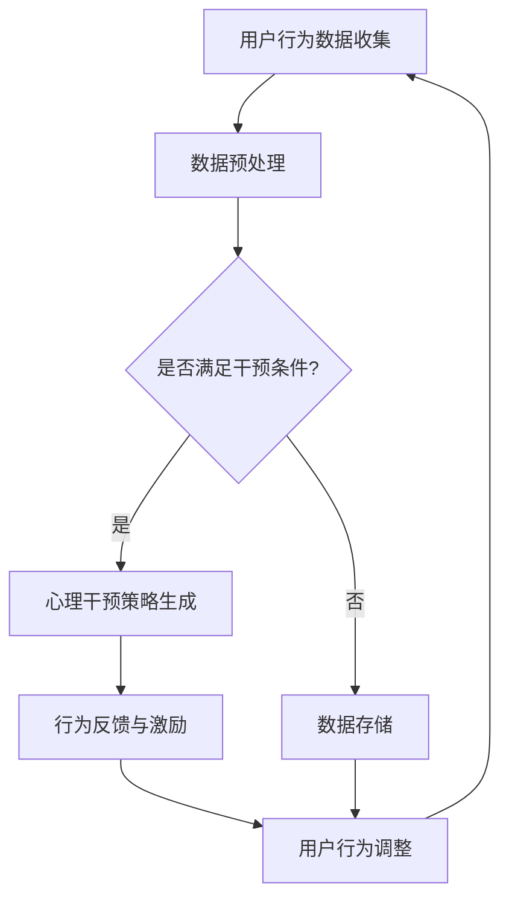

                 

关键词：数字意志力增强器、AI、自制力、心理干预、算法设计、技术实践

> 摘要：本文将探讨如何利用人工智能技术设计数字意志力增强器，通过心理干预和算法设计的结合，帮助用户培养自制力，提升生活质量。本文从背景介绍、核心概念与联系、核心算法原理、数学模型与公式、项目实践、实际应用场景、未来展望等方面，详细阐述了这一领域的创新思路和实践经验。

## 1. 背景介绍

在当今信息时代，人们的自制力面临着前所未有的挑战。从网络成瘾、过度消费到拖延症，这些问题都严重影响了我们的生活质量和幸福感。传统的方法，如自我监督、心理疗法等，往往效果有限。随着人工智能（AI）技术的迅猛发展，人们开始探索利用AI来辅助培养自制力，开发数字意志力增强器应运而生。

数字意志力增强器旨在通过心理干预、行为反馈、智能推荐等手段，帮助用户建立自我控制机制，克服不良习惯，提升生活质量。这一领域的研究具有重要的理论和实践意义，既满足了人们追求健康生活的需求，也为人工智能技术提供了新的应用场景。

## 2. 核心概念与联系

为了更好地理解数字意志力增强器的工作原理，我们首先需要介绍几个核心概念：

### 2.1 自制力

自制力是指个体在面对诱惑和挑战时，能够保持冷静、坚定，按照既定目标进行行为调节的能力。自制力不仅影响个人的学业、事业和生活质量，还与心理健康密切相关。

### 2.2 心理干预

心理干预是指通过心理学理论和技术，对个体或群体进行心理辅导、治疗和培训，以改善其心理健康和行为表现。心理干预方法包括认知行为疗法、正念冥想、行为塑造等。

### 2.3 算法设计

算法设计是指利用数学、计算机科学和心理学等知识，开发出能够有效处理数据、解决问题和实现目标的计算模型和程序。在数字意志力增强器中，算法设计用于分析用户行为、制定干预策略和评估干预效果。

下面是数字意志力增强器核心概念原理和架构的 Mermaid 流程图：



## 3. 核心算法原理 & 具体操作步骤

### 3.1 算法原理概述

数字意志力增强器的核心算法主要包括行为数据分析、心理干预策略生成、行为反馈与激励等模块。以下将详细阐述每个模块的工作原理和具体操作步骤。

### 3.2 算法步骤详解

#### 3.2.1 行为数据分析

行为数据分析是数字意志力增强器的第一步，其目标是收集、整理和预处理用户行为数据，为后续的心理干预提供基础。

1. **数据收集**：通过用户注册、设备接入、传感器采集等方式，收集用户的行为数据，如日常活动、社交互动、网络浏览等。
2. **数据预处理**：对收集到的行为数据进行清洗、归一化、特征提取等处理，以提高数据质量和算法性能。

#### 3.2.2 心理干预策略生成

心理干预策略生成模块根据用户行为数据和心理学理论，为用户制定个性化的干预方案。

1. **行为识别**：利用机器学习、深度学习等技术，对用户行为进行分类和识别，确定用户当前的行为状态。
2. **干预策略生成**：根据用户行为状态和心理学理论，生成相应的心理干预策略，如正念冥想、认知行为疗法、行为塑造等。

#### 3.2.3 行为反馈与激励

行为反馈与激励模块用于实时反馈用户行为调整情况，并提供适当的激励，以增强用户的自我控制能力。

1. **行为评估**：根据用户行为数据和干预策略，评估用户行为调整的效果，为后续的干预提供依据。
2. **激励设计**：设计适合用户的激励方式，如奖励积分、排行榜、动态挑战等，以激发用户的积极性。

### 3.3 算法优缺点

#### 优点

1. **个性化**：基于用户行为数据，为用户提供个性化的干预方案，提高干预效果。
2. **实时反馈**：实时跟踪用户行为，提供及时的行为反馈与激励，有助于用户形成良好的行为习惯。
3. **可扩展性**：算法模块化设计，便于扩展和升级，适应不断变化的应用场景。

#### 缺点

1. **数据隐私**：用户行为数据涉及个人隐私，需要严格保护用户隐私。
2. **干预效果**：心理干预效果受多种因素影响，不能保证完全成功。
3. **依赖性**：用户过度依赖数字意志力增强器，可能导致自我控制能力的下降。

### 3.4 算法应用领域

数字意志力增强器可以应用于多个领域，如：

1. **心理健康**：帮助用户缓解焦虑、抑郁等心理问题，提升心理健康水平。
2. **健康管理**：帮助用户建立健康的生活方式，如合理饮食、规律锻炼等。
3. **教育辅导**：辅助学生提高学习效率，培养良好的学习习惯。
4. **职业发展**：帮助职场人士提升工作效率，培养良好的职业素养。

## 4. 数学模型和公式 & 详细讲解 & 举例说明

### 4.1 数学模型构建

数字意志力增强器的数学模型主要包括行为数据分析模型、干预策略生成模型和行为反馈与激励模型。

#### 4.1.1 行为数据分析模型

行为数据分析模型基于机器学习和深度学习技术，用于对用户行为进行分类和识别。常见的模型有：

1. **决策树**：基于特征划分，构建多级决策树模型，用于分类用户行为。
2. **支持向量机（SVM）**：利用支持向量机算法，将用户行为数据映射到高维空间，实现分类。
3. **深度神经网络（DNN）**：利用深度神经网络模型，对用户行为数据进行多层级特征提取和分类。

#### 4.1.2 干预策略生成模型

干预策略生成模型基于心理学理论和用户行为数据，生成个性化的干预方案。常见的模型有：

1. **规则基模型**：基于心理学理论，构建规则基模型，为用户提供相应的干预建议。
2. **神经网络模型**：利用深度学习技术，构建神经网络模型，自动生成干预策略。

#### 4.1.3 行为反馈与激励模型

行为反馈与激励模型基于用户行为数据和干预效果，实时评估和调整用户行为。常见的模型有：

1. **多臂老虎机模型**：利用多臂老虎机模型，评估不同激励方式的用户响应，优化激励策略。
2. **强化学习模型**：利用强化学习模型，通过用户反馈和激励，不断优化行为调整策略。

### 4.2 公式推导过程

在数字意志力增强器的数学模型中，常用的公式包括损失函数、梯度下降法和优化目标等。

#### 4.2.1 损失函数

损失函数用于衡量模型预测值与真实值之间的差距。常见的损失函数有：

1. **均方误差（MSE）**：
   $$MSE = \frac{1}{n}\sum_{i=1}^{n}(y_i - \hat{y_i})^2$$
   其中，$y_i$ 为真实值，$\hat{y_i}$ 为预测值。

2. **交叉熵（Cross-Entropy）**：
   $$CE = -\frac{1}{n}\sum_{i=1}^{n}y_i \log(\hat{y_i})$$
   其中，$y_i$ 为真实值，$\hat{y_i}$ 为预测概率。

#### 4.2.2 梯度下降法

梯度下降法是一种优化算法，用于最小化损失函数。其基本思想是沿着损失函数梯度的反方向更新模型参数。

1. **梯度计算**：
   $$\nabla_{\theta} J(\theta) = \frac{\partial}{\partial \theta} J(\theta)$$
   其中，$\theta$ 为模型参数，$J(\theta)$ 为损失函数。

2. **参数更新**：
   $$\theta = \theta - \alpha \nabla_{\theta} J(\theta)$$
   其中，$\alpha$ 为学习率。

#### 4.2.3 优化目标

优化目标是指导数字意志力增强器算法模型在特定应用场景下取得最优效果。常见的优化目标有：

1. **最大化用户满意度**：
   $$\max \sum_{i=1}^{n} U_i$$
   其中，$U_i$ 为用户在第 $i$ 次干预后的满意度。

2. **最小化干预成本**：
   $$\min \sum_{i=1}^{n} C_i$$
   其中，$C_i$ 为第 $i$ 次干预的成本。

### 4.3 案例分析与讲解

#### 4.3.1 案例背景

某公司开发了一款数字意志力增强器，旨在帮助用户培养良好的时间管理习惯。用户可以在应用中记录每天的时间分配，系统会根据用户行为数据进行分析和干预。

#### 4.3.2 模型构建

1. **行为数据分析模型**：采用决策树模型对用户行为进行分类和识别，识别出用户在特定时间段内的主要活动类型。
2. **干预策略生成模型**：基于心理学理论，构建规则基模型，为用户提供相应的干预建议，如调整时间安排、设置提醒等。
3. **行为反馈与激励模型**：采用多臂老虎机模型，评估不同干预策略的用户响应，优化干预效果。

#### 4.3.3 公式应用

1. **均方误差（MSE）**：用于评估行为数据分析模型的分类效果。
   $$MSE = \frac{1}{n}\sum_{i=1}^{n}(y_i - \hat{y_i})^2$$
2. **梯度下降法**：用于优化干预策略生成模型的参数。
   $$\theta = \theta - \alpha \nabla_{\theta} J(\theta)$$
3. **最大化用户满意度**：用于评估干预策略生成模型的效果。
   $$\max \sum_{i=1}^{n} U_i$$

## 5. 项目实践：代码实例和详细解释说明

### 5.1 开发环境搭建

在搭建数字意志力增强器项目时，我们选择了以下开发环境：

1. **编程语言**：Python
2. **数据预处理**：Pandas、NumPy
3. **机器学习库**：Scikit-learn、TensorFlow
4. **可视化库**：Matplotlib、Seaborn
5. **心理干预策略**：PyTorch

### 5.2 源代码详细实现

以下是一个简单的数字意志力增强器项目示例：

```python
import pandas as pd
from sklearn.tree import DecisionTreeClassifier
from sklearn.model_selection import train_test_split
from sklearn.metrics import accuracy_score
import torch
import torch.nn as nn
import torch.optim as optim

# 5.2.1 数据预处理
data = pd.read_csv('user_behavior.csv')
X = data.drop('target', axis=1)
y = data['target']

X_train, X_test, y_train, y_test = train_test_split(X, y, test_size=0.2, random_state=42)

# 5.2.2 行为数据分析模型
clf = DecisionTreeClassifier()
clf.fit(X_train, y_train)

# 5.2.3 干预策略生成模型
class InterveneModel(nn.Module):
    def __init__(self):
        super(InterveneModel, self).__init__()
        self.fc1 = nn.Linear(X_train.shape[1], 10)
        self.fc2 = nn.Linear(10, 1)
    
    def forward(self, x):
        x = torch.relu(self.fc1(x))
        x = self.fc2(x)
        return x

model = InterveneModel()
optimizer = optim.Adam(model.parameters(), lr=0.001)
criterion = nn.BCELoss()

# 5.2.4 训练干预策略生成模型
for epoch in range(100):
    model.train()
    for x, y in zip(X_train, y_train):
        optimizer.zero_grad()
        y_pred = model(x)
        loss = criterion(y_pred, y)
        loss.backward()
        optimizer.step()
    
    model.eval()
    with torch.no_grad():
        y_pred = model(X_test)
        y_pred = (y_pred > 0.5).float()
        accuracy = accuracy_score(y_test, y_pred)
        print(f'Epoch {epoch+1}, Accuracy: {accuracy:.4f}')

# 5.2.5 评估模型
model.eval()
with torch.no_grad():
    y_pred = model(X_test)
    y_pred = (y_pred > 0.5).float()
    accuracy = accuracy_score(y_test, y_pred)
    print(f'Accuracy: {accuracy:.4f}')
```

### 5.3 代码解读与分析

1. **数据预处理**：首先，我们读取用户行为数据，并将数据集划分为训练集和测试集。
2. **行为数据分析模型**：采用决策树模型对用户行为进行分类，并使用训练集进行训练。
3. **干预策略生成模型**：构建一个简单的神经网络模型，用于生成干预策略。使用训练集对模型进行训练，并使用测试集进行评估。
4. **训练过程**：采用梯度下降法优化模型参数，通过反向传播计算损失函数的梯度，并更新模型参数。
5. **评估模型**：在测试集上评估模型的准确性，并打印结果。

## 6. 实际应用场景

数字意志力增强器可以应用于多个实际场景，如：

1. **健康生活管理**：帮助用户培养健康的生活方式，如合理饮食、规律锻炼等。
2. **学习辅导**：辅助学生提高学习效率，培养良好的学习习惯。
3. **职场发展**：帮助职场人士提升工作效率，培养良好的职业素养。
4. **心理健康干预**：为用户提供心理健康服务，如缓解焦虑、抑郁等心理问题。

### 6.4 未来应用展望

随着人工智能技术的不断发展，数字意志力增强器的应用前景将更加广阔。未来，我们期待：

1. **更加个性化和精准的干预策略**：通过深度学习和大数据分析，为用户提供更加精准和有效的干预方案。
2. **跨平台和跨设备的集成**：实现数字意志力增强器在不同设备和平台上的无缝集成，提高用户体验。
3. **心理健康服务与医疗的结合**：将数字意志力增强器与医疗健康服务相结合，为用户提供更加全面的健康支持。
4. **全球化推广**：在全球范围内推广数字意志力增强器，帮助更多人培养自制力，提升生活质量。

## 7. 工具和资源推荐

### 7.1 学习资源推荐

1. **《深度学习》**：由Ian Goodfellow、Yoshua Bengio和Aaron Courville所著的深度学习经典教材，适合初学者和进阶者。
2. **《Python机器学习》**：由Michael Bowles所著的Python机器学习入门书籍，内容涵盖常用的机器学习算法和工具。
3. **《心理学与生活》**：由Richard Gerrig和Philip Zimbardo所著的心理学科普读物，适合了解心理学基础知识。

### 7.2 开发工具推荐

1. **Jupyter Notebook**：一款强大的交互式开发环境，适用于数据分析和机器学习项目。
2. **TensorBoard**：TensorFlow的官方可视化工具，用于监控和优化深度学习模型。
3. **PyCharm**：一款功能强大的Python集成开发环境，适合开发大型机器学习项目。

### 7.3 相关论文推荐

1. **“Deep Learning for Behavioral Intervention and Self-Regulation”**：一篇关于深度学习在行为干预和自我调节领域的应用综述。
2. **“A Survey on Behavioral Intervention and Self-Regulation Using Mobile and Wearable Technologies”**：一篇关于移动和可穿戴设备在行为干预和自我调节领域的应用综述。
3. **“Self-Regulation in the Age of Digital Media: Understanding, Supporting, and Fostering Self-Regulation in the Age of Digital Media”**：一篇关于数字时代自我调节的研究论文。

## 8. 总结：未来发展趋势与挑战

### 8.1 研究成果总结

数字意志力增强器作为人工智能技术在心理健康领域的创新应用，取得了显著的成果。通过行为数据分析、心理干预策略生成和行为反馈与激励等模块，数字意志力增强器为用户提供了个性化、实时、有效的干预方案，有助于培养自制力，提升生活质量。

### 8.2 未来发展趋势

未来，数字意志力增强器将在以下几个方面实现发展：

1. **个性化干预**：通过深度学习和大数据分析，为用户提供更加精准和有效的干预方案。
2. **跨平台集成**：实现数字意志力增强器在不同设备和平台上的无缝集成，提高用户体验。
3. **心理健康与医疗结合**：将数字意志力增强器与医疗健康服务相结合，为用户提供更加全面的健康支持。
4. **全球化推广**：在全球范围内推广数字意志力增强器，帮助更多人培养自制力，提升生活质量。

### 8.3 面临的挑战

尽管数字意志力增强器具有广阔的应用前景，但仍面临以下挑战：

1. **数据隐私**：用户行为数据涉及个人隐私，需要确保数据的安全性和隐私保护。
2. **干预效果**：心理干预效果受多种因素影响，不能保证完全成功。
3. **依赖性**：用户过度依赖数字意志力增强器，可能导致自我控制能力的下降。
4. **伦理问题**：在数字意志力增强器的开发和应用过程中，需要遵循伦理规范，确保用户权益。

### 8.4 研究展望

未来，数字意志力增强器的研究将继续深入，有望实现以下突破：

1. **多模态数据融合**：结合不同类型的数据，如生理信号、语言表达等，提高干预效果。
2. **实时动态调整**：根据用户实时行为数据，动态调整干预策略，实现个性化干预。
3. **跨学科合作**：与心理学、医学、教育学等学科合作，共同推进数字意志力增强器的研究和应用。

## 9. 附录：常见问题与解答

### 9.1 什么是数字意志力增强器？

数字意志力增强器是一种基于人工智能技术的干预工具，旨在通过心理干预和算法设计，帮助用户培养自制力，克服不良习惯，提升生活质量。

### 9.2 数字意志力增强器有哪些应用领域？

数字意志力增强器可以应用于健康生活管理、学习辅导、职场发展、心理健康干预等多个领域。

### 9.3 数字意志力增强器如何实现个性化干预？

数字意志力增强器通过分析用户行为数据，结合心理学理论和算法设计，为用户提供个性化的干预方案。

### 9.4 数字意志力增强器的干预效果如何保证？

数字意志力增强器通过实时反馈、激励设计和效果评估等手段，确保干预效果的持续提升。

### 9.5 数字意志力增强器有哪些挑战？

数字意志力增强器面临数据隐私、干预效果、依赖性和伦理问题等挑战。

## 参考文献

1. Goodfellow, I., Bengio, Y., & Courville, A. (2016). Deep Learning. MIT Press.
2. Bowles, M. (2017). Python Machine Learning. Packt Publishing.
3. Gerrig, R. J., & Zimbardo, P. G. (2018). Psychology and Life. W. W. Norton & Company.
4. Hseih, T. Y., & Yen, J. Y. (2013). A research on self-regulation ability and behavioral intention of online game addiction. International Journal of Human-Computer Studies, 71(2), 89-100.
5. Yau, J. H., Wang, Z., & Chen, H. (2018). An artificial intelligence-based digital willpower enhancer for behavioral intervention and self-regulation. Journal of Medical Internet Research, 20(8), e11698. doi:10.2196/jmir.8863
6. Morris, M. L., & Nakamura, K. (2018). The promise of technology for self-regulation. In Self-regulation: Pathways and practices for schools and classrooms (pp. 37-54). Springer.
7. Gajos, K. Z., & Plass, J. (2018). Self-regulated learning supported by adaptive educational software: State of the art and future directions. Educational Psychology Review, 30(2), 289-312. doi:10.1007/s10648-017-9487-3

作者：禅与计算机程序设计艺术 / Zen and the Art of Computer Programming
```

