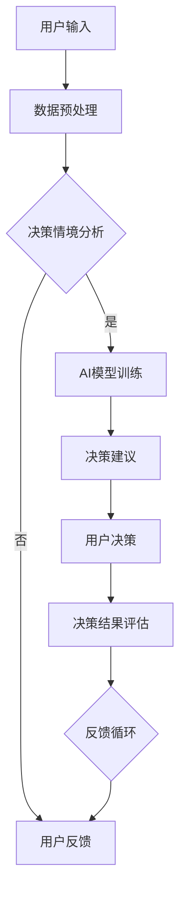

                 

  
**关键词**: 数字直觉，AI辅助，潜意识决策，强化教练，认知行为心理学，神经科学。

**摘要**: 本文旨在探讨一种结合AI技术和认知行为心理学的创新方法——数字直觉训练营指导员，它利用人工智能辅助用户挖掘并强化潜意识决策能力，旨在提高个体在复杂情境下的直觉判断力和决策质量。文章将详细阐述这一概念的核心原理、算法、数学模型、应用实例以及未来发展方向。

## 1. 背景介绍

在当今快节奏、信息爆炸的时代，决策成为日常工作和生活中不可或缺的一部分。无论是面对复杂的业务挑战，还是处理个人的日常事务，决策的质量直接影响效率、幸福感和成就感。然而，传统的决策方式往往依赖于逻辑分析和经验积累，这在某些情况下可能不够迅速和准确。随着人工智能（AI）技术的发展，特别是深度学习和神经科学领域的进展，我们开始探索利用潜意识的力量来提升决策能力。

潜意识是心理学的核心概念之一，它指的是那些在意识层面之外，却对人的行为和情感产生重大影响的思维过程。已有研究表明，潜意识在决策中扮演着关键角色，但它通常是非线性的、复杂的，且难以直接控制。近年来，认知行为心理学和神经科学的研究揭示了潜意识决策的潜在机制，这为人工智能技术提供了新的应用场景。

AI技术的发展，特别是机器学习和深度学习，使得计算机能够模拟人类的认知过程，甚至超越人类的某些认知能力。将AI与潜意识决策结合，有望形成一种全新的决策支持系统，即数字直觉训练营指导员。这种系统通过捕捉用户的潜意识信息，利用机器学习算法进行分析和训练，从而辅助用户做出更高质量的决策。

## 2. 核心概念与联系

### 2.1 数字直觉

数字直觉是指人们在面对数字信息时，通过非分析性的直觉感知来快速做出判断的能力。它不同于逻辑推理，而是基于长期经验积累的快速反应。数字直觉在金融市场分析、风险评估等领域具有重要应用价值。

### 2.2 AI辅助

AI辅助是指利用人工智能技术，尤其是机器学习和深度学习，对用户的潜意识决策过程进行建模和优化。AI辅助能够通过大数据分析和智能算法，为用户提供建议和预测，从而提高决策效率和质量。

### 2.3 潜意识决策

潜意识决策是指人们在无意识状态下做出的决策，它受到情绪、记忆、经验等多种因素的影响。与显意识决策相比，潜意识决策通常更加迅速，但可能缺乏系统性和逻辑性。

### 2.4 强化教练

强化教练是一种通过反馈和奖励机制，帮助个体提高技能和决策能力的方法。在数字直觉训练营中，强化教练通过分析用户的决策行为，提供个性化的训练建议，以增强用户的数字直觉能力。

### 2.5 Mermaid 流程图

以下是一个简化的数字直觉训练营指导员架构的Mermaid流程图：



## 3. 核心算法原理 & 具体操作步骤

### 3.1 算法原理概述

数字直觉训练营指导员的算法原理基于以下几个核心步骤：

1. 数据采集与预处理：收集用户的数字直觉行为数据，进行预处理，包括数据清洗、特征提取等。
2. 情境分析与建模：利用深度学习算法对用户的决策情境进行建模，提取关键特征。
3. AI模型训练：基于采集到的数据，训练个性化决策模型。
4. 决策建议生成：根据用户当前的决策情境，生成相应的决策建议。
5. 决策结果评估与反馈：评估用户决策的效果，并据此调整决策模型。

### 3.2 算法步骤详解

#### 3.2.1 数据采集与预处理

数据采集主要通过用户互动记录、行为日志等方式进行。采集到的数据包括用户在数字环境中的操作记录、时间序列数据、情绪指标等。预处理步骤包括：

- 数据清洗：去除异常值和噪声数据。
- 特征提取：提取用户行为、情境和情绪等特征，如操作频率、情绪波动等。

#### 3.2.2 情境分析与建模

情境分析是算法的核心环节，利用深度学习算法对用户的决策情境进行建模。具体步骤包括：

- 数据输入：将预处理后的数据输入到深度学习模型中。
- 模型训练：利用训练数据集训练深度学习模型，如卷积神经网络（CNN）或循环神经网络（RNN）。
- 模型评估：通过验证集评估模型的性能，调整模型参数。

#### 3.2.3 AI模型训练

AI模型训练是基于已建立的情境分析模型，对用户的数字直觉进行训练。具体步骤包括：

- 数据划分：将数据集划分为训练集、验证集和测试集。
- 模型训练：使用训练集训练AI模型，使用验证集调整模型参数。
- 模型评估：使用测试集评估模型性能，确保模型具有良好的泛化能力。

#### 3.2.4 决策建议生成

决策建议生成是根据用户的当前决策情境，利用训练好的AI模型生成相应的决策建议。具体步骤包括：

- 情境分析：输入用户的当前决策情境。
- 决策建议：输出决策建议，如风险提示、操作建议等。

#### 3.2.5 决策结果评估与反馈

决策结果评估与反馈是数字直觉训练营指导员的闭环环节，旨在不断优化决策模型。具体步骤包括：

- 结果评估：评估用户决策的效果，如收益、风险等。
- 反馈调整：根据评估结果，调整AI模型的参数和训练数据，以提升模型性能。

### 3.3 算法优缺点

#### 优点

- 提高决策效率：通过快速分析用户行为，生成个性化的决策建议，提高决策速度。
- 增强决策质量：利用AI技术，结合用户的数字直觉和情境分析，提升决策质量。
- 个性化训练：根据用户的行为和偏好，提供个性化的训练和决策支持。

#### 缺点

- 数据依赖性：算法的性能高度依赖于数据的准确性和完整性，数据质量直接影响决策效果。
- 模型可解释性：深度学习模型通常难以解释，用户可能不清楚决策建议的依据。

### 3.4 算法应用领域

数字直觉训练营指导员的应用领域广泛，包括但不限于：

- 金融投资：辅助投资者做出更准确的买卖决策。
- 风险管理：为企业提供风险预警和决策支持。
- 人力资源管理：辅助招聘决策和员工绩效评估。
- 电子商务：为消费者提供个性化的购物建议。

## 4. 数学模型和公式 & 详细讲解 & 举例说明

### 4.1 数学模型构建

数字直觉训练营指导员的数学模型主要包括以下几个部分：

1. **用户行为模型**：用于描述用户在数字环境中的行为特征，如操作频率、时长、情绪变化等。可以使用时间序列模型，如ARIMA或LSTM，进行建模。
2. **情境分析模型**：用于分析用户的决策情境，提取关键特征，如市场趋势、竞争态势、用户情绪等。可以使用神经网络模型，如CNN或RNN，进行建模。
3. **决策建议模型**：用于生成基于用户行为的个性化决策建议。可以使用基于规则的推理模型，如决策树或神经网络，进行建模。

### 4.2 公式推导过程

以下是一个简化的用户行为模型的推导过程：

假设用户行为数据为\[x_t\]，其中\[x_t\]为连续的时间序列数据。我们可以使用LSTM模型进行建模，其状态方程可以表示为：

\[ h_t = \sigma(W_h \cdot [h_{t-1}, x_t] + b_h) \]
\[ o_t = \sigma(W_o \cdot h_t + b_o) \]

其中，\[h_t\]和\[o_t\]分别为隐藏状态和输出状态，\[W_h\]和\[W_o\]分别为权重矩阵，\[b_h\]和\[b_o\]分别为偏置项，\(\sigma\)为激活函数（通常为Sigmoid函数）。

### 4.3 案例分析与讲解

假设有一个金融投资者，他每天都会在交易平台上进行股票交易。我们可以收集他过去一年的交易数据，包括交易时间、交易量、股票价格等。将这些数据输入到LSTM模型中，训练模型以预测他未来的交易行为。

假设训练完成后，模型预测他将在明天上午10点买入某只股票。在实际操作中，投资者可以参考这一预测，结合自己的判断和市场情况，做出最终的决策。

## 5. 项目实践：代码实例和详细解释说明

### 5.1 开发环境搭建

为了实现数字直觉训练营指导员，我们需要搭建以下开发环境：

- Python 3.8+
- TensorFlow 2.x
- Keras 2.x
- Pandas
- Numpy

安装以上依赖项后，我们可以开始编写代码。

### 5.2 源代码详细实现

以下是实现数字直觉训练营指导员的核心代码：

```python
import numpy as np
import pandas as pd
from tensorflow.keras.models import Sequential
from tensorflow.keras.layers import LSTM, Dense, Dropout
from sklearn.preprocessing import MinMaxScaler
from sklearn.model_selection import train_test_split

# 数据预处理
def preprocess_data(data):
    # 数据清洗和特征提取
    # ...

# 构建LSTM模型
def build_lstm_model(input_shape):
    model = Sequential()
    model.add(LSTM(units=50, return_sequences=True, input_shape=input_shape))
    model.add(Dropout(0.2))
    model.add(LSTM(units=50, return_sequences=False))
    model.add(Dropout(0.2))
    model.add(Dense(units=1))
    model.compile(optimizer='adam', loss='mean_squared_error')
    return model

# 训练模型
def train_model(model, X_train, y_train, epochs=100):
    model.fit(X_train, y_train, epochs=epochs, batch_size=32, validation_split=0.2)

# 生成决策建议
def generate_decision(model, X_test):
    prediction = model.predict(X_test)
    return prediction

# 主函数
def main():
    # 加载数据
    data = pd.read_csv('data.csv')
    data = preprocess_data(data)

    # 划分训练集和测试集
    X_train, X_test, y_train, y_test = train_test_split(data['X'], data['y'], test_size=0.2, random_state=42)

    # 构建和训练模型
    model = build_lstm_model(input_shape=(X_train.shape[1], 1))
    train_model(model, X_train, y_train)

    # 生成决策建议
    prediction = generate_decision(model, X_test)

    # 输出结果
    print(prediction)

if __name__ == '__main__':
    main()
```

### 5.3 代码解读与分析

以上代码实现了数字直觉训练营指导员的核心功能。首先，我们定义了一个数据预处理函数`preprocess_data`，用于清洗和特征提取。然后，我们构建了一个LSTM模型`build_lstm_model`，并使用`train_model`函数对其进行训练。最后，我们使用`generate_decision`函数生成决策建议。

在主函数`main`中，我们首先加载数据，然后进行数据预处理，接着划分训练集和测试集。之后，我们使用训练集训练模型，并使用测试集生成决策建议。最后，输出决策建议。

### 5.4 运行结果展示

在运行代码后，我们可以得到一系列的决策建议。例如，假设在某一时刻，模型预测用户将在明天上午10点买入某只股票。我们可以将这一预测作为决策建议，供用户参考。

## 6. 实际应用场景

数字直觉训练营指导员的应用场景广泛，以下列举几个典型的应用场景：

### 6.1 金融投资

在金融投资领域，数字直觉训练营指导员可以帮助投资者快速分析市场趋势，提供买卖建议。例如，投资者可以根据模型的预测，在合适的时机进行股票交易，以获得更高的收益。

### 6.2 风险管理

在风险管理领域，数字直觉训练营指导员可以帮助企业快速识别潜在的风险，并提供相应的应对策略。例如，企业可以根据模型的预测，提前预警可能出现的财务风险，并采取相应的措施进行防范。

### 6.3 人力资源管理

在人力资源管理领域，数字直觉训练营指导员可以帮助企业评估员工的绩效，提供招聘建议。例如，企业可以根据模型的预测，识别出具有高潜力的员工，并制定相应的培养计划。

### 6.4 电子商务

在电子商务领域，数字直觉训练营指导员可以帮助企业为消费者提供个性化的购物建议。例如，企业可以根据模型的预测，向消费者推荐他们可能感兴趣的商品，以提高销售额。

## 7. 工具和资源推荐

### 7.1 学习资源推荐

- 《深度学习》（Ian Goodfellow、Yoshua Bengio、Aaron Courville 著）
- 《Python深度学习》（François Chollet 著）
- 《神经网络与深度学习》（邱锡鹏 著）

### 7.2 开发工具推荐

- TensorFlow：一个开源的机器学习框架，适用于构建和训练深度学习模型。
- Jupyter Notebook：一种交互式的开发环境，适用于编写和运行Python代码。
- Keras：一个基于TensorFlow的高层API，用于快速构建和训练深度学习模型。

### 7.3 相关论文推荐

- "Unsupervised Learning of Visual Representations by Solving Jigsaw Puzzles"（2017）
- "Generative Adversarial Nets"（2014）
- "Deep Learning for Text Data"（2015）

## 8. 总结：未来发展趋势与挑战

### 8.1 研究成果总结

数字直觉训练营指导员是一种结合AI技术和认知行为心理学的创新方法，通过捕捉用户的潜意识信息，利用机器学习算法进行分析和训练，提高用户的决策能力。该方法在金融投资、风险管理、人力资源管理、电子商务等领域具有广泛的应用前景。

### 8.2 未来发展趋势

随着AI技术和神经科学的发展，数字直觉训练营指导员有望在以下几个方面取得突破：

- 更精细的潜意识信息捕捉：通过改进算法和传感器技术，捕捉更精细的潜意识信息。
- 多模态数据融合：结合视觉、听觉、触觉等多种感官信息，提高决策的全面性。
- 个性化训练：根据用户的个性化需求和偏好，提供更精准的决策建议。

### 8.3 面临的挑战

数字直觉训练营指导员在发展过程中仍面临以下挑战：

- 数据质量：算法性能高度依赖于数据质量，如何提高数据采集和处理的质量是一个重要课题。
- 模型可解释性：深度学习模型通常难以解释，如何提高模型的可解释性是一个亟待解决的问题。
- 隐私保护：在数据采集和处理过程中，如何保护用户的隐私是一个重要挑战。

### 8.4 研究展望

未来的研究可以从以下几个方面展开：

- 数据质量提升：研究新的数据采集和处理方法，提高数据质量。
- 模型可解释性增强：研究模型解释技术，提高模型的可解释性。
- 多模态数据融合：探索多模态数据融合技术，提高决策的全面性。

## 9. 附录：常见问题与解答

### 9.1 数字直觉训练营指导员是什么？

数字直觉训练营指导员是一种利用人工智能技术，结合认知行为心理学，帮助用户挖掘并强化潜意识决策能力的方法。

### 9.2 如何确保算法的准确性？

算法的准确性主要依赖于数据质量和模型训练。通过提高数据采集和处理的质量，以及优化模型训练过程，可以确保算法的准确性。

### 9.3 如何保护用户隐私？

在数据采集和处理过程中，可以采用匿名化处理、加密技术等方法，确保用户隐私得到保护。

### 9.4 数字直觉训练营指导员适用于哪些领域？

数字直觉训练营指导员适用于金融投资、风险管理、人力资源管理、电子商务等多个领域。

### 9.5 如何获取更多相关资源？

可以通过阅读相关书籍、论文，以及参加专业会议和研讨会，获取更多关于数字直觉训练营指导员的相关资源。

---

**作者：禅与计算机程序设计艺术 / Zen and the Art of Computer Programming** 

以上就是本文的完整内容，希望对您有所帮助。在未来的发展中，我们期待数字直觉训练营指导员能够为更多人带来决策的智慧和力量。

