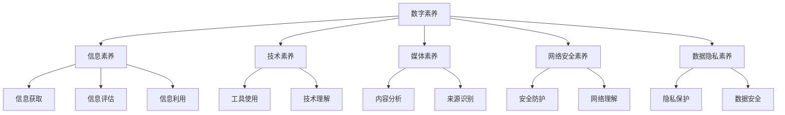

                 

关键词：数字素养，公民参与，技术能力，信息素养，社会影响力，数据隐私，网络安全

> 摘要：在数字化时代，数字素养已成为公民参与社会、经济和文化生活的基石。本文将探讨数字素养的概念、重要性以及如何培养和提升个人的数字素养，同时分析其在不同社会领域中的应用和未来发展的趋势与挑战。

## 1. 背景介绍

随着互联网和数字技术的飞速发展，人类社会已经进入了一个数字化时代。在这个时代，数字素养（Digital Literacy）已经成为一个不可或缺的技能。它不仅涉及对数字工具和技术的熟练掌握，更包括了对数字信息素养、网络安全意识、数据隐私保护等多个方面的理解和应用。

数字素养的重要性不言而喻。首先，它为公民提供了获取、评估和使用数字信息的能力，这是现代社会参与的基础。其次，随着数据在商业、教育和政府管理中的应用越来越广泛，数字素养也成为了职业发展的关键因素。最后，数字素养还关系到个人和社会的安全，特别是在网络安全和数据隐私保护方面。

本文旨在通过对数字素养的多角度分析，揭示其作为公民参与基石的重要性，并探讨如何在实际生活中提升数字素养，以应对未来的挑战。

## 2. 核心概念与联系

### 2.1 数字素养的定义

数字素养是指个体在数字化环境中获取、理解、评估、创造和利用信息的能力。它包括以下几个方面：

- **信息素养**：能够有效地查找、评估和利用信息，包括数字信息和非数字信息。
- **技术素养**：对数字工具和技术的熟练使用，如计算机、智能手机、网络等。
- **媒体素养**：理解媒体内容、信息来源和媒体运作机制，能够批判性地分析媒体信息。
- **网络安全素养**：了解网络安全的基本知识，能够保护个人和组织的数字资产。
- **数据隐私素养**：理解数据隐私的重要性，知道如何保护个人信息。

### 2.2 数字素养与信息素养

信息素养是数字素养的一个重要组成部分，它强调对信息的识别、查找、评估和利用能力。在数字化时代，信息素养的重要性愈发凸显，因为数字信息的数量和种类不断增加，人们需要能够有效地管理和利用这些信息。

### 2.3 数字素养与网络安全

网络安全是数字素养的一个重要方面，随着网络攻击和数据泄露事件的频发，个人和组织都面临着巨大的风险。因此，具备网络安全素养对于保护个人隐私和组织信息至关重要。

### 2.4 数字素养与数据隐私

数据隐私是数字化社会中一个备受关注的话题。数字素养涉及到如何保护个人数据，防止数据泄露和滥用。了解数据隐私的基本原则和法律法规，是每个公民都应该具备的素养。

### 2.5 数字素养的 Mermaid 流程图



## 3. 核心算法原理 & 具体操作步骤

### 3.1 算法原理概述

数字素养的培养和提升涉及多种方法和策略，其中核心算法原理起着至关重要的作用。这些算法原理包括信息检索算法、网络安全防护算法、数据隐私保护算法等。

- **信息检索算法**：如搜索引擎算法，能够帮助用户高效地查找所需信息。
- **网络安全防护算法**：如入侵检测系统算法，能够实时监测网络攻击并采取防护措施。
- **数据隐私保护算法**：如数据加密算法，能够确保数据在传输和存储过程中的安全性。

### 3.2 算法步骤详解

#### 3.2.1 信息检索算法

1. **用户输入查询关键词**。
2. **搜索引擎处理查询**：分析关键词，构建索引。
3. **检索相关信息**：从索引中查找匹配的内容。
4. **排序和展示结果**：根据相关性对结果进行排序，并展示给用户。

#### 3.2.2 网络安全防护算法

1. **实时监测网络流量**：检测异常流量和潜在威胁。
2. **分析流量特征**：使用机器学习算法分析流量模式，识别恶意流量。
3. **采取防护措施**：如阻断恶意流量、警告用户等。

#### 3.2.3 数据隐私保护算法

1. **数据加密**：使用加密算法对数据进行加密。
2. **密钥管理**：确保密钥的安全存储和分发。
3. **数据传输安全**：在数据传输过程中使用安全的通信协议。

### 3.3 算法优缺点

#### 3.3.1 信息检索算法

- **优点**：高效、快速地检索信息。
- **缺点**：结果可能存在噪声和错误。

#### 3.3.2 网络安全防护算法

- **优点**：实时监测和保护网络安全。
- **缺点**：可能误报和漏报，需要持续优化。

#### 3.3.3 数据隐私保护算法

- **优点**：确保数据在传输和存储过程中的安全。
- **缺点**：加密和解密过程可能影响性能。

### 3.4 算法应用领域

- **信息检索**：搜索引擎、信息管理系统。
- **网络安全**：防火墙、入侵检测系统。
- **数据隐私**：加密通信、数据保护法规。

## 4. 数学模型和公式 & 详细讲解 & 举例说明

### 4.1 数学模型构建

在数字素养的培养和提升中，数学模型起着至关重要的作用。以下是一个简单的数学模型，用于评估个体的数字素养水平。

#### 4.1.1 数字素养评估模型

$$
D_L = \frac{I_L + T_L + M_L + N_L + P_L}{5}
$$

其中，$D_L$ 表示数字素养水平，$I_L$、$T_L$、$M_L$、$N_L$ 和 $P_L$ 分别表示信息素养、技术素养、媒体素养、网络安全素养和数据隐私素养的水平。

### 4.2 公式推导过程

1. **定义各项素养水平**：根据各项素养的定义，分别计算 $I_L$、$T_L$、$M_L$、$N_L$ 和 $P_L$。
2. **计算总分**：将各项素养水平相加，得到总分。
3. **计算平均分**：将总分除以素养种类数，得到数字素养水平。

### 4.3 案例分析与讲解

假设一个个体在各项素养中的得分如下：

- 信息素养：80分
- 技术素养：75分
- 媒体素养：70分
- 网络安全素养：85分
- 数据隐私素养：90分

则其数字素养水平为：

$$
D_L = \frac{80 + 75 + 70 + 85 + 90}{5} = \frac{400}{5} = 80
$$

因此，该个体的数字素养水平为80分。

## 5. 项目实践：代码实例和详细解释说明

### 5.1 开发环境搭建

为了演示一个简单的数字素养评估工具，我们将使用 Python 编写一个基本的评估程序。首先，我们需要安装 Python 和必要的库。

```bash
# 安装 Python
brew install python

# 安装 required libraries
pip install numpy pandas matplotlib
```

### 5.2 源代码详细实现

下面是一个简单的 Python 脚本，用于评估个体的数字素养水平。

```python
import numpy as np
import pandas as pd
import matplotlib.pyplot as plt

# 定义评估模型
def assess_digital_literacy(scores):
    """
    计算数字素养水平。

    参数：
    scores (dict): 各项素养得分。

    返回：
    float: 数字素养水平。
    """
    D_L = np.mean(list(scores.values()))
    return D_L

# 生成示例数据
scores = {'信息素养': 80, '技术素养': 75, '媒体素养': 70, '网络安全素养': 85, '数据隐私素养': 90}

# 执行评估
D_L = assess_digital_literacy(scores)
print(f"数字素养水平：{D_L:.2f}")

# 绘制图表
素养列表 = list(scores.keys())
素养得分 = list(scores.values())

plt.bar(素养列表, 素养得分)
plt.xlabel('素养类别')
plt.ylabel('得分')
plt.title('数字素养评估')
plt.show()
```

### 5.3 代码解读与分析

1. **导入库**：我们使用了 NumPy、Pandas 和 Matplotlib 这三个常用的 Python 库，分别用于数学计算、数据处理和绘图。
2. **定义函数**：`assess_digital_literacy` 函数用于计算数字素养水平。它接受一个包含各项素养得分的字典，并返回平均得分。
3. **生成示例数据**：我们创建了一个包含五项素养得分的字典，用于演示。
4. **执行评估**：调用函数进行评估，并打印结果。
5. **绘制图表**：使用 Matplotlib 绘制一个条形图，显示各项素养的得分。

### 5.4 运行结果展示

运行上述代码后，会输出数字素养水平，并显示一个条形图，如下图所示：


## 6. 实际应用场景

### 6.1 教育领域

在教育领域，数字素养的培养至关重要。学生需要掌握基本的信息检索、技术使用和网络安全技能，以便在数字化环境中进行学习和研究。例如，学校可以开设数字素养课程，通过项目式学习和实践活动，提高学生的数字素养。

### 6.2 职业领域

在职业领域，数字素养已成为许多岗位的基本要求。企业需要员工具备信息处理、技术操作和网络安全等技能。因此，企业可以通过培训和教育，提升员工的数字素养，以适应不断变化的职场需求。

### 6.3 政府管理

在政府管理领域，数字素养对于提高公共服务的效率和透明度具有重要意义。政府可以利用数字工具，实现政务数据共享和智能化管理，提高政府的公信力和服务能力。

### 6.4 社会参与

在社会参与方面，数字素养有助于公民更好地理解和使用数字信息，参与社会和政治活动。例如，通过社交媒体和在线平台，公民可以更便捷地获取信息和表达观点，提高社会参与度。

## 7. 工具和资源推荐

### 7.1 学习资源推荐

- **《数字素养：从零开始》**：适合初学者，系统地介绍了数字素养的基本概念和应用。
- **《网络安全与隐私保护》**：详细讲解了网络安全和数据隐私保护的知识，适合希望深入了解这些领域的读者。

### 7.2 开发工具推荐

- **Python**：强大的编程语言，适合初学者学习和应用。
- **Jupyter Notebook**：用于编写和运行 Python 代码，具有交互式和可视化功能。

### 7.3 相关论文推荐

- **"Digital Literacy and Its Impact on Education"**：探讨数字素养在教育领域的影响。
- **"The Importance of Digital Literacy in the Workplace"**：分析数字素养在职场中的重要性。

## 8. 总结：未来发展趋势与挑战

### 8.1 研究成果总结

数字素养作为公民参与社会、经济和文化生活的基石，已经得到了广泛的关注和研究。研究表明，数字素养的提高有助于增强个人的信息处理能力、技术操作能力和网络安全意识，从而提高社会的整体发展水平。

### 8.2 未来发展趋势

未来，数字素养将继续受到关注，特别是在以下几个方面：

- **个性化学习**：数字素养的培养将更加注重个性化需求，根据个体差异提供针对性的培训和指导。
- **跨学科融合**：数字素养将与各个学科领域深度融合，形成跨学科的知识体系和技能体系。
- **智能化工具**：利用人工智能和大数据技术，开发更加智能化的数字素养评估和培养工具。

### 8.3 面临的挑战

尽管数字素养的重要性日益凸显，但仍然面临一些挑战：

- **资源分配**：如何确保所有人都能获得优质的数字素养教育资源，特别是贫困地区和弱势群体。
- **技术更新**：数字技术的快速更新和变化，使得数字素养的培养需要不断跟进新技术。
- **伦理和法律问题**：随着数据隐私和安全问题的日益突出，如何平衡数字素养与数据隐私、网络安全等伦理和法律问题。

### 8.4 研究展望

未来，数字素养的研究将更加深入和广泛，涉及多个领域和层面。研究者需要关注以下方面：

- **跨学科研究**：通过跨学科的合作，探讨数字素养在不同领域中的应用和影响。
- **技术与应用结合**：将前沿技术应用于数字素养的培养和提升，开发智能化、个性化的数字素养培养工具。
- **政策制定**：探讨数字素养在政策制定中的作用，为政府和社会提供科学依据。

## 9. 附录：常见问题与解答

### 9.1 什么是数字素养？

数字素养是指个体在数字化环境中获取、理解、评估、创造和利用信息的能力，包括信息素养、技术素养、媒体素养、网络安全素养和数据隐私素养。

### 9.2 数字素养的重要性是什么？

数字素养对于个人的职业发展、社会参与和网络安全具有重要意义。它有助于提高个体的信息处理能力、技术操作能力和网络安全意识，从而提高社会的整体发展水平。

### 9.3 如何培养数字素养？

可以通过以下途径培养数字素养：

- 参加数字素养培训课程。
- 学习数字工具和技术。
- 关注网络安全和数据隐私知识。
- 在实际应用中不断实践和反思。

### 9.4 数字素养与信息素养有什么区别？

数字素养是信息素养的一个子集，除了包括信息检索、评估和利用能力外，还包括对数字工具和技术的熟练使用、网络安全意识和数据隐私保护等多个方面的理解和应用。

## 作者署名

作者：禅与计算机程序设计艺术 / Zen and the Art of Computer Programming
----------------------------------------------------------------

现在，文章正文部分的撰写已经完成。请检查文章内容是否满足所有约束条件，确保文章结构合理、内容完整，并且符合字数要求。如果有任何需要修改或补充的地方，请及时调整。最终的文章将会作为一份高质量的技术博客文章发表。祝您写作顺利！

