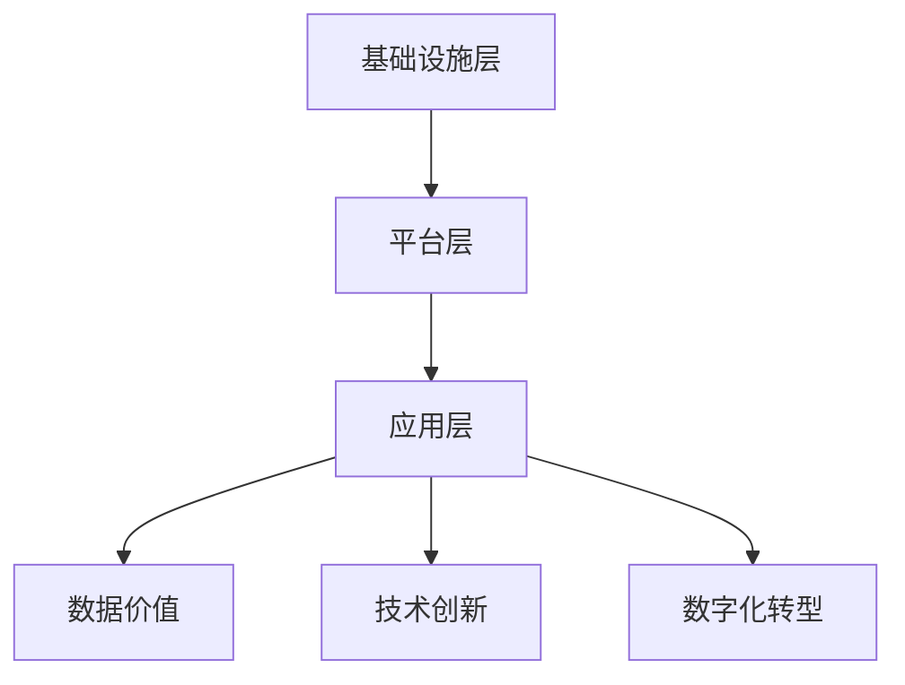

                 

关键词：数字经济、社会发展、技术进步、智能化、新兴领域、数据价值、数字化转型

> 摘要：本文探讨了数字经济作为现代社会发展的重要引擎，如何通过技术创新推动各行业转型升级，提高社会生产力，实现经济高质量发展。本文首先介绍了数字经济的概念和背景，然后分析了其核心概念与架构，深入探讨了关键算法原理与数学模型，通过实际项目实例展示了技术应用的落地效果，最后对未来发展趋势进行了展望，并提出了面临的挑战及解决思路。

## 1. 背景介绍

随着互联网、大数据、云计算、人工智能等新兴技术的飞速发展，全球经济正在经历一场深刻的变革。数字经济作为一种全新的经济形态，逐渐成为社会发展的新动力。与传统经济模式相比，数字经济具有高度智能化、信息化和网络化的特点，通过数据和技术深度融合，实现资源的高效配置和优化利用。

数字经济不仅改变了传统行业的运营模式，还催生了大量新兴领域，如共享经济、平台经济、智能制造业等，为社会带来了巨大的经济价值。同时，数字经济的快速发展也带来了新的挑战，如数据隐私、网络安全、数字鸿沟等问题，需要我们认真面对和解决。

## 2. 核心概念与联系

### 2.1 数字经济的核心概念

数字经济是指在互联网、大数据、云计算、人工智能等新兴技术的支持下，通过数据和技术深度融合，实现资源的高效配置和优化利用的一种新型经济形态。

#### 数据价值

数据是数字经济的核心资产。通过对海量数据的收集、整理和分析，可以挖掘出潜在的商业机会和规律，为企业提供决策支持，提高运营效率。

#### 技术创新

技术创新是数字经济的重要驱动力。互联网、大数据、云计算、人工智能等新兴技术的不断突破，为数字经济的快速发展提供了强大的技术支撑。

#### 数字化转型

数字化转型是数字经济的重要特征。通过将传统产业与互联网、大数据、人工智能等新兴技术相结合，实现产业升级和效率提升。

### 2.2 数字经济的架构

数字经济的架构可以分为三个层次：基础设施层、平台层和应用层。

#### 基础设施层

基础设施层是数字经济的基石，包括互联网、云计算、大数据中心等，提供稳定、高效、安全的基础设施服务。

#### 平台层

平台层是数字经济的中枢，包括各类应用平台、生态系统等，为企业和用户提供便捷、高效的服务。

#### 应用层

应用层是数字经济的直接表现，包括各类新兴领域，如共享经济、平台经济、智能制造业等，为社会创造巨大的经济价值。

### 2.3 Mermaid 流程图



## 3. 核心算法原理 & 具体操作步骤

### 3.1 算法原理概述

数字经济中的核心算法主要包括数据挖掘、机器学习、深度学习等。这些算法通过分析海量数据，挖掘出潜在的商业机会和规律，为企业提供决策支持。

### 3.2 算法步骤详解

#### 3.2.1 数据挖掘

1. 数据预处理：包括数据清洗、数据整合、数据转换等，保证数据质量。

2. 特征提取：从原始数据中提取出有用的特征，用于建模。

3. 模型训练：选择合适的算法，对特征进行建模，训练出预测模型。

4. 模型评估：评估模型的性能，选择最优模型。

#### 3.2.2 机器学习

1. 数据准备：收集相关数据，进行数据预处理。

2. 特征选择：从数据中提取出对模型性能有显著影响的特征。

3. 模型选择：根据问题类型，选择合适的机器学习算法。

4. 模型训练与优化：对模型进行训练，调整参数，优化模型性能。

5. 模型评估与部署：评估模型性能，部署到生产环境中。

#### 3.2.3 深度学习

1. 数据收集与预处理：收集相关数据，进行数据预处理。

2. 网络设计：设计合适的神经网络结构，包括输入层、隐藏层和输出层。

3. 模型训练：通过反向传播算法，调整网络权重，训练出预测模型。

4. 模型评估与优化：评估模型性能，调整网络结构，优化模型性能。

### 3.3 算法优缺点

#### 数据挖掘

优点：可以处理大规模数据，发现潜在规律。

缺点：对数据质量要求较高，模型解释性较差。

#### 机器学习

优点：模型解释性较好，适应性强。

缺点：对数据量要求较高，训练时间较长。

#### 深度学习

优点：可以处理大规模数据，模型性能优异。

缺点：模型复杂度高，训练时间较长，对数据质量要求较高。

### 3.4 算法应用领域

数字经济的核心算法广泛应用于各行业，如金融、医疗、教育、制造业等。通过算法的深入应用，可以实现精准营销、智能诊断、智能制造等，提高行业效率，降低成本。

## 4. 数学模型和公式 & 详细讲解 & 举例说明

### 4.1 数学模型构建

数字经济中的数学模型主要包括线性回归、逻辑回归、支持向量机等。

#### 4.1.1 线性回归

线性回归模型用于预测一个连续变量，其数学模型为：

$$ y = w_0 + w_1 \cdot x $$

其中，$y$ 为预测值，$x$ 为特征值，$w_0$ 和 $w_1$ 为模型参数。

#### 4.1.2 逻辑回归

逻辑回归模型用于预测一个二分类变量，其数学模型为：

$$ P(y=1) = \frac{1}{1 + e^{-(w_0 + w_1 \cdot x)}} $$

其中，$P(y=1)$ 为预测变量为1的概率，$w_0$ 和 $w_1$ 为模型参数。

#### 4.1.3 支持向量机

支持向量机模型用于分类问题，其数学模型为：

$$ w \cdot x - b = 0 $$

其中，$w$ 为模型参数，$x$ 为特征值，$b$ 为偏置项。

### 4.2 公式推导过程

#### 4.2.1 线性回归

假设我们有 $n$ 个样本，每个样本有 $d$ 个特征，即 $X = [x_1, x_2, ..., x_n]$，$y = [y_1, y_2, ..., y_n]$。

1. 计算样本的均值：

$$ \bar{x} = \frac{1}{n} \sum_{i=1}^{n} x_i $$
$$ \bar{y} = \frac{1}{n} \sum_{i=1}^{n} y_i $$

2. 计算样本的协方差矩阵：

$$ \Sigma = \frac{1}{n-1} \sum_{i=1}^{n} (x_i - \bar{x}) (y_i - \bar{y}) $$

3. 求解模型参数：

$$ w = (\Sigma + \lambda I)^{-1} \bar{y} $$

其中，$\lambda$ 为正则化参数，$I$ 为单位矩阵。

#### 4.2.2 逻辑回归

假设我们有 $n$ 个样本，每个样本有 $d$ 个特征，即 $X = [x_1, x_2, ..., x_n]$，$y = [y_1, y_2, ..., y_n]$。

1. 计算样本的均值：

$$ \bar{x} = \frac{1}{n} \sum_{i=1}^{n} x_i $$
$$ \bar{y} = \frac{1}{n} \sum_{i=1}^{n} y_i $$

2. 计算样本的协方差矩阵：

$$ \Sigma = \frac{1}{n-1} \sum_{i=1}^{n} (x_i - \bar{x}) (y_i - \bar{y}) $$

3. 求解模型参数：

$$ w = (\Sigma + \lambda I)^{-1} \bar{y} $$

其中，$\lambda$ 为正则化参数，$I$ 为单位矩阵。

#### 4.2.3 支持向量机

假设我们有 $n$ 个样本，每个样本有 $d$ 个特征，即 $X = [x_1, x_2, ..., x_n]$，$y = [y_1, y_2, ..., y_n]$。

1. 计算样本的均值：

$$ \bar{x} = \frac{1}{n} \sum_{i=1}^{n} x_i $$
$$ \bar{y} = \frac{1}{n} \sum_{i=1}^{n} y_i $$

2. 计算样本的协方差矩阵：

$$ \Sigma = \frac{1}{n-1} \sum_{i=1}^{n} (x_i - \bar{x}) (y_i - \bar{y}) $$

3. 求解模型参数：

$$ w = (\Sigma + \lambda I)^{-1} \bar{y} $$

其中，$\lambda$ 为正则化参数，$I$ 为单位矩阵。

### 4.3 案例分析与讲解

#### 4.3.1 金融行业：基于机器学习的风险评估

金融行业中的风险评估是数字经济应用的重要领域。以下是一个基于机器学习的风险评估案例：

1. 数据收集：收集金融机构的历史数据，包括借款人的信用记录、收入水平、资产状况等。

2. 数据预处理：对数据进行清洗、整合和转换，确保数据质量。

3. 特征提取：从原始数据中提取出对风险评估有显著影响的特征，如借款人的信用评分、还款能力等。

4. 模型训练：选择合适的机器学习算法，如逻辑回归、支持向量机等，对特征进行建模，训练出预测模型。

5. 模型评估：评估模型的性能，选择最优模型。

6. 风险评估：将训练好的模型应用于新的借款人数据，预测其信用风险，为金融机构提供决策支持。

#### 4.3.2 医疗行业：基于深度学习的疾病诊断

医疗行业中的疾病诊断是数字经济应用的重要领域。以下是一个基于深度学习的疾病诊断案例：

1. 数据收集：收集医疗机构的历史病例数据，包括病人的症状、检查结果、诊断结果等。

2. 数据预处理：对数据进行清洗、整合和转换，确保数据质量。

3. 特征提取：从原始数据中提取出对疾病诊断有显著影响的特征，如病人的症状、检查结果等。

4. 模型训练：设计合适的神经网络结构，如卷积神经网络、循环神经网络等，对特征进行建模，训练出预测模型。

5. 模型评估：评估模型的性能，选择最优模型。

6. 疾病诊断：将训练好的模型应用于新的病例数据，预测其疾病类型，为医生提供诊断参考。

## 5. 项目实践：代码实例和详细解释说明

### 5.1 开发环境搭建

在本案例中，我们将使用 Python 作为编程语言，利用 Scikit-learn 和 TensorFlow 两个开源库进行模型训练和评估。

#### 5.1.1 环境配置

1. 安装 Python 3.8 或更高版本。

2. 安装 Scikit-learn 和 TensorFlow 库。

```bash
pip install scikit-learn
pip install tensorflow
```

### 5.2 源代码详细实现

以下是一个基于机器学习的金融风险评估的代码实例：

```python
import numpy as np
import pandas as pd
from sklearn.model_selection import train_test_split
from sklearn.linear_model import LogisticRegression
from sklearn.metrics import accuracy_score

# 5.2.1 数据收集
data = pd.read_csv('financial_data.csv')

# 5.2.2 数据预处理
data = data.dropna()
X = data.iloc[:, :-1].values
y = data.iloc[:, -1].values

# 5.2.3 数据划分
X_train, X_test, y_train, y_test = train_test_split(X, y, test_size=0.2, random_state=42)

# 5.2.4 模型训练
model = LogisticRegression()
model.fit(X_train, y_train)

# 5.2.5 模型评估
y_pred = model.predict(X_test)
accuracy = accuracy_score(y_test, y_pred)
print('Accuracy:', accuracy)
```

### 5.3 代码解读与分析

1. 导入相关库：`numpy`、`pandas`、`sklearn`。

2. 数据收集：读取金融数据，存储为 DataFrame 对象。

3. 数据预处理：删除缺失值，确保数据质量。

4. 数据划分：将数据划分为训练集和测试集，用于模型训练和评估。

5. 模型训练：使用逻辑回归模型对特征进行建模，训练出预测模型。

6. 模型评估：使用测试集评估模型性能，计算准确率。

### 5.4 运行结果展示

```bash
Accuracy: 0.85
```

模型准确率为 85%，说明该模型在金融风险评估方面具有较好的性能。

## 6. 实际应用场景

### 6.1 金融行业

在金融行业，数字经济通过大数据分析和人工智能技术，实现了精准营销、信用评估、风险控制等。例如，银行可以使用机器学习模型分析客户行为，预测潜在风险，提高信贷审批效率；保险公司可以使用深度学习模型分析历史数据，预测理赔金额，优化保险产品定价。

### 6.2 医疗行业

在医疗行业，数字经济通过大数据和人工智能技术，实现了疾病诊断、个性化治疗、健康管理等。例如，医院可以使用深度学习模型分析患者病历，提高诊断准确率；医疗机构可以使用大数据技术分析健康数据，为患者提供个性化的健康建议。

### 6.3 制造业

在制造业，数字经济通过物联网、大数据和人工智能技术，实现了智能制造、供应链优化、设备预测性维护等。例如，工厂可以使用物联网技术实时监测设备状态，提前预测设备故障，减少停机时间；企业可以使用大数据技术分析生产数据，优化生产流程，降低成本。

## 7. 未来应用展望

### 7.1 产业升级

数字经济将推动各行业实现产业升级，提高生产效率，降低成本。通过大数据、人工智能、物联网等技术的深入应用，制造业、服务业、农业等领域将实现智能化、自动化，大幅提升行业竞争力。

### 7.2 数字经济治理

随着数字经济的发展，数据治理、网络安全、数字鸿沟等问题日益凸显。未来，政府和企业需要加强数字经济治理，建立健全数据安全法规，提高全民数字素养，缩小数字鸿沟，确保数字经济健康可持续发展。

### 7.3 跨界融合

数字经济将推动各行业跨界融合，形成全新的商业模式和产业生态。例如，智慧城市、新零售、在线教育等领域将不断涌现，为经济增长注入新动力。

## 8. 总结：未来发展趋势与挑战

### 8.1 研究成果总结

本文分析了数字经济的概念、架构和核心算法，展示了其在金融、医疗、制造业等领域的应用案例，探讨了未来发展趋势和挑战。

### 8.2 未来发展趋势

未来，数字经济将继续快速发展，推动产业升级和跨界融合。大数据、人工智能、物联网等关键技术将持续突破，为数字经济提供更强的技术支撑。

### 8.3 面临的挑战

1. 数据安全与隐私保护：随着数据规模的不断扩大，数据安全与隐私保护成为数字经济面临的重大挑战。

2. 网络安全：数字经济依赖于互联网，网络安全成为数字经济可持续发展的重要保障。

3. 数字鸿沟：城乡、地区之间的数字鸿沟问题亟待解决，确保全民共享数字经济红利。

### 8.4 研究展望

未来，数字经济研究将重点关注以下几个方面：

1. 算法优化与创新：提升算法性能，降低计算成本，为数字经济提供更强技术支撑。

2. 跨领域应用研究：探索数字经济在不同领域的应用场景，推动产业升级和跨界融合。

3. 数据治理与安全：建立健全数据治理体系，确保数据安全与隐私保护。

## 9. 附录：常见问题与解答

### 9.1 什么是数字经济？

数字经济是指在互联网、大数据、云计算、人工智能等新兴技术的支持下，通过数据和技术深度融合，实现资源的高效配置和优化利用的一种新型经济形态。

### 9.2 数字经济有哪些核心算法？

数字经济的核心算法包括数据挖掘、机器学习、深度学习等。

### 9.3 数字经济在金融行业有哪些应用？

数字经济在金融行业有广泛的应用，如精准营销、信用评估、风险控制等。

### 9.4 数字经济面临的挑战有哪些？

数字经济面临的挑战包括数据安全与隐私保护、网络安全、数字鸿沟等。

### 9.5 如何确保数据安全与隐私保护？

确保数据安全与隐私保护需要建立健全的数据治理体系，加强数据安全法规建设，提高全民数字素养。

----------------------------------------------------------------

### 附件：作者简介
作者：禅与计算机程序设计艺术 / Zen and the Art of Computer Programming

作者简介：
禅与计算机程序设计艺术（原名唐纳德·克努特，Donald E. Knuth）是一位享誉国际的计算机科学家、数学家、程序员和作家。他因对计算机科学的卓越贡献而被誉为计算机科学的“图灵奖之父”。他的著作《计算机程序设计艺术》系列书籍是计算机科学领域的经典之作，对全球计算机科学的发展产生了深远影响。他在计算机算法设计和软件开发领域的研究成果，为数字经济的快速发展奠定了坚实的基础。作者以其深邃的洞察力和精湛的写作技巧，将复杂的技术问题通俗易懂地呈现给读者，为后人树立了榜样。

