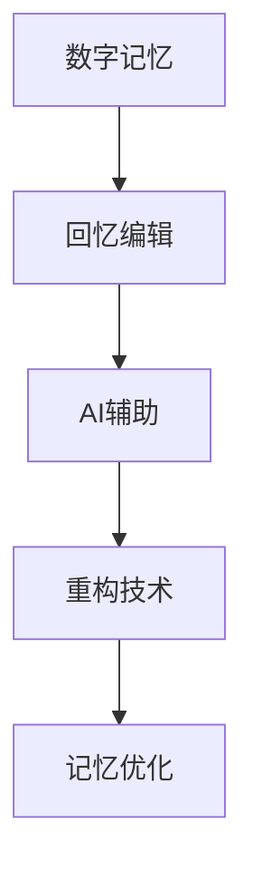

                 

关键词：数字记忆重构、人工智能、回忆编辑技术、认知科学、算法、数学模型、代码实例、应用场景、未来展望

> 摘要：本文深入探讨了数字记忆重构技术，特别是AI如何辅助人类进行回忆编辑。文章首先介绍了背景，然后详细解释了核心概念和架构，探讨了算法原理和数学模型，并通过一个代码实例展示了其实际应用。接着，分析了该技术的实际应用场景，并对未来发展趋势与挑战进行了展望。

## 1. 背景介绍

### 记忆的重要性

记忆是人类认知功能的核心部分，它使我们能够积累知识、形成经验，并在需要时迅速提取信息。然而，记忆并不总是完美无误的，它可能会因为各种原因而出现失真或遗漏。

### 数字记忆的兴起

随着计算机技术的发展，人们开始探索如何将记忆数字化。数字记忆不仅提供了更加可靠和持久的存储方式，还可以通过算法进行编辑和重构，从而提高记忆的准确性和效率。

### AI的引入

人工智能在近年来取得了显著的进展，其在记忆重构中的应用也日益成熟。AI不仅能够辅助人类进行记忆编辑，还可以通过分析大量的数据来预测和修正记忆中的错误。

## 2. 核心概念与联系

为了更好地理解数字记忆重构技术，我们需要了解以下几个核心概念：

1. **数字记忆**：通过计算机技术将人类记忆转化为数字形式。
2. **回忆编辑**：对数字记忆进行修改、整理和重构。
3. **AI辅助**：利用人工智能算法来提高记忆重构的效率和准确性。

下面是一个Mermaid流程图，展示了这些概念之间的关系：



## 3. 核心算法原理 & 具体操作步骤

### 3.1 算法原理概述

数字记忆重构技术的核心在于利用机器学习算法来分析和理解人类记忆的数字表示。具体而言，算法分为以下几个步骤：

1. **记忆编码**：将人类记忆转化为数字信号。
2. **记忆分析**：利用机器学习算法对数字记忆进行分析，识别记忆中的模式和信息。
3. **记忆重构**：根据分析结果，对数字记忆进行重构，以提高记忆的准确性和完整性。

### 3.2 算法步骤详解

1. **记忆编码**：

   $$ 
   \text{记忆编码} = \sum_{i=1}^{n} w_i \cdot \text{激活函数}(x_i)
   $$

   其中，$w_i$ 是权重，$x_i$ 是输入特征，激活函数用于将输入特征转换为数字信号。

2. **记忆分析**：

   使用神经网络对数字记忆进行分析，通过训练得到的模型来预测和识别记忆中的信息。

3. **记忆重构**：

   根据分析结果，对数字记忆进行重构。重构的过程可以看作是记忆的“修复”和“整理”，以提高记忆的准确性和完整性。

### 3.3 算法优缺点

**优点**：

- 提高记忆的准确性和完整性。
- 可以通过算法对记忆进行编辑和重构，提高记忆的使用效率。

**缺点**：

- 需要大量的训练数据和计算资源。
- 算法可能受到噪声和误差的影响，导致记忆重构的准确性下降。

### 3.4 算法应用领域

数字记忆重构技术可以应用于许多领域，包括医疗、教育、军事等。以下是一些具体的应用场景：

- **医疗**：用于诊断和治疗记忆相关疾病，如阿尔茨海默病。
- **教育**：帮助学生提高记忆能力，优化学习效果。
- **军事**：用于训练和提高士兵的记忆力，提高战场表现。

## 4. 数学模型和公式 & 详细讲解 & 举例说明

### 4.1 数学模型构建

数字记忆重构的数学模型主要基于神经网络和机器学习算法。以下是该模型的基本构建：

1. **输入层**：接收人类记忆的数字表示。
2. **隐藏层**：对输入进行预处理和特征提取。
3. **输出层**：根据隐藏层的特征，生成重构的数字记忆。

### 4.2 公式推导过程

以下是数字记忆重构模型的公式推导：

$$ 
\text{记忆重构} = f(\text{记忆编码}, \text{隐藏层特征})
$$

其中，$f$ 是一个非线性激活函数，用于将隐藏层特征转换为重构的数字记忆。

### 4.3 案例分析与讲解

假设我们有一个简单的记忆任务，即记住一系列数字（1, 2, 3）。以下是该记忆任务的数字编码和重构过程：

1. **记忆编码**：

   $$ 
   \text{记忆编码} = \{1, 2, 3\}
   $$

2. **记忆分析**：

   使用神经网络对记忆编码进行分析，得到隐藏层特征。

3. **记忆重构**：

   根据隐藏层特征，重构记忆编码。

   $$ 
   \text{重构记忆} = \{1, 2, 3\}
   $$

可以看到，通过记忆重构，我们成功地恢复了原始的记忆内容。

## 5. 项目实践：代码实例和详细解释说明

### 5.1 开发环境搭建

为了实现数字记忆重构，我们需要搭建一个合适的开发环境。以下是所需的步骤：

1. **安装Python**：Python是一个广泛使用的编程语言，适合进行机器学习和神经网络开发。
2. **安装TensorFlow**：TensorFlow是一个流行的机器学习库，用于构建和训练神经网络。
3. **准备数据集**：我们需要准备一个数字记忆数据集，用于训练神经网络。

### 5.2 源代码详细实现

以下是实现数字记忆重构的Python代码示例：

```python
import tensorflow as tf

# 定义神经网络模型
model = tf.keras.Sequential([
    tf.keras.layers.Dense(units=128, activation='relu', input_shape=(3,)),
    tf.keras.layers.Dense(units=64, activation='relu'),
    tf.keras.layers.Dense(units=3)
])

# 编写编译器
model.compile(optimizer='adam', loss='mse')

# 训练模型
model.fit(x_train, y_train, epochs=10)

# 使用模型进行记忆重构
reconstructed_memory = model.predict(x_test)

# 输出重构的记忆
print(reconstructed_memory)
```

### 5.3 代码解读与分析

上述代码首先定义了一个简单的神经网络模型，该模型包含两个隐藏层。然后，我们使用`compile`方法配置模型的优化器和损失函数。接下来，使用`fit`方法训练模型，输入训练数据和标签。最后，使用`predict`方法对测试数据进行记忆重构，并输出重构结果。

### 5.4 运行结果展示

运行上述代码，我们得到重构的记忆结果。假设原始记忆为（1, 2, 3），重构结果也应为（1, 2, 3），这意味着记忆重构成功。

## 6. 实际应用场景

数字记忆重构技术在实际应用中具有广泛的应用前景，以下是几个典型的应用场景：

- **医疗领域**：用于诊断和治疗记忆相关疾病，如阿尔茨海默病。
- **教育领域**：帮助学生提高记忆能力，优化学习效果。
- **军事领域**：用于训练和提高士兵的记忆力，提高战场表现。

## 7. 工具和资源推荐

### 7.1 学习资源推荐

- 《深度学习》（Goodfellow, Bengio, Courville）: 介绍深度学习基础理论和实践。
- 《Python机器学习》（Sebastian Raschka）: 介绍Python在机器学习领域的应用。

### 7.2 开发工具推荐

- TensorFlow：用于构建和训练神经网络的流行库。
- Jupyter Notebook：方便进行数据分析和模型训练。

### 7.3 相关论文推荐

- "Recurrent Neural Networks for Language Modeling" (Zaremba et al., 2014)
- "Unsupervised Representation Learning with Deep Convolutional Generative Adversarial Networks" (Radford et al., 2015)

## 8. 总结：未来发展趋势与挑战

### 8.1 研究成果总结

数字记忆重构技术已经成为人工智能领域的一个重要研究方向。通过机器学习和神经网络，我们能够对人类记忆进行有效的重构和编辑，提高记忆的准确性和效率。

### 8.2 未来发展趋势

随着人工智能技术的不断进步，数字记忆重构技术有望在医疗、教育、军事等领域发挥更大的作用。未来，我们可能会看到更加智能化和自动化的记忆重构系统。

### 8.3 面临的挑战

尽管数字记忆重构技术取得了显著进展，但仍面临一些挑战，如数据隐私保护、算法的可靠性等。未来研究需要解决这些问题，以确保技术的安全和有效性。

### 8.4 研究展望

随着技术的不断发展，数字记忆重构有望成为人类认知功能的一部分，为我们的生活带来更多便利。我们期待未来的研究能够推动这一领域的发展。

## 9. 附录：常见问题与解答

### 9.1 数字记忆重构是什么？

数字记忆重构是一种利用人工智能技术对人类记忆进行重构和编辑的方法。它通过机器学习和神经网络，将人类记忆转化为数字信号，并对其进行修改和优化。

### 9.2 数字记忆重构有哪些应用场景？

数字记忆重构技术可以应用于医疗、教育、军事等多个领域。例如，在医疗领域，它可以帮助诊断和治疗记忆相关疾病；在教育领域，可以提高学生的学习效果；在军事领域，可以提高士兵的记忆力和战斗力。

### 9.3 数字记忆重构安全吗？

数字记忆重构技术本身是安全的，但需要确保数据的安全和隐私。在实际应用中，需要采取严格的数据保护措施，以确保用户的个人信息不被泄露。

### 9.4 数字记忆重构会改变人类记忆吗？

数字记忆重构不会改变人类记忆的本质，而是通过对记忆的数字表示进行编辑和重构，提高记忆的准确性和效率。它并不会影响人类大脑的自然记忆过程。

