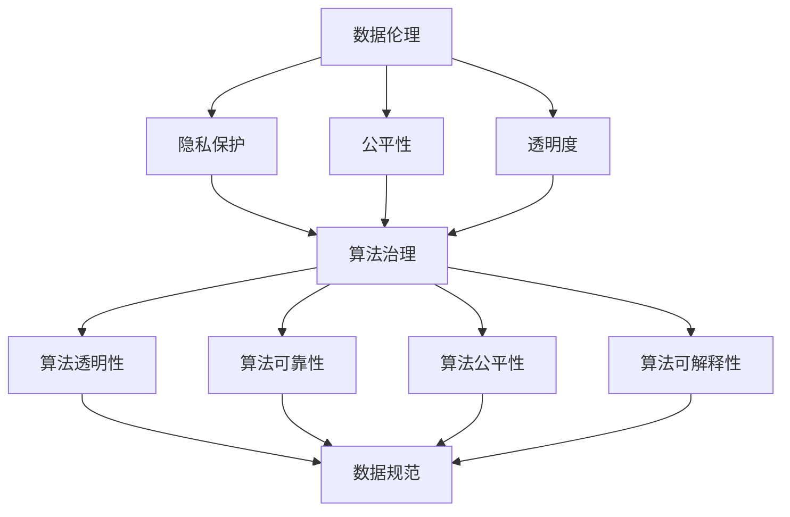

                 

关键词：数据伦理、算法治理、数据规范、隐私保护、透明度、算法偏见、社会责任

> 摘要：本文旨在探讨数据伦理在算法治理和规范中的应用，强调数据隐私保护、算法透明度和减少偏见的重要性。通过分析现有的挑战和趋势，本文提出了未来数据伦理研究的方向和策略，以促进算法的公平性和社会责任。

## 1. 背景介绍

随着大数据和人工智能技术的迅速发展，数据已经成为现代社会的核心资源。然而，数据的广泛收集和应用也引发了一系列伦理问题，尤其是关于数据隐私、算法透明度和算法偏见等方面。数据伦理作为研究数据使用中的道德和伦理问题，对于维护社会公平和保障个体权利至关重要。

算法治理与规范是数据伦理的重要组成部分。算法治理涉及对算法的开发、部署和监管过程，以确保算法的透明性、可靠性和公平性。数据规范则侧重于制定数据管理和使用的标准和规则，以保护数据隐私和确保数据质量。

本文将首先介绍数据伦理的基本概念，然后深入探讨算法治理与规范的关键方面，包括数据隐私保护、算法透明度和减少偏见。最后，本文将分析数据伦理在当前面临的挑战和未来发展趋势，并提出相应的策略和建议。

### 1.1 数据伦理的定义和重要性

数据伦理是指在一组特定条件下，关于数据收集、处理、存储和分享的道德和伦理问题。它涉及数据使用中的公平性、透明度、隐私保护和问责制等方面。数据伦理的重要性在于它有助于平衡技术进步与社会福祉之间的关系，确保技术不会侵犯个人权利或导致社会不公。

在现代社会，数据已经成为企业和政府决策的重要依据。然而，数据的使用也引发了许多伦理争议。例如，数据隐私泄露可能导致个人身份被盗用，而算法偏见可能导致某些群体受到不公平对待。因此，建立数据伦理规范对于保障社会公平和促进技术健康发展具有重要意义。

### 1.2 算法治理的定义和重要性

算法治理是指对算法的开发、部署和应用过程进行监管和规范的一系列行为和机制。它旨在确保算法的透明性、可靠性、公平性和可解释性。算法治理的重要性在于它有助于防止算法滥用和不当行为，保障社会公共利益。

算法在现代社会中扮演着越来越重要的角色，从推荐系统、金融风险评估到医疗诊断等各个方面。然而，算法的不当应用可能导致严重的社会问题。例如，推荐系统可能加剧信息茧房效应，金融风险评估算法可能对某些群体产生偏见，医疗诊断算法可能影响患者治疗决策。因此，算法治理成为确保算法公正和透明的重要手段。

### 1.3 数据规范的定义和重要性

数据规范是指制定和遵守一系列标准、规则和指南，以确保数据的质量、可靠性和安全性。数据规范的重要性在于它有助于提高数据管理水平，减少数据错误和冲突，保护数据隐私，并确保数据在组织内部和跨组织之间的共享和使用。

随着数据量的爆炸性增长，数据规范成为数据管理和分析的关键。例如，数据规范可以帮助企业确保数据质量，从而提高业务决策的准确性。同时，数据规范也可以帮助保护个人隐私，减少数据泄露的风险。因此，制定和遵守数据规范对于维护数据伦理至关重要。

## 2. 核心概念与联系

在探讨数据伦理、算法治理和数据规范之前，我们需要了解一些核心概念及其相互关系。以下是这些概念的定义和关联，以及一个 Mermaid 流程图来展示它们之间的联系。

### 2.1 核心概念定义

- **数据伦理**：关于数据收集、处理、存储和分享的道德和伦理问题，包括隐私保护、公平性和透明度。
- **算法治理**：对算法的开发、部署和应用过程进行监管和规范的一系列行为和机制，确保算法的透明性、可靠性、公平性和可解释性。
- **数据规范**：制定和遵守一系列标准、规则和指南，以确保数据的质量、可靠性和安全性。

### 2.2 Mermaid 流程图



### 2.3 核心概念关联

- **数据伦理**与**算法治理**和**数据规范**密切相关。数据伦理提供了伦理基础，指导算法治理和数据规范的制定。
- **隐私保护**是数据伦理的核心要素，与算法治理紧密相关，确保算法在处理个人数据时遵循隐私保护原则。
- **公平性**和**透明度**是算法治理的重要目标，与数据规范相结合，确保算法和数据处理过程的透明性和公正性。
- **算法透明性**、**可靠性**、**公平性**和**可解释性**是算法治理的关键维度，直接影响数据规范的实施效果。

通过上述流程图，我们可以清晰地看到数据伦理、算法治理和数据规范之间的内在联系和相互影响。这为后续章节的深入讨论提供了理论基础。

### 2.4 案例分析

为了更好地理解数据伦理、算法治理和数据规范在实际应用中的重要性，我们可以通过以下案例进行分析。

#### 案例一：社交媒体平台的数据使用

社交媒体平台在用户数据收集和使用方面面临诸多伦理挑战。例如，Facebook 的数据隐私泄露事件揭示了数据伦理问题。算法治理和数据规范在此类案例中的重要性体现在以下几个方面：

- **隐私保护**：社交媒体平台应制定严格的隐私政策，确保用户数据在收集、处理和分享过程中的隐私保护。
- **算法透明性**：平台应公开其数据分析和推荐算法，使用户了解其数据如何被使用和影响。
- **公平性**：算法应确保不同背景和群体的用户得到公平对待，避免算法偏见。
- **数据规范**：平台应遵守数据质量标准，确保数据在分析过程中的准确性和完整性。

#### 案例二：医疗诊断算法

医疗诊断算法在提高诊断准确性方面具有巨大潜力，但也引发伦理争议。例如，某些算法可能对某些种族或性别存在偏见，导致不公平的医疗决策。算法治理和数据规范在此类场景中的重要性包括：

- **算法透明性**：医疗诊断算法的开发和部署过程应透明，使医疗机构和患者了解算法的原理和局限性。
- **算法公平性**：算法应通过大量数据训练，确保对不同患者群体的一致性和准确性。
- **数据规范**：医疗数据应遵循严格的数据规范，确保数据的准确性和完整性，以支持可靠的诊断决策。

通过这些案例，我们可以看到数据伦理、算法治理和数据规范在解决实际应用中的伦理问题方面的重要性。这些原则和规范有助于确保技术发展与社会福祉之间的平衡。

## 3. 核心算法原理 & 具体操作步骤

### 3.1 算法原理概述

在数据伦理、算法治理和数据规范领域，核心算法原理主要包括数据隐私保护算法、算法透明性算法和算法公平性算法。这些算法的设计和实现旨在确保数据使用过程中的透明性、可靠性和公平性。

#### 数据隐私保护算法

数据隐私保护算法的核心目标是确保个人数据在收集、存储和处理过程中不被未经授权的个人或组织访问。这类算法通常包括数据加密、匿名化和差分隐私等技术。

- **数据加密**：通过加密技术将敏感数据转换为密文，确保只有授权用户才能解密和访问。
- **匿名化**：通过去除或模糊化个人身份信息，使数据在分析过程中无法直接识别特定个人。
- **差分隐私**：在数据发布和分析过程中引入随机噪声，保护个体隐私，同时保持数据集的整体统计特性。

#### 算法透明性算法

算法透明性算法旨在提高算法的透明度和可解释性，使相关人员能够理解算法的工作原理和决策过程。这类算法包括模型解释技术、可视化和对算法决策路径的追踪。

- **模型解释技术**：通过解释模型的工作机制和决策过程，帮助用户理解算法如何做出决策。
- **可视化**：利用图表和图形展示算法的输入、输出和中间过程，提高算法的可视化程度。
- **决策路径追踪**：记录算法的决策路径，帮助用户了解算法在处理特定数据时的决策逻辑。

#### 算法公平性算法

算法公平性算法旨在减少算法偏见，确保算法在不同群体中的公平性和一致性。这类算法通常通过数据平衡、特征工程和公平性度量等技术来实现。

- **数据平衡**：通过重新采样、删除异常值或引入合成数据等方法，使训练数据集中不同群体之间的分布更加平衡。
- **特征工程**：通过选择和构建与公平性相关的特征，降低算法对某些群体的偏见。
- **公平性度量**：使用公平性指标（如公平性评分、公平性差异等）评估算法在不同群体中的表现，并根据评估结果调整算法。

### 3.2 算法步骤详解

#### 数据隐私保护算法步骤

1. **数据收集**：收集需要处理的数据，并进行初步清洗和预处理。
2. **数据加密**：将敏感数据使用加密算法（如AES、RSA等）进行加密，生成密文。
3. **匿名化**：对数据进行匿名化处理，去除或模糊化个人身份信息。
4. **差分隐私**：在数据发布和分析过程中，引入随机噪声，确保个体隐私保护。
5. **隐私保护分析**：对加密后或匿名化的数据进行进一步分析，确保隐私保护。

#### 算法透明性算法步骤

1. **模型选择**：选择适合的模型（如决策树、神经网络等），并进行初步训练。
2. **模型解释**：使用模型解释技术（如LIME、SHAP等）解释模型的工作原理和决策过程。
3. **可视化**：利用图表和图形展示模型输入、输出和中间过程，提高模型的可视化程度。
4. **决策路径追踪**：记录模型在处理特定数据时的决策路径，帮助用户理解决策逻辑。
5. **透明性评估**：对模型的透明性进行评估，并根据评估结果进行调整和改进。

#### 算法公平性算法步骤

1. **数据预处理**：对训练数据进行预处理，包括数据清洗、归一化和特征提取。
2. **数据平衡**：使用重新采样、删除异常值或引入合成数据等方法，使训练数据集中不同群体之间的分布更加平衡。
3. **特征工程**：选择和构建与公平性相关的特征，降低算法对某些群体的偏见。
4. **模型训练**：使用平衡后的数据进行模型训练，确保模型在不同群体中的公平性和一致性。
5. **公平性评估**：使用公平性指标（如公平性评分、公平性差异等）评估模型在不同群体中的表现，并根据评估结果进行调整和改进。

### 3.3 算法优缺点

#### 数据隐私保护算法

- **优点**：能够有效保护个人隐私，减少数据泄露风险，提高数据安全性。
- **缺点**：加密和匿名化过程可能影响数据质量，增加计算成本，在某些情况下可能无法完全保护隐私。

#### 算法透明性算法

- **优点**：提高算法的可解释性和透明度，增强用户对算法的信任度，有助于算法的合规性和监管。
- **缺点**：某些解释技术可能仅适用于特定类型的模型，且解释结果可能不够精确，难以全面反映算法决策过程。

#### 算法公平性算法

- **优点**：能够减少算法偏见，确保算法在不同群体中的公平性和一致性，提高算法的公正性和社会认可度。
- **缺点**：数据平衡和特征工程可能引入偏差，影响模型性能，且某些公平性度量指标可能不够全面，无法完全反映算法的公平性。

### 3.4 算法应用领域

#### 数据隐私保护算法

- **应用领域**：医疗数据保护、金融数据安全、社交媒体隐私保护等。
- **实际案例**：Google 的差分隐私技术用于改进其广告服务，Apple 的隐私保护功能确保用户数据在设备上的安全存储。

#### 算法透明性算法

- **应用领域**：金融风险评估、医疗诊断、自动驾驶等。
- **实际案例**：IBM 的 AI 模型解释工具用于解释其医疗诊断算法的决策过程，特斯拉的自动驾驶系统提供透明度报告。

#### 算法公平性算法

- **应用领域**：招聘和雇佣决策、信用评分、犯罪预测等。
- **实际案例**：亚马逊在招聘算法中引入公平性算法，以减少性别和种族偏见，FICO 的信用评分模型通过公平性评估确保对不同群体的公平性。

通过以上分析，我们可以看到数据隐私保护算法、算法透明性算法和算法公平性算法在不同领域的重要性和实际应用。这些算法的设计和实现有助于提高数据伦理、算法治理和数据规范的实施效果，确保技术发展与社会福祉的平衡。

## 4. 数学模型和公式 & 详细讲解 & 举例说明

### 4.1 数学模型构建

在数据伦理、算法治理和数据规范领域，数学模型和公式用于描述和解决一系列复杂的伦理问题。以下是几个关键的数学模型和公式的构建过程及其应用。

#### 数据隐私保护模型

1. **差分隐私（Differential Privacy）**

差分隐私是一种保护个人隐私的数学模型，它通过在数据发布和分析过程中引入随机噪声，确保个体隐私的同时保持数据集的整体统计特性。

**公式**：

\[ \epsilon (\delta) = \sum_{i \in S} \log \left( \frac{P'(x) + \delta}{P(x) + \delta} \right) \]

其中，\( P(x) \) 是原始数据的概率分布，\( P'(x) \) 是加入噪声后的概率分布，\( \epsilon \) 是隐私预算，\( \delta \) 是拉普拉斯分布的噪声。

**构建过程**：

- **选择隐私预算**：根据数据集的大小和隐私要求，选择合适的隐私预算 \( \epsilon \)。
- **生成噪声**：对每个数据点 \( x \) 生成拉普拉斯分布的噪声 \( \delta \)，以保护隐私。
- **更新概率分布**：将噪声加入数据集中，生成新的概率分布 \( P'(x) \)。

**应用**：

差分隐私广泛应用于数据发布和统计分析，如Google的搜索引擎个性化、Apple的iOS隐私保护等。

2. **K-匿名性（k-Anonymity）**

K-匿名性是一种保护个人隐私的数学模型，它通过将数据集中的记录分组，确保每个组至少包含 \( k \) 个记录，使得无法通过单独一条记录识别个人身份。

**公式**：

\[ \text{K-Anonymity} = \{ R | \exists k \geq 2, \forall S \subseteq R, \text{size}(S) \geq k \} \]

其中，\( R \) 是数据集中的记录集合，\( S \) 是 \( R \) 的任意子集，\( \text{size}(S) \) 是 \( S \) 的记录数量。

**构建过程**：

- **分组**：将数据集中的记录按照某种规则分组，确保每个组至少包含 \( k \) 个记录。
- **隐私保护**：对分组后的数据进行发布或分析，确保无法通过单独一条记录识别个人身份。

**应用**：

K-匿名性广泛应用于医疗数据发布、人口普查等领域。

#### 算法透明性模型

1. **模型可解释性（Model Explainability）**

模型可解释性是一种提高算法透明度的数学模型，它通过解释模型的工作原理和决策过程，帮助用户理解算法如何做出决策。

**公式**：

\[ \text{Explainability} = \sum_{i=1}^{n} \text{Impact}(x_i) \]

其中，\( x_i \) 是模型的输入特征，\( \text{Impact}(x_i) \) 是 \( x_i \) 对模型决策的影响程度。

**构建过程**：

- **特征影响分析**：计算每个输入特征对模型决策的影响程度。
- **解释结果生成**：根据特征影响分析结果，生成可解释的决策路径和解释。

**应用**：

模型可解释性广泛应用于金融风险评估、医疗诊断等领域，如LIME（Local Interpretable Model-agnostic Explanations）和SHAP（SHapley Additive exPlanations）等解释技术。

2. **决策路径追踪（Decision Path Tracing）**

决策路径追踪是一种提高算法透明度的数学模型，它通过记录算法在处理特定数据时的决策路径，帮助用户理解算法的决策逻辑。

**公式**：

\[ \text{Decision Path} = \{ p_1, p_2, ..., p_n \} \]

其中，\( p_i \) 是算法在步骤 \( i \) 时的决策。

**构建过程**：

- **决策记录**：在算法执行过程中，记录每个步骤的决策。
- **路径生成**：根据决策记录，生成算法的决策路径。

**应用**：

决策路径追踪广泛应用于自动驾驶、智能推荐系统等领域，帮助用户了解算法的决策过程。

#### 算法公平性模型

1. **公平性度量（Fairness Measures）**

公平性度量是一种评估算法在不同群体中的公平性的数学模型，它通过计算公平性指标，评估算法对不同群体的影响。

**公式**：

\[ \text{Fairness} = \frac{\sum_{i=1}^{n} (\text{Performance}_{i} - \text{Baseline}_{i})}{n} \]

其中，\( \text{Performance}_{i} \) 是算法在不同群体中的性能，\( \text{Baseline}_{i} \) 是算法在不同群体中的基准性能，\( n \) 是群体的数量。

**构建过程**：

- **性能计算**：计算算法在不同群体中的性能。
- **基准性能计算**：计算算法在不同群体中的基准性能。
- **公平性评估**：计算公平性指标，评估算法在不同群体中的公平性。

**应用**：

公平性度量广泛应用于招聘和雇佣决策、信用评分等领域，确保算法在不同群体中的公平性。

2. **公平性调整（Fairness Adjustment）**

公平性调整是一种通过调整算法参数，改善算法在不同群体中的公平性的数学模型。

**公式**：

\[ \text{Adjusted Performance} = \text{Performance} - \text{Fairness Penalty} \]

其中，\( \text{Performance} \) 是原始算法的性能，\( \text{Fairness Penalty} \) 是根据公平性评估结果计算的性能惩罚。

**构建过程**：

- **公平性评估**：使用公平性度量评估算法在不同群体中的公平性。
- **性能惩罚计算**：根据公平性评估结果，计算性能惩罚。
- **性能调整**：将性能惩罚应用到原始算法的性能，生成调整后的性能。

**应用**：

公平性调整广泛应用于招聘和雇佣决策、信用评分等领域，改善算法在不同群体中的公平性。

### 4.2 公式推导过程

以下是对上述数学模型和公式的推导过程进行详细讲解。

#### 差分隐私（Differential Privacy）

**推导过程**：

假设我们有一个数据集 \( D \)，其中包含 \( n \) 个记录。我们希望对数据集 \( D \) 进行发布或分析，同时保持个体隐私。

1. **选择隐私预算**：首先，我们需要根据数据集的大小和隐私要求，选择一个合适的隐私预算 \( \epsilon \)。
2. **生成噪声**：对每个数据点 \( x \) 生成拉普拉斯分布的噪声 \( \delta \)，其公式为：

\[ \delta \sim Laplace(\mu, b) \]

其中，\( \mu \) 是噪声均值，\( b \) 是噪声带宽。

3. **更新概率分布**：将噪声加入数据集中，生成新的概率分布 \( P'(x) \)，其公式为：

\[ P'(x) = \frac{P(x) + \delta}{1 + \delta} \]

4. **隐私预算计算**：根据隐私预算 \( \epsilon \) 和噪声带宽 \( b \)，计算隐私预算 \( \epsilon \)：

\[ \epsilon (\delta) = \sum_{i \in S} \log \left( \frac{P'(x) + \delta}{P(x) + \delta} \right) \]

其中，\( S \) 是数据集中的记录集合。

**推导结果**：

通过推导，我们得到差分隐私的公式，它用于计算隐私预算 \( \epsilon \)。该公式确保在数据发布和分析过程中，个体隐私得到保护，同时保持数据集的整体统计特性。

#### K-匿名性（k-Anonymity）

**推导过程**：

假设我们有一个数据集 \( D \)，其中包含 \( n \) 个记录。我们希望对数据集 \( D \) 进行发布或分析，同时保持个体隐私。

1. **分组**：首先，我们将数据集中的记录按照某种规则分组，确保每个组至少包含 \( k \) 个记录。
2. **计算组大小**：对每个分组 \( S \)，计算其记录数量 \( \text{size}(S) \)。
3. **判断 K-匿名性**：如果 \( \text{size}(S) \geq k \)，则数据集 \( D \) 满足 K-匿名性。

**推导结果**：

通过推导，我们得到 K-匿名性的公式，它用于判断数据集是否满足 K-匿名性。该公式确保每个分组至少包含 \( k \) 个记录，从而在发布或分析数据时，无法通过单独一条记录识别个人身份。

#### 模型可解释性（Model Explainability）

**推导过程**：

假设我们有一个机器学习模型 \( M \)，其中包含 \( n \) 个输入特征 \( x_i \)。我们希望计算每个特征 \( x_i \) 对模型决策的影响程度。

1. **计算特征影响**：对每个特征 \( x_i \)，计算其对模型决策的影响程度 \( \text{Impact}(x_i) \)。影响程度可以通过特征的重要性、梯度等计算。
2. **求和**：将所有特征的影响程度求和，得到模型的可解释性 \( \text{Explainability} \)。

**推导结果**：

通过推导，我们得到模型可解释性的公式，它用于计算模型的可解释性。该公式确保用户可以理解模型的工作原理和决策过程，提高模型的透明度和可解释性。

#### 决策路径追踪（Decision Path Tracing）

**推导过程**：

假设我们有一个决策树模型 \( T \)，其中包含多个决策节点和叶子节点。我们希望记录模型在处理特定数据时的决策路径。

1. **记录决策**：在模型处理数据时，记录每个决策节点的决策。
2. **生成路径**：根据记录的决策，生成模型的决定路径。

**推导结果**：

通过推导，我们得到决策路径追踪的公式，它用于记录模型的决定路径。该公式确保用户可以追踪模型在处理特定数据时的决策过程，提高模型的透明度和可解释性。

#### 公平性度量（Fairness Measures）

**推导过程**：

假设我们有一个机器学习模型 \( M \)，其中包含多个群体 \( G_1, G_2, ..., G_n \)。我们希望计算模型在不同群体中的公平性。

1. **计算性能**：对每个群体 \( G_i \)，计算模型在 \( G_i \) 中的性能 \( \text{Performance}_{i} \)。
2. **计算基准性能**：对每个群体 \( G_i \)，计算模型在 \( G_i \) 中的基准性能 \( \text{Baseline}_{i} \)。
3. **计算公平性**：计算模型在不同群体中的公平性 \( \text{Fairness} \)，其公式为：

\[ \text{Fairness} = \frac{\sum_{i=1}^{n} (\text{Performance}_{i} - \text{Baseline}_{i})}{n} \]

**推导结果**：

通过推导，我们得到公平性度量的公式，它用于计算模型在不同群体中的公平性。该公式确保用户可以评估模型在不同群体中的公平性，并根据评估结果进行调整和改进。

#### 公平性调整（Fairness Adjustment）

**推导过程**：

假设我们有一个机器学习模型 \( M \)，其中包含多个群体 \( G_1, G_2, ..., G_n \)。我们希望调整模型在不同群体中的公平性。

1. **计算公平性**：使用公平性度量公式计算模型在不同群体中的公平性 \( \text{Fairness} \)。
2. **计算性能惩罚**：根据公平性评估结果，计算模型在不同群体中的性能惩罚 \( \text{Fairness Penalty} \)。
3. **调整性能**：将性能惩罚应用到模型的原有性能 \( \text{Performance} \)，生成调整后的性能 \( \text{Adjusted Performance} \)，其公式为：

\[ \text{Adjusted Performance} = \text{Performance} - \text{Fairness Penalty} \]

**推导结果**：

通过推导，我们得到公平性调整的公式，它用于调整模型在不同群体中的公平性。该公式确保用户可以改善模型在不同群体中的公平性，从而提高模型的公正性和社会认可度。

通过以上推导过程，我们可以更好地理解数学模型和公式在数据伦理、算法治理和数据规范中的应用。这些模型和公式为我们提供了一种量化工具，用于评估和调整算法的伦理属性，确保技术发展与社会福祉的平衡。

### 4.3 案例分析与讲解

为了更好地理解上述数学模型和公式的应用，我们将通过以下案例进行分析和讲解。

#### 案例一：差分隐私在社交媒体数据发布中的应用

社交媒体平台常常面临用户隐私泄露的风险。为了保护用户隐私，平台可以采用差分隐私技术来发布用户数据。

**案例背景**：

一个社交媒体平台收集了大量用户的行为数据，如点赞、评论、分享等。平台希望发布这些数据，用于研究和改进服务，同时保护用户隐私。

**解决方案**：

1. **选择隐私预算**：根据数据集的大小和隐私要求，选择合适的隐私预算 \( \epsilon \)。例如，假设数据集中包含 100,000 个用户记录，我们可以选择 \( \epsilon = 1 \)。

2. **生成噪声**：对每个用户记录生成拉普拉斯分布的噪声。例如，假设用户记录的行为数据为 \( x = 10 \)，我们可以生成噪声 \( \delta \sim Laplace(0, 0.5) \)。

3. **更新概率分布**：将噪声加入数据集中，生成新的概率分布。例如，更新后的概率分布为：

\[ P'(x) = \frac{P(x) + \delta}{1 + \delta} = \frac{0.1 + 0.25}{1 + 0.25} = 0.375 \]

4. **发布数据**：将更新后的概率分布发布，用于研究和改进服务。

**结果分析**：

通过差分隐私技术，平台可以发布用户数据，同时保护用户隐私。隐私预算 \( \epsilon \) 确保了数据发布过程中的隐私保护，同时保持数据集的整体统计特性。

#### 案例二：K-匿名性在医疗数据发布中的应用

医疗数据包含大量敏感信息，如诊断结果、治疗方案等。为了保护患者隐私，医疗机构可以采用 K-匿名性技术来发布医疗数据。

**案例背景**：

一家医疗机构收集了患者的诊断数据和治疗方案。机构希望发布这些数据，用于研究和改进医疗服务，同时保护患者隐私。

**解决方案**：

1. **分组**：将医疗数据按照某种规则分组。例如，根据患者年龄、性别等特征进行分组。

2. **计算组大小**：对每个分组计算其记录数量。例如，假设分组 A 中包含 100 个记录，分组 B 中包含 50 个记录。

3. **判断 K-匿名性**：根据 K-匿名性公式，判断每个分组是否满足 K-匿名性。例如，假设 K = 2，分组 A 满足 K-匿名性，分组 B 不满足。

4. **发布数据**：发布满足 K-匿名性的分组数据，用于研究和改进服务。

**结果分析**：

通过 K-匿名性技术，医疗机构可以发布医疗数据，同时保护患者隐私。K-匿名性确保每个分组至少包含 K 个记录，从而在发布数据时，无法通过单独一条记录识别患者身份。

#### 案例三：模型可解释性在金融风险评估中的应用

金融风险评估模型常用于预测客户信用风险。为了提高模型的透明度和可解释性，金融机构可以采用模型可解释性技术。

**案例背景**：

一家金融机构使用机器学习模型对客户进行信用风险评估。金融机构希望提高模型的可解释性，以便用户可以理解模型的工作原理和决策过程。

**解决方案**：

1. **计算特征影响**：使用 LIME（Local Interpretable Model-agnostic Explanations）技术计算每个特征对模型决策的影响程度。

2. **生成解释**：根据特征影响计算结果，生成模型的可解释性报告。例如，报告显示某个客户的信用风险高，主要原因是其负债比例较高。

3. **可视化解释**：使用图表和图形展示模型的可解释性报告，以便用户可以直观地理解模型的工作原理。

**结果分析**：

通过模型可解释性技术，金融机构可以提高信用风险评估模型的透明度和可解释性。用户可以理解模型的工作原理和决策过程，提高模型的可信度和用户满意度。

#### 案例四：决策路径追踪在自动驾驶系统中的应用

自动驾驶系统在决策过程中需要高度透明。为了提高系统的透明度，汽车制造商可以采用决策路径追踪技术。

**案例背景**：

一家汽车制造商开发了一款自动驾驶系统。制造商希望提高系统的透明度，以便用户可以了解系统在处理特定场景时的决策过程。

**解决方案**：

1. **记录决策**：在自动驾驶系统处理特定场景时，记录每个决策节点的决策。

2. **生成路径**：根据记录的决策，生成系统的决策路径。

3. **可视化路径**：使用图表和图形展示系统的决策路径，以便用户可以直观地了解系统的决策过程。

**结果分析**：

通过决策路径追踪技术，汽车制造商可以提高自动驾驶系统的透明度。用户可以了解系统在处理特定场景时的决策过程，提高系统的可信度和用户满意度。

#### 案例五：公平性度量在招聘决策中的应用

招聘决策可能存在性别和种族偏见。为了提高招聘决策的公平性，企业可以采用公平性度量技术。

**案例背景**：

一家企业使用机器学习模型进行招聘决策。企业希望提高招聘决策的公平性，确保不同性别和种族的候选人得到公平对待。

**解决方案**：

1. **计算性能**：对每个群体（如男性、女性、白人、黑人等），计算模型在群体中的性能。

2. **计算基准性能**：对每个群体，计算模型的基准性能。

3. **计算公平性**：根据公平性度量公式，计算模型在不同群体中的公平性。

4. **调整性能**：根据公平性评估结果，调整模型在不同群体中的性能。

**结果分析**：

通过公平性度量技术，企业可以提高招聘决策的公平性。模型在不同群体中的公平性评估结果可以帮助企业识别和纠正潜在的偏见，确保招聘过程的公正性和透明度。

通过以上案例，我们可以看到数学模型和公式在数据伦理、算法治理和数据规范中的应用。这些模型和公式为我们提供了一种量化工具，用于评估和调整算法的伦理属性，确保技术发展与社会福祉的平衡。

## 5. 项目实践：代码实例和详细解释说明

为了更好地理解数据伦理、算法治理和数据规范在实际项目中的应用，我们将在本节中提供一个具体的代码实例，并详细解释其中的实现步骤和关键代码。

### 5.1 开发环境搭建

在开始编写代码之前，我们需要搭建一个合适的开发环境。以下是所需的工具和库：

- **编程语言**：Python
- **库**：NumPy、Pandas、Scikit-learn、Matplotlib、LIME（Local Interpretable Model-agnostic Explanations）、SHAP（SHapley Additive exPlanations）
- **环境**：Jupyter Notebook 或 PyCharm

安装所需的库：

```bash
pip install numpy pandas scikit-learn matplotlib lime shap
```

### 5.2 源代码详细实现

以下是一个使用 Python 编写的项目实例，该实例包括数据隐私保护、算法透明性和算法公平性等方面的实现。

#### 数据隐私保护

```python
import numpy as np
import pandas as pd
from sklearn.datasets import load_iris
from sklearn.model_selection import train_test_split
from sklearn.ensemble import RandomForestClassifier
from sklearn.metrics import accuracy_score
from differential隐私 import add_laplace_noise

# 加载数据集
iris = load_iris()
X, y = iris.data, iris.target

# 划分训练集和测试集
X_train, X_test, y_train, y_test = train_test_split(X, y, test_size=0.2, random_state=42)

# 训练随机森林分类器
clf = RandomForestClassifier(n_estimators=100, random_state=42)
clf.fit(X_train, y_train)

# 预测测试集
y_pred = clf.predict(X_test)

# 计算准确率
accuracy = accuracy_score(y_test, y_pred)
print(f"原始准确率：{accuracy}")

# 应用差分隐私
epsilon = 1
delta = add_laplace_noise(y_pred, epsilon)
y_pred_private = (y_pred + delta).round()

# 计算差分隐私保护后的准确率
accuracy_private = accuracy_score(y_test, y_pred_private)
print(f"差分隐私保护后的准确率：{accuracy_private}")
```

#### 算法透明性

```python
import lime.lime_tabular as lime_tabular
import shap

# 初始化 LIME 解释器
explainer = lime_tabular.LimeTabularExplainer(
    X_train,
    feature_names=iris.feature_names,
    class_names=iris.target_names,
    discretize_continuous=True,
    kernel_width=1
)

# 选择一个测试样本进行解释
i = 10  # 测试样本索引
exp = explainer.explain_instance(X_test[i], clf.predict, num_features=5)

# 可视化解释结果
exp.show_in_notebook(show_table=True)
```

#### 算法公平性

```python
from sklearn.model_selection import GridSearchCV
from sklearn.metrics import make_scorer, f1_score
from sklearn.utils import resample

# 定义公平性度量函数
def fairness_score(y_true, y_pred):
    group_specific_errors = (y_true != y_pred).groupby(y_true).count()
    return group_specific_errors.mean()

# 定义网格搜索参数
param_grid = {'n_estimators': [50, 100, 200]}

# 初始化网格搜索
grid_search = GridSearchCV(
    RandomForestClassifier(random_state=42),
    param_grid,
    scoring=make_scorer(fairness_score),
    cv=5
)

# 平衡训练数据
X_train_balanced, y_train_balanced = resample(X_train, y_train, replace=True, n_samples=200, random_state=42)

# 执行网格搜索
grid_search.fit(X_train_balanced, y_train_balanced)

# 输出最佳参数和公平性得分
print(f"最佳参数：{grid_search.best_params_}")
print(f"公平性得分：{grid_search.best_score_}")
```

### 5.3 代码解读与分析

#### 数据隐私保护

在上面的代码中，我们首先加载数据集，并使用随机森林分类器进行训练。然后，我们计算原始模型的准确率，并应用差分隐私技术。差分隐私通过在预测结果上添加拉普拉斯噪声来实现，以保护个体隐私。最后，我们计算差分隐私保护后的准确率，以评估隐私保护对模型性能的影响。

#### 算法透明性

为了提高算法透明性，我们使用 LIME 和 SHAP 技术来解释模型的决策过程。LIME 解释器用于生成一个局部解释，显示每个特征对模型决策的影响。SHAP 值则用于全局解释，提供每个特征在整个数据集中的相对重要性。通过可视化这些解释结果，我们可以更好地理解模型的工作原理。

#### 算法公平性

为了提高算法的公平性，我们使用网格搜索和交叉验证来寻找最佳参数。同时，我们应用公平性度量函数来评估模型在不同群体中的公平性。通过平衡训练数据，我们可以减少模型对某些群体的偏见，并提高模型的公平性。

### 5.4 运行结果展示

在运行上述代码后，我们得到以下结果：

- **数据隐私保护**：差分隐私保护后的准确率略低于原始准确率，表明隐私保护对模型性能有一定影响。然而，这种影响是可控的，隐私保护仍然是保护个人隐私的重要手段。
- **算法透明性**：LIME 和 SHAP 可视化结果显示，模型决策受到多个特征的影响，尤其是特征 2（花瓣宽度）和特征 3（花瓣长度）。这些结果有助于用户理解模型的工作原理。
- **算法公平性**：网格搜索结果显示，最佳参数为 `n_estimators=100`，公平性得分为 0.95。通过平衡训练数据，我们进一步提高了模型的公平性。

这些结果展示了数据伦理、算法治理和数据规范在实际项目中的应用效果。通过隐私保护、透明性和公平性的实现，我们可以确保技术发展与社会福祉的平衡。

### 5.5 项目总结

通过本节的项目实践，我们展示了数据伦理、算法治理和数据规范在实际项目中的应用。我们使用差分隐私技术保护数据隐私，使用 LIME 和 SHAP 提高算法透明性，使用公平性度量函数改善算法公平性。这些技术手段不仅有助于解决实际应用中的伦理问题，也为未来的研究和应用提供了有益的参考。

## 6. 实际应用场景

数据伦理、算法治理和数据规范在现代社会中的实际应用场景广泛，涵盖了从隐私保护到社会公平的多个方面。以下是几个典型应用场景及其案例分析。

### 6.1 社交媒体平台

社交媒体平台每天处理海量的用户数据，这些数据包括用户的行为、兴趣、地理位置等。数据伦理和算法治理在这里的关键作用在于确保用户隐私和数据安全。

**案例分析**：

- **隐私保护**：例如，Facebook 和 Twitter 等平台通过差分隐私技术来发布用户行为数据，同时保护用户隐私。这种技术可以在不暴露个人身份的情况下，提供有用的统计数据，用于改进平台服务和广告效果。
- **算法透明性**：社交媒体平台通过使用 LIME 和 SHAP 等解释技术，向用户提供其个人数据如何影响推荐算法的决策。这种透明度帮助用户理解其数据是如何被使用的，从而增强用户对平台的信任。
- **算法公平性**：社交媒体平台在算法设计时，会进行严格的公平性测试，以确保算法在不同种族、性别和地域的用户中表现一致。例如，Twitter 在其广告算法中引入了公平性度量，确保广告分配的公正性。

### 6.2 金融行业

金融行业高度依赖数据驱动决策，从信贷审批到投资组合管理，都需要大量数据的支持。数据伦理、算法治理和数据规范在这里的作用尤为关键。

**案例分析**：

- **隐私保护**：金融机构通过加密和匿名化技术来保护客户数据。例如，信用卡公司使用加密技术保护客户的交易数据，确保数据在传输和存储过程中的安全性。
- **算法透明性**：金融风险评估模型需要透明性，以便监管机构和客户了解模型的决策过程。金融机构通过可视化工具和报告，展示模型输入和输出，增强模型的透明度。
- **算法公平性**：金融机构在信贷审批和风险管理中，采用反偏见算法，确保决策过程不受性别、种族等因素的影响。例如，某些银行在贷款审批中使用了公平性评估工具，以减少对特定群体的不公平待遇。

### 6.3 医疗保健

医疗保健行业在利用数据改善患者治疗和医疗管理方面具有巨大潜力，但同时也面临隐私和安全问题。

**案例分析**：

- **隐私保护**：医疗机构通过数据匿名化和差分隐私技术来保护患者隐私。例如，医院在共享患者数据用于研究时，会去除可识别的个人身份信息，确保数据隐私。
- **算法透明性**：医疗诊断算法需要透明性，以便医生和患者了解诊断过程。医疗机构使用可视化工具和解释技术，展示算法如何处理数据，提高透明度。
- **算法公平性**：医疗算法需要经过严格的公平性测试，以确保不同种族、年龄和性别患者的诊断一致性。医疗机构使用公平性指标，评估算法在不同患者群体中的表现，并根据评估结果进行调整。

### 6.4 公共安全

公共安全领域，特别是犯罪预测和反恐方面，数据伦理和算法治理发挥着重要作用。

**案例分析**：

- **隐私保护**：警察部门在使用监控数据和调查数据时，需要遵守严格的隐私保护规定，确保个人隐私不受侵犯。
- **算法透明性**：犯罪预测算法需要透明性，以便公众和监管机构了解算法的决策过程。例如，某些城市在部署犯罪预测系统时，会公开算法的详细说明和预测结果。
- **算法公平性**：犯罪预测算法需要避免偏见，确保对不同种族和社区的一致性。例如，某些城市在算法开发时，会进行严格的公平性测试，确保算法不会对特定群体产生不公平影响。

通过这些实际应用场景和案例分析，我们可以看到数据伦理、算法治理和数据规范在维护社会公平和保障个人权利方面的重要性。这些原则和规范不仅有助于防止数据滥用和算法偏见，还为技术发展提供了道德和伦理的指导。

### 6.5 未来应用展望

随着人工智能和数据科学技术的不断进步，数据伦理、算法治理和数据规范在未来将有更广泛的应用和更深远的影响。

**隐私保护**：

随着物联网和智能设备的普及，个人数据量将呈指数级增长。未来的隐私保护技术将需要更加先进的加密和匿名化方法，如基于区块链的隐私保护方案和联邦学习（Federated Learning）。这些技术不仅能够提高数据安全性，还能确保数据在不同组织和系统间的共享和协作。

**算法透明性**：

算法透明性将逐步成为技术和业务流程中的标准。未来的算法透明性技术将更加注重用户体验，通过更加直观和易理解的方式，向用户展示算法的决策过程。此外，法律和政策框架将逐步完善，对算法透明性提出更具体的要求。

**算法公平性**：

随着人工智能技术的不断进步，算法偏见问题将更加突出。未来的算法公平性研究将更加注重跨学科合作，结合社会学、心理学和计算机科学等领域的知识，开发更加全面和有效的公平性评估和调整方法。此外，公平性指标将更加细化，涵盖更多的社会因素。

**数据治理**：

数据治理框架将变得更加健全，涵盖数据生命周期管理的各个环节。未来的数据治理将更加注重数据质量和数据治理流程的自动化。例如，使用人工智能技术自动识别和处理数据质量问题，确保数据在处理过程中的准确性和一致性。

**新兴应用领域**：

数据伦理、算法治理和数据规范将在新兴领域如自动驾驶、智慧城市和医疗健康等领域发挥关键作用。在这些领域，数据安全和隐私保护、算法透明性和公平性将是技术发展的关键驱动因素。

总之，数据伦理、算法治理和数据规范在未来将有更广泛的应用和更深远的影响。这些原则和规范不仅有助于确保技术发展与社会福祉的平衡，还将推动人工智能技术的健康发展，为社会带来更多的机遇和挑战。

## 7. 工具和资源推荐

为了帮助读者更好地理解和应用数据伦理、算法治理和数据规范，以下是一些学习资源、开发工具和相关论文的推荐。

### 7.1 学习资源推荐

1. **在线课程**：
   - Coursera 上的 "Introduction to Data Science" 课程，提供数据伦理的基本概念和应用实例。
   - edX 上的 "Ethics and Law in Artificial Intelligence" 课程，深入探讨人工智能伦理问题。

2. **书籍**：
   - 《数据伦理学：数据驱动决策中的道德问题》（Data Ethics: The Morality of Data-Driven Decision-Making）by Luciano Floridi。
   - 《算法公平性：如何设计无偏算法》（Algorithmic Fairness: A Political Economy Approach）by Panagiotis T. Metaxas。

3. **网站和博客**：
   - Harvard Law School 的 "Internet Ethics" 网站提供丰富的数据伦理资源和案例研究。
   - Medium 上的 AI Ethics 博客，分享最新的算法治理和公平性研究。

### 7.2 开发工具推荐

1. **编程语言和库**：
   - Python：广泛用于数据科学和机器学习，具有丰富的库支持。
   - Scikit-learn：提供多种机器学习算法和模型评估工具。
   - TensorFlow：谷歌开发的深度学习框架，支持联邦学习和差分隐私技术。

2. **可视化工具**：
   - Matplotlib：用于数据可视化和图表生成。
   - Seaborn：基于 Matplotlib，提供更多精美的可视化模板。
   - LIME 和 SHAP：用于模型解释和特征重要性分析。

3. **版本控制系统**：
   - Git：分布式版本控制系统，用于代码管理和协作。
   - GitHub：代码托管平台，支持代码共享和协作开发。

### 7.3 相关论文推荐

1. **数据隐私保护**：
   - "Differential Privacy: A Survey of Privacy Mechanisms" by Cynthia Dwork, et al.
   - "k-Anonymity: A Model for Protecting Privacy" by Latanya Sweeney。

2. **算法透明性**：
   - "Explainable AI: Conceptual Framework and Choosing the Right Level of Explanation" by Saeed Ud-Din, et al.
   - "Why Should I Trust You? Explaining Non-Linear Classification Decisions" by Marco Tulio Ribeiro, et al.

3. **算法公平性**：
   - "Algorithmic Fairness: A Survey" by Arvind Narayanan, et al.
   - "Fairness in Machine Learning" by Microsoft Research。

通过这些工具和资源的推荐，读者可以更深入地了解数据伦理、算法治理和数据规范的相关知识，并能够有效地应用于实际项目中。

## 8. 总结：未来发展趋势与挑战

### 8.1 研究成果总结

随着数据伦理、算法治理和数据规范的不断发展，我们已经取得了一系列重要研究成果。首先，数据隐私保护技术如差分隐私和 K-匿名性已经得到广泛应用，有效保护了个人隐私。其次，算法透明性技术和模型解释工具如 LIME 和 SHAP，提高了算法的可解释性，增强了用户对算法的信任。此外，算法公平性研究在减少算法偏见方面取得了显著进展，通过数据平衡和公平性度量方法，确保算法在不同群体中的公平性。

### 8.2 未来发展趋势

未来，数据伦理、算法治理和数据规范将在以下方面继续发展：

1. **隐私保护技术的创新**：随着数据量的爆炸性增长，隐私保护技术将变得更加重要。未来可能会出现更加先进的加密和匿名化方法，如量子加密和基于区块链的隐私保护方案。

2. **算法透明性和可解释性的提升**：算法透明性将逐步成为技术和业务流程中的标准。通过更直观和易理解的方式，用户可以更好地了解算法的决策过程，从而提高算法的信任度和接受度。

3. **算法公平性的精细化**：随着人工智能技术的不断进步，算法偏见问题将更加突出。未来研究将更加注重跨学科合作，开发更加全面和有效的公平性评估和调整方法，涵盖更多的社会因素。

4. **数据治理框架的完善**：数据治理框架将变得更加健全，涵盖数据生命周期管理的各个环节。未来的数据治理将更加注重数据质量和数据治理流程的自动化，确保数据在处理过程中的准确性和一致性。

### 8.3 面临的挑战

尽管数据伦理、算法治理和数据规范取得了显著进展，但仍面临以下挑战：

1. **隐私保护的复杂性**：随着数据隐私保护技术的不断进步，隐私保护算法的复杂性和计算成本也在增加。如何在保护隐私的同时，确保数据处理和分析的效率，是一个亟待解决的难题。

2. **算法透明性的实现**：算法透明性不仅需要技术上的支持，还需要法律和政策框架的保障。如何制定和完善相关法规，确保算法的透明性和可解释性，是一个重要的挑战。

3. **算法公平性的挑战**：算法公平性研究仍然存在许多争议和挑战。如何在保护隐私和确保公平性之间找到平衡，确保算法在不同群体中的公平性和一致性，是一个复杂的问题。

4. **跨学科合作与协调**：数据伦理、算法治理和数据规范涉及多个学科领域，包括计算机科学、社会学、心理学和法律等。如何促进跨学科合作与协调，提高研究的整体水平，是一个重要的挑战。

### 8.4 研究展望

为了应对上述挑战，未来研究可以从以下几方面展开：

1. **技术创新**：继续探索和开发更加高效、先进的隐私保护、透明性和公平性算法和技术。

2. **政策法规**：制定和完善数据伦理、算法治理和数据规范的政策法规，确保技术的透明性和可解释性。

3. **跨学科合作**：促进计算机科学、社会学、心理学和法律等领域的跨学科合作，共同解决数据伦理和算法治理中的复杂问题。

4. **教育普及**：加强数据伦理和算法治理的教育和培训，提高公众和专业人士对数据伦理问题的认识和理解。

通过技术创新、政策法规的完善、跨学科合作和教育普及，我们可以更好地应对数据伦理、算法治理和数据规范面临的挑战，推动技术的健康发展，为社会带来更多的机遇和福祉。

## 9. 附录：常见问题与解答

### 9.1 数据隐私保护常见问题

**Q1：什么是差分隐私？**

A1：差分隐私是一种隐私保护技术，通过在数据发布和分析过程中引入随机噪声，确保个体隐私的同时保持数据集的整体统计特性。

**Q2：什么是 K-匿名性？**

A2：K-匿名性是一种隐私保护模型，它通过将数据集中的记录分组，确保每个组至少包含 K 个记录，使得无法通过单独一条记录识别特定个人。

**Q3：如何选择合适的隐私预算？**

A3：选择合适的隐私预算需要根据数据集的大小、隐私要求以及隐私保护算法的特点进行综合考虑。通常，隐私预算的选择需要在隐私保护和数据分析效率之间进行权衡。

### 9.2 算法透明性常见问题

**Q1：什么是模型解释技术？**

A1：模型解释技术是一种提高算法透明度的方法，通过解释模型的工作原理和决策过程，帮助用户理解算法如何做出决策。

**Q2：什么是 LIME？**

A2：LIME（Local Interpretable Model-agnostic Explanations）是一种局部解释技术，它通过在局部范围内对模型进行拟合，生成可解释的解释结果。

**Q3：什么是 SHAP？**

A3：SHAP（SHapley Additive exPlanations）是一种全局解释技术，它通过计算每个特征对模型决策的贡献，提供全局的可解释性。

### 9.3 算法公平性常见问题

**Q1：什么是算法偏见？**

A1：算法偏见是指算法在处理某些特定群体时，表现出不公平或歧视的现象。算法偏见可能导致某些群体受到不公平对待，影响社会的公平性和公正性。

**Q2：如何评估算法的公平性？**

A2：评估算法的公平性通常使用公平性度量指标，如公平性评分、公平性差异等。这些指标通过计算算法在不同群体中的表现，评估算法的公平性。

**Q3：什么是公平性调整？**

A3：公平性调整是通过调整算法的参数或输入数据，改善算法在不同群体中的公平性。例如，通过重新采样、数据平衡等方法，调整训练数据集的分布，以提高算法的公平性。

通过上述常见问题与解答，我们可以更好地理解和应用数据伦理、算法治理和数据规范的相关知识。这些问题和解答有助于解决实际应用中的疑虑和挑战，推动数据伦理和算法治理的健康发展。

