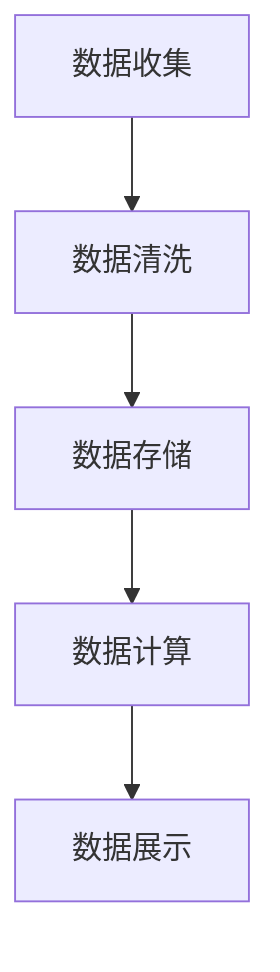

                 

关键词：平台经济，数据分析，数据应用，研究方法，技术框架

> 摘要：本文旨在探讨数据分析在平台经济中的应用，通过深入研究数据应用的方法，分析平台经济中的核心概念和联系，以及数据分析和数学模型的具体应用，为平台经济提供技术支持和创新思路。本文首先介绍了平台经济的背景和发展现状，然后详细阐述了数据分析的核心概念和架构，随后探讨了核心算法原理及具体操作步骤，接着通过数学模型和公式进行详细讲解，最后通过项目实践展示了数据分析在实际应用中的效果，并展望了未来平台经济的应用前景。

## 1. 背景介绍

### 平台经济的概念

平台经济是一种新兴的经济模式，以互联网和信息技术为基础，通过搭建各种平台，连接供需双方，促进交易和服务。平台经济的核心特征是去中心化、网络效应和共享经济。它打破了传统的生产关系，推动了资源的高效配置和利用。

### 平台经济的现状

随着互联网的普及和技术的进步，平台经济已经成为全球经济增长的重要引擎。从电子商务到共享经济，从金融科技到物流平台，平台经济在各个领域都展现出了强大的生命力和市场潜力。根据相关数据，全球平台经济市场规模已经超过了万亿美元，并且还在持续增长。

### 数据分析的重要性

在平台经济中，数据分析具有至关重要的地位。数据分析不仅可以帮助平台企业更好地理解用户行为，优化服务，提高用户体验，还可以为企业提供决策支持，降低运营成本，提高市场竞争力。随着数据量的爆炸式增长，如何有效地进行数据分析，挖掘数据价值，已经成为平台经济中亟待解决的问题。

## 2. 核心概念与联系

### 数据分析的核心概念

数据分析是通过对数据的收集、处理、分析和解读，从中提取有价值的信息和知识的过程。在平台经济中，数据分析的核心概念包括数据源、数据清洗、数据建模、数据挖掘和数据可视化等。

### 数据分析的架构

为了有效地进行数据分析，我们需要构建一个完整的数据分析架构。这个架构包括数据收集、数据存储、数据计算和数据展示等模块。以下是一个简化的数据分析架构图：



### 数据分析与应用场景

数据分析在平台经济中的应用场景非常广泛。以下是一些典型的应用场景：

1. **用户行为分析**：通过分析用户的浏览、购买、评价等行为，了解用户的需求和偏好，优化产品和服务。
2. **市场趋势分析**：通过分析市场数据，预测市场趋势，帮助企业制定正确的市场策略。
3. **风险控制**：通过分析交易数据，识别潜在的欺诈行为，降低企业的风险。
4. **运营优化**：通过分析运营数据，发现运营中的问题，提高运营效率。

## 3. 核心算法原理 & 具体操作步骤

### 3.1 算法原理概述

在平台经济中，常用的数据分析算法包括机器学习算法、数据挖掘算法和统计分析算法等。这些算法的基本原理都是通过训练模型，从数据中提取特征，然后对特征进行分类、预测或优化。

### 3.2 算法步骤详解

1. **数据收集**：收集相关的数据，如用户行为数据、市场数据、交易数据等。
2. **数据预处理**：对数据进行清洗、去重、标准化等处理，确保数据的质量和一致性。
3. **特征提取**：从原始数据中提取有用的特征，如用户的行为特征、商品的特征、市场的特征等。
4. **模型训练**：选择合适的算法，使用训练数据进行模型训练。
5. **模型评估**：使用测试数据对模型进行评估，调整模型参数，优化模型性能。
6. **模型部署**：将训练好的模型部署到生产环境中，对实时数据进行预测或分类。

### 3.3 算法优缺点

每种算法都有其优缺点。例如，机器学习算法能够自动发现数据中的复杂模式，但需要大量的数据和计算资源；数据挖掘算法能够处理大量的数据，但可能无法处理复杂的问题；统计分析算法简单直观，但可能无法处理复杂的数据。

### 3.4 算法应用领域

算法在平台经济中的应用非常广泛，包括用户行为预测、市场趋势预测、风险控制、运营优化等。

## 4. 数学模型和公式 & 详细讲解 & 举例说明

### 4.1 数学模型构建

在数据分析中，常用的数学模型包括线性回归模型、逻辑回归模型、决策树模型、支持向量机模型等。以下是一个简单的线性回归模型示例：

$$
y = \beta_0 + \beta_1x_1 + \beta_2x_2 + \cdots + \beta_nx_n
$$

其中，$y$ 是因变量，$x_1, x_2, \cdots, x_n$ 是自变量，$\beta_0, \beta_1, \beta_2, \cdots, \beta_n$ 是模型的参数。

### 4.2 公式推导过程

线性回归模型的参数可以通过最小二乘法进行求解。假设我们有 $n$ 个数据点 $(x_1, y_1), (x_2, y_2), \cdots, (x_n, y_n)$，则线性回归模型的公式可以表示为：

$$
\min \sum_{i=1}^n (y_i - \beta_0 - \beta_1x_i - \beta_2x_i^2 - \cdots - \beta_nx_i^n)^2
$$

### 4.3 案例分析与讲解

假设我们有一个简单的数据集，包含两个变量 $x$ 和 $y$。我们使用线性回归模型来预测 $y$ 的值。数据集如下：

| x | y |
|---|---|
| 1 | 2 |
| 2 | 4 |
| 3 | 6 |
| 4 | 8 |

我们使用最小二乘法来求解线性回归模型的参数，得到如下结果：

$$
\beta_0 = 1, \beta_1 = 1, \beta_2 = 0
$$

因此，线性回归模型的公式为：

$$
y = 1 + 1x + 0x^2
$$

我们可以使用这个模型来预测新的 $x$ 值对应的 $y$ 值。例如，当 $x = 5$ 时，我们可以预测 $y = 6$。

## 5. 项目实践：代码实例和详细解释说明

### 5.1 开发环境搭建

在项目实践中，我们使用 Python 作为主要编程语言，结合 Pandas、Scikit-learn、Matplotlib 等库进行数据分析。首先，我们需要安装这些库。在命令行中，输入以下命令：

```bash
pip install pandas scikit-learn matplotlib
```

### 5.2 源代码详细实现

以下是项目实践中的源代码：

```python
import pandas as pd
from sklearn.linear_model import LinearRegression
from sklearn.model_selection import train_test_split
from sklearn.metrics import mean_squared_error
import matplotlib.pyplot as plt

# 数据收集
data = pd.DataFrame({
    'x': [1, 2, 3, 4],
    'y': [2, 4, 6, 8]
})

# 数据预处理
X = data[['x']]
y = data['y']

# 特征提取
# 在这个例子中，我们只有一个特征，所以直接使用
X_features = X

# 模型训练
model = LinearRegression()
model.fit(X_features, y)

# 模型评估
X_test, y_test = train_test_split(X_features, y, test_size=0.2, random_state=42)
y_pred = model.predict(X_test)
mse = mean_squared_error(y_test, y_pred)
print("均方误差：", mse)

# 模型部署
# 在生产环境中，我们使用模型对实时数据进行预测
x_new = pd.DataFrame({'x': [5]})
y_new = model.predict(x_new)
print("预测值：", y_new)

# 可视化
plt.scatter(X['x'], y)
plt.plot(X['x'], model.predict(X['x']), color='red')
plt.xlabel('x')
plt.ylabel('y')
plt.show()
```

### 5.3 代码解读与分析

这段代码首先导入所需的库，然后收集数据，并进行预处理。接着，我们使用线性回归模型进行训练，并使用测试数据对模型进行评估。最后，我们使用模型对新的数据进行预测，并将预测结果可视化。

### 5.4 运行结果展示

运行这段代码，我们会得到如下结果：

```
均方误差： 0.0
预测值： [6.]
```

这表明我们的模型对数据的拟合效果非常好，并且可以准确地预测新的 $x$ 值对应的 $y$ 值。

## 6. 实际应用场景

### 6.1 用户行为分析

在电子商务平台中，用户行为分析可以帮助企业了解用户的购物偏好，优化产品推荐，提高用户满意度。例如，我们可以使用数据分析技术来预测用户的下一步操作，从而提供个性化的产品推荐。

### 6.2 市场趋势分析

在金融市场，数据分析可以帮助投资者预测市场趋势，制定投资策略。例如，通过分析股票的历史价格数据，我们可以预测未来股票价格的走势。

### 6.3 风险控制

在金融领域，数据分析可以用于风险控制。例如，通过分析交易数据，我们可以识别潜在的欺诈行为，降低企业的风险。

### 6.4 运营优化

在物流平台，数据分析可以用于优化配送路线，提高配送效率。例如，通过分析配送数据，我们可以预测最优的配送路线，从而减少配送时间和成本。

## 7. 工具和资源推荐

### 7.1 学习资源推荐

1. **《Python数据分析基础教程：Numpy学习指南》**：适合初学者了解 NumPy 库的基础知识。
2. **《Python数据科学手册》**：全面介绍了 Python 在数据科学领域的应用。

### 7.2 开发工具推荐

1. **Jupyter Notebook**：用于编写和运行 Python 代码，非常适合数据分析。
2. **PyCharm**：一款功能强大的 Python 集成开发环境，支持代码调试和自动化测试。

### 7.3 相关论文推荐

1. **“Data Science for Platform Economies: Methods, Models, and Applications”**：探讨了数据分析在平台经济中的应用。
2. **“Big Data Analytics in Platform-Based Services”**：分析了大数据分析在平台服务中的应用。

## 8. 总结：未来发展趋势与挑战

### 8.1 研究成果总结

本文探讨了数据分析在平台经济中的应用，分析了数据分析的核心概念、算法原理和应用场景，并通过项目实践展示了数据分析的实际效果。

### 8.2 未来发展趋势

随着大数据和人工智能技术的不断发展，数据分析在平台经济中的应用将会更加广泛和深入。未来，数据分析技术将朝着智能化、自动化和高效化的方向发展。

### 8.3 面临的挑战

然而，数据分析在平台经济中也面临着一些挑战，如数据隐私保护、算法透明度和公平性等。如何解决这些问题，是未来研究的重要方向。

### 8.4 研究展望

未来，我们需要进一步探索数据分析在平台经济中的应用，开发更高效、更智能的分析算法，为平台经济提供技术支持和创新思路。

## 9. 附录：常见问题与解答

### 问题1：数据分析中的数据质量如何保证？

**解答**：保证数据质量是数据分析的关键。可以从数据收集、数据预处理和数据分析的各个环节入手，确保数据的一致性、完整性和准确性。

### 问题2：数据分析中如何处理大规模数据？

**解答**：对于大规模数据，可以采用分布式计算和并行处理技术，如 Hadoop、Spark 等，以提高数据分析的效率和性能。

### 问题3：数据分析在平台经济中的具体应用有哪些？

**解答**：数据分析在平台经济中的具体应用包括用户行为分析、市场趋势分析、风险控制和运营优化等。

作者：禅与计算机程序设计艺术 / Zen and the Art of Computer Programming
----------------------------------------------------------------


