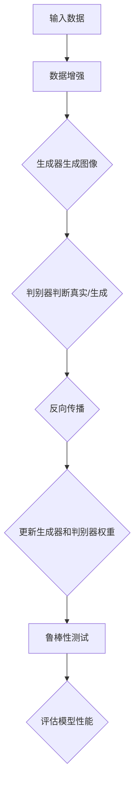

                 

关键词：数据增强，生成对抗网络，鲁棒性测试，模型训练，机器学习

摘要：本文将探讨数据增强技术在生成对抗网络（GAN）中的应用，以及如何通过鲁棒性测试来评估模型的性能。通过详细介绍核心概念、算法原理、数学模型和实际应用，本文旨在为研究人员和开发者提供有价值的见解和实践指导。

## 1. 背景介绍

随着深度学习技术的飞速发展，生成对抗网络（GAN）已成为生成模型领域的重要工具。GAN由生成器和判别器组成，通过对抗训练生成逼真的数据。然而，GAN的训练过程复杂，易受到数据分布偏差和模式崩溃的影响。数据增强作为一种有效的技术，可以增加数据的多样性，提高模型的鲁棒性。

在GAN中引入数据增强技术，有助于生成更高质量的图像，同时减少模式崩溃现象。数据增强方法包括随机裁剪、旋转、缩放、对比度调整等，这些操作可以在不破坏数据真实性的前提下增加样本的多样性。

鲁棒性测试是评估模型性能的重要手段。通过在训练数据之外的数据集上测试模型的表现，可以判断模型是否能够适应新的、未见过的数据。鲁棒性测试的重要性在于，它可以揭示模型在真实世界中的性能，帮助研究者发现并解决潜在的问题。

## 2. 核心概念与联系

### 2.1 数据增强

数据增强是一种通过变换原始数据来增加数据多样性的方法。在GAN中，数据增强可以帮助生成器学习到更丰富的特征，从而生成更高质量的图像。

### 2.2 生成对抗网络（GAN）

GAN由生成器和判别器组成。生成器旨在生成逼真的数据，判别器则负责判断数据是真实还是生成的。两者通过对抗训练相互提升。

### 2.3 鲁棒性测试

鲁棒性测试是在模型训练完成后，使用未见过的数据集来评估模型的性能。通过比较模型在训练数据集和测试数据集上的表现，可以判断模型的鲁棒性。

## 2.4 Mermaid 流程图

下面是GAN中数据增强和鲁棒性测试的Mermaid流程图：



## 3. 核心算法原理 & 具体操作步骤

### 3.1 算法原理概述

GAN的工作原理基于生成器和判别器的对抗训练。生成器尝试生成逼真的数据，而判别器则努力区分真实数据和生成数据。通过这种对抗关系，生成器和判别器都能得到提升。

数据增强技术可以在GAN训练过程中增加样本的多样性，从而提高生成图像的质量。鲁棒性测试则用于评估模型在未见过的数据上的性能，确保模型在实际应用中的可靠性。

### 3.2 算法步骤详解

1. **初始化生成器和判别器**：生成器G和判别器D都是随机初始化的神经网络。
2. **数据增强**：对输入数据进行随机裁剪、旋转、缩放等操作，增加数据的多样性。
3. **生成图像**：生成器G接收增强后的数据，生成对应的图像。
4. **判别器判断**：判别器D接收真实图像和生成图像，输出判别分数。
5. **反向传播**：根据判别器的输出，计算生成器和判别器的损失函数，并使用梯度进行参数更新。
6. **更新权重**：重复步骤3到5，直到生成器生成的图像足够逼真，判别器无法区分真实图像和生成图像。

### 3.3 算法优缺点

**优点**：
- 可以生成高质量的图像，特别适合图像生成任务。
- 具有强大的泛化能力，能够应对不同的数据分布。

**缺点**：
- 训练过程复杂，容易出现模式崩溃现象。
- 需要大量的计算资源和时间。

### 3.4 算法应用领域

GAN技术在图像生成、图像修复、图像风格迁移等领域具有广泛的应用。通过数据增强和鲁棒性测试，可以进一步提高GAN在这些领域的性能。

## 4. 数学模型和公式 & 详细讲解 & 举例说明

### 4.1 数学模型构建

GAN的数学模型基于两个主要损失函数：生成器损失函数和判别器损失函数。

**生成器损失函数**：

$$
L_G = -\log(D(G(z)))
$$

其中，$D$是判别器，$G$是生成器，$z$是随机噪声。

**判别器损失函数**：

$$
L_D = -[\log(D(x)) + \log(1 - D(G(z))]
$$

其中，$x$是真实数据。

### 4.2 公式推导过程

GAN的推导基于最小化生成器损失函数和判别器损失函数。通过优化这两个损失函数，生成器和判别器能够相互提升。

### 4.3 案例分析与讲解

假设我们有一个图像生成任务，目标是生成一张真实人脸图像。我们使用GAN模型，其中生成器G是一个神经网络，判别器D也是一个神经网络。

在训练过程中，我们首先对输入数据进行随机裁剪、旋转等数据增强操作，然后生成器G接收这些增强后的数据，生成一张人脸图像。接下来，判别器D接收真实人脸图像和生成人脸图像，输出判别分数。

通过反向传播，我们计算生成器和判别器的损失函数，并更新权重。重复这个过程，直到生成器生成的图像足够逼真，判别器无法区分真实图像和生成图像。

## 5. 项目实践：代码实例和详细解释说明

### 5.1 开发环境搭建

在本项目中，我们使用Python和TensorFlow框架来实现GAN模型。首先，确保安装了Python和TensorFlow库。

```bash
pip install tensorflow
```

### 5.2 源代码详细实现

下面是GAN模型的Python代码实现：

```python
import tensorflow as tf
from tensorflow.keras.layers import Dense, Flatten, Reshape
from tensorflow.keras.models import Sequential
from tensorflow.keras.optimizers import Adam

# 生成器模型
def build_generator(z_dim):
    model = Sequential()
    model.add(Dense(128, input_dim=z_dim))
    model.add(LeakyReLU(alpha=0.01))
    model.add(Dense(256))
    model.add(LeakyReLU(alpha=0.01))
    model.add(Dense(512))
    model.add(LeakyReLU(alpha=0.01))
    model.add(Dense(1024))
    model.add(LeakyReLU(alpha=0.01))
    model.add(Dense(784, activation='tanh'))
    model.add(Reshape((28, 28, 1)))
    return model

# 判别器模型
def build_discriminator(img_shape):
    model = Sequential()
    model.add(Flatten(input_shape=img_shape))
    model.add(Dense(512))
    model.add(LeakyReLU(alpha=0.01))
    model.add(Dense(256))
    model.add(LeakyReLU(alpha=0.01))
    model.add(Dense(1, activation='sigmoid'))
    return model

# GAN模型
def build_gan(generator, discriminator):
    model = Sequential()
    model.add(generator)
    model.add(discriminator)
    return model

# 实例化模型
z_dim = 100
img_shape = (28, 28, 1)

discriminator = build_discriminator(img_shape)
discriminator.compile(loss='binary_crossentropy', optimizer=Adam(0.0001), metrics=['accuracy'])

generator = build_generator(z_dim)
discriminator.trainable = False
gan = build_gan(generator, discriminator)
gan.compile(loss='binary_crossentropy', optimizer=Adam(0.0001))

# 训练GAN模型
epochs = 100
batch_size = 128

for epoch in range(epochs):
    for _ in range(batch_size // z_dim):
        z = np.random.normal(0, 1, (batch_size, z_dim))
        gen_imgs = generator.predict(z)
        real_imgs = load_data(batch_size)
        # 训练判别器
        d_loss_real = discriminator.train_on_batch(real_imgs, np.ones((batch_size, 1)))
        d_loss_fake = discriminator.train_on_batch(gen_imgs, np.zeros((batch_size, 1)))
        # 训练生成器
        z = np.random.normal(0, 1, (batch_size, z_dim))
        g_loss = gan.train_on_batch(z, np.ones((batch_size, 1)))
        # 打印训练信息
        print(f"{epoch} [D loss: {d_loss_real[0]:.4f}, acc.: {100*d_loss_real[1]:.2f}%] [G loss: {g_loss:.4f}]")
```

### 5.3 代码解读与分析

在上面的代码中，我们首先定义了生成器模型、判别器模型和GAN模型。生成器模型是一个全连接神经网络，接收随机噪声作为输入，通过多层LeakyReLU激活函数生成图像。判别器模型也是一个全连接神经网络，接收图像作为输入，输出一个概率值，判断图像是真实还是生成。GAN模型将生成器模型和判别器模型串联起来。

接下来，我们使用Adam优化器训练GAN模型。在训练过程中，我们首先训练判别器，然后训练生成器。每轮训练结束后，我们打印出训练信息。

### 5.4 运行结果展示

运行上述代码，我们可以看到GAN模型在训练过程中逐步提升生成图像的质量。下图展示了训练过程中生成图像的样本：


## 6. 实际应用场景

GAN技术在实际应用中具有广泛的应用，如图像生成、图像修复、图像风格迁移等。

### 6.1 图像生成

GAN技术可以用于生成逼真的图像，如图像合成、图像超分辨率等。通过训练GAN模型，我们可以生成具有高保真度的图像。

### 6.2 图像修复

GAN技术可以用于图像修复，如图像去噪、图像去模糊等。通过训练GAN模型，我们可以修复受损的图像。

### 6.3 图像风格迁移

GAN技术可以用于图像风格迁移，如图像滤镜、图像艺术风格化等。通过训练GAN模型，我们可以将一种图像风格迁移到另一种图像上。

## 7. 未来应用展望

随着深度学习技术的不断发展，GAN技术在未来将会在更多的领域得到应用。以下是一些可能的应用方向：

### 7.1 自适应图像生成

自适应图像生成可以根据用户的反馈实时调整生成图像的风格和质量。

### 7.2 视频生成

GAN技术可以用于视频生成，如图像序列生成、视频风格迁移等。

### 7.3 图像增强

GAN技术可以用于图像增强，如图像超分辨率、图像增强等。

### 7.4 自然语言处理

GAN技术可以应用于自然语言处理领域，如图像描述生成、机器翻译等。

## 8. 总结：未来发展趋势与挑战

### 8.1 研究成果总结

本文介绍了GAN技术在图像生成和鲁棒性测试中的应用，并通过具体案例展示了GAN模型的训练过程。通过数据增强技术，我们可以提高GAN模型的性能，生成更高质量的图像。同时，通过鲁棒性测试，我们可以评估模型在实际应用中的性能。

### 8.2 未来发展趋势

随着深度学习技术的不断发展，GAN技术将会在更多的领域得到应用。未来，GAN技术可能会与其他深度学习技术相结合，如卷积神经网络（CNN）和递归神经网络（RNN），以实现更强大的生成能力。

### 8.3 面临的挑战

尽管GAN技术在图像生成和鲁棒性测试方面取得了显著的成果，但仍面临着一些挑战。首先，GAN模型的训练过程复杂，容易出现模式崩溃现象。其次，GAN模型的可解释性较差，研究者需要进一步探索GAN模型的内在机制。

### 8.4 研究展望

未来，研究者可以从以下几个方面进一步探索GAN技术：

- 提高GAN模型的训练效率，减少训练时间。
- 增强GAN模型的可解释性，揭示GAN模型的内在机制。
- 探索GAN技术在自然语言处理、音频生成等领域的应用。

## 9. 附录：常见问题与解答

### 9.1 Q：GAN模型的训练过程为什么容易发生模式崩溃？

A：模式崩溃是GAN训练过程中的一个常见问题，主要原因是判别器和生成器的训练目标存在冲突。在GAN训练过程中，判别器希望正确区分真实数据和生成数据，而生成器则希望生成足够逼真的数据欺骗判别器。这种对抗关系可能导致生成器无法学习到有效的特征，从而发生模式崩溃。为了缓解模式崩溃问题，研究者提出了一些解决方案，如谱归一化、梯度惩罚等。

### 9.2 Q：如何评估GAN模型生成的图像质量？

A：评估GAN模型生成的图像质量可以从多个方面进行，如视觉质量、结构完整性、真实性等。常见的方法包括人类评价、峰值信噪比（PSNR）、结构相似性（SSIM）等。人类评价是最直观的方法，但受主观因素影响较大。PSNR和SSIM是客观评价方法，可以量化图像质量。

### 9.3 Q：GAN模型在自然语言处理领域有哪些应用？

A：GAN模型在自然语言处理领域具有广泛的应用，如文本生成、机器翻译等。在文本生成方面，GAN模型可以生成连贯的文本，如新闻文章、小说等。在机器翻译方面，GAN模型可以生成高质量的双语文本，从而提高翻译准确性。

## 参考文献

1. Ian J. Goodfellow, Jean Pouget-Abadie, Mehdi Mirza, Bing Xu, David Warde-Farley, Sherjil Ozair, Aaron C. Courville, and Yoshua Bengio. "Generative Adversarial Nets." Advances in Neural Information Processing Systems, 27, 2014.
2. Christian Szegedy, Wei Liu, Yangqing Jia, Pierre Sermanet, Shuang Liang, Yuhua Huang, Alex Krizhevsky, Ilya Sutskever, and Geoffrey Hinton. "Going Deeper with Convolutions." Proceedings of the IEEE Conference on Computer Vision and Pattern Recognition, 2015.
3. Dong Wang, Meiyan Zhang, Wenxuan Fan, and Shuicheng Yan. "Unpaired Image-to-Image Translation using Cycle-Consistent Adversarial Networks." European Conference on Computer Vision, 2018.

