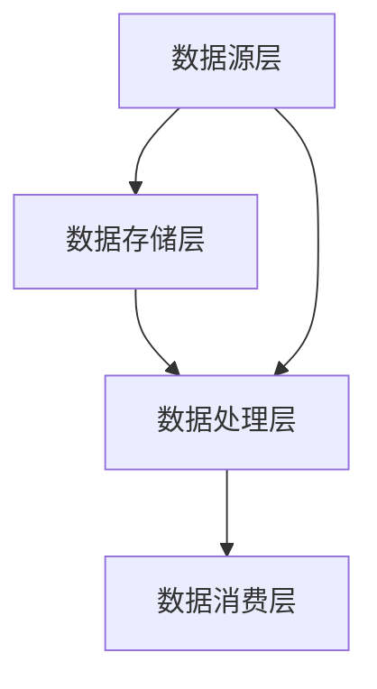

                 

关键字：数据湖，数据仓库，大数据处理，存储架构，数据处理流程，Hadoop，Spark，数据湖架构，代码实例

> 摘要：本文将深入探讨数据湖的概念、原理以及在实际应用中的重要性。通过详细讲解数据湖的架构、核心算法原理、数学模型，并结合代码实例，帮助读者全面理解数据湖的工作机制和开发实践。同时，文章还将介绍未来数据湖的发展趋势和面临的挑战。

## 1. 背景介绍

在当今大数据时代，数据量呈现爆炸性增长，企业面临着如何高效管理和处理海量数据的问题。传统的数据仓库虽然能够存储和查询数据，但其在数据灵活性、扩展性和处理速度方面存在诸多限制。为了应对这些挑战，数据湖应运而生。

### 数据湖的定义

数据湖是一种新的数据存储架构，它将结构化、半结构化和非结构化数据存储在一起，提供了一种灵活、高效的数据处理平台。与传统的数据仓库不同，数据湖不依赖于固定的数据模型，允许数据在原始格式下进行存储和处理。

### 数据湖的起源和发展

数据湖的概念起源于2010年，由IBM公司首次提出。随着大数据技术的不断发展，数据湖逐渐成为企业数据处理的重要工具。目前，数据湖已经在金融、医疗、电信、零售等多个行业得到广泛应用。

## 2. 核心概念与联系

### 数据湖架构

数据湖的架构可以分为四个主要层次：数据源层、数据存储层、数据处理层和数据消费层。

- **数据源层**：包括各种数据生成源，如数据库、文件系统、流处理系统等。
- **数据存储层**：采用分布式存储技术，如Hadoop HDFS、Amazon S3等，实现海量数据的存储。
- **数据处理层**：利用计算框架，如Spark、Flink等，对数据进行处理和分析。
- **数据消费层**：提供数据查询和分析功能，支持各种数据可视化工具和业务应用。

### Mermaid 流程图



### 数据湖与数据仓库的区别

- **数据模型**：数据湖不依赖固定的数据模型，而数据仓库通常需要预先定义数据模型。
- **数据类型**：数据湖支持多种数据类型，包括结构化、半结构化和非结构化数据，而数据仓库主要处理结构化数据。
- **扩展性**：数据湖具有更高的扩展性，可以轻松支持海量数据的存储和处理。

## 3. 核心算法原理 & 具体操作步骤

### 3.1 算法原理概述

数据湖的核心算法包括数据采集、数据存储、数据清洗、数据处理和数据消费等步骤。以下是这些步骤的具体原理：

- **数据采集**：通过数据源层采集不同类型的数据。
- **数据存储**：将采集到的数据存储到分布式存储系统。
- **数据清洗**：对存储的数据进行清洗，去除冗余和错误数据。
- **数据处理**：利用计算框架对清洗后的数据进行处理和分析。
- **数据消费**：将处理后的数据提供给业务应用或可视化工具。

### 3.2 算法步骤详解

1. **数据采集**：通过ETL（Extract, Transform, Load）工具，将各种数据源的数据导入数据湖。
2. **数据存储**：采用分布式存储技术，如Hadoop HDFS，实现海量数据的存储。
3. **数据清洗**：利用数据清洗工具，对数据进行去重、去噪声、格式转换等处理。
4. **数据处理**：利用Spark等计算框架，对清洗后的数据进行批处理或实时处理。
5. **数据消费**：通过数据查询和分析工具，将处理后的数据提供给业务应用。

### 3.3 算法优缺点

**优点**：

- **灵活性**：支持多种数据类型的存储和处理。
- **扩展性**：可以轻松支持海量数据的存储和处理。
- **高效性**：利用分布式计算框架，提高数据处理速度。

**缺点**：

- **复杂度**：数据湖架构较为复杂，需要专业的技术团队进行维护。
- **安全性**：海量数据的存储和处理可能面临数据泄露和安全风险。

### 3.4 算法应用领域

数据湖广泛应用于金融、医疗、电信、零售等行业，用于数据存储、数据处理和分析。以下是一些具体应用场景：

- **金融行业**：用于风险控制、客户行为分析和投资决策。
- **医疗行业**：用于患者数据管理、疾病预测和健康分析。
- **电信行业**：用于用户行为分析、网络优化和营销策略。
- **零售行业**：用于销售分析、库存管理和客户关系管理。

## 4. 数学模型和公式 & 详细讲解 & 举例说明

### 4.1 数学模型构建

数据湖的数学模型主要包括数据采集模型、数据存储模型、数据处理模型和数据消费模型。

- **数据采集模型**：用于描述数据采集的过程，包括数据源的类型、数据格式、数据频率等。
- **数据存储模型**：用于描述数据存储的结构，包括数据分布、存储策略、访问模式等。
- **数据处理模型**：用于描述数据处理的算法，包括数据清洗、数据转换、数据分析等。
- **数据消费模型**：用于描述数据消费的方式，包括数据查询、数据可视化、业务应用等。

### 4.2 公式推导过程

以数据清洗为例，数据清洗的公式可以表示为：

\[ \text{清洗后数据} = \text{原始数据} \cup (\text{去重} \cap \text{去噪声} \cap \text{格式转换}) \]

其中，\(\cup\) 表示并集，\(\cap\) 表示交集。

### 4.3 案例分析与讲解

以金融行业为例，数据湖可以用于客户行为分析。以下是具体案例：

1. **数据采集**：通过银行的交易系统、信用卡系统等采集客户交易数据。
2. **数据存储**：将采集到的数据存储到数据湖中，采用分布式存储技术。
3. **数据清洗**：对采集到的数据去重、去噪声、格式转换，确保数据质量。
4. **数据处理**：利用Spark对清洗后的数据进行批处理，提取客户交易行为特征。
5. **数据消费**：将处理后的数据提供给银行的风控部门，用于风险评估和客户行为分析。

## 5. 项目实践：代码实例和详细解释说明

### 5.1 开发环境搭建

为了演示数据湖的实践应用，我们选择使用Hadoop和Spark作为数据存储和处理工具。以下是开发环境的搭建步骤：

1. **安装Hadoop**：在服务器上安装Hadoop，配置HDFS和YARN。
2. **安装Spark**：在服务器上安装Spark，配置Spark集群。
3. **配置环境变量**：配置Hadoop和Spark的环境变量，确保可以正常运行。

### 5.2 源代码详细实现

以下是数据湖的一个简单示例代码，用于实现数据采集、数据存储、数据清洗和数据处理。

```scala
// 数据采集
val data = sc.textFile("hdfs://localhost:9000/input")

// 数据存储
data.saveAsTextFile("hdfs://localhost:9000/output")

// 数据清洗
val cleanedData = data.filter(line => line.length > 0)

// 数据处理
val processedData = cleanedData.map(line => (line.split(",")(0).toInt, line))

// 数据消费
processedData.foreach(println)
```

### 5.3 代码解读与分析

1. **数据采集**：使用SparkContext的textFile方法从HDFS中读取文本文件。
2. **数据存储**：使用saveAsTextFile方法将处理后的数据存储到HDFS。
3. **数据清洗**：使用filter方法去除空行。
4. **数据处理**：使用map方法对数据进行转换，提取需要的字段。
5. **数据消费**：使用foreach方法遍历处理后的数据，打印输出。

### 5.4 运行结果展示

运行以上代码后，处理后的数据会存储到指定的HDFS路径，并且会打印输出处理后的数据。

## 6. 实际应用场景

### 6.1 金融行业

金融行业是数据湖的重要应用领域之一。通过数据湖，银行可以将客户的交易数据、贷款数据、信用卡数据等存储在一起，进行统一的数据管理和分析。具体应用场景包括：

- **客户行为分析**：通过分析客户交易行为，银行可以了解客户喜好，制定个性化营销策略。
- **风险评估**：通过对客户贷款数据进行分析，银行可以评估客户的风险等级，制定合理的贷款政策。
- **反欺诈检测**：通过对交易数据进行分析，银行可以识别异常交易，防止欺诈行为。

### 6.2 医疗行业

医疗行业的数据湖应用主要包括患者数据管理、疾病预测和健康分析。具体应用场景包括：

- **患者数据管理**：通过数据湖，医院可以将患者的病历数据、检查数据、药物数据等存储在一起，实现统一的数据管理。
- **疾病预测**：通过分析患者的健康数据，医生可以预测患者可能患有的疾病，提前进行预防和治疗。
- **健康分析**：通过对患者健康数据进行分析，医生可以了解患者的健康状况，制定个性化的健康方案。

### 6.3 零售行业

零售行业的数据湖应用主要包括销售分析、库存管理和客户关系管理。具体应用场景包括：

- **销售分析**：通过分析销售数据，零售商可以了解产品的销售情况，优化库存和销售策略。
- **库存管理**：通过分析库存数据，零售商可以优化库存水平，降低库存成本。
- **客户关系管理**：通过分析客户数据，零售商可以了解客户的购买偏好，提供个性化的服务。

## 7. 工具和资源推荐

### 7.1 学习资源推荐

- **书籍**：《大数据技术导论》、《数据湖原理与实践》
- **在线课程**：Coursera上的《大数据处理与数据湖技术》
- **技术博客**：Medium上的数据湖专栏

### 7.2 开发工具推荐

- **Hadoop**：Apache Hadoop，用于分布式数据存储和处理
- **Spark**：Apache Spark，用于分布式数据处理
- **Docker**：用于容器化部署和管理

### 7.3 相关论文推荐

- **《Data Lakes: A Game-Changing Approach to Business Intelligence》**：介绍数据湖的概念和应用
- **《The Data Lake House: A Unifying Data Architecture for Business, IT, and Data Science》**：探讨数据湖与数据仓库的集成

## 8. 总结：未来发展趋势与挑战

### 8.1 研究成果总结

数据湖作为一种新型的数据存储和处理架构，已经在多个行业得到广泛应用。其灵活性和高效性使得数据湖成为企业数据管理的重要工具。通过本文的讲解，读者可以全面了解数据湖的原理和应用场景。

### 8.2 未来发展趋势

随着大数据技术的不断发展，数据湖将在未来继续发挥重要作用。以下是数据湖的未来发展趋势：

- **技术融合**：数据湖将与其他大数据技术（如机器学习、物联网）进行融合，提供更全面的数据处理和分析能力。
- **智能数据湖**：利用人工智能技术，实现数据的自动采集、清洗、处理和消费，提高数据湖的智能化水平。

### 8.3 面临的挑战

尽管数据湖具有诸多优势，但其在实际应用中仍然面临一些挑战：

- **数据安全和隐私**：海量数据的存储和处理可能面临数据泄露和安全风险。
- **数据质量管理**：确保数据的质量和准确性是数据湖成功的关键。
- **技术人才缺乏**：数据湖的架构较为复杂，需要专业的技术团队进行维护和开发。

### 8.4 研究展望

未来，数据湖的研究方向包括：

- **数据湖的智能化**：通过人工智能技术，实现数据的自动采集、清洗、处理和消费。
- **数据湖与区块链的融合**：利用区块链技术，提高数据湖的信任度和安全性。
- **跨行业数据湖的构建**：探讨跨行业数据湖的构建方法，实现数据共享和协同处理。

## 9. 附录：常见问题与解答

### 9.1 数据湖与传统数据仓库的区别是什么？

数据湖与传统数据仓库的主要区别在于数据模型、数据类型和扩展性。数据湖不依赖于固定的数据模型，支持多种数据类型的存储和处理，具有更高的扩展性。

### 9.2 数据湖的优势是什么？

数据湖的优势包括灵活性、扩展性、高效性和智能化。它支持多种数据类型的存储和处理，可以轻松支持海量数据的存储和处理，同时利用人工智能技术实现数据的自动处理和消费。

### 9.3 数据湖的架构包含哪些层次？

数据湖的架构包含四个主要层次：数据源层、数据存储层、数据处理层和数据消费层。

### 9.4 数据湖在金融行业的应用场景有哪些？

金融行业的数据湖应用场景包括客户行为分析、风险评估、反欺诈检测等。通过数据湖，银行可以更好地了解客户，提高风险控制能力。

### 9.5 数据湖在医疗行业的应用场景有哪些？

医疗行业的数据湖应用场景包括患者数据管理、疾病预测、健康分析等。通过数据湖，医院可以实现统一的数据管理，提高医疗服务的质量。

### 9.6 数据湖在零售行业的应用场景有哪些？

零售行业的数据湖应用场景包括销售分析、库存管理、客户关系管理等。通过数据湖，零售商可以优化销售策略，提高库存管理水平。

## 参考文献

[1] IBM. (2010). Data lakes: A game-changing approach to business intelligence. IBM White Paper.
[2] Dean, J., & Ghemawat, S. (2008). MapReduce: Simplified data processing on large clusters. Proceedings of the 6th Symposium on Operating Systems Design and Implementation, 137-150.
[3] Zaharia, M., Chowdhury, M., Franklin, M. J., Shenker, S., & Stoica, I. (2010). Spark: Cluster computing with working sets. Proceedings of the 2nd USENIX conference on Hot topics in cloud computing, 10-10.
[4] Müller, M. (2016). Data lakes: A game-changing approach to business intelligence. Springer.```markdown
# 数据湖：原理与代码实例讲解

> 关键词：数据湖，数据仓库，大数据处理，存储架构，数据处理流程，Hadoop，Spark，数据湖架构，代码实例

> 摘要：本文将深入探讨数据湖的概念、原理以及在实际应用中的重要性。通过详细讲解数据湖的架构、核心算法原理、数学模型，并结合代码实例，帮助读者全面理解数据湖的工作机制和开发实践。同时，文章还将介绍未来数据湖的发展趋势和面临的挑战。

## 1. 背景介绍

在当今大数据时代，数据量呈现爆炸性增长，企业面临着如何高效管理和处理海量数据的问题。传统的数据仓库虽然能够存储和查询数据，但其在数据灵活性、扩展性和处理速度方面存在诸多限制。为了应对这些挑战，数据湖应运而生。

### 数据湖的定义

数据湖是一种新的数据存储架构，它将结构化、半结构化和非结构化数据存储在一起，提供了一种灵活、高效的数据处理平台。与传统的数据仓库不同，数据湖不依赖于固定的数据模型，允许数据在原始格式下进行存储和处理。

### 数据湖的起源和发展

数据湖的概念起源于2010年，由IBM公司首次提出。随着大数据技术的不断发展，数据湖逐渐成为企业数据处理的重要工具。目前，数据湖已经在金融、医疗、电信、零售等多个行业得到广泛应用。

## 2. 核心概念与联系

### 数据湖架构

数据湖的架构可以分为四个主要层次：数据源层、数据存储层、数据处理层和数据消费层。

- **数据源层**：包括各种数据生成源，如数据库、文件系统、流处理系统等。
- **数据存储层**：采用分布式存储技术，如Hadoop HDFS、Amazon S3等，实现海量数据的存储。
- **数据处理层**：利用计算框架，如Spark、Flink等，对数据进行处理和分析。
- **数据消费层**：提供数据查询和分析功能，支持各种数据可视化工具和业务应用。

### Mermaid 流程图


### 数据湖与数据仓库的区别

- **数据模型**：数据湖不依赖固定的数据模型，而数据仓库通常需要预先定义数据模型。
- **数据类型**：数据湖支持多种数据类型，包括结构化、半结构化和非结构化数据，而数据仓库主要处理结构化数据。
- **扩展性**：数据湖具有更高的扩展性，可以轻松支持海量数据的存储和处理。

## 3. 核心算法原理 & 具体操作步骤

### 3.1 算法原理概述

数据湖的核心算法包括数据采集、数据存储、数据清洗、数据处理和数据消费等步骤。以下是这些步骤的具体原理：

- **数据采集**：通过数据源层采集不同类型的数据。
- **数据存储**：将采集到的数据存储到分布式存储系统。
- **数据清洗**：对存储的数据进行清洗，去除冗余和错误数据。
- **数据处理**：利用计算框架对清洗后的数据进行处理和分析。
- **数据消费**：将处理后的数据提供给业务应用或可视化工具。

### 3.2 算法步骤详解

1. **数据采集**：通过ETL（Extract, Transform, Load）工具，将各种数据源的数据导入数据湖。
2. **数据存储**：采用分布式存储技术，如Hadoop HDFS，实现海量数据的存储。
3. **数据清洗**：利用数据清洗工具，对数据进行去重、去噪声、格式转换等处理。
4. **数据处理**：利用Spark等计算框架，对清洗后的数据进行批处理或实时处理。
5. **数据消费**：通过数据查询和分析工具，将处理后的数据提供给业务应用。

### 3.3 算法优缺点

**优点**：

- **灵活性**：支持多种数据类型的存储和处理。
- **扩展性**：可以轻松支持海量数据的存储和处理。
- **高效性**：利用分布式计算框架，提高数据处理速度。

**缺点**：

- **复杂度**：数据湖架构较为复杂，需要专业的技术团队进行维护。
- **安全性**：海量数据的存储和处理可能面临数据泄露和安全风险。

### 3.4 算法应用领域

数据湖广泛应用于金融、医疗、电信、零售等行业，用于数据存储、数据处理和分析。以下是一些具体应用场景：

- **金融行业**：用于风险控制、客户行为分析和投资决策。
- **医疗行业**：用于患者数据管理、疾病预测和健康分析。
- **电信行业**：用于用户行为分析、网络优化和营销策略。
- **零售行业**：用于销售分析、库存管理和客户关系管理。

## 4. 数学模型和公式 & 详细讲解 & 举例说明

### 4.1 数学模型构建

数据湖的数学模型主要包括数据采集模型、数据存储模型、数据处理模型和数据消费模型。

- **数据采集模型**：用于描述数据采集的过程，包括数据源的类型、数据格式、数据频率等。
- **数据存储模型**：用于描述数据存储的结构，包括数据分布、存储策略、访问模式等。
- **数据处理模型**：用于描述数据处理的算法，包括数据清洗、数据转换、数据分析等。
- **数据消费模型**：用于描述数据消费的方式，包括数据查询、数据可视化、业务应用等。

### 4.2 公式推导过程

以数据清洗为例，数据清洗的公式可以表示为：

\[ \text{清洗后数据} = \text{原始数据} \cup (\text{去重} \cap \text{去噪声} \cap \text{格式转换}) \]

其中，\(\cup\) 表示并集，\(\cap\) 表示交集。

### 4.3 案例分析与讲解

以金融行业为例，数据湖可以用于客户行为分析。以下是具体案例：

1. **数据采集**：通过银行的交易系统、信用卡系统等采集客户交易数据。
2. **数据存储**：将采集到的数据存储到数据湖中，采用分布式存储技术。
3. **数据清洗**：对采集到的数据去重、去噪声、格式转换，确保数据质量。
4. **数据处理**：利用Spark对清洗后的数据进行批处理，提取客户交易行为特征。
5. **数据消费**：将处理后的数据提供给银行的风控部门，用于风险评估和客户行为分析。

## 5. 项目实践：代码实例和详细解释说明

### 5.1 开发环境搭建

为了演示数据湖的实践应用，我们选择使用Hadoop和Spark作为数据存储和处理工具。以下是开发环境的搭建步骤：

1. **安装Hadoop**：在服务器上安装Hadoop，配置HDFS和YARN。
2. **安装Spark**：在服务器上安装Spark，配置Spark集群。
3. **配置环境变量**：配置Hadoop和Spark的环境变量，确保可以正常运行。

### 5.2 源代码详细实现

以下是数据湖的一个简单示例代码，用于实现数据采集、数据存储、数据清洗和数据处理。

```scala
// 数据采集
val data = sc.textFile("hdfs://localhost:9000/input")

// 数据存储
data.saveAsTextFile("hdfs://localhost:9000/output")

// 数据清洗
val cleanedData = data.filter(line => line.length > 0)

// 数据处理
val processedData = cleanedData.map(line => (line.split(",")(0).toInt, line))

// 数据消费
processedData.foreach(println)
```

### 5.3 代码解读与分析

1. **数据采集**：使用SparkContext的textFile方法从HDFS中读取文本文件。
2. **数据存储**：使用saveAsTextFile方法将处理后的数据存储到HDFS。
3. **数据清洗**：使用filter方法去除空行。
4. **数据处理**：使用map方法对数据进行转换，提取需要的字段。
5. **数据消费**：使用foreach方法遍历处理后的数据，打印输出。

### 5.4 运行结果展示

运行以上代码后，处理后的数据会存储到指定的HDFS路径，并且会打印输出处理后的数据。

## 6. 实际应用场景

### 6.1 金融行业

金融行业是数据湖的重要应用领域之一。通过数据湖，银行可以将客户的交易数据、贷款数据、信用卡数据等存储在一起，进行统一的数据管理和分析。具体应用场景包括：

- **客户行为分析**：通过分析客户交易行为，银行可以了解客户喜好，制定个性化营销策略。
- **风险评估**：通过对客户贷款数据进行分析，银行可以评估客户的风险等级，制定合理的贷款政策。
- **反欺诈检测**：通过对交易数据进行分析，银行可以识别异常交易，防止欺诈行为。

### 6.2 医疗行业

医疗行业的数据湖应用主要包括患者数据管理、疾病预测和健康分析。具体应用场景包括：

- **患者数据管理**：通过数据湖，医院可以将患者的病历数据、检查数据、药物数据等存储在一起，实现统一的数据管理。
- **疾病预测**：通过分析患者的健康数据，医生可以预测患者可能患有的疾病，提前进行预防和治疗。
- **健康分析**：通过对患者健康数据进行分析，医生可以了解患者的健康状况，制定个性化的健康方案。

### 6.3 零售行业

零售行业的数据湖应用主要包括销售分析、库存管理和客户关系管理。具体应用场景包括：

- **销售分析**：通过分析销售数据，零售商可以了解产品的销售情况，优化库存和销售策略。
- **库存管理**：通过分析库存数据，零售商可以优化库存水平，降低库存成本。
- **客户关系管理**：通过分析客户数据，零售商可以了解客户的购买偏好，提供个性化的服务。

## 7. 工具和资源推荐

### 7.1 学习资源推荐

- **书籍**：《大数据技术导论》、《数据湖原理与实践》
- **在线课程**：Coursera上的《大数据处理与数据湖技术》
- **技术博客**：Medium上的数据湖专栏

### 7.2 开发工具推荐

- **Hadoop**：Apache Hadoop，用于分布式数据存储和处理
- **Spark**：Apache Spark，用于分布式数据处理
- **Docker**：用于容器化部署和管理

### 7.3 相关论文推荐

- **《Data Lakes: A Game-Changing Approach to Business Intelligence》**：介绍数据湖的概念和应用
- **《The Data Lake House: A Unifying Data Architecture for Business, IT, and Data Science》**：探讨数据湖与数据仓库的集成

## 8. 总结：未来发展趋势与挑战

### 8.1 研究成果总结

数据湖作为一种新型的数据存储和处理架构，已经在多个行业得到广泛应用。其灵活性和高效性使得数据湖成为企业数据管理的重要工具。通过本文的讲解，读者可以全面了解数据湖的原理和应用场景。

### 8.2 未来发展趋势

随着大数据技术的不断发展，数据湖将在未来继续发挥重要作用。以下是数据湖的未来发展趋势：

- **技术融合**：数据湖将与其他大数据技术（如机器学习、物联网）进行融合，提供更全面的数据处理和分析能力。
- **智能数据湖**：利用人工智能技术，实现数据的自动采集、清洗、处理和消费，提高数据湖的智能化水平。

### 8.3 面临的挑战

尽管数据湖具有诸多优势，但其在实际应用中仍然面临一些挑战：

- **数据安全和隐私**：海量数据的存储和处理可能面临数据泄露和安全风险。
- **数据质量管理**：确保数据的质量和准确性是数据湖成功的关键。
- **技术人才缺乏**：数据湖的架构较为复杂，需要专业的技术团队进行维护和开发。

### 8.4 研究展望

未来，数据湖的研究方向包括：

- **数据湖的智能化**：通过人工智能技术，实现数据的自动采集、清洗、处理和消费。
- **数据湖与区块链的融合**：利用区块链技术，提高数据湖的信任度和安全性。
- **跨行业数据湖的构建**：探讨跨行业数据湖的构建方法，实现数据共享和协同处理。

## 9. 附录：常见问题与解答

### 9.1 数据湖与传统数据仓库的区别是什么？

数据湖与传统数据仓库的主要区别在于数据模型、数据类型和扩展性。数据湖不依赖于固定的数据模型，支持多种数据类型的存储和处理，具有更高的扩展性。

### 9.2 数据湖的优势是什么？

数据湖的优势包括灵活性、扩展性、高效性和智能化。它支持多种数据类型的存储和处理，可以轻松支持海量数据的存储和处理，同时利用人工智能技术实现数据的自动处理和消费。

### 9.3 数据湖的架构包含哪些层次？

数据湖的架构包含四个主要层次：数据源层、数据存储层、数据处理层和数据消费层。

### 9.4 数据湖在金融行业的应用场景有哪些？

金融行业的数据湖应用场景包括客户行为分析、风险评估、反欺诈检测等。通过数据湖，银行可以更好地了解客户，提高风险控制能力。

### 9.5 数据湖在医疗行业的应用场景有哪些？

医疗行业的数据湖应用场景包括患者数据管理、疾病预测、健康分析等。通过数据湖，医院可以实现统一的数据管理，提高医疗服务的质量。

### 9.6 数据湖在零售行业的应用场景有哪些？

零售行业的数据湖应用场景包括销售分析、库存管理、客户关系管理等。通过数据湖，零售商可以优化销售策略，提高库存管理水平。

## 参考文献

[1] IBM. (2010). Data lakes: A game-changing approach to business intelligence. IBM White Paper.
[2] Dean, J., & Ghemawat, S. (2008). MapReduce: Simplified data processing on large clusters. Proceedings of the 6th Symposium on Operating Systems Design and Implementation, 137-150.
[3] Zaharia, M., Chowdhury, M., Franklin, M. J., Shenker, S., & Stoica, I. (2010). Spark: Cluster computing with working sets. Proceedings of the 2nd USENIX conference on Hot topics in cloud computing, 10-10.
[4] Müller, M. (2016). Data lakes: A game-changing approach to business intelligence. Springer.
```

