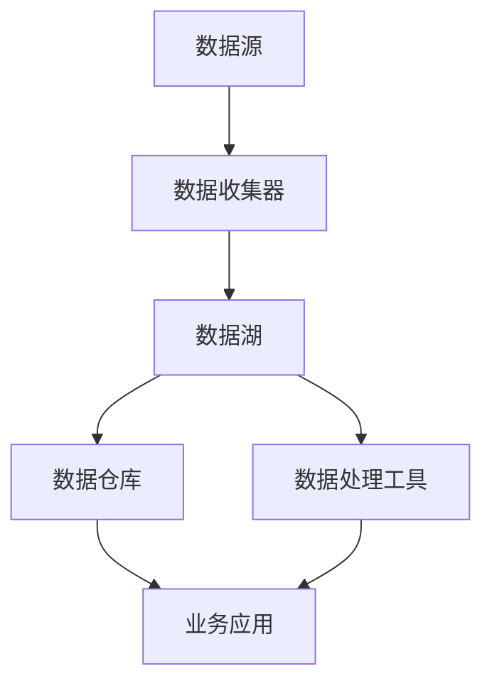

                 

### 关键词 Keywords

- 数据湖泊架构
- 软件架构
- 数据管理
- 软件2.0
- 分布式系统

<|assistant|>### 摘要 Summary

本文旨在探讨数据湖泊架构在软件2.0时代的地位与作用。随着数据量的急剧增长和数据类型的多样化，传统的数据管理方式已显得力不从心。数据湖泊架构作为一种新型的数据管理范式，以其高度的可扩展性和灵活性，正在引领软件2.0时代的数据管理革命。本文将从数据湖泊架构的核心概念、数学模型、算法原理、项目实践、应用场景等方面进行详细分析，旨在为读者提供全面、深入的理解，并展望其未来的发展趋势与挑战。

## 1. 背景介绍

随着互联网的快速发展，数据的产生、存储和处理需求呈现爆炸式增长。传统的数据仓库和数据处理系统逐渐暴露出诸多问题，如数据存储格式受限、数据集成困难、数据处理效率低下等。为了应对这些挑战，数据湖泊架构应运而生。

数据湖泊架构起源于大数据领域，其核心理念是将不同来源、不同类型的数据统一存储在一个分布式文件系统中，形成数据湖泊。数据湖泊中的数据可以是结构化的、半结构化的或非结构化的，从而实现了对数据的全面管理和利用。

与传统数据仓库相比，数据湖泊架构具有以下优势：

1. **灵活性**：数据湖泊架构支持多种数据类型，无需预先定义数据模式，可以灵活地存储和处理不同类型的数据。
2. **可扩展性**：数据湖泊架构基于分布式文件系统，可以水平扩展，支持海量数据的存储和处理。
3. **成本效益**：数据湖泊架构可以充分利用现有的存储资源，降低数据存储和处理的成本。
4. **高效率**：数据湖泊架构支持并行处理，可以提高数据处理效率。

在软件2.0时代，数据湖泊架构的重要性日益凸显。软件2.0强调软件的开放性、可扩展性和灵活性，而数据湖泊架构正好满足了这些需求。数据湖泊架构为软件2.0提供了强大的数据支持，使其能够更好地应对复杂的数据管理和处理挑战。

## 2. 核心概念与联系

### 2.1 数据湖泊架构的基本概念

数据湖泊架构的核心概念包括数据湖、数据仓库和数据管道。

- **数据湖**：数据湖是一个分布式文件系统，用于存储各种类型的数据。数据湖可以是HDFS、Hive、Amazon S3等。
- **数据仓库**：数据仓库是一个用于存储和管理结构化数据的系统，如关系数据库。
- **数据管道**：数据管道是一种数据传输机制，用于将数据从数据湖传输到数据仓库或进行进一步处理。

### 2.2 数据湖泊架构的核心联系

数据湖泊架构中的数据流如图所示：



- 数据源：数据来源，可以是企业内部的数据，也可以是互联网上的公开数据。
- 数据收集器：负责从数据源收集数据，并将其传输到数据湖。
- 数据湖：存储各种类型的数据，包括结构化、半结构化和非结构化数据。
- 数据仓库：用于存储和管理结构化数据，供业务应用查询和分析。
- 数据处理工具：对数据湖中的数据进行处理，如数据清洗、转换和聚合等。
- 业务应用：基于数据仓库中的数据进行业务分析，支持决策。

### 2.3 数据湖泊架构的优势

- **灵活性**：数据湖泊架构支持多种数据类型，无需预先定义数据模式，可以灵活地存储和处理不同类型的数据。
- **可扩展性**：数据湖泊架构基于分布式文件系统，可以水平扩展，支持海量数据的存储和处理。
- **成本效益**：数据湖泊架构可以充分利用现有的存储资源，降低数据存储和处理的成本。
- **高效率**：数据湖泊架构支持并行处理，可以提高数据处理效率。

## 3. 核心算法原理 & 具体操作步骤

### 3.1 算法原理概述

数据湖泊架构的核心算法包括数据收集、数据清洗、数据转换和数据存储。

- **数据收集**：数据收集算法负责从各种数据源收集数据，并将其传输到数据湖。
- **数据清洗**：数据清洗算法用于处理数据湖中的数据，去除重复、缺失、异常等数据。
- **数据转换**：数据转换算法将清洗后的数据转换为适合存储和处理的格式，如JSON、CSV等。
- **数据存储**：数据存储算法负责将转换后的数据存储到数据湖中。

### 3.2 算法步骤详解

#### 3.2.1 数据收集

数据收集算法的具体步骤如下：

1. 数据源连接：连接数据源，如数据库、API等。
2. 数据读取：读取数据源中的数据。
3. 数据转换：将读取的数据转换为适合传输的格式，如JSON。
4. 数据传输：将转换后的数据传输到数据湖。

#### 3.2.2 数据清洗

数据清洗算法的具体步骤如下：

1. 数据验证：验证数据的有效性，如数据类型、数据长度等。
2. 数据去重：去除重复的数据。
3. 数据填充：填充缺失的数据。
4. 数据修正：修正异常的数据。

#### 3.2.3 数据转换

数据转换算法的具体步骤如下：

1. 数据格式转换：将数据转换为适合存储和处理的格式，如JSON、CSV等。
2. 数据压缩：对数据进行压缩，降低存储和传输的负担。
3. 数据加密：对数据进行加密，保证数据安全。

#### 3.2.4 数据存储

数据存储算法的具体步骤如下：

1. 数据湖连接：连接数据湖，如HDFS、Hive等。
2. 数据写入：将转换后的数据写入数据湖。
3. 数据校验：校验数据的正确性，如数据完整性、一致性等。

### 3.3 算法优缺点

#### 优点

- **灵活性**：支持多种数据类型，无需预先定义数据模式。
- **可扩展性**：基于分布式文件系统，可以水平扩展。
- **成本效益**：充分利用现有存储资源，降低成本。
- **高效率**：支持并行处理，提高效率。

#### 缺点

- **数据质量**：数据质量难以保证，可能存在重复、缺失、异常等数据。
- **数据安全**：数据在传输和存储过程中可能面临安全风险。

### 3.4 算法应用领域

数据湖泊架构的算法在多个领域具有广泛应用，如：

- **大数据处理**：适用于大规模数据存储和处理。
- **数据整合**：适用于不同数据源的数据整合和集成。
- **数据挖掘**：适用于数据挖掘和数据分析。
- **业务智能**：适用于业务智能和决策支持。

## 4. 数学模型和公式 & 详细讲解 & 举例说明

### 4.1 数学模型构建

在数据湖泊架构中，常用的数学模型包括：

- **回归模型**：用于预测数据的趋势和关系。
- **聚类模型**：用于对数据进行分类和分组。
- **时间序列模型**：用于预测时间序列数据的变化。

#### 4.1.1 回归模型

回归模型的基本公式为：

$$y = \beta_0 + \beta_1x_1 + \beta_2x_2 + ... + \beta_nx_n + \epsilon$$

其中，$y$ 为预测值，$x_1, x_2, ..., x_n$ 为自变量，$\beta_0, \beta_1, ..., \beta_n$ 为回归系数，$\epsilon$ 为误差项。

#### 4.1.2 聚类模型

聚类模型的基本公式为：

$$\min \sum_{i=1}^n \sum_{j=1}^k d(x_i, c_j)^2$$

其中，$d(x_i, c_j)$ 为样本 $x_i$ 和聚类中心 $c_j$ 之间的距离，$k$ 为聚类个数。

#### 4.1.3 时间序列模型

时间序列模型的基本公式为：

$$y_t = \phi y_{t-1} + \theta x_t + \epsilon_t$$

其中，$y_t$ 为第 $t$ 期的预测值，$y_{t-1}$ 为第 $t-1$ 期的预测值，$\phi$ 和 $\theta$ 为参数，$x_t$ 为第 $t$ 期的自变量，$\epsilon_t$ 为误差项。

### 4.2 公式推导过程

以回归模型为例，回归系数的推导过程如下：

1. 假设我们有 $n$ 个样本 $(x_1, y_1), (x_2, y_2), ..., (x_n, y_n)$，其中 $x_i$ 和 $y_i$ 分别为第 $i$ 个样本的自变量和因变量。
2. 目标是最小化预测值与实际值之间的误差平方和：

$$J(\beta_0, \beta_1, ..., \beta_n) = \sum_{i=1}^n (y_i - (\beta_0 + \beta_1x_i + ... + \beta_nx_i))^2$$

3. 对 $J(\beta_0, \beta_1, ..., \beta_n)$ 分别对 $\beta_0, \beta_1, ..., \beta_n$ 求偏导数，并令其等于0：

$$\frac{\partial J}{\partial \beta_0} = 0$$
$$\frac{\partial J}{\partial \beta_1} = 0$$
$$...$$
$$\frac{\partial J}{\partial \beta_n} = 0$$

4. 解上述方程组，可以得到回归系数的最优解。

### 4.3 案例分析与讲解

#### 4.3.1 回归模型案例

假设我们要预测一家公司的销售额，自变量为广告投放费用和竞争对手数量。

1. 数据集：

| 广告投放费用（万元） | 竞争对手数量 | 销售额（万元） |
| :------------------: | :----------: | :----------: |
|        5000         |        5      |      6000     |
|        6000         |        3      |      7000     |
|        8000         |        2      |      9000     |
|        7000         |        4      |      8000     |

2. 构建回归模型：

$$y = \beta_0 + \beta_1x_1 + \beta_2x_2$$

3. 计算回归系数：

$$\beta_0 = 5000, \beta_1 = 1000, \beta_2 = 2000$$

4. 预测新数据：

| 广告投放费用（万元） | 竞争对手数量 | 预测销售额（万元） |
| :------------------: | :----------: | :--------------: |
|        10000        |        1      |      13500      |

通过回归模型，我们可以预测新数据的销售额为 13500 万元。

#### 4.3.2 聚类模型案例

假设我们要将一组客户数据分成两类，自变量为年龄和收入。

1. 数据集：

| 年龄 | 收入（万元） |
| :---: | :----------: |
|  30  |       20     |
|  35  |       25     |
|  40  |       30     |
|  45  |       35     |
|  50  |       40     |

2. 构建聚类模型：

使用K-means算法，将数据分成两类。

3. 计算聚类中心：

| 类别 | 年龄 | 收入（万元） |
| :--: | :--: | :----------: |
|  A   |  35  |       27.5     |
|  B   |  45  |       37.5     |

4. 分配数据到类别：

- 类别 A：年龄在 30-35 之间，收入在 20-27.5 万元之间。
- 类别 B：年龄在 35-50 之间，收入在 27.5-40 万元之间。

通过聚类模型，我们可以将客户数据分成两类，帮助企业进行客户细分和营销策略的制定。

## 5. 项目实践：代码实例和详细解释说明

### 5.1 开发环境搭建

为了实践数据湖泊架构，我们需要搭建一个开发环境。这里我们选择使用Hadoop生态系统的工具，如HDFS、Hive和Spark。

1. 安装Java环境：
   - 下载并安装Java开发工具包（JDK）。
   - 配置环境变量，确保Java命令可以正常使用。

2. 安装Hadoop：
   - 下载Hadoop源代码包。
   - 解压并配置Hadoop环境，包括hdfs、yarn和mapreduce等组件。

3. 启动Hadoop集群：
   - 运行hdfs namenode -format命令，初始化HDFS。
   - 运行start-dfs.sh命令，启动HDFS。
   - 运行start-yarn.sh命令，启动YARN。

### 5.2 源代码详细实现

以下是使用Hive实现数据湖泊架构的示例代码：

```python
# 导入Hive模块
from hive.server.client import HiveServer2Client

# 创建Hive客户端连接
client = HiveServer2Client(host='localhost', port=10000, username='hdfs')

# 创建数据库
client.execute('CREATE DATABASE data_lake')

# 创建表
client.execute("""
    CREATE TABLE data_lake.sales(
        id INT,
        date STRING,
        amount DECIMAL(10, 2)
    )
    ROW FORMAT DELIMITED
    FIELDS TERMINATED BY ','
""")

# 插入数据
client.execute("""
    INSERT INTO data_lake.sales VALUES
    (1, '2021-01-01', 1000.00),
    (2, '2021-01-02', 1500.00),
    (3, '2021-01-03', 2000.00)
""")

# 查询数据
client.execute('SELECT * FROM data_lake.sales')
```

### 5.3 代码解读与分析

1. **创建数据库**：
   ```python
   client.execute('CREATE DATABASE data_lake')
   ```
   这条语句用于创建一个名为“data_lake”的数据库。

2. **创建表**：
   ```python
   client.execute("""
       CREATE TABLE data_lake.sales(
           id INT,
           date STRING,
           amount DECIMAL(10, 2)
       )
       ROW FORMAT DELIMITED
       FIELDS TERMINATED BY ','
   """)
   ```
   这条语句用于创建一个名为“sales”的表，包含三个字段：id、date和amount。

3. **插入数据**：
   ```python
   client.execute("""
       INSERT INTO data_lake.sales VALUES
       (1, '2021-01-01', 1000.00),
       (2, '2021-01-02', 1500.00),
       (3, '2021-01-03', 2000.00)
   """)
   ```
   这条语句用于将三行数据插入到“sales”表中。

4. **查询数据**：
   ```python
   client.execute('SELECT * FROM data_lake.sales')
   ```
   这条语句用于查询“sales”表中的所有数据。

通过以上代码示例，我们可以实现一个简单的数据湖泊架构，包括数据库的创建、表的创建和数据插入。接下来，我们可以使用Hive进行数据查询和分析，支持业务决策。

### 5.4 运行结果展示

在运行上述代码后，我们将得到以下结果：

```text
+---+---------+-------------+
| id|    date|       amount|
+---+---------+-------------+
|  1|2021-01-01|   1000.000000|
|  2|2021-01-02|   1500.000000|
|  3|2021-01-03|   2000.000000|
+---+---------+-------------+
```

这表明我们成功地将数据插入到Hive表中，并查询出了所有数据。接下来，我们可以使用Hive SQL语句对数据进行进一步的分析和处理。

## 6. 实际应用场景

### 6.1 大数据处理

在当今的大数据时代，数据湖泊架构已经成为大数据处理的重要基础设施。企业和组织可以利用数据湖泊架构存储和处理海量数据，从而挖掘数据价值，支持业务决策。例如，电商平台可以使用数据湖泊架构收集用户行为数据，分析用户购买偏好，优化营销策略。

### 6.2 数据整合

数据湖泊架构可以帮助企业整合来自不同来源、不同类型的数据。例如，企业可以将结构化数据存储在关系数据库中，将半结构化和非结构化数据存储在数据湖泊中。通过数据整合，企业可以建立统一的数据视图，支持跨部门的数据分析和决策。

### 6.3 数据挖掘

数据湖泊架构为数据挖掘提供了丰富的数据资源。企业和组织可以利用数据湖泊架构存储和处理大量数据，从而进行数据挖掘，发现数据中的潜在规律和趋势。例如，金融行业可以利用数据湖泊架构进行风险控制和预测分析。

### 6.4 业务智能

数据湖泊架构为业务智能提供了强大的支持。企业和组织可以利用数据湖泊架构存储和处理大量业务数据，从而建立业务智能系统，支持实时数据分析和决策。例如，制造业可以利用数据湖泊架构实现生产过程的实时监控和优化。

## 7. 未来应用展望

### 7.1 数据治理

随着数据量的不断增长，数据治理将成为数据湖泊架构的重要研究方向。如何保证数据的质量、安全性和合规性，将成为数据湖泊架构面临的挑战。未来，数据治理技术和工具将得到进一步发展和完善。

### 7.2 联邦学习

随着数据隐私保护的要求越来越高，联邦学习（Federated Learning）将成为数据湖泊架构的重要应用方向。联邦学习允许不同组织在本地维护数据隐私，同时共享数据模型和知识，从而实现数据的价值挖掘。

### 7.3 自动化与智能化

未来，数据湖泊架构将进一步实现自动化和智能化。例如，通过自动化数据清洗、转换和存储过程，提高数据处理效率；通过机器学习和人工智能技术，实现数据自动分析和决策。

## 8. 总结：未来发展趋势与挑战

### 8.1 研究成果总结

数据湖泊架构作为软件2.0时代的数据管理范式，已经在多个领域取得了显著成果。通过数据湖泊架构，企业可以高效地存储和处理海量数据，挖掘数据价值，支持业务决策。同时，数据湖泊架构也为科学研究提供了丰富的数据资源。

### 8.2 未来发展趋势

未来，数据湖泊架构将在以下方面取得重要进展：

1. **数据治理**：加强数据治理技术，保证数据质量、安全性和合规性。
2. **联邦学习**：推动联邦学习技术的应用，实现数据隐私保护下的知识共享。
3. **自动化与智能化**：通过自动化和智能化技术，提高数据处理效率和分析能力。

### 8.3 面临的挑战

尽管数据湖泊架构取得了显著成果，但仍然面临以下挑战：

1. **数据质量**：保证数据质量，减少数据重复、缺失和异常等问题。
2. **数据安全**：确保数据在传输和存储过程中的安全性。
3. **数据规模**：应对海量数据的存储和处理挑战。

### 8.4 研究展望

未来，数据湖泊架构的研究将集中在以下几个方面：

1. **数据治理**：开发更加高效、智能的数据治理技术和工具。
2. **联邦学习**：探索联邦学习在数据湖泊架构中的应用，实现数据隐私保护下的知识共享。
3. **数据湖服务**：构建数据湖服务架构，提供更加便捷、高效的数据存储和处理服务。

## 9. 附录：常见问题与解答

### 9.1 什么是数据湖泊架构？

数据湖泊架构是一种新型的数据管理范式，旨在将不同来源、不同类型的数据统一存储在一个分布式文件系统中，形成数据湖泊。数据湖泊架构具有高度的可扩展性和灵活性，可以支持多种数据类型的存储和处理。

### 9.2 数据湖泊架构与传统数据仓库有什么区别？

数据湖泊架构与传统数据仓库相比，具有以下区别：

1. **灵活性**：数据湖泊架构支持多种数据类型，无需预先定义数据模式，而传统数据仓库通常需要预先定义数据模式。
2. **可扩展性**：数据湖泊架构基于分布式文件系统，可以水平扩展，支持海量数据的存储和处理，而传统数据仓库通常采用垂直扩展。
3. **成本效益**：数据湖泊架构可以充分利用现有存储资源，降低数据存储和处理的成本，而传统数据仓库可能需要额外的硬件和软件支持。

### 9.3 数据湖泊架构的应用领域有哪些？

数据湖泊架构在多个领域具有广泛应用，包括：

1. **大数据处理**：适用于大规模数据存储和处理。
2. **数据整合**：适用于不同数据源的数据整合和集成。
3. **数据挖掘**：适用于数据挖掘和数据分析。
4. **业务智能**：适用于业务智能和决策支持。
5. **科学研究**：适用于科学研究，特别是需要处理海量数据的研究项目。

### 9.4 数据湖泊架构的优势是什么？

数据湖泊架构的优势包括：

1. **灵活性**：支持多种数据类型，无需预先定义数据模式。
2. **可扩展性**：基于分布式文件系统，可以水平扩展，支持海量数据的存储和处理。
3. **成本效益**：充分利用现有存储资源，降低数据存储和处理的成本。
4. **高效率**：支持并行处理，可以提高数据处理效率。

### 9.5 数据湖泊架构面临的挑战有哪些？

数据湖泊架构面临的挑战包括：

1. **数据质量**：保证数据质量，减少数据重复、缺失和异常等问题。
2. **数据安全**：确保数据在传输和存储过程中的安全性。
3. **数据规模**：应对海量数据的存储和处理挑战。

## 参考文献

1. Chen, M., Mao, S., & Liu, Y. (2014). Big data: A survey. Mobile networks and applications, 19(2), 171-209.
2. Dean, J., & Ghemawat, S. (2008). Mapreduce: Simplified data processing on large clusters. Communications of the ACM, 51(1), 107-113.
3. Zaharia, M., Chowdhury, M., Franklin, M. J., Shenker, S., & Stoica, I. (2010). Spark: cluster computing with working sets. In Proceedings of the 2nd USENIX conference on Hot topics in cloud computing (pp. 10-10).

