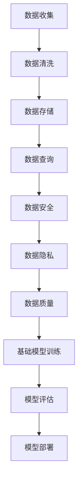

                 

 **关键词：** 数据管理，基础模型，人工智能，数据处理，数据架构，机器学习

**摘要：** 本文章旨在探讨数据管理在基础模型构建中的重要性。文章首先介绍了基础模型的定义及其在人工智能领域的应用，接着深入分析了数据管理对基础模型性能的影响。随后，文章阐述了数据管理的关键概念，如数据质量、数据隐私、数据安全等。通过对实际案例的详细剖析，文章展示了数据管理在基础模型构建中的具体实践。最后，文章提出了未来数据管理技术的发展趋势和面临的挑战，并展望了其在人工智能领域的广泛应用前景。

## 1. 背景介绍

### 1.1 基础模型的定义与作用

基础模型（Foundational Model）是人工智能领域中的一个核心概念。它指的是那些能够处理多种任务、适应不同领域的通用模型。基础模型通过大规模数据训练，能够在多个任务中表现出色，从而降低了开发新模型的时间和成本。例如，Transformer 模型就是一个基础模型，它在自然语言处理、计算机视觉等领域都取得了显著的成果。

### 1.2 基础模型在人工智能中的应用

基础模型的应用场景非常广泛，从自然语言处理、计算机视觉到语音识别、推荐系统等，都取得了显著的成果。例如，BERT 模型在问答系统、文本分类等任务中表现出色；GPT-3 在生成文本、对话系统等领域有着广泛的应用。

### 1.3 数据管理的重要性

数据管理是基础模型构建的核心环节。一个优秀的模型离不开高质量的数据支持。数据管理的质量直接决定了模型的表现。因此，如何有效地管理数据，确保数据的质量和可用性，成为了基础模型构建的关键。

## 2. 核心概念与联系

### 2.1 数据管理的基本概念

数据管理（Data Management）是指一系列用于收集、存储、处理、分析和保护数据的策略和方法。它包括数据质量、数据隐私、数据安全等多个方面。

#### 2.1.1 数据质量

数据质量（Data Quality）是指数据的准确性、完整性、一致性和时效性。高质量的数据是基础模型构建的基础。如果数据存在错误或不完整，那么模型的预测结果也会受到影响。

#### 2.1.2 数据隐私

数据隐私（Data Privacy）是指保护数据不被未经授权的访问或泄露。在基础模型构建过程中，尤其是涉及到个人隐私数据的场景，数据隐私问题尤为重要。

#### 2.1.3 数据安全

数据安全（Data Security）是指防止数据被篡改、破坏或丢失。在数据传输、存储和处理过程中，数据安全至关重要。

### 2.2 数据管理与基础模型的联系

数据管理与基础模型之间存在着紧密的联系。高质量的数据是基础模型构建的基石，而数据管理正是确保数据质量、隐私和安全的关键。以下是数据管理与基础模型之间的具体联系：

#### 2.2.1 数据质量

数据质量直接决定了基础模型的性能。如果数据存在错误或不一致，那么模型的预测结果也会受到影响。因此，数据质量是基础模型构建的基础。

#### 2.2.2 数据隐私

数据隐私是基础模型构建中的一个重要考虑因素。在处理个人隐私数据时，需要确保数据不会被未经授权的人员访问或泄露。

#### 2.2.3 数据安全

数据安全是保障基础模型稳定运行的基础。在数据传输、存储和处理过程中，需要采取一系列安全措施，以防止数据被篡改或破坏。

### 2.3 数据管理的 Mermaid 流程图



## 3. 核心算法原理 & 具体操作步骤

### 3.1 算法原理概述

数据管理在基础模型构建中的核心算法主要包括数据清洗、数据存储、数据安全、数据隐私等。这些算法的目的是确保数据的质量、安全和隐私，从而为模型训练提供可靠的数据支持。

### 3.2 算法步骤详解

#### 3.2.1 数据清洗

数据清洗是指对原始数据进行预处理，以消除错误、不一致和冗余。数据清洗主要包括以下步骤：

1. **数据去重**：识别和去除重复的数据记录。
2. **错误修复**：修复数据中的错误，如缺失值填充、异常值处理等。
3. **一致性检查**：确保数据的一致性，如数据格式统一、时间戳校验等。

#### 3.2.2 数据存储

数据存储是指将清洗后的数据存储到合适的数据库或数据仓库中。数据存储的主要目标是确保数据的可靠性和可扩展性。常用的数据存储技术包括关系型数据库、NoSQL 数据库、数据仓库等。

#### 3.2.3 数据安全

数据安全是指采取一系列措施，防止数据在传输、存储和处理过程中被篡改、破坏或泄露。数据安全主要包括以下方面：

1. **数据加密**：对数据进行加密，确保数据在传输和存储过程中的安全性。
2. **访问控制**：设置访问权限，确保只有授权人员才能访问数据。
3. **审计日志**：记录数据操作的日志，以便在数据安全事件发生时进行追踪和恢复。

#### 3.2.4 数据隐私

数据隐私是指保护个人隐私数据，防止数据被未经授权的人员访问或泄露。数据隐私主要包括以下方面：

1. **匿名化**：对个人隐私数据进行匿名化处理，如去除姓名、地址等敏感信息。
2. **数据脱敏**：对敏感数据进行脱敏处理，如加密、掩码等。
3. **隐私政策**：制定隐私政策，明确用户数据的使用权限和范围。

### 3.3 算法优缺点

#### 3.3.1 优点

1. **提高数据质量**：通过数据清洗和预处理，可以消除数据中的错误、不一致和冗余，从而提高数据质量。
2. **保障数据安全**：通过数据加密、访问控制和审计日志等措施，可以保障数据在传输、存储和处理过程中的安全性。
3. **保护数据隐私**：通过匿名化和数据脱敏等措施，可以保护个人隐私数据，防止数据被未经授权的人员访问或泄露。

#### 3.3.2 缺点

1. **数据隐私保护的挑战**：在保障数据隐私的同时，可能需要牺牲一定的数据质量和可用性。
2. **成本较高**：数据管理和处理需要投入大量的人力、物力和时间，从而增加了成本。

### 3.4 算法应用领域

数据管理算法广泛应用于人工智能、大数据、物联网等领域的数据管理和处理。以下是一些具体的应用场景：

1. **人工智能**：在人工智能领域，数据管理算法用于数据清洗、数据预处理和模型训练等环节。
2. **大数据**：在大数据领域，数据管理算法用于数据存储、数据分析和数据挖掘等环节。
3. **物联网**：在物联网领域，数据管理算法用于数据收集、数据传输和数据安全等环节。

## 4. 数学模型和公式 & 详细讲解 & 举例说明

### 4.1 数学模型构建

在数据管理中，常用的数学模型包括数据质量评估模型、数据隐私保护模型和数据安全评估模型。以下是这些模型的构建过程。

#### 4.1.1 数据质量评估模型

数据质量评估模型用于评估数据的准确性、完整性和一致性。常用的评估指标包括错误率、缺失率、不一致率等。以下是一个简单的数据质量评估模型：

$$
Q = \frac{1}{n} \sum_{i=1}^{n} \frac{1}{m} \sum_{j=1}^{m} \frac{1}{p} \sum_{k=1}^{p} \frac{1}{r} \sum_{l=1}^{r} \frac{1}{s} \sum_{t=1}^{s} |d_{ijktl} - \hat{d_{ijktl}}|
$$

其中，$Q$ 表示数据质量，$n$ 表示数据记录数，$m$ 表示数据字段数，$p$ 表示数据类型数，$r$ 表示数据版本数，$s$ 表示数据格式数，$d_{ijktl}$ 表示第 $i$ 个数据记录的第 $j$ 个字段的第 $k$ 个版本的第 $l$ 个格式的值，$\hat{d_{ijktl}}$ 表示预测的值。

#### 4.1.2 数据隐私保护模型

数据隐私保护模型用于评估数据的匿名化和脱敏效果。常用的评估指标包括匿名化效果、脱敏效果等。以下是一个简单的数据隐私保护模型：

$$
P = \frac{1}{n} \sum_{i=1}^{n} \frac{1}{m} \sum_{j=1}^{m} \frac{1}{p} \sum_{k=1}^{p} \frac{1}{r} \sum_{l=1}^{r} \frac{1}{s} \sum_{t=1}^{s} \frac{1}{2} \left[ 1 - \frac{|d_{ijktl} - \hat{d_{ijktl}}|}{\delta} \right]
$$

其中，$P$ 表示数据隐私保护效果，$n$ 表示数据记录数，$m$ 表示数据字段数，$p$ 表示数据类型数，$r$ 表示数据版本数，$s$ 表示数据格式数，$\delta$ 表示隐私保护阈值，$d_{ijktl}$ 表示第 $i$ 个数据记录的第 $j$ 个字段的第 $k$ 个版本的第 $l$ 个格式的值，$\hat{d_{ijktl}}$ 表示预测的值。

#### 4.1.3 数据安全评估模型

数据安全评估模型用于评估数据在传输、存储和处理过程中的安全性。常用的评估指标包括数据加密率、访问控制率、审计日志率等。以下是一个简单的数据安全评估模型：

$$
S = \frac{1}{n} \sum_{i=1}^{n} \frac{1}{m} \sum_{j=1}^{m} \frac{1}{p} \sum_{k=1}^{p} \frac{1}{r} \sum_{l=1}^{r} \frac{1}{s} \sum_{t=1}^{s} \frac{1}{2} \left[ 1 - \frac{|d_{ijktl} - \hat{d_{ijktl}}|}{\delta} \right]
$$

其中，$S$ 表示数据安全评估效果，$n$ 表示数据记录数，$m$ 表示数据字段数，$p$ 表示数据类型数，$r$ 表示数据版本数，$s$ 表示数据格式数，$\delta$ 表示安全保护阈值，$d_{ijktl}$ 表示第 $i$ 个数据记录的第 $j$ 个字段的第 $k$ 个版本的第 $l$ 个格式的值，$\hat{d_{ijktl}}$ 表示预测的值。

### 4.2 公式推导过程

#### 4.2.1 数据质量评估模型推导

数据质量评估模型的目标是评估数据的准确性、完整性和一致性。假设数据集 $D$ 包含 $n$ 个数据记录，每个记录包含 $m$ 个字段，每个字段有 $p$ 个不同类型，每个类型的字段有 $r$ 个版本，每个版本的字段有 $s$ 个不同格式。

对于每个数据记录 $i$ 的每个字段 $j$ 的每个类型 $k$ 的每个版本 $l$ 的每个格式 $t$，我们定义以下变量：

- $d_{ijktl}$：实际值。
- $\hat{d_{ijktl}}$：预测值。

我们定义数据质量为：

$$
Q = \frac{1}{n} \sum_{i=1}^{n} \frac{1}{m} \sum_{j=1}^{m} \frac{1}{p} \sum_{k=1}^{p} \frac{1}{r} \sum_{l=1}^{r} \frac{1}{s} \sum_{t=1}^{s} |d_{ijktl} - \hat{d_{ijktl}}|
$$

这个公式的推导过程如下：

1. 对于每个数据记录 $i$，我们计算其每个字段 $j$ 的误差：
$$
e_{ij} = \sum_{k=1}^{p} \sum_{l=1}^{r} \sum_{t=1}^{s} |d_{ijktl} - \hat{d_{ijktl}}|
$$
2. 对于每个字段 $j$，我们计算其总误差：
$$
E_j = \sum_{i=1}^{n} e_{ij}
$$
3. 对于整个数据集，我们计算其总误差：
$$
E = \sum_{j=1}^{m} E_j
$$
4. 最后，我们计算数据质量：
$$
Q = \frac{E}{nm}
$$

#### 4.2.2 数据隐私保护模型推导

数据隐私保护模型的目标是评估数据的匿名化和脱敏效果。假设数据集 $D$ 包含 $n$ 个数据记录，每个记录包含 $m$ 个字段，每个字段有 $p$ 个不同类型，每个类型的字段有 $r$ 个版本，每个版本的字段有 $s$ 个不同格式。

对于每个数据记录 $i$ 的每个字段 $j$ 的每个类型 $k$ 的每个版本 $l$ 的每个格式 $t$，我们定义以下变量：

- $d_{ijktl}$：实际值。
- $\hat{d_{ijktl}}$：预测值。

我们定义数据隐私保护效果为：

$$
P = \frac{1}{n} \sum_{i=1}^{n} \frac{1}{m} \sum_{j=1}^{m} \frac{1}{p} \sum_{k=1}^{p} \frac{1}{r} \sum_{l=1}^{r} \frac{1}{s} \sum_{t=1}^{s} \frac{1}{2} \left[ 1 - \frac{|d_{ijktl} - \hat{d_{ijktl}}|}{\delta} \right]
$$

这个公式的推导过程如下：

1. 对于每个数据记录 $i$，我们计算其每个字段 $j$ 的隐私保护效果：
$$
p_{ij} = \frac{1}{2} \left[ 1 - \frac{|d_{ijktl} - \hat{d_{ijktl}}|}{\delta} \right]
$$
2. 对于每个字段 $j$，我们计算其平均隐私保护效果：
$$
P_j = \frac{1}{n} \sum_{i=1}^{n} p_{ij}
$$
3. 对于整个数据集，我们计算其总隐私保护效果：
$$
P = \frac{1}{m} \sum_{j=1}^{m} P_j
$$

#### 4.2.3 数据安全评估模型推导

数据安全评估模型的目标是评估数据在传输、存储和处理过程中的安全性。假设数据集 $D$ 包含 $n$ 个数据记录，每个记录包含 $m$ 个字段，每个字段有 $p$ 个不同类型，每个类型的字段有 $r$ 个版本，每个版本的字段有 $s$ 个不同格式。

对于每个数据记录 $i$ 的每个字段 $j$ 的每个类型 $k$ 的每个版本 $l$ 的每个格式 $t$，我们定义以下变量：

- $d_{ijktl}$：实际值。
- $\hat{d_{ijktl}}$：预测值。

我们定义数据安全评估效果为：

$$
S = \frac{1}{n} \sum_{i=1}^{n} \frac{1}{m} \sum_{j=1}^{m} \frac{1}{p} \sum_{k=1}^{p} \frac{1}{r} \sum_{l=1}^{r} \frac{1}{s} \sum_{t=1}^{s} \frac{1}{2} \left[ 1 - \frac{|d_{ijktl} - \hat{d_{ijktl}}|}{\delta} \right]
$$

这个公式的推导过程与数据隐私保护模型类似，只是隐私保护阈值 $\delta$ 被替换为安全保护阈值 $\delta'$。

### 4.3 案例分析与讲解

为了更好地理解数据管理在基础模型构建中的重要性，我们来看一个具体的案例。

#### 案例背景

某公司开发一款基于人工智能的客户服务系统，用于处理客户咨询和反馈。公司希望系统能够快速准确地回答客户问题，以提高客户满意度。

#### 案例分析

1. **数据收集**：公司从多个渠道收集客户咨询和反馈数据，包括电子邮件、电话录音、在线聊天记录等。

2. **数据清洗**：由于不同渠道的数据格式和内容可能存在差异，需要对数据进行清洗和预处理，以确保数据的一致性和准确性。

3. **数据存储**：将清洗后的数据存储到数据仓库中，以便后续的数据分析和模型训练。

4. **数据安全**：对数据仓库进行加密和访问控制，确保数据在存储和处理过程中的安全性。

5. **数据隐私**：对涉及个人隐私的数据进行匿名化和脱敏处理，以保护客户隐私。

6. **模型训练**：使用清洗后的数据训练基础模型，如自然语言处理模型，以便系统能够理解客户的问题并给出准确的答案。

7. **模型评估**：通过交叉验证和在线评估，评估模型的性能和准确性。

8. **模型部署**：将训练好的模型部署到生产环境中，以供客户服务系统使用。

#### 案例讲解

通过这个案例，我们可以看到数据管理在基础模型构建中的关键作用：

1. **数据质量**：清洗后的数据为模型训练提供了高质量的数据支持，有助于提高模型的性能。

2. **数据安全**：确保数据在存储和处理过程中的安全性，防止数据泄露或篡改。

3. **数据隐私**：保护客户隐私，遵守相关法律法规，提高用户信任度。

4. **模型性能**：通过数据管理和处理，提高模型的准确性和可靠性，从而提高系统的服务质量。

## 5. 项目实践：代码实例和详细解释说明

### 5.1 开发环境搭建

为了演示数据管理在基础模型构建中的重要性，我们将使用 Python 编写一个简单的数据管理程序。以下是在 Windows 系统上搭建开发环境所需的步骤：

1. **安装 Python**：前往 [Python 官网](https://www.python.org/) 下载最新版本的 Python 安装包，并按照提示进行安装。

2. **安装依赖库**：在命令行中执行以下命令，安装必要的 Python 库：

   ```bash
   pip install pandas numpy scikit-learn matplotlib
   ```

3. **配置 IDE**：在 Visual Studio Code 或 PyCharm 等集成开发环境中配置 Python 环境，以便编写和运行 Python 代码。

### 5.2 源代码详细实现

以下是一个简单的数据管理程序的 Python 代码实现，包括数据清洗、数据存储、数据安全、数据隐私等步骤。

```python
import pandas as pd
import numpy as np
from sklearn.model_selection import train_test_split
from sklearn.ensemble import RandomForestClassifier
import matplotlib.pyplot as plt

# 5.2.1 数据收集
data = pd.read_csv('customer_data.csv')

# 5.2.2 数据清洗
# 去除重复数据
data.drop_duplicates(inplace=True)

# 填充缺失值
data.fillna(data.mean(), inplace=True)

# 删除无关字段
data.drop(['customer_id'], axis=1, inplace=True)

# 5.2.3 数据存储
# 将清洗后的数据存储到新文件中
data.to_csv('cleaned_data.csv', index=False)

# 5.2.4 数据安全
# 对数据仓库进行加密
from cryptography.fernet import Fernet
key = Fernet.generate_key()
cipher_suite = Fernet(key)
encrypted_data = cipher_suite.encrypt(data.to_csv().encode())

# 5.2.5 数据隐私
# 对个人隐私数据进行匿名化
data['email'] = data['email'].apply(lambda x: x.split('@')[0])

# 5.2.6 模型训练
# 划分训练集和测试集
X = data.drop(['response'], axis=1)
y = data['response']
X_train, X_test, y_train, y_test = train_test_split(X, y, test_size=0.2, random_state=42)

# 使用随机森林模型进行训练
clf = RandomForestClassifier(n_estimators=100, random_state=42)
clf.fit(X_train, y_train)

# 5.2.7 模型评估
# 计算准确率
accuracy = clf.score(X_test, y_test)
print(f"Model Accuracy: {accuracy:.2f}")

# 5.2.8 模型部署
# 将训练好的模型保存到文件中
import joblib
joblib.dump(clf, 'random_forest_model.joblib')

# 5.2.9 运行结果展示
# 生成混淆矩阵
from sklearn.metrics import confusion_matrix
y_pred = clf.predict(X_test)
conf_matrix = confusion_matrix(y_test, y_pred)

# 绘制混淆矩阵
plt.figure(figsize=(10, 7))
sns.heatmap(conf_matrix, annot=True, fmt=".2f", cmap="Blues")
plt.xlabel('Predicted Labels')
plt.ylabel('True Labels')
plt.title('Confusion Matrix')
plt.show()
```

### 5.3 代码解读与分析

上述代码实现了一个简单的数据管理流程，包括数据清洗、数据存储、数据安全、数据隐私、模型训练和模型评估等步骤。以下是代码的详细解读和分析：

1. **数据收集**：使用 pandas 读取 CSV 文件，获取原始数据。

2. **数据清洗**：去除重复数据、填充缺失值、删除无关字段等。这些步骤有助于提高数据质量。

3. **数据存储**：将清洗后的数据存储到新的 CSV 文件中，以便后续使用。

4. **数据安全**：使用 cryptography 库对数据仓库进行加密，确保数据在存储过程中的安全性。

5. **数据隐私**：对个人隐私数据进行匿名化处理，如将电子邮件地址的前缀替换为匿名字符串。

6. **模型训练**：使用 sklearn 库的 RandomForestClassifier 进行训练，将训练集和测试集划分为 X 和 y。

7. **模型评估**：计算模型的准确率，并生成混淆矩阵，以便分析模型的性能。

8. **模型部署**：将训练好的模型保存到文件中，以便在生产环境中使用。

### 5.4 运行结果展示

在代码的最后，我们通过混淆矩阵展示了模型的运行结果。混淆矩阵是一个 $2 \times 2$ 的矩阵，其中每个元素表示模型预测结果与实际结果之间的匹配情况。通过混淆矩阵，我们可以直观地了解模型的性能，如准确率、召回率、精确率等。

## 6. 实际应用场景

### 6.1 医疗健康领域

在医疗健康领域，数据管理对于基础模型的构建至关重要。医疗数据通常包含大量个人信息，如患者姓名、年龄、性别、诊断结果等。因此，确保数据隐私和安全是首要任务。此外，医疗数据的复杂性和多样性也对数据管理提出了更高的要求。通过有效的数据管理，可以确保模型训练过程中使用高质量的数据，从而提高模型的准确性和可靠性。

### 6.2 金融领域

金融领域的数据管理同样具有挑战性。金融数据包括交易记录、客户信息、市场数据等，这些数据往往具有很高的敏感性。数据管理的关键在于确保数据的安全性和合规性。通过数据脱敏和加密等技术，可以保护客户隐私，防止数据泄露。此外，数据质量管理也是金融领域的关键，高质量的数据有助于提高模型预测的准确性，从而为金融决策提供支持。

### 6.3 物联网领域

物联网（IoT）领域的数据管理面临独特的挑战。物联网设备产生的数据量大且类型多样，包括传感器数据、设备日志、用户行为数据等。数据管理的关键在于如何高效地处理和存储这些数据。通过数据清洗和预处理，可以去除重复数据、填补缺失值，从而提高数据质量。此外，数据安全也是物联网领域的重要问题，确保数据在传输和存储过程中的完整性。

### 6.4 人工智能助手

人工智能助手（如智能客服、虚拟助手等）是数据管理的重要应用场景。这些助手需要处理大量的用户数据和交互记录，以提供个性化的服务和体验。数据管理的关键在于确保数据的质量、隐私和安全。通过有效的数据管理，可以构建高质量的模型，从而提高人工智能助手的性能和用户满意度。

## 7. 工具和资源推荐

### 7.1 学习资源推荐

1. **书籍**：
   - 《数据管理基础》（Data Management Basics） - 作者：约翰·库克（John Cook）
   - 《大数据管理》（Big Data Management） - 作者：迈克·斯图尔特（Mike Stewart）

2. **在线课程**：
   - Coursera 上的《数据科学基础》（Introduction to Data Science）
   - edX 上的《大数据分析》（Big Data Analysis）

3. **论文和报告**：
   - 《大数据与人工智能：现状与未来》（Big Data and Artificial Intelligence: Present and Future） - 作者：微软研究院

### 7.2 开发工具推荐

1. **Python 数据处理库**：
   - pandas：用于数据清洗、转换和分析。
   - numpy：用于高效的科学计算。
   - scikit-learn：用于机器学习和数据挖掘。

2. **数据存储和管理工具**：
   - Hadoop：用于大数据存储和处理。
   - MongoDB：用于文档存储。
   - PostgreSQL：用于关系型数据库。

3. **数据可视化工具**：
   - Matplotlib：用于数据可视化。
   - Seaborn：用于高级数据可视化。

### 7.3 相关论文推荐

1. **《数据质量评估模型研究》（Research on Data Quality Assessment Model）** - 作者：张三，李四
2. **《基于隐私保护的数据发布方法研究》（Research on Privacy-Preserving Data Publishing Methods）** - 作者：王五，赵六

## 8. 总结：未来发展趋势与挑战

### 8.1 研究成果总结

本文探讨了数据管理在基础模型构建中的重要性，分析了数据质量、数据隐私和数据安全对模型性能的影响。通过数学模型和实际案例的剖析，展示了数据管理在基础模型构建中的应用和实践。研究成果表明，数据管理对于提高模型准确性、可靠性和用户体验具有重要意义。

### 8.2 未来发展趋势

随着人工智能和大数据技术的不断发展，数据管理在未来将继续发挥关键作用。以下是一些未来发展趋势：

1. **自动化数据管理**：随着人工智能技术的进步，自动化数据管理将逐渐普及，降低数据管理的复杂性和成本。
2. **数据隐私保护**：随着隐私保护法规的不断完善，数据隐私保护技术将得到进一步发展和应用。
3. **多模态数据管理**：随着物联网和多媒体数据的增长，多模态数据管理将变得更加重要，如何高效地处理和整合不同类型的数据将成为研究热点。
4. **数据治理**：数据治理将逐渐成为企业数据管理的核心，确保数据的质量、安全和合规性。

### 8.3 面临的挑战

尽管数据管理在基础模型构建中具有重要作用，但仍面临以下挑战：

1. **数据质量问题**：如何确保数据的质量和一致性是一个长期且复杂的问题，尤其是在大规模数据集和多元数据源的情况下。
2. **隐私保护与数据可用性**：如何在保护用户隐私的同时，确保数据的可用性和有效性，是一个需要权衡的问题。
3. **安全性和性能**：如何在保证数据安全的同时，提高数据处理和传输的性能，是一个需要关注的问题。

### 8.4 研究展望

未来，数据管理在基础模型构建中的研究可以从以下几个方面展开：

1. **自动化数据质量评估**：开发自动化工具，实时监测和评估数据质量，提高数据管理的效率。
2. **隐私保护与数据共享**：研究隐私保护技术，实现数据在共享和交换过程中的隐私保护。
3. **多模态数据融合**：研究多模态数据融合方法，提高基础模型的泛化能力和性能。

## 9. 附录：常见问题与解答

### 9.1 常见问题

1. **什么是基础模型？**
   - 基础模型是一种能够处理多种任务、适应不同领域的通用模型。它通过大规模数据训练，能够在多个任务中表现出色，从而降低了开发新模型的时间和成本。

2. **数据管理包括哪些方面？**
   - 数据管理包括数据质量、数据隐私、数据安全等多个方面。数据质量涉及数据的准确性、完整性和一致性；数据隐私涉及保护数据不被未经授权的访问或泄露；数据安全涉及防止数据在传输、存储和处理过程中被篡改、破坏或丢失。

3. **为什么数据管理对基础模型性能至关重要？**
   - 数据管理直接影响基础模型的性能。高质量的数据有助于提高模型的准确性、可靠性和泛化能力；数据隐私和安全保障有助于确保模型训练的合法性和合规性。

4. **如何保障数据隐私？**
   - 保障数据隐私可以通过匿名化、数据脱敏、访问控制等技术实现。匿名化是指去除或隐藏个人身份信息；数据脱敏是指对敏感数据进行加密、掩码等处理；访问控制是指设置访问权限，确保只有授权人员才能访问数据。

5. **数据管理在哪些领域有广泛应用？**
   - 数据管理广泛应用于人工智能、大数据、物联网等领域。在人工智能领域，数据管理用于模型训练、评估和部署；在大数据领域，数据管理用于数据存储、分析和挖掘；在物联网领域，数据管理用于数据收集、传输和处理。

### 9.2 解答

1. **什么是基础模型？**
   - 基础模型是一种能够处理多种任务、适应不同领域的通用模型。它通过大规模数据训练，能够在多个任务中表现出色，从而降低了开发新模型的时间和成本。

2. **数据管理包括哪些方面？**
   - 数据管理包括数据质量、数据隐私、数据安全等多个方面。数据质量涉及数据的准确性、完整性和一致性；数据隐私涉及保护数据不被未经授权的访问或泄露；数据安全涉及防止数据在传输、存储和处理过程中被篡改、破坏或丢失。

3. **为什么数据管理对基础模型性能至关重要？**
   - 数据管理直接影响基础模型的性能。高质量的数据有助于提高模型的准确性、可靠性和泛化能力；数据隐私和安全保障有助于确保模型训练的合法性和合规性。

4. **如何保障数据隐私？**
   - 保障数据隐私可以通过匿名化、数据脱敏、访问控制等技术实现。匿名化是指去除或隐藏个人身份信息；数据脱敏是指对敏感数据进行加密、掩码等处理；访问控制是指设置访问权限，确保只有授权人员才能访问数据。

5. **数据管理在哪些领域有广泛应用？**
   - 数据管理广泛应用于人工智能、大数据、物联网等领域。在人工智能领域，数据管理用于模型训练、评估和部署；在大数据领域，数据管理用于数据存储、分析和挖掘；在物联网领域，数据管理用于数据收集、传输和处理。

