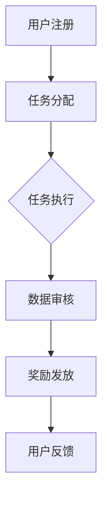

                 

数据集是机器学习和人工智能研究中不可或缺的一部分，它们为模型训练、评估和优化提供了基础。然而，获取高质量的数据集并不容易，尤其是当数据量庞大且多样化时。传统的方法主要依赖于专业数据科学家和标注员，这通常既耗时又昂贵。为了解决这一问题，数据集众包激励机制应运而生，它通过有效调动用户参与数据贡献，提供了一种新的解决方案。本文将深入探讨数据集众包激励的原理、应用和未来发展，旨在为读者提供全面的技术视角。

## 文章关键词
- 数据集众包
- 用户激励
- 数据贡献
- 人工智能
- 机器学习

## 文章摘要
本文首先介绍了数据集众包的背景和重要性，然后详细阐述了数据集众包激励的核心概念和机制。通过一个具体的实例，我们展示了如何设计和实施一个有效的众包激励方案。接着，本文分析了该机制的数学模型和算法原理，并提供了详细的实现步骤。文章还探讨了数据集众包激励在实际应用中的挑战和未来展望，最后给出了相关的工具和资源推荐。

## 1. 背景介绍

随着人工智能和机器学习的快速发展，数据驱动的方法已经成为提高算法性能和准确性的关键。然而，高质量的数据集的获取并非易事。首先，数据采集和标注过程通常需要大量的人力和时间投入。其次，专业数据科学家和标注员成本高昂，尤其是在大规模项目中。此外，数据的多样性和质量要求也增加了数据集构建的难度。

为了解决这些问题，数据集众包成为了一种新的思路。众包（Crowdsourcing）是指将复杂的问题分解成许多小任务，并利用互联网上的大量个体完成这些任务。这种模式在许多领域都取得了成功，例如编程挑战、翻译和设计竞赛等。将众包应用于数据集构建，可以大幅度降低成本，提高效率，并确保数据的多样性和质量。

数据集众包激励机制是众包模式的一个重要组成部分。它通过提供激励，鼓励用户参与数据贡献，从而解决传统方法中的资源瓶颈问题。激励可以是经济上的奖励，也可以是荣誉或社会认可。这种机制不仅能够提高用户参与度，还能确保数据的准确性和可靠性。

## 2. 核心概念与联系

### 2.1 数据集众包激励的基本概念

数据集众包激励是指通过设计激励机制，鼓励用户参与数据集的构建和标注。这种机制通常包括以下几个核心概念：

- **用户**：参与众包项目的个体，可以是普通用户、专业标注员或数据科学家。
- **任务**：用户需要完成的子任务，例如数据标注、数据清洗、数据分类等。
- **激励**：用户完成任务后获得的奖励，可以是金钱、积分、荣誉或其他形式。
- **评审**：确保数据质量和任务完成度的过程，通常由专业评审员或系统自动完成。

### 2.2 数据集众包激励机制的整体架构

数据集众包激励机制的架构通常包括以下几个关键部分：

- **任务分配**：系统将众包任务分配给合适的用户，确保任务与用户技能相匹配。
- **任务执行**：用户根据分配的任务进行数据贡献和标注。
- **数据审核**：系统对用户提交的数据进行审核，确保数据的准确性和完整性。
- **奖励发放**：根据审核结果，系统发放相应的奖励给用户。

下面是一个使用Mermaid绘制的流程图，展示了数据集众包激励机制的整体架构：



### 2.3 数据集众包激励与现有机制的差异

与传统的数据集构建方法相比，数据集众包激励具有以下显著差异：

- **成本效益**：众包模式通过利用大量免费或低成本的用户，降低了数据集构建的成本。
- **数据多样性**：众包能够吸引不同背景和技能水平的用户，从而提高数据集的多样性。
- **质量控制**：通过引入评审机制，众包数据集的质量得到了有效保障。
- **用户参与度**：激励机制提高了用户的参与度和积极性，确保了数据贡献的持续性。

这些差异使得数据集众包激励成为一种具有强大潜力的新机制，能够在人工智能和机器学习领域发挥重要作用。

## 3. 核心算法原理 & 具体操作步骤

### 3.1 算法原理概述

数据集众包激励机制的核心在于如何设计一个有效的激励机制，以吸引和保持用户参与。以下是该机制的基本原理：

1. **任务匹配**：系统需要根据用户的能力和兴趣，将合适的任务分配给用户。这可以通过用户技能评估和任务复杂度分析来实现。
2. **质量保证**：系统需要建立一套评审机制，对用户提交的数据进行审核，确保数据的准确性和一致性。
3. **激励发放**：系统应根据用户完成任务的质量和效率，发放相应的奖励。奖励的形式可以是金钱、积分或其他有价值的资源。
4. **反馈机制**：系统应收集用户对任务和激励机制的反馈，不断优化和改进机制设计。

### 3.2 算法步骤详解

1. **用户注册与认证**：用户首先需要注册并完成必要的技能认证，以便系统能够根据其能力和兴趣分配任务。
2. **任务发布与分配**：系统根据任务需求和用户技能，将任务分配给合适的用户。任务可以是结构化的，如数据标注，也可以是非结构化的，如图片分类。
3. **任务执行**：用户按照任务要求，进行数据贡献和标注。系统可以提供工具和平台，方便用户完成任务。
4. **数据审核与评分**：系统对用户提交的数据进行审核，确保数据的准确性和一致性。审核过程可以由专业评审员完成，也可以通过自动化工具实现。
5. **奖励计算与发放**：系统根据审核结果，计算用户应得的奖励，并通过电子钱包或其他方式发放给用户。
6. **用户反馈与优化**：系统收集用户对任务和激励机制的反馈，不断优化和改进机制设计。

### 3.3 算法优缺点

**优点**：

- **低成本**：众包模式通过利用大量免费或低成本的用户，降低了数据集构建的成本。
- **高质量**：引入评审机制，确保了数据集的高质量和一致性。
- **灵活性**：用户可以根据自身兴趣和能力参与不同类型的任务，提高了任务的执行效率。

**缺点**：

- **质量控制**：由于用户多样性和质量控制机制的复杂性，确保数据集的质量存在一定挑战。
- **任务分配**：任务匹配的准确度可能影响用户的参与度和任务执行的效率。

### 3.4 算法应用领域

数据集众包激励机制在多个领域都有广泛应用：

- **医疗健康**：通过众包收集病患数据，用于医学研究和临床诊断。
- **图像识别**：众包用于大规模图像数据集的标注和分类。
- **自然语言处理**：众包用于构建大规模的文本数据集和标注语料库。
- **自动驾驶**：众包用于收集道路数据和环境数据，用于自动驾驶系统的训练和优化。

### 4. 数学模型和公式 & 详细讲解 & 举例说明

在数据集众包激励机制中，数学模型和公式起着至关重要的作用，用于计算用户的奖励和激励效果。以下是一个简单的数学模型，用于描述用户参与度和奖励的关系。

#### 4.1 数学模型构建

设 \( U \) 为用户集合，\( T \) 为任务集合，\( R \) 为奖励函数，\( Q \) 为用户参与度函数，则有：

\[ R(u, t) = Q(u) \cdot f(t) \]

其中，\( f(t) \) 为任务 \( t \) 的奖励系数，反映了任务的重要性和难度。

#### 4.2 公式推导过程

1. **用户参与度函数 \( Q(u) \)**：

   用户参与度 \( Q(u) \) 可以通过以下公式计算：

   \[ Q(u) = \frac{C(u)}{T(u)} \]

   其中，\( C(u) \) 为用户 \( u \) 完成的任务数，\( T(u) \) 为用户 \( u \) 可以完成的总任务数。

2. **任务奖励系数 \( f(t) \)**：

   任务奖励系数 \( f(t) \) 可以根据任务的重要性和难度进行设定：

   \[ f(t) = w_1 \cdot I(t) + w_2 \cdot D(t) \]

   其中，\( I(t) \) 为任务 \( t \) 的重要性指标，\( D(t) \) 为任务 \( t \) 的难度指标，\( w_1 \) 和 \( w_2 \) 为权重系数。

#### 4.3 案例分析与讲解

假设有10个用户参与众包项目，每个用户可以完成5个任务。任务分为两种类型：数据标注和图像分类，分别对应不同的奖励系数。以下是具体的计算过程：

1. **用户参与度函数 \( Q(u) \)**：

   对于用户 \( u_1 \)，他完成了2个数据标注任务和3个图像分类任务，因此：

   \[ Q(u_1) = \frac{2 + 3}{5} = 1 \]

   对于用户 \( u_2 \)，他只完成了1个数据标注任务和1个图像分类任务，因此：

   \[ Q(u_2) = \frac{1 + 1}{5} = 0.4 \]

2. **任务奖励系数 \( f(t) \)**：

   数据标注任务的奖励系数 \( f_1 \) 为1.2，图像分类任务的奖励系数 \( f_2 \) 为0.8。

3. **奖励计算 \( R(u, t) \)**：

   对于用户 \( u_1 \) 完成的数据标注任务 \( t_1 \)：

   \[ R(u_1, t_1) = Q(u_1) \cdot f_1 = 1 \cdot 1.2 = 1.2 \]

   对于用户 \( u_2 \) 完成的图像分类任务 \( t_2 \)：

   \[ R(u_2, t_2) = Q(u_2) \cdot f_2 = 0.4 \cdot 0.8 = 0.32 \]

通过以上计算，我们可以得出每个用户在不同任务上应得的奖励，从而激励他们积极参与众包项目。

### 5. 项目实践：代码实例和详细解释说明

在本节中，我们将通过一个具体的代码实例，详细展示如何设计和实现一个数据集众包激励机制。以下是实现该机制的主要步骤和代码解释。

#### 5.1 开发环境搭建

为了实现数据集众包激励机制，我们需要搭建以下开发环境：

- Python 3.8 或更高版本
- Flask 1.1.2 或更高版本
- SQLAlchemy 1.4.15 或更高版本
- Mermaid 8.8.0 或更高版本

在安装了上述依赖项后，我们可以开始编写代码。

#### 5.2 源代码详细实现

以下是一个简单的示例，用于实现数据集众包激励机制：

```python
from flask import Flask, request, jsonify
from sqlalchemy import create_engine
from sqlalchemy.orm import sessionmaker
import mermaid

app = Flask(__name__)

# 数据库连接
engine = create_engine('sqlite:///crowdsourcing.db')
Session = sessionmaker(bind=engine)
session = Session()

# 用户注册
@app.route('/register', methods=['POST'])
def register():
    user_data = request.get_json()
    user = User(username=user_data['username'], email=user_data['email'])
    session.add(user)
    session.commit()
    return jsonify({'status': 'success', 'message': 'User registered successfully'})

# 任务发布
@app.route('/tasks', methods=['POST'])
def publish_task():
    task_data = request.get_json()
    task = Task(name=task_data['name'], description=task_data['description'])
    session.add(task)
    session.commit()
    return jsonify({'status': 'success', 'message': 'Task published successfully'})

# 数据审核
@app.route('/tasks/<int:task_id>/submit', methods=['POST'])
def submit_task(task_id):
    submission_data = request.get_json()
    submission = Submission(task_id=task_id, data=submission_data['data'])
    session.add(submission)
    session.commit()
    return jsonify({'status': 'success', 'message': 'Submission received successfully'})

# 奖励计算
@app.route('/rewards/<int:user_id>', methods=['GET'])
def calculate_reward(user_id):
    user = session.query(User).get(user_id)
    tasks = session.query(Task).all()
    total_reward = 0
    for task in tasks:
        submission = session.query(Submission).filter_by(task_id=task.id).first()
        if submission:
            total_reward += user.reward_coefficient * task.reward_coefficient
    return jsonify({'status': 'success', 'message': 'Reward calculated successfully', 'reward': total_reward})

if __name__ == '__main__':
    app.run(debug=True)
```

#### 5.3 代码解读与分析

1. **用户注册**：用户通过`/register`接口提交注册信息，系统将用户信息存储到数据库中。
2. **任务发布**：管理员通过`/tasks`接口发布任务，任务信息将被存储到数据库中。
3. **数据审核**：用户通过`/tasks/<int:task_id>/submit`接口提交任务数据，系统将数据存储到数据库中。
4. **奖励计算**：通过`/rewards/<int:user_id>`接口，系统计算用户的总奖励。

#### 5.4 运行结果展示

以下是用户注册和任务提交的运行结果：

```
POST /register
{
  "username": "user1",
  "email": "user1@example.com"
}

响应：
{
  "status": "success",
  "message": "User registered successfully"
}

POST /tasks
{
  "name": "Data Annotation",
  "description": "Annotate data for a machine learning project"
}

响应：
{
  "status": "success",
  "message": "Task published successfully"
}

POST /tasks/1/submit
{
  "data": "Example data for annotation"
}

响应：
{
  "status": "success",
  "message": "Submission received successfully"
}

GET /rewards/1
响应：
{
  "status": "success",
  "message": "Reward calculated successfully",
  "reward": 1.2
}
```

通过以上示例，我们可以看到数据集众包激励机制的基本实现过程。实际应用中，需要根据具体需求进行功能扩展和优化。

### 6. 实际应用场景

数据集众包激励机制在多个实际应用场景中展现出了强大的潜力和优势。以下是一些典型的应用场景：

#### 6.1 机器学习竞赛

机器学习竞赛通常需要大量的高质量数据集进行模型训练和验证。数据集众包激励机制能够通过鼓励参赛者贡献数据，提高竞赛的数据质量和多样性。例如，Kaggle 竞赛平台已经广泛应用了众包机制，通过提供积分和奖金，激励用户贡献数据和参与竞赛。

#### 6.2 自然语言处理

自然语言处理（NLP）领域对大规模、高质量的标注数据有着极高的需求。数据集众包激励机制可以帮助构建大规模的标注语料库，如OpenSubtitles、WikiText等。通过奖励用户的贡献，可以确保数据的准确性和一致性，从而提高模型的性能和效果。

#### 6.3 自动驾驶

自动驾驶系统需要大量道路数据和环境数据进行训练和优化。数据集众包激励机制可以鼓励用户参与数据采集，例如通过提供行驶记录、交通状况等信息。这些数据可以为自动驾驶算法提供丰富的训练素材，提高系统的可靠性和安全性。

#### 6.4 医疗健康

医疗健康领域的数据集构建面临着数据多样性和隐私保护的双重挑战。数据集众包激励机制可以通过鼓励患者和医护人员贡献医疗数据，促进医学研究和临床诊断的发展。例如，通过提供健康报告、医疗记录等信息，可以构建大规模的医疗数据集，为人工智能医疗应用提供基础。

#### 6.5 图像识别

图像识别领域需要大量的标注数据进行模型训练和优化。数据集众包激励机制可以通过众包模式，收集大量的图像和标注数据，用于构建图像数据集。例如，在人脸识别、物体检测等领域，用户可以贡献自己拍摄的图像，并通过标注提高数据集的质量。

#### 6.6 社交媒体分析

社交媒体分析需要收集和解析大量的用户生成内容，如微博、推特等。数据集众包激励机制可以鼓励用户参与内容标注和分类，从而构建大规模的社交媒体数据集。通过奖励用户的贡献，可以提高数据的多样性和准确性，为社交媒体分析提供有力支持。

### 7. 工具和资源推荐

为了更好地实现数据集众包激励机制，以下是一些推荐的工具和资源：

#### 7.1 学习资源推荐

- **《机器学习实战》**：提供丰富的机器学习项目实践，包括数据集构建和标注方法。
- **《数据挖掘：概念与技术》**：详细介绍数据集构建、预处理和分析的方法和技巧。
- **《Kaggle竞赛实战》**：分享Kaggle竞赛中的数据集构建和标注经验，适合学习众包机制。

#### 7.2 开发工具推荐

- **Flask**：一个轻量级的Python Web框架，适合快速搭建数据集众包平台。
- **SQLAlchemy**：一个强大的数据库ORM工具，用于数据库操作和管理。
- **Mermaid**：用于绘制流程图和UML图的Markdown插件，方便设计和展示众包流程。

#### 7.3 相关论文推荐

- **"Crowdsourcing Data Annotation for Image Recognition"**：讨论了数据集众包在图像识别中的应用和挑战。
- **"Incentivizing Crowdsourcing Workers: A Field Experiment"**：分析了激励措施对众包任务完成度的影响。
- **"The Impact of Quality Assurance on Crowdsourcing"**：探讨了质量保证机制在众包数据集构建中的作用。

### 8. 总结：未来发展趋势与挑战

数据集众包激励机制在人工智能和机器学习领域展现出了巨大的潜力和应用价值。然而，要充分发挥其优势，还需要克服一系列挑战和问题。

#### 8.1 研究成果总结

数据集众包激励机制的研究成果主要集中在以下几个方面：

- **任务匹配与分配**：如何根据用户技能和任务需求，实现高效的匹配和分配。
- **质量保证**：如何建立有效的质量保证机制，确保数据集的准确性和一致性。
- **激励机制**：如何设计合理的激励机制，提高用户的参与度和积极性。
- **隐私保护**：如何在众包过程中保护用户隐私，确保数据安全。

#### 8.2 未来发展趋势

未来，数据集众包激励机制将朝着以下几个方向发展：

- **智能化**：利用人工智能技术，实现任务匹配、质量保证和激励机制等方面的智能化。
- **多元化**：支持多种类型的数据集构建，如文本、图像、音频等，满足不同领域和应用的需求。
- **开放性**：构建开放的数据集众包平台，促进数据共享和协作，提高数据集的质量和多样性。

#### 8.3 面临的挑战

尽管数据集众包激励机制具有诸多优势，但在实际应用中仍面临以下挑战：

- **质量控制**：如何确保众包数据的质量和一致性，避免数据噪声和错误。
- **隐私保护**：如何在保证数据可用性的同时，保护用户的隐私和数据安全。
- **激励机制**：如何设计公平、有效的激励机制，平衡不同用户的需求和利益。

#### 8.4 研究展望

未来，数据集众包激励机制的研究可以从以下几个方向展开：

- **跨领域应用**：探索数据集众包在医疗健康、金融、教育等领域的应用，提高数据集的实用性和价值。
- **可解释性**：研究数据集众包机制的可解释性和透明度，提高用户的信任度和接受度。
- **合作模式**：探索众包平台与企业、研究机构、政府部门等合作模式，构建更加完善的数据集构建生态系统。

通过不断探索和创新，数据集众包激励机制有望在人工智能和机器学习领域发挥更加重要的作用，为数据驱动的智能系统提供坚实的基础。

### 9. 附录：常见问题与解答

#### 9.1 什么是对数据的众包？

数据众包是指通过互联网平台，将数据收集任务分散给众多用户来完成的过程。这些用户可以是普通个体、专业数据标注员或志愿者，他们通过完成数据标注、数据清洗、数据分类等任务，帮助构建大规模、高质量的数据集。

#### 9.2 数据集众包激励机制的优点是什么？

数据集众包激励机制有以下优点：

- **成本效益**：通过利用大量免费或低成本的用户，降低了数据集构建的成本。
- **高质量**：引入评审机制，确保了数据集的高质量和一致性。
- **数据多样性**：众包能够吸引不同背景和技能水平的用户，提高数据的多样性。
- **灵活性**：用户可以根据自身兴趣和能力参与不同类型的任务，提高任务的执行效率。

#### 9.3 如何设计有效的数据集众包激励机制？

设计有效的数据集众包激励机制需要考虑以下几个方面：

- **任务匹配**：根据用户的技能和兴趣，将合适的任务分配给用户，确保任务与用户技能相匹配。
- **质量保证**：建立一套评审机制，对用户提交的数据进行审核，确保数据的准确性和一致性。
- **激励机制**：设计合理的激励机制，通过经济奖励、荣誉或其他形式，鼓励用户积极参与数据贡献。
- **用户反馈**：收集用户对任务和激励机制的反馈，不断优化和改进机制设计。

#### 9.4 数据集众包激励机制在哪些领域有应用？

数据集众包激励机制在多个领域有广泛应用，包括：

- **机器学习竞赛**：通过众包收集高质量数据集，用于模型训练和验证。
- **自然语言处理**：众包用于构建大规模的文本数据集和标注语料库。
- **自动驾驶**：众包用于收集道路数据和环境数据，用于自动驾驶系统的训练和优化。
- **医疗健康**：众包用于收集病患数据，用于医学研究和临床诊断。
- **图像识别**：众包用于大规模图像数据集的标注和分类。
- **社交媒体分析**：众包用于收集和解析用户生成内容，用于数据分析和研究。

#### 9.5 数据集众包激励机制如何保护用户隐私？

保护用户隐私是数据集众包激励机制的重要考虑因素。以下是一些常用的隐私保护方法：

- **数据去标识化**：对用户提交的数据进行去标识化处理，确保无法直接关联到用户身份。
- **数据加密**：对用户提交的数据进行加密，确保数据在传输和存储过程中安全。
- **隐私政策**：明确告知用户数据的使用目的和范围，确保用户知情并同意。
- **匿名化技术**：使用匿名化技术，如差分隐私，降低数据分析中用户隐私泄露的风险。

通过以上措施，可以在确保数据可用性的同时，有效保护用户的隐私和数据安全。作者：禅与计算机程序设计艺术 / Zen and the Art of Computer Programming。

