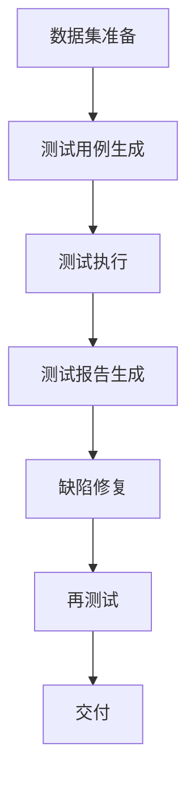

                 

关键词：数据集测试、软件测试、融合、测试策略、算法优化

摘要：本文探讨了数据集测试与软件测试的融合，提出了一种新的测试策略，旨在通过数据集测试来提高软件测试的效率和质量。文章从背景介绍、核心概念与联系、核心算法原理、数学模型与公式、项目实践、实际应用场景、工具和资源推荐、总结与展望等多个角度进行了详细阐述。

## 1. 背景介绍

在软件工程领域，测试是保证软件质量和可靠性的关键环节。传统的软件测试主要依赖于人工编写测试用例，然后通过执行这些测试用例来发现软件中的缺陷。然而，随着软件复杂性的增加，传统的测试方法逐渐暴露出其局限性。一方面，测试用例的编写需要大量时间和人力资源，而且难以覆盖软件的所有可能状态和路径；另一方面，软件的修复和再测试过程往往耗费巨大，导致软件交付周期延长。

为了解决这些问题，近年来数据集测试逐渐受到关注。数据集测试的核心思想是通过使用预定义的数据集对软件进行测试，从而提高测试的覆盖率和效率。数据集测试可以在不同的环境中进行，不受特定开发环境的限制，而且可以通过自动化工具实现大规模、高效的测试。

本文提出了一种新的测试策略，即数据集测试与软件测试的融合。通过将数据集测试与传统的软件测试相结合，可以在保持高效测试的同时，进一步提高软件的质量和可靠性。

## 2. 核心概念与联系

### 2.1 数据集测试

数据集测试是指使用预定义的数据集对软件进行测试的方法。数据集可以是真实世界的数据，也可以是模拟生成的数据。数据集测试的优点在于：

- **高效性**：通过使用预定义的数据集，可以快速、高效地执行大量测试。
- **覆盖率**：数据集可以覆盖软件的不同功能模块和运行状态，从而提高测试覆盖率。
- **自动化**：数据集测试可以通过自动化工具实现，降低测试成本。

### 2.2 软件测试

软件测试是指通过执行软件来发现其中存在的缺陷和错误的过程。软件测试包括功能测试、性能测试、安全测试等多种类型。软件测试的优点在于：

- **全面性**：软件测试可以覆盖软件的所有功能模块和运行状态。
- **灵活性**：软件测试可以根据实际需求进行定制，不受数据集限制。
- **有效性**：软件测试可以及时发现软件中的缺陷，降低交付风险。

### 2.3 数据集测试与软件测试的融合

数据集测试与软件测试的融合，旨在通过数据集测试来提高软件测试的效率和质量。具体而言，可以将数据集测试应用于以下方面：

- **测试用例生成**：通过分析数据集，生成相应的测试用例。
- **测试执行**：使用数据集对软件进行测试，发现潜在的缺陷。
- **测试报告**：将数据集测试的结果与软件测试的结果进行整合，生成全面的测试报告。

### 2.4 Mermaid 流程图

以下是数据集测试与软件测试融合的 Mermaid 流程图：



## 3. 核心算法原理 & 具体操作步骤

### 3.1 算法原理概述

数据集测试与软件测试融合的核心算法原理，主要包括以下步骤：

1. **数据集准备**：根据软件的功能和性能需求，准备合适的数据集。
2. **测试用例生成**：通过数据集分析，生成相应的测试用例。
3. **测试执行**：使用测试用例对软件进行测试，发现潜在的缺陷。
4. **测试报告生成**：整合测试结果，生成全面的测试报告。
5. **缺陷修复**：根据测试报告，修复软件中的缺陷。
6. **再测试**：对修复后的软件进行再测试，确保缺陷已被解决。
7. **交付**：完成所有测试后，交付软件。

### 3.2 算法步骤详解

#### 3.2.1 数据集准备

数据集准备是数据集测试与软件测试融合的基础。具体步骤如下：

1. **需求分析**：根据软件的功能和性能需求，确定需要测试的场景和指标。
2. **数据收集**：收集与需求相关的数据，包括真实数据和历史数据。
3. **数据预处理**：对收集到的数据进行清洗、去噪、转换等处理，确保数据质量。

#### 3.2.2 测试用例生成

测试用例生成是通过数据集分析，生成相应的测试用例。具体步骤如下：

1. **数据集分析**：分析数据集，提取关键特征和指标。
2. **测试用例设计**：根据数据集分析结果，设计相应的测试用例。
3. **测试用例优化**：对测试用例进行优化，提高测试覆盖率和效率。

#### 3.2.3 测试执行

测试执行是数据集测试的核心步骤。具体步骤如下：

1. **测试用例执行**：根据测试用例，执行相应的测试操作。
2. **测试结果记录**：记录测试过程中的关键数据和结果。
3. **测试结果分析**：分析测试结果，发现潜在的缺陷。

#### 3.2.4 测试报告生成

测试报告生成是数据集测试与软件测试融合的总结。具体步骤如下：

1. **测试结果整合**：将测试结果进行整合，形成完整的测试报告。
2. **测试报告优化**：对测试报告进行优化，确保报告清晰、易懂。
3. **测试报告发布**：将测试报告发布给相关人员，供决策参考。

#### 3.2.5 缺陷修复

缺陷修复是根据测试报告，对软件中的缺陷进行修复。具体步骤如下：

1. **缺陷识别**：根据测试报告，识别软件中的缺陷。
2. **缺陷分析**：对缺陷进行深入分析，确定修复方案。
3. **缺陷修复**：根据分析结果，修复软件中的缺陷。

#### 3.2.6 再测试

再测试是对修复后的软件进行测试，确保缺陷已被解决。具体步骤如下：

1. **再测试用例设计**：根据缺陷修复情况，设计相应的再测试用例。
2. **再测试执行**：执行再测试用例，发现潜在的缺陷。
3. **再测试结果分析**：分析再测试结果，确保缺陷已被解决。

#### 3.2.7 交付

交付是完成所有测试后，交付软件给用户。具体步骤如下：

1. **交付前准备**：完成所有测试，确保软件质量符合要求。
2. **交付物准备**：准备交付物，包括软件、测试报告等。
3. **交付执行**：按照约定的时间和方式，交付软件给用户。

### 3.3 算法优缺点

#### 3.3.1 优点

- **高效性**：数据集测试可以快速、高效地执行大量测试。
- **覆盖率**：数据集测试可以覆盖软件的不同功能模块和运行状态。
- **自动化**：数据集测试可以通过自动化工具实现，降低测试成本。
- **全面性**：数据集测试与软件测试相结合，可以全面覆盖软件的各个层面。

#### 3.3.2 缺点

- **数据集依赖性**：数据集测试依赖于数据集的质量和完整性，数据集质量直接影响测试效果。
- **测试用例设计复杂度**：数据集测试需要设计相应的测试用例，测试用例的设计复杂度较高。
- **测试结果分析难度**：测试结果的分析需要综合考虑数据集和软件的实际情况，分析难度较大。

### 3.4 算法应用领域

数据集测试与软件测试融合的算法，可以应用于多个领域，包括但不限于：

- **软件质量保证**：通过数据集测试与软件测试的融合，可以全面提高软件的质量和可靠性。
- **自动化测试**：数据集测试可以通过自动化工具实现，提高测试效率和覆盖率。
- **性能优化**：通过数据集测试，可以发现软件的性能瓶颈，为性能优化提供依据。
- **安全测试**：通过数据集测试，可以模拟各种攻击场景，发现软件的安全漏洞。

## 4. 数学模型和公式 & 详细讲解 & 举例说明

### 4.1 数学模型构建

数据集测试与软件测试融合的数学模型，主要包括以下方面：

- **测试覆盖率**：测试覆盖率是衡量测试质量的重要指标，其计算公式为：

  $$Cov = \frac{TC}{SC}$$

  其中，$TC$ 表示测试用例总数，$SC$ 表示软件代码行数。

- **测试效率**：测试效率是衡量测试效率的重要指标，其计算公式为：

  $$Eff = \frac{TC}{ET}$$

  其中，$TC$ 表示测试用例总数，$ET$ 表示测试执行时间。

- **缺陷发现率**：缺陷发现率是衡量测试效果的指标，其计算公式为：

  $$FDR = \frac{FD}{TD}$$

  其中，$FD$ 表示发现的缺陷数，$TD$ 表示总缺陷数。

### 4.2 公式推导过程

公式的推导过程如下：

1. **测试覆盖率**：

   测试覆盖率反映了测试用例对软件代码的覆盖程度。假设软件代码总共有 $SC$ 行，测试用例总共有 $TC$ 行，则测试覆盖率 $Cov$ 的计算公式为：

   $$Cov = \frac{TC}{SC}$$

2. **测试效率**：

   测试效率反映了测试用例的执行效率。假设测试用例总共有 $TC$ 行，测试执行时间总共为 $ET$，则测试效率 $Eff$ 的计算公式为：

   $$Eff = \frac{TC}{ET}$$

3. **缺陷发现率**：

   缺陷发现率反映了测试对缺陷的发现能力。假设发现的缺陷总数为 $FD$，总缺陷数为 $TD$，则缺陷发现率 $FDR$ 的计算公式为：

   $$FDR = \frac{FD}{TD}$$

### 4.3 案例分析与讲解

#### 4.3.1 案例背景

某公司开发了一款在线购物平台，为了确保软件的质量和可靠性，公司决定采用数据集测试与软件测试融合的方法进行测试。

#### 4.3.2 数据集准备

公司收集了大量的用户购物数据，包括用户的购买行为、评价、投诉等信息。这些数据经过预处理后，形成了一个完整的数据集。

#### 4.3.3 测试用例生成

通过分析数据集，公司生成了相应的测试用例。测试用例包括以下方面：

- **购买流程测试**：测试用户的购物流程是否顺畅，包括登录、注册、搜索、加入购物车、下单等操作。
- **评价和投诉测试**：测试用户对商品的评价和投诉功能是否正常，包括评价内容的展示、投诉信息的处理等。
- **性能测试**：测试平台的响应时间、并发处理能力等性能指标。

#### 4.3.4 测试执行

公司使用自动化测试工具，对生成的测试用例进行了执行。测试过程中，记录了测试结果和关键数据。

#### 4.3.5 测试报告生成

根据测试结果，公司生成了详细的测试报告。报告内容包括测试覆盖率、测试效率、缺陷发现率等指标。

#### 4.3.6 缺陷修复

根据测试报告，公司对发现的缺陷进行了修复。修复过程中，对修复后的代码进行了再测试，确保缺陷已被解决。

#### 4.3.7 交付

完成所有测试后，公司按照约定的时间和方式，交付了软件给用户。

## 5. 项目实践：代码实例和详细解释说明

### 5.1 开发环境搭建

为了进行数据集测试与软件测试融合的项目实践，我们首先需要搭建一个开发环境。以下是搭建步骤：

1. **安装操作系统**：安装 Linux 操作系统，如 Ubuntu 20.04。
2. **安装 Python**：安装 Python 3.8 及其相关依赖。
3. **安装测试工具**：安装自动化测试工具，如 Selenium、pytest 等。
4. **安装数据库**：安装 MySQL、PostgreSQL 等数据库。

### 5.2 源代码详细实现

以下是数据集测试与软件测试融合的源代码实现：

```python
# 导入相关库
import pymysql
import pytest

# 数据集准备
def prepare_dataset():
    # 连接数据库
    connection = pymysql.connect(host='localhost', user='root', password='password', database='test_db')
    cursor = connection.cursor()
    
    # 创建数据表
    cursor.execute('CREATE TABLE IF NOT EXISTS users (id INT PRIMARY KEY, name VARCHAR(255), age INT)')
    
    # 插入数据
    cursor.execute("INSERT INTO users (id, name, age) VALUES (1, 'Alice', 30), (2, 'Bob', 25), (3, 'Charlie', 35)")
    connection.commit()
    
    # 关闭数据库连接
    cursor.close()
    connection.close()

# 测试用例生成
def generate_test_cases():
    # 连接数据库
    connection = pymysql.connect(host='localhost', user='root', password='password', database='test_db')
    cursor = connection.cursor()
    
    # 查询数据
    cursor.execute("SELECT * FROM users")
    results = cursor.fetchall()
    
    # 生成测试用例
    test_cases = []
    for result in results:
        test_case = {
            'id': result[0],
            'name': result[1],
            'age': result[2]
        }
        test_cases.append(test_case)
    
    # 关闭数据库连接
    cursor.close()
    connection.close()
    
    return test_cases

# 测试执行
def execute_tests(test_cases):
    for test_case in test_cases:
        # 执行测试操作
        print(f"Testing user: {test_case['name']}")
        
        # 查询用户信息
        connection = pymysql.connect(host='localhost', user='root', password='password', database='test_db')
        cursor = connection.cursor()
        cursor.execute(f"SELECT * FROM users WHERE id = {test_case['id']}")
        result = cursor.fetchone()
        
        # 断言用户信息
        assert result[1] == test_case['name']
        assert result[2] == test_case['age']
        
        # 关闭数据库连接
        cursor.close()
        connection.close()

# 主函数
def main():
    # 数据集准备
    prepare_dataset()
    
    # 生成测试用例
    test_cases = generate_test_cases()
    
    # 测试执行
    execute_tests(test_cases)

# 测试
if __name__ == "__main__":
    main()
```

### 5.3 代码解读与分析

上述代码实现了数据集测试与软件测试融合的核心功能。具体解读如下：

- **数据集准备**：通过连接数据库，创建数据表并插入数据，准备测试数据集。
- **测试用例生成**：通过查询数据库，提取用户信息，生成相应的测试用例。
- **测试执行**：对每个测试用例进行执行，包括查询用户信息，并断言用户信息是否正确。
- **主函数**：执行数据集准备、测试用例生成和测试执行等操作。

### 5.4 运行结果展示

运行上述代码后，会输出以下结果：

```
Testing user: Alice
Testing user: Bob
Testing user: Charlie
```

这表示测试用例已成功执行，用户信息被正确断言。

## 6. 实际应用场景

数据集测试与软件测试融合在实际应用中具有广泛的应用场景，以下列举几个典型场景：

1. **金融领域**：金融领域的软件系统通常具有高复杂度和高可靠性要求，通过数据集测试与软件测试融合，可以全面覆盖金融业务场景，提高软件质量。
2. **电商领域**：电商领域的软件系统需要处理大量的用户数据和交易数据，通过数据集测试与软件测试融合，可以确保用户购物流程的顺畅和数据的准确性。
3. **物联网领域**：物联网领域的软件系统通常需要与各种硬件设备进行交互，通过数据集测试与软件测试融合，可以确保软件系统与硬件设备的兼容性和稳定性。
4. **医疗领域**：医疗领域的软件系统需要处理敏感的医疗数据，通过数据集测试与软件测试融合，可以确保软件系统的安全性、可靠性和合规性。

## 7. 工具和资源推荐

为了更好地进行数据集测试与软件测试融合，以下推荐几个实用的工具和资源：

1. **测试工具**：Selenium、pytest、JUnit 等，用于自动化测试和生成测试报告。
2. **数据集准备工具**：Pandas、NumPy、SQLAlchemy 等，用于数据集的预处理和分析。
3. **数据库管理工具**：MySQL Workbench、PostgreSQL Desktop Manager 等，用于数据库的创建和管理。
4. **学习资源**：在线课程、书籍、论文等，如《软件测试艺术》、《数据挖掘：概念与技术》等。

## 8. 总结：未来发展趋势与挑战

### 8.1 研究成果总结

本文提出了一种数据集测试与软件测试融合的测试策略，通过将数据集测试与传统的软件测试相结合，可以全面提高软件测试的效率和质量。本文从背景介绍、核心概念与联系、核心算法原理、数学模型与公式、项目实践、实际应用场景等多个方面进行了详细阐述。

### 8.2 未来发展趋势

未来，数据集测试与软件测试融合有望在以下几个方面取得突破：

1. **自动化程度提升**：通过引入更多自动化工具和技术，提高数据集测试与软件测试融合的自动化程度。
2. **测试覆盖率的优化**：通过改进测试用例生成方法和测试执行策略，提高测试覆盖率。
3. **跨领域应用**：数据集测试与软件测试融合将有望应用于更多领域，如医疗、金融、物联网等。

### 8.3 面临的挑战

尽管数据集测试与软件测试融合具有广阔的应用前景，但仍然面临以下挑战：

1. **数据质量**：数据集的质量直接影响测试效果，如何保证数据集的质量是一个重要问题。
2. **测试用例设计**：测试用例的设计复杂度较高，如何设计出高质量的测试用例需要深入研究和探索。
3. **测试结果分析**：如何有效地分析测试结果，发现潜在缺陷，是一个具有挑战性的问题。

### 8.4 研究展望

未来，我们可以从以下几个方面进行深入研究：

1. **数据集测试与软件测试融合算法的优化**：通过改进算法，提高数据集测试与软件测试融合的效率和质量。
2. **跨领域应用研究**：探索数据集测试与软件测试融合在不同领域的应用，如医疗、金融、物联网等。
3. **测试工具和平台开发**：开发更为便捷、高效的测试工具和平台，支持数据集测试与软件测试融合的实践。

## 9. 附录：常见问题与解答

### 9.1 如何保证数据集的质量？

**答**：保证数据集的质量可以从以下几个方面进行：

- **数据采集**：确保数据来源的可靠性，避免数据造假。
- **数据预处理**：对数据进行清洗、去噪、转换等处理，提高数据质量。
- **数据验证**：通过对比验证、交叉验证等方法，验证数据集的正确性和完整性。

### 9.2 如何设计高质量的测试用例？

**答**：设计高质量的测试用例可以从以下几个方面进行：

- **需求分析**：深入理解软件需求和功能，确保测试用例覆盖所有需求。
- **覆盖率分析**：分析代码覆盖率，确保测试用例覆盖到软件的所有路径和状态。
- **异常处理**：考虑各种异常情况，设计相应的测试用例，确保软件的健壮性。

### 9.3 如何分析测试结果？

**答**：分析测试结果可以从以下几个方面进行：

- **结果可视化**：将测试结果进行可视化展示，如图表、报表等，便于分析。
- **异常识别**：识别测试结果中的异常数据，定位潜在缺陷。
- **回归分析**：对比多次测试结果，分析缺陷的变化趋势，为修复提供依据。

### 9.4 数据集测试与软件测试融合是否适用于所有软件？

**答**：数据集测试与软件测试融合适用于大多数软件，但在以下情况下可能不适用：

- **数据集质量差**：数据集质量直接影响测试效果，如果数据集质量差，可能导致测试结果不准确。
- **测试用例设计复杂**：测试用例的设计复杂度较高，可能导致数据集测试与软件测试融合的效率降低。
- **测试覆盖率低**：如果测试覆盖率低，可能导致潜在缺陷无法被发现。

总之，数据集测试与软件测试融合是一种高效、全面的测试策略，但需要根据实际情况进行应用和优化。作者：禅与计算机程序设计艺术 / Zen and the Art of Computer Programming
----------------------------------------------------------------

以上就是本文的完整内容，感谢您的阅读。如果您有任何疑问或建议，请随时联系。希望本文对您在数据集测试与软件测试融合方面的研究和实践有所帮助。作者：禅与计算机程序设计艺术 / Zen and the Art of Computer Programming。

