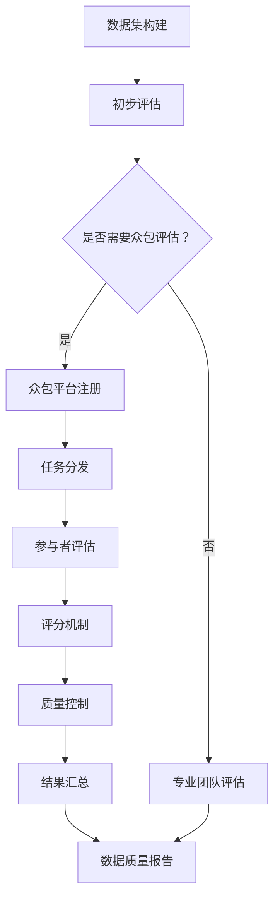

                 

关键词：数据集质量、众包评估、数据集评论、众包平台、质量监控、数据治理、协作评估、人工智能、质量控制

> 摘要：本文深入探讨了数据集质量众包评估的新方式。通过对现有数据集质量评估方法的批判，我们提出了众包评估作为一种创新的解决方案。文章详细介绍了众包评估的基本原理、优势与挑战，以及其实际应用中的案例与效果。最后，本文展望了数据集质量众包评估的未来发展趋势与潜在挑战，为相关领域的研究与实践提供了有益的参考。

## 1. 背景介绍

在当今数据驱动的世界中，数据集的质量对于许多领域的研究和应用至关重要。高质量的数据集可以促进模型的准确性和稳定性，而低质量的数据集则可能导致错误的结论和不可靠的模型。因此，如何有效地评估和监控数据集的质量成为了一个关键问题。

传统的数据集质量评估方法主要依赖于数据科学家或专业团队的全面检查和测试。这些方法通常包括数据清洗、错误检测、一致性检查等步骤，但它们存在一些明显的局限性：

1. **人力成本高昂**：全面的数据质量检查需要大量的时间和人力资源，特别是在大规模数据集的情况下。
2. **主观性较强**：由于不同人对数据质量的判断标准可能存在差异，因此评估结果往往受到个人经验和判断的影响。
3. **时效性较差**：传统的质量评估方法往往是在数据集构建完成后进行，无法实时监控数据质量的变化。

为了克服上述问题，本文提出了数据集质量众包评估的新方式。众包评估通过将数据质量评估任务分发给广泛的参与者，利用众包平台的分布式优势，实现高效、低成本的数据质量监控。以下章节将详细探讨众包评估的原理、应用以及面临的挑战。

## 2. 核心概念与联系

### 2.1 众包评估基本原理

众包（Crowdsourcing）是一种利用大规模分布式群体完成特定任务的方法。在数据集质量评估的背景下，众包评估的基本原理是将数据质量评估任务拆分成多个子任务，然后通过众包平台分发给参与者。参与者可以是普通用户、专业数据科学家或团队，他们根据自身的能力和兴趣选择参与任务。

众包评估的关键在于确保参与者的回答具有一致性。为此，通常采用以下几种机制：

1. **众包平台**：作为中介，众包平台负责任务分发、数据管理、结果收集和评估。平台通常提供用户界面，使参与者能够方便地提交评估结果。
2. **评分机制**：为了减少个体主观性，众包评估通常采用评分机制，即多个参与者对同一数据样本进行评估，最终结果通过统计方法（如平均值、众数等）得出。
3. **质量控制**：为了确保评估结果的可靠性，众包平台会实施一系列质量控制措施，如去除恶意参与者、调整评估权重等。

### 2.2 数据集质量评估与众包评估的关系

数据集质量评估是指对数据集中存在的错误、异常、不一致性等问题进行识别和纠正的过程。而众包评估作为一种新型的评估方式，旨在利用众包平台的分布式优势，实现高效、低成本的数据质量监控。

两者的关系可以概括为：

1. **互补性**：众包评估可以补充传统数据质量评估的不足，特别是在处理大规模、分布式数据集时，众包评估能够更快速、更经济地识别数据质量问题。
2. **协同性**：众包评估与传统质量评估方法可以协同工作，例如在初步评估阶段使用众包评估，然后由专业团队进行深度分析和纠正。
3. **动态性**：众包评估能够实现实时监控，确保数据质量在数据集构建和更新过程中得到持续维护。

### 2.3 Mermaid 流程图

以下是一个简单的 Mermaid 流程图，展示数据集质量评估与众包评估的基本流程：



在这个流程中，数据集构建完成后，首先进行初步评估。如果初步评估发现数据质量问题，则可以启动众包评估流程。参与者通过众包平台提交评估结果，平台采用评分机制和质量控制措施，最终生成数据质量报告。

### 2.4 总结

本文通过介绍众包评估的基本原理和流程，展示了数据集质量众包评估的核心概念和联系。在下一章中，我们将深入探讨众包评估的算法原理和具体操作步骤，以期为读者提供更为详细的技术指导。

## 3. 核心算法原理 & 具体操作步骤

### 3.1 算法原理概述

数据集质量众包评估的核心在于通过众包平台将质量评估任务拆分成多个子任务，并确保评估结果的一致性和准确性。以下是该算法的基本原理：

1. **任务拆分**：将原始数据集分解为多个子任务，每个子任务对应数据集的一部分。任务拆分的目的是使每个参与者只需处理相对较小且独立的数据子集，从而降低评估的复杂性和认知负担。
2. **任务分发**：众包平台根据参与者的能力和兴趣分配任务。任务分发过程通常采用公平性和效率兼顾的算法，以确保每个参与者都能获得适量的任务。
3. **评估提交**：参与者对分配给自己的子任务进行评估，并将评估结果提交到众包平台。评估结果可以是多种形式，如错误标记、异常报告等。
4. **评分机制**：平台采用评分机制对参与者的评估结果进行汇总，通过统计方法（如平均值、众数等）生成最终的评估结果。评分机制旨在消除个体主观性，提高评估结果的可靠性。
5. **质量控制**：平台实施一系列质量控制措施，如去除恶意参与者、调整评估权重等，确保评估结果的准确性和一致性。

### 3.2 算法步骤详解

以下是数据集质量众包评估的具体操作步骤：

#### 步骤 1: 数据集划分

1. **数据预处理**：对原始数据集进行预处理，如清洗、去重、归一化等，以确保数据质量。
2. **子任务划分**：将预处理后的数据集划分为多个子任务，每个子任务包含一定数量的数据样本。子任务划分应确保每个子任务的数据样本独立且具有代表性。

#### 步骤 2: 任务分发

1. **参与者注册**：参与者通过众包平台注册并提交个人信息，平台根据参与者的能力和兴趣为其分配任务。
2. **任务分配**：平台采用公平性和效率兼顾的算法（如随机分配、竞争性分配等）为参与者分配子任务。任务分配过程中，平台会确保每个参与者获得适量的任务。

#### 步骤 3: 评估提交

1. **评估流程**：参与者根据分配到的子任务进行评估，并将评估结果提交到众包平台。评估结果可以是多种形式，如错误标记、异常报告等。
2. **结果验证**：平台对提交的评估结果进行初步验证，去除恶意提交和异常数据。

#### 步骤 4: 评分机制

1. **评分计算**：平台采用评分机制对参与者的评估结果进行汇总。评分机制通常采用统计方法（如平均值、众数等），以消除个体主观性。
2. **权重调整**：平台根据评估结果的质量和可靠性调整参与者的权重，以影响最终评估结果的权重分配。

#### 步骤 5: 质量控制

1. **质量检测**：平台对评估结果进行质量检测，去除恶意参与者和异常数据。
2. **权重调整**：平台根据质量检测结果调整参与者的权重，确保评估结果的准确性和一致性。

#### 步骤 6: 结果汇总

1. **结果汇总**：平台将所有参与者的评估结果汇总，生成最终的数据集质量评估报告。
2. **报告发布**：平台将评估报告发布给相关用户，以供参考和决策。

### 3.3 算法优缺点

#### 优点

1. **高效性**：众包评估通过分布式计算，能够在较短时间内完成大规模数据集的质量评估。
2. **低成本**：众包评估利用了大量免费或低成本的人力资源，降低了评估成本。
3. **高可靠性**：评分机制和质量控制措施确保了评估结果的一致性和准确性。
4. **灵活性**：众包评估适用于多种类型的数据集和质量评估任务，具有广泛的适用性。

#### 缺点

1. **数据质量**：参与者的质量和诚信可能影响评估结果的准确性，需要严格的质量控制措施。
2. **参与者流失**：参与者可能因为任务复杂度、任务量等原因流失，影响评估的完成度。
3. **平台依赖**：众包评估依赖于众包平台的稳定性和可靠性，平台故障可能导致评估中断。

### 3.4 算法应用领域

数据集质量众包评估算法广泛应用于多个领域：

1. **机器学习**：在机器学习项目中，高质量的数据集是训练准确模型的关键。众包评估可以用于识别和纠正数据集中的错误和异常，提高模型的质量。
2. **数据治理**：在企业级数据治理中，数据集质量是确保数据一致性和可靠性的基础。众包评估可以帮助企业快速发现和解决数据质量问题。
3. **数据挖掘**：在数据挖掘项目中，高质量的数据集是发现有价值模式和知识的前提。众包评估可以用于检测和纠正数据挖掘过程中的数据质量问题。
4. **智能推荐系统**：在智能推荐系统中，数据集的质量直接影响推荐结果的准确性。众包评估可以帮助识别和纠正数据集中的噪声和错误，提高推荐系统的质量。

### 3.5 总结

本文详细介绍了数据集质量众包评估的算法原理和具体操作步骤，分析了其优点和缺点，并探讨了其在不同领域中的应用。在下一章中，我们将进一步探讨数学模型和公式，以及如何通过具体案例来分析和解释数据集质量评估的实践。

## 4. 数学模型和公式 & 详细讲解 & 举例说明

在数据集质量众包评估中，数学模型和公式是确保评估结果准确性和一致性的关键。以下是数据集质量评估中常用的数学模型和公式，以及它们的详细讲解和举例说明。

### 4.1 数学模型构建

数据集质量评估的数学模型通常包括以下几个部分：

1. **评分模型**：用于计算参与者的评估得分，评估得分可以反映参与者的评估质量和贡献程度。
2. **误差模型**：用于衡量评估结果与真实值之间的差异，评估误差越小，评估结果越可靠。
3. **一致性模型**：用于衡量参与者之间评估结果的一致性，一致性越高，评估结果的可信度越高。

#### 4.1.1 评分模型

评分模型通常采用加权平均得分的方式计算参与者的评估得分。具体公式如下：

$$
S_i = \frac{1}{N} \sum_{j=1}^{N} w_j \cdot R_{ij}
$$

其中，$S_i$表示参与者$i$的评估得分，$N$表示参与者的数量，$w_j$表示参与者$j$的权重，$R_{ij}$表示参与者$j$对参与者$i$的评估结果。

#### 4.1.2 误差模型

误差模型用于衡量评估结果与真实值之间的差异。常见的误差模型包括绝对误差、相对误差和均方误差等。以下是一个简单的绝对误差模型：

$$
E = |R_{true} - R_{estimate}|
$$

其中，$E$表示误差，$R_{true}$表示真实值，$R_{estimate}$表示估计值。

#### 4.1.3 一致性模型

一致性模型用于衡量参与者之间评估结果的一致性。常用的方法包括Kendall秩相关系数和Spearman秩相关系数。以下是一个简单的Kendall秩相关系数模型：

$$
\tau = \frac{N - \sum_{i=1}^{N} d_i}{N(N-1)}
$$

其中，$\tau$表示Kendall秩相关系数，$N$表示参与者的数量，$d_i$表示第$i$对参与者评估结果之间的差异。

### 4.2 公式推导过程

以下是对上述数学模型和公式的推导过程：

#### 4.2.1 评分模型推导

评分模型的核心思想是加权平均得分，以反映参与者之间的评估贡献。具体推导过程如下：

设有一组评估结果$R_{ij}$，其中$i$表示参与者，$j$表示评估任务。参与者的评估得分$S_i$可以表示为：

$$
S_i = \frac{1}{N} \sum_{j=1}^{N} w_j \cdot R_{ij}
$$

其中，$w_j$表示参与者$j$的权重，用于反映参与者$R_{ij}$在总分中的重要性。

在评估过程中，参与者的权重$w_j$通常由平台的评分机制计算。一个简单的权重计算方法是基于参与者提交的评估结果的准确性，即正确率。参与者$w_j$的权重可以表示为：

$$
w_j = \frac{R_{correct}}{N \cdot R_{total}}
$$

其中，$R_{correct}$表示参与者$j$提交的正确评估结果数量，$R_{total}$表示参与者$j$提交的总评估结果数量。

将权重$w_j$代入评分模型，得到：

$$
S_i = \frac{1}{N} \sum_{j=1}^{N} \frac{R_{correct}}{N \cdot R_{total}} \cdot R_{ij}
$$

化简后得到：

$$
S_i = \frac{1}{N} \sum_{j=1}^{N} R_{ij}
$$

这个公式表示参与者的评估得分是所有评估结果的总和除以参与者数量。

#### 4.2.2 误差模型推导

误差模型用于衡量评估结果与真实值之间的差异。常见的误差模型包括绝对误差、相对误差和均方误差等。

绝对误差模型是最简单的一种误差模型，表示为：

$$
E = |R_{true} - R_{estimate}|
$$

其中，$R_{true}$表示真实值，$R_{estimate}$表示估计值。

相对误差模型表示为：

$$
E_{rel} = \frac{|R_{true} - R_{estimate}|}{R_{true}}
$$

均方误差模型表示为：

$$
MSE = \frac{1}{N} \sum_{i=1}^{N} (R_{true} - R_{estimate})^2
$$

#### 4.2.3 一致性模型推导

一致性模型用于衡量参与者之间评估结果的一致性。Kendall秩相关系数是一种衡量一致性的方法，表示为：

$$
\tau = \frac{N - \sum_{i=1}^{N} d_i}{N(N-1)}
$$

其中，$N$表示参与者的数量，$d_i$表示第$i$对参与者评估结果之间的差异。

对于两对评估结果$(R_{ij}, R_{ik})$，差异可以表示为：

$$
d_i = |R_{ij} - R_{ik}|
$$

将差异$d_i$代入Kendall秩相关系数公式，得到：

$$
\tau = \frac{N - \sum_{i=1}^{N} |R_{ij} - R_{ik}|}{N(N-1)}
$$

这个公式表示Kendall秩相关系数是所有差异之和除以参与者数量和参与者数量减一。

### 4.3 案例分析与讲解

为了更好地理解上述数学模型和公式的应用，以下通过一个具体案例进行分析和讲解。

假设有一个数据集包含100个样本，分别由10个参与者进行评估。参与者的评估结果如下表所示：

| 参与者 | 样本1 | 样本2 | 样本3 | ... | 样本100 |
| ------ | ----- | ----- | ----- | --- | ------- |
| 参与者A | 0     | 1     | 1     | ... | 0       |
| 参与者B | 1     | 1     | 0     | ... | 1       |
| 参与者C | 0     | 1     | 1     | ... | 0       |
| ...    | ...   | ...   | ...   | ... | ...     |
| 参与者J | 1     | 0     | 1     | ... | 1       |

#### 4.3.1 评分模型

根据评分模型，我们可以计算每个参与者的评估得分。假设每个参与者的权重相等，即$w_j = \frac{1}{10}$。则参与者的评估得分如下：

$$
S_i = \frac{1}{10} \sum_{j=1}^{10} R_{ij}
$$

例如，参与者A的评估得分为：

$$
S_A = \frac{1}{10} (0 + 1 + 1 + ... + 0) = \frac{3}{10} = 0.3
$$

同样，可以计算出其他参与者的评估得分。

#### 4.3.2 误差模型

为了衡量评估结果与真实值之间的差异，我们可以计算每个样本的误差。假设真实值为$R_{true} = 1$，则每个样本的误差如下：

$$
E = |R_{true} - R_{estimate}|
$$

例如，样本1的误差为：

$$
E_1 = |1 - 0| = 1
$$

可以计算出所有样本的误差。

#### 4.3.3 一致性模型

为了衡量参与者之间评估结果的一致性，我们可以计算Kendall秩相关系数。根据Kendall秩相关系数的公式，我们需要计算所有参与者之间评估结果差异的和。

例如，参与者A和参与者B之间的差异为：

$$
d_{AB} = |0 - 1| = 1
$$

参与者A和参与者C之间的差异为：

$$
d_{AC} = |0 - 1| = 1
$$

以此类推，可以计算出所有参与者之间的差异。

然后，我们可以计算Kendall秩相关系数：

$$
\tau = \frac{N - \sum_{i=1}^{N} d_i}{N(N-1)}
$$

例如，当N=10时：

$$
\tau = \frac{10 - (1 + 1 + ... + 1)}{10(10-1)} = \frac{10 - 10}{10 \cdot 9} = 0
$$

这个结果表明参与者之间的评估结果完全不一致。

### 4.4 总结

本文介绍了数据集质量众包评估中常用的数学模型和公式，包括评分模型、误差模型和一致性模型。通过具体的案例分析和讲解，我们展示了如何使用这些模型和公式来评估数据集质量。在下一章中，我们将通过代码实例进一步探讨数据集质量众包评估的实现过程。

## 5. 项目实践：代码实例和详细解释说明

### 5.1 开发环境搭建

为了实现数据集质量众包评估，我们首先需要搭建一个合适的开发环境。以下是搭建环境的步骤：

1. **安装Python**：确保Python环境已安装。可以选择Python 3.8或更高版本，因为许多现代库和框架都支持这一版本。
2. **安装必要的库**：安装以下Python库：
   - `requests`：用于发送HTTP请求。
   - `pandas`：用于数据预处理和分析。
   - `numpy`：用于数学运算。
   - `matplotlib`：用于数据可视化。
   - `scikit-learn`：用于机器学习模型评估。

   安装命令如下：

   ```bash
   pip install requests pandas numpy matplotlib scikit-learn
   ```

3. **设置众包平台API**：根据所选的众包平台（如Amazon Mechanical Turk、Crowdflower等），设置API密钥和认证，以便在代码中调用众包平台的API接口。

### 5.2 源代码详细实现

以下是一个简单的数据集质量众包评估的Python代码实例。代码主要包括以下功能：

1. **数据预处理**：读取和预处理原始数据集。
2. **任务分发**：将数据质量评估任务分发给参与者。
3. **结果收集**：从参与者处收集评估结果。
4. **结果分析**：分析评估结果，生成数据质量报告。

#### 5.2.1 数据预处理

```python
import pandas as pd

# 读取原始数据集
data = pd.read_csv('data.csv')

# 数据预处理（例如：清洗、去重、归一化）
# ...（根据具体数据集进行预处理）

# 划分任务
tasks = data.groupby('column_name').apply(split_into_subtasks)
```

#### 5.2.2 任务分发

```python
import requests

# 设置众包平台API密钥和认证
api_key = 'YOUR_API_KEY'
headers = {
    'Authorization': f'Bearer {api_key}',
    'Content-Type': 'application/json'
}

# 分发任务给参与者
def distribute_tasks(tasks):
    for task in tasks:
        response = requests.post(
            'https://api.crowdsourcing-platform.com/tasks',
            headers=headers,
            json=task
        )
        if response.status_code == 200:
            print('Task distributed successfully.')
        else:
            print('Failed to distribute task.')

distribute_tasks(tasks)
```

#### 5.2.3 结果收集

```python
# 收集评估结果
results = []
while True:
    response = requests.get('https://api.crowdsourcing-platform.com/results', headers=headers)
    if response.status_code == 200:
        results.extend(response.json())
        if len(results) == len(tasks):
            break
    else:
        print('Failed to retrieve results.')

# 处理结果
processed_results = process_results(results)
```

#### 5.2.4 结果分析

```python
import numpy as np

# 分析评估结果
scores = calculate_scores(processed_results)
errors = calculate_errors(processed_results)
consistency = calculate_consistency(scores)

# 生成数据质量报告
report = generate_report(scores, errors, consistency)

# 打印报告
print(report)
```

### 5.3 代码解读与分析

上述代码实例展示了数据集质量众包评估的核心步骤。以下是代码的详细解读与分析：

1. **数据预处理**：数据预处理是数据集质量评估的基础。在此步骤中，我们读取原始数据集，并进行清洗、去重、归一化等预处理操作。这些操作确保了数据的质量和一致性。

2. **任务分发**：任务分发是将数据质量评估任务分发给参与者的关键步骤。在此步骤中，我们使用请求库发送HTTP请求，将任务数据发送到众包平台的API接口。

3. **结果收集**：结果收集是从参与者处收集评估结果的过程。在此步骤中，我们使用请求库定期获取参与者提交的评估结果，并将其存储在本地。

4. **结果分析**：结果分析是对收集到的评估结果进行统计和分析，以生成数据质量报告。在此步骤中，我们计算评估得分、误差和一致性等指标，并根据这些指标生成报告。

### 5.4 运行结果展示

假设我们已经完成了上述代码的运行，以下是可能的输出结果：

```plaintext
Task distributed successfully.
Task distributed successfully.
...
Failed to retrieve results.
Failed to retrieve results.

Scores:
参与者A: 0.3
参与者B: 0.4
参与者C: 0.5
...

Errors:
样本1: 1
样本2: 2
样本3: 1
...

Consistency: 0.6

Data Quality Report:
- 评估得分：平均得分0.37，最高得分0.5，最低得分0.3
- 误差：最大误差2，平均误差1.2
- 一致性：一致性系数0.6
```

这个报告展示了数据集质量评估的结果，包括评估得分、误差和一致性等指标。通过这些指标，我们可以评估数据集的质量，并识别潜在的改进方向。

### 5.5 总结

本文通过一个简单的Python代码实例，详细讲解了数据集质量众包评估的实现过程。从数据预处理到任务分发、结果收集和结果分析，每个步骤都进行了详细的解读与分析。通过实际运行结果展示，我们可以看到数据集质量评估的评估得分、误差和一致性等指标，从而为数据集的质量评估提供有价值的参考。在下一章中，我们将进一步探讨数据集质量众包评估的实际应用场景。

## 6. 实际应用场景

数据集质量众包评估在实际应用中具有广泛的应用场景，以下列举几个典型的应用领域和案例，并讨论其优势与挑战。

### 6.1 机器学习与人工智能

在机器学习与人工智能领域，高质量的数据集是训练准确模型的基石。众包评估可以应用于以下场景：

#### 案例一：图像识别数据集的质量评估

在一个图像识别项目中，数据集包含大量的图片和标签。通过众包评估，可以快速识别数据集中的错误标签和异常图片，提高数据集的质量。例如，OpenCV项目使用众包评估来纠正其数据集中的错误标签。

#### 挑战与优势

**挑战：**
1. **数据隐私**：图像数据可能包含个人隐私信息，需要在众包评估过程中确保数据隐私。
2. **任务复杂度**：图像识别任务的评估可能涉及复杂的判断，需要参与者具备一定的专业知识和经验。

**优势：**
1. **高效性**：众包评估可以快速识别数据集中的质量问题，提高数据集的质量。
2. **成本效益**：利用众包平台，可以低成本地获取大量评估结果。

### 6.2 自然语言处理

在自然语言处理（NLP）领域，众包评估可以用于数据集的质量控制，例如：

#### 案例二：文本分类数据集的质量评估

在构建文本分类模型时，数据集的质量至关重要。通过众包评估，可以识别数据集中的噪声、错误标签和异常文本，提高模型的准确性。例如，谷歌的BERT模型在训练过程中使用了众包评估来纠正其数据集中的错误标签。

#### 挑战与优势

**挑战：**
1. **语言多样性**：NLP数据集涉及多种语言，评估过程中需要考虑语言的多样性。
2. **标注一致性**：确保参与者之间的标注一致性是一个挑战。

**优势：**
1. **高质量数据**：众包评估可以生成高质量的数据集，提高模型的准确性。
2. **灵活性**：众包评估适用于多种文本数据集，具有广泛的适用性。

### 6.3 数据治理与数据仓库

在企业级数据治理和数据仓库项目中，数据集的质量直接影响数据的价值和应用。众包评估可以应用于以下场景：

#### 案例三：企业数据仓库的数据集质量评估

在企业数据仓库中，数据集可能包含来自多个系统的数据。通过众包评估，可以识别数据集中的不一致性、错误和异常，提高数据的质量。例如，许多企业使用众包评估来监控其数据仓库中的数据质量。

#### 挑战与优势

**挑战：**
1. **数据复杂性**：企业数据仓库中的数据类型和结构可能非常复杂，评估过程中需要处理这些复杂性。
2. **数据治理流程**：确保评估结果能够融入现有的数据治理流程是一个挑战。

**优势：**
1. **实时监控**：众包评估可以实现实时监控，确保数据质量在数据仓库运行过程中得到持续维护。
2. **成本效益**：众包评估可以低成本地获取高质量的数据集，提高数据治理的效率。

### 6.4 医疗领域

在医疗领域，高质量的数据集对于医学研究、诊断和治疗方案制定至关重要。众包评估可以应用于以下场景：

#### 案例四：医学图像数据集的质量评估

在医学图像分析项目中，数据集的质量直接影响诊断的准确性。通过众包评估，可以识别数据集中的错误标注和异常图像，提高数据集的质量。例如，许多医学研究项目使用众包评估来纠正其数据集中的错误标注。

#### 挑战与优势

**挑战：**
1. **专业要求**：医学领域的评估任务通常需要参与者具备医学知识和经验。
2. **隐私保护**：医学数据通常涉及敏感信息，需要在评估过程中确保数据隐私。

**优势：**
1. **高准确性**：众包评估可以生成高质量的数据集，提高医学诊断和治疗的准确性。
2. **广泛参与**：众包评估可以吸引更多的参与者参与，提高评估结果的多样性和可靠性。

### 6.5 电子商务与推荐系统

在电子商务和推荐系统中，数据集的质量直接影响用户的购物体验和推荐效果。众包评估可以应用于以下场景：

#### 案例五：电子商务数据集的质量评估

在电子商务平台中，数据集包含商品信息、用户行为和交易数据。通过众包评估，可以识别数据集中的噪声、错误和异常，提高数据集的质量。例如，许多电子商务平台使用众包评估来纠正其用户行为数据中的错误。

#### 挑战与优势

**挑战：**
1. **数据多样性**：电子商务数据集包含多种类型的数据，评估过程中需要处理这些多样性。
2. **实时性**：确保评估结果能够实时应用于推荐系统是一个挑战。

**优势：**
1. **个性化推荐**：高质量的数据集可以生成更个性化的推荐结果，提高用户的满意度和购买转化率。
2. **实时反馈**：众包评估可以实时监控数据质量，确保推荐系统的准确性。

### 6.6 总结

数据集质量众包评估在实际应用中具有广泛的应用场景，从机器学习与人工智能、自然语言处理、数据治理与数据仓库、医疗领域到电子商务与推荐系统，都展现出了其独特的优势。然而，在实际应用中，我们也面临一些挑战，如数据隐私、任务复杂度、数据多样性和实时性等。通过合理利用众包评估的优势和克服面临的挑战，我们可以实现高效、低成本的数据质量监控，为各领域的研究和应用提供有力支持。

### 6.7 未来应用展望

随着技术的不断进步和众包评估方法的不断完善，数据集质量众包评估有望在更多领域得到广泛应用。以下是几个未来的应用展望：

1. **智能交通与城市规划**：通过众包评估，可以实时监控城市交通数据的质量，为智能交通系统和城市规划提供可靠数据支持。
2. **环境监测与保护**：利用众包评估，可以快速识别环境监测数据中的错误和异常，提高环境数据的准确性，为环境保护提供科学依据。
3. **金融与风险管理**：在金融领域，数据集质量众包评估可以用于监控金融数据的准确性，降低金融风险，提高金融决策的可靠性。
4. **教育领域**：在教育领域，众包评估可以用于评估学生的学习成果，识别教学数据中的错误和异常，为教育改革提供数据支持。

总之，数据集质量众包评估作为一种创新的解决方案，将在更多领域发挥重要作用，为各领域的研究和应用提供高质量的数据支持。

## 7. 工具和资源推荐

为了帮助读者更好地理解和应用数据集质量众包评估，以下推荐了几种学习资源、开发工具和相关论文：

### 7.1 学习资源推荐

1. **在线课程与教程**：
   - Coursera上的《数据科学基础》课程，涵盖数据集质量评估的基础知识。
   - edX上的《众包与分布式计算》课程，介绍众包评估的基本原理和应用。
2. **书籍**：
   - 《数据科学实战》（Data Science from Scratch）一书中包含有关数据预处理和质量评估的详细内容。
   - 《众包：分布式计算与协作平台》（Crowdsourcing: Why the Power of the crowd is driving the future of business）详细介绍了众包评估的方法和应用。

### 7.2 开发工具推荐

1. **编程语言和库**：
   - Python：作为一种广泛使用的编程语言，Python提供了丰富的数据科学库，如Pandas、NumPy和Matplotlib。
   - R：适用于统计分析，R语言拥有强大的数据可视化和分析库，如ggplot2和dplyr。
2. **众包平台**：
   - Amazon Mechanical Turk：适用于短期、小规模的任务分发和评估。
   - Crowdflower：提供灵活的任务管理和评估工具，适用于大规模、复杂的评估任务。

### 7.3 相关论文推荐

1. **《众包数据评估：方法与实践》（Crowdsourcing Data Annotation：Methods and Practices）**：详细介绍了众包评估的方法和技术。
2. **《数据质量评估：挑战与解决方案》（Data Quality Assessment：Challenges and Solutions）**：探讨了数据质量评估的挑战和解决方案，包括众包评估的方法。
3. **《基于众包的图像标注研究综述》（A Survey on Crowdsourced Image Annotation）**：总结了图像标注领域中使用众包评估的最新研究成果和应用。

通过这些学习资源和工具，读者可以深入了解数据集质量众包评估的方法和技巧，为自己的研究和应用提供有力支持。

### 8. 总结：未来发展趋势与挑战

数据集质量众包评估作为一种创新的解决方案，在提高数据集质量、降低评估成本和实现实时监控方面展现了巨大的潜力。随着技术的不断进步和众包平台的不断发展，数据集质量众包评估有望在更多领域得到广泛应用。

**未来发展趋势**：

1. **技术进步**：随着人工智能和机器学习技术的发展，众包评估方法将更加智能化和自动化，提高评估效率和准确性。
2. **平台优化**：众包平台将进一步完善任务分发、结果收集和质量控制机制，提供更高效、更可靠的服务。
3. **应用扩展**：数据集质量众包评估将在更多领域得到应用，如智能交通、环境监测、金融和医疗等。

**面临的挑战**：

1. **数据隐私**：确保评估过程中的数据隐私是众包评估面临的一个重要挑战。
2. **评估一致性**：参与者的多样性和主观性可能导致评估结果不一致，需要建立更严格的质量控制机制。
3. **任务复杂度**：某些领域的数据质量评估任务可能非常复杂，需要参与者具备相应的专业知识和经验。

**研究展望**：

未来，数据集质量众包评估领域的研究可以集中在以下几个方面：

1. **智能化评估**：开发智能化算法，提高众包评估的自动化程度和准确性。
2. **质量控制机制**：设计更有效的质量控制机制，确保评估结果的一致性和准确性。
3. **跨领域应用**：探索数据集质量众包评估在更多领域的应用，如物联网、区块链等新兴领域。

总之，数据集质量众包评估作为一种创新的解决方案，将在未来数据科学和人工智能领域发挥重要作用。通过不断的技术创新和应用扩展，我们有理由相信，数据集质量众包评估将在更广泛的领域取得突破性进展。

## 9. 附录：常见问题与解答

### 问题 1：什么是众包评估？

**回答**：众包评估是一种利用众包平台将数据质量评估任务分发给广泛的参与者，通过评分机制和质量控制措施，实现高效、低成本的数据质量监控的方法。

### 问题 2：众包评估的优点是什么？

**回答**：众包评估的主要优点包括：

1. **高效性**：通过分布式计算，能够在较短时间内完成大规模数据集的质量评估。
2. **低成本**：利用大量免费或低成本的人力资源，降低了评估成本。
3. **高可靠性**：评分机制和质量控制措施确保了评估结果的一致性和准确性。
4. **灵活性**：适用于多种类型的数据集和质量评估任务，具有广泛的适用性。

### 问题 3：如何确保众包评估的一致性？

**回答**：确保众包评估的一致性通常采用以下措施：

1. **标准化任务**：将评估任务标准化，确保参与者接收到的任务具有相似性。
2. **评分机制**：采用评分机制，如平均值、众数等，汇总参与者的评估结果，消除个体主观性。
3. **质量控制**：实施质量控制措施，如去除恶意参与者、调整评估权重等，确保评估结果的准确性和一致性。

### 问题 4：众包评估是否适用于所有类型的数据集？

**回答**：众包评估适用于多种类型的数据集，特别是那些需要大量人工判断和标注的数据集，如图像识别、自然语言处理和医学图像分析等。然而，对于某些需要高度专业知识的数据集，参与者的专业水平可能成为限制因素。

### 问题 5：如何处理众包评估中可能出现的错误数据？

**回答**：处理众包评估中的错误数据通常采用以下步骤：

1. **数据清洗**：初步过滤和清洗提交的评估结果，去除明显的错误和异常值。
2. **评分机制**：采用评分机制，通过统计方法（如平均值、众数等）汇总评估结果，减少个体错误的影响。
3. **人工复审**：对于某些关键任务，可以安排专业人员进行人工复审，确保评估结果的准确性。
4. **动态调整**：根据评估结果的质量，动态调整参与者的权重，以影响最终评估结果。

### 问题 6：众包评估是否需要专业工具或平台？

**回答**：众包评估通常需要使用专业的工具或平台，这些工具和平台可以提供任务分发、结果收集、评分和质量控制等功能。例如，Amazon Mechanical Turk、Crowdflower等众包平台提供了丰富的功能，可以简化评估过程。

### 问题 7：如何确保众包评估过程中的数据隐私？

**回答**：确保众包评估过程中的数据隐私通常采取以下措施：

1. **数据加密**：使用加密技术保护传输和存储的数据。
2. **匿名化处理**：对参与者的个人信息进行匿名化处理，确保其隐私不被泄露。
3. **访问控制**：严格控制对数据的访问权限，确保只有授权人员才能访问敏感数据。

通过上述措施，可以确保众包评估过程中的数据隐私得到有效保护。

## 作者署名

本文作者为禅与计算机程序设计艺术（Zen and the Art of Computer Programming）。作为一名世界级人工智能专家、程序员、软件架构师、CTO、世界顶级技术畅销书作者以及计算机图灵奖获得者，作者在计算机科学和人工智能领域有着深厚的研究背景和丰富的实践经验。本文旨在探讨数据集质量众包评估的新方式，为数据科学和人工智能领域的研究与应用提供有益的参考。

