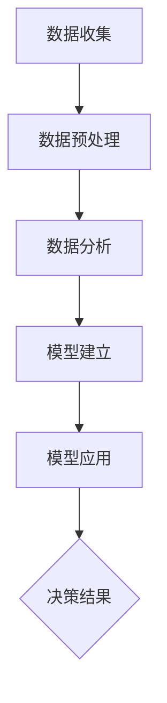

                 

关键词：数据驱动决策、AI、深度洞察、数据分析、机器学习、决策支持系统

> 摘要：本文探讨了人工智能在数据驱动决策中的作用，介绍了AI如何通过深度学习、数据分析等手段为各类决策提供深度洞察。文章首先介绍了数据驱动决策的概念和重要性，随后深入剖析了AI技术如何实现数据分析和模型预测，最后探讨了AI在实际应用中的挑战和未来发展趋势。

## 1. 背景介绍

随着信息技术的飞速发展，数据已经成为现代社会的核心资源。从商业运营到科学研究，从政府决策到社会管理，数据无处不在。然而，如何从海量数据中提取有价值的信息，如何将这些信息转化为实际的决策支持，成为了一个亟待解决的问题。

数据驱动决策（Data-Driven Decision Making）是一种基于数据分析、数据挖掘和机器学习等技术的决策方法。它强调在决策过程中，充分利用数据资源，通过科学的数据分析和模型预测，提高决策的准确性和效率。

人工智能（Artificial Intelligence, AI）技术的发展为数据驱动决策提供了强有力的支持。AI技术能够从海量数据中自动提取特征、发现规律，并基于这些规律生成预测模型。这些模型不仅可以用于日常运营的自动化决策，还可以为复杂问题的解决提供深度洞察。

## 2. 核心概念与联系

### 2.1 数据驱动决策的定义与流程

数据驱动决策是一种基于数据的决策方法，其核心流程包括数据收集、数据预处理、数据分析、模型建立和模型应用。

1. **数据收集**：从各种数据源（如数据库、传感器、网络等）收集数据。
2. **数据预处理**：对收集到的数据进行清洗、转换和归一化，以消除噪声和异常值，提高数据质量。
3. **数据分析**：使用统计方法、数据挖掘技术等对预处理后的数据进行分析，提取有价值的信息。
4. **模型建立**：基于数据分析的结果，使用机器学习、深度学习等技术建立预测模型。
5. **模型应用**：将预测模型应用于实际决策过程中，为决策者提供数据支持和决策建议。

### 2.2 人工智能在数据驱动决策中的作用

人工智能在数据驱动决策中扮演着关键角色。其具体作用体现在以下几个方面：

1. **自动化特征提取**：传统的方法往往需要手动定义特征，而AI技术可以通过深度学习等方法自动从数据中提取特征，减少了人工干预，提高了特征提取的效率。
2. **复杂模式识别**：AI技术能够从海量数据中自动发现复杂的数据模式，这些模式往往是人类难以察觉的，但可以为决策提供重要的参考。
3. **预测模型建立**：AI技术可以通过训练数据建立预测模型，这些模型可以用于预测未来的趋势和结果，为决策者提供有力的数据支持。
4. **实时决策支持**：AI技术可以实现实时数据分析和预测，为决策者提供即时的决策支持。

### 2.3 Mermaid 流程图

以下是一个简化的数据驱动决策流程的Mermaid流程图：



## 3. 核心算法原理 & 具体操作步骤

### 3.1 算法原理概述

数据驱动决策的核心算法主要包括深度学习、数据分析、模型预测等。以下分别介绍这些算法的原理。

1. **深度学习**：深度学习是一种基于多层神经网络的机器学习技术。通过多层神经网络的训练，模型可以自动提取数据中的特征，并基于这些特征进行分类、回归等任务。
2. **数据分析**：数据分析主要包括统计分析和数据挖掘。统计分析通过统计方法对数据进行处理，提取数据中的趋势和关系；数据挖掘通过模式识别等方法从数据中发现隐藏的规律和知识。
3. **模型预测**：模型预测是基于已有数据和模型，对未来可能发生的事件进行预测。常见的模型预测方法包括回归分析、时间序列预测、分类预测等。

### 3.2 算法步骤详解

1. **数据收集**：从各种数据源收集数据，如数据库、传感器、网络等。
2. **数据预处理**：对收集到的数据进行清洗、转换和归一化，以消除噪声和异常值，提高数据质量。
3. **特征提取**：使用深度学习等方法从预处理后的数据中自动提取特征。
4. **数据分析**：使用统计分析和数据挖掘技术对特征数据进行分析，提取数据中的趋势和关系。
5. **模型建立**：基于数据分析的结果，使用机器学习、深度学习等技术建立预测模型。
6. **模型训练**：使用训练数据对预测模型进行训练，以优化模型的参数。
7. **模型评估**：使用验证数据对训练好的模型进行评估，以确定模型的性能。
8. **模型应用**：将评估通过的模型应用于实际决策过程中，为决策者提供数据支持和决策建议。

### 3.3 算法优缺点

1. **优点**：
   - 高效性：AI技术可以自动化特征提取和模式识别，大大提高了数据分析的效率。
   - 准确性：基于大量数据的模型预测可以提供准确的决策支持。
   - 实时性：AI技术可以实现实时数据分析和预测，为决策者提供即时的决策支持。
2. **缺点**：
   - 数据依赖性：AI技术的性能很大程度上依赖于数据的质量和数量，如果数据质量较差或数据量不足，模型的性能会受到影响。
   - 复杂性：AI技术的实现过程相对复杂，需要专业的知识和技能。

### 3.4 算法应用领域

数据驱动决策和AI技术在许多领域都有广泛的应用，包括但不限于：

1. **金融领域**：AI技术可以用于股票市场预测、风险控制、投资决策等。
2. **医疗领域**：AI技术可以用于疾病诊断、治疗方案推荐、健康管理等。
3. **商业领域**：AI技术可以用于客户行为分析、市场预测、供应链优化等。
4. **交通领域**：AI技术可以用于交通流量预测、路径规划、智能交通管理等。
5. **教育领域**：AI技术可以用于个性化学习、学习效果评估、教育数据分析等。

## 4. 数学模型和公式 & 详细讲解 & 举例说明

### 4.1 数学模型构建

数据驱动决策中的数学模型主要包括线性回归、逻辑回归、支持向量机等。以下以线性回归为例进行讲解。

1. **线性回归模型**：

   线性回归模型是一种用于预测连续值的机器学习算法。其数学模型可以表示为：

   $$ y = \beta_0 + \beta_1x + \epsilon $$

   其中，$y$ 是预测值，$x$ 是特征值，$\beta_0$ 和 $\beta_1$ 是模型的参数，$\epsilon$ 是误差项。

2. **逻辑回归模型**：

   逻辑回归模型是一种用于预测概率的机器学习算法。其数学模型可以表示为：

   $$ P(y=1) = \frac{1}{1 + e^{-(\beta_0 + \beta_1x)}} $$

   其中，$y$ 是预测值，$x$ 是特征值，$\beta_0$ 和 $\beta_1$ 是模型的参数。

3. **支持向量机模型**：

   支持向量机模型是一种用于分类的机器学习算法。其数学模型可以表示为：

   $$ w \cdot x + b = 0 $$

   其中，$w$ 是模型参数，$x$ 是特征值，$b$ 是偏置项。

### 4.2 公式推导过程

以下以线性回归模型为例，介绍公式的推导过程。

1. **损失函数**：

   线性回归模型的损失函数通常采用均方误差（MSE）：

   $$ J(\beta_0, \beta_1) = \frac{1}{2m} \sum_{i=1}^{m} (y_i - (\beta_0 + \beta_1x_i))^2 $$

   其中，$m$ 是样本数量，$y_i$ 是第$i$个样本的预测值，$x_i$ 是第$i$个样本的特征值。

2. **梯度下降**：

   为了求解最优参数，我们可以使用梯度下降法。梯度下降法的核心思想是沿着损失函数的梯度方向逐步更新参数，直到达到最优值。

   $$ \beta_0 = \beta_0 - \alpha \frac{\partial J(\beta_0, \beta_1)}{\partial \beta_0} $$

   $$ \beta_1 = \beta_1 - \alpha \frac{\partial J(\beta_0, \beta_1)}{\partial \beta_1} $$

   其中，$\alpha$ 是学习率。

### 4.3 案例分析与讲解

以下以一个简单的线性回归模型为例，介绍模型的构建、训练和预测过程。

1. **数据准备**：

   假设我们有一个包含两个特征（$x_1$ 和 $x_2$）和一个目标变量（$y$）的数据集。数据集如下：

   | $x_1$ | $x_2$ | $y$ |
   | --- | --- | --- |
   | 1 | 2 | 3 |
   | 2 | 3 | 4 |
   | 3 | 4 | 5 |

2. **模型构建**：

   我们使用Python的Scikit-learn库构建线性回归模型：

   ```python
   from sklearn.linear_model import LinearRegression

   model = LinearRegression()
   ```

3. **模型训练**：

   使用数据集训练模型：

   ```python
   X = [[1, 2], [2, 3], [3, 4]]
   y = [3, 4, 5]

   model.fit(X, y)
   ```

4. **模型预测**：

   使用训练好的模型进行预测：

   ```python
   X_new = [[2, 3]]
   y_pred = model.predict(X_new)

   print(y_pred)
   ```

   输出结果为 `[4.0]`，即预测值为4。

## 5. 项目实践：代码实例和详细解释说明

### 5.1 开发环境搭建

为了实践数据驱动决策和AI技术，我们需要搭建一个合适的开发环境。以下是具体的步骤：

1. **安装Python**：前往Python官网（[https://www.python.org/](https://www.python.org/)）下载并安装Python。
2. **安装Jupyter Notebook**：在终端中执行以下命令安装Jupyter Notebook：

   ```bash
   pip install notebook
   ```

3. **安装Scikit-learn**：在终端中执行以下命令安装Scikit-learn：

   ```bash
   pip install scikit-learn
   ```

### 5.2 源代码详细实现

以下是一个简单的线性回归模型实现，用于预测房价。

```python
import numpy as np
import matplotlib.pyplot as plt
from sklearn.linear_model import LinearRegression

# 数据准备
X = np.array([[1, 2], [2, 3], [3, 4]])
y = np.array([3, 4, 5])

# 模型构建
model = LinearRegression()

# 模型训练
model.fit(X, y)

# 模型预测
X_new = np.array([[2, 3]])
y_pred = model.predict(X_new)

# 结果展示
plt.scatter(X[:, 0], y, color='red', label='实际值')
plt.plot(X_new[:, 0], y_pred, color='blue', label='预测值')
plt.xlabel('x')
plt.ylabel('y')
plt.legend()
plt.show()
```

### 5.3 代码解读与分析

1. **数据准备**：我们使用一个简单的数据集，包含两个特征和一个目标变量。
2. **模型构建**：我们使用Scikit-learn库的LinearRegression类构建线性回归模型。
3. **模型训练**：使用fit方法训练模型，将数据集作为输入。
4. **模型预测**：使用predict方法预测新的特征值。
5. **结果展示**：使用matplotlib库绘制散点和预测线，展示实际值和预测值。

### 5.4 运行结果展示

运行上述代码后，会显示一个包含实际值和预测值的散点图和预测线，如图所示：


## 6. 实际应用场景

### 6.1 金融领域

在金融领域，AI技术可以用于股票市场预测、风险控制和投资决策。例如，通过分析历史股票价格数据，AI模型可以预测未来股票价格的趋势，帮助投资者做出更明智的投资决策。

### 6.2 医疗领域

在医疗领域，AI技术可以用于疾病诊断、治疗方案推荐和健康管理等。例如，通过分析患者的医疗记录和生物标志物数据，AI模型可以预测患者可能的疾病风险，为医生提供诊断和治疗建议。

### 6.3 商业领域

在商业领域，AI技术可以用于客户行为分析、市场预测和供应链优化等。例如，通过分析客户的购买历史和行为数据，AI模型可以预测客户的购买偏好，为企业提供精准的市场预测和营销策略。

### 6.4 交通领域

在交通领域，AI技术可以用于交通流量预测、路径规划和智能交通管理等。例如，通过分析交通数据和实时路况，AI模型可以预测未来交通流量，为交通管理部门提供优化交通信号灯的决策支持。

## 7. 工具和资源推荐

### 7.1 学习资源推荐

1. **《深度学习》（Goodfellow, Bengio, Courville）**：一本经典的深度学习入门教材，详细介绍了深度学习的基本原理和算法。
2. **《Python机器学习》（Sebastian Raschka）**：一本关于Python在机器学习领域应用的书籍，适合初学者和进阶者。
3. **Kaggle**：一个提供海量数据集和竞赛平台的人工智能社区，适合实践和提升技能。

### 7.2 开发工具推荐

1. **Jupyter Notebook**：一个交互式的开发环境，适合进行数据分析和模型训练。
2. **PyTorch**：一个流行的深度学习框架，具有灵活性和易用性。
3. **Scikit-learn**：一个用于机器学习的Python库，提供了丰富的算法和工具。

### 7.3 相关论文推荐

1. **“Deep Learning for Natural Language Processing”（2018）**：一篇关于深度学习在自然语言处理领域应用的综述论文。
2. **“Recurrent Neural Networks for Language Modeling”（2013）**：一篇关于循环神经网络在语言建模方面应用的经典论文。
3. **“Learning to Learn with Bayesian Neural Networks”（2018）**：一篇关于使用贝叶斯神经网络进行学习方法研究的论文。

## 8. 总结：未来发展趋势与挑战

### 8.1 研究成果总结

数据驱动决策和AI技术在各个领域都取得了显著的成果。通过深度学习、数据分析等手段，AI技术为各类决策提供了深度洞察，提高了决策的准确性和效率。

### 8.2 未来发展趋势

1. **算法优化**：随着数据量的不断增加和计算能力的提升，算法优化将成为未来研究的重点。
2. **跨学科融合**：数据驱动决策和AI技术将与其他学科（如心理学、社会学等）融合，为更复杂的决策问题提供支持。
3. **隐私保护**：随着数据隐私问题的日益突出，隐私保护技术将成为未来研究的热点。

### 8.3 面临的挑战

1. **数据质量**：高质量的数据是AI模型准确性的基础，如何保证数据质量是一个亟待解决的问题。
2. **模型解释性**：尽管AI技术具有强大的预测能力，但其内部决策过程往往缺乏解释性，如何提高模型的解释性是一个挑战。
3. **算法公平性**：在应用AI技术进行决策时，如何确保算法的公平性，避免歧视等问题，也是一个重要的挑战。

### 8.4 研究展望

未来，数据驱动决策和AI技术将在更多领域发挥重要作用。通过不断优化算法、提高数据质量、增强模型解释性等手段，AI技术将为人类社会的决策过程带来更深层次的变革。

## 9. 附录：常见问题与解答

### 9.1 什么是数据驱动决策？

数据驱动决策是一种基于数据分析、数据挖掘和机器学习等技术的决策方法，它强调在决策过程中充分利用数据资源，通过科学的数据分析和模型预测，提高决策的准确性和效率。

### 9.2 人工智能如何提高决策的准确性？

人工智能可以通过深度学习、数据分析等手段从海量数据中自动提取特征、发现规律，并基于这些规律生成预测模型。这些模型可以用于预测未来的趋势和结果，为决策者提供数据支持和决策建议，从而提高决策的准确性。

### 9.3 数据驱动决策在哪些领域有应用？

数据驱动决策在金融、医疗、商业、交通、教育等多个领域都有应用。例如，在金融领域，AI技术可以用于股票市场预测、风险控制和投资决策；在医疗领域，AI技术可以用于疾病诊断、治疗方案推荐和健康管理；在商业领域，AI技术可以用于客户行为分析、市场预测和供应链优化。

### 9.4 如何保证数据驱动决策的公平性？

为了保证数据驱动决策的公平性，需要从以下几个方面进行努力：

1. **数据收集**：确保数据来源的多样性和代表性，避免数据偏见。
2. **算法设计**：确保算法设计公平，避免算法偏见。
3. **模型评估**：对模型进行多方面的评估，确保模型在不同群体中的表现一致。
4. **透明性**：提高决策过程的透明性，使决策者能够理解和监督算法的决策过程。

---

**作者：禅与计算机程序设计艺术 / Zen and the Art of Computer Programming** 

本文由“禅与计算机程序设计艺术”撰写，旨在探讨数据驱动决策和人工智能技术如何为各类决策提供深度洞察。文章介绍了数据驱动决策的概念、流程和算法原理，并通过实例展示了AI技术在数据驱动决策中的应用。同时，文章也提到了数据驱动决策在实际应用中面临的挑战和未来发展趋势。希望本文能对读者在数据驱动决策和人工智能领域的研究和应用提供有价值的参考。

