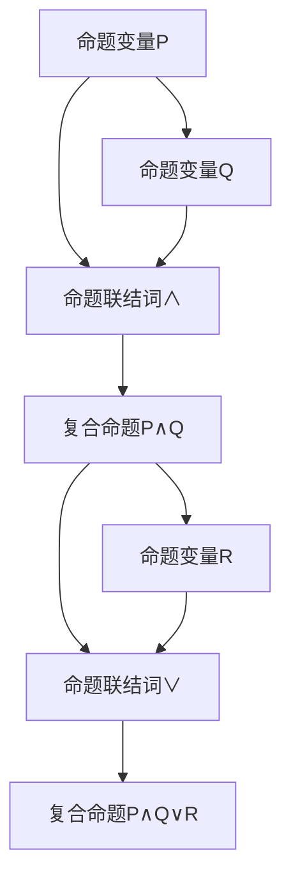

                 

命题逻辑是数理逻辑中的一个重要分支，它以命题作为基本单位，研究命题之间的逻辑关系和推理规则。本文将详细介绍命题逻辑的核心概念、原理和算法，并通过具体实例展示其应用和实践价值。

## 1. 背景介绍

数理逻辑是研究逻辑在数学中的应用的科学，其目标是建立一套精确的形式化语言和推理规则，以便在数学和计算机科学等领域进行严谨的推理和证明。命题逻辑作为数理逻辑的基础，它关注的是命题的真假以及命题之间的逻辑关系。

在计算机科学中，命题逻辑有着广泛的应用，包括但不限于编程语言的设计、形式验证、逻辑电路的设计、人工智能的逻辑推理等。了解和掌握命题逻辑，不仅有助于我们更好地理解和应用计算机科学中的各种逻辑概念，还能提高我们的逻辑思维能力和解决问题的能力。

## 2. 核心概念与联系

### 命题

命题是数理逻辑中的基本单位，它是一个陈述句，可以被判定为真或假。例如，“今天是星期一”是一个命题，我们可以根据日期来判断它是真命题还是假命题。

### 命题变量

命题变量是表示命题的符号，通常用大写字母表示。例如，用 \(P\) 表示“今天是星期一”。

### 命题联结词

命题联结词用于组合命题，形成复合命题。常见的命题联结词包括“且”（∧）、“或”（∨）和“非”（¬）。

### 命题公式

命题公式是由命题变量和命题联结词通过适当的组合形成的表达式。例如，“\(P ∧ Q\)”和“\(P ∨ ¬Q\)”都是命题公式。

### 命题逻辑符号

命题逻辑中，我们使用特定的符号来表示命题、命题变量和命题联结词。例如，¬表示非，∧表示且，∨表示或。

### 命题逻辑的 Mermaid 流程图

下面是一个简单的命题逻辑的 Mermaid 流程图，用于展示命题、命题变量和命题联结词之间的关系。

## 3. 核心算法原理 & 具体操作步骤

### 3.1 算法原理概述

命题逻辑的核心算法主要包括命题公式的构建、命题逻辑推理和命题逻辑验证。这些算法的基本原理是利用命题变量和命题联结词构建命题公式，并通过推理规则和验证规则对命题公式进行分析和验证。

### 3.2 算法步骤详解

1. **命题公式的构建**

   - 收集命题变量：根据实际问题需求，确定命题变量。
   - 选择命题联结词：根据命题变量之间的关系，选择合适的命题联结词。
   - 构建命题公式：将命题变量和命题联结词组合成命题公式。

2. **命题逻辑推理**

   - 应用推理规则：根据命题公式和推理规则，推导出新的命题。
   - 证明命题公式：通过递归推理，证明命题公式的真值。

3. **命题逻辑验证**

   - 检查命题公式：根据验证规则，检查命题公式的正确性。
   - 修复错误：如果发现错误，根据验证规则进行修复。

### 3.3 算法优缺点

**优点：**

- **精确性**：命题逻辑以精确的数学语言描述逻辑关系，使得推理过程更加严谨。
- **普适性**：命题逻辑可以应用于各种领域，如计算机科学、数学和哲学等。

**缺点：**

- **复杂性**：命题逻辑的推理过程可能非常复杂，对于复杂的问题，推理过程可能会变得繁琐。
- **局限性**：命题逻辑只能处理命题之间的关系，无法处理更复杂的逻辑关系。

### 3.4 算法应用领域

- **编程语言设计**：命题逻辑可以用于验证编程语言的语法和语义。
- **形式验证**：命题逻辑可以用于验证硬件电路和软件系统的正确性。
- **人工智能**：命题逻辑可以用于构建逻辑推理系统，实现智能决策和问题求解。

## 4. 数学模型和公式 & 详细讲解 & 举例说明

### 4.1 数学模型构建

命题逻辑的数学模型主要包括命题变量、命题联结词和命题公式。命题变量表示基本命题，命题联结词表示命题之间的关系，命题公式是命题变量和命题联结词的组合。

### 4.2 公式推导过程

命题逻辑的公式推导主要基于命题变

