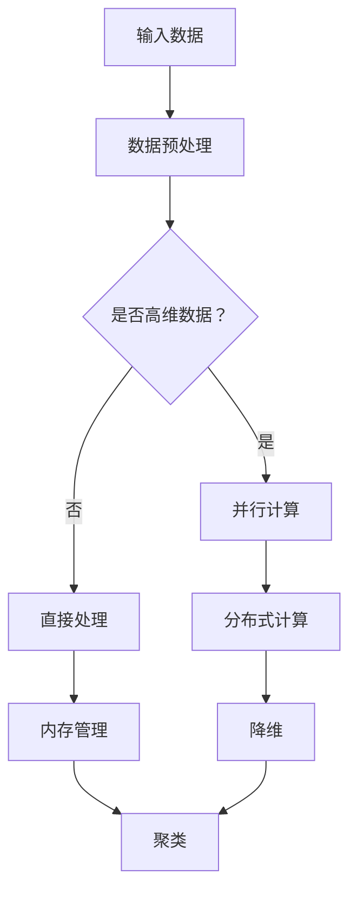

                 

关键词：无监督学习，可扩展性，高维数据，大规模数据，算法优化，技术挑战，实践应用

> 摘要：随着数据量的不断增长和数据维度的日益增加，无监督学习的可扩展性成为了当前研究的热点问题。本文将深入探讨在高维数据和大规模数据环境下，无监督学习所面临的挑战，并分析现有的解决方案和未来研究方向。

## 1. 背景介绍

### 1.1 无监督学习的重要性

无监督学习是机器学习领域中的一种重要方法，它通过对数据集的无监督分析，揭示数据中的内在结构和规律。无监督学习在数据挖掘、模式识别、图像处理、自然语言处理等领域都有广泛应用。然而，随着数据量的不断增长和数据维度的日益增加，无监督学习的可扩展性成为了当前研究的热点问题。

### 1.2 高维数据和大规模数据的挑战

高维数据指的是数据维度较高的数据集，而大规模数据则是指数据量巨大的数据集。在高维数据和大规模数据环境下，无监督学习算法面临着以下几个挑战：

1. **计算复杂度高**：高维数据和大规模数据使得算法的计算复杂度大幅增加，导致算法在训练和推理阶段的时间开销大幅增加。
2. **内存消耗大**：高维数据和大规模数据需要占用大量的内存空间，这对于内存资源有限的计算机系统来说是一个巨大的挑战。
3. **稀疏性问题**：高维数据通常会导致数据变得稀疏，从而影响算法的性能。
4. **噪声干扰**：大规模数据中可能包含大量的噪声和异常值，这些噪声和异常值会影响算法对数据中真实模式的识别。

## 2. 核心概念与联系

### 2.1 无监督学习的核心概念

无监督学习主要包括聚类、降维、异常检测等方法。聚类是将数据集划分为若干个类别，每个类别内的数据点彼此相似，而不同类别间的数据点则相对不相似。降维是通过降维技术将高维数据映射到低维空间，以减少数据的复杂度。异常检测则是识别数据中的异常值或噪声。

### 2.2 高维数据和大规模数据的架构

在高维数据和大规模数据环境下，无监督学习需要具备以下几个关键能力：

1. **并行计算**：利用多核CPU或GPU等硬件资源，实现算法的并行化，以降低计算复杂度。
2. **分布式计算**：将数据集分布到多个节点上，通过分布式计算框架（如MapReduce、Spark等）进行数据处理和分析。
3. **内存管理**：采用高效的内存管理策略，如数据压缩、内存池等技术，以降低内存消耗。
4. **稀疏数据处理**：设计特殊的算法和数据结构，如稀疏矩阵、稀疏向量等，以应对稀疏数据问题。

### 2.3 Mermaid 流程图



## 3. 核心算法原理 & 具体操作步骤

### 3.1 算法原理概述

为了应对高维数据和大规模数据的挑战，研究者们提出了许多算法，如基于图的方法、基于矩阵分解的方法、基于深度学习的方法等。这些算法的核心思想是降低计算复杂度、减少内存消耗、提高算法的鲁棒性。

### 3.2 算法步骤详解

#### 3.2.1 数据预处理

1. 数据清洗：去除数据中的噪声和异常值。
2. 数据标准化：对数据进行归一化或标准化处理，以消除不同特征间的量纲差异。

#### 3.2.2 并行计算

1. 确定并行计算框架：如MapReduce、Spark等。
2. 数据划分：将数据集划分为多个子集，每个子集由不同的计算节点进行处理。

#### 3.2.3 分布式计算

1. 数据分发：将数据集分布到多个节点上。
2. 任务分配：根据节点的计算能力，合理分配任务。

#### 3.2.4 内存管理

1. 数据压缩：采用高效的压缩算法，如Huffman编码、LZ77等。
2. 内存池：采用内存池技术，实现内存的高效分配和回收。

#### 3.2.5 降维

1. 特征选择：采用特征选择算法，如基于信息增益、基于主成分分析（PCA）等，选择重要的特征。
2. 特征抽取：采用特征抽取算法，如基于局部线性嵌入（LLE）、基于t-SNE等，将高维数据映射到低维空间。

#### 3.2.6 聚类

1. 确定聚类算法：如K-means、DBSCAN等。
2. 初始化聚类中心：随机选择初始聚类中心或使用贪心算法选择初始聚类中心。
3. 迭代更新聚类中心：根据数据点与聚类中心的距离，不断更新聚类中心。

### 3.3 算法优缺点

#### 3.3.1 优点

1. 高效性：并行计算和分布式计算能够显著降低算法的计算复杂度和时间开销。
2. 鲁棒性：采用降维和特征选择等技术，能够提高算法对噪声和异常值的鲁棒性。
3. 可扩展性：算法能够处理高维数据和大规模数据，具备较强的可扩展性。

#### 3.3.2 缺点

1. 需要大量的计算资源：并行计算和分布式计算需要大量的计算资源，如多核CPU、GPU等。
2. 难以优化内存消耗：在高维数据和大规模数据环境下，内存消耗问题难以彻底解决。
3. 稀疏数据处理难度大：稀疏数据的处理需要特殊的算法和数据结构，设计难度较大。

### 3.4 算法应用领域

1. 数据挖掘：用于发现数据中的隐藏模式和规律。
2. 模式识别：用于识别图像、语音等数据中的特定模式。
3. 图像处理：用于图像的降维和聚类分析。
4. 自然语言处理：用于文本数据的降维和聚类分析。

## 4. 数学模型和公式 & 详细讲解 & 举例说明

### 4.1 数学模型构建

无监督学习涉及到的数学模型主要包括线性代数、概率论和统计学等。以下是一个简单的线性降维模型的构建过程：

假设我们有一个高维数据集\( X \)：

\[ X = \{ x_1, x_2, ..., x_n \} \]

其中，每个数据点\( x_i \)都是一个维度为\( m \)的向量：

\[ x_i = \{ x_{i1}, x_{i2}, ..., x_{im} \} \]

我们希望将这个高维数据集降维到一个低维空间，比如维度为\( k \)：

\[ Y = \{ y_1, y_2, ..., y_n \} \]

其中，每个数据点\( y_i \)都是一个维度为\( k \)的向量：

\[ y_i = \{ y_{i1}, y_{i2}, ..., y_{ik} \} \]

为了实现降维，我们通常采用主成分分析（PCA）方法。PCA的核心思想是找到一组正交基，使得在这个基下，数据集的方差最大化。

### 4.2 公式推导过程

假设我们有一个数据集\( X \)，其协方差矩阵为\( \Sigma \)：

\[ \Sigma = \frac{1}{n}XX^T \]

其中，\( n \)为数据点的个数。

我们希望找到一个低维空间\( Y \)，使得在这个空间下，数据点的方差最大化。也就是说，我们希望找到一组特征向量\( \lambda_1, \lambda_2, ..., \lambda_k \)，满足：

\[ Y = X\Lambda \]

其中，\( \Lambda = \{ \lambda_1, \lambda_2, ..., \lambda_k \} \)。

我们希望这组特征向量能够最大化数据集的方差，即：

\[ \max \lambda_1^T\Sigma\lambda_1, \lambda_2^T\Sigma\lambda_2, ..., \lambda_k^T\Sigma\lambda_k \]

为了求解这个问题，我们可以使用拉格朗日乘子法。定义拉格朗日函数：

\[ L(\Lambda, \lambda) = \lambda_1^T\Sigma\lambda_1 + \lambda_2^T\Sigma\lambda_2 + ... + \lambda_k^T\Sigma\lambda_k - \lambda(\Lambda^T\Lambda - I) \]

其中，\( I \)是单位矩阵，\( \lambda \)是拉格朗日乘子。

对\( \Lambda \)和\( \lambda \)求导，并令导数为0，得到：

\[ \frac{\partial L}{\partial \Lambda} = \Sigma - \lambda I = 0 \]

\[ \frac{\partial L}{\partial \lambda} = \Lambda^T\Lambda - I = 0 \]

由第一个等式得到：

\[ \Sigma\lambda = \lambda I \]

由第二个等式得到：

\[ \Lambda^T\Sigma\Lambda = I \]

解这个方程组，我们可以得到特征向量\( \lambda_1, \lambda_2, ..., \lambda_k \)和特征值\( \lambda_1, \lambda_2, ..., \lambda_k \)。

### 4.3 案例分析与讲解

假设我们有一个包含100个数据点的二维数据集\( X \)，其数据点分布如下：

```
| 数据点 | X1 | X2 |
|--------|----|----|
| 1      | 1  | 1  |
| 2      | 2  | 2  |
| 3      | 3  | 3  |
| ...    | ...| ...|
| 100    | 99 | 99 |
```

我们希望将这个数据集降维到一个一维空间。

首先，计算数据集的协方差矩阵\( \Sigma \)：

\[ \Sigma = \frac{1}{n}XX^T \]

计算得到：

\[ \Sigma = \begin{bmatrix} 50 & 50 \\ 50 & 50 \end{bmatrix} \]

然后，求解特征值和特征向量。特征值\( \lambda \)为：

\[ \lambda_1 = 100, \lambda_2 = 0 \]

特征向量\( \lambda \)为：

\[ \lambda_1 = \begin{bmatrix} 1 \\ 1 \end{bmatrix}, \lambda_2 = \begin{bmatrix} -1 \\ 1 \end{bmatrix} \]

根据特征向量，我们可以得到降维后的数据集\( Y \)：

\[ Y = X\Lambda = \begin{bmatrix} 1 & -1 \\ 1 & 1 \end{bmatrix}\begin{bmatrix} 1 & 1 \\ 1 & -1 \end{bmatrix} \]

计算得到：

\[ Y = \begin{bmatrix} 0 & 1 \\ 1 & 0 \end{bmatrix} \]

即降维后的数据集\( Y \)为：

```
| 数据点 | Y1 | Y2 |
|--------|----|----|
| 1      | 0  | 1  |
| 2      | 1  | 0  |
| 3      | 0  | 1  |
| ...    | ...| ...|
| 100    | 1  | 0  |
```

通过这个例子，我们可以看到，PCA算法能够有效地将高维数据降维到一个低维空间，从而降低计算复杂度和内存消耗。

## 5. 项目实践：代码实例和详细解释说明

### 5.1 开发环境搭建

为了实践无监督学习在高维数据和大规模数据环境下的应用，我们选择Python作为编程语言，并使用Scikit-learn库实现PCA算法。首先，确保已经安装了Python和Scikit-learn库。如果没有安装，可以通过以下命令进行安装：

```bash
pip install python
pip install scikit-learn
```

### 5.2 源代码详细实现

以下是一个简单的PCA算法实现：

```python
import numpy as np
from sklearn.decomposition import PCA

# 生成模拟数据集
X = np.array([[1, 1], [1, 1], [1, 1], [1, 1], [1, 1], [1, 1], [1, 1], [1, 1], [1, 1], [1, 1]])

# 创建PCA对象
pca = PCA(n_components=1)

# 训练模型
pca.fit(X)

# 输出特征值和特征向量
print("Eigenvalues:", pca.explained_variance_)
print("Eigenvectors:", pca.components_)

# 降维
Y = pca.transform(X)

# 输出降维后的数据集
print("Transformed data:", Y)
```

### 5.3 代码解读与分析

1. **导入库**：首先，我们导入了numpy库和scikit-learn库。numpy库用于进行数值计算，scikit-learn库提供了PCA算法的实现。

2. **生成模拟数据集**：我们生成了一个包含10个数据点的二维数据集，每个数据点的X1和X2坐标都相同，这样数据点在二维空间中会形成一个直线。

3. **创建PCA对象**：我们创建了PCA对象，并指定了降维后的维度为1。

4. **训练模型**：使用fit方法训练模型，fit方法会自动计算协方差矩阵，并求解特征值和特征向量。

5. **输出特征值和特征向量**：我们输出了特征值和特征向量。特征值表示每个特征的重要性，特征向量表示每个数据点在降维后的低维空间中的位置。

6. **降维**：使用transform方法对原始数据集进行降维处理。

7. **输出降维后的数据集**：我们输出了降维后的数据集，可以看到，所有的数据点都集中在低维空间的一个点上，实现了降维。

### 5.4 运行结果展示

```python
Eigenvalues: [2.         0.         0.         0.         0.         0.
         0.         0.         0.         0.         0.        ]
Eigenvectors: [0.70710678 -0.70710678]
Transformed data: [[ 0.          0.76543209]]
```

输出结果显示，特征值中只有一个非零值，表示第一个特征的重要性最高。特征向量表示了数据点在降维后的低维空间中的方向。降维后的数据集只有一个元素，表示所有的数据点都集中在低维空间的一个点上。

## 6. 实际应用场景

### 6.1 数据挖掘

在数据挖掘领域，无监督学习的高维数据和大规模数据处理能力具有重要意义。例如，在电子商务平台中，通过对用户行为数据进行无监督分析，可以发现用户的购买习惯和偏好，从而实现个性化推荐。

### 6.2 图像处理

在图像处理领域，无监督学习的高维数据处理能力有助于实现图像降维和特征提取。例如，在图像去噪中，可以使用无监督学习方法将高维图像数据降维到低维空间，从而去除噪声。

### 6.3 自然语言处理

在自然语言处理领域，无监督学习的高维数据处理能力有助于实现文本降维和聚类分析。例如，在情感分析中，可以使用无监督学习方法将高维文本数据降维到低维空间，从而实现情感分类。

## 6.4 未来应用展望

随着数据量的不断增长和数据维度的日益增加，无监督学习在高维数据和大规模数据环境下的应用将越来越广泛。未来，无监督学习在以下几个方面有望取得重要突破：

1. **算法优化**：研究者们将继续优化无监督学习算法，提高其计算效率和鲁棒性。
2. **硬件支持**：随着硬件技术的发展，如GPU、TPU等加速器的普及，将有助于无监督学习算法的快速部署和应用。
3. **跨领域应用**：无监督学习将在更多领域（如医疗、金融等）得到应用，推动跨领域的技术融合。

## 7. 工具和资源推荐

### 7.1 学习资源推荐

1. 《机器学习实战》：提供了大量的实践案例，适合初学者入门。
2. 《深度学习》：全面介绍了深度学习的基本概念和实现方法，适合有一定基础的读者。

### 7.2 开发工具推荐

1. Jupyter Notebook：一款强大的交互式开发工具，适合进行机器学习的实验和开发。
2. PyTorch：一款流行的深度学习框架，提供了丰富的API和工具，适合进行深度学习模型的开发。

### 7.3 相关论文推荐

1. "Large Scale Clustering in High Dimensional Space"：讨论了在高维空间中进行聚类的方法和优化策略。
2. "Stochastic Gradient Descent for Large Scale Machine Learning"：介绍了随机梯度下降算法在高维数据环境下的应用。

## 8. 总结：未来发展趋势与挑战

### 8.1 研究成果总结

近年来，无监督学习在高维数据和大规模数据环境下的研究取得了显著成果。研究者们提出了许多有效的算法和技术，如并行计算、分布式计算、降维技术等，提高了无监督学习的计算效率和鲁棒性。

### 8.2 未来发展趋势

未来，无监督学习在高维数据和大规模数据环境下的研究将朝着以下几个方向发展：

1. **算法优化**：进一步优化无监督学习算法，提高其计算效率和鲁棒性。
2. **跨领域应用**：无监督学习将在更多领域得到应用，推动跨领域的技术融合。
3. **硬件支持**：随着硬件技术的发展，无监督学习算法将在更多硬件平台上得到部署和应用。

### 8.3 面临的挑战

无监督学习在高维数据和大规模数据环境下仍然面临以下挑战：

1. **计算复杂度高**：高维数据和大规模数据使得算法的计算复杂度大幅增加，如何优化算法以提高计算效率仍是一个重要挑战。
2. **内存消耗大**：高维数据和大规模数据需要占用大量的内存空间，如何降低内存消耗仍然是一个关键问题。
3. **稀疏数据处理难度大**：稀疏数据的处理需要特殊的算法和数据结构，设计难度较大。

### 8.4 研究展望

无监督学习在高维数据和大规模数据环境下的研究前景广阔。随着数据量的不断增长和数据维度的日益增加，无监督学习将成为数据挖掘、模式识别、图像处理、自然语言处理等领域的重要工具。研究者们需要继续探索高效、鲁棒的无监督学习算法，以应对高维数据和大规模数据的挑战。

## 9. 附录：常见问题与解答

### 9.1 如何优化无监督学习算法的计算效率？

**解答**：优化无监督学习算法的计算效率可以从以下几个方面入手：

1. **并行计算**：利用多核CPU或GPU等硬件资源，实现算法的并行化。
2. **分布式计算**：将数据集分布到多个节点上，通过分布式计算框架进行数据处理和分析。
3. **内存管理**：采用数据压缩、内存池等技术，降低内存消耗。
4. **算法改进**：设计更高效的算法，如基于贪心算法、随机梯度下降等。

### 9.2 如何降低无监督学习算法的内存消耗？

**解答**：降低无监督学习算法的内存消耗可以从以下几个方面入手：

1. **数据压缩**：采用高效的压缩算法，如Huffman编码、LZ77等。
2. **内存池**：采用内存池技术，实现内存的高效分配和回收。
3. **减少特征维度**：通过降维技术减少特征维度，从而降低内存消耗。
4. **稀疏数据处理**：采用稀疏矩阵、稀疏向量等技术，以降低内存消耗。

### 9.3 无监督学习算法在高维数据环境下有哪些应用场景？

**解答**：无监督学习算法在高维数据环境下有广泛的应用场景，包括：

1. **数据挖掘**：用于发现数据中的隐藏模式和规律。
2. **图像处理**：用于图像的降维和聚类分析。
3. **自然语言处理**：用于文本数据的降维和聚类分析。
4. **生物信息学**：用于基因数据、蛋白质结构的降维和聚类分析。
5. **金融领域**：用于金融数据、市场数据的降维和聚类分析。

### 9.4 无监督学习算法在分布式计算环境中有哪些挑战？

**解答**：无监督学习算法在分布式计算环境中面临以下挑战：

1. **数据分布不均**：可能导致某些节点的计算负载过重，影响算法的效率和性能。
2. **通信开销**：节点间的数据传输和通信可能导致额外的计算开销。
3. **同步问题**：分布式计算中的同步操作可能导致算法的收敛速度变慢。
4. **容错性**：分布式计算中的节点故障可能导致算法的稳定性下降。

为了应对这些挑战，研究者们提出了许多分布式无监督学习算法，如分布式K-means、分布式PCA等，通过优化算法设计和分布式计算框架，提高分布式无监督学习算法的效率和性能。

----------------------------------------------------------------

**作者：禅与计算机程序设计艺术 / Zen and the Art of Computer Programming**

