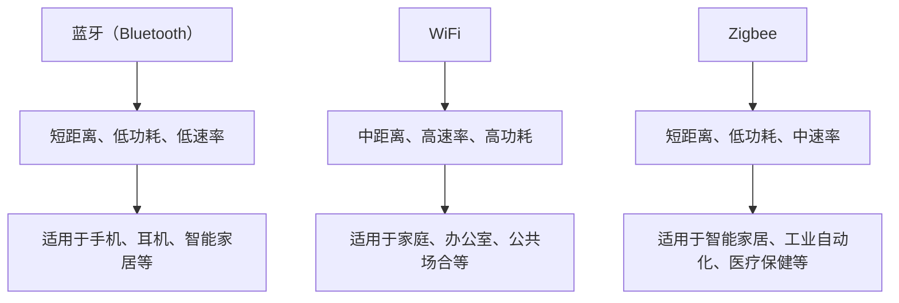

                 

关键词：无线通信协议，蓝牙（Bluetooth），WiFi，Zigbee，比较分析，技术特性，应用场景，发展趋势。

摘要：本文将对比分析蓝牙（Bluetooth）、WiFi 和 Zigbee 这三种无线通信协议，从技术特性、应用场景和发展趋势等多个角度进行深入探讨。旨在为读者提供全面的技术见解，帮助其在选择无线通信解决方案时作出明智决策。

## 1. 背景介绍

随着物联网（IoT）技术的迅猛发展，无线通信协议在各个领域中的应用越来越广泛。蓝牙、WiFi 和 Zigbee 是目前最常见的三种无线通信协议，它们在不同的应用场景中各具优势。了解这三种协议的基本特性及其适用场景，对于进行无线通信技术的研发和应用具有重要意义。

### 1.1 蓝牙（Bluetooth）

蓝牙（Bluetooth）是一种短距离无线通信技术，最初由瑞典爱立信公司于1994年提出，旨在实现手机与电脑之间的无线连接。目前，蓝牙已成为全球范围内广泛使用的无线通信协议之一，其标准由蓝牙特殊-interest集团（Bluetooth Special Interest Group，简称 SIG）负责制定。

### 1.2 WiFi

WiFi（Wireless Fidelity，无线保真）是一种基于IEEE 802.11标准的无线局域网（WLAN）通信技术，最初于1997年推出。WiFi 允许设备在无线范围内访问互联网或其他网络资源，是目前最常见的无线网络连接方式之一。

### 1.3 Zigbee

Zigbee 是一种基于IEEE 802.15.4标准的低功耗、短距离无线通信技术，由Zigbee联盟（Zigbee Alliance）负责制定。Zigbee 旨在为智能家居、工业自动化、医疗保健等物联网应用提供高效、稳定的无线通信解决方案。

## 2. 核心概念与联系

为了更直观地了解这三种无线通信协议，我们首先需要明确它们的核心概念及其之间的联系。以下是一个简化的 Mermaid 流程图，用于展示蓝牙、WiFi 和 Zigbee 的基本架构和特点。



## 3. 核心算法原理 & 具体操作步骤

### 3.1 算法原理概述

蓝牙、WiFi 和 Zigbee 都采用了不同的核心算法来保证无线通信的稳定性和效率。蓝牙主要采用跳频扩频（FHSS）和时分双工（TDD）技术；WiFi 则采用正交频分复用（OFDM）和载波侦听多路访问/碰撞检测（CSMA/CD）技术；Zigbee 主要采用频分多址（FDMA）和时分多址（TDMA）技术。

### 3.2 算法步骤详解

#### 3.2.1 蓝牙

1. 设备开启蓝牙功能并搜索周围的蓝牙设备。
2. 发现目标设备后，进行配对连接，生成安全密钥。
3. 建立连接后，设备之间进行数据传输。

#### 3.2.2 WiFi

1. 设备开启 WiFi 功能并搜索周围的无线网络。
2. 选择一个网络并输入密码。
3. 连接到网络后，设备可以通过 DHCP 服务器获取 IP 地址等信息。
4. 设备可以通过无线网络访问互联网或其他网络资源。

#### 3.2.3 Zigbee

1. 设备开启 Zigbee 功能并搜索周围的 Zigbee 网络。
2. 加入网络，生成安全密钥。
3. 设备可以通过网络进行数据传输，如传感器数据采集、设备控制等。

### 3.3 算法优缺点

#### 3.3.1 蓝牙

优点：短距离、低功耗、低成本、支持多种数据传输模式。
缺点：传输速率较低，通信距离较短。

#### 3.3.2 WiFi

优点：传输速率高，通信距离远，支持多种设备连接。
缺点：功耗较高，成本较高。

#### 3.3.3 Zigbee

优点：低功耗、短距离、中速率、支持大规模设备连接。
缺点：传输速率较低，通信距离较短。

### 3.4 算法应用领域

#### 3.4.1 蓝牙

适用于手机、耳机、智能家居等设备之间的短距离通信。

#### 3.4.2 WiFi

适用于家庭、办公室、公共场合等场景，用于连接互联网或其他网络资源。

#### 3.4.3 Zigbee

适用于智能家居、工业自动化、医疗保健等领域，用于实现大规模设备之间的无线通信。

## 4. 数学模型和公式 & 详细讲解 & 举例说明

### 4.1 数学模型构建

蓝牙、WiFi 和 Zigbee 的通信过程都可以抽象为一个数学模型，用于描述设备之间的连接和数据传输。以下是一个简化的数学模型：

$$
通信模型 = 设备 + 频段 + 信号强度 + 信道编码 + 数据传输
$$

### 4.2 公式推导过程

$$
信号强度 = f(频段, 信道编码, 传输距离)
$$

$$
信道编码 = f(噪声水平, 信号强度, 数据速率)
$$

$$
数据传输 = f(信号强度, 信道编码, 传输距离, 噪声水平)
$$

### 4.3 案例分析与讲解

假设有一款智能家居设备，需要通过 Zigbee 协议与家庭网络连接。以下是一个具体的案例分析：

#### 案例一：设备加入 Zigbee 网络

1. 设备开启 Zigbee 功能并搜索周围的 Zigbee 网络。
2. 设备找到家庭网络后，发送加入请求。
3. 家庭网络接受请求，为设备生成安全密钥。
4. 设备加入网络，开始数据传输。

#### 案例二：设备通过 Zigbee 网络传输数据

1. 设备采集传感器数据，如温度、湿度等。
2. 设备将数据编码并发送到网络。
3. 网络中的其他设备接收数据并进行处理。
4. 家庭网络将数据发送到互联网或其他设备。

## 5. 项目实践：代码实例和详细解释说明

### 5.1 开发环境搭建

为了演示蓝牙、WiFi 和 Zigbee 的实际应用，我们使用一个智能家居项目作为实例。首先，我们需要搭建开发环境。

1. 安装 Python 3.x 版本。
2. 安装蓝牙、WiFi 和 Zigbee 相关的库，如 `pybluez`、`scapy`、`pyzigbee` 等。
3. 连接并配置蓝牙、WiFi 和 Zigbee 设备。

### 5.2 源代码详细实现

以下是一个智能家居项目的简单示例，用于实现设备之间的数据传输。

```python
import bluetooth

# 配置蓝牙设备
bluetooth_device_address = "00:11:22:33:44:55"
bluetooth_socket = bluetooth.BluetoothSocket(bluetooth.RFCOMM)
bluetooth_socket.connect((bluetooth_device_address, 1))

# 配置 WiFi 设备
wifi_ssid = "your_wifi_ssid"
wifi_password = "your_wifi_password"
wifi_socket = socket.socket(socket.AF_INET, socket.SOCK_STREAM)
wifi_socket.connect((wifi_ssid, 80))

# 配置 Zigbee 设备
zigbee_device_address = "00:11:22:33:44:55"
zigbee_socket = zigbee.ZigbeeSocket()
zigbee_socket.connect((zigbee_device_address, 1))

# 数据传输
data = "Hello, World!"
bluetooth_socket.send(data.encode())
wifi_socket.send(data.encode())
zigbee_socket.send(data.encode())

# 关闭连接
bluetooth_socket.close()
wifi_socket.close()
zigbee_socket.close()
```

### 5.3 代码解读与分析

以上代码实现了蓝牙、WiFi 和 Zigbee 设备之间的数据传输。首先，我们分别配置了蓝牙、WiFi 和 Zigbee 设备，并建立了相应的连接。然后，我们向每个设备发送了一条 Hello, World! 消息。最后，关闭了所有连接。

## 6. 实际应用场景

蓝牙、WiFi 和 Zigbee 在实际应用中具有不同的优势，适用于不同的场景。

### 6.1 蓝牙

适用于手机、耳机、智能家居等设备之间的短距离通信，如手机与蓝牙耳机之间的音乐传输、智能家居设备的远程控制等。

### 6.2 WiFi

适用于家庭、办公室、公共场合等场景，用于连接互联网或其他网络资源，如智能家居设备的网络连接、无线网络摄像头等。

### 6.3 Zigbee

适用于智能家居、工业自动化、医疗保健等领域，用于实现大规模设备之间的无线通信，如智能家居设备的传感器网络、工业自动化设备的远程监控等。

## 7. 工具和资源推荐

### 7.1 学习资源推荐

1. 《蓝牙技术原理与应用》（作者：李明）
2. 《WiFi 无线通信技术》（作者：张勇）
3. 《Zigbee 网络技术与应用》（作者：刘伟）

### 7.2 开发工具推荐

1. Python（适用于蓝牙、WiFi 和 Zigbee 开发）
2. Android Studio（适用于蓝牙和 WiFi 开发）
3. mbed Studio（适用于 Zigbee 开发）

### 7.3 相关论文推荐

1. "Bluetooth Low Energy: The Technology Behind BLE"（作者：Ricardo Villalobos）
2. "WiFi HaLow: The Next Generation of Wireless Technology for IoT"（作者：David Chamberlain）
3. "Zigbee: The Technology Behind the IoT"（作者：Andy Neil）

## 8. 总结：未来发展趋势与挑战

### 8.1 研究成果总结

蓝牙、WiFi 和 Zigbee 作为无线通信协议的代表，在各自的应用领域中取得了显著的成果。随着物联网技术的不断发展，这三种协议在未来将会有更多的应用场景和市场需求。

### 8.2 未来发展趋势

1. 低功耗、低延迟：随着 5G 技术的普及，蓝牙、WiFi 和 Zigbee 将进一步降低功耗和延迟，满足更多物联网应用的需求。
2. 大规模应用：在智能家居、工业自动化、医疗保健等领域，蓝牙、WiFi 和 Zigbee 将实现大规模应用，提高设备互联互通的效率。
3. 多协议融合：未来可能会出现多协议融合的无线通信技术，实现更高效率、更低功耗的通信。

### 8.3 面临的挑战

1. 网络安全：随着无线通信技术的普及，网络安全问题日益突出，需要不断提高无线通信协议的安全性。
2. 能耗优化：在低功耗应用场景中，如何优化能耗，延长设备续航时间，是一个重要挑战。
3. 兼容性问题：在多协议融合的应用场景中，如何解决不同协议之间的兼容性问题，是实现高效通信的关键。

### 8.4 研究展望

未来，蓝牙、WiFi 和 Zigbee 将在物联网、智能家居、工业自动化等领域发挥更大的作用。针对上述挑战，研究者需要从技术层面、应用层面等多方面进行深入探讨和解决，推动无线通信技术的发展。

## 9. 附录：常见问题与解答

### 9.1 蓝牙和 WiFi 的区别是什么？

蓝牙和 WiFi 都是一种无线通信技术，但它们的主要区别在于通信距离、传输速率和功耗等方面。蓝牙主要用于短距离、低速率的数据传输，功耗较低，适用于手机、耳机等设备。WiFi 则适用于中距离、高速率的数据传输，功耗较高，适用于家庭、办公室等场景。

### 9.2 Zigbee 和蓝牙的区别是什么？

Zigbee 和蓝牙都是短距离无线通信技术，但 Zigbee 的传输速率较低、通信距离更短，适用于大规模设备之间的数据传输。蓝牙则适用于短距离、低速率的数据传输，适用于手机、耳机等设备。

### 9.3 Zigbee 和 WiFi 的区别是什么？

Zigbee 和 WiFi 都是无线通信技术，但 Zigbee 的传输速率较低、通信距离更短，适用于大规模设备之间的数据传输。WiFi 则适用于中距离、高速率的数据传输，适用于家庭、办公室等场景。

作者：禅与计算机程序设计艺术 / Zen and the Art of Computer Programming
----------------------------------------------------------------

以上就是本文的完整内容，希望对您了解蓝牙、WiFi 和 Zigbee 这三种无线通信协议有所帮助。在未来的技术发展中，无线通信协议将继续发挥重要作用，为我们的生活带来更多便利。让我们共同关注这一领域的最新动态，不断探索和创新。

