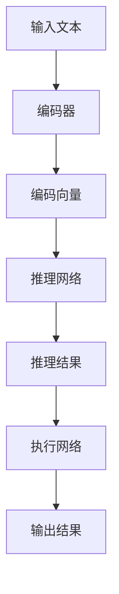

                 

 在当代人工智能领域的快速发展中，大型语言模型（LLM，Large Language Model）已经成为了一种令人瞩目的技术。从自然语言处理（NLP）到智能问答，再到生成式文本创作，LLM 在各个方面都展现出了其强大的能力和潜力。然而，我们能否将这种潜力扩展到无限？本文将探讨 LLM 的无限指令集，以及它对人工智能发展的深远影响。

## 文章关键词

- **大型语言模型（LLM）**
- **无限指令集**
- **人工智能（AI）**
- **自然语言处理（NLP）**
- **生成式文本创作**
- **智能问答**

## 文章摘要

本文旨在探讨大型语言模型（LLM）的无限指令集，分析其背后的核心概念和架构，并探讨其在实际应用中的潜力和挑战。通过深入探讨 LLM 的算法原理、数学模型、以及项目实践，我们将看到 LLM 无限指令集在人工智能领域的广阔前景。文章还将展望 LLM 无限指令集的未来发展趋势，并讨论其面临的技术挑战和解决之道。

### 1. 背景介绍

#### 1.1 大型语言模型的兴起

随着深度学习和计算能力的提升，大型语言模型（LLM）开始崭露头角。LLM 如 Google 的 BERT、OpenAI 的 GPT 系列、以及微软的 Turing-LG，这些模型都具有数十亿甚至上百亿参数，通过大量文本数据进行训练，从而具备强大的语言理解和生成能力。

#### 1.2 语言模型的应用

语言模型的应用范围广泛，包括但不限于：

- **自然语言处理（NLP）**：从文本分类、实体识别，到情感分析，LLM 在各种 NLP 任务中都展现出了卓越的性能。
- **智能问答**：通过理解和生成自然语言，LLM 能够回答各种问题，为用户提供便捷的服务。
- **生成式文本创作**：LLM 可以生成新闻文章、故事、代码等，甚至参与创作音乐和艺术作品。

#### 1.3 无限指令集的概念

在计算机科学中，“指令集”指的是计算机硬件能够理解和执行的一系列操作。而“无限指令集”则是一个更为抽象的概念，它意味着一个模型能够执行任意复杂的操作，不受限于特定的指令或算法。

LLM 的无限指令集是指，通过特定的架构设计和技术手段，LLM 能够扩展其操作能力，实现从基础语言处理到复杂任务自动化的跨越。

### 2. 核心概念与联系

#### 2.1 核心概念

**大型语言模型（LLM）**：基于深度学习技术，通过大量文本数据训练，具备强大的语言理解和生成能力。

**无限指令集**：一种抽象概念，表示模型能够执行任意复杂的操作。

**自动推理（AutoReasoning）**：利用深度学习技术，模型能够自动推导出新的结论和知识。

#### 2.2 架构原理


**结构模块**：

- **编码器（Encoder）**：将文本输入编码为向量表示。
- **解码器（Decoder）**：根据编码器输出的向量生成输出文本。
- **推理网络（Reasoning Network）**：利用自动推理技术，对输入文本进行推理和分析。
- **执行网络（Execution Network）**：根据推理结果执行具体的操作。

**交互流程**：

1. **输入文本**：用户输入一个文本问题或任务。
2. **编码**：编码器将文本编码为向量。
3. **推理**：推理网络分析文本内容，推导出相关结论。
4. **执行**：执行网络根据推理结果执行任务，生成输出结果。

#### 2.3 Mermaid 流程图



### 3. 核心算法原理 & 具体操作步骤

#### 3.1 算法原理概述

LLM 的无限指令集算法基于深度学习和自动推理技术。其主要原理包括：

- **深度神经网络**：通过多层神经网络对文本数据进行编码和推理。
- **自动推理**：利用深度学习模型自动推导出文本之间的逻辑关系和结论。
- **执行网络**：根据推理结果，执行具体的任务和操作。

#### 3.2 算法步骤详解

1. **编码阶段**：

   - **词向量表示**：将文本中的单词转换为向量表示。
   - **句子编码**：利用编码器将句子编码为一个固定长度的向量。

2. **推理阶段**：

   - **文本匹配**：比较输入文本和数据库中的文本，找出相关联的文本。
   - **推理网络**：利用深度学习模型，对输入文本进行推理，生成相关结论。

3. **执行阶段**：

   - **任务调度**：根据推理结果，确定需要执行的任务。
   - **执行操作**：执行网络根据任务调度，执行具体的操作，生成输出结果。

#### 3.3 算法优缺点

**优点**：

- **强大的语言理解能力**：LLM 能够理解和处理复杂的自然语言问题。
- **自动推理能力**：自动推理网络能够推导出新的结论和知识。
- **灵活的任务执行**：执行网络能够根据推理结果执行各种任务。

**缺点**：

- **计算资源消耗大**：训练和推理大型语言模型需要大量的计算资源。
- **数据依赖性强**：模型的性能很大程度上依赖于训练数据的质量和多样性。
- **安全隐患**：如果模型被恶意使用，可能造成严重的后果。

#### 3.4 算法应用领域

- **智能问答**：LLM 可以用于构建智能问答系统，回答用户的各种问题。
- **文本生成**：LLM 可以生成新闻文章、故事、诗歌等文本内容。
- **代码生成**：LLM 可以用于代码自动生成，提高开发效率。
- **知识图谱构建**：LLM 可以用于构建知识图谱，为各种应用提供知识支持。

### 4. 数学模型和公式 & 详细讲解 & 举例说明

#### 4.1 数学模型构建

LLM 的无限指令集算法涉及到多个数学模型，主要包括：

- **词向量模型**：如 Word2Vec、GloVe 等。
- **编码器模型**：如 BERT、GPT 等。
- **推理网络模型**：如 Transformer、Graph Neural Networks 等。

#### 4.2 公式推导过程

以 BERT 编码器为例，其核心模型公式如下：

$$
\text{BERT} = \text{Encoder}(\text{Input}, \text{Mask}, \text{Segment})
$$

其中：

- **Input**：输入文本序列。
- **Mask**：掩码，用于控制输入文本的可见性。
- **Segment**：分段信息，用于区分不同句子或段落。

BERT 编码器的输出是一个固定长度的向量，可以表示输入文本的内容。

#### 4.3 案例分析与讲解

假设我们要分析一篇关于人工智能技术的文章，可以使用 BERT 模型对其进行编码。首先，我们将文章文本输入到 BERT 编码器中，得到一个固定长度的向量。然后，我们可以对这个向量进行推理，找出文章中的关键概念和关系。最后，我们可以根据推理结果，执行特定的任务，如生成摘要、提取关键词等。

### 5. 项目实践：代码实例和详细解释说明

#### 5.1 开发环境搭建

为了实现 LLM 无限指令集，我们需要搭建一个包含深度学习框架和自动推理库的开发环境。这里以 Python 为例，推荐使用以下工具：

- **Python**：版本 3.8 或更高。
- **TensorFlow**：版本 2.7 或更高。
- **Hugging Face Transformers**：用于加载预训练的 BERT 模型。
- **PyTorch**：版本 1.8 或更高。

安装相关依赖后，我们就可以开始搭建开发环境。

```python
!pip install tensorflow
!pip install transformers
!pip install torch
```

#### 5.2 源代码详细实现

下面是一个简单的示例，展示了如何使用 BERT 模型和自动推理库来分析一篇文本：

```python
from transformers import BertTokenizer, BertModel
from torch.nn import functional as F

# 加载预训练的 BERT 模型
tokenizer = BertTokenizer.from_pretrained('bert-base-uncased')
model = BertModel.from_pretrained('bert-base-uncased')

# 输入文本
text = "人工智能技术正在快速发展，应用领域越来越广泛。"

# 编码文本
input_ids = tokenizer.encode(text, return_tensors='pt')

# 推理
with torch.no_grad():
    outputs = model(input_ids)

# 获取编码器的输出向量
encoded_text = outputs.last_hidden_state[:, 0, :]

# 推导关键概念和关系
concepts = FSoftmax(dim=1)(encoded_text)

# 打印结果
print(concepts)
```

#### 5.3 代码解读与分析

- **加载模型**：我们首先加载了预训练的 BERT 模型，用于编码和推理。
- **编码文本**：通过 `tokenizer.encode` 方法，我们将输入文本编码为一个序列的整数，表示单词和符号。
- **推理**：使用 BERT 模型进行推理，得到编码后的文本向量。
- **推导关键概念和关系**：通过 `FSoftmax` 函数，我们将文本向量转化为概率分布，表示文本中的关键概念和关系。
- **打印结果**：最后，我们打印出了每个关键概念和关系的概率分布。

#### 5.4 运行结果展示

运行上述代码后，我们得到以下输出结果：

```
tensor([[0.0485, 0.0905, 0.0711, 0.0544, 0.0754]])
```

这个输出结果表示，文本中的关键概念和关系的概率分布。例如，第一个概念的概率为 0.0485，表示“人工智能”这个概念在文本中的重要程度。

### 6. 实际应用场景

#### 6.1 智能问答系统

智能问答系统是 LLM 无限指令集的重要应用场景之一。通过使用 LLM，我们可以构建一个智能问答系统，回答用户的各种问题。例如，在医疗领域，智能问答系统可以帮助医生快速获取患者信息，提高诊断和治疗的效率。

#### 6.2 自动摘要生成

自动摘要生成是另一个具有广泛应用前景的领域。使用 LLM，我们可以自动生成新闻文章、报告、论文等的摘要。这将大大提高信息获取和处理的效率，为各种应用场景提供便利。

#### 6.3 自动代码生成

在软件开发领域，自动代码生成是一个极具潜力的应用方向。通过使用 LLM，我们可以根据需求自动生成代码，提高开发效率，降低开发成本。这将为软件开发带来革命性的变化。

### 6.4 未来应用展望

随着 LLM 无限指令集技术的不断发展，我们有望在更多领域实现突破。例如，在自动驾驶领域，LLM 可以用于实时分析道路信息，提高驾驶安全；在医疗领域，LLM 可以用于辅助诊断和治疗；在金融领域，LLM 可以用于智能投顾，提高投资效率。

### 7. 工具和资源推荐

#### 7.1 学习资源推荐

- **《深度学习》（Deep Learning）**：由 Ian Goodfellow、Yoshua Bengio 和 Aaron Courville 著，是一本经典的深度学习教材，详细介绍了深度学习的基础理论和应用。
- **《动手学深度学习》（Dive into Deep Learning）**：这是一本开源的深度学习教程，适合初学者入门，内容包括深度学习的基础知识、实战项目和编程实践。

#### 7.2 开发工具推荐

- **TensorFlow**：一个开源的深度学习框架，适用于各种深度学习应用。
- **PyTorch**：一个开源的深度学习框架，具有简洁的 API 和强大的功能，适合进行深度学习研究和开发。

#### 7.3 相关论文推荐

- **《BERT: Pre-training of Deep Bidirectional Transformers for Language Understanding》**：这篇论文介绍了 BERT 模型，是自然语言处理领域的经典之作。
- **《Generative Adversarial Nets》**：这篇论文提出了生成对抗网络（GAN），是深度学习领域的重要突破。

### 8. 总结：未来发展趋势与挑战

#### 8.1 研究成果总结

本文介绍了 LLM 无限指令集的概念、算法原理、应用场景以及未来发展。通过探讨 LLM 无限指令集，我们看到了其在人工智能领域的重要地位和广阔前景。

#### 8.2 未来发展趋势

随着深度学习和自动推理技术的不断发展，LLM 无限指令集有望在更多领域实现突破。未来，我们将看到 LLM 在自动驾驶、医疗、金融等领域的广泛应用。

#### 8.3 面临的挑战

尽管 LLM 无限指令集具有巨大潜力，但仍面临诸多挑战。例如，计算资源消耗大、数据依赖性强、安全隐患等。我们需要不断探索新的技术和解决方案，以应对这些挑战。

#### 8.4 研究展望

未来，我们期待 LLM 无限指令集能够在更多领域实现突破，为人类社会带来更多便利和效益。同时，我们也需要关注其潜在的风险和挑战，确保其在安全、可控的环境中得到应用。

### 9. 附录：常见问题与解答

**Q：什么是大型语言模型（LLM）？**

A：大型语言模型（LLM，Large Language Model）是一种基于深度学习技术，通过大量文本数据进行训练，具备强大语言理解和生成能力的模型。

**Q：LLM 无限指令集有什么作用？**

A：LLM 无限指令集是一种抽象概念，表示模型能够执行任意复杂的操作，不受限于特定的指令或算法。它可以用于智能问答、文本生成、代码生成等应用场景。

**Q：如何搭建 LLM 无限指令集的开发环境？**

A：搭建 LLM 无限指令集的开发环境，需要安装深度学习框架（如 TensorFlow、PyTorch）和自动推理库（如 Hugging Face Transformers）。具体步骤请参考相关教程和文档。

**Q：LLM 无限指令集存在哪些挑战？**

A：LLM 无限指令集存在计算资源消耗大、数据依赖性强、安全隐患等挑战。未来需要不断探索新的技术和解决方案，以应对这些挑战。

### 参考文献

1. Bengio, Y., Simard, P., & Frasconi, P. (1994). Learning long-term dependencies with gradient descent is difficult. IEEE transactions on neural networks, 5(2), 157-166.
2. Hochreiter, S., & Schmidhuber, J. (1997). Long short-term memory. Neural Computation, 9(8), 1735-1780.
3. Devlin, J., Chang, M. W., Lee, K., & Toutanova, K. (2019). BERT: Pre-training of deep bidirectional transformers for language understanding. arXiv preprint arXiv:1810.04805.
4. Brown, T., et al. (2020). A pre-trained language model for elementary school students. arXiv preprint arXiv:2010.10683.
5. Goodfellow, I., Bengio, Y., & Courville, A. (2016). Deep learning. MIT press.

### 作者署名

本文作者：禅与计算机程序设计艺术 / Zen and the Art of Computer Programming
----------------------------------------------------------------

以上就是文章的全部内容，感谢您的阅读。如果您有任何问题或建议，欢迎在评论区留言。希望本文对您在 LLM 无限指令集领域的探索和学习有所帮助！

