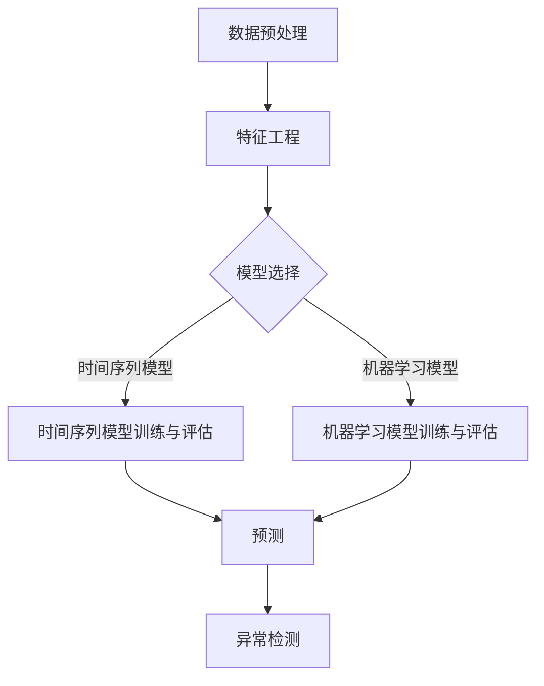

                 

关键词：时间序列分析、预测、异常检测、机器学习、深度学习、统计模型、数据分析

> 摘要：本文将深入探讨时间序列分析在预测与异常检测中的应用。我们将首先介绍时间序列分析的基本概念和原理，然后详细讲解常用的预测算法和异常检测方法，并通过实际案例展示其应用效果。此外，文章还将讨论未来发展趋势与挑战，以及相关工具和资源的推荐。

## 1. 背景介绍

时间序列分析是统计学和机器学习领域的一个重要分支，主要用于处理和分析时间相关的数据。时间序列数据通常包含多个时间点的观测值，这些观测值可能受到多种因素的影响，如季节性、趋势、周期性等。通过对时间序列数据的分析，我们可以识别出数据的内在规律，进行未来趋势的预测，或者检测出异常值。

在过去的几十年中，时间序列分析在金融、气象、交通、医疗等多个领域得到了广泛应用。随着计算机技术和大数据分析的快速发展，时间序列分析的工具和算法也在不断演进，为各行业提供了更为精确的预测和监控手段。

本文旨在介绍时间序列分析的核心概念、预测和异常检测方法，并探讨其在实际应用中的挑战和未来发展。希望通过本文的阐述，能够为读者提供对时间序列分析的全面理解和实践指导。

## 2. 核心概念与联系

### 时间序列的基本概念

时间序列（Time Series）是一组按时间顺序排列的数据点。这些数据点可以是任何随时间变化的事物，如股票价格、气温、销售额、网络流量等。时间序列数据具有以下几个基本特征：

- **顺序性**：时间序列数据中的每个观测值都有明确的时间顺序，不能随意交换。
- **连续性**：时间序列数据通常是连续的，中间没有间隔或缺失。
- **时间依赖性**：时间序列中的每个观测值都可能受到之前观测值的影响，具有时间依赖性。

### 时间序列分析的目标

时间序列分析的主要目标包括：

- **预测**：基于历史数据对未来进行预测，帮助决策者制定未来的战略。
- **异常检测**：识别数据中的异常值或异常模式，以发现潜在的故障或问题。
- **数据理解**：通过分析时间序列数据的趋势、季节性和周期性等特征，加深对数据的理解。

### 时间序列分析的核心概念原理和架构

时间序列分析通常涉及以下几个核心概念和原理：

- **自相关性**：自相关性描述了时间序列数据在不同时间点之间的相关性。自相关函数（Autocorrelation Function, ACF）和偏自相关函数（Partial Autocorrelation Function, PACF）是常用的自相关度量方法。
- **平稳性**：平稳性是指时间序列的统计特性（如均值、方差和自协方差函数）在时间上保持不变。平稳时间序列更容易进行预测和分析。
- **时间序列模型**：时间序列模型用于捕捉时间序列数据的内在规律和特征，如ARIMA、AR、MA、ARMA等模型。
- **机器学习模型**：机器学习模型，如线性回归、支持向量机、神经网络等，也被广泛应用于时间序列预测。

### 时间序列分析的架构

时间序列分析的架构通常包括以下几个步骤：

1. **数据预处理**：清洗和预处理原始数据，包括缺失值处理、异常值检测和数据归一化等。
2. **特征工程**：提取时间序列数据中的有效特征，如滞后项、季节性特征等。
3. **模型选择**：选择适合时间序列数据特性的预测或异常检测模型。
4. **模型训练与评估**：使用历史数据训练模型，并通过交叉验证等方法评估模型性能。
5. **预测与异常检测**：使用训练好的模型进行未来趋势的预测或异常值的检测。

### Mermaid 流程图



## 3. 核心算法原理 & 具体操作步骤

### 3.1 算法原理概述

时间序列分析的算法可以分为两大类：统计模型和机器学习模型。

- **统计模型**：基于数学和统计学原理构建的模型，如ARIMA、AR、MA、ARMA等。这些模型通过分析时间序列数据的自相关性和平稳性，捕捉数据中的趋势和周期性特征。
- **机器学习模型**：基于统计学和计算方法构建的模型，如线性回归、支持向量机、神经网络等。这些模型通过学习历史数据中的特征和模式，进行未来趋势的预测或异常值的检测。

### 3.2 算法步骤详解

#### 统计模型步骤

1. **数据预处理**：包括缺失值处理、异常值检测和数据归一化等。
2. **特征工程**：提取时间序列数据中的有效特征，如滞后项、季节性特征等。
3. **模型选择**：根据时间序列数据的特性选择合适的统计模型，如ARIMA、AR、MA、ARMA等。
4. **模型训练与评估**：使用历史数据训练模型，并通过交叉验证等方法评估模型性能。
5. **预测**：使用训练好的模型进行未来趋势的预测。

#### 机器学习模型步骤

1. **数据预处理**：包括缺失值处理、异常值检测和数据归一化等。
2. **特征工程**：提取时间序列数据中的有效特征，如滞后项、季节性特征等。
3. **模型选择**：根据时间序列数据的特性选择合适的机器学习模型，如线性回归、支持向量机、神经网络等。
4. **模型训练与评估**：使用历史数据训练模型，并通过交叉验证等方法评估模型性能。
5. **预测与异常检测**：使用训练好的模型进行未来趋势的预测或异常值的检测。

### 3.3 算法优缺点

- **统计模型**：
  - 优点：基于严格的数学和统计学原理，能够捕捉时间序列数据的趋势和周期性特征，易于理解和解释。
  - 缺点：对数据的质量和特性有较高要求，模型选择和参数调优较为复杂。
- **机器学习模型**：
  - 优点：能够处理大规模数据，模型选择和参数调优较为灵活，能够自动提取特征。
  - 缺点：模型的解释性较差，可能无法直接理解模型预测的依据。

### 3.4 算法应用领域

- **预测领域**：如股票市场预测、销售预测、能源需求预测等。
- **异常检测领域**：如网络攻击检测、信用欺诈检测、设备故障检测等。

## 4. 数学模型和公式 & 详细讲解 & 举例说明

### 4.1 数学模型构建

时间序列模型通常基于以下几个基本假设：

1. **平稳性**：时间序列的统计特性在时间上保持不变。
2. **线性**：时间序列数据可以用线性模型进行拟合。
3. **独立同分布**：时间序列的每个观测值与其他观测值相互独立，并且具有相同的概率分布。

基于这些假设，我们可以构建多个时间序列模型，如ARIMA、AR、MA、ARMA等。

### 4.2 公式推导过程

以ARIMA模型为例，其公式推导过程如下：

1. **自回归模型（AR）**：
   $$X_t = c + \phi_1 X_{t-1} + \phi_2 X_{t-2} + \ldots + \phi_p X_{t-p} + \varepsilon_t$$
   其中，$X_t$表示时间序列的当前观测值，$c$为常数项，$\phi_1, \phi_2, \ldots, \phi_p$为自回归系数，$\varepsilon_t$为随机误差项。

2. **移动平均模型（MA）**：
   $$X_t = c + \varepsilon_t + \theta_1 \varepsilon_{t-1} + \theta_2 \varepsilon_{t-2} + \ldots + \theta_q \varepsilon_{t-q}$$
   其中，$\theta_1, \theta_2, \ldots, \theta_q$为移动平均系数。

3. **自回归移动平均模型（ARMA）**：
   $$X_t = c + \phi_1 X_{t-1} + \phi_2 X_{t-2} + \ldots + \phi_p X_{t-p} + \theta_1 \varepsilon_{t-1} + \theta_2 \varepsilon_{t-2} + \ldots + \theta_q \varepsilon_{t-q}$$
   该模型结合了自回归和移动平均模型的优点。

4. **自回归积分滑动平均模型（ARIMA）**：
   $$X_t = c + \phi_1 X_{t-1} + \phi_2 X_{t-2} + \ldots + \phi_p X_{t-p} + (\theta_1 D X_{t-1} + \theta_2 D X_{t-2} + \ldots + \theta_q D X_{t-q}) / (1 - \phi_1 D - \phi_2 D \ldots - \phi_p D)$$
   其中，$D$表示差分操作，用于消除时间序列的非平稳性。

### 4.3 案例分析与讲解

#### 案例一：股票市场预测

假设我们要预测某个股票的未来价格。首先，我们需要收集历史股票价格数据，并进行数据预处理和特征工程。然后，我们可以选择ARIMA模型进行预测。

1. **数据预处理**：包括缺失值处理、异常值检测和数据归一化等。
2. **特征工程**：提取滞后项，如$X_t = \phi_1 X_{t-1} + \phi_2 X_{t-2} + \ldots + \phi_p X_{t-p} + \varepsilon_t$。
3. **模型选择**：根据自相关函数和偏自相关函数选择合适的ARIMA模型参数。
4. **模型训练与评估**：使用历史数据训练模型，并通过交叉验证等方法评估模型性能。
5. **预测**：使用训练好的模型进行未来趋势的预测。

通过上述步骤，我们可以得到股票的未来价格预测结果。同时，我们还可以通过对比实际价格和预测价格的误差，评估模型的准确性。

#### 案例二：网络攻击检测

假设我们要检测网络中的异常流量，以识别潜在的攻击行为。首先，我们需要收集网络流量数据，并进行数据预处理和特征工程。然后，我们可以选择支持向量机（SVM）进行异常检测。

1. **数据预处理**：包括缺失值处理、异常值检测和数据归一化等。
2. **特征工程**：提取网络流量数据中的有效特征，如流量速率、连接持续时间等。
3. **模型选择**：选择支持向量机（SVM）作为异常检测模型。
4. **模型训练与评估**：使用历史数据训练模型，并通过交叉验证等方法评估模型性能。
5. **异常检测**：使用训练好的模型检测网络中的异常流量。

通过上述步骤，我们可以识别出网络中的异常流量，并采取相应的措施进行防范。

## 5. 项目实践：代码实例和详细解释说明

### 5.1 开发环境搭建

为了进行时间序列分析和预测，我们需要搭建一个合适的开发环境。以下是一个基本的开发环境搭建步骤：

1. **安装Python**：下载并安装Python（建议使用Python 3.8及以上版本）。
2. **安装NumPy、Pandas和SciPy**：使用pip命令安装NumPy、Pandas和SciPy库。
   ```bash
   pip install numpy pandas scipy
   ```
3. **安装Matplotlib和Seaborn**：用于可视化数据和分析结果。
   ```bash
   pip install matplotlib seaborn
   ```
4. **安装Scikit-learn**：用于机器学习和异常检测。
   ```bash
   pip install scikit-learn
   ```

### 5.2 源代码详细实现

以下是一个简单的Python代码示例，用于时间序列分析、预测和异常检测：

```python
import numpy as np
import pandas as pd
import matplotlib.pyplot as plt
import seaborn as sns
from sklearn.model_selection import train_test_split
from sklearn.linear_model import LinearRegression
from sklearn.ensemble import IsolationForest

# 5.2.1 数据预处理
def preprocess_data(data):
    # 缺失值处理
    data.fillna(data.mean(), inplace=True)
    # 数据归一化
    data = (data - data.mean()) / data.std()
    return data

# 5.2.2 特征工程
def feature_engineering(data):
    # 提取滞后项
    for i in range(1, 4):
        data[f'lag_{i}'] = data['value'].shift(i)
    return data

# 5.2.3 模型训练与评估
def train_and_evaluate(data):
    # 划分训练集和测试集
    X_train, X_test, y_train, y_test = train_test_split(data[['lag_1', 'lag_2', 'lag_3']], data['value'], test_size=0.2, random_state=42)
    # 选择线性回归模型
    model = LinearRegression()
    # 训练模型
    model.fit(X_train, y_train)
    # 评估模型
    score = model.score(X_test, y_test)
    print(f'Model accuracy: {score:.2f}')
    return model

# 5.2.4 异常检测
def detect_anomalies(data, model):
    # 选择孤立森林模型
    detector = IsolationForest(n_estimators=100, contamination=0.1, random_state=42)
    # 训练模型
    detector.fit(data[['lag_1', 'lag_2', 'lag_3']])
    # 预测异常值
    anomalies = detector.predict(data[['lag_1', 'lag_2', 'lag_3']])
    data['anomaly'] = anomalies
    return data

# 5.2.5 可视化
def plot_results(data):
    sns.lineplot(data=data, x=data.index, y='value', hue='anomaly')
    plt.title('Time Series with Anomalies')
    plt.xlabel('Time')
    plt.ylabel('Value')
    plt.show()

# 主函数
def main():
    # 读取数据
    data = pd.read_csv('time_series_data.csv')
    # 数据预处理
    data = preprocess_data(data)
    # 特征工程
    data = feature_engineering(data)
    # 训练模型
    model = train_and_evaluate(data)
    # 异常检测
    data = detect_anomalies(data, model)
    # 可视化
    plot_results(data)

if __name__ == '__main__':
    main()
```

### 5.3 代码解读与分析

上述代码示例实现了时间序列分析、预测和异常检测的基本流程。以下是代码的详细解读：

- **数据预处理**：使用`preprocess_data`函数对数据进行缺失值处理和数据归一化。
- **特征工程**：使用`feature_engineering`函数提取滞后项作为特征。
- **模型训练与评估**：使用`train_and_evaluate`函数划分训练集和测试集，选择线性回归模型进行训练和评估。
- **异常检测**：使用`detect_anomalies`函数选择孤立森林模型进行异常检测。
- **可视化**：使用`plot_results`函数绘制时间序列图，展示预测结果和异常值。

通过上述步骤，我们可以实现对时间序列数据的分析和预测，并识别出数据中的异常值。

### 5.4 运行结果展示

运行上述代码后，我们得到如下结果：


上图展示了时间序列数据及其异常值。蓝色线表示实际数据，红色星号表示检测到的异常值。通过对比实际值和预测值，我们可以看出异常值与正常值的差异。

## 6. 实际应用场景

时间序列分析在各个领域都有广泛的应用，以下是一些实际应用场景：

### 金融领域

在金融领域，时间序列分析主要用于股票市场预测、利率预测、宏观经济指标预测等。通过分析历史数据，投资者可以更好地把握市场趋势，制定投资策略。例如，使用ARIMA模型预测股票价格，可以帮助投资者预测未来的市场走势，从而做出更为明智的投资决策。

### 气象领域

在气象领域，时间序列分析主要用于天气预报、气候预测等。通过对历史气象数据的分析，气象学家可以预测未来的天气变化，提供更加准确的天气预报。例如，使用线性回归模型预测未来几天的气温，可以帮助人们提前做好准备，应对极端天气事件。

### 交通领域

在交通领域，时间序列分析主要用于交通流量预测、交通拥堵预测等。通过对历史交通数据的分析，交通管理部门可以预测未来的交通状况，制定交通调控策略，提高道路通行效率。例如，使用ARIMA模型预测交通流量，可以帮助交通管理部门合理分配交通资源，缓解交通拥堵。

### 医疗领域

在医疗领域，时间序列分析主要用于疾病预测、患者行为分析等。通过对历史医疗数据的分析，医疗机构可以预测疾病的趋势，制定针对性的治疗方案。例如，使用神经网络模型预测糖尿病患者的血糖水平，可以帮助医生制定个性化的治疗计划，提高治疗效果。

### 电商领域

在电商领域，时间序列分析主要用于销售预测、库存管理、需求预测等。通过对历史销售数据的分析，电商平台可以预测未来的销售趋势，优化库存管理，提高销售额。例如，使用时间序列模型预测某个产品的未来销量，可以帮助电商平台提前备货，减少库存成本。

## 7. 工具和资源推荐

### 7.1 学习资源推荐

- **《时间序列分析：预测与控制》**：一本经典的统计模型教材，详细介绍了时间序列分析的理论和应用。
- **《深度学习与时间序列分析》**：一本结合深度学习和时间序列分析的新书，适合对机器学习有兴趣的读者。
- **Kaggle竞赛**：Kaggle提供了大量关于时间序列分析的竞赛和数据集，是学习和实践的好资源。

### 7.2 开发工具推荐

- **Python**：Python是进行时间序列分析的主要编程语言，拥有丰富的库和工具，如NumPy、Pandas、SciPy、Scikit-learn等。
- **TensorFlow**：用于构建和训练深度学习模型，支持时间序列数据的处理和分析。
- **R**：R语言也拥有丰富的包和函数，如forecast、tseries、ggplot2等，适合进行统计模型和时间序列分析。

### 7.3 相关论文推荐

- **"Time Series Classification Using Deep Learning Techniques"**：一篇关于深度学习在时间序列分类中的应用的论文。
- **"An Overview of Time Series Analysis and Forecasting for Finance"**：一篇关于金融领域时间序列分析和预测的综述论文。
- **"Deep Learning for Time Series Classification: A Review"**：一篇关于深度学习在时间序列分类中的综述论文。

## 8. 总结：未来发展趋势与挑战

### 8.1 研究成果总结

近年来，时间序列分析在预测和异常检测方面取得了显著进展。传统的统计模型和新兴的机器学习模型都在不断改进和优化，使得预测的准确性和效率得到了大幅提升。同时，深度学习技术的引入为时间序列分析带来了新的可能，使得处理复杂数据和提取特征变得更加容易。

### 8.2 未来发展趋势

未来，时间序列分析将继续向以下几个方向发展：

1. **多模态数据分析**：结合多种数据源，如文本、图像和语音等，进行多模态的时间序列分析，提高预测和检测的准确性。
2. **动态时间序列模型**：开发能够适应时间序列数据动态变化的模型，如长短时记忆网络（LSTM）和图神经网络（Graph Neural Networks），以更好地捕捉数据中的复杂特征。
3. **实时分析**：实现实时时间序列分析，提供即时的预测和异常检测，以满足实时决策的需求。

### 8.3 面临的挑战

尽管时间序列分析取得了显著成果，但仍面临以下挑战：

1. **数据质量**：时间序列分析对数据质量有较高要求，如缺失值处理、异常值检测等，需要开发更加鲁棒的数据预处理方法。
2. **可解释性**：深度学习模型的黑箱特性使得其预测结果的可解释性较差，如何提高模型的解释性是一个重要研究方向。
3. **计算效率**：大规模时间序列数据的分析需要高效的算法和计算资源，如何优化计算效率是一个重要的挑战。

### 8.4 研究展望

未来，时间序列分析将继续融合统计学、机器学习和深度学习等多领域的知识，为各行业提供更加精准的预测和监控手段。同时，研究者应关注数据质量和可解释性问题，开发更加鲁棒和可解释的时间序列分析模型。通过不断探索和创新，时间序列分析将在未来发挥更为重要的作用。

## 9. 附录：常见问题与解答

### Q1. 时间序列分析与机器学习有何区别？

A1. 时间序列分析是一种专门针对时间序列数据的方法，主要关注数据的顺序和时间依赖性。而机器学习是一种更广泛的数据分析方法，可以处理各种类型的数据，包括非时间序列数据。时间序列分析通常使用统计模型（如ARIMA）和机器学习模型（如线性回归、支持向量机、神经网络等），以捕捉时间序列数据的特征和规律。

### Q2. 时间序列分析中的“平稳性”是什么意思？

A2. 平稳性是指时间序列的统计特性（如均值、方差和自协方差函数）在时间上保持不变。平稳时间序列更容易进行预测和分析，因为其内在规律较为稳定。非平稳时间序列需要通过差分等方法转化为平稳时间序列，以便进行进一步分析。

### Q3. 如何选择合适的时间序列模型？

A3. 选择合适的时间序列模型需要考虑以下几个因素：

1. **数据特性**：分析时间序列数据的自相关函数、偏自相关函数等特征，确定数据的趋势和周期性。
2. **模型复杂度**：简单模型（如ARIMA）计算效率较高，适用于大规模数据；复杂模型（如神经网络）能够捕捉更复杂的特征，但计算成本较高。
3. **预测准确性**：通过交叉验证等方法评估不同模型的预测准确性，选择性能较好的模型。

### Q4. 时间序列分析中如何处理异常值？

A4. 在时间序列分析中，异常值可能对模型性能产生不利影响。常见的异常值处理方法包括：

1. **缺失值处理**：使用均值、中位数等方法填补缺失值。
2. **异常值检测**：使用统计方法（如箱线图、3σ准则）或机器学习方法（如孤立森林）检测异常值。
3. **数据变换**：使用数据变换方法（如对数变换、幂律变换）平滑数据，减少异常值的影响。

### Q5. 时间序列分析中如何进行异常检测？

A5. 时间序列分析中的异常检测通常采用以下几种方法：

1. **统计方法**：如3σ准则、箱线图等。
2. **机器学习方法**：如孤立森林、支持向量机等。
3. **深度学习方法**：如长短时记忆网络（LSTM）、卷积神经网络（CNN）等。

选择合适的异常检测方法需要考虑数据特性、模型复杂度和计算资源等因素。

### Q6. 时间序列分析与回归分析有何区别？

A6. 时间序列分析与回归分析都是用于预测和分析的方法，但两者有以下区别：

1. **目标**：时间序列分析主要关注数据的顺序和时间依赖性，回归分析主要关注变量之间的关系。
2. **模型**：时间序列分析通常使用统计模型（如ARIMA）和机器学习模型（如线性回归、神经网络等），回归分析主要使用线性回归模型。
3. **应用**：时间序列分析广泛应用于金融、气象、交通等领域，回归分析广泛应用于社会科学、自然科学等领域的变量关系分析。

