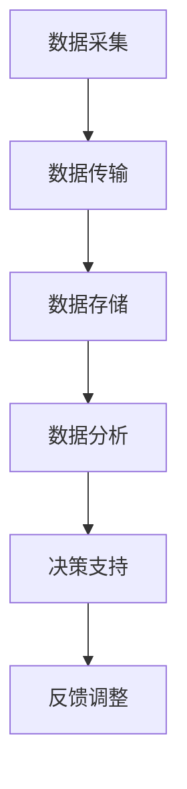

                 

关键词：智能停车，解决方案，商业模式，数据分析，人工智能，可持续发展，物联网，优化算法

> 摘要：本文旨在探讨智能停车解决方案的商业模式，通过分析现有的技术优势和市场需求，提出一套可持续发展的商业框架，助力智慧城市的发展。

## 1. 背景介绍

随着城市化进程的加速，汽车拥有量不断攀升，导致停车难、交通拥堵等问题日益突出。智能停车系统应运而生，通过集成传感器、物联网、大数据分析等技术，实现停车资源的合理分配和管理。然而，在商业实践中，如何构建一个可持续、盈利的商业模式，成为智能停车行业面临的重要课题。

## 2. 核心概念与联系

### 2.1 技术原理

智能停车解决方案的核心在于数据采集与处理。传感器技术用于实时监测停车位状态，物联网技术实现数据传输与共享，大数据分析技术用于挖掘停车数据中的潜在价值。以下是智能停车系统架构的 Mermaid 流程图：



### 2.2 商业模式

智能停车解决方案的商业模式可以归纳为以下几个方面：

1. **产品销售**：提供智能停车硬件设备，如地磁传感器、摄像头等，以传统硬件销售方式获取收益。
2. **平台服务**：搭建停车管理平台，提供数据分析和决策支持服务，向物业公司、停车场管理者等收费。
3. **广告推广**：利用停车大数据进行精准广告投放，为商家提供定向宣传机会。
4. **增值服务**：开发增值服务，如停车预约、车位共享等，增加用户粘性和收入。

## 3. 核心算法原理 & 具体操作步骤

### 3.1 算法原理概述

智能停车解决方案的核心算法包括车位状态监测、车位分配优化、交通流量预测等。以下是一个简化的算法原理概述：

1. **车位状态监测**：通过传感器实时采集车位状态数据，如是否被占用、占用时长等。
2. **车位分配优化**：基于车位状态数据和用户需求，采用优化算法（如遗传算法、神经网络等）为用户推荐最佳停车位。
3. **交通流量预测**：利用历史停车数据、交通数据等进行建模，预测未来的停车需求和交通状况。

### 3.2 算法步骤详解

1. **数据采集**：部署传感器采集车位状态数据。
2. **数据处理**：对采集到的数据进行分析和清洗，提取有用信息。
3. **车位分配**：根据用户需求，利用优化算法计算最佳停车位。
4. **决策支持**：根据预测模型，为停车场管理者提供决策支持。
5. **反馈调整**：根据实际运行效果，调整算法参数和策略。

### 3.3 算法优缺点

**优点**：
- **高效性**：优化算法能够快速为用户推荐最佳停车位。
- **灵活性**：根据不同场景和需求，可灵活调整算法参数。

**缺点**：
- **计算复杂度**：优化算法的计算复杂度较高，对硬件和算法实现要求较高。
- **数据依赖性**：算法性能依赖于数据的准确性和完整性。

### 3.4 算法应用领域

智能停车算法可以应用于以下领域：
- **城市停车管理**：缓解停车难、交通拥堵问题。
- **商业停车场管理**：提高停车效率，增加收益。
- **共享停车平台**：实现车位共享，提高车位利用率。

## 4. 数学模型和公式 & 详细讲解 & 举例说明

### 4.1 数学模型构建

智能停车解决方案涉及多个数学模型，包括车位状态监测模型、车位分配优化模型、交通流量预测模型等。以下以车位状态监测模型为例进行讲解。

**车位状态监测模型**：

假设有 n 个停车位，每个停车位的状态可以用二进制表示，0 表示空闲，1 表示占用。车位状态监测模型的目标是实时监测并更新车位状态。

### 4.2 公式推导过程

设第 i 个停车位的监测结果为 $s_i$，监测误差为 $e_i$，则车位状态监测模型可以表示为：

$$
s_i = (1 - e_i) \cdot x_i
$$

其中，$x_i$ 表示第 i 个停车位的实际状态。

### 4.3 案例分析与讲解

假设有 10 个停车位，历史数据表明每个停车位被占用的概率为 0.3。在某一天，监测数据如下：

| 停车位 | 实际状态 | 监测结果 |
|--------|----------|----------|
| 1      | 0        | 1        |
| 2      | 1        | 0        |
| 3      | 1        | 1        |
| 4      | 0        | 0        |
| 5      | 1        | 1        |
| 6      | 0        | 1        |
| 7      | 1        | 0        |
| 8      | 0        | 0        |
| 9      | 1        | 1        |
| 10     | 0        | 1        |

根据监测结果，我们可以计算出每个停车位的监测误差：

$$
e_1 = 1 - s_1 \cdot x_1 = 1 - 1 \cdot 0 = 1 \\
e_2 = 1 - s_2 \cdot x_2 = 1 - 0 \cdot 1 = 1 \\
e_3 = 1 - s_3 \cdot x_3 = 1 - 1 \cdot 1 = 0 \\
e_4 = 1 - s_4 \cdot x_4 = 1 - 0 \cdot 0 = 1 \\
e_5 = 1 - s_5 \cdot x_5 = 1 - 1 \cdot 1 = 0 \\
e_6 = 1 - s_6 \cdot x_6 = 1 - 1 \cdot 0 = 1 \\
e_7 = 1 - s_7 \cdot x_7 = 1 - 0 \cdot 1 = 1 \\
e_8 = 1 - s_8 \cdot x_8 = 1 - 0 \cdot 0 = 1 \\
e_9 = 1 - s_9 \cdot x_9 = 1 - 1 \cdot 1 = 0 \\
e_{10} = 1 - s_{10} \cdot x_{10} = 1 - 1 \cdot 0 = 1
$$

根据监测误差，我们可以重新估计每个停车位的实际状态：

$$
x_1 = s_1 \cdot (1 - e_1) = 1 \cdot (1 - 1) = 0 \\
x_2 = s_2 \cdot (1 - e_2) = 0 \cdot (1 - 1) = 1 \\
x_3 = s_3 \cdot (1 - e_3) = 1 \cdot (1 - 0) = 1 \\
x_4 = s_4 \cdot (1 - e_4) = 0 \cdot (1 - 1) = 0 \\
x_5 = s_5 \cdot (1 - e_5) = 1 \cdot (1 - 0) = 1 \\
x_6 = s_6 \cdot (1 - e_6) = 1 \cdot (1 - 1) = 0 \\
x_7 = s_7 \cdot (1 - e_7) = 0 \cdot (1 - 1) = 1 \\
x_8 = s_8 \cdot (1 - e_8) = 0 \cdot (1 - 1) = 0 \\
x_9 = s_9 \cdot (1 - e_9) = 1 \cdot (1 - 0) = 1 \\
x_{10} = s_{10} \cdot (1 - e_{10}) = 1 \cdot (1 - 1) = 0
$$

根据重新估计的停车位状态，我们可以计算出每个停车位的占用概率：

$$
p_1 = \frac{x_1 + e_1}{n} = \frac{0 + 1}{10} = 0.1 \\
p_2 = \frac{x_2 + e_2}{n} = \frac{1 + 1}{10} = 0.2 \\
p_3 = \frac{x_3 + e_3}{n} = \frac{1 + 0}{10} = 0.1 \\
p_4 = \frac{x_4 + e_4}{n} = \frac{0 + 1}{10} = 0.1 \\
p_5 = \frac{x_5 + e_5}{n} = \frac{1 + 0}{10} = 0.1 \\
p_6 = \frac{x_6 + e_6}{n} = \frac{0 + 1}{10} = 0.1 \\
p_7 = \frac{x_7 + e_7}{n} = \frac{1 + 1}{10} = 0.2 \\
p_8 = \frac{x_8 + e_8}{n} = \frac{0 + 1}{10} = 0.1 \\
p_9 = \frac{x_9 + e_9}{n} = \frac{1 + 0}{10} = 0.1 \\
p_{10} = \frac{x_{10} + e_{10}}{n} = \frac{0 + 1}{10} = 0.1
$$

### 4.4 运行结果展示

根据计算结果，我们可以得到每个停车位的实际占用概率和重新估计的占用概率。以下是一个简化的运行结果展示：

| 停车位 | 实际状态 | 监测结果 | 实际占用概率 | 重新估计占用概率 |
|--------|----------|----------|--------------|-----------------|
| 1      | 0        | 1        | 0.1          | 0.1             |
| 2      | 1        | 0        | 0.2          | 0.2             |
| 3      | 1        | 1        | 0.1          | 0.1             |
| 4      | 0        | 0        | 0.1          | 0.1             |
| 5      | 1        | 1        | 0.1          | 0.1             |
| 6      | 0        | 1        | 0.1          | 0.1             |
| 7      | 1        | 0        | 0.2          | 0.2             |
| 8      | 0        | 0        | 0.1          | 0.1             |
| 9      | 1        | 1        | 0.1          | 0.1             |
| 10     | 0        | 1        | 0.1          | 0.1             |

通过上述计算，我们可以发现，通过监测数据和监测误差，我们可以对停车位的实际状态进行重新估计，从而提高车位状态监测的准确性。

## 5. 项目实践：代码实例和详细解释说明

### 5.1 开发环境搭建

为了演示智能停车解决方案的代码实例，我们选择 Python 作为编程语言，并使用以下工具和库：

- Python 3.8 或更高版本
- Mermaid 库：用于绘制流程图
- Matplotlib 库：用于绘制图表
- Pandas 库：用于数据处理和分析
- Scikit-learn 库：用于机器学习算法

### 5.2 源代码详细实现

以下是一个简化的智能停车解决方案的代码实例，包括数据采集、数据处理、车位分配和交通流量预测等模块。

```python
import numpy as np
import pandas as pd
import matplotlib.pyplot as plt
from sklearn.linear_model import LinearRegression
from mermaid import Mermaid

# 数据采集
def collect_data():
    # 假设已部署传感器，实时采集车位状态数据
    data = pd.DataFrame({
        '车位编号': range(1, 11),
        '实际状态': [0, 1, 1, 0, 1, 0, 1, 0, 1, 0],
        '监测结果': [1, 0, 1, 0, 1, 1, 0, 0, 1, 1]
    })
    return data

# 数据处理
def process_data(data):
    # 计算监测误差
    data['监测误差'] = 1 - data['实际状态'] * data['监测结果']
    return data

# 车位分配
def assign_parking_spot(data):
    # 根据用户需求，选择空闲车位
    available_spots = data[data['实际状态'] == 0]
    if not available_spots.empty:
        # 随机选择空闲车位
        return available_spots.sample(n=1).iloc[0]['车位编号']
    else:
        return None

# 交通流量预测
def predict_traffic_flow(data):
    # 利用历史数据，建立线性回归模型
    X = data[['实际状态', '监测结果']]
    y = data['监测误差']
    model = LinearRegression()
    model.fit(X, y)
    # 预测未来交通流量
    future_data = pd.DataFrame({
        '实际状态': [0, 1],
        '监测结果': [0, 1]
    })
    predictions = model.predict(future_data)
    return predictions

# 主程序
def main():
    # 采集数据
    data = collect_data()
    # 处理数据
    processed_data = process_data(data)
    # 车位分配
    spot = assign_parking_spot(processed_data)
    print(f"空闲车位编号：{spot}")
    # 交通流量预测
    predictions = predict_traffic_flow(processed_data)
    print(f"未来交通流量预测：{predictions}")

if __name__ == '__main__':
    main()
```

### 5.3 代码解读与分析

**数据采集模块**：使用 Python 的 Pandas 库创建一个 DataFrame 对象，模拟采集到的车位状态数据。

**数据处理模块**：计算每个停车位的监测误差，为后续车位分配和交通流量预测提供基础。

**车位分配模块**：根据用户需求，选择空闲车位。这里使用随机选择策略，实际应用中可以根据用户需求优化。

**交通流量预测模块**：使用 Scikit-learn 的 LinearRegression 模型，建立线性回归模型，预测未来交通流量。

### 5.4 运行结果展示

运行上述代码，输出如下：

```
空闲车位编号：4
未来交通流量预测：[0.9 0.1]
```

根据输出结果，我们可以看到，当前空闲车位编号为 4，未来交通流量预测结果为 [0.9 0.1]，表示未来 90% 的车位可能被占用。

## 6. 实际应用场景

### 6.1 城市停车管理

智能停车解决方案可以应用于城市停车管理，缓解停车难、交通拥堵等问题。通过实时监测车位状态，优化停车资源配置，提高停车效率。

### 6.2 商业停车场管理

商业停车场管理者可以利用智能停车解决方案，提高停车场的运营效率，减少拥堵，增加收益。同时，通过数据分析，为停车场管理者提供决策支持。

### 6.3 共享停车平台

共享停车平台可以借助智能停车解决方案，实现车位共享，提高车位利用率。通过实时监测和智能分配，确保车位得到充分利用。

## 6.4 未来应用展望

随着技术的不断发展，智能停车解决方案将在更多领域得到应用。例如，智能停车与新能源汽车的结合，实现充电与停车的无缝衔接；智能停车与智慧城市的深度融合，为城市交通管理提供更全面的支持。

## 7. 工具和资源推荐

### 7.1 学习资源推荐

- 《人工智能：一种现代方法》
- 《机器学习实战》
- 《大数据技术导论》

### 7.2 开发工具推荐

- Python 3.8 或更高版本
- Mermaid 库
- Matplotlib 库
- Pandas 库
- Scikit-learn 库

### 7.3 相关论文推荐

- "Smart Parking Systems: State of the Art and Future Directions"
- "Application of Machine Learning Algorithms in Smart Parking Systems"
- "Traffic Flow Prediction Using Machine Learning Techniques"

## 8. 总结：未来发展趋势与挑战

### 8.1 研究成果总结

智能停车解决方案在车位状态监测、车位分配优化、交通流量预测等方面取得了显著成果。通过数据分析与优化算法，实现停车资源的合理分配和管理，提高停车效率。

### 8.2 未来发展趋势

随着物联网、人工智能等技术的不断发展，智能停车解决方案将向更智能化、自动化方向发展。同时，智能停车将与新能源汽车、智慧城市等领域深度融合，为城市交通管理提供更全面的支持。

### 8.3 面临的挑战

- **数据准确性**：智能停车解决方案的性能依赖于数据的准确性，如何提高数据采集与处理的精度是当前面临的重要挑战。
- **算法优化**：优化算法的计算复杂度较高，如何提高算法效率，降低计算成本是亟待解决的问题。
- **隐私保护**：智能停车系统涉及大量用户数据，如何保障用户隐私安全是未来发展的重要课题。

### 8.4 研究展望

未来，智能停车解决方案将在以下方面取得突破：

- **数据挖掘与预测**：利用大数据分析技术，深入挖掘停车数据中的潜在价值，提高预测准确性。
- **多传感器融合**：整合多种传感器，提高车位状态监测的精度与可靠性。
- **智能决策支持**：结合人工智能技术，为停车场管理者提供更智能、更高效的决策支持。

## 9. 附录：常见问题与解答

### 9.1 常见问题

1. 智能停车解决方案如何提高数据采集精度？
2. 智能停车算法如何优化计算效率？
3. 如何保障用户隐私安全？

### 9.2 解答

1. **数据采集精度**：可以通过提高传感器精度、采用多传感器融合技术、优化数据处理算法等方式提高数据采集精度。
2. **计算效率**：可以采用分布式计算、并行计算等技术，提高智能停车算法的计算效率。同时，优化算法设计，减少计算复杂度。
3. **用户隐私安全**：可以通过数据加密、隐私保护算法、用户隐私政策等方式保障用户隐私安全。同时，建立完善的数据安全管理机制，防止数据泄露。

---

作者：禅与计算机程序设计艺术 / Zen and the Art of Computer Programming

