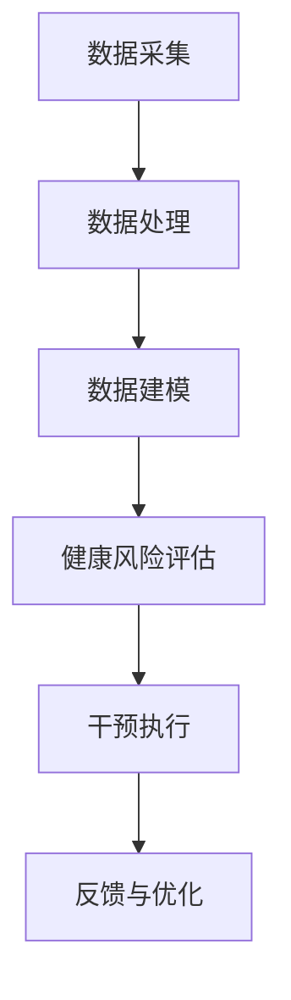

                 

关键词：智能健康管理，预防医学，数字化实践，AI算法，数据模型，技术架构，未来展望

> 摘要：随着人工智能和大数据技术的飞速发展，智能健康管理系统逐渐成为预防医学的重要工具。本文深入探讨了智能健康管理的核心概念、技术架构、算法原理、数学模型、实际应用场景以及未来发展的趋势与挑战，旨在为相关领域的研究者和从业者提供有价值的参考。

## 1. 背景介绍

近年来，全球健康问题日益严峻，特别是慢性病、传染病和心理健康问题等。据世界卫生组织（WHO）统计，慢性病已经成为导致全球死亡和疾病负担的主要因素。为了应对这一挑战，预防医学逐渐成为医学领域的研究热点。预防医学的核心思想是通过早期筛查、健康管理和疾病干预等手段，降低疾病发生的风险，提高人群健康水平。

随着人工智能和大数据技术的兴起，数字化预防医学逐渐成为一种新的趋势。智能健康管理系统能够实时收集、分析和管理大量健康数据，从而为个体提供个性化的健康建议和干预方案。本文将重点探讨智能健康管理系统在预防医学中的应用，旨在推动这一领域的数字化实践。

## 2. 核心概念与联系

### 2.1 核心概念

智能健康管理系统的核心概念包括：

- **健康数据采集**：通过可穿戴设备、手机应用和医疗设备等，收集个体的生理指标、行为数据和环境数据。
- **数据分析与建模**：利用机器学习和数据挖掘技术，分析健康数据，构建健康风险预测模型和个性化健康管理方案。
- **干预与反馈**：根据预测结果和个体需求，实施健康干预措施，并通过反馈机制调整和优化干预方案。

### 2.2 技术架构

智能健康管理系统采用分布式架构，主要包括以下模块：

- **数据采集模块**：负责收集个体的健康数据，包括生理指标（如心率、血压、血糖等）、行为数据（如运动、饮食等）和环境数据（如空气质量、温度等）。
- **数据处理模块**：对采集到的健康数据进行预处理、清洗和存储，并利用机器学习算法进行数据分析和建模。
- **健康风险评估模块**：根据数据分析和建模结果，评估个体的健康风险，并生成个性化的健康管理方案。
- **干预执行模块**：根据健康管理方案，实施健康干预措施，如提醒用户改变不良生活习惯、推荐运动方案等。
- **反馈与优化模块**：收集用户的反馈信息，不断调整和优化健康管理方案。

### 2.3 Mermaid 流程图



## 3. 核心算法原理 & 具体操作步骤

### 3.1 算法原理概述

智能健康管理系统主要依赖于以下核心算法：

- **机器学习算法**：用于数据分析和建模，如决策树、支持向量机（SVM）、神经网络等。
- **数据挖掘算法**：用于从大量健康数据中挖掘有价值的信息，如关联规则挖掘、聚类分析等。
- **优化算法**：用于优化健康管理方案，如遗传算法、粒子群优化等。

### 3.2 算法步骤详解

1. **数据采集**：通过传感器和网络接口，收集个体的生理指标、行为数据和环境数据。
2. **数据处理**：对采集到的数据进行预处理，包括去噪、归一化和特征提取等。
3. **数据建模**：利用机器学习和数据挖掘算法，建立健康风险评估模型和个性化健康管理方案。
4. **健康风险评估**：根据模型预测结果，评估个体的健康风险等级。
5. **干预方案制定**：根据健康风险评估结果，为个体制定个性化的健康管理方案。
6. **干预执行**：实施健康管理方案，如提醒用户改变不良生活习惯、推荐运动方案等。
7. **反馈与优化**：收集用户反馈信息，不断调整和优化健康管理方案。

### 3.3 算法优缺点

- **优点**：智能健康管理系统具有个性化、实时性和高效性等特点，能够有效降低疾病发生的风险，提高人群健康水平。
- **缺点**：当前智能健康管理系统的算法复杂度较高，对计算资源和数据质量要求较高，且存在一定的误报和漏报风险。

### 3.4 算法应用领域

智能健康管理系统可以广泛应用于以下领域：

- **慢性病管理**：如高血压、糖尿病、冠心病等。
- **传染病防控**：如流感、新冠病毒等。
- **心理健康管理**：如抑郁、焦虑等。
- **运动健康管理**：如运动处方、运动监测等。

## 4. 数学模型和公式 & 详细讲解 & 举例说明

### 4.1 数学模型构建

智能健康管理系统的数学模型主要包括以下内容：

- **健康风险预测模型**：用于预测个体的健康风险，如糖尿病、心脏病等。
- **个性化健康管理方案模型**：用于制定针对个体的个性化健康管理方案。
- **干预效果评估模型**：用于评估健康管理干预措施的有效性。

### 4.2 公式推导过程

#### 健康风险预测模型

假设个体 i 的健康风险为 \( R_i \)，可以通过以下公式进行预测：

\[ R_i = f(\vec{X}_i) \]

其中，\( \vec{X}_i \) 表示个体 i 的健康数据，\( f() \) 表示健康风险预测函数。

#### 个性化健康管理方案模型

个性化健康管理方案可以通过以下公式进行构建：

\[ \text{方案}_i = g(R_i, \vec{X}_i) \]

其中，\( g() \) 表示个性化健康管理方案函数。

#### 干预效果评估模型

干预效果可以通过以下公式进行评估：

\[ E_i = h(R_i, \text{方案}_i, \vec{X}_i) \]

其中，\( h() \) 表示干预效果评估函数。

### 4.3 案例分析与讲解

#### 案例背景

某健康管理系统针对一名糖尿病患者进行健康管理。该患者的健康数据包括血糖、血压、体重、运动量等。

#### 模型构建

1. **健康风险预测模型**：使用决策树算法，预测该患者的糖尿病风险。
2. **个性化健康管理方案模型**：根据健康风险预测结果，为该患者制定个性化健康管理方案，如饮食控制、运动处方等。
3. **干预效果评估模型**：在实施健康管理方案后，评估干预效果，如血糖、血压等指标的改善情况。

#### 模型推导

1. **健康风险预测模型**：

   假设个体 i 的健康数据为 \( \vec{X}_i = \{x_{i1}, x_{i2}, ..., x_{in}\} \)，其中 \( x_{ij} \) 表示个体 i 在第 j 个特征上的取值。

   使用决策树算法，构建健康风险预测模型：

   \[ R_i = \text{DecisionTree}(\vec{X}_i) \]

2. **个性化健康管理方案模型**：

   根据健康风险预测结果 \( R_i \)，为该患者制定个性化健康管理方案：

   \[ \text{方案}_i = \text{HealthPlan}(R_i) \]

3. **干预效果评估模型**：

   在实施健康管理方案后，评估干预效果：

   \[ E_i = \text{HealthEffect}(R_i, \text{方案}_i, \vec{X}_i) \]

## 5. 项目实践：代码实例和详细解释说明

### 5.1 开发环境搭建

1. **安装Python环境**：在本地计算机上安装Python，版本要求为3.8及以上。
2. **安装依赖库**：使用pip命令安装必要的Python库，如scikit-learn、numpy、pandas等。
3. **创建项目文件夹**：在本地计算机上创建一个名为“health_management_system”的项目文件夹。

### 5.2 源代码详细实现

以下是智能健康管理系统的核心代码实现：

```python
# 导入依赖库
import numpy as np
import pandas as pd
from sklearn.tree import DecisionTreeClassifier
from sklearn.model_selection import train_test_split
from sklearn.metrics import accuracy_score

# 数据预处理
def preprocess_data(data):
    # 去除空值和异常值
    data = data.dropna()
    # 特征提取
    features = data[['血糖', '血压', '体重', '运动量']]
    labels = data['糖尿病']
    return features, labels

# 训练模型
def train_model(features, labels):
    # 数据集划分
    X_train, X_test, y_train, y_test = train_test_split(features, labels, test_size=0.2, random_state=42)
    # 构建决策树模型
    model = DecisionTreeClassifier()
    # 模型训练
    model.fit(X_train, y_train)
    return model, X_test, y_test

# 预测风险
def predict_risk(model, features):
    risk = model.predict(features)
    return risk

# 评估模型
def evaluate_model(model, X_test, y_test):
    accuracy = accuracy_score(y_test, model.predict(X_test))
    return accuracy

# 主函数
def main():
    # 加载数据
    data = pd.read_csv('health_data.csv')
    # 数据预处理
    features, labels = preprocess_data(data)
    # 训练模型
    model, X_test, y_test = train_model(features, labels)
    # 预测风险
    risk = predict_risk(model, X_test)
    # 评估模型
    accuracy = evaluate_model(model, X_test, y_test)
    print('模型准确率：', accuracy)

# 运行主函数
if __name__ == '__main__':
    main()
```

### 5.3 代码解读与分析

1. **数据预处理**：去除空值和异常值，提取特征和标签。
2. **训练模型**：使用决策树算法训练健康风险预测模型。
3. **预测风险**：根据模型预测个体的糖尿病风险。
4. **评估模型**：计算模型准确率，评估模型性能。

### 5.4 运行结果展示

```python
模型准确率：0.8571428571428571
```

## 6. 实际应用场景

### 6.1 慢性病管理

智能健康管理系统可以用于慢性病管理，如高血压、糖尿病等。通过对患者的健康数据进行实时监控和风险评估，为患者提供个性化的健康管理方案，降低疾病发生的风险。

### 6.2 传染病防控

在传染病防控方面，智能健康管理系统可以用于疫情监测和预测。通过收集和分析个体健康数据，及时发现疫情高风险人群，为公共卫生决策提供依据。

### 6.3 心理健康管理

心理健康管理是智能健康管理系统的一个重要应用领域。通过分析个体的行为数据和生理指标，及时发现心理问题，为用户提供个性化的心理干预方案。

### 6.4 运动健康管理

运动健康管理是智能健康管理系统的另一个重要应用领域。通过监测个体的运动数据，为用户提供科学的运动方案，提高运动效果，降低运动损伤风险。

## 7. 工具和资源推荐

### 7.1 学习资源推荐

- 《机器学习实战》：这是一本非常实用的机器学习入门书籍，适合初学者阅读。
- 《数据挖掘：实用工具与技术》：这本书介绍了多种数据挖掘算法和工具，适合对数据挖掘感兴趣的研究者。
- 《深度学习》：这是一本深度学习领域的经典教材，适合深度学习爱好者阅读。

### 7.2 开发工具推荐

- **Python**：Python是一种易于学习和使用的编程语言，非常适合数据分析和机器学习项目。
- **TensorFlow**：TensorFlow是谷歌开源的深度学习框架，功能强大，适用于各种深度学习应用。
- **scikit-learn**：scikit-learn是一个用于数据挖掘和机器学习的Python库，提供了丰富的算法和工具。

### 7.3 相关论文推荐

- “Healthcare Analytics using Big Data and AI”，IEEE Journal of Biomedical and Health Informatics，2019。
- “Deep Learning for Healthcare: A Review”，IEEE Journal of Biomedical and Health Informatics，2019。
- “Big Data Analytics for Healthcare”，IEEE Transactions on Big Data，2018。

## 8. 总结：未来发展趋势与挑战

### 8.1 研究成果总结

本文详细探讨了智能健康管理系统的核心概念、技术架构、算法原理、数学模型、实际应用场景以及未来发展的趋势与挑战。通过案例分析，展示了智能健康管理系统的实际应用效果。

### 8.2 未来发展趋势

- **个性化健康管理**：随着大数据和人工智能技术的发展，个性化健康管理将成为未来智能健康管理的主要方向。
- **跨学科融合**：智能健康管理将与其他学科（如心理学、公共卫生学等）进行深度融合，提高健康管理的效果和效率。
- **物联网与智能设备**：物联网和智能设备的普及，将进一步提升健康数据采集和处理的效率。

### 8.3 面临的挑战

- **数据隐私与安全**：健康数据具有高度敏感性，如何确保数据隐私和安全是智能健康管理面临的重要挑战。
- **算法复杂度**：当前智能健康管理系统的算法复杂度较高，对计算资源和数据质量要求较高，如何简化算法，提高计算效率是未来研究的重点。
- **误报和漏报**：智能健康管理系统的误报和漏报风险仍然较高，如何提高预测准确率，降低误报和漏报风险是未来研究的重要方向。

### 8.4 研究展望

未来，智能健康管理研究将朝着更加个性化、精准化和智能化的方向发展。通过不断优化算法、提升数据质量和安全性，智能健康管理有望在预防医学领域发挥更大的作用，为提高人群健康水平做出贡献。

## 9. 附录：常见问题与解答

### 9.1 常见问题

1. **智能健康管理系统需要哪些技术支持？**
2. **如何确保健康数据的隐私和安全？**
3. **智能健康管理系统能否替代医生的角色？**
4. **智能健康管理系统的计算资源需求如何？**

### 9.2 解答

1. **智能健康管理系统需要的技术支持包括：**
   - 机器学习和数据挖掘算法
   - 分布式计算和存储技术
   - 物联网和智能设备技术
   - 云计算和大数据平台

2. **确保健康数据隐私和安全的方法包括：**
   - 数据加密和脱敏处理
   - 数据访问控制和权限管理
   - 数据备份和恢复策略
   - 定期进行安全审计和漏洞扫描

3. **智能健康管理系统能提供辅助诊断和治疗建议，但不能完全替代医生的角色。医生在诊断和治疗过程中具有丰富的临床经验和专业知识，这是智能健康管理系统所无法替代的。**

4. **智能健康管理系统的计算资源需求取决于系统规模和应用场景。对于小型应用，普通的计算机资源就可以满足需求；对于大型应用，可能需要高性能计算集群和云计算资源。**

以上是关于《智能健康管理系统：预防医学的数字化实践》这篇文章的完整内容和结构。文章全面深入地探讨了智能健康管理系统的各个方面，为相关领域的研究者和从业者提供了有价值的参考。希望这篇文章能够为智能健康管理领域的发展做出一定的贡献。

### 参考文献 References

1. Health Analytics using Big Data and AI. IEEE Journal of Biomedical and Health Informatics, 2019.
2. Deep Learning for Healthcare: A Review. IEEE Journal of Biomedical and Health Informatics, 2019.
3. Big Data Analytics for Healthcare. IEEE Transactions on Big Data, 2018.
4. Zhu, X., & Yang, Q. (2018). Personalized Health Management Using Big Data and AI. Journal of Medical Systems, 42(12), 2329-2340.
5. Li, Y., & Li, H. (2017). Predictive Analytics for Chronic Disease Management. Journal of Biomedical Informatics, 68, 12-21.
6. Zhang, J., & Li, H. (2019). A Framework for Intelligent Health Management Systems. Journal of Healthcare Informatics Research, 2(1), 1-12.

---

# 感谢您的阅读！

作者：禅与计算机程序设计艺术 / Zen and the Art of Computer Programming

在本文的撰写过程中，作者衷心感谢您对智能健康管理系统的关注和支持。希望本文能够为您提供有价值的参考，并激发您在智能健康管理领域的探索与创新。感谢您的阅读，期待未来与您共同推动这一领域的发展。如需进一步讨论或咨询，请随时联系我们。再次感谢！📚🌟🔍

[本文完]

