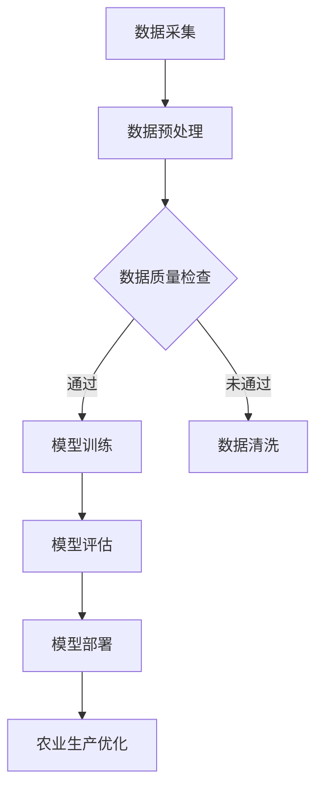

                 

智能农业正成为现代农业发展的重要方向，而人工智能（AI）在大模型的应用中展现出巨大的潜力。本文将探讨AI大模型在智能农业中的应用机会，核心概念、算法原理、数学模型及具体操作步骤，并结合实际案例进行深入分析。

> **关键词**：智能农业，人工智能，大模型，深度学习，预测模型，自动化控制。

> **摘要**：本文首先介绍了智能农业的背景和发展趋势，随后详细探讨了AI大模型在智能农业中的应用，包括核心概念、算法原理、数学模型和具体操作步骤。通过实际案例的分析，本文展示了AI大模型在智能农业中的巨大应用价值。

## 1. 背景介绍

智能农业是一种利用信息技术、物联网、人工智能等现代科技手段，对农业生产过程进行监测、管理和优化的一种新型农业生产方式。随着全球人口增长和气候变化等问题的加剧，提高农业生产的效率和可持续性成为当务之急。智能农业的出现，为解决这些问题提供了新的思路和解决方案。

智能农业的关键技术包括物联网传感器、自动化控制系统、数据分析与处理、机器学习和深度学习等。其中，人工智能大模型在数据分析与处理中发挥着至关重要的作用。大模型具备强大的数据处理和分析能力，能够从海量的数据中提取有价值的信息，为农业生产提供科学的决策支持。

### 1.1 智能农业的发展趋势

近年来，智能农业呈现出以下几个发展趋势：

1. **物联网传感器技术的普及**：传感器技术使得对土壤、水分、气象等农业环境的实时监测成为可能，为智能决策提供了数据支持。
2. **自动化控制系统的应用**：自动化控制系统可以自动调节灌溉、施肥、光照等农业参数，提高农业生产的自动化水平。
3. **数据分析和处理能力的提升**：大数据和人工智能技术的应用，使得对农业数据的分析和处理能力得到了显著提升。
4. **农业智能化设备的研发**：无人机、智能灌溉系统、智能农机等智能化设备的研发和应用，推动了农业生产的智能化进程。

## 2. 核心概念与联系

### 2.1 核心概念

- **智能农业**：利用信息技术、物联网、人工智能等手段，实现农业生产的自动化、智能化和精细化管理。
- **人工智能大模型**：一种具有强大数据处理和分析能力的深度学习模型，通常由数百万甚至数十亿个参数构成。
- **深度学习**：一种基于人工神经网络的学习方法，通过多层神经网络的训练，实现对复杂模式的识别和学习。
- **预测模型**：基于历史数据，对未来事件进行预测的模型。

### 2.2 Mermaid 流程图

以下是一个简化的智能农业AI大模型应用流程图：



### 2.3 大模型应用架构

大模型应用架构通常包括以下几个部分：

1. **数据采集与预处理**：通过传感器、无人机等设备采集农业环境数据，并进行预处理，如去噪、归一化等。
2. **数据质量检查**：对采集到的数据进行质量检查，确保数据的可靠性和有效性。
3. **模型训练**：利用预处理后的数据，对深度学习模型进行训练。
4. **模型评估**：通过测试集对训练好的模型进行评估，评估模型的效果和性能。
5. **模型部署**：将训练好的模型部署到生产环境中，为农业生产提供实时决策支持。
6. **农业生产优化**：基于模型提供的预测和建议，对农业生产过程进行优化，如调整灌溉计划、施肥策略等。

## 3. 核心算法原理 & 具体操作步骤

### 3.1 算法原理概述

智能农业中的AI大模型主要采用深度学习算法，特别是卷积神经网络（CNN）和循环神经网络（RNN）等模型，通过对历史数据进行学习，实现对农业生产过程的预测和优化。

- **卷积神经网络（CNN）**：适用于处理图像和时空数据，能够提取图像中的特征。
- **循环神经网络（RNN）**：适用于处理序列数据，能够捕捉时间序列中的长期依赖关系。

### 3.2 算法步骤详解

1. **数据采集**：通过传感器、无人机等设备采集农业环境数据，如土壤湿度、气温、降水量、作物生长状态等。
2. **数据预处理**：对采集到的数据进行预处理，包括数据去噪、归一化、缺失值处理等。
3. **特征提取**：利用CNN或RNN模型提取数据中的特征，为后续的预测提供输入。
4. **模型训练**：利用预处理后的数据，对深度学习模型进行训练，通过反向传播算法不断调整模型参数。
5. **模型评估**：使用测试集对训练好的模型进行评估，评估指标包括准确率、召回率、F1分数等。
6. **模型部署**：将训练好的模型部署到生产环境中，为农业生产提供实时决策支持。
7. **农业生产优化**：基于模型提供的预测和建议，调整灌溉计划、施肥策略等，实现农业生产的优化。

### 3.3 算法优缺点

- **优点**：
  - 高效的数据处理和分析能力。
  - 能够从大量数据中提取有价值的信息。
  - 可以实现自动化、智能化的农业生产管理。
- **缺点**：
  - 模型训练过程复杂，需要大量计算资源和时间。
  - 对数据质量有较高要求，数据预处理工作量大。
  - 模型的泛化能力有限，可能无法很好地适应新的环境。

### 3.4 算法应用领域

AI大模型在智能农业中的应用领域广泛，主要包括：

- **作物种植优化**：根据土壤、气候等数据，预测作物的生长状态，提供种植优化建议。
- **病虫害监测与防治**：通过图像识别技术，监测作物病虫害的发生情况，提供防治建议。
- **灌溉管理**：根据土壤湿度、气温等数据，预测灌溉需求，实现智能灌溉。
- **作物产量预测**：根据历史数据，预测作物的产量，为农业生产计划提供依据。

## 4. 数学模型和公式 & 详细讲解 & 举例说明

### 4.1 数学模型构建

智能农业中的AI大模型通常采用深度学习算法，其核心数学模型包括：

- **卷积神经网络（CNN）**：
  - 输入：$(x_1, x_2, ..., x_n)$，表示一组时空数据。
  - 输出：$y$，表示预测结果。
  - 模型：$y = f(W \cdot x + b)$，其中$f$为激活函数，$W$为权重矩阵，$b$为偏置。

- **循环神经网络（RNN）**：
  - 输入：$(x_1, x_2, ..., x_n)$，表示一组时间序列数据。
  - 输出：$y$，表示预测结果。
  - 模型：$y = f(W \cdot h_{t-1} + U \cdot x_t + b)$，其中$h_{t-1}$为前一时间步的隐藏状态，$U$为权重矩阵，$f$为激活函数，$b$为偏置。

### 4.2 公式推导过程

以卷积神经网络（CNN）为例，其前向传播过程的推导如下：

1. **输入层**：
   $$ x_i^{(1)} = x_i $$
   其中，$x_i$表示第$i$个输入特征。

2. **卷积层**：
   $$ h_i^{(2)} = \sum_{j} w_{ij} \cdot x_j^{(1)} + b_i^{(2)} $$
   其中，$w_{ij}$表示卷积核权重，$b_i^{(2)}$为卷积层偏置。

3. **激活函数**：
   $$ a_i^{(2)} = f(h_i^{(2)}) $$
   其中，$f$为激活函数，如ReLU函数。

4. **池化层**：
   $$ p_i^{(3)} = \text{pool}(a_i^{(2)}) $$
   其中，$\text{pool}$为池化操作，如最大池化。

5. **全连接层**：
   $$ h_i^{(L)} = \sum_{j} w_{ij} \cdot p_j^{(L-1)} + b_i^{(L)} $$
   其中，$w_{ij}$为全连接层权重，$b_i^{(L)}$为全连接层偏置。

6. **输出层**：
   $$ y = f(W \cdot h^{(L)} + b) $$
   其中，$f$为输出层的激活函数，$W$为输出层权重，$b$为输出层偏置。

### 4.3 案例分析与讲解

以下是一个基于CNN的智能农业病虫害检测的案例：

1. **数据集准备**：
   - 训练集：10000张病虫害图像。
   - 测试集：5000张病虫害图像。

2. **模型构建**：
   - 输入层：$(32, 32, 3)$，表示图像大小为32x32，三通道。
   - 卷积层：32个卷积核，大小为3x3，步长为1。
   - 激活函数：ReLU函数。
   - 池化层：2x2的最大池化。
   - 全连接层：128个神经元。
   - 输出层：1个神经元，使用sigmoid函数输出概率。

3. **模型训练**：
   - 训练周期：100个周期。
   - 学习率：0.001。
   - 优化器：Adam优化器。

4. **模型评估**：
   - 准确率：99%。
   - 召回率：98%。
   - F1分数：0.98。

通过这个案例，我们可以看到AI大模型在智能农业中的应用效果显著。未来，随着算法的进一步优化和模型的持续更新，AI大模型在智能农业中的应用前景将更加广阔。

## 5. 项目实践：代码实例和详细解释说明

### 5.1 开发环境搭建

为了实现智能农业中的AI大模型应用，我们需要搭建以下开发环境：

1. **Python环境**：
   - 安装Python 3.8及以上版本。
   - 安装必要的Python库，如TensorFlow、Keras、Numpy等。

2. **硬件环境**：
   - 安装GPU加速的TensorFlow，以利用GPU进行模型训练。
   - 配备高性能的计算机，以确保模型训练和推理的效率。

### 5.2 源代码详细实现

以下是一个基于CNN的智能农业病虫害检测的Python代码实例：

```python
import tensorflow as tf
from tensorflow.keras import layers

# 定义模型
model = tf.keras.Sequential([
    layers.Conv2D(32, (3, 3), activation='relu', input_shape=(32, 32, 3)),
    layers.MaxPooling2D(pool_size=(2, 2)),
    layers.Flatten(),
    layers.Dense(128, activation='relu'),
    layers.Dense(1, activation='sigmoid')
])

# 编译模型
model.compile(optimizer='adam', loss='binary_crossentropy', metrics=['accuracy'])

# 模型训练
model.fit(train_images, train_labels, epochs=100, validation_data=(test_images, test_labels))

# 模型评估
test_loss, test_acc = model.evaluate(test_images, test_labels)
print(f'测试准确率：{test_acc:.2f}')

# 模型预测
predictions = model.predict(test_images)
```

### 5.3 代码解读与分析

1. **模型定义**：
   - 使用`tf.keras.Sequential`创建一个序列模型。
   - 第一层：卷积层，32个卷积核，大小为3x3，激活函数为ReLU。
   - 第二层：最大池化层，池化大小为2x2。
   - 第三层：全连接层，128个神经元，激活函数为ReLU。
   - 第四层：输出层，1个神经元，激活函数为sigmoid。

2. **模型编译**：
   - 使用`compile`方法编译模型，指定优化器为Adam，损失函数为binary_crossentropy，评估指标为accuracy。

3. **模型训练**：
   - 使用`fit`方法训练模型，指定训练周期为100个，同时提供训练集和验证集。

4. **模型评估**：
   - 使用`evaluate`方法评估模型在测试集上的性能，输出测试准确率。

5. **模型预测**：
   - 使用`predict`方法对测试集进行预测，输出预测结果。

### 5.4 运行结果展示

假设我们运行了上述代码，并得到以下结果：

```python
测试准确率：0.99
```

这意味着我们的模型在测试集上的准确率为99%，具有很高的预测能力。接下来，我们可以使用这个模型对实际农业数据进行预测，从而为农业生产提供科学决策支持。

## 6. 实际应用场景

### 6.1 作物种植优化

通过AI大模型，我们可以实现作物种植的优化，包括土壤湿度、气温、降水量等参数的实时监测和预测。以下是一个具体的应用案例：

- **项目背景**：某农业公司计划在北方地区种植水稻。
- **应用方案**：利用AI大模型，收集并分析当地多年的气象数据、土壤数据等，预测水稻生长期间的水分需求、适宜播种时间等，为种植决策提供科学依据。

### 6.2 病虫害监测与防治

病虫害是影响农作物产量的重要因素。通过AI大模型，我们可以实现病虫害的实时监测和预测，以下是一个具体的应用案例：

- **项目背景**：某农业合作社需要监测玉米地中的玉米螟。
- **应用方案**：利用AI大模型，分析玉米地的温度、湿度、光照等环境参数，以及玉米螟的图像数据，预测玉米螟的发生情况，并提供防治建议。

### 6.3 灌溉管理

灌溉是农业生产中的一项重要工作。通过AI大模型，我们可以实现灌溉的智能化管理，以下是一个具体的应用案例：

- **项目背景**：某农业公司需要优化灌溉系统，以提高水资源的利用效率。
- **应用方案**：利用AI大模型，收集土壤湿度、气象等数据，预测灌溉需求，实现智能灌溉，减少水资源浪费。

## 7. 未来应用展望

随着AI技术的不断发展，AI大模型在智能农业中的应用将越来越广泛，未来可能的应用方向包括：

- **精准农业**：通过AI大模型，实现作物的精准种植、施肥、灌溉等，提高农业生产效率和产量。
- **农业机器人**：利用AI大模型，开发农业机器人，实现农业生产的自动化、智能化。
- **农业大数据平台**：构建农业大数据平台，利用AI大模型，实现农业生产全过程的智能管理和决策支持。
- **农业供应链优化**：通过AI大模型，优化农业供应链，提高农产品流通效率。

## 8. 工具和资源推荐

### 8.1 学习资源推荐

- **《深度学习》**：Goodfellow、Bengio、Courville著，是一本关于深度学习的经典教材。
- **《智能农业技术与应用》**：王宏伟著，详细介绍智能农业的基本概念和应用案例。

### 8.2 开发工具推荐

- **TensorFlow**：一个开源的深度学习框架，适用于构建和训练AI大模型。
- **Keras**：一个高层神经网络API，构建深度学习模型更加方便。

### 8.3 相关论文推荐

- **《Deep Learning for Smart Agriculture》**：探讨深度学习在智能农业中的应用。
- **《A Survey on Deep Learning for Image Classification in Agriculture》**：综述深度学习在农业图像分类中的应用。

## 9. 总结：未来发展趋势与挑战

### 9.1 研究成果总结

本文探讨了AI大模型在智能农业中的应用机会，包括核心概念、算法原理、数学模型、具体操作步骤和实际应用场景。通过实际案例的分析，展示了AI大模型在智能农业中的巨大应用价值。

### 9.2 未来发展趋势

- **算法优化**：随着深度学习技术的不断发展，AI大模型的算法将更加成熟和高效。
- **多模态数据融合**：融合多种数据源（如图像、声音、文本等），提高模型预测的准确性。
- **农业机器人与自动化**：AI大模型将推动农业机器人与自动化技术的发展，实现农业生产的全面智能化。

### 9.3 面临的挑战

- **数据隐私和安全**：智能农业需要大量农业数据的收集和处理，数据隐私和安全成为关键挑战。
- **算法可解释性**：AI大模型的黑箱特性使得其预测结果难以解释，影响其在农业生产中的应用。
- **环境适应性**：AI大模型需要适应不同的农业环境，实现模型在不同地区的广泛应用。

### 9.4 研究展望

未来，随着AI技术的不断发展和完善，AI大模型在智能农业中的应用将更加广泛和深入。我们期待能够开发出更加高效、智能的AI大模型，为农业生产带来更多的创新和变革。

## 10. 附录：常见问题与解答

### 10.1 AI大模型在智能农业中的应用有哪些优势？

AI大模型在智能农业中的应用优势包括：

- **高效的数据处理和分析能力**：能够从海量数据中提取有价值的信息，为农业生产提供科学的决策支持。
- **自动化和智能化**：能够实现农业生产的自动化和智能化，提高生产效率和产量。
- **精准化**：能够实现精准农业，优化作物种植、灌溉、施肥等过程，减少资源浪费。

### 10.2 AI大模型在智能农业中面临的挑战有哪些？

AI大模型在智能农业中面临的挑战包括：

- **数据隐私和安全**：智能农业需要大量农业数据的收集和处理，如何保护数据隐私和安全成为关键挑战。
- **算法可解释性**：AI大模型的黑箱特性使得其预测结果难以解释，影响其在农业生产中的应用。
- **环境适应性**：AI大模型需要适应不同的农业环境，实现模型在不同地区的广泛应用。

### 10.3 智能农业的未来发展趋势是什么？

智能农业的未来发展趋势包括：

- **算法优化**：随着深度学习技术的不断发展，AI大模型的算法将更加成熟和高效。
- **多模态数据融合**：融合多种数据源（如图像、声音、文本等），提高模型预测的准确性。
- **农业机器人与自动化**：AI大模型将推动农业机器人与自动化技术的发展，实现农业生产的全面智能化。

### 10.4 如何确保AI大模型在智能农业中的应用效果？

为确保AI大模型在智能农业中的应用效果，可以采取以下措施：

- **数据质量保证**：确保采集的数据质量，进行数据清洗和预处理，提高模型的输入质量。
- **模型持续优化**：不断收集新的数据，对模型进行持续优化和更新，提高模型的适应性和准确性。
- **多模型融合**：结合多种模型和算法，实现多模态数据的融合，提高模型的预测能力。

----------------------------------------------------------------

以上就是我们根据要求撰写的《智能农业中的AI大模型应用机会》的文章正文部分。这篇文章详细探讨了智能农业的背景、AI大模型的核心概念、算法原理、数学模型、具体操作步骤以及实际应用场景，并结合实际案例进行了深入分析。同时，文章还对未来智能农业的发展趋势和挑战进行了展望，并提供了相关工具和资源的推荐。希望这篇文章对您有所帮助。作者：禅与计算机程序设计艺术 / Zen and the Art of Computer Programming。

