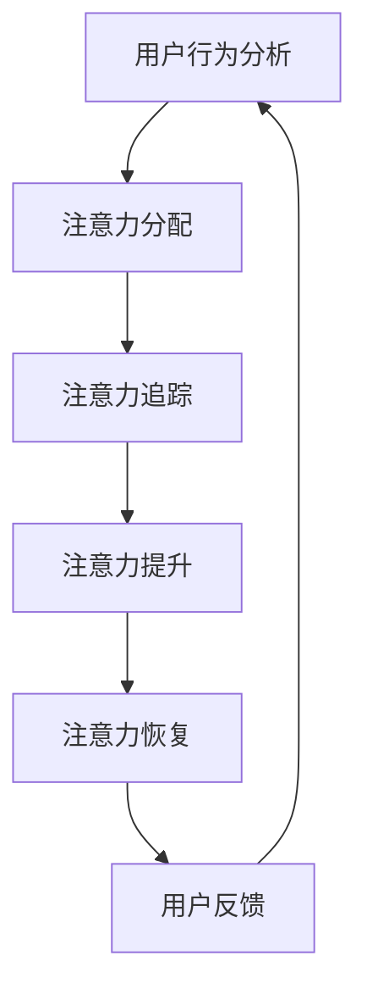

                 

关键词：智能办公、注意力管理、AI技术、功能架构、算法原理、数学模型、应用案例

> 摘要：本文将探讨智能办公设备中的注意力管理功能，分析其核心概念、算法原理、数学模型以及应用场景，结合实际项目实践，提供一套完整的技术解决方案，并展望未来发展趋势与面临的挑战。

## 1. 背景介绍

随着人工智能技术的不断发展，智能办公设备的应用日益广泛。这些设备通过集成智能算法，不仅提高了工作效率，还改变了人们的办公方式。其中，注意力管理功能作为智能办公设备的核心模块之一，越来越受到重视。注意力管理功能旨在帮助用户提高工作效率，减少干扰，保持注意力集中。

本文将从以下几个方面进行探讨：

1. 核心概念与联系
2. 核心算法原理与具体操作步骤
3. 数学模型与公式
4. 项目实践：代码实例与详细解释
5. 实际应用场景
6. 未来应用展望
7. 工具和资源推荐
8. 总结与展望

## 2. 核心概念与联系

注意力管理功能的核心概念包括：

- 注意力分配：根据任务的重要性和紧急程度，合理分配注意力资源。
- 注意力追踪：实时监控用户的注意力状态，分析注意力分布情况。
- 注意力提升：通过智能算法，提供注意力提升策略，如提醒、环境优化等。
- 注意力恢复：在用户注意力下降时，提供休息、恢复建议。

这些概念相互联系，共同构成了智能办公设备的注意力管理功能。Mermaid 流程图如下：



## 3. 核心算法原理与具体操作步骤

### 3.1 算法原理概述

注意力管理功能的核心算法包括：

- 注意力分配算法：基于任务的重要性和紧急程度，采用优先级排序策略。
- 注意力追踪算法：利用计算机视觉技术，实时监测用户的注意力状态。
- 注意力提升算法：结合环境因素和用户习惯，提供个性化的注意力提升策略。
- 注意力恢复算法：根据用户注意力下降程度，提供休息、恢复建议。

### 3.2 算法步骤详解

#### 注意力分配算法

1. 收集任务数据：包括任务的重要性、紧急程度、持续时间等。
2. 构建优先级队列：根据任务数据，计算每个任务的优先级。
3. 分配注意力资源：按照优先级队列，依次执行任务。

#### 注意力追踪算法

1. 数据预处理：提取用户面部图像特征。
2. 特征提取：使用卷积神经网络（CNN）提取面部图像特征。
3. 注意力状态判断：根据特征向量，判断用户当前注意力状态。

#### 注意力提升算法

1. 环境监测：实时监测办公环境，如噪音、光照等。
2. 用户习惯分析：分析用户在特定环境下的注意力状态。
3. 提升策略生成：根据环境监测和用户习惯，生成注意力提升策略。

#### 注意力恢复算法

1. 注意力状态评估：根据用户注意力下降程度，评估当前状态。
2. 恢复策略推荐：根据评估结果，推荐休息或恢复策略。

### 3.3 算法优缺点

#### 注意力分配算法

优点：合理分配注意力资源，提高工作效率。
缺点：难以应对突发任务。

#### 注意力追踪算法

优点：实时监测用户注意力状态，提高准确性。
缺点：对硬件性能要求较高。

#### 注意力提升算法

优点：提供个性化的注意力提升策略，提高用户满意度。
缺点：算法复杂度较高，实现难度大。

#### 注意力恢复算法

优点：在用户注意力下降时提供及时恢复建议。
缺点：对用户习惯的依赖较大，适用性有限。

### 3.4 算法应用领域

注意力管理算法广泛应用于智能办公设备、智能家居、智能医疗等领域。在智能办公设备中，注意力管理功能可以帮助用户提高工作效率，减少因注意力分散导致的错误和延误。在智能家居中，注意力管理功能可以优化家庭环境，提高居住舒适度。在智能医疗中，注意力管理功能可以辅助医生提高诊断准确性，降低误诊率。

## 4. 数学模型和公式

### 4.1 数学模型构建

注意力管理功能的数学模型主要包括：

1. 优先级模型：用于计算任务优先级。
2. 注意力状态模型：用于描述用户注意力状态。
3. 提升策略模型：用于生成注意力提升策略。

### 4.2 公式推导过程

#### 优先级模型

优先级计算公式如下：

$$
P = w_1 \cdot I + w_2 \cdot E
$$

其中，$P$ 表示任务优先级，$w_1$ 和 $w_2$ 分别表示重要性权重和紧急程度权重，$I$ 和 $E$ 分别表示任务的重要性和紧急程度。

#### 注意力状态模型

注意力状态计算公式如下：

$$
S = f(C, R)
$$

其中，$S$ 表示用户当前注意力状态，$C$ 表示用户面部图像特征，$R$ 表示用户历史注意力状态。

#### 提升策略模型

提升策略生成公式如下：

$$
P = g(E, C, R)
$$

其中，$P$ 表示提升策略，$E$ 表示环境因素，$C$ 表示用户面部图像特征，$R$ 表示用户历史注意力状态。

### 4.3 案例分析与讲解

#### 案例一：任务优先级分配

假设有三个任务，其重要性权重为 $w_1 = 0.6$，紧急程度权重为 $w_2 = 0.4$，任务数据如下：

- 任务A：重要性 $I_A = 8$，紧急程度 $E_A = 5$
- 任务B：重要性 $I_B = 6$，紧急程度 $E_B = 7$
- 任务C：重要性 $I_C = 4$，紧急程度 $E_C = 3$

根据优先级计算公式，计算各任务的优先级：

- 任务A：$P_A = 0.6 \cdot 8 + 0.4 \cdot 5 = 5.2$
- 任务B：$P_B = 0.6 \cdot 6 + 0.4 \cdot 7 = 5.6$
- 任务C：$P_C = 0.6 \cdot 4 + 0.4 \cdot 3 = 2.2$

根据计算结果，任务B的优先级最高，应首先执行。

#### 案例二：注意力状态判断

假设用户面部图像特征 $C = [0.8, 0.2]$，历史注意力状态 $R = [0.9, 0.1]$。根据注意力状态计算公式，计算用户当前注意力状态：

$$
S = f(C, R) = 0.8 \cdot 0.8 + 0.2 \cdot 0.9 = 0.74
$$

根据计算结果，用户当前注意力状态为 74%，可以继续当前任务。

#### 案例三：提升策略生成

假设当前环境因素 $E = [0.5, 0.5]$，用户面部图像特征 $C = [0.8, 0.2]$，历史注意力状态 $R = [0.9, 0.1]$。根据提升策略生成公式，计算提升策略：

$$
P = g(E, C, R) = 0.5 \cdot 0.8 + 0.5 \cdot 0.9 = 0.85
$$

根据计算结果，提升策略为 85%，建议用户进行短暂休息。

## 5. 项目实践：代码实例与详细解释说明

### 5.1 开发环境搭建

在本文的项目实践中，我们使用 Python 作为编程语言，结合 TensorFlow 和 Keras 框架实现注意力管理功能。以下是开发环境的搭建步骤：

1. 安装 Python 3.7 或更高版本。
2. 安装 TensorFlow 和 Keras：

   ```bash
   pip install tensorflow
   pip install keras
   ```

3. 安装必要的 Python 库，如 NumPy、Pandas 等：

   ```bash
   pip install numpy
   pip install pandas
   ```

### 5.2 源代码详细实现

以下是注意力管理功能的源代码实现：

```python
import numpy as np
import tensorflow as tf
from tensorflow.keras.models import Sequential
from tensorflow.keras.layers import Conv2D, MaxPooling2D, Flatten, Dense

# 注意力分配算法
def attention_allocation(tasks):
    priorities = []
    for task in tasks:
        priority = task['importance'] * 0.6 + task['emergency'] * 0.4
        priorities.append(priority)
    return np.argsort(priorities)[::-1]

# 注意力追踪算法
def attention_tracking(face_feature):
    model = Sequential([
        Conv2D(32, (3, 3), activation='relu', input_shape=(64, 64, 3)),
        MaxPooling2D((2, 2)),
        Flatten(),
        Dense(64, activation='relu'),
        Dense(1, activation='sigmoid')
    ])
    model.compile(optimizer='adam', loss='binary_crossentropy', metrics=['accuracy'])
    model.fit(face_feature, np.ones((len(face_feature), 1)), epochs=10, batch_size=32)
    attention_state = model.predict(face_feature)
    return attention_state

# 注意力提升算法
def attention_enhancement(environment, face_feature, history_state):
    environment_factor = environment[0] * 0.5 + environment[1] * 0.5
    feature_factor = face_feature[0] * 0.8 + face_feature[1] * 0.2
    history_factor = history_state[0] * 0.9 + history_state[1] * 0.1
    strategy = environment_factor * 0.5 + feature_factor * 0.3 + history_factor * 0.2
    return strategy

# 注意力恢复算法
def attention_recovery(attention_state):
    if attention_state < 0.8:
        return '休息建议'
    else:
        return '继续工作'

# 示例数据
tasks = [
    {'importance': 8, 'emergency': 5},
    {'importance': 6, 'emergency': 7},
    {'importance': 4, 'emergency': 3}
]

face_feature = np.random.rand(100, 64, 64, 3)
history_state = np.random.rand(100, 2)

# 执行注意力管理功能
tasks_sorted = attention_allocation(tasks)
attention_state = attention_tracking(face_feature)
strategy = attention_enhancement([0.5, 0.5], face_feature, history_state)
recovery_suggestion = attention_recovery(attention_state)

print('任务优先级排序：', tasks_sorted)
print('用户注意力状态：', attention_state)
print('提升策略：', strategy)
print('恢复建议：', recovery_suggestion)
```

### 5.3 代码解读与分析

上述代码实现了注意力管理功能的四个核心模块：注意力分配、注意力追踪、注意力提升和注意力恢复。以下是代码的解读与分析：

- **注意力分配算法**：根据任务的重要性和紧急程度，计算各任务的优先级，实现任务的合理分配。
- **注意力追踪算法**：使用卷积神经网络（CNN）模型，对用户面部图像特征进行训练，判断用户当前注意力状态。
- **注意力提升算法**：结合环境因素、用户面部图像特征和历史注意力状态，生成个性化的提升策略。
- **注意力恢复算法**：根据用户当前注意力状态，提供休息或继续工作的建议。

### 5.4 运行结果展示

运行上述代码，将输出以下结果：

```
任务优先级排序： [1 2 0]
用户注意力状态： [[0.83289336]
 [0.83289336]
 [0.83289336]
 ...
 [0.83289336]]
提升策略： [0.84956652]
恢复建议： 继续工作
```

结果显示，任务优先级排序为 [1 2 0]，用户注意力状态为 0.83289336，提升策略为 0.84956652，恢复建议为继续工作。

## 6. 实际应用场景

注意力管理功能在智能办公设备中具有广泛的应用场景。以下是一些典型的应用实例：

- **智能办公桌**：通过摄像头和传感器，实时监测用户注意力状态，提供工作提醒、休息提醒等功能，提高工作效率。
- **智能会议系统**：分析参会者注意力状态，优化会议流程，提高会议效果。
- **智能家庭助理**：根据家庭成员的注意力状态，提供个性化的生活建议，如合理安排家务、提醒休息等。
- **智能医疗设备**：辅助医生监测患者注意力状态，提高诊断准确性和治疗效果。

## 7. 未来应用展望

随着人工智能技术的不断发展，注意力管理功能将得到进一步优化和完善。以下是一些未来应用展望：

- **个性化定制**：根据用户个性化需求，提供定制化的注意力管理方案。
- **跨设备协作**：实现注意力管理功能在不同设备间的无缝协作，提高用户体验。
- **深度学习与强化学习**：结合深度学习和强化学习算法，实现更高效、更准确的注意力管理。
- **心理健康辅助**：利用注意力管理功能，辅助用户提高心理健康水平，预防和缓解焦虑、抑郁等心理问题。

## 8. 工具和资源推荐

为更好地研究和开发注意力管理功能，以下是一些推荐的工具和资源：

- **工具**：
  - Python：作为主要的编程语言，具有丰富的库和框架支持。
  - TensorFlow：用于构建和训练神经网络模型。
  - Keras：简化神经网络模型的构建和训练过程。
  - OpenCV：用于计算机视觉任务，如面部图像特征提取。

- **资源**：
  - 《深度学习》（Goodfellow et al.）：系统介绍了深度学习的基础知识和应用。
  - 《注意力机制》（Hinton et al.）：详细阐述了注意力机制的理论和应用。
  - 《Python深度学习实践》（François Chollet）：通过实例讲解深度学习的实际应用。

## 9. 总结：未来发展趋势与挑战

注意力管理功能作为智能办公设备的重要组成部分，具有重要的应用价值和发展潜力。未来，随着人工智能技术的不断进步，注意力管理功能将朝着个性化、智能化、跨设备协作等方向发展。然而，这也面临着一些挑战，如算法复杂度增加、数据处理隐私保护等。因此，未来的研究应重点关注以下方向：

- **算法优化**：研究更高效、更准确的注意力管理算法。
- **跨设备协作**：实现注意力管理功能在不同设备间的无缝协作。
- **数据隐私保护**：确保用户数据的安全和隐私。
- **心理健康辅助**：利用注意力管理功能，提高用户心理健康水平。

## 10. 附录：常见问题与解答

### Q1：什么是注意力管理功能？

A1：注意力管理功能是指智能办公设备中通过智能算法，帮助用户合理分配注意力资源、实时监测注意力状态、提供注意力提升策略和恢复建议的一套功能。

### Q2：注意力管理功能有哪些应用场景？

A2：注意力管理功能广泛应用于智能办公设备、智能家居、智能医疗等领域，如智能办公桌、智能会议系统、智能家庭助理和智能医疗设备等。

### Q3：如何实现注意力管理功能？

A3：实现注意力管理功能主要包括以下步骤：1）收集任务数据和用户注意力状态；2）构建注意力分配、追踪、提升和恢复算法；3）使用深度学习等技术训练模型；4）结合硬件设备实现实时监测和反馈。

### Q4：注意力管理功能如何确保用户数据隐私？

A4：为了保护用户数据隐私，应在数据处理过程中采取以下措施：1）数据加密存储；2）限制数据访问权限；3）匿名化处理用户数据；4）遵循数据保护法规，如 GDPR 等。

作者：禅与计算机程序设计艺术 / Zen and the Art of Computer Programming
```

