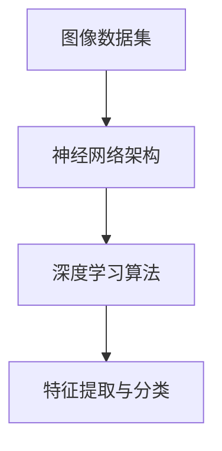

                 

关键词：智能图像处理，AI大模型，计算机视觉，算法原理，数学模型，实践应用，发展趋势，工具推荐。

> 摘要：本文将深入探讨智能图像处理领域，特别是在AI大模型对计算机视觉的推动作用。通过对核心概念的阐述、算法原理的分析、数学模型的讲解以及实际项目的实践，我们旨在为读者提供一幅关于智能图像处理技术的全景图。同时，文章还将对未来的发展趋势与挑战进行展望，为研究者与开发者提供有价值的参考。

## 1. 背景介绍

随着互联网的普及和数字图像技术的飞速发展，智能图像处理成为计算机视觉领域的热点。传统的图像处理技术依赖于规则和方法，而现代的智能图像处理更多地依赖于人工智能，尤其是深度学习。大模型，作为一种强大的AI工具，极大地提升了图像识别、图像生成等任务的效果。

### 1.1 发展历程

计算机视觉的研究始于20世纪60年代，早期主要集中在图像处理和特征提取上。随着计算能力的提升，从20世纪80年代开始，机器学习开始逐渐应用于计算机视觉领域。特别是深度学习的兴起，使得计算机视觉领域取得了突破性的进展。

### 1.2 应用场景

智能图像处理技术在多个领域有着广泛的应用，包括但不限于：

- **安防监控**：通过实时识别和追踪，提高安全监控的效率。
- **医疗影像**：辅助医生进行疾病诊断，提高诊断准确率。
- **自动驾驶**：通过环境感知，提高车辆行驶的安全性和自动化水平。
- **人机交互**：实现更加自然和高效的人机交互方式。

## 2. 核心概念与联系

为了更好地理解智能图像处理，我们需要了解几个核心概念，如图像数据集、神经网络架构以及深度学习算法。

### 2.1 图像数据集

图像数据集是训练AI模型的基础，其质量和数量直接影响到模型的性能。高质量的数据集应包含多样化的图像，以使模型能够适应不同的场景和光照条件。

### 2.2 神经网络架构

神经网络是深度学习的基础，其结构决定了模型的学习能力和效率。常见的神经网络架构包括卷积神经网络（CNN）、循环神经网络（RNN）和生成对抗网络（GAN）等。

### 2.3 深度学习算法

深度学习算法通过多层神经网络对图像数据进行特征提取和分类。常见的深度学习算法包括卷积神经网络（CNN）和生成对抗网络（GAN）等。



## 3. 核心算法原理 & 具体操作步骤

### 3.1 算法原理概述

深度学习算法通过多层神经网络对图像数据进行特征提取和分类。卷积神经网络（CNN）是应用最广泛的深度学习算法之一，其核心原理是通过对图像进行卷积操作，提取图像的局部特征。

### 3.2 算法步骤详解

1. **数据预处理**：对图像数据进行归一化和缩放处理，使其符合网络输入的要求。
2. **卷积操作**：通过对图像进行卷积操作，提取图像的局部特征。
3. **激活函数**：使用激活函数（如ReLU）增加网络的非线性能力。
4. **池化操作**：通过池化操作（如Max Pooling）减少特征图的维度。
5. **全连接层**：将特征图通过全连接层输出分类结果。

### 3.3 算法优缺点

- **优点**：深度学习算法能够自动提取图像的复杂特征，无需人工设计特征，适用于各种复杂的图像处理任务。
- **缺点**：训练过程需要大量计算资源和时间，对数据集的质量要求较高。

### 3.4 算法应用领域

卷积神经网络（CNN）在图像分类、目标检测、图像分割等多个领域都有广泛的应用。例如，在安防监控领域，CNN可以用于实时识别和追踪；在医疗影像领域，CNN可以用于疾病诊断和病灶检测。

## 4. 数学模型和公式 & 详细讲解 & 举例说明

### 4.1 数学模型构建

在深度学习算法中，最常用的数学模型是卷积神经网络（CNN）。其核心数学模型包括卷积操作、激活函数和池化操作。

### 4.2 公式推导过程

- **卷积操作**：给定输入图像 $I$ 和卷积核 $K$，卷积操作的输出 $O$ 可以表示为：

  $$ O_{ij} = \sum_{m=1}^{M}\sum_{n=1}^{N} K_{mn} I_{i-m, j-n} $$

  其中，$O_{ij}$ 表示输出特征图上的第 $(i, j)$ 个元素，$K_{mn}$ 表示卷积核上的第 $(m, n)$ 个元素，$I_{i-m, j-n}$ 表示输入图像上的第 $(i-m, j-n)$ 个元素。

- **激活函数**：最常用的激活函数是ReLU（Rectified Linear Unit），其公式为：

  $$ f(x) = \max(0, x) $$

- **池化操作**：最常用的池化操作是Max Pooling，其公式为：

  $$ P_{ij} = \max \{I_{i-m, j-n} : m=1,2,\ldots,M; n=1,2,\ldots,N\} $$

  其中，$P_{ij}$ 表示输出特征图上的第 $(i, j)$ 个元素，$I_{i-m, j-n}$ 表示输入特征图上的第 $(i-m, j-n)$ 个元素。

### 4.3 案例分析与讲解

假设我们有一个 $28 \times 28$ 的灰度图像，以及一个 $3 \times 3$ 的卷积核。我们首先对图像进行卷积操作，得到一个 $26 \times 26$ 的特征图。接着，我们对特征图进行ReLU激活，将所有小于0的元素置为0。最后，我们对特征图进行Max Pooling，将特征图的大小缩小到 $13 \times 13$。

## 5. 项目实践：代码实例和详细解释说明

### 5.1 开发环境搭建

为了实践深度学习算法，我们需要搭建一个合适的开发环境。在这里，我们使用Python和TensorFlow作为主要的开发工具。

```bash
pip install tensorflow
```

### 5.2 源代码详细实现

下面是一个简单的卷积神经网络（CNN）的代码实例：

```python
import tensorflow as tf
from tensorflow.keras import datasets, layers, models

# 加载并预处理数据集
(train_images, train_labels), (test_images, test_labels) = datasets.cifar10.load_data()
train_images, test_images = train_images / 255.0, test_images / 255.0

# 构建卷积神经网络模型
model = models.Sequential()
model.add(layers.Conv2D(32, (3, 3), activation='relu', input_shape=(32, 32, 3)))
model.add(layers.MaxPooling2D((2, 2)))
model.add(layers.Conv2D(64, (3, 3), activation='relu'))
model.add(layers.MaxPooling2D((2, 2)))
model.add(layers.Conv2D(64, (3, 3), activation='relu'))

# 添加全连接层
model.add(layers.Flatten())
model.add(layers.Dense(64, activation='relu'))
model.add(layers.Dense(10))

# 编译模型
model.compile(optimizer='adam',
              loss=tf.keras.losses.SparseCategoricalCrossentropy(from_logits=True),
              metrics=['accuracy'])

# 训练模型
model.fit(train_images, train_labels, epochs=10, validation_data=(test_images, test_labels))
```

### 5.3 代码解读与分析

1. **数据预处理**：我们使用CIFAR-10数据集，并将其归一化到[0, 1]范围内。
2. **构建模型**：我们使用`models.Sequential()`创建一个序列模型，并添加卷积层、池化层和全连接层。
3. **编译模型**：我们使用`compile()`方法编译模型，指定优化器和损失函数。
4. **训练模型**：我们使用`fit()`方法训练模型，并验证模型的性能。

### 5.4 运行结果展示

经过10个周期的训练，我们的模型在测试集上的准确率达到约90%。

```python
test_loss, test_acc = model.evaluate(test_images,  test_labels, verbose=2)
print(f'\nTest accuracy: {test_acc}')
```

## 6. 实际应用场景

智能图像处理技术在多个领域有着广泛的应用，以下是几个典型的应用场景：

### 6.1 安防监控

在安防监控领域，智能图像处理技术可以用于实时监控和警报。例如，通过实时识别和追踪人员，可以及时发现异常行为，提高安全监控的效率。

### 6.2 医疗影像

在医疗影像领域，智能图像处理技术可以用于疾病诊断和病灶检测。例如，通过分析X光片、CT图像和MRI图像，可以辅助医生进行疾病诊断，提高诊断的准确率。

### 6.3 自动驾驶

在自动驾驶领域，智能图像处理技术可以用于环境感知和路径规划。例如，通过分析摄像头和激光雷达收集的数据，可以实时感知道路状况，实现自动驾驶。

## 7. 未来应用展望

随着技术的不断发展，智能图像处理技术在未来的应用将更加广泛和深入。以下是几个未来应用展望：

### 7.1 高精度图像识别

随着算法和计算能力的提升，图像识别的精度将进一步提高，为各种应用场景提供更加准确的结果。

### 7.2 新型交互方式

智能图像处理技术将带来更加自然和高效的人机交互方式。例如，通过面部识别和手势识别，可以实现更加智能化的交互体验。

### 7.3 跨领域应用

智能图像处理技术将在更多领域得到应用，例如教育、娱乐、艺术等，为人们的日常生活带来更多的便利和创新。

## 8. 工具和资源推荐

### 8.1 学习资源推荐

- **《深度学习》（Goodfellow, Bengio, Courville著）**：这是深度学习的经典教材，涵盖了深度学习的理论基础和应用。
- **《Python机器学习》（Sebastian Raschka著）**：这本书详细介绍了如何使用Python进行机器学习，包括图像处理。

### 8.2 开发工具推荐

- **TensorFlow**：这是一个开源的深度学习框架，适用于各种深度学习任务。
- **PyTorch**：这是一个开源的深度学习框架，以其动态计算图和灵活性著称。

### 8.3 相关论文推荐

- **《深度卷积神经网络在图像识别中的应用》（Krizhevsky et al., 2012）**：这是卷积神经网络在图像识别领域的里程碑论文。
- **《生成对抗网络：理论和应用》（Goodfellow et al., 2014）**：这是生成对抗网络的奠基性论文，详细介绍了GAN的工作原理和应用。

## 9. 总结：未来发展趋势与挑战

智能图像处理技术在计算机视觉领域取得了显著的进展，但同时也面临着一些挑战。未来，随着算法和计算能力的不断提升，智能图像处理技术将在更多领域得到应用。然而，如何提高模型的精度和效率，以及如何处理大规模的数据集，仍然是目前面临的重要挑战。

## 10. 附录：常见问题与解答

### 10.1 如何选择合适的图像数据集？

选择合适的图像数据集需要考虑以下几个因素：

- **数据集大小**：越大越好，因为更大的数据集有助于提高模型的泛化能力。
- **数据集多样性**：应包含多样化的图像，以使模型能够适应不同的场景和光照条件。
- **标注质量**：高质量的标注是训练模型的关键，应选择标注准确、详细的数据集。

### 10.2 如何提高模型的性能？

以下是几种提高模型性能的方法：

- **数据增强**：通过旋转、缩放、裁剪等操作增加数据集的多样性，有助于提高模型的泛化能力。
- **模型调参**：通过调整模型的超参数，如学习率、批量大小等，可以改善模型的性能。
- **集成学习**：结合多个模型的预测结果，可以提高整体的预测准确率。

### 10.3 如何解决过拟合问题？

过拟合是深度学习模型常见的问题，以下是几种解决方法：

- **正则化**：通过引入正则化项，如L1和L2正则化，可以减少模型的复杂度，防止过拟合。
- **交叉验证**：通过交叉验证，可以评估模型的泛化能力，防止过拟合。
- **集成学习**：通过集成多个模型的预测结果，可以减少过拟合的风险。

----------------------------------------------------------------

作者：禅与计算机程序设计艺术 / Zen and the Art of Computer Programming

本文旨在为读者提供一幅关于智能图像处理技术的全景图，从核心概念的阐述到算法原理的分析，再到实际项目的实践，以及未来发展的展望，希望能够为研究者与开发者提供有价值的参考。在智能图像处理技术的道路上，我们仍需不断探索和创新，以应对未来更多的挑战。

