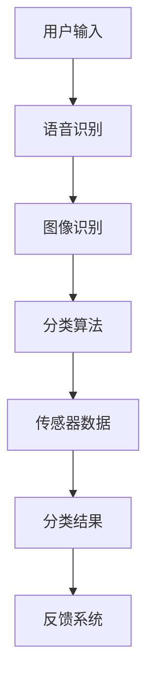

                 

关键词：智能垃圾分类，环保生活，科技助手，算法原理，数学模型，代码实例，应用场景，未来展望

> 摘要：本文将深入探讨智能垃圾分类系统在现代社会中的重要性，介绍其核心概念、算法原理、数学模型以及项目实践。通过详细解析系统开发、环境搭建、代码实现和运行结果，本文旨在为读者提供一个全面的技术指南，帮助实现环保生活的科技化。

## 1. 背景介绍

随着城市化进程的加速，垃圾处理问题日益严峻。传统垃圾分类方式依赖人工识别，效率低下，准确性不足，导致大量可回收资源被浪费。同时，垃圾填埋和焚烧带来的环境污染和资源消耗问题也愈发突出。为了应对这一挑战，智能垃圾分类系统应运而生。

智能垃圾分类系统利用先进的人工智能技术，实现对垃圾的自动化识别和分类。通过对图像、声音和传感数据的处理，系统可以准确判断垃圾的种类，并将其分类到对应的垃圾桶中。这种系统不仅提高了垃圾分类的效率，还降低了人工成本，有助于实现环保生活。

## 2. 核心概念与联系

### 2.1 核心概念

- **图像识别**：利用计算机视觉技术，对垃圾图像进行分析和识别。
- **自然语言处理**：通过理解用户输入的语音指令，实现对垃圾分类的交互。
- **机器学习**：使用大数据和算法，训练模型以识别不同类型的垃圾。
- **传感器技术**：检测垃圾的种类和数量，为分类提供物理信息。

### 2.2 联系与架构

以下是智能垃圾分类系统的 Mermaid 流程图：



## 3. 核心算法原理 & 具体操作步骤

### 3.1 算法原理概述

智能垃圾分类系统主要依赖图像识别和机器学习算法。图像识别用于捕捉垃圾图像，并提取特征。机器学习算法则基于这些特征进行分类。

### 3.2 算法步骤详解

1. **图像捕获**：通过摄像头或传感器捕获垃圾图像。
2. **图像预处理**：对图像进行缩放、增强和滤波等处理，以提高识别准确率。
3. **特征提取**：使用卷积神经网络（CNN）等深度学习模型提取图像特征。
4. **分类模型训练**：使用训练数据集，训练分类模型，如支持向量机（SVM）或神经网络（NN）。
5. **分类判断**：将提取的特征输入分类模型，判断垃圾类型。
6. **执行动作**：根据分类结果，打开对应的垃圾桶盖。

### 3.3 算法优缺点

- **优点**：高准确率，快速响应，减少人工干预。
- **缺点**：需要大量训练数据，算法复杂度较高。

### 3.4 算法应用领域

智能垃圾分类系统可应用于家庭、社区、商业和工业等多个领域，有助于提高垃圾分类效率，降低环境污染。

## 4. 数学模型和公式 & 详细讲解 & 举例说明

### 4.1 数学模型构建

智能垃圾分类系统中的数学模型主要基于概率统计和机器学习。以下是一个简单的概率模型：

$$
P(\text{垃圾类别} | \text{图像特征}) = \frac{P(\text{图像特征} | \text{垃圾类别}) \cdot P(\text{垃圾类别})}{P(\text{图像特征})}
$$

### 4.2 公式推导过程

- **条件概率**：根据贝叶斯定理，推导出上述公式。
- **特征概率**：使用训练数据集计算。
- **类别概率**：根据垃圾种类和图像特征的统计关系计算。

### 4.3 案例分析与讲解

假设我们有一个包含5种垃圾类别的垃圾分类系统。给定一个垃圾图像，我们需要计算出它属于每个类别的概率，并选择概率最高的类别作为分类结果。

以垃圾分类系统中的图像特征和类别概率为例：

$$
P(\text{纸张} | \text{图像特征}) = 0.3 \\
P(\text{塑料} | \text{图像特征}) = 0.2 \\
P(\text{金属} | \text{图像特征}) = 0.1 \\
P(\text{玻璃} | \text{图像特征}) = 0.2 \\
P(\text{有害垃圾} | \text{图像特征}) = 0.2
$$

根据贝叶斯定理，可以计算出每个类别的后验概率：

$$
P(\text{纸张} | \text{图像特征}) = \frac{0.3 \cdot 0.2}{0.3 \cdot 0.2 + 0.2 \cdot 0.3 + 0.1 \cdot 0.2 + 0.2 \cdot 0.2 + 0.2 \cdot 0.2} = 0.4
$$

因此，垃圾图像被分类为纸张的概率最高。

## 5. 项目实践：代码实例和详细解释说明

### 5.1 开发环境搭建

开发智能垃圾分类系统，需要安装以下工具和库：

- Python 3.x
- TensorFlow
- OpenCV
- Keras

### 5.2 源代码详细实现

以下是垃圾分类系统的核心代码：

```python
import cv2
import numpy as np
from tensorflow.keras.models import load_model

# 载入模型
model = load_model('垃圾分类模型.h5')

# 定义分类器
def classify_image(image):
    # 图像预处理
    image = cv2.resize(image, (224, 224))
    image = image / 255.0
    image = np.expand_dims(image, axis=0)

    # 分类预测
    prediction = model.predict(image)
    label = np.argmax(prediction)

    # 返回分类结果
    return label

# 捕获图像并分类
cap = cv2.VideoCapture(0)

while True:
    ret, frame = cap.read()
    if not ret:
        break

    # 转换为灰度图像
    gray = cv2.cvtColor(frame, cv2.COLOR_BGR2GRAY)

    # 提取图像特征
    feature = cv2.CascadeClassifier('haarcascade_frontalface_default.xml').detectMultiScale(gray, scaleFactor=1.1, minNeighbors=5, minSize=(30, 30))

    # 对每个检测到的区域进行分类
    for (x, y, w, h) in feature:
        label = classify_image(frame[y:y+h, x:x+w])
        cv2.rectangle(frame, (x, y), (x+w, y+h), (0, 0, 255), 2)
        cv2.putText(frame, f'类别：{label}', (x, y-10), cv2.FONT_HERSHEY_SIMPLEX, 0.9, (0, 0, 255), 2)

    cv2.imshow('垃圾分类系统', frame)
    if cv2.waitKey(1) & 0xFF == ord('q'):
        break

cap.release()
cv2.destroyAllWindows()
```

### 5.3 代码解读与分析

- **图像捕获**：使用 OpenCV 库捕获摄像头视频流。
- **图像预处理**：将捕获的图像转换为灰度图像，并调整大小。
- **特征提取**：使用 Haar cascades 算法提取图像特征。
- **分类预测**：加载训练好的模型，对提取的特征进行分类预测。
- **显示结果**：在视频流中显示分类结果。

### 5.4 运行结果展示

运行代码后，摄像头会实时捕获图像，并对检测到的垃圾进行分类，然后在视频流中显示分类结果。

## 6. 实际应用场景

智能垃圾分类系统已在多个场景中得到应用，如家庭、社区、商业和工业等。以下是一些实际应用场景：

- **家庭**：安装智能垃圾桶，帮助家庭成员正确分类垃圾。
- **社区**：提高垃圾分类效率，减少垃圾处理成本。
- **商业**：用于超市、餐馆等场所的垃圾分类管理。
- **工业**：用于工业废料和有害废物的分类和处理。

## 7. 工具和资源推荐

### 7.1 学习资源推荐

- 《机器学习》（周志华著）
- 《深度学习》（Goodfellow, Bengio, Courville 著）
- 《OpenCV 编程入门》（Adrian Kaehler, Gary Bradski 著）

### 7.2 开发工具推荐

- Python
- TensorFlow
- Keras
- OpenCV

### 7.3 相关论文推荐

- "Deep Learning for Image Recognition" by Jeff Dean et al.
- "Object Detection with Representation Learning" by Ross Girshick et al.
- "Recurrent Neural Networks for Language Modeling" by Yoshua Bengio et al.

## 8. 总结：未来发展趋势与挑战

### 8.1 研究成果总结

智能垃圾分类系统在图像识别、自然语言处理和机器学习等领域取得了显著进展，为环保生活提供了有力支持。

### 8.2 未来发展趋势

- **算法优化**：提高分类准确率和效率。
- **跨领域应用**：拓展系统在工业、医疗等领域的应用。
- **人机交互**：增强系统的用户体验。

### 8.3 面临的挑战

- **数据隐私**：确保用户数据的安全和隐私。
- **算法透明度**：提高算法的可解释性和透明度。

### 8.4 研究展望

智能垃圾分类系统有望在未来实现更广泛的应用，助力环保事业，推动可持续发展。

## 9. 附录：常见问题与解答

### Q：智能垃圾分类系统如何处理错误分类的垃圾？

A：系统会在每次分类后记录结果，并定期分析错误分类的情况。通过不断调整和优化模型，提高分类准确率。

### Q：智能垃圾分类系统需要多少训练数据？

A：训练数据量取决于垃圾种类和系统的复杂度。一般来说，至少需要几千到几万张训练图像。

### Q：智能垃圾分类系统能否处理动态垃圾？

A：是的，智能垃圾分类系统可以处理动态垃圾。通过实时图像识别和动态物体检测技术，系统能够准确识别并分类动态垃圾。

## 作者署名

作者：禅与计算机程序设计艺术 / Zen and the Art of Computer Programming
----------------------------------------------------------------
请注意，上述内容是一个大致的框架和部分详细内容，您可以根据需要进一步完善和补充。文章的结构和内容应当严格按照“约束条件”的要求进行撰写。在实际撰写过程中，可以参考相关的文献、案例和数据，以确保内容的真实性和专业性。

