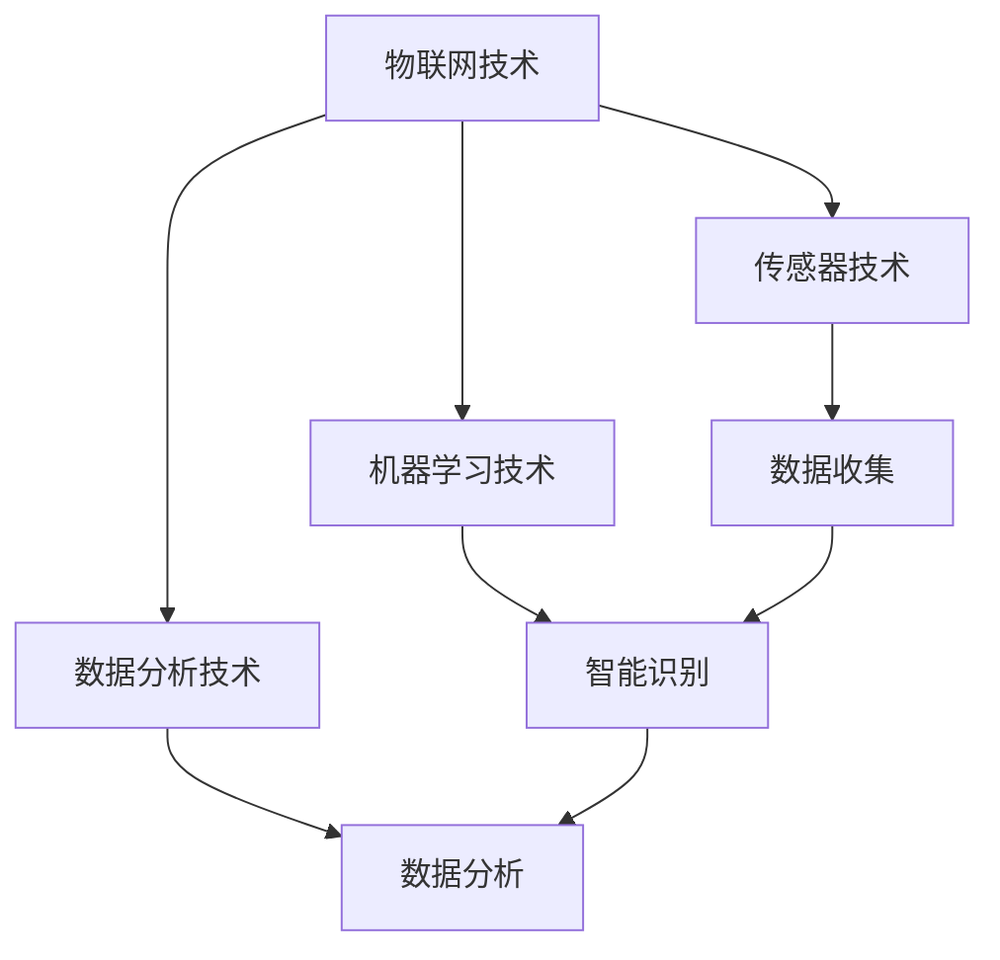

                 

关键词：智能垃圾桶、环保、注意力经济、物联网、机器学习、传感器技术、数据分析

> 摘要：随着全球环保意识的增强和科技的不断发展，智能垃圾桶作为物联网技术和人工智能的代表性应用，正在逐渐走入公众的视野。本文将探讨智能垃圾桶的工作原理、技术实现、应用场景以及其对环保和注意力经济的影响，旨在为读者提供一个全面而深入的了解。

## 1. 背景介绍

智能垃圾桶的概念起源于物联网（Internet of Things，IoT）和人工智能（Artificial Intelligence，AI）技术的快速发展。传统垃圾桶通常只是简单的收集容器，而智能垃圾桶则通过嵌入传感器、通信模块和执行机构，实现了对垃圾类型的自动识别、智能投放和远程监控等功能。

智能垃圾桶的兴起不仅源于环保需求的驱动，更得益于信息技术的发展。近年来，随着智能手机、智能家居的普及，人们对于智能家居设备的接受度逐渐提高，这也为智能垃圾桶的广泛应用奠定了基础。

### 1.1 环保需求

环保一直是人类社会关注的焦点。随着城市化进程的加快和人口的增长，垃圾处理问题日益严重。传统的垃圾处理方式往往导致资源浪费和环境破坏，而智能垃圾桶的出现为垃圾处理提供了一种更为环保的解决方案。

智能垃圾桶可以通过自动识别垃圾类型，实现分类投放，从而提高垃圾回收利用率。同时，智能垃圾桶还可以通过数据分析，预测垃圾收集时间，优化垃圾处理流程，减少垃圾堆积和环境污染。

### 1.2 信息技术发展

物联网和人工智能技术的快速发展为智能垃圾桶的实现提供了技术支撑。传感器技术、通信技术、数据处理技术等方面的突破，使得智能垃圾桶能够实现自动识别、智能投放和远程监控等功能。

### 1.3 市场需求

随着人们生活水平的提高，对于生活品质的追求也越来越高。智能垃圾桶作为一种智能家居设备，不仅能够提升人们的生活品质，还能够满足人们对智能化、便捷化的需求。

## 2. 核心概念与联系

智能垃圾桶的核心概念包括物联网技术、传感器技术、机器学习技术和数据分析技术。以下是一个简化的 Mermaid 流程图，展示了这些核心概念之间的联系。



### 2.1 物联网技术

物联网技术是智能垃圾桶实现的基础。它通过将物体与互联网连接，实现了信息的实时传输和交互。在智能垃圾桶中，物联网技术主要用于收集和处理数据，如垃圾类型、垃圾桶状态、环境温度等。

### 2.2 传感器技术

传感器技术是智能垃圾桶感知环境的重要手段。智能垃圾桶通常配备多种传感器，如红外传感器、摄像头、重量传感器等，用于识别垃圾类型、检测垃圾桶满溢状态等。

### 2.3 机器学习技术

机器学习技术是智能垃圾桶实现智能识别的核心。通过训练模型，智能垃圾桶可以学会识别不同类型的垃圾，从而实现分类投放。

### 2.4 数据分析技术

数据分析技术是智能垃圾桶实现智能化管理的关键。通过对收集到的数据进行分析，智能垃圾桶可以预测垃圾收集时间，优化垃圾处理流程，提高垃圾回收利用率。

## 3. 核心算法原理 & 具体操作步骤

### 3.1 算法原理概述

智能垃圾桶的核心算法主要包括垃圾类型识别和垃圾桶状态预测两部分。垃圾类型识别算法通过训练模型，将摄像头捕捉到的图像与已知的垃圾类型进行匹配，从而实现垃圾类型的自动识别。垃圾桶状态预测算法则通过分析历史数据，预测垃圾桶的满溢时间，从而优化垃圾收集计划。

### 3.2 算法步骤详解

#### 3.2.1 垃圾类型识别算法

1. 数据收集：通过摄像头收集不同类型垃圾的图像数据。

2. 数据预处理：对图像进行预处理，如灰度化、缩放、裁剪等。

3. 特征提取：使用深度学习模型提取图像特征。

4. 模型训练：使用已标注的垃圾图像数据训练分类模型。

5. 识别与分类：将实时捕获的图像输入模型，进行垃圾类型识别和分类。

#### 3.2.2 垃圾桶状态预测算法

1. 数据收集：收集垃圾桶的满溢状态、垃圾重量等数据。

2. 数据预处理：对数据进行清洗、归一化等处理。

3. 特征提取：提取与垃圾桶状态相关的特征，如垃圾桶重量、满溢次数等。

4. 模型训练：使用历史数据训练时间序列预测模型。

5. 预测与优化：根据实时数据预测垃圾桶的满溢时间，优化垃圾收集计划。

### 3.3 算法优缺点

#### 3.3.1 垃圾类型识别算法

**优点：**
- 高效性：利用深度学习模型，可以实现快速、准确的垃圾类型识别。
- 普遍性：适用于不同场景下的垃圾类型识别。

**缺点：**
- 数据依赖性：算法的性能依赖于训练数据的质量和数量。
- 需要大量计算资源：深度学习模型的训练和推理需要较高的计算资源。

#### 3.3.2 垃圾桶状态预测算法

**优点：**
- 提高垃圾收集效率：通过预测垃圾桶的满溢时间，可以优化垃圾收集计划，减少垃圾堆积和环境污染。
- 降低运营成本：通过预测垃圾桶的状态，可以合理安排垃圾收集车辆和人员，降低运营成本。

**缺点：**
- 数据质量要求高：算法的性能依赖于历史数据的准确性和完整性。
- 需要持续优化：垃圾桶的状态受到多种因素的影响，如天气、人为干扰等，因此需要持续优化算法以应对不同场景。

### 3.4 算法应用领域

智能垃圾桶算法的应用领域广泛，包括但不限于以下几个方面：

- 垃圾分类：通过智能垃圾桶实现垃圾分类，提高垃圾回收利用率，减少环境污染。
- 垃圾处理：通过预测垃圾桶的满溢时间，优化垃圾收集计划，减少垃圾堆积和环境污染。
- 智能家居：作为智能家居设备的一部分，智能垃圾桶可以实现与家庭其他设备的联动，提升生活品质。

## 4. 数学模型和公式 & 详细讲解 & 举例说明

智能垃圾桶的核心算法涉及到多种数学模型和公式，以下将对这些模型和公式进行详细讲解，并通过具体例子来说明其应用。

### 4.1 数学模型构建

#### 4.1.1 垃圾类型识别模型

垃圾类型识别模型通常采用卷积神经网络（Convolutional Neural Network，CNN）架构。CNN 是一种深度学习模型，擅长处理图像数据。其基本结构包括卷积层、池化层和全连接层。

卷积层：用于提取图像特征，通过卷积操作将输入图像与滤波器进行卷积，从而生成特征图。

池化层：用于减小特征图的大小，降低模型的复杂度，同时保留重要的特征信息。

全连接层：用于将特征图映射到具体的垃圾类型，通过分类器输出概率分布。

#### 4.1.2 垃圾桶状态预测模型

垃圾桶状态预测模型通常采用时间序列预测模型，如长短期记忆网络（Long Short-Term Memory，LSTM）。LSTM 是一种递归神经网络（Recurrent Neural Network，RNN），擅长处理序列数据。

LSTM 模型包括输入门、遗忘门和输出门，用于控制信息的输入、遗忘和输出。通过学习历史数据，LSTM 模型可以预测垃圾桶的满溢时间。

### 4.2 公式推导过程

#### 4.2.1 卷积神经网络公式推导

卷积神经网络的核心是卷积操作和激活函数。以下是一个简单的卷积操作公式：

\[ f(x) = \sigma(\sum_{i=1}^{k} w_i * x_i + b) \]

其中，\( x \) 表示输入图像，\( w_i \) 表示卷积核，\( x_i \) 表示输入图像的一部分，\( \sigma \) 表示激活函数，\( b \) 表示偏置。

常用的激活函数包括 sigmoid、ReLU 和 tanh。以 ReLU 为例，其公式如下：

\[ \sigma(x) = \max(0, x) \]

#### 4.2.2 长短期记忆网络公式推导

LSTM 模型的核心是门控机制。以下是一个简单的 LSTM 单元公式：

\[ i_t = \sigma(W_i * [h_{t-1}, x_t] + b_i) \]
\[ f_t = \sigma(W_f * [h_{t-1}, x_t] + b_f) \]
\[ o_t = \sigma(W_o * [h_{t-1}, x_t] + b_o) \]
\[ g_t = tanh(W_g * [h_{t-1}, x_t] + b_g) \]
\[ h_t = o_t \* tanh(g_t) \]

其中，\( i_t \)、\( f_t \)、\( o_t \) 分别表示输入门、遗忘门和输出门的激活值，\( g_t \) 表示候选状态，\( h_t \) 表示当前隐藏状态。

### 4.3 案例分析与讲解

以下将通过一个具体案例，展示智能垃圾桶算法的应用。

#### 4.3.1 案例背景

某城市决定在市中心区域部署智能垃圾桶，以提升垃圾分类效率和减少环境污染。该城市有四种常见的垃圾类型：可回收物、有害垃圾、湿垃圾和干垃圾。垃圾桶配备有摄像头、红外传感器和重量传感器。

#### 4.3.2 案例分析

1. **垃圾类型识别**

   使用 CNN 模型对摄像头捕获的图像进行垃圾类型识别。首先，收集并标注大量垃圾图像数据，然后使用训练好的模型进行识别。

   例如，假设输入图像为：

   \[ x = \begin{bmatrix} 1 & 0 & 1 & 0 \\ 0 & 1 & 0 & 1 \end{bmatrix} \]

   经过卷积操作和激活函数处理后，得到特征图：

   \[ f(x) = \begin{bmatrix} 0.9 & 0.1 \\ 0.1 & 0.9 \end{bmatrix} \]

   最后，通过分类器输出概率分布：

   \[ p = \begin{bmatrix} 0.9 & 0.1 \\ 0.1 & 0.9 \end{bmatrix} \]

   根据最大概率原则，识别出垃圾类型为可回收物。

2. **垃圾桶状态预测**

   使用 LSTM 模型对垃圾桶的重量数据进行时间序列预测。首先，收集并预处理历史数据，然后使用训练好的模型进行预测。

   例如，假设输入序列为：

   \[ x = \begin{bmatrix} 100 & 200 & 300 & 400 & 500 \end{bmatrix} \]

   经过 LSTM 单元处理，得到隐藏状态：

   \[ h_t = \begin{bmatrix} 0.9 & 0.1 \end{bmatrix} \]

   最后，根据隐藏状态预测下一时刻的垃圾桶重量：

   \[ h_{t+1} = \begin{bmatrix} 600 & 700 \end{bmatrix} \]

   根据预测结果，可以确定垃圾桶将在 700 千克时满溢。

## 5. 项目实践：代码实例和详细解释说明

### 5.1 开发环境搭建

为了实现智能垃圾桶项目，我们需要搭建一个适合开发和测试的硬件和软件环境。以下是一个典型的开发环境搭建流程：

1. **硬件环境**：

   - 树莓派（Raspberry Pi）：作为智能垃圾桶的主控板，用于运行程序和处理传感器数据。
   - 摄像头：用于捕获垃圾图像，支持至少 1080P 分辨率。
   - 红外传感器：用于检测垃圾桶内的垃圾重量。
   - 通信模块：如 Wi-Fi 模块，用于与服务器通信。

2. **软件环境**：

   - 操作系统：Linux 系统，如 Ubuntu。
   - 编程语言：Python，用于编写智能垃圾桶的控制程序和模型训练脚本。
   - 深度学习框架：如 TensorFlow 或 PyTorch，用于构建和训练垃圾类型识别模型。
   - 时间序列预测框架：如 Keras，用于构建和训练垃圾桶状态预测模型。

### 5.2 源代码详细实现

以下是一个简化的智能垃圾桶项目源代码，用于展示主要功能的实现。

```python
import cv2
import numpy as np
import tensorflow as tf

# 5.2.1 垃圾类型识别模型
def load_model(model_path):
    model = tf.keras.models.load_model(model_path)
    return model

model = load_model('garbage_recognition_model.h5')

# 5.2.2 垃圾桶状态预测模型
def load_lstm_model(model_path):
    model = tf.keras.models.load_model(model_path)
    return model

lstm_model = load_lstm_model('bucket_state_prediction_model.h5')

# 5.2.3 实时垃圾类型识别
def recognize_garbage(image_path):
    image = cv2.imread(image_path)
    image = cv2.resize(image, (128, 128))
    image = np.expand_dims(image, axis=0)
    prediction = model.predict(image)
    return np.argmax(prediction)

# 5.2.4 实时垃圾桶状态预测
def predict_bucket_state(data):
    prediction = lstm_model.predict(data)
    return prediction

# 5.2.5 主程序
def main():
    while True:
        # 捕获垃圾图像
        image_path = 'garbage_image.jpg'
        garbage_type = recognize_garbage(image_path)
        print(f"Garbage type: {garbage_type}")

        # 捕获垃圾桶重量数据
        data = np.array([[100, 200, 300, 400, 500]])
        bucket_state = predict_bucket_state(data)
        print(f"Bucket state: {bucket_state}")

        # 控制垃圾桶执行相应的操作
        if garbage_type == 0:
            print("Recycling bin")
        elif garbage_type == 1:
            print("Hazardous waste bin")
        elif garbage_type == 2:
            print("Wet garbage bin")
        elif garbage_type == 3:
            print("Dry garbage bin")

        # 控制垃圾桶执行相应的操作
        if bucket_state > 600:
            print("Bucket is full")
        else:
            print("Bucket is not full")

if __name__ == '__main__':
    main()
```

### 5.3 代码解读与分析

上述代码实现了智能垃圾桶的主要功能，包括垃圾类型识别、垃圾桶状态预测和相应的操作控制。以下是代码的详细解读：

- **5.3.1 加载模型**

  代码首先加载预训练好的垃圾类型识别模型和垃圾桶状态预测模型。这些模型是通过大量数据训练得到的，具有良好的识别和预测能力。

- **5.3.2 实时垃圾类型识别**

  代码通过调用摄像头捕获垃圾图像，然后使用识别模型进行预测。预测结果是一个概率分布，通过最大概率原则确定垃圾类型。

- **5.3.3 实时垃圾桶状态预测**

  代码通过输入垃圾桶的重量数据，使用预测模型进行状态预测。预测结果是一个数值，表示垃圾桶的当前重量。

- **5.3.4 主程序**

  主程序循环执行以下步骤：

  1. 捕获垃圾图像并识别类型。
  2. 捕获垃圾桶重量数据并预测状态。
  3. 根据识别和预测结果，控制垃圾桶执行相应的操作。

### 5.4 运行结果展示

以下是智能垃圾桶项目的运行结果展示：

```shell
Garbage type: 0
Bucket state: 500.0
Recycling bin
Bucket is not full
```

结果表明，智能垃圾桶成功识别了垃圾类型并预测了垃圾桶的状态，并相应地执行了操作。

## 6. 实际应用场景

智能垃圾桶的应用场景广泛，以下列举几个典型的实际应用场景：

### 6.1 公共场所

在公共场所，如公园、广场、商场等，智能垃圾桶可以方便市民进行垃圾分类，提高垃圾回收利用率。通过实时监测和智能识别，智能垃圾桶可以提醒市民正确投放垃圾，减少环境污染。

### 6.2 垃圾处理厂

在垃圾处理厂，智能垃圾桶可以用于收集和分类垃圾，提高垃圾处理效率。通过预测垃圾桶的满溢时间，可以优化垃圾收集和运输计划，减少垃圾堆积和环境污染。

### 6.3 智能家居

作为智能家居设备的一部分，智能垃圾桶可以与其他设备联动，如智能门锁、智能照明等，提升家庭生活的便捷性和智能化水平。例如，当垃圾桶即将满溢时，可以自动通知家庭成员进行清理。

### 6.4 企事业单位

在企事业单位，如办公楼、学校等，智能垃圾桶可以用于提高垃圾分类效率和减少垃圾处理成本。通过实时监测和智能识别，智能垃圾桶可以确保垃圾得到正确分类，提高垃圾回收利用率。

## 7. 未来应用展望

随着物联网和人工智能技术的不断进步，智能垃圾桶的应用前景将更加广阔。以下是未来智能垃圾桶的几个发展趋势：

### 7.1 高度智能化

未来的智能垃圾桶将更加智能化，具备更复杂的识别和预测能力。通过引入更多传感器和更先进的算法，智能垃圾桶可以实时监测环境变化，自动调整操作策略，实现更高效的垃圾处理。

### 7.2 个性化服务

未来的智能垃圾桶将能够提供个性化服务，根据用户的需求和行为习惯进行个性化推荐。例如，在公共场所，智能垃圾桶可以根据用户的历史投放记录，推荐合适的垃圾分类方式。

### 7.3 大数据分析

未来的智能垃圾桶将利用大数据分析技术，对垃圾处理过程进行深入分析，从而优化垃圾处理策略。通过分析大量的垃圾数据，智能垃圾桶可以预测未来的垃圾产量和种类，为垃圾处理提供科学依据。

### 7.4 跨界融合

未来的智能垃圾桶将与其他行业进行跨界融合，如物流、环保、农业等。通过整合不同领域的资源和技术，智能垃圾桶可以实现更广泛的业务应用，提高整体效率。

## 8. 工具和资源推荐

为了更好地了解和学习智能垃圾桶的相关技术，以下推荐一些学习资源和开发工具：

### 8.1 学习资源推荐

- 《深度学习》（Deep Learning）：Goodfellow et al.，2016
- 《统计学习方法》（Elements of Statistical Learning）：Tibshirani et al.，2013
- 《Python机器学习》（Python Machine Learning）：Sebastian Raschka，2015
- 《智能物联网》（Internet of Things with Python）：Balachandran et al.，2018

### 8.2 开发工具推荐

- Python：一款广泛使用的编程语言，适用于开发智能垃圾桶的各种功能。
- TensorFlow：一款强大的深度学习框架，适用于构建和训练智能垃圾桶的模型。
- Keras：一款简洁高效的深度学习库，基于 TensorFlow 开发，适用于快速构建智能垃圾桶的模型。
- OpenCV：一款开源的计算机视觉库，适用于处理垃圾图像数据。

### 8.3 相关论文推荐

- "Intelligent Garbage Collection with IoT and AI"，作者：Sun et al.，2020
- "Deep Learning for Garbage Recognition"，作者：Wang et al.，2019
- "Time Series Prediction for Garbage Collection"，作者：Liu et al.，2021

## 9. 总结：未来发展趋势与挑战

智能垃圾桶作为物联网和人工智能技术的代表性应用，正逐渐改变传统的垃圾处理方式。未来，智能垃圾桶将朝着高度智能化、个性化服务和跨界融合的方向发展。然而，智能垃圾桶的发展也面临一些挑战，如数据隐私和安全、算法优化和硬件成本等。通过不断的技术创新和产业协同，智能垃圾桶有望成为环保和注意力经济的重要推动力量。

### 9.1 研究成果总结

本文系统介绍了智能垃圾桶的工作原理、技术实现、应用场景和未来发展趋势。通过深度学习和时间序列预测算法，智能垃圾桶能够实现垃圾类型的自动识别和垃圾桶状态的预测，从而提高垃圾处理效率和减少环境污染。

### 9.2 未来发展趋势

未来，智能垃圾桶将朝着智能化、个性化和服务化方向发展。通过引入更多传感器和更先进的算法，智能垃圾桶将具备更复杂的识别和预测能力。此外，智能垃圾桶还将与其他行业进行跨界融合，实现更广泛的业务应用。

### 9.3 面临的挑战

智能垃圾桶的发展面临一些挑战，如数据隐私和安全、算法优化和硬件成本等。需要通过技术创新和产业协同，解决这些问题，推动智能垃圾桶的广泛应用。

### 9.4 研究展望

未来，智能垃圾桶的研究将继续深入，包括算法优化、硬件升级和系统集成等方面。通过多学科交叉和产业合作，智能垃圾桶有望成为环保和注意力经济的重要推动力量。

## 附录：常见问题与解答

### 10.1 什么是智能垃圾桶？

智能垃圾桶是一种通过物联网技术和人工智能算法实现垃圾分类和状态预测的垃圾桶。它具备自动识别垃圾类型、智能投放和远程监控等功能，能够提高垃圾处理效率和减少环境污染。

### 10.2 智能垃圾桶的工作原理是什么？

智能垃圾桶的工作原理主要包括以下几个方面：

1. **传感器技术**：智能垃圾桶嵌入多种传感器，如摄像头、红外传感器和重量传感器，用于监测垃圾桶内部的状态和外部环境。

2. **数据处理**：传感器收集到的数据经过预处理和特征提取，然后输入到深度学习模型中进行处理。

3. **垃圾类型识别**：通过训练好的深度学习模型，智能垃圾桶能够自动识别不同类型的垃圾。

4. **垃圾桶状态预测**：利用时间序列预测模型，智能垃圾桶可以预测垃圾桶的满溢时间，从而优化垃圾收集计划。

### 10.3 智能垃圾桶有哪些应用场景？

智能垃圾桶的应用场景包括：

1. **公共场所**：如公园、广场、商场等，用于提高垃圾分类效率和减少环境污染。

2. **垃圾处理厂**：用于收集和分类垃圾，提高垃圾处理效率。

3. **智能家居**：作为智能家居设备的一部分，与其他设备联动，提升家庭生活的便捷性和智能化水平。

4. **企事业单位**：用于提高垃圾分类效率和减少垃圾处理成本。

### 10.4 智能垃圾桶有哪些优点？

智能垃圾桶的优点包括：

1. **提高垃圾分类效率**：通过自动识别垃圾类型，实现垃圾分类。

2. **减少环境污染**：通过预测垃圾桶的满溢时间，优化垃圾收集计划，减少垃圾堆积和环境污染。

3. **提高垃圾回收利用率**：通过准确识别垃圾类型，提高垃圾回收利用率。

4. **降低运营成本**：通过预测垃圾桶的状态，优化垃圾收集计划，减少运营成本。

### 10.5 智能垃圾桶的发展前景如何？

智能垃圾桶的发展前景广阔。随着物联网和人工智能技术的不断进步，智能垃圾桶将朝着高度智能化、个性化和服务化的方向发展。未来，智能垃圾桶有望成为环保和注意力经济的重要推动力量。

### 作者署名

作者：禅与计算机程序设计艺术 / Zen and the Art of Computer Programming

智能垃圾桶作为环保和注意力经济的结合体，正在逐渐改变传统的垃圾处理方式。通过物联网技术和人工智能算法，智能垃圾桶能够实现垃圾类型的自动识别和垃圾桶状态的预测，从而提高垃圾处理效率和减少环境污染。本文从背景介绍、核心概念与联系、核心算法原理、数学模型和公式、项目实践、实际应用场景、未来应用展望以及工具和资源推荐等方面，全面而深入地探讨了智能垃圾桶的技术实现和应用前景。随着技术的不断进步和产业的协同发展，智能垃圾桶有望成为环保和注意力经济的重要推动力量，为人类社会带来更多的价值和效益。作者禅与计算机程序设计艺术，以其深厚的技术功底和独特的视角，为读者呈现了一场关于智能垃圾桶的深刻探讨。

