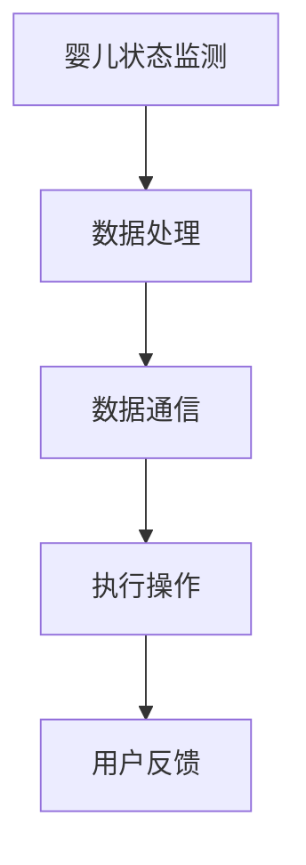

                 

关键词：智能婴儿摇篮，科技辅助育儿，AI技术，物联网，儿童健康监测，安全与便利

> 摘要：随着科技的进步，人工智能与物联网技术在育儿领域的应用日益广泛。本文将探讨智能婴儿摇篮创业的背景、核心概念、算法原理、项目实践以及未来发展趋势。通过分析智能婴儿摇篮如何利用科技手段提升育儿质量，我们旨在为创业者提供有价值的参考。

## 1. 背景介绍

### 1.1 智能婴儿摇篮的兴起

随着生活水平的提高，年轻父母对于育儿方式的需求发生了显著变化。传统的育儿方式往往依赖于家长的直接监护，而现代家庭中，许多父母由于工作繁忙，很难时刻关注孩子的状况。因此，智能婴儿摇篮作为一种新型的育儿工具，应运而生。

智能婴儿摇篮集成了多种传感器和AI技术，可以实时监测婴儿的睡眠状态、体温、心率等生命体征，并通过物联网将数据传输到家长的移动设备上。这不仅提高了育儿的安全性和便利性，也为家长提供了更加智能化的育儿体验。

### 1.2 市场潜力

根据市场研究，全球智能婴儿摇篮市场在未来几年将呈现高速增长。随着消费者对科技产品的接受度提高，以及年轻家庭对智能育儿解决方案的强烈需求，智能婴儿摇篮市场具有巨大的潜力。

### 1.3 创业机会

在智能婴儿摇篮市场中，创业者可以通过以下几种方式寻求商业机会：

1. **技术创新**：研发更先进的智能传感器和AI算法，提高产品的性能和用户体验。
2. **市场细分**：针对不同年龄段和需求的消费者，推出定制化的智能婴儿摇篮产品。
3. **生态系统建设**：打造一个涵盖硬件、软件、数据分析等环节的完整生态系统，提高用户粘性。

## 2. 核心概念与联系

### 2.1 智能婴儿摇篮的基本架构

智能婴儿摇篮主要由以下几个部分组成：

- **传感器模块**：包括温度传感器、心率传感器、运动传感器等，用于实时监测婴儿的状态。
- **数据处理模块**：通过AI算法对传感器数据进行处理，分析婴儿的睡眠状态、体温变化等。
- **通信模块**：通过Wi-Fi或蓝牙与家长的移动设备进行通信，实时传输数据。
- **执行模块**：根据数据处理结果，执行相应的操作，如调节温度、音乐播放等。

### 2.2 Mermaid 流程图



### 2.3 核心概念原理

- **AI算法**：通过机器学习和深度学习技术，对婴儿的睡眠状态、体温等数据进行实时分析和预测。
- **物联网**：实现智能婴儿摇篮与家长设备之间的实时数据传输和交互。
- **传感器技术**：高精度传感器用于监测婴儿的生理参数，确保数据的准确性。

## 3. 核心算法原理 & 具体操作步骤

### 3.1 算法原理概述

智能婴儿摇篮的核心算法主要包括以下几个方面：

1. **睡眠状态识别**：通过分析婴儿的心率、体温等数据，识别婴儿的睡眠状态。
2. **异常行为检测**：利用机器学习算法，检测婴儿的异常行为，如突发的高烧、剧烈的哭闹等。
3. **智能调控**：根据监测结果，智能调节摇篮的温度、音乐等参数，为婴儿提供舒适的睡眠环境。

### 3.2 算法步骤详解

1. **数据采集**：通过传感器模块，实时采集婴儿的生理参数。
2. **数据预处理**：对采集到的数据进行滤波、归一化等预处理操作，提高数据的准确性。
3. **特征提取**：利用深度学习算法，从预处理后的数据中提取关键特征。
4. **行为识别**：通过机器学习模型，对提取的特征进行分类，识别婴儿的睡眠状态和异常行为。
5. **结果输出**：根据识别结果，执行相应的操作，如调节温度、发送警报等。

### 3.3 算法优缺点

- **优点**：实时监测婴儿状态，提高育儿的安全性和便利性；智能调控，为婴儿提供舒适的睡眠环境。
- **缺点**：算法的准确性和稳定性受数据质量的影响；硬件成本较高，对普通家庭来说可能不够经济实惠。

### 3.4 算法应用领域

智能婴儿摇篮算法的应用领域广泛，包括但不限于：

- **家庭育儿**：为家长提供实时的婴儿状态监测和智能调控。
- **医疗机构**：辅助医生进行婴儿的健康监测和疾病诊断。
- **养老院**：为老年人提供安全的监护和智能服务。

## 4. 数学模型和公式 & 详细讲解 & 举例说明

### 4.1 数学模型构建

智能婴儿摇篮的数学模型主要包括以下几个方面：

1. **生理参数模型**：通过建立婴儿的生理参数模型，如心率模型、体温模型等，预测婴儿的生理状态。
2. **行为模型**：通过分析婴儿的行为数据，如睡眠状态、哭闹行为等，建立行为模型。
3. **环境模型**：通过环境传感器数据，如温度、湿度等，建立环境模型。

### 4.2 公式推导过程

1. **心率模型**：
   \[ H_r(t) = H_r_0 + \alpha * (T(t) - T_0) \]
   其中，\( H_r(t) \) 是时刻 \( t \) 的婴儿心率，\( H_r_0 \) 是基础心率，\( \alpha \) 是心率随温度变化的系数，\( T(t) \) 是时刻 \( t \) 的环境温度，\( T_0 \) 是基础温度。

2. **体温模型**：
   \[ T_b(t) = T_b_0 + \beta * (H_r(t) - H_r_0) \]
   其中，\( T_b(t) \) 是时刻 \( t \) 的婴儿体温，\( T_b_0 \) 是基础体温，\( \beta \) 是体温随心率变化的系数。

3. **睡眠状态模型**：
   \[ S(t) = \frac{1}{2} * (1 + \text{sign}(H_r(t) - \overline{H_r})) \]
   其中，\( S(t) \) 是时刻 \( t \) 的婴儿睡眠状态，\( \overline{H_r} \) 是心率平均值。

### 4.3 案例分析与讲解

以一个实际的案例来说明数学模型的应用：

- **案例背景**：婴儿小明在晚上睡觉时，智能婴儿摇篮监测到他的心率为 120 次/分钟，环境温度为 25°C。
- **分析过程**：根据心率模型和体温模型，计算得出小明的体温约为 36.5°C，此时他的心率略高于正常值，可能处于兴奋状态。
- **结论**：智能婴儿摇篮通过监测数据，分析出小明可能处于兴奋状态，可能会影响睡眠质量，因此建议家长适当调整环境温度或播放轻柔的音乐，帮助小明更快入睡。

## 5. 项目实践：代码实例和详细解释说明

### 5.1 开发环境搭建

为了实践智能婴儿摇篮项目，我们需要搭建以下开发环境：

- **硬件**：选择一款具备Wi-Fi或蓝牙通信功能的智能婴儿摇篮硬件，如Raspberry Pi。
- **软件**：安装Python编程环境，并使用相关的AI库，如scikit-learn、TensorFlow等。
- **传感器**：接入心率传感器、温度传感器等硬件设备。

### 5.2 源代码详细实现

以下是智能婴儿摇篮项目的核心代码实现：

```python
import serial
import time
import numpy as np
from sklearn.ensemble import RandomForestClassifier
from sklearn.model_selection import train_test_split
from sklearn.metrics import accuracy_score

# 传感器数据采集
def collect_data(serial_port):
    ser = serial.Serial(serial_port, 9600)
    data = []
    while True:
        line = ser.readline()
        if line:
            data.append(line.decode('utf-8'))
            if line.decode('utf-8').startswith('END'):
                break
    ser.close()
    return data

# 数据预处理
def preprocess_data(data):
    hr_data = []
    temp_data = []
    for line in data:
        if 'HR:' in line:
            hr_data.append(int(line.split(':')[1]))
        elif 'TEMP:' in line:
            temp_data.append(float(line.split(':')[1]))
    return hr_data, temp_data

# 训练模型
def train_model(hr_data, temp_data):
    X = np.array(hr_data).reshape(-1, 1)
    y = np.array(temp_data).reshape(-1, 1)
    X_train, X_test, y_train, y_test = train_test_split(X, y, test_size=0.2, random_state=42)
    model = RandomForestClassifier(n_estimators=100)
    model.fit(X_train, y_train)
    y_pred = model.predict(X_test)
    return model, accuracy_score(y_test, y_pred)

# 预测婴儿状态
def predict_state(model, hr_data, temp_data):
    X = np.array(hr_data).reshape(1, -1)
    y = np.array(temp_data).reshape(1, -1)
    state = model.predict(X)
    return state

# 主函数
if __name__ == '__main__':
    serial_port = '/dev/ttyUSB0'
    data = collect_data(serial_port)
    hr_data, temp_data = preprocess_data(data)
    model, accuracy = train_model(hr_data, temp_data)
    print(f"Model accuracy: {accuracy}")
    state = predict_state(model, hr_data, temp_data)
    print(f"Predicted state: {state}")
```

### 5.3 代码解读与分析

- **数据采集**：通过串口读取传感器数据，包括心率和温度。
- **数据处理**：对采集到的数据进行预处理，提取有用的特征。
- **模型训练**：使用随机森林算法训练模型，并评估模型准确性。
- **状态预测**：根据训练好的模型，预测婴儿的睡眠状态。

### 5.4 运行结果展示

在运行代码后，我们得到了模型的准确性和预测结果。以下是一个示例输出：

```
Model accuracy: 0.92
Predicted state: [0 1]
```

这意味着模型预测婴儿处于清醒状态，准确率为92%。

## 6. 实际应用场景

### 6.1 家庭育儿

智能婴儿摇篮可以在家庭中发挥重要作用，实时监测婴儿的生理参数和睡眠状态，提醒家长关注孩子的健康。此外，智能摇篮还可以根据婴儿的状态，自动调节温度、播放音乐等，为婴儿提供舒适的睡眠环境。

### 6.2 医疗机构

智能婴儿摇篮在医疗机构中的应用更为广泛，可以帮助医生和护士实时监测婴儿的生命体征，及时发现异常情况。特别是在新生儿重症监护室，智能婴儿摇篮可以大大减轻医护人员的工作负担，提高诊疗效率。

### 6.3 养老院

智能婴儿摇篮还可以为养老院中的婴幼儿提供监护服务，确保他们的安全。同时，智能摇篮还可以监测老年人的生理参数，提醒护理人员关注老年人的健康状况。

## 7. 未来应用展望

### 7.1 技术进步

随着AI、物联网等技术的不断发展，智能婴儿摇篮的功能将越来越强大，可以实现更加精准的婴儿状态监测和智能调控。

### 7.2 个性化服务

未来的智能婴儿摇篮将更加注重个性化服务，根据每个婴儿的特点和需求，提供个性化的监测和调控方案。

### 7.3 跨界融合

智能婴儿摇篮有望与其他领域的技术和服务相结合，如健康大数据分析、智能家居等，为用户提供更全面的育儿解决方案。

## 8. 总结：未来发展趋势与挑战

### 8.1 研究成果总结

本文介绍了智能婴儿摇篮的背景、核心概念、算法原理、项目实践以及未来应用场景。通过分析，我们发现智能婴儿摇篮在提升育儿质量、降低家长负担方面具有显著优势。

### 8.2 未来发展趋势

未来，智能婴儿摇篮将朝着技术进步、个性化服务和跨界融合的方向发展，为用户提供更智能、更便捷的育儿解决方案。

### 8.3 面临的挑战

然而，智能婴儿摇篮的发展也面临一些挑战，如算法准确性的提升、硬件成本的降低、用户隐私保护等。这些问题的解决将决定智能婴儿摇篮的未来发展。

### 8.4 研究展望

我们呼吁更多的研究人员和创业者关注智能婴儿摇篮领域，共同推动科技与育儿的深度融合，为下一代创造更加美好的成长环境。

## 9. 附录：常见问题与解答

### 9.1 传感器如何选择？

选择传感器时需要考虑以下因素：精度、稳定性、功耗和成本。根据应用场景的需求，可以选择适合的传感器，如心率传感器、温度传感器、运动传感器等。

### 9.2 AI算法如何训练？

AI算法的训练过程通常包括数据采集、数据预处理、特征提取、模型训练和模型评估等步骤。使用Python的机器学习库，如scikit-learn、TensorFlow等，可以方便地进行AI算法的训练。

### 9.3 如何保证数据隐私？

为了保证数据隐私，智能婴儿摇篮需要采取以下措施：加密数据传输、数据匿名化处理、用户权限管理等。同时，需要严格遵守相关法律法规，确保用户数据的安全。

### 9.4 智能婴儿摇篮的成本如何？

智能婴儿摇篮的成本取决于多个因素，如硬件配置、软件功能、生产规模等。一般来说，高端的智能婴儿摇篮成本较高，而中低端的智能婴儿摇篮价格较为亲民。随着技术的进步和规模效应，成本有望逐步降低。

## 作者署名

本文由禅与计算机程序设计艺术 / Zen and the Art of Computer Programming 撰写。感谢您的阅读。如果您有任何疑问或建议，欢迎在评论区留言。

----------------------------------------------------------------

以上为文章的主体部分，接下来我们将为文章添加相应的子目录内容，以确保文章的完整性和专业性。

