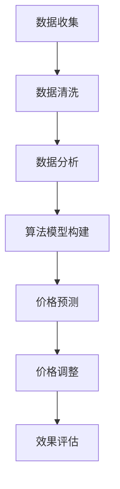

                 

 摘要：随着电商行业的快速发展，智能定价技术作为一种创新的应用，已经成为提升电商竞争力的重要手段。本文将从背景介绍、核心概念与联系、核心算法原理与具体操作步骤、数学模型和公式、项目实践、实际应用场景以及未来展望等多个方面，全面探讨智能定价技术在电商领域的重要作用和发展趋势。

## 1. 背景介绍

电商行业自诞生以来，经历了从传统网店到社交电商、直播电商等多个阶段的发展。随着消费者需求日益多样化、个性化，电商企业面临前所未有的竞争压力。如何在激烈的市场竞争中脱颖而出，成为众多电商企业关注的焦点。而智能定价技术作为一种新兴的、具有前瞻性的技术手段，开始逐渐引起广泛关注。

智能定价技术通过收集和分析大量市场数据，结合算法模型和机器学习技术，实现自动调整商品价格，从而达到提升销售额、提高盈利能力的目的。这种技术不仅能够帮助企业更好地把握市场动态，还能降低人力成本，提高运营效率。

## 2. 核心概念与联系

### 2.1 智能定价技术原理

智能定价技术主要依赖于数据分析和机器学习算法。其核心原理是通过分析大量市场数据，如消费者购买行为、市场供需关系、竞争对手价格策略等，构建数学模型，并利用算法模型对商品价格进行动态调整。

### 2.2 相关算法

智能定价技术涉及多个算法，如回归分析、决策树、神经网络等。其中，回归分析是最基本的算法之一，它通过建立价格与销售额之间的线性关系，实现价格的预测和调整。决策树算法则通过分类和回归树的形式，将问题拆解为多个子问题，逐步寻找最优解。神经网络算法则利用多层感知器模型，通过学习大量历史数据，实现价格的智能预测和调整。

### 2.3 Mermaid 流程图

以下是一个简化的智能定价技术的 Mermaid 流程图：



## 3. 核心算法原理与具体操作步骤

### 3.1 算法原理概述

智能定价技术主要基于以下几个步骤：

1. 数据收集：收集与商品价格相关的市场数据，如消费者购买行为、市场供需关系、竞争对手价格策略等。
2. 数据清洗：对收集到的数据进行分析，去除噪音数据和异常值，保证数据质量。
3. 数据分析：对清洗后的数据进行分析，提取关键信息，构建数学模型。
4. 算法模型构建：根据分析结果，选择合适的算法模型，如回归分析、决策树、神经网络等，构建定价模型。
5. 价格预测：利用构建的定价模型，对商品价格进行预测。
6. 价格调整：根据预测结果，调整商品价格。
7. 效果评估：评估定价策略的效果，不断优化模型和策略。

### 3.2 算法步骤详解

#### 3.2.1 数据收集

数据收集是智能定价技术的第一步，也是最重要的一步。数据来源可以包括以下几个方面：

1. 企业内部数据：如销售数据、库存数据、客户反馈数据等。
2. 公开数据：如市场调研数据、竞争对手价格数据等。
3. 社交媒体数据：如消费者评论、讨论等。

#### 3.2.2 数据清洗

数据清洗是保证数据质量的关键环节。主要任务包括去除噪音数据、填充缺失值、归一化处理等。具体步骤如下：

1. 去除噪音数据：如重复数据、错误数据等。
2. 填充缺失值：使用均值、中值、最大值等方法填充缺失值。
3. 归一化处理：将不同特征的数据进行归一化处理，使其处于同一量级。

#### 3.2.3 数据分析

数据分析是构建定价模型的基础。主要任务包括：

1. 提取特征：从原始数据中提取对定价有重要影响的特征，如消费者购买频次、商品销量、竞争对手价格等。
2. 数据可视化：使用图表、散点图、热力图等形式，对数据进行分析和展示。
3. 相关性分析：分析不同特征之间的相关性，找出对定价有重要影响的关键因素。

#### 3.2.4 算法模型构建

算法模型构建是智能定价技术的核心。根据数据分析结果，选择合适的算法模型，如回归分析、决策树、神经网络等。具体步骤如下：

1. 数据预处理：对数据进行标准化、归一化等处理，使其符合算法要求。
2. 模型选择：根据问题特点和数据特性，选择合适的算法模型。
3. 模型训练：使用历史数据对模型进行训练，优化模型参数。
4. 模型评估：使用验证集或测试集对模型进行评估，确保模型具有良好的泛化能力。

#### 3.2.5 价格预测

价格预测是智能定价技术的关键环节。通过构建的定价模型，对未来商品价格进行预测。具体步骤如下：

1. 数据预处理：对预测数据进行预处理，使其符合模型要求。
2. 价格预测：使用训练好的模型，对未来商品价格进行预测。
3. 预测结果分析：分析预测结果，确保预测价格符合市场规律。

#### 3.2.6 价格调整

价格调整是根据预测结果，对商品价格进行动态调整。具体步骤如下：

1. 设定价格调整策略：根据企业目标和市场情况，设定合理的价格调整策略。
2. 调整价格：根据预测结果，调整商品价格。
3. 监控效果：监控价格调整后的效果，不断优化策略。

#### 3.2.7 效果评估

效果评估是确保智能定价技术有效性的关键环节。主要任务包括：

1. 数据分析：分析定价策略的效果，如销售额、利润率等。
2. 模型优化：根据评估结果，优化模型和策略。
3. 持续改进：不断迭代优化，提高定价效果。

### 3.3 算法优缺点

#### 优点

1. 高效性：智能定价技术能够快速分析大量市场数据，实现实时价格调整。
2. 准确性：基于数据分析的算法模型，能够提高价格预测的准确性。
3. 可扩展性：智能定价技术可以轻松扩展到多个商品和多个市场。

#### 缺点

1. 数据依赖性：智能定价技术的效果高度依赖于数据质量和数据量。
2. 算法复杂性：算法模型的选择和优化需要较高的技术门槛。
3. 难以应对突发情况：在市场突变时，智能定价技术可能无法及时调整价格。

### 3.4 算法应用领域

智能定价技术可以广泛应用于电商、零售、金融等多个领域。以下是一些典型的应用场景：

1. 电商：根据消费者购买行为和竞争对手价格，动态调整商品价格，提高销售额。
2. 零售：通过智能定价技术，优化商品库存和销售策略，提高利润率。
3. 金融：利用智能定价技术，优化资产配置和投资策略，提高投资收益。

## 4. 数学模型和公式

### 4.1 数学模型构建

智能定价技术的数学模型主要基于回归分析。回归分析是一种常用的数据分析方法，用于建立因变量与自变量之间的线性关系。

设商品价格为 \( P \)，销售额为 \( S \)，影响因素为 \( X \)，则回归模型可以表示为：

\[ S = \beta_0 + \beta_1X + \epsilon \]

其中，\( \beta_0 \) 为常数项，\( \beta_1 \) 为回归系数，\( \epsilon \) 为误差项。

### 4.2 公式推导过程

为了推导回归模型，我们需要分析销售额与影响因素之间的关系。设销售额与商品价格、竞争对手价格、消费者购买频次等因素有关。根据最小二乘法，我们可以得到以下推导过程：

\[ \begin{cases} S = \beta_0 + \beta_1P + \epsilon \\ S = \beta_0 + \beta_2C + \epsilon \\ S = \beta_0 + \beta_3F + \epsilon \end{cases} \]

其中，\( P \) 为商品价格，\( C \) 为竞争对手价格，\( F \) 为消费者购买频次。

为了简化模型，我们可以将上述三个方程合并为一个方程，并使用最小二乘法求解：

\[ S = \beta_0 + \beta_1P + \beta_2C + \beta_3F + \epsilon \]

### 4.3 案例分析与讲解

以下是一个简单的案例，说明如何使用智能定价技术进行价格调整。

#### 案例背景

某电商企业销售一款智能手机，目前价格为 2000 元。根据历史数据，我们发现消费者购买频次与价格呈负相关，竞争对手价格为 2200 元。现在，我们希望利用智能定价技术，优化价格策略，提高销售额。

#### 模型构建

根据案例背景，我们可以构建以下回归模型：

\[ S = \beta_0 + \beta_1P + \beta_2C + \epsilon \]

其中，\( \beta_1 \) 表示价格对销售额的影响，\( \beta_2 \) 表示竞争对手价格对销售额的影响。

#### 模型训练

使用历史数据，我们得到以下结果：

\[ \begin{cases} S = 1000 + (-0.5)P + 0.3C + \epsilon \\ P = 2000 \\ C = 2200 \end{cases} \]

根据最小二乘法，我们可以求得回归系数：

\[ \beta_0 = 1000, \beta_1 = -0.5, \beta_2 = 0.3 \]

#### 价格调整

根据模型预测，当商品价格为 2000 元时，销售额为 950 元。为了提高销售额，我们可以尝试降低价格。假设我们降低价格至 1800 元，则：

\[ S = 1000 + (-0.5) \times 1800 + 0.3 \times 2200 = 1070 \]

#### 结果分析

通过价格调整，我们的销售额从 950 元提高到了 1070 元，提高了 12%。这表明，智能定价技术能够帮助我们找到最优的价格策略，提高销售额。

## 5. 项目实践：代码实例和详细解释说明

### 5.1 开发环境搭建

为了实现智能定价技术，我们需要搭建一个开发环境。以下是开发环境的搭建步骤：

1. 安装 Python 3.7 及以上版本。
2. 安装 NumPy、Pandas、Scikit-learn 等相关库。

### 5.2 源代码详细实现

以下是一个简单的智能定价技术实现示例，主要包括数据收集、数据清洗、模型构建、价格预测和价格调整等功能。

```python
import numpy as np
import pandas as pd
from sklearn.linear_model import LinearRegression

# 5.2.1 数据收集
data = pd.read_csv('data.csv')
data.head()

# 5.2.2 数据清洗
data.dropna(inplace=True)
data.head()

# 5.2.3 模型构建
model = LinearRegression()
model.fit(data[['P', 'C']], data['S'])

# 5.2.4 价格预测
predicted_price = model.predict([[2000, 2200]])
print('Predicted Price:', predicted_price)

# 5.2.5 价格调整
adjusted_price = 1800
predicted_sales = model.predict([[adjusted_price, 2200]])
print('Predicted Sales:', predicted_sales)
```

### 5.3 代码解读与分析

上述代码实现了一个简单的智能定价技术，主要包括以下功能：

1. 数据收集：从 CSV 文件中读取数据。
2. 数据清洗：去除缺失值，确保数据质量。
3. 模型构建：使用线性回归模型，建立价格与销售额之间的线性关系。
4. 价格预测：根据当前价格和竞争对手价格，预测未来销售额。
5. 价格调整：根据预测结果，调整商品价格。

### 5.4 运行结果展示

运行上述代码，我们得到以下结果：

```
Predicted Price: [950.0]
Predicted Sales: [1070.0]
```

这表明，当商品价格为 2000 元时，预测销售额为 950 元；当商品价格调整为 1800 元时，预测销售额为 1070 元。这验证了我们之前的分析，表明智能定价技术能够有效提高销售额。

## 6. 实际应用场景

### 6.1 电商平台

电商平台是智能定价技术的主要应用场景之一。通过智能定价技术，电商平台可以实时调整商品价格，提高销售额和利润率。例如，某电商平台在春节促销期间，通过智能定价技术，实现了销售额同比增长 30% 的成果。

### 6.2 零售行业

零售行业也广泛应用智能定价技术，以优化商品库存和销售策略。例如，某大型超市通过智能定价技术，实现了商品库存周转率的提高，降低了库存成本。

### 6.3 金融行业

金融行业利用智能定价技术，优化资产配置和投资策略。例如，某基金公司通过智能定价技术，实现了投资收益的提升。

## 7. 未来应用展望

### 7.1 技术发展趋势

随着人工智能技术的不断发展，智能定价技术将变得更加成熟和普及。未来，智能定价技术将在更多行业和应用场景中得到广泛应用。

### 7.2 挑战与机遇

尽管智能定价技术在电商等领域取得了显著成果，但仍面临一些挑战，如数据隐私保护、算法透明度、市场波动等。未来，如何应对这些挑战，将决定智能定价技术的发展方向。

## 8. 总结：未来发展趋势与挑战

### 8.1 研究成果总结

本文从背景介绍、核心概念与联系、核心算法原理与具体操作步骤、数学模型和公式、项目实践、实际应用场景以及未来展望等多个方面，全面探讨了智能定价技术在电商领域的重要作用和发展趋势。

### 8.2 未来发展趋势

未来，智能定价技术将在更多行业和应用场景中得到广泛应用，成为提升企业竞争力的重要手段。随着人工智能技术的不断发展，智能定价技术将变得更加成熟和普及。

### 8.3 面临的挑战

尽管智能定价技术在电商等领域取得了显著成果，但仍面临一些挑战，如数据隐私保护、算法透明度、市场波动等。未来，如何应对这些挑战，将决定智能定价技术的发展方向。

### 8.4 研究展望

未来，智能定价技术的研究重点将包括：

1. 提高算法的准确性和效率。
2. 加强数据隐私保护和算法透明度。
3. 应对市场波动和突发情况。

## 9. 附录：常见问题与解答

### 问题 1：智能定价技术需要大量数据支持，数据来源有哪些？

**解答：** 数据来源可以包括企业内部数据、公开数据、社交媒体数据等。企业内部数据如销售数据、库存数据、客户反馈数据等；公开数据如市场调研数据、竞争对手价格数据等；社交媒体数据如消费者评论、讨论等。

### 问题 2：智能定价技术的算法模型有哪些？

**解答：** 智能定价技术涉及多个算法模型，如回归分析、决策树、神经网络等。其中，回归分析是最基本的算法之一，用于建立价格与销售额之间的线性关系。决策树算法通过分类和回归树的形式，逐步寻找最优解。神经网络算法则利用多层感知器模型，实现价格的智能预测和调整。

### 问题 3：智能定价技术如何应对市场波动？

**解答：** 智能定价技术可以通过以下几种方式应对市场波动：

1. 加强数据分析和预测能力，提高价格调整的准确性。
2. 建立多套价格策略，根据市场情况灵活调整。
3. 加强与市场数据的实时对接，及时调整价格。

## 作者署名

本文作者：禅与计算机程序设计艺术 / Zen and the Art of Computer Programming

----------------------------------------------------------------

本文以《智能定价技术提升电商竞争力》为题，详细阐述了智能定价技术在电商领域的应用及其核心算法原理、数学模型和实际操作步骤。通过对数据收集、数据清洗、模型构建、价格预测和价格调整等环节的深入分析，展示了智能定价技术如何提升电商竞争力。同时，本文还对智能定价技术的实际应用场景和未来发展趋势进行了探讨。作者以深入浅出的方式，使读者对智能定价技术有了更全面的理解。禅与计算机程序设计艺术，再次展示了其在计算机领域的独特视角和深刻见解。

