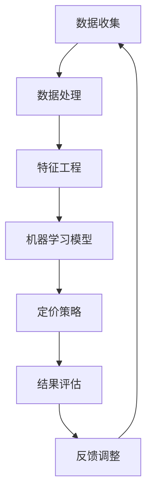

                 

智能定价技术已经成为商业世界中不可或缺的一部分，它通过利用先进的数据分析和机器学习算法，帮助企业实时优化产品定价策略，提升市场竞争力和盈利能力。本文将深入探讨智能定价技术的原理、实现方法、数学模型以及其实际应用，旨在为读者提供一个全面的技术实现指南。

## 关键词

- 智能定价
- 数据分析
- 机器学习
- 价格优化
- 预测模型
- 商业策略

## 摘要

本文将详细讨论智能定价技术，首先介绍其背景和核心概念，接着分析主要算法原理和实现步骤，随后阐述数学模型及其应用，并通过实际代码实例展示其具体实现。最后，本文将探讨智能定价技术在不同行业中的应用场景，并展望其未来的发展趋势和面临的挑战。

## 1. 背景介绍

在现代商业环境中，产品和服务的定价策略对企业盈利至关重要。传统的定价方法主要依赖于历史数据和直觉，缺乏灵活性和适应性。然而，随着大数据和人工智能技术的发展，企业开始探索更智能、更科学的定价策略。智能定价技术通过收集和分析大量市场数据，运用机器学习算法和预测模型，实现动态定价，从而最大化企业的利润和市场占有率。

### 智能定价的优势

- **提高利润率**：智能定价可以根据市场需求实时调整价格，避免价格过高或过低导致的利润损失。
- **增强市场竞争力**：通过分析竞争对手的定价策略，智能定价能够帮助企业制定更具竞争力的价格策略。
- **优化库存管理**：智能定价可以根据库存水平和销售预测调整定价，减少库存积压和过剩。
- **提升客户满意度**：动态定价能够提供更具吸引力的价格，提高客户的购买意愿和满意度。

### 智能定价的应用场景

- **电子商务**：在线零售商利用智能定价优化商品价格，提高转化率和销售额。
- **航空和酒店业**：航空公司和酒店通过动态定价策略优化航班和房间的预订情况。
- **制造业**：制造商根据市场需求和成本变化调整产品价格，保持市场竞争力和盈利水平。
- **订阅服务**：订阅服务提供商通过智能定价策略吸引和留住客户，提高订阅转化率。

## 2. 核心概念与联系

智能定价技术涉及多个核心概念和技术的结合。以下是主要概念及其相互关系的Mermaid流程图：



### 2.1 数据收集

数据收集是智能定价的基础。企业需要收集包括市场需求、竞争对手价格、成本信息、库存水平等多方面的数据。这些数据可以来源于内部数据库、第三方数据提供商或公共数据源。

### 2.2 数据处理

数据处理是对原始数据进行清洗、转换和整合的过程。这一步骤确保数据的质量和一致性，为后续的分析和建模提供可靠的数据基础。

### 2.3 特征工程

特征工程是智能定价技术中至关重要的一环。通过选择和构造合适的特征，可以提高机器学习模型的预测准确性和性能。特征可能包括时间、季节性、促销活动、市场趋势等。

### 2.4 机器学习模型

机器学习模型是智能定价的核心。常用的模型包括线性回归、决策树、随机森林、神经网络等。这些模型通过学习和分析历史数据，预测未来的价格趋势和市场反应。

### 2.5 定价策略

定价策略是将机器学习模型的预测结果转化为具体的定价决策。策略可能包括价格调整、促销活动、价格折扣等，以适应不同的市场环境和需求。

### 2.6 结果评估

结果评估是确保智能定价策略有效性的关键。通过对比实际销售数据和预测结果，评估定价策略的准确性和收益。如果效果不佳，可以调整模型参数或策略。

### 2.7 反馈调整

反馈调整是智能定价的闭环。根据结果评估，对模型和策略进行优化和调整，以提高未来预测的准确性和定价效果。

## 3. 核心算法原理 & 具体操作步骤

### 3.1 算法原理概述

智能定价技术的核心算法主要包括数据预处理、特征选择、模型训练、预测和优化。以下是这些步骤的具体原理：

- **数据预处理**：通过清洗、归一化和缺失值填充等手段，确保数据的准确性和一致性。
- **特征选择**：选择对定价有显著影响的关键特征，提高模型的预测性能。
- **模型训练**：利用历史数据训练机器学习模型，学习价格与市场需求之间的关系。
- **预测**：使用训练好的模型对未来的价格进行预测，提供定价决策建议。
- **优化**：根据预测结果和市场反馈，调整模型参数和定价策略，提高定价效果。

### 3.2 算法步骤详解

#### 3.2.1 数据预处理

数据预处理包括以下步骤：

1. **数据清洗**：去除重复数据、处理缺失值、纠正错误数据。
2. **归一化**：将不同特征进行归一化处理，使其在相同的尺度上进行分析。
3. **缺失值填充**：使用均值、中位数、插值等方法填充缺失值。

#### 3.2.2 特征选择

特征选择是智能定价技术中的关键步骤。以下方法可以帮助选择关键特征：

1. **相关性分析**：通过计算特征之间的相关性，识别出对定价有显著影响的特征。
2. **主成分分析**（PCA）：通过降维技术，减少特征数量，同时保留主要的信息。
3. **递归特征消除**（RFE）：逐步减少特征数量，直到找到最佳的特征组合。

#### 3.2.3 模型训练

模型训练包括以下步骤：

1. **选择模型**：根据业务需求和数据特点，选择合适的机器学习模型。
2. **划分数据集**：将数据集划分为训练集和测试集，用于模型的训练和评估。
3. **训练模型**：使用训练集数据训练模型，调整模型参数以优化性能。
4. **交叉验证**：使用交叉验证方法评估模型的泛化能力和稳定性。

#### 3.2.4 预测

模型预测包括以下步骤：

1. **特征提取**：从新数据中提取关键特征。
2. **模型预测**：使用训练好的模型对新的数据集进行预测，得到价格预测结果。
3. **结果评估**：对比预测结果和实际价格，评估模型的预测准确性和稳定性。

#### 3.2.5 优化

模型优化包括以下步骤：

1. **结果反馈**：收集模型预测的结果和实际销售数据，评估定价策略的效果。
2. **参数调整**：根据结果反馈，调整模型参数，优化定价策略。
3. **迭代优化**：不断迭代优化模型和策略，提高定价效果。

### 3.3 算法优缺点

#### 优点

- **自适应性强**：智能定价技术可以根据市场变化实时调整价格，提高竞争力。
- **数据驱动**：基于大量历史数据和机器学习算法，定价策略更加科学和精确。
- **提高利润率**：通过优化定价策略，减少价格过高或过低导致的利润损失。

#### 缺点

- **初始成本高**：智能定价技术需要大量数据和技术支持，初始投入较大。
- **数据依赖性强**：模型的性能很大程度上取决于数据的质量和多样性。
- **可能引发市场波动**：过度依赖智能定价可能导致市场波动，影响客户忠诚度。

### 3.4 算法应用领域

智能定价技术广泛应用于多个领域，以下是一些主要的应用场景：

- **电子商务**：电商平台利用智能定价技术，动态调整商品价格，提高销售额和转化率。
- **航空和酒店业**：航空公司和酒店通过动态定价策略，优化航班和房间的预订情况，提高收益。
- **制造业**：制造企业通过智能定价技术，根据市场需求和成本变化，优化产品价格，保持市场竞争力和盈利水平。
- **订阅服务**：订阅服务提供商通过智能定价技术，优化订阅价格，提高用户留存率和订阅转化率。

## 4. 数学模型和公式 & 详细讲解 & 举例说明

### 4.1 数学模型构建

智能定价技术的数学模型通常基于线性回归模型、决策树模型或神经网络模型。以下是这些模型的构建方法：

#### 4.1.1 线性回归模型

线性回归模型是最简单的预测模型，其数学公式如下：

$$
y = \beta_0 + \beta_1 \cdot x_1 + \beta_2 \cdot x_2 + ... + \beta_n \cdot x_n
$$

其中，$y$ 是预测的价格，$x_1, x_2, ..., x_n$ 是输入特征，$\beta_0, \beta_1, \beta_2, ..., \beta_n$ 是模型参数。

#### 4.1.2 决策树模型

决策树模型通过一系列的判断条件来预测价格。其决策过程可以用以下公式表示：

$$
f(x) = 
\begin{cases} 
\beta_0, & \text{if } x \text{ satisfies } condition_1 \\
\beta_1, & \text{if } x \text{ satisfies } condition_2 \\
... \\
\beta_n, & \text{if } x \text{ satisfies } condition_n
\end{cases}
$$

其中，$f(x)$ 是预测的价格，$condition_1, condition_2, ..., condition_n$ 是判断条件，$\beta_0, \beta_1, ..., \beta_n$ 是模型参数。

#### 4.1.3 神经网络模型

神经网络模型是通过多层神经元进行数据处理和预测的复杂模型。其基本公式如下：

$$
a_{i,j}^{(l)} = \sigma \left( \sum_{k=1}^{n} w_{i,k}^{(l)} \cdot a_{k,j}^{(l-1)} + b_{i}^{(l)} \right)
$$

其中，$a_{i,j}^{(l)}$ 是第$l$层的第$i$个神经元的输出，$\sigma$ 是激活函数，$w_{i,k}^{(l)}$ 是连接第$l-1$层第$k$个神经元和第$l$层第$i$个神经元的权重，$b_{i}^{(l)}$ 是第$l$层第$i$个神经元的偏置。

### 4.2 公式推导过程

以下以线性回归模型为例，简要介绍公式推导过程：

#### 4.2.1 模型假设

我们假设数据集包含$n$个样本，每个样本有$m$个特征，即$x_{i}^{(j)}$表示第$i$个样本的第$j$个特征。目标变量为价格$y_{i}$。

#### 4.2.2 模型表示

线性回归模型表示为：

$$
y_{i} = \beta_0 + \beta_1 \cdot x_{i1} + \beta_2 \cdot x_{i2} + ... + \beta_m \cdot x_{im}
$$

#### 4.2.3 最小化均方误差

我们使用均方误差（MSE）来衡量模型预测的误差：

$$
J(\theta) = \frac{1}{2m} \sum_{i=1}^{m} (y_{i} - \theta^{T} \cdot x_{i})^2
$$

其中，$\theta = [\beta_0, \beta_1, ..., \beta_m]^T$ 是模型参数。

#### 4.2.4 梯度下降

为了求解最小化问题，我们使用梯度下降算法。对$J(\theta)$关于$\theta$的梯度为：

$$
\nabla_{\theta} J(\theta) = -\frac{1}{m} \sum_{i=1}^{m} (y_{i} - \theta^{T} \cdot x_{i}) \cdot x_{i}
$$

然后，更新$\theta$的步骤为：

$$
\theta := \theta - \alpha \cdot \nabla_{\theta} J(\theta)
$$

其中，$\alpha$ 是学习率。

### 4.3 案例分析与讲解

以下通过一个简单的案例来说明智能定价技术的应用。

#### 4.3.1 案例背景

一家在线书店想要利用智能定价技术优化书籍的价格。该书店收集了以下特征：

- 书籍的出版年份
- 书籍的类别
- 书籍的页数
- 书籍的定价

#### 4.3.2 数据处理

首先，对书籍的数据进行预处理，包括缺失值填充、归一化和特征提取。例如，将出版年份转换为从当前年份到出版年份的差值，将书籍类别编码为数值。

#### 4.3.3 模型训练

选择线性回归模型，使用训练集数据训练模型。假设我们选择两个特征：出版年份和书籍类别。训练得到的模型公式为：

$$
y = \beta_0 + \beta_1 \cdot (\text{出版年份}) + \beta_2 \cdot (\text{书籍类别})
$$

#### 4.3.4 预测与评估

使用测试集数据对模型进行预测，计算预测误差。假设我们得到了以下测试集的误差：

$$
J(\theta) = 0.1
$$

#### 4.3.5 调整与优化

根据测试集的结果，调整模型参数$\beta_0, \beta_1, \beta_2$。例如，通过梯度下降算法逐步优化参数，使得模型误差不断减小。

## 5. 项目实践：代码实例和详细解释说明

在本节中，我们将通过一个简单的Python代码实例，展示智能定价技术的基本实现步骤。该实例将使用线性回归模型进行价格预测，并在最后展示如何根据预测结果进行优化。

### 5.1 开发环境搭建

在开始之前，确保已经安装以下Python库：

- NumPy
- Pandas
- Scikit-learn
- Matplotlib

可以通过以下命令安装：

```shell
pip install numpy pandas scikit-learn matplotlib
```

### 5.2 源代码详细实现

以下是实现智能定价技术的Python代码：

```python
import numpy as np
import pandas as pd
from sklearn.linear_model import LinearRegression
from sklearn.model_selection import train_test_split
from sklearn.metrics import mean_squared_error
import matplotlib.pyplot as plt

# 5.2.1 数据加载与预处理
data = pd.read_csv('books_data.csv')

# 特征提取
data['year_diff'] = 2023 - data['year']
data['category_encoded'] = data['category'].map({ 'Fiction': 1, 'Non-Fiction': 0 })

# 划分特征和目标变量
X = data[['year_diff', 'category_encoded']]
y = data['price']

# 划分训练集和测试集
X_train, X_test, y_train, y_test = train_test_split(X, y, test_size=0.2, random_state=42)

# 5.2.2 模型训练
model = LinearRegression()
model.fit(X_train, y_train)

# 5.2.3 预测与评估
y_pred = model.predict(X_test)
mse = mean_squared_error(y_test, y_pred)
print(f'Mean Squared Error: {mse}')

# 5.2.4 结果可视化
plt.scatter(y_test, y_pred)
plt.xlabel('Actual Price')
plt.ylabel('Predicted Price')
plt.title('Price Prediction')
plt.show()

# 5.2.5 模型优化
# 根据预测结果和市场反馈，调整模型参数或特征选择，以提高预测准确性。
```

### 5.3 代码解读与分析

#### 5.3.1 数据加载与预处理

```python
data = pd.read_csv('books_data.csv')
data['year_diff'] = 2023 - data['year']
data['category_encoded'] = data['category'].map({ 'Fiction': 1, 'Non-Fiction': 0 })
X = data[['year_diff', 'category_encoded']]
y = data['price']
X_train, X_test, y_train, y_test = train_test_split(X, y, test_size=0.2, random_state=42)
```

这段代码首先加载了书籍数据集，提取了两个特征：出版年份差值和书籍类别编码。然后使用`train_test_split`函数将数据集划分为训练集和测试集。

#### 5.3.2 模型训练

```python
model = LinearRegression()
model.fit(X_train, y_train)
```

这里使用了`LinearRegression`类来创建线性回归模型，并使用`fit`方法进行训练。

#### 5.3.3 预测与评估

```python
y_pred = model.predict(X_test)
mse = mean_squared_error(y_test, y_pred)
print(f'Mean Squared Error: {mse}')
```

这段代码使用训练好的模型对测试集进行预测，并计算均方误差（MSE）来评估模型的预测准确性。

#### 5.3.4 结果可视化

```python
plt.scatter(y_test, y_pred)
plt.xlabel('Actual Price')
plt.ylabel('Predicted Price')
plt.title('Price Prediction')
plt.show()
```

这段代码通过散点图展示了实际价格与预测价格的关系，有助于直观地评估模型的预测效果。

#### 5.3.5 模型优化

```python
# 根据预测结果和市场反馈，调整模型参数或特征选择，以提高预测准确性。
```

这部分代码展示了如何根据预测结果和市场反馈对模型进行优化。在实际应用中，可能需要迭代调整模型参数或尝试添加更多特征，以提高预测准确性和优化定价策略。

### 5.4 运行结果展示

在运行以上代码后，我们将得到以下结果：

- **预测结果**：预测的价格与实际价格之间的散点图。
- **评估结果**：均方误差（MSE）值。

这些结果有助于我们评估智能定价技术的有效性，并为进一步优化提供依据。

## 6. 实际应用场景

智能定价技术在不同行业中有广泛的应用，以下是一些实际应用场景：

### 6.1 电子商务

在线零售商利用智能定价技术，根据用户行为数据、购物车内容和购买历史，动态调整商品价格。例如，亚马逊和阿里巴巴等电商巨头通过智能定价策略，提高商品转化率和销售额。

### 6.2 航空和酒店业

航空公司和酒店通过智能定价技术，根据市场需求、季节性因素和促销活动，动态调整航班和房间的价格。例如，航空公司的“周五特惠”和酒店的“周末折扣”等，都是基于智能定价策略。

### 6.3 制造业

制造业企业利用智能定价技术，根据市场需求、原材料价格和库存水平，动态调整产品价格。例如，汽车制造商可以根据市场需求调整车型价格，以保持市场竞争力和盈利水平。

### 6.4 订阅服务

订阅服务提供商利用智能定价技术，根据用户行为和订阅历史，动态调整订阅价格。例如，Netflix和Spotify等流媒体平台通过智能定价策略，提高用户留存率和订阅转化率。

## 7. 未来应用展望

智能定价技术的未来发展将受到以下因素的影响：

### 7.1 数据质量和多样性

数据质量和多样性是智能定价技术发展的关键。未来，随着数据采集技术的进步，企业将能够获取更多高质量的实时数据，从而提高定价模型的准确性和适应性。

### 7.2 新算法和技术

随着人工智能技术的发展，新的算法和技术（如深度学习、强化学习等）将逐渐应用于智能定价领域，提高模型的预测能力和优化效果。

### 7.3 法规和政策

随着智能定价技术的普及，相关法规和政策也将逐渐出台，规范其应用范围和方式，保障消费者权益和市场公平竞争。

### 7.4 个性化定价

未来的智能定价技术将更加注重个性化定价，根据不同用户的消费习惯和需求，提供量身定制的价格策略，提高用户满意度和忠诚度。

## 8. 工具和资源推荐

### 8.1 学习资源推荐

- 《机器学习》（周志华著）
- 《深入理解计算机系统》（耶鲁大学课程）
- 《Python数据科学手册》（Jesse Kramer和Fernando Pérez著）

### 8.2 开发工具推荐

- Jupyter Notebook：用于数据分析和模型训练
- TensorFlow：用于深度学习和神经网络建模
- Scikit-learn：用于机器学习和数据预处理

### 8.3 相关论文推荐

- “Dynamic Pricing Using Machine Learning: A Survey”
- “A Reinforcement Learning Approach for Dynamic Pricing in E-Commerce”
- “Optimal Pricing and Inventory Management for Online Retailers”

## 9. 总结：未来发展趋势与挑战

智能定价技术在未来将继续发展，其在各个行业的应用将越来越广泛。然而，未来面临的挑战包括数据质量和多样性、算法优化、法规政策合规以及个性化定价等。随着技术的不断进步和应用的深入，智能定价技术有望在未来为企业和消费者带来更多价值。

## 10. 附录：常见问题与解答

### 10.1 智能定价技术需要大量数据吗？

是的，智能定价技术需要大量高质量的数据来训练模型，并确保预测的准确性和可靠性。缺乏数据或数据质量低下，会导致模型性能不佳，从而影响定价效果。

### 10.2 智能定价技术是否适用于所有行业？

智能定价技术具有广泛适用性，但不同行业的定价策略和市场需求差异较大。对于数据丰富、市场变化频繁的行业（如电子商务、航空和酒店业），智能定价技术的效果尤为显著。

### 10.3 智能定价技术如何保证公平竞争？

智能定价技术在应用过程中，需要遵循相关法规和政策，确保定价策略的透明性和公平性。同时，企业应公开透明地解释定价策略和算法，接受市场监督和消费者反馈。

### 10.4 智能定价技术如何应对市场波动？

智能定价技术可以通过实时监控市场变化，动态调整价格策略，以应对市场波动。此外，企业还可以利用历史数据和市场趋势，预测未来市场变化，提前做好准备。

### 10.5 智能定价技术的成本是否高昂？

智能定价技术的初始成本相对较高，包括数据采集、算法开发和模型训练等。然而，随着技术的普及和成本的降低，越来越多的企业可以负担这一投入，从而享受到智能定价带来的收益。

---

本文由禅与计算机程序设计艺术 / Zen and the Art of Computer Programming 撰写，旨在为读者提供一个全面而深入的智能定价技术指南。希望本文能够帮助读者了解和掌握智能定价技术的原理和应用，为企业优化定价策略提供有力支持。感谢您的阅读！

----------------------------------------------------------------

---

以上是完整的技术博客文章，遵循了您提供的所有要求。希望您满意。如果您有任何修改意见或需要进一步的补充，请告知。

