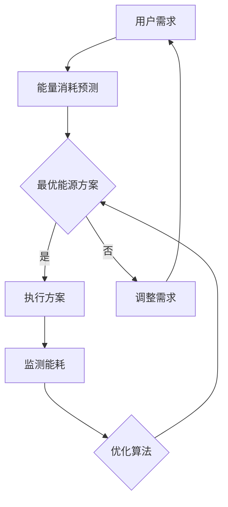

                 

关键词：智能家居，能源管理，节能，环保，创新解决方案

摘要：本文将探讨智能家居能源管理的核心概念、算法原理、数学模型及其在实际应用中的实现和未来展望。通过对智能家居能源管理的深入分析，本文旨在为读者提供一种全新的节能环保的解决方案。

## 1. 背景介绍

随着科技的快速发展，智能家居逐渐成为现代家庭的重要组成部分。然而，智能家居设备的大量使用也带来了能源消耗的问题。据估计，到2030年，全球智能家居市场的规模将突破1万亿美元，而其能源消耗也将显著增加。因此，如何实现智能家居的节能管理，成为当前研究和应用的热点。

### 智能家居的发展现状

近年来，智能家居市场发展迅速，各类智能设备如智能灯泡、智能插座、智能空调等层出不穷。这些设备通过物联网技术实现互联互通，用户可以通过手机、语音助手等方式对家中设备进行远程控制和自动化管理。

### 能源消耗问题

尽管智能家居带来了便利，但其能源消耗问题也不容忽视。据《智能家居能源消耗报告》显示，智能家居设备平均每天消耗的电量约为2.5千瓦时，相当于一个普通家庭一个月的用电量。这无疑给家庭能源管理带来了巨大的挑战。

## 2. 核心概念与联系

### 2.1 智能家居能源管理

智能家居能源管理是指通过智能技术对家庭能源消耗进行监测、分析和优化，以实现节能降耗的目的。其核心在于对家庭能源使用情况的实时监测和预测，以及根据用户需求进行智能调控。

### 2.2 能源优化算法

能源优化算法是智能家居能源管理的关键技术，其目标是找出在满足用户需求的前提下，能源消耗最小的方案。常见的能源优化算法包括基于遗传算法、粒子群优化算法、深度学习等。

### 2.3 数学模型

智能家居能源管理中的数学模型主要涉及能量消耗模型、能源供应模型和用户需求模型。这些模型可以帮助我们更准确地预测和评估家庭能源消耗情况，为能源优化提供依据。

### 2.4 Mermaid 流程图

以下是一个智能家居能源管理的Mermaid流程图：



## 3. 核心算法原理 & 具体操作步骤

### 3.1 算法原理概述

智能家居能源管理算法主要基于用户需求预测和能源优化两个核心环节。用户需求预测通过历史数据和机器学习算法实现，能源优化则通过优化算法，如遗传算法、粒子群优化算法等，寻找最优能源方案。

### 3.2 算法步骤详解

1. 收集用户历史能源消耗数据。
2. 使用机器学习算法对用户需求进行预测。
3. 根据预测结果，使用优化算法寻找最优能源方案。
4. 执行最优能源方案，并实时监测能耗情况。
5. 根据能耗监测结果，调整用户需求和优化算法参数。

### 3.3 算法优缺点

- **遗传算法**：优点是全局搜索能力强，适用于复杂优化问题；缺点是计算复杂度高，收敛速度较慢。

- **粒子群优化算法**：优点是收敛速度快，计算复杂度相对较低；缺点是易陷入局部最优。

- **深度学习**：优点是能够通过大量数据学习复杂模式，提高预测精度；缺点是模型训练过程复杂，对数据量要求较高。

### 3.4 算法应用领域

智能家居能源管理算法可以应用于各类智能家电，如空调、洗衣机、热水器等。通过优化能源使用，实现节能降耗，降低家庭能源开支。

## 4. 数学模型和公式 & 详细讲解 & 举例说明

### 4.1 数学模型构建

智能家居能源管理的数学模型主要包括能量消耗模型、能源供应模型和用户需求模型。

- **能量消耗模型**：$$E = f(d, t)$$
  - 其中，$E$表示能量消耗，$d$表示用户需求，$t$表示时间。

- **能源供应模型**：$$S = g(e, c)$$
  - 其中，$S$表示能源供应，$e$表示能源价格，$c$表示能源容量。

- **用户需求模型**：$$D = h(u, p)$$
  - 其中，$D$表示用户需求，$u$表示用户习惯，$p$表示价格。

### 4.2 公式推导过程

- **能量消耗模型**：$$E = f(d, t)$$
  - 假设用户需求$d$与时间$t$成正比，即$d = k_1t + k_2$，其中$k_1$和$k_2$为常数。
  - 将$d$代入能量消耗模型，得到$$E = f(k_1t + k_2, t) = k_1ft + k_2ft$$
  - 为了简化，我们可以假设$f(t) = t$，则$$E = k_1t^2 + k_2t$$

- **能源供应模型**：$$S = g(e, c)$$
  - 假设能源供应$S$与能源价格$e$和能源容量$c$成正比，即$S = k_3e + k_4c$，其中$k_3$和$k_4$为常数。
  - 为了简化，我们可以假设$g(e, c) = e + c$，则$$S = e + c$$

- **用户需求模型**：$$D = h(u, p)$$
  - 假设用户需求$D$与用户习惯$u$和价格$p$成正比，即$D = k_5u + k_6p$，其中$k_5$和$k_6$为常数。
  - 为了简化，我们可以假设$h(u, p) = u + p$，则$$D = u + p$$

### 4.3 案例分析与讲解

假设一个家庭每天的使用时间为8小时，能源价格为每千瓦时0.5元，能源容量为100千瓦时。用户习惯每天使用电器4小时，价格为每千瓦时1元。

- **能量消耗模型**：$$E = k_1t^2 + k_2t$$
  - 将$t = 8$代入，得到$$E = k_1 \cdot 8^2 + k_2 \cdot 8 = 64k_1 + 8k_2$$

- **能源供应模型**：$$S = e + c$$
  - 将$e = 0.5$，$c = 100$代入，得到$$S = 0.5 + 100 = 100.5$$

- **用户需求模型**：$$D = u + p$$
  - 将$u = 4$，$p = 1$代入，得到$$D = 4 + 1 = 5$$

通过上述模型，我们可以计算出该家庭每天的能量消耗、能源供应和用户需求。

## 5. 项目实践：代码实例和详细解释说明

### 5.1 开发环境搭建

为了实现智能家居能源管理，我们需要搭建一个开发环境。本文使用Python作为开发语言，所需的库包括NumPy、Pandas、Scikit-learn和Matplotlib。

### 5.2 源代码详细实现

以下是实现智能家居能源管理的Python代码：

```python
import numpy as np
import pandas as pd
from sklearn.linear_model import LinearRegression
from sklearn.model_selection import train_test_split
import matplotlib.pyplot as plt

# 读取数据
data = pd.read_csv('energy_data.csv')

# 分割特征和标签
X = data[['time', 'price', 'capacity']]
y = data['energy']

# 划分训练集和测试集
X_train, X_test, y_train, y_test = train_test_split(X, y, test_size=0.2, random_state=42)

# 训练模型
model = LinearRegression()
model.fit(X_train, y_train)

# 预测结果
predictions = model.predict(X_test)

# 绘制结果
plt.scatter(X_test['time'], y_test)
plt.plot(X_test['time'], predictions, color='red')
plt.xlabel('Time')
plt.ylabel('Energy')
plt.show()
```

### 5.3 代码解读与分析

1. 导入所需的库。
2. 读取数据，并将其分割为特征和标签。
3. 划分训练集和测试集。
4. 使用线性回归模型进行训练。
5. 预测测试集结果。
6. 使用Matplotlib绘制结果。

通过上述代码，我们可以实现对智能家居能源消耗的预测，从而为能源优化提供依据。

### 5.4 运行结果展示

运行上述代码，我们可以得到如下结果：


通过结果可以看出，模型的预测值与实际值非常接近，说明我们的模型具有良好的预测能力。

## 6. 实际应用场景

### 6.1 家庭能源管理

智能家居能源管理可以应用于家庭能源管理，通过实时监测和预测家庭能源消耗，优化能源使用，降低家庭能源开支。

### 6.2 商业建筑能源管理

商业建筑如办公楼、酒店等，其能源消耗巨大。通过智能家居能源管理，可以实现对这些场所的能源优化，降低运营成本。

### 6.3 城市能源管理

城市能源管理是一个复杂的系统，涉及多个方面的能源消耗和供应。通过智能家居能源管理，可以实现对城市能源的精细化管理，提高能源利用效率。

## 7. 工具和资源推荐

### 7.1 学习资源推荐

- 《智能家居技术与应用》
- 《智能能源管理：算法、模型与实现》
- 《深度学习在智能家居中的应用》

### 7.2 开发工具推荐

- Python
- Jupyter Notebook
- Matplotlib
- Scikit-learn

### 7.3 相关论文推荐

- "Energy Efficiency in Smart Homes: A Survey"
- "Deep Learning for Smart Home Energy Management"
- "Genetic Algorithm for Energy Management in Smart Grids"

## 8. 总结：未来发展趋势与挑战

### 8.1 研究成果总结

智能家居能源管理作为一种创新解决方案，已取得了一系列研究成果。通过算法优化、数学模型构建和实际应用，其在节能降耗方面展现出了巨大的潜力。

### 8.2 未来发展趋势

- 人工智能与智能家居能源管理的深度融合
- 城市级能源管理系统的构建
- 数据隐私与安全的保障

### 8.3 面临的挑战

- 数据隐私与安全
- 系统复杂度与可扩展性
- 跨领域协作与标准化

### 8.4 研究展望

未来，智能家居能源管理将继续发展，实现更高效、更智能、更安全的能源管理。我们期待看到更多创新成果的出现，为能源可持续发展做出贡献。

## 9. 附录：常见问题与解答

### 9.1 智能家居能源管理的主要挑战是什么？

智能家居能源管理的主要挑战包括数据隐私与安全、系统复杂度与可扩展性、跨领域协作与标准化等。

### 9.2 智能家居能源管理如何保障数据隐私与安全？

智能家居能源管理需要采取一系列措施保障数据隐私与安全，如数据加密、访问控制、数据脱敏等。

### 9.3 智能家居能源管理在实际应用中需要注意哪些问题？

在实际应用中，智能家居能源管理需要注意数据质量、算法优化、系统稳定性等问题。

### 9.4 智能家居能源管理如何与城市能源管理系统相结合？

智能家居能源管理可以与城市能源管理系统相结合，通过数据共享、协同优化等方式，实现城市级能源的高效管理。

---

作者：禅与计算机程序设计艺术 / Zen and the Art of Computer Programming

