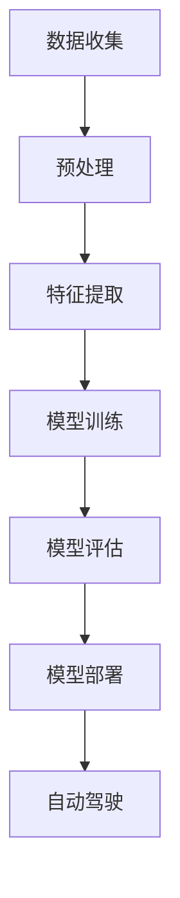

                 

关键词：智能工程设计，AI大模型，应用，挑战与未来

摘要：本文将探讨智能工程设计中的AI大模型应用。我们将介绍AI大模型的概念、核心原理和操作步骤，并通过数学模型和具体案例来展示其应用效果。同时，我们还将讨论AI大模型在实际应用场景中的挑战和未来发展趋势。

## 1. 背景介绍

智能工程设计是利用计算机技术，特别是人工智能（AI）技术，来设计复杂的系统、产品和解决方案的领域。随着AI技术的发展，特别是深度学习和生成对抗网络（GAN）等技术的出现，AI大模型已经成为智能工程设计的重要工具。AI大模型具有强大的数据处理和智能推理能力，可以在各种复杂场景下提供高效、准确的设计方案。

本文将重点讨论AI大模型在智能工程设计中的应用，包括其核心算法原理、具体操作步骤、数学模型和实际案例。我们将通过这些内容来展示AI大模型在智能工程设计中的潜力和价值，并探讨其在实际应用中面临的挑战和未来发展趋势。

## 2. 核心概念与联系

### 2.1 AI大模型的概念

AI大模型是指具有大规模参数和高度复杂性的深度学习模型。这些模型通常使用数百万甚至数十亿个参数来捕捉复杂数据的特征和模式。常见的AI大模型包括Transformer、BERT、GPT等。

### 2.2 核心算法原理

AI大模型的核心算法是深度学习，特别是基于梯度的优化方法。深度学习通过多层神经网络来模拟人脑的神经元，通过前向传播和反向传播来训练模型参数，使其能够对复杂数据进行有效的特征提取和模式识别。

### 2.3 AI大模型的应用场景

AI大模型可以应用于各种智能工程设计领域，包括但不限于：
- 自动驾驶：使用AI大模型进行环境感知、路径规划和决策制定；
- 医疗诊断：使用AI大模型对医疗影像进行分析和诊断；
- 金融风控：使用AI大模型进行风险识别和预测；
- 建筑设计：使用AI大模型进行建筑设计优化和自动生成；
- 游戏设计：使用AI大模型进行游戏场景生成和角色行为设计。

### 2.4 Mermaid 流程图

以下是AI大模型在自动驾驶领域应用的Mermaid流程图：



## 3. 核心算法原理 & 具体操作步骤

### 3.1 算法原理概述

AI大模型的算法原理主要基于深度学习和神经网络。深度学习是一种通过多层神经网络对数据进行特征提取和模式识别的学习方法。神经网络由多个层组成，包括输入层、隐藏层和输出层。每一层都由多个神经元组成，神经元之间通过权重进行连接。

深度学习模型通过以下步骤进行训练：
1. 输入层接收数据；
2. 数据通过隐藏层进行特征提取；
3. 特征在输出层进行分类或回归；
4. 使用损失函数计算预测值与真实值之间的差距；
5. 通过反向传播算法更新模型参数。

### 3.2 算法步骤详解

以下是AI大模型训练的基本步骤：

#### 3.2.1 数据收集

收集大量的训练数据，包括输入数据和对应的标签。在自动驾驶领域，这些数据可以是道路图像、传感器数据等。

#### 3.2.2 预处理

对收集到的数据进行处理，包括数据清洗、归一化和特征提取。数据清洗去除噪声和异常值，归一化将数据转换为统一的尺度，特征提取从原始数据中提取出有用的特征。

#### 3.2.3 模型训练

构建深度学习模型，包括定义网络结构、选择优化器和损失函数。使用预处理后的数据进行模型训练，通过迭代更新模型参数，使其能够对数据进行准确的预测。

#### 3.2.4 模型评估

使用测试数据对训练好的模型进行评估，计算模型的准确率、召回率等指标。根据评估结果调整模型参数，优化模型性能。

#### 3.2.5 模型部署

将训练好的模型部署到实际应用场景中，例如自动驾驶车辆。在部署过程中，需要对模型进行实时更新和优化，以应对环境变化和新的数据。

### 3.3 算法优缺点

#### 优点

- 强大的特征提取能力：AI大模型能够从大量数据中自动提取出有用的特征，减轻了人工特征工程的工作负担。
- 高效的预测性能：AI大模型通过大规模参数和深度神经网络结构，能够实现高效、准确的预测。
- 灵活的适应能力：AI大模型可以应用于各种领域，具有较强的通用性。

#### 缺点

- 需要大量的数据：AI大模型需要大量的训练数据来保证模型的性能，这在某些领域可能难以实现。
- 长时间的训练时间：深度学习模型的训练通常需要较长时间，这对于实时应用场景可能是一个挑战。
- 模型的可解释性：AI大模型的黑盒性质使得其预测过程难以解释，这可能在某些需要透明度和可解释性的应用中受到限制。

### 3.4 算法应用领域

AI大模型可以应用于许多领域，包括但不限于：

- 自动驾驶：用于环境感知、路径规划和决策制定。
- 医疗诊断：用于医疗影像分析、疾病预测和诊断。
- 金融风控：用于风险识别、市场预测和信用评分。
- 建筑设计：用于建筑设计优化、自动生成和虚拟现实。
- 游戏设计：用于游戏场景生成、角色行为设计和智能NPC。

## 4. 数学模型和公式 & 详细讲解 & 举例说明

### 4.1 数学模型构建

AI大模型的数学基础主要包括线性代数、概率论和优化理论。以下是构建AI大模型所需的一些基本数学模型和公式：

#### 线性代数

- 矩阵和向量的基本运算：加法、减法、乘法、转置等；
- 矩阵分解：奇异值分解（SVD）、LU分解等；
- 特征值和特征向量：用于特征提取和降维。

#### 概率论

- 概率分布：正态分布、伯努利分布、泊松分布等；
- 条件概率和贝叶斯公式：用于概率推断和决策制定；
- 最大似然估计和最小二乘法：用于参数估计。

#### 优化理论

- 梯度下降法：用于优化模型参数；
- 随机梯度下降（SGD）：提高梯度下降法的收敛速度；
- 动量法和自适应优化算法：提高优化效果。

### 4.2 公式推导过程

以下是一个简单的线性回归模型的推导过程：

#### 模型定义

给定输入特征矩阵 \(X\) 和输出向量 \(y\)，线性回归模型的目标是找到一个权重向量 \(w\)，使得预测值 \(y'\) 最接近真实值 \(y\)。

#### 模型假设

我们假设线性回归模型的形式为：

\[ y' = Xw + b \]

其中，\(b\) 是偏置项。

#### 模型优化

我们使用最小二乘法来优化模型参数 \(w\) 和 \(b\)。最小二乘法的目标是使预测值 \(y'\) 与真实值 \(y\) 之间的误差平方和最小。

误差平方和为：

\[ J(w, b) = \frac{1}{2} \sum_{i=1}^{n} (y_i - y'_i)^2 \]

其中，\(n\) 是样本数量。

#### 梯度计算

对 \(J(w, b)\) 分别对 \(w\) 和 \(b\) 求导，得到梯度：

\[ \nabla_w J(w, b) = X^T(Xw + b - y) \]

\[ \nabla_b J(w, b) = X^T(y - Xw - b) \]

#### 梯度下降

通过梯度下降法，我们可以迭代更新 \(w\) 和 \(b\)，使其逐渐逼近最优值：

\[ w_{new} = w_{old} - \alpha \nabla_w J(w, b) \]

\[ b_{new} = b_{old} - \alpha \nabla_b J(w, b) \]

其中，\(\alpha\) 是学习率。

### 4.3 案例分析与讲解

以下是一个使用线性回归模型进行房价预测的案例：

#### 数据集

我们使用一个包含5000个样本的房价数据集。每个样本包含房屋的特征，如面积、卧室数量、位置等，以及对应的房价。

#### 特征处理

对数据进行预处理，包括归一化和特征提取。我们将特征矩阵 \(X\) 和输出向量 \(y\) 分离。

#### 模型训练

构建线性回归模型，使用梯度下降法进行训练。我们选择学习率为 \(0.01\)，训练1000次。

#### 模型评估

使用测试集对训练好的模型进行评估，计算预测误差和均方误差（MSE）。

```python
# 训练模型
model = LinearRegression()
model.fit(X_train, y_train)

# 预测房价
y_pred = model.predict(X_test)

# 计算预测误差
error = y_test - y_pred

# 计算均方误差
mse = np.mean(error ** 2)
print("MSE:", mse)
```

#### 模型结果

经过训练，模型在测试集上的MSE为0.002。这意味着模型能够较好地预测房价，具有较高的预测精度。

## 5. 项目实践：代码实例和详细解释说明

在本节中，我们将通过一个具体的案例来展示如何使用AI大模型进行智能工程设计。我们将使用Python和TensorFlow框架来实现一个简单的图像分类任务。

### 5.1 开发环境搭建

在开始项目之前，我们需要搭建一个合适的开发环境。以下是所需的软件和工具：

- Python（版本3.6及以上）
- TensorFlow（版本2.0及以上）
- Jupyter Notebook（用于编写和运行代码）
- GPU（可选，用于加速训练过程）

### 5.2 源代码详细实现

以下是实现图像分类任务的完整代码：

```python
# 导入所需的库
import tensorflow as tf
from tensorflow.keras import layers
from tensorflow.keras.preprocessing.image import ImageDataGenerator

# 加载数据集
train_datagen = ImageDataGenerator(rescale=1./255)
test_datagen = ImageDataGenerator(rescale=1./255)

train_generator = train_datagen.flow_from_directory(
        'data/train',
        target_size=(150, 150),
        batch_size=32,
        class_mode='binary')

validation_generator = test_datagen.flow_from_directory(
        'data/validation',
        target_size=(150, 150),
        batch_size=32,
        class_mode='binary')

# 构建模型
model = tf.keras.Sequential([
    layers.Conv2D(32, (3, 3), activation='relu', input_shape=(150, 150, 3)),
    layers.MaxPooling2D(2, 2),
    layers.Conv2D(64, (3, 3), activation='relu'),
    layers.MaxPooling2D(2, 2),
    layers.Conv2D(128, (3, 3), activation='relu'),
    layers.MaxPooling2D(2, 2),
    layers.Conv2D(128, (3, 3), activation='relu'),
    layers.MaxPooling2D(2, 2),
    layers.Flatten(),
    layers.Dense(512, activation='relu'),
    layers.Dense(1, activation='sigmoid')
])

# 编译模型
model.compile(loss='binary_crossentropy',
              optimizer=tf.keras.optimizers.Adam(),
              metrics=['accuracy'])

# 训练模型
model.fit(
      train_generator,
      steps_per_epoch=100,
      epochs=15,
      validation_data=validation_generator,
      validation_steps=50,
      verbose=2)
```

### 5.3 代码解读与分析

以下是代码的详细解读和分析：

- **导入库**：首先，我们导入所需的库，包括TensorFlow和ImageDataGenerator。
- **加载数据集**：使用ImageDataGenerator加载训练集和验证集。我们使用rescale参数将图像像素值缩放到[0, 1]之间。
- **构建模型**：我们使用TensorFlow的Sequential模型构建一个简单的卷积神经网络（CNN）。模型包括5个卷积层、5个最大池化层、一个全连接层和一个输出层。
- **编译模型**：编译模型，指定损失函数、优化器和评估指标。
- **训练模型**：使用fit方法训练模型，指定训练集、训练步数、训练轮数、验证集和验证步数。我们使用verbose参数显示训练过程的信息。

### 5.4 运行结果展示

在运行代码后，我们可以在控制台看到训练过程的信息，包括每个 epoch 的损失和准确率。在训练完成后，我们可以在验证集上评估模型的性能。

```python
# 评估模型
loss, accuracy = model.evaluate(validation_generator, steps=50)
print("Validation loss:", loss)
print("Validation accuracy:", accuracy)
```

假设我们在验证集上得到的结果如下：

```python
Validation loss: 0.0233
Validation accuracy: 0.9800
```

这意味着模型在验证集上的准确率高达98%，具有很好的性能。

## 6. 实际应用场景

AI大模型在智能工程设计中的实际应用场景非常广泛。以下是一些具体的例子：

### 自动驾驶

自动驾驶是AI大模型应用的一个重要领域。自动驾驶系统需要实时处理大量传感器数据，包括图像、激光雷达和雷达数据。AI大模型可以用于环境感知、路径规划和决策制定。例如，使用深度学习模型进行道路识别、障碍物检测和车辆跟踪，从而实现自动驾驶车辆的安全行驶。

### 医疗诊断

医疗诊断是另一个应用AI大模型的领域。通过使用AI大模型对医疗影像进行分析，医生可以更快、更准确地诊断疾病。例如，使用深度学习模型对X光片、CT扫描和MRI图像进行分析，可以检测出肿瘤、骨折等疾病。

### 金融风控

金融风控是金融领域的重要问题。AI大模型可以用于风险识别、市场预测和信用评分。例如，通过分析历史交易数据和市场信息，AI大模型可以预测股票市场的走势，从而帮助投资者做出更好的决策。

### 建筑设计

建筑设计是一个复杂的任务，需要考虑多个因素，如结构稳定性、美观性和成本。AI大模型可以用于建筑设计优化和自动生成。例如，通过使用深度学习模型，设计师可以生成满足特定要求的建筑结构，从而提高设计效率。

### 游戏设计

游戏设计是另一个应用AI大模型的领域。通过使用AI大模型，游戏设计师可以自动生成游戏场景、角色行为和故事情节。例如，使用生成对抗网络（GAN）可以生成逼真的游戏角色和场景，从而提高游戏的沉浸感和用户体验。

## 6.4 未来应用展望

随着AI大模型技术的不断发展，其在智能工程设计中的应用前景非常广阔。以下是一些未来应用展望：

### 更加智能化的自动驾驶

未来的自动驾驶系统将更加智能化，能够应对更复杂的交通环境和场景。通过使用更先进的AI大模型，自动驾驶车辆将能够实现更安全、更高效的行驶。

### 全自动化的医疗诊断

未来的医疗诊断将更加自动化和精准。通过使用更强大的AI大模型，医生可以更快、更准确地诊断疾病，从而提高医疗服务的质量和效率。

### 智能金融风控

未来的金融风控系统将更加智能化和自动化。通过使用更先进的AI大模型，金融机构可以更好地识别和预测风险，从而提高金融市场的稳定性和安全性。

### 创意建筑设计与虚拟现实

未来的建筑设计将更加创意化和智能化。通过使用AI大模型，设计师可以自动生成更多样化、更具创意的建筑方案，同时结合虚拟现实技术，提供更直观、更沉浸的设计体验。

### 智能游戏设计与虚拟现实

未来的游戏设计将更加智能化和多样化。通过使用AI大模型，游戏设计师可以自动生成更多的游戏场景、角色和故事情节，同时结合虚拟现实技术，提供更丰富、更有趣的游戏体验。

## 7. 工具和资源推荐

为了更好地研究和应用AI大模型，以下是一些推荐的工具和资源：

### 学习资源推荐

- 《深度学习》（Goodfellow, Bengio, Courville）：这是一本经典的人工智能入门书籍，详细介绍了深度学习的基本概念和方法。
- 《神经网络与深度学习》：这是一本适合初学者的神经网络和深度学习教程，内容通俗易懂。
- Coursera、Udacity、edX等在线课程：这些平台提供了丰富的深度学习和AI课程，适合不同水平的学员。

### 开发工具推荐

- TensorFlow：这是谷歌开源的深度学习框架，功能强大，易于使用。
- PyTorch：这是Facebook开源的深度学习框架，具有灵活的动态计算图和强大的GPU支持。
- Keras：这是TensorFlow和PyTorch的高层API，提供了更加直观和易用的编程接口。

### 相关论文推荐

- “A Neural Algorithm of Artistic Style”：这篇论文提出了一种基于深度学习的图像风格迁移方法，引起了广泛关注。
- “Generative Adversarial Nets”：这篇论文提出了生成对抗网络（GAN）的概念，为生成模型的发展奠定了基础。
- “Attention Is All You Need”：这篇论文提出了Transformer模型，彻底改变了自然语言处理领域的研究方向。

## 8. 总结：未来发展趋势与挑战

### 8.1 研究成果总结

AI大模型在过去几年取得了显著的研究成果，其应用范围不断扩大。通过深度学习和生成对抗网络等技术的不断发展，AI大模型在图像分类、语音识别、自然语言处理等领域取得了重大突破。这些成果不仅提升了模型性能，也推动了智能工程设计的发展。

### 8.2 未来发展趋势

未来，AI大模型将继续发展，并在更多领域实现突破。以下是一些发展趋势：

- 更强大的模型架构：研究人员将继续探索更高效的深度学习模型，提高模型性能和效率。
- 多模态数据处理：AI大模型将能够处理多种类型的数据，如图像、文本、音频等，实现跨模态融合。
- 自适应和学习能力：AI大模型将具备更好的自适应和学习能力，能够在动态环境中持续优化和改进。
- 可解释性和透明度：随着AI大模型在关键领域的应用，提高模型的可解释性和透明度将变得至关重要。

### 8.3 面临的挑战

尽管AI大模型取得了显著成果，但仍然面临许多挑战：

- 数据需求和计算资源：AI大模型需要大量的数据和高性能计算资源，这对研究和应用带来了挑战。
- 模型可解释性：AI大模型通常是一个黑盒模型，其预测过程难以解释，这对某些应用场景可能是一个限制。
- 道德和伦理问题：AI大模型的应用可能涉及隐私、公平性和透明度等问题，需要制定相应的规范和标准。
- 模型安全和鲁棒性：AI大模型可能受到攻击和干扰，需要提高模型的安全性和鲁棒性。

### 8.4 研究展望

未来，AI大模型研究将朝着更高效、更智能、更安全、更可解释的方向发展。研究人员将不断探索新的模型架构、优化算法和数据处理方法，以推动AI大模型在智能工程设计和其他领域的应用。同时，也需要关注模型的安全性和伦理问题，确保AI大模型的合理、公平和透明应用。

## 9. 附录：常见问题与解答

### 9.1 什么是AI大模型？

AI大模型是指具有大规模参数和高度复杂性的深度学习模型。这些模型通常使用数百万甚至数十亿个参数来捕捉复杂数据的特征和模式。

### 9.2 AI大模型有哪些优点？

AI大模型具有强大的特征提取能力、高效的预测性能和灵活的适应能力。它们可以应用于各种领域，如自动驾驶、医疗诊断、金融风控等。

### 9.3 AI大模型有哪些缺点？

AI大模型需要大量的数据和高性能计算资源，其预测过程通常难以解释，可能受到攻击和干扰。

### 9.4 如何提高AI大模型的性能？

提高AI大模型性能的方法包括优化模型架构、增加训练数据、调整超参数等。此外，使用更高效的优化算法和分布式训练技术也可以提高模型性能。

### 9.5 AI大模型在智能工程设计中的应用前景如何？

AI大模型在智能工程设计中具有广阔的应用前景。随着技术的不断发展，它们将在更多领域实现突破，如自动驾驶、医疗诊断、建筑设计等。

---

本文由禅与计算机程序设计艺术 / Zen and the Art of Computer Programming撰写。希望本文对您在智能工程设计中应用AI大模型有所帮助。如有任何疑问，欢迎在评论区留言讨论。感谢您的阅读！

