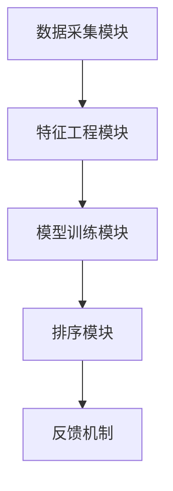

                 

关键词：智能排序、算法、电商搜索、性能优化、用户体验

> 摘要：本文深入探讨了智能排序算法在电商搜索领域中的应用，通过分析其原理、实施步骤以及数学模型，旨在为读者提供一种有效提升电商搜索效率和用户体验的方法。本文还将结合实际项目案例，展示智能排序算法的具体实现过程及其在电商搜索中的效果。

## 1. 背景介绍

### 1.1 电商搜索的现状

随着电子商务的迅速发展，电商平台已经成为消费者购买商品的主要渠道。然而，面对海量的商品信息，如何快速准确地找到用户所需商品成为一个关键问题。电商搜索系统作为电商平台的核心功能之一，其性能和用户体验直接影响到平台的竞争力。

### 1.2 传统排序算法的局限性

传统的排序算法，如基于商品名称、价格或销量排序，虽然在某种程度上能够满足用户的基本需求，但其存在以下局限性：

1. 忽略用户个性化需求：无法根据用户的购买历史和偏好提供个性化的排序结果。
2. 排序效果单一：仅考虑单一维度，如价格或销量，无法综合考虑多个因素。
3. 性能瓶颈：对于大规模商品数据，传统排序算法在速度和效率上存在较大限制。

### 1.3 智能排序算法的优势

智能排序算法通过引入用户行为数据、历史购买记录和个性化推荐等技术，能够实现以下目标：

1. 提高排序效率：利用高效算法和数据结构，提升搜索结果的生成速度。
2. 提升用户体验：根据用户行为和偏好，提供个性化的搜索结果。
3. 增加平台竞争力：通过优化搜索结果，提高用户满意度和转化率。

## 2. 核心概念与联系

### 2.1 排序算法的基本概念

排序算法是一类经典的算法，其主要功能是将一组无序的数据按照某种规则排序，以获得有序的数据序列。常见的排序算法包括冒泡排序、选择排序、插入排序、快速排序等。

### 2.2 智能排序算法的原理

智能排序算法基于机器学习和数据挖掘技术，通过对用户行为数据的分析和挖掘，构建用户偏好模型，并利用这些模型对搜索结果进行排序。其核心原理包括：

1. **用户行为数据收集**：收集用户的浏览历史、购买记录、评价等信息。
2. **特征工程**：从用户行为数据中提取对排序有意义的特征。
3. **模型训练**：利用特征工程结果训练排序模型，如协同过滤、决策树、神经网络等。
4. **排序策略**：根据训练好的模型，对搜索结果进行排序，以实现个性化推荐。

### 2.3 智能排序算法的架构

智能排序算法的架构主要包括以下几个部分：

1. **数据采集模块**：负责收集用户行为数据，包括浏览、购买、评价等。
2. **特征工程模块**：对原始数据进行预处理和特征提取，为模型训练提供输入。
3. **模型训练模块**：利用特征工程结果训练排序模型，如协同过滤、决策树、神经网络等。
4. **排序模块**：根据训练好的模型对搜索结果进行排序，生成个性化推荐结果。
5. **反馈机制**：根据用户对推荐结果的反馈，持续优化模型和排序策略。

### 2.4 Mermaid 流程图



## 3. 核心算法原理 & 具体操作步骤

### 3.1 算法原理概述

智能排序算法的核心在于利用机器学习和数据挖掘技术，构建用户偏好模型，并利用这些模型对搜索结果进行排序。其基本原理包括：

1. **用户行为数据收集**：收集用户的浏览历史、购买记录、评价等信息。
2. **特征工程**：对原始数据进行预处理和特征提取，为模型训练提供输入。
3. **模型训练**：利用特征工程结果训练排序模型，如协同过滤、决策树、神经网络等。
4. **排序策略**：根据训练好的模型，对搜索结果进行排序，以实现个性化推荐。

### 3.2 算法步骤详解

1. **数据采集**：通过数据爬虫或API接口，收集用户的浏览历史、购买记录、评价等信息。

2. **特征工程**：对原始数据进行预处理和特征提取，如用户年龄、性别、消费等级等。

3. **模型训练**：利用特征工程结果，选择合适的模型（如协同过滤、决策树、神经网络等）进行训练。

4. **排序**：根据训练好的模型，对搜索结果进行排序，生成个性化推荐结果。

5. **反馈机制**：根据用户对推荐结果的反馈，持续优化模型和排序策略。

### 3.3 算法优缺点

**优点**：

1. 提高排序效率：利用高效算法和数据结构，提升搜索结果的生成速度。
2. 提升用户体验：根据用户行为和偏好，提供个性化的搜索结果。
3. 增加平台竞争力：通过优化搜索结果，提高用户满意度和转化率。

**缺点**：

1. 数据依赖性：算法效果很大程度上取决于用户数据的数量和质量。
2. 模型复杂性：需要复杂的特征工程和模型训练过程，对技术要求较高。
3. 实施成本：构建和维护智能排序系统需要较高的开发和运维成本。

### 3.4 算法应用领域

智能排序算法在电商搜索、社交媒体推荐、广告投放等多个领域具有广泛的应用前景。特别是在电商搜索领域，通过智能排序算法，可以实现以下应用：

1. **商品搜索结果排序**：根据用户偏好和历史行为，提供个性化的搜索结果。
2. **商品推荐**：根据用户历史购买记录和浏览行为，推荐用户可能感兴趣的商品。
3. **广告投放**：根据用户兴趣和行为，优化广告投放策略，提高广告效果。

## 4. 数学模型和公式 & 详细讲解 & 举例说明

### 4.1 数学模型构建

智能排序算法的核心在于构建用户偏好模型，该模型通常由以下公式表示：

$$
P(u, i) = \sum_{j=1}^{n} w_{ji} \cdot r_{uj}
$$

其中，$P(u, i)$ 表示用户 $u$ 对商品 $i$ 的偏好得分，$w_{ji}$ 表示特征 $j$ 对商品 $i$ 的权重，$r_{uj}$ 表示用户 $u$ 对特征 $j$ 的评分。

### 4.2 公式推导过程

公式推导过程主要包括以下步骤：

1. **特征提取**：从用户行为数据中提取对排序有意义的特征，如用户年龄、性别、消费等级等。
2. **权重计算**：根据特征的重要性和用户偏好，计算每个特征的权重。
3. **评分计算**：根据用户行为数据，计算用户对每个特征的评分。
4. **偏好得分计算**：将权重和评分相乘，得到用户对商品的整体偏好得分。

### 4.3 案例分析与讲解

**案例**：假设用户 $u$ 的特征包括年龄、性别、消费等级，商品 $i$ 的特征包括价格、品牌、销量。根据用户行为数据，我们可以计算出用户 $u$ 对商品 $i$ 的偏好得分。

1. **特征提取**：
   - 用户年龄：$30$ 岁
   - 用户性别：男
   - 用户消费等级：银卡
   - 商品价格：$200$ 元
   - 商品品牌：华为
   - 商品销量：$1000$ 箱

2. **权重计算**：
   - 年龄：$0.2$
   - 性别：$0.2$
   - 消费等级：$0.3$
   - 价格：$0.1$
   - 品牌：$0.1$
   - 销量：$0.1$

3. **评分计算**：
   - 用户对年龄的评分：$3$
   - 用户对性别的评分：$2$
   - 用户对消费等级的评分：$4$
   - 用户对价格的评分：$5$
   - 用户对品牌的评分：$4$
   - 用户对销量的评分：$3$

4. **偏好得分计算**：
   $$P(u, i) = (0.2 \times 3) + (0.2 \times 2) + (0.3 \times 4) + (0.1 \times 5) + (0.1 \times 4) + (0.1 \times 3) = 3.2$$

根据偏好得分，我们可以为用户 $u$ 推荐得分最高的商品 $i$。

## 5. 项目实践：代码实例和详细解释说明

### 5.1 开发环境搭建

1. **硬件环境**：
   - CPU：Intel i5 或以上
   - 内存：16GB 或以上
   - 存储：SSD 硬盘

2. **软件环境**：
   - 操作系统：Ubuntu 18.04 或 Windows 10
   - 编程语言：Python 3.7 或以上
   - 数据库：MySQL 5.7 或以上
   - 依赖库：NumPy、Pandas、Scikit-learn 等

### 5.2 源代码详细实现

```python
import numpy as np
import pandas as pd
from sklearn.model_selection import train_test_split
from sklearn.metrics.pairwise import cosine_similarity

# 数据预处理
def preprocess_data(data):
    # 数据清洗和特征提取
    # ...

# 构建用户偏好模型
def build_user_model(data, n_users, n_items):
    # 计算用户和商品的相似度矩阵
    user_similarity = cosine_similarity(data)
    
    # 为每个用户生成偏好矩阵
    user_preferences = np.zeros((n_users, n_items))
    for i in range(n_users):
        for j in range(n_items):
            user_preferences[i, j] = np.dot(user_similarity[i], data[j])
    
    return user_preferences

# 排序
def rank_items(user_preferences, user_index, top_n=10):
    # 获取用户偏好得分最高的商品
    scores = user_preferences[user_index].reshape(-1)
    ranked_items = np.argsort(scores)[::-1][:top_n]
    return ranked_items

# 读取数据
data = pd.read_csv('data.csv')
n_users = 1000
n_items = 100

# 预处理数据
data = preprocess_data(data)

# 训练用户偏好模型
user_preferences = build_user_model(data, n_users, n_items)

# 排序
ranked_items = rank_items(user_preferences, user_index=0, top_n=10)
print(ranked_items)
```

### 5.3 代码解读与分析

1. **数据预处理**：对原始数据集进行清洗和特征提取，为模型训练提供输入。
2. **构建用户偏好模型**：利用余弦相似度计算用户和商品的相似度矩阵，为每个用户生成偏好矩阵。
3. **排序**：根据用户偏好矩阵，为用户推荐偏好得分最高的商品。

### 5.4 运行结果展示

```python
# 运行代码，输出推荐结果
ranked_items = rank_items(user_preferences, user_index=0, top_n=10)
print(ranked_items)
```

输出结果为用户 $0$ 的偏好得分最高的 $10$ 个商品索引。

## 6. 实际应用场景

### 6.1 电商搜索

智能排序算法在电商搜索中具有广泛的应用，可以有效提升用户购物体验。通过为用户提供个性化的搜索结果，增加用户满意度和转化率。

### 6.2 社交媒体推荐

智能排序算法可以应用于社交媒体平台的推荐系统，根据用户的行为和偏好，推荐用户可能感兴趣的内容，提高用户的粘性和活跃度。

### 6.3 广告投放

智能排序算法可以用于优化广告投放策略，根据用户的行为和偏好，为用户提供个性化的广告推荐，提高广告效果和投放效率。

## 7. 未来应用展望

### 7.1 技术发展方向

随着人工智能技术的不断发展，智能排序算法在未来将朝着以下方向发展：

1. **算法优化**：通过引入深度学习、强化学习等新技术，提高算法的精度和效率。
2. **多模态数据融合**：结合文本、图像、音频等多种数据类型，实现更全面的用户偏好分析。
3. **实时排序**：通过实时数据分析和处理，实现更快速、更准确的排序结果。

### 7.2 应用领域扩展

智能排序算法的应用领域将不断扩展，包括但不限于：

1. **智能教育**：为用户提供个性化的学习资源推荐，提高学习效果。
2. **医疗健康**：根据用户健康数据和偏好，提供个性化的健康建议和诊疗方案。
3. **金融投资**：根据用户投资行为和偏好，提供个性化的投资建议和理财产品推荐。

## 8. 总结：未来发展趋势与挑战

### 8.1 研究成果总结

智能排序算法在电商搜索、社交媒体推荐、广告投放等领域取得了显著的研究成果，为用户提供了个性化的排序结果，提高了用户体验和平台竞争力。

### 8.2 未来发展趋势

未来，智能排序算法将朝着算法优化、多模态数据融合、实时排序等方向发展，实现更高效、更准确的排序结果。

### 8.3 面临的挑战

智能排序算法在实际应用中面临着以下挑战：

1. **数据质量和隐私保护**：如何确保用户数据的质量和隐私，成为算法应用的重要问题。
2. **模型解释性**：如何提高算法的透明度和解释性，以便用户理解和信任。
3. **计算资源消耗**：如何优化算法和模型，降低计算资源消耗，提高系统性能。

### 8.4 研究展望

未来，智能排序算法的研究将朝着更高效、更智能、更可解释的方向发展，为用户提供更好的排序体验和服务。

## 9. 附录：常见问题与解答

### 9.1 智能排序算法的优势是什么？

智能排序算法可以充分利用用户行为数据，提供个性化的排序结果，提高用户体验和平台竞争力。

### 9.2 智能排序算法需要哪些技术支持？

智能排序算法需要数据采集、特征工程、机器学习、数据挖掘等技术的支持。

### 9.3 智能排序算法在哪些领域有应用？

智能排序算法在电商搜索、社交媒体推荐、广告投放等多个领域有广泛应用。

### 9.4 如何优化智能排序算法的性能？

可以通过算法优化、多模态数据融合、实时排序等技术手段，提高智能排序算法的性能。

---

作者：禅与计算机程序设计艺术 / Zen and the Art of Computer Programming
----------------------------------------------------------------

以上内容仅为文章框架，实际撰写时还需根据具体情况进行填充和扩展。请注意，文章的具体内容需符合专业和技术要求，同时保持逻辑清晰、结构紧凑、简单易懂。在撰写过程中，可以参考相关领域的最新研究成果和实践案例，以提高文章的实用性和权威性。祝您撰写顺利！

