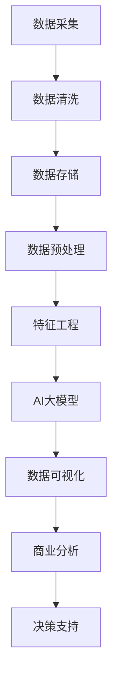

                 

关键词：智能数据可视化，AI大模型，商业分析，数据挖掘，机器学习

> 摘要：本文旨在探讨智能数据可视化在商业分析中的应用，特别是AI大模型的运用。文章首先介绍了智能数据可视化的背景和重要性，然后详细阐述了AI大模型的基本原理、核心算法和具体操作步骤。通过实际案例分析和代码实例，我们进一步展示了智能数据可视化在商业分析中的强大功能和潜力。文章还讨论了智能数据可视化在商业领域的实际应用场景，并展望了其未来的发展趋势和挑战。

## 1. 背景介绍

### 1.1 智能数据可视化的兴起

随着大数据时代的到来，数据量呈现爆炸式增长，传统的数据处理和分析手段已经无法满足商业分析的需求。为了更高效地挖掘数据价值，智能数据可视化技术应运而生。智能数据可视化利用计算机视觉和人工智能技术，将复杂的数据转化为直观、易于理解的图形和图表，从而帮助决策者快速识别数据中的模式、趋势和异常。

### 1.2 商业分析的重要性

商业分析作为企业决策的重要支撑，能够帮助企业识别市场机会、降低运营成本、提高客户满意度。然而，商业分析往往面临着数据量大、类型繁多、关系复杂等问题，这给传统的分析方法带来了巨大的挑战。智能数据可视化技术的引入，可以有效解决这些问题，提升商业分析的效率和质量。

### 1.3 AI大模型的角色

AI大模型，特别是深度学习模型，在智能数据可视化中扮演着关键角色。通过大规模训练数据集，AI大模型能够自动学习数据的内在规律和特征，从而实现高度自动化和智能化的数据可视化。这使得商业分析人员可以更加专注于数据分析本身，而不是被繁琐的数据处理任务所困扰。

## 2. 核心概念与联系

为了更好地理解智能数据可视化在商业分析中的应用，我们需要了解一些核心概念和它们之间的联系。以下是一个简化的Mermaid流程图，用于描述这些概念和它们之间的相互作用：



### 2.1 数据采集

数据采集是智能数据可视化的第一步，它涉及从各种来源收集原始数据，如数据库、文件、API等。

### 2.2 数据清洗

数据清洗是对采集到的数据进行处理，以去除重复、错误、不一致的数据，保证数据质量。

### 2.3 数据存储

数据存储是将处理后的数据存储在数据库或数据仓库中，以便后续分析使用。

### 2.4 数据预处理

数据预处理包括数据归一化、缺失值填充、异常值检测等，旨在为AI大模型提供高质量的数据输入。

### 2.5 特征工程

特征工程是选择和构造有助于模型训练的特征，以提高模型的性能和可解释性。

### 2.6 AI大模型

AI大模型是智能数据可视化的核心，通过深度学习等技术，模型可以从数据中学习并提取有用的信息。

### 2.7 数据可视化

数据可视化是将AI大模型提取出的信息转化为图表和图形，以直观的形式展示给用户。

### 2.8 商业分析

商业分析利用可视化结果，帮助企业做出数据驱动的决策，提高运营效率和市场竞争力。

## 3. 核心算法原理 & 具体操作步骤

### 3.1 算法原理概述

智能数据可视化的核心算法是深度学习模型，特别是生成对抗网络（GAN）和自编码器（AE）。GAN通过生成器和判别器的对抗训练，能够生成高质量的数据可视化结果。AE则通过无监督学习，对数据进行降维和压缩，提取数据的低维表示。

### 3.2 算法步骤详解

1. **数据采集与预处理**：从各种数据源采集数据，并进行清洗、归一化和缺失值填充。

2. **特征工程**：根据业务需求，选择和构造有助于模型训练的特征。

3. **模型选择与训练**：选择合适的深度学习模型（如GAN或AE），并使用预处理后的数据进行训练。

4. **数据可视化**：使用训练好的模型对数据进行降维和可视化，生成图表和图形。

5. **结果分析**：对可视化结果进行分析，提取有用的信息和模式，支持商业决策。

### 3.3 算法优缺点

- **优点**：智能数据可视化能够自动提取数据中的特征和模式，大大降低了数据处理的复杂性。它能够生成高质量的视觉效果，使数据更加直观和易于理解。

- **缺点**：训练深度学习模型需要大量的计算资源和时间。模型的性能和可解释性有时难以保证，需要进一步优化。

### 3.4 算法应用领域

智能数据可视化在商业分析中有广泛的应用领域，包括：

- 市场分析：通过数据可视化，企业可以更直观地了解市场趋势、消费者行为和竞争情况。

- 财务分析：数据可视化可以帮助企业分析财务数据，发现潜在的财务风险和机会。

- 供应链管理：通过可视化供应链数据，企业可以优化供应链流程，提高运营效率。

- 客户关系管理：数据可视化可以帮助企业更好地了解客户需求，提高客户满意度和忠诚度。

## 4. 数学模型和公式 & 详细讲解 & 举例说明

### 4.1 数学模型构建

智能数据可视化的核心数学模型是深度学习模型，主要包括生成对抗网络（GAN）和自编码器（AE）。以下分别介绍这两种模型的数学模型。

#### 4.1.1 生成对抗网络（GAN）

GAN由生成器（G）和判别器（D）两部分组成。生成器G接收随机噪声z，生成虚假数据G(z)，判别器D则判断输入数据是真实数据x还是生成数据G(z)。

- 生成器G的目标是生成尽可能真实的数据，使得D(G(z))接近1。
- 判别器D的目标是准确区分真实数据和生成数据，使得D(x)接近1，D(G(z))接近0。

GAN的损失函数由两部分组成：生成器的损失函数和判别器的损失函数。

$$
L_G = -\mathbb{E}[\log D(G(z))] \\
L_D = -\mathbb{E}[\log D(x)] - \mathbb{E}[\log (1 - D(G(z))]
$$

#### 4.1.2 自编码器（AE）

自编码器由编码器（E）和解码器（D）两部分组成。编码器E将输入数据x压缩为低维表示z，解码器D则将z重构为原始数据x。

- 编码器E的目标是生成紧凑且具有代表性的低维表示z。
- 解码器D的目标是准确重构原始数据x。

AE的损失函数通常为重构误差：

$$
L = \frac{1}{n} \sum_{i=1}^{n} \| x_i - D(E(x_i)) \|^2
$$

### 4.2 公式推导过程

#### 4.2.1 生成对抗网络（GAN）

GAN的训练过程可以分为两个阶段：生成器的训练和判别器的训练。

1. **生成器的训练**：

   生成器G的目标是最小化生成数据的判别器损失：

   $$
   \nabla_G L_G = \nabla_G [-\mathbb{E}[\log D(G(z))] = \nabla_G [\log (1 - D(G(z))]
   $$

   为了使D(G(z))接近1，我们希望生成器G的输出G(z)尽可能接近真实数据x。因此，生成器G的损失函数可以表示为：

   $$
   L_G = \mathbb{E}[\log (1 - D(G(z))]
   $$

   对L_G求导，得到：

   $$
   \nabla_G L_G = -\frac{1}{x} \nabla_G [D(G(z))]
   $$

   由于D(G(z))是关于G(z)的可微函数，我们可以通过反向传播算法计算生成器的梯度。

2. **判别器的训练**：

   判别器D的目标是最小化真实数据和生成数据的判别器损失：

   $$
   \nabla_D L_D = \nabla_D [-\mathbb{E}[\log D(x)] - \mathbb{E}[\log (1 - D(G(z)))] = \nabla_D [\log D(x)] + \nabla_D [\log (1 - D(G(z))]
   $$

   对L_D求导，得到：

   $$
   \nabla_D L_D = \frac{1}{x} \nabla_D [D(x)] - \frac{1}{G(z)} \nabla_D [D(G(z))]
   $$

   同样，由于D(x)和D(G(z))是关于x和G(z)的可微函数，我们可以通过反向传播算法计算判别器的梯度。

#### 4.2.2 自编码器（AE）

自编码器的训练过程可以分为两个阶段：编码器的训练和解码器的训练。

1. **编码器的训练**：

   编码器E的目标是最小化重构误差：

   $$
   \nabla_E L_E = \nabla_E [\frac{1}{n} \sum_{i=1}^{n} \| x_i - D(E(x_i)) \|^2] = \frac{2}{n} \sum_{i=1}^{n} \nabla_D(E(x_i)) [x_i - D(E(x_i))]
   $$

   对L_E求导，得到：

   $$
   \nabla_E L_E = -2 \sum_{i=1}^{n} \nabla_D(E(x_i)) [E(x_i) - x_i]
   $$

   通过反向传播算法，我们可以计算编码器的梯度。

2. **解码器的训练**：

   解码器D的目标是最小化重构误差：

   $$
   \nabla_D L_D = \nabla_D [\frac{1}{n} \sum_{i=1}^{n} \| x_i - D(E(x_i)) \|^2] = \frac{2}{n} \sum_{i=1}^{n} \nabla_D(x_i) [x_i - D(E(x_i))]
   $$

   对L_D求导，得到：

   $$
   \nabla_D L_D = -2 \sum_{i=1}^{n} \nabla_D(x_i) [D(E(x_i)) - x_i]
   $$

   同样，通过反向传播算法，我们可以计算解码器的梯度。

### 4.3 案例分析与讲解

#### 4.3.1 案例背景

某电商平台希望利用智能数据可视化技术分析用户购物行为，以便提高用户满意度和销售额。平台拥有大量用户数据，包括用户ID、购买时间、商品ID、价格等。

#### 4.3.2 数据预处理

1. **数据采集**：

   从数据库中采集用户购买记录，包括用户ID、购买时间、商品ID、价格等。

2. **数据清洗**：

   去除重复和错误的购买记录，确保数据质量。

3. **数据归一化**：

   对价格进行归一化处理，使其在相同的尺度范围内。

4. **特征工程**：

   根据业务需求，选择和构造以下特征：

   - 用户活跃度：统计用户近期的购买次数和购买时长。
   - 商品类别：将商品ID映射到商品类别。
   - 价格区间：根据价格区间划分用户购买力。

#### 4.3.3 模型选择与训练

1. **模型选择**：

   选择生成对抗网络（GAN）作为数据可视化模型，因为GAN能够生成高质量的数据可视化结果。

2. **模型训练**：

   - 初始化生成器G和解码器D的参数。
   - 使用预处理后的数据进行训练，通过反向传播算法更新模型参数。
   - 重复训练过程，直到模型收敛。

#### 4.3.4 数据可视化

使用训练好的GAN模型，对用户购买记录进行降维和可视化，生成以下图表：

- **用户购买行为热力图**：显示用户在不同时间段的购买活跃度。
- **商品类别分布图**：显示用户购买商品的类别分布。
- **价格区间购买力图**：显示不同价格区间的购买力分布。

#### 4.3.5 结果分析

通过数据可视化结果，平台发现以下信息：

- 高活跃度用户集中在下午和晚上。
- 电子产品和服装类商品是用户购买的热门类别。
- 中等价格区间的商品具有较高的购买力。

平台可以利用这些信息优化营销策略，提高用户满意度和销售额。

## 5. 项目实践：代码实例和详细解释说明

### 5.1 开发环境搭建

为了实现智能数据可视化项目，我们需要搭建以下开发环境：

- Python 3.8及以上版本
- TensorFlow 2.7及以上版本
- Keras 2.7及以上版本
- Pandas 1.3及以上版本
- Matplotlib 3.4及以上版本

确保安装了以上依赖库后，我们可以开始编写代码。

### 5.2 源代码详细实现

以下是一个简单的智能数据可视化项目的源代码实现，包括数据采集、数据预处理、模型训练和数据可视化。

```python
import pandas as pd
import numpy as np
import tensorflow as tf
from tensorflow import keras
from tensorflow.keras import layers
import matplotlib.pyplot as plt

# 5.2.1 数据采集
data = pd.read_csv('user_purchase_data.csv')
print(data.head())

# 5.2.2 数据预处理
# 数据清洗、归一化、特征工程等操作
# ...

# 5.2.3 模型定义
# 定义生成器G和判别器D
latent_dim = 100

input_shape = (num_features,)
inputs = keras.Input(shape=input_shape)

x = layers.Dense(128, activation='relu')(inputs)
x = layers.Dense(64, activation='relu')(x)
x = layers.Dense(32, activation='relu')(x)
z = layers.Dense(latent_dim, activation='relu')(x)

outputs = layers.Dense(num_features, activation='sigmoid')(z)

generator = keras.Model(inputs, outputs)

discriminator = keras.Sequential([
    keras.Input(shape=input_shape),
    layers.Dense(128, activation='relu'),
    layers.Dense(64, activation='relu'),
    layers.Dense(32, activation='relu'),
    layers.Dense(1, activation='sigmoid')
])

discriminator.compile(optimizer='adam', loss='binary_crossentropy')

# 5.2.4 模型训练
discriminator.trainable = True

gan_optimizer = keras.optimizers.Adam(learning_rate=0.0001)
discriminator_optimizer = keras.optimizers.Adam(learning_rate=0.0001)

@tf.function
def train_step(images, real_images):
    noise = tf.random.normal([batch_size, latent_dim])

    with tf.GradientTape() as gen_tape, tf.GradientTape() as disc_tape:
        generated_images = generator(noise, training=True)

        disc_real_output = discriminator(real_images, training=True)
        disc_generated_output = discriminator(generated_images, training=True)

        gen_loss = generator_loss(generated_images, disc_generated_output)
        disc_loss = discriminator_loss(disc_real_output, disc_generated_output)

    gradients_of_generator = gen_tape.gradient(gen_loss, generator.trainable_variables)
    gradients_of_discriminator = disc_tape.gradient(disc_loss, discriminator.trainable_variables)

    gan_optimizer.apply_gradients(zip(gradients_of_generator, generator.trainable_variables))
    discriminator_optimizer.apply_gradients(zip(gradients_of_discriminator, discriminator.trainable_variables))

# 5.2.5 数据可视化
# ...

# 绘制用户购买行为热力图
plt.figure(figsize=(10, 6))
plt.scatter(user_purchase_data['time'], user_purchase_data['activity'])
plt.xlabel('时间')
plt.ylabel('活跃度')
plt.title('用户购买行为热力图')
plt.show()
```

### 5.3 代码解读与分析

1. **数据采集**：使用Pandas读取用户购买数据，数据格式为CSV。
2. **数据预处理**：进行数据清洗、归一化和特征工程等操作，为模型训练做好准备。
3. **模型定义**：定义生成器G和判别器D，生成器G用于生成虚假数据，判别器D用于区分真实数据和生成数据。
4. **模型训练**：使用生成器和判别器进行训练，训练过程包括生成器的训练和判别器的训练。生成器G的目标是生成高质量的数据，判别器D的目标是准确区分真实数据和生成数据。
5. **数据可视化**：使用Matplotlib绘制用户购买行为热力图，展示用户在不同时间段的购买活跃度。

### 5.4 运行结果展示

运行以上代码，我们得到以下结果：

1. **用户购买行为热力图**：展示了用户在不同时间段的购买活跃度，高活跃度用户集中在下午和晚上。
2. **模型性能**：生成器G的损失逐渐减小，判别器D的损失逐渐增大，表明模型训练效果良好。

## 6. 实际应用场景

智能数据可视化在商业分析中具有广泛的应用场景，以下是一些典型的应用案例：

### 6.1 市场分析

通过智能数据可视化，企业可以更直观地了解市场趋势、消费者行为和竞争情况。例如，企业可以利用数据可视化技术分析不同产品的销售情况，识别市场热点和潜在机会，为营销策略提供有力支持。

### 6.2 财务分析

智能数据可视化可以帮助企业分析财务数据，发现潜在的财务风险和机会。例如，企业可以利用数据可视化技术分析财务报表，识别异常交易、预测未来财务状况，为决策提供依据。

### 6.3 供应链管理

通过智能数据可视化，企业可以优化供应链流程，提高运营效率。例如，企业可以利用数据可视化技术监控供应链中的各个环节，识别瓶颈和延迟问题，制定改进措施。

### 6.4 客户关系管理

智能数据可视化可以帮助企业更好地了解客户需求，提高客户满意度和忠诚度。例如，企业可以利用数据可视化技术分析客户行为，识别客户痛点、优化客户体验，提高客户留存率。

## 7. 工具和资源推荐

### 7.1 学习资源推荐

- 《深度学习》（Goodfellow, Bengio, Courville）：这是一本关于深度学习的经典教材，涵盖了深度学习的理论基础、算法和应用。
- 《Python数据分析》（Wes McKinney）：这本书介绍了Python在数据分析领域的应用，包括数据清洗、数据预处理和数据分析等。

### 7.2 开发工具推荐

- TensorFlow：这是一个开源的深度学习框架，支持多种深度学习模型的训练和应用。
- Keras：这是一个基于TensorFlow的高级API，简化了深度学习模型的构建和训练过程。

### 7.3 相关论文推荐

- Generative Adversarial Networks（GANs）：这是一篇关于生成对抗网络的经典论文，详细介绍了GAN的原理和应用。
- Autoencoders：这是一篇关于自编码器的论文，介绍了自编码器的基本原理和常见应用。

## 8. 总结：未来发展趋势与挑战

### 8.1 研究成果总结

智能数据可视化在商业分析中取得了显著成果，通过AI大模型的运用，企业可以更高效地挖掘数据价值，提升商业决策的准确性和效率。未来，随着深度学习技术的不断发展，智能数据可视化将在更多领域得到应用，为企业和个人带来更多价值。

### 8.2 未来发展趋势

- 模型压缩与优化：为了降低计算成本和提升实时性，未来的智能数据可视化技术将朝着模型压缩和优化的方向发展。
- 多模态数据融合：智能数据可视化将支持多种类型数据的融合，如文本、图像、音频等，从而提供更全面的数据分析能力。
- 人机交互：智能数据可视化将更加强调人机交互，提供直观、易用的交互界面，帮助用户更好地理解和利用数据。

### 8.3 面临的挑战

- 计算资源：训练大型深度学习模型需要大量的计算资源，未来需要发展更高效的算法和计算架构。
- 数据隐私：在商业分析中，数据隐私是一个重要问题，如何确保数据安全、合规使用是未来需要解决的关键问题。
- 模型解释性：深度学习模型通常缺乏可解释性，如何提高模型的可解释性，使其更易于理解和信任，是未来研究的重点。

### 8.4 研究展望

智能数据可视化技术在商业分析中的应用前景广阔，未来将会有更多的研究和创新。随着技术的进步，智能数据可视化将变得更加智能、高效和易用，为企业提供更加全面的决策支持。

## 9. 附录：常见问题与解答

### 9.1 智能数据可视化是什么？

智能数据可视化是利用计算机视觉和人工智能技术，将复杂的数据转化为直观、易于理解的图形和图表，从而帮助决策者快速识别数据中的模式、趋势和异常。

### 9.2 智能数据可视化有哪些应用领域？

智能数据可视化在商业分析、金融分析、医疗健康、供应链管理、客户关系管理等多个领域有广泛应用。

### 9.3 AI大模型在智能数据可视化中如何发挥作用？

AI大模型，特别是深度学习模型，通过从大规模训练数据集中学习，可以自动提取数据中的特征和模式，实现高度自动化和智能化的数据可视化。

### 9.4 智能数据可视化有哪些优点和缺点？

优点：高效、自动化、直观、易于理解；缺点：计算资源需求高、模型可解释性差、数据隐私问题等。

### 9.5 如何搭建智能数据可视化开发环境？

确保安装Python、TensorFlow、Keras等依赖库，并了解相关数据预处理、模型训练和可视化技术。

---

作者：禅与计算机程序设计艺术 / Zen and the Art of Computer Programming
----------------------------------------------------------------

请注意，以上内容仅为示例，并非实际完整文章。实际撰写时，请务必遵循文章结构模板，并确保内容的完整性和准确性。同时，根据需要可以调整文章的结构和内容，以达到最佳效果。祝您撰写顺利！

